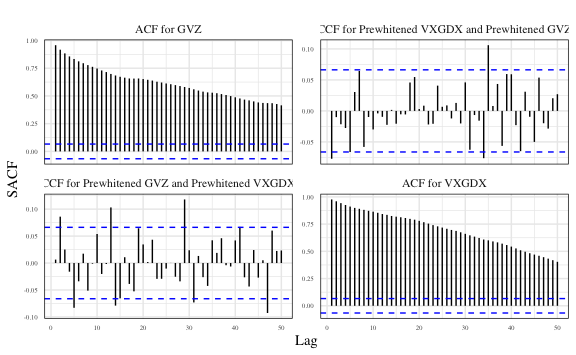
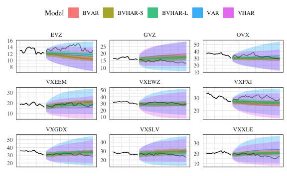

Empirical Analysis
================
Young Geun Kim
11 Jun, 2022

-   [Data](#data)
    -   [Split](#split)
    -   [Long-range dependency](#long-range-dependency)
        -   [Plot](#plot)
-   [Model](#model)
    -   [VAR](#var)
    -   [VHAR](#vhar)
    -   [BVAR](#bvar)
    -   [BVHAR-S](#bvhar-s)
    -   [BVHAR-L](#bvhar-l)
    -   [Hyperparamers](#hyperparamers)
-   [Errors](#errors)
    -   [Relative Errors](#relative-errors)
    -   [Piecewise Errors](#piecewise-errors)
-   [Intervals](#intervals)

``` r
etf_data <- "../data/processed/cboe_etf.rds"
```

``` r
# tidyverse----------------------------
library(tidyverse)
# BVHAR custom package-----------------
library(bvhar)
# Set the number of processor cores----
cl <- parallel::makeCluster(8, type = "FORK")
# set seed for reproducible result-----
set.seed(1)
# width of figure when save------------
fig_width <- 20
```

``` r
# result table-------------------------
source("report-fns.R")
# hyperparameter setting table---------
source("param-fns.R")
# CBOE ETF raw data--------------------
etf_raw <- readRDS(etf_data)
```

# Data

## Split

``` r
(h <- 30)
#> [1] 30
```

-   2000: Dot-com bubble
-   2001: September 11 terror and Enron scandal
-   2002: Stock market downturn after 2001
-   2003: Iraq war (until 2011)
-   2007 to 2008: Financial crisis
    -   2007: Subprime mortgage crisis
    -   2008: Bankruptcy of Lehman Brothers
-   2010 to 2016: European sovereign dept crisis
    -   2010: Greek debt crisis
    -   2011: *Italian default*
    -   2015: *Greek default*
    -   2016: Brexit
-   2018: US-China trade war
-   2019: Brexit
-   2020: COVID-19

``` r
te_date <- tail(etf_raw$data_wide$date, h)[1]
data_plt <- 
  etf_raw$data_long %>% 
  mutate(
    train = date < te_date,
    series_id = str_remove_all(series_id, pattern = "CLS$"),
    xmin = min(date[train == FALSE]),
    xmax = max(date)
  ) %>% 
  ggplot(aes(x = date, y = value)) +
  geom_rect(
    aes(xmin = xmin, xmax = xmax, ymin = -Inf, ymax = Inf),
    alpha = .7,
    fill = "grey" # test set
  ) +
  geom_path() +
  facet_grid(series_id ~ ., scales = "free_y") +
  theme_minimal() +
  theme(
    panel.border = element_rect(fill = NA),
    # strip.text = element_text(size = 5),
    axis.text.y = element_text(size = 5)
  ) +
  labs(
    x = element_blank(),
    y = "Volatility index"
  )
data_plt
```


``` r
ggsave(
  filename = "../output/figs/analysis-dataplot.pdf", 
  plot = data_plt,
  device = "pdf",
  scale = .618,
  width = fig_width, 
  units = "in",
  dpi = 1500,
  limitsize = FALSE
)
#> Saving 12.4 x 2.29 in image
```

``` r
etf_split <- 
  divide_ts(
    etf_vix %>% rename_with(~str_remove_all(., pattern = "CLS$")), 
    h
  )
etf_train <- etf_split$train
etf_test <- etf_split$test
```

## Long-range dependency

### Plot

ACF:

``` r
gvz_acf <- 
  etf_train %>% 
  select(GVZ) %>% 
  forecast::ggAcf(lag.max = 50) +
  theme_minimal() +
  theme(
    panel.border = element_rect(fill = NA),
    axis.text.y = element_text(size = 5),
    axis.text.x = element_text(size = 5)
  ) +
  labs(title = element_blank())
#> Registered S3 method overwritten by 'quantmod':
#>   method            from
#>   as.zoo.data.frame zoo
gvz_acf
```


``` r
ovx_acf <- 
  etf_train %>% 
  select(OVX) %>% 
  forecast::ggAcf(lag.max = 50) +
  theme_minimal() +
  theme(
    panel.border = element_rect(fill = NA),
    axis.text.y = element_text(size = 5),
    axis.text.x = element_text(size = 5)
  ) +
  labs(title = element_blank())
ovx_acf
```


Prewhitening for CCF:

``` r
gvz_ar <- forecast::Arima(etf_train$GVZ, order = c(30L, 0L, 0L), include.mean = FALSE, include.drift = FALSE)
ovx_ar <- forecast::Arima(etf_train$OVX, order = c(30L, 0L, 0L), include.mean = FALSE, include.drift = FALSE)
# prewhitening---------------
gvz_resid <- gvz_ar$residuals
ovx_resid <- ovx_ar$residuals
```

CCF:

``` r
resid_ccf <- 
  data.frame(
    Prewhitened_GVZ = gvz_resid,
    Prewhitened_OVX = ovx_resid
  ) %>% 
  forecast::ggAcf(lag.max = 50) +
  theme_minimal() +
  theme(
    panel.border = element_rect(fill = NA),
    axis.text.y = element_text(size = 5),
    axis.text.x = element_text(size = 5)
  ) +
  labs(title = element_blank())
resid_ccf
```



``` r
# acf of GVZ---------------
ggsave(
  filename = "../output/figs/analysis-lrdacf-gvz.pdf", 
  plot = gvz_acf,
  device = "pdf",
  scale = .618,
  width = fig_width, 
  units = "in",
  dpi = 1500,
  limitsize = FALSE
)
#> Saving 12.4 x 2.29 in image
# acf of OVX---------------
ggsave(
  filename = "../output/figs/analysis-lrdacf-ovx.pdf", 
  plot = ovx_acf,
  device = "pdf",
  scale = .618,
  width = fig_width, 
  units = "in",
  dpi = 1500,
  limitsize = FALSE
)
#> Saving 12.4 x 2.29 in image
# ccf after prewhitening---
ggsave(
  filename = "../output/figs/analysis-lrdccf.pdf", 
  plot = resid_ccf,
  device = "pdf",
  scale = .618,
  width = fig_width, 
  units = "in",
  dpi = 1500,
  limitsize = FALSE
)
#> Saving 12.4 x 2.29 in image
```

# Model

## VAR

``` r
choose_var(etf_train, lag_max = 10)
#> $ic
#>      AIC     BIC      HQ     FPE
#> 1  -1.39 -0.9015 -1.2050 -1.2050
#> 2  -1.40 -0.4632 -1.0403 -1.0403
#> 3  -1.43 -0.0467 -0.8979 -0.8979
#> 4  -1.37  0.4529 -0.6729 -0.6729
#> 5  -1.35  0.9208 -0.4801 -0.4801
#> 6  -1.32  1.3935 -0.2829 -0.2829
#> 7  -1.30  1.8662 -0.0864 -0.0864
#> 8  -1.28  2.3290  0.0999  0.0999
#> 9  -1.20  2.8602  0.3542  0.3542
#> 10 -1.17  3.3427  0.5592  0.5592
#> 
#> $min_lag
#> AIC BIC  HQ FPE 
#>   3   1   1   1
```

``` r
(var_lag <- 3)
#> [1] 3
```

``` r
fit_var <- var_lm(etf_train, var_lag)
```

## VHAR

``` r
fit_vhar <- vhar_lm(etf_train)
```

## BVAR

``` r
(bvar_lag <- var_lag)
#> [1] 3
```

``` r
n_asset <- ncol(etf_train)
bvar_init <- set_bvar(
  sigma = apply(etf_train, 2, sd),
  lambda = .2,
  delta = rep(.1, n_asset)
)
```

``` r
(bvar_optim <- choose_bvar(
  bvar_init, 
  lower = c(
    rep(1, n_asset), # sigma
    1e-4, # lambda
    rep(1e-2, n_asset) # delta
  ), 
  upper = c(
    rep(15, n_asset), # sigma
    Inf, # lambda
    rep(1, n_asset) # delta
  ), 
  y = etf_train, 
  p = bvar_lag, 
  include_mean = TRUE,
  parallel = list(cl = cl, forward = FALSE, loginfo = FALSE)
))
#> Model Specification for BVAR
#> 
#> Parameters: Coefficent matrice and Covariance matrix
#> Prior: Minnesota
#> # Type '?bvar_minnesota' in the console for some help.
#> ========================================================
#> 
#> Setting for 'sigma':
#>   GVZCLS    OVXCLS  VXFXICLS  VXEEMCLS  VXSLVCLS    EVZCLS  VXXLECLS  VXGDXCLS  
#>     1.89      6.11      2.49      1.80      4.23      1.30      1.94      5.47  
#> VXEWZCLS  
#>     5.74  
#> 
#> Setting for 'lambda':
#>         
#> 0.0279  
#> 
#> Setting for 'delta':
#>                                                                
#> 0.895  0.976  0.931  0.947  0.881  0.966  0.965  0.943  0.970  
#> 
#> Setting for 'eps':
#> [1]  1e-04
```

``` r
fit_bvar <- bvar_optim$fit
```

## BVHAR-S

``` r
bvhar_init <- set_bvhar(
  sigma = apply(etf_train, 2, sd),
  lambda = .2,
  delta = rep(.1, n_asset)
)
```

``` r
(bvhar_var_optim <- choose_bvhar(
  bvhar_init, 
  lower = c(
    rep(1, n_asset), # sigma
    1e-4, # lambda
    rep(1e-2, n_asset) # delta
  ), 
  upper = c(
    rep(15, n_asset), # sigma
    Inf, # lambda
    rep(1, n_asset) # delta
  ), 
  y = etf_train, 
  har = c(5, 22),
  include_mean = TRUE,
  parallel = list(cl = cl, forward = FALSE, loginfo = FALSE)
))
#> Model Specification for BVHAR
#> 
#> Parameters: Coefficent matrice and Covariance matrix
#> Prior: MN_VAR
#> # Type '?bvhar_minnesota' in the console for some help.
#> ========================================================
#> 
#> Setting for 'sigma':
#>   GVZCLS    OVXCLS  VXFXICLS  VXEEMCLS  VXSLVCLS    EVZCLS  VXXLECLS  VXGDXCLS  
#>     2.36      4.34      2.64      2.38      3.65      1.22      2.47      4.71  
#> VXEWZCLS  
#>     5.30  
#> 
#> Setting for 'lambda':
#>         
#> 0.0332  
#> 
#> Setting for 'delta':
#>                                                                
#> 0.878  0.973  0.936  0.945  0.861  0.956  0.956  0.938  0.973  
#> 
#> Setting for 'eps':
#> [1]  1e-04
```

``` r
fit_bvhar <- bvhar_var_optim$fit
```

## BVHAR-L

``` r
bvhar_vhar_init <- set_weight_bvhar(
  sigma = apply(etf_train, 2, sd),
  lambda = .2,
  daily = rep(.1, n_asset),
  weekly = rep(.1, n_asset),
  monthly = rep(.1, n_asset)
)
```

``` r
(bvhar_vhar_optim <- choose_bvhar(
  bvhar_vhar_init, 
  lower = c(
    rep(1, n_asset), # sigma
    1e-4, # lambda
    rep(1e-2, n_asset), # daily
    rep(1e-2, n_asset), # weekly
    rep(1e-2, n_asset) # monthly
  ), 
  upper = c(
    rep(15, n_asset), # sigma
    Inf, # lambda
    rep(1, n_asset), # daily
    rep(1, n_asset), # weekly
    rep(1, n_asset) # monthly
  ), 
  y = etf_train, 
  har = c(5, 22),
  include_mean = TRUE,
  parallel = list(cl = cl, forward = FALSE, loginfo = FALSE)
))
#> Model Specification for BVHAR
#> 
#> Parameters: Coefficent matrice and Covariance matrix
#> Prior: MN_VHAR
#> # Type '?bvhar_minnesota' in the console for some help.
#> ========================================================
#> 
#> Setting for 'sigma':
#>   GVZCLS    OVXCLS  VXFXICLS  VXEEMCLS  VXSLVCLS    EVZCLS  VXXLECLS  VXGDXCLS  
#>     3.07      9.51      3.25      3.48      5.54      1.00      3.82      7.01  
#> VXEWZCLS  
#>     6.70  
#> 
#> Setting for 'lambda':
#>        
#> 1e-04  
#> 
#> Setting for 'eps':
#> [1]  1e-04
#> 
#> Setting for 'daily':
#>                                                                
#> 0.811  0.913  0.936  0.864  0.766  0.930  0.908  0.846  0.959  
#> 
#> Setting for 'weekly':
#>                                                                         
#> 0.1634  0.1569  0.0171  0.0987  0.2383  0.0100  0.0100  0.2000  0.0100  
#> 
#> Setting for 'monthly':
#>                                                                         
#> 0.2121  0.0100  0.0737  0.2057  0.2335  0.1662  0.1886  0.1019  0.0376
```

``` r
fit_bvhar_vhar <- bvhar_vhar_optim$fit
```

``` r
parallel::stopCluster(cl)
```

## Hyperparamers

# Errors

``` r
mod_list <- list(
  fit_var,
  fit_vhar,
  fit_bvar,
  fit_bvhar,
  fit_bvhar_vhar
)
# 1-step-----------
roll1 <- 
  mod_list %>% 
  parallel::mclapply(
    function(mod) {
      forecast_roll(mod, 1, etf_test)
    },
    mc.cores = 4
  )
# 5-step-----------
roll2 <- 
  mod_list %>% 
  parallel::mclapply(
    function(mod) {
      forecast_roll(mod, 5, etf_test)
    },
    mc.cores = 4
  )
# 20-step----------
roll3 <- 
  mod_list %>% 
  parallel::mclapply(
    function(mod) {
      forecast_roll(mod, 20, etf_test)
    },
    mc.cores = 4
  )
```

``` r
roll_list <- 
  parallel::mclapply(
    c(1, 5, 20),
    function(h) {
      mod_list %>% 
        lapply(
          function(mod) {
            forecast_roll(mod, h, etf_test)
          }
        )
    },
    mc.cores = 8
  )
```

## Relative Errors

``` r
get_rmafetex_tr_2(
  roll_list, 
  etf_test, 
  ahead_list = c("$h = 1$", "$h = 5$", "$h = 20$"), 
  benchmark_id = 1,
  caption = "Out-of-sample forecasting performance measures with VAR(3) as benchmark", 
  label = "losscboe"
) %>% 
  writeLines()
#> \begin{table}[H]
#> 
#> \caption{\label{tab:losscboe}Out-of-sample forecasting performance measures with VAR(3) as benchmark}
#> \centering
#> \resizebox{\linewidth}{!}{
#> \begin{tabular}[t]{c|ccc|ccc|ccc|ccc|}
#> \toprule
#> \multicolumn{1}{c}{ } & \multicolumn{3}{c}{RMAFE} & \multicolumn{3}{c}{RMSFE} & \multicolumn{3}{c}{RMAPE} & \multicolumn{3}{c}{RMASE} \\
#> \cmidrule(l{3pt}r{3pt}){2-4} \cmidrule(l{3pt}r{3pt}){5-7} \cmidrule(l{3pt}r{3pt}){8-10} \cmidrule(l{3pt}r{3pt}){11-13}
#>  & $h = 1$ & $h = 5$ & $h = 20$ & $h = 1$ & $h = 5$ & $h = 20$ & $h = 1$ & $h = 5$ & $h = 20$ & $h = 1$ & $h = 5$ & $h = 20$\\
#> \midrule
#> VHAR & \textcolor{black}{\num{.964}} & \textcolor{black}{\num{.895}} & \textcolor{black}{\num{.734}} & \textcolor{black}{\num{.943}} & \textcolor{black}{\num{.799}} & \textcolor{black}{\num{.552}} & \textcolor{black}{\num{.970}} & \textcolor{black}{\num{.891}} & \textcolor{black}{\num{.744}} & \textcolor{black}{\num{.958}} & \textcolor{black}{\num{.875}} & \textcolor{black}{\num{.737}}\\
#> \cmidrule{1-13}
#> BVAR & \textcolor{black}{\num{.943}} & \textcolor{black}{\num{.830}} & \textcolor{black}{\num{.703}} & \textcolor{black}{\num{.916}} & \textcolor{black}{\num{.737}} & \textcolor{black}{\num{.494}} & \textcolor{black}{\num{.945}} & \textcolor{black}{\num{.811}} & \textcolor{black}{\num{.718}} & \textcolor{black}{\num{.932}} & \textcolor{black}{\num{.806}} & \textcolor{black}{\num{.710}}\\
#> \cmidrule{1-13}
#> BVHAR-S & \textcolor{black}{\num{.945}} & \textcolor{black}{\num{.828}} & \textcolor{black}{\num{.681}} & \textcolor{black}{\num{.915}} & \textcolor{black}{\num{.731}} & \textcolor{black}{\num{.457}} & \textcolor{black}{\num{.947}} & \textcolor{black}{\num{.812}} & \textcolor{black}{\num{.701}} & \textcolor{black}{\num{.934}} & \textcolor{black}{\num{.806}} & \textcolor{black}{\num{.688}}\\
#> \cmidrule{1-13}
#> BVHAR-L & \textcolor{red}{\num{.937}} & \textcolor{red}{\num{.798}} & \textcolor{red}{\num{.538}} & \textcolor{red}{\num{.880}} & \textcolor{red}{\num{.679}} & \textcolor{red}{\num{.300}} & \textcolor{red}{\num{.935}} & \textcolor{red}{\num{.773}} & \textcolor{red}{\num{.531}} & \textcolor{red}{\num{.918}} & \textcolor{red}{\num{.787}} & \textcolor{red}{\num{.540}}\\
#> \bottomrule
#> \end{tabular}}
#> \end{table}
```

``` r
get_rmfe_tr(
  roll_list,
  etf_test,
  ahead_list = c("$h = 1$", "$h = 5$", "$h = 20$"),
  benchmark_id = 1
)
#>           VHAR  BVAR BVHAR-S BVHAR-L
#> $h = 1$  0.964 0.943   0.945   0.937
#> $h = 5$  0.895 0.830   0.828   0.798
#> $h = 20$ 0.734 0.703   0.681   0.538
```

``` r
get_rmfe_tr(
  roll_list,
  etf_test,
  ahead_list = c("$h = 1$", "$h = 5$", "$h = 20$"),
  benchmark_id = 1,
  error = "rmsfe"
)
#>           VHAR  BVAR BVHAR-S BVHAR-L
#> $h = 1$  0.943 0.916   0.915   0.880
#> $h = 5$  0.799 0.737   0.731   0.679
#> $h = 20$ 0.552 0.494   0.457   0.300
```

``` r
get_rmfe_tr(
  roll_list,
  etf_test,
  ahead_list = c("$h = 1$", "$h = 5$", "$h = 20$"),
  benchmark_id = 1,
  error = "mape"
)
#>           VHAR  BVAR BVHAR-S BVHAR-L
#> $h = 1$  0.970 0.945   0.947   0.935
#> $h = 5$  0.891 0.811   0.812   0.773
#> $h = 20$ 0.744 0.718   0.701   0.531
```

``` r
get_rmfe_tr(
  roll_list,
  etf_test,
  ahead_list = c("$h = 1$", "$h = 5$", "$h = 20$"),
  benchmark_id = 1,
  error = "mase"
)
#>           VHAR  BVAR BVHAR-S BVHAR-L
#> $h = 1$  0.958 0.932   0.934   0.918
#> $h = 5$  0.875 0.806   0.806   0.787
#> $h = 20$ 0.737 0.710   0.688   0.540
```

## Piecewise Errors

``` r
err_plt <- 
  roll_list[[1]] %>% 
  gg_loss(
    etf_test, 
    mean_line = TRUE, 
    line_param = list(size = .3), 
    mean_param = list(alpha = .5, size = .3)
  ) +
  theme_minimal() +
  theme(
    axis.text.x = element_text(angle = -45, vjust = -1, size = 6),
    panel.border = element_rect(fill = NA),
    legend.position = "top"
  ) +
  scale_colour_viridis_d(labels = c("BVAR", "BVHAR-S", "BVHAR-L", "VAR", "VHAR"))
err_plt
```


``` r
ggsave(
  filename = "../output/figs/analysis-piecewise-error.pdf", 
  plot = err_plt,
  device = "pdf",
  scale = .618,
  width = fig_width, 
  units = "in",
  dpi = 1500,
  limitsize = FALSE
)
#> Saving 12.4 x 2.29 in image
```

# Intervals

``` r
pred_var <- predict(fit_var, h)
pred_vhar <- predict(fit_vhar, h)
pred_bvar <- predict(fit_bvar, h)
pred_bvhar <- predict(fit_bvhar, h)
pred_bvhar_vhar <- predict(fit_bvhar_vhar, h)
```

<!-- ```{r credplot} -->
<!-- autoplot(pred_var, x_cut = 850, ci_alpha = .8, type = "wrap") + -->
<!--   autolayer(pred_vhar, ci_alpha = .7) + -->
<!--   autolayer(pred_bvar, ci_alpha = .6) + -->
<!--   autolayer(pred_bvhar, ci_alpha = .5) + -->
<!--   autolayer(pred_bvhar_vhar, ci_alpha = .4) + -->
<!--   geom_eval(etf_test, num_train = nrow(etf_train), alpha = .5) + -->
<!--   theme_minimal() + -->
<!--   theme( -->
<!--     panel.border = element_rect(fill = NA), -->
<!--     axis.text.x = element_blank(), -->
<!--     legend.position = "top" -->
<!--   ) + -->
<!--   scale_fill_discrete(labels = c("BVAR", "BVHAR-S", "BVHAR-L", "VAR", "VHAR")) -->
<!-- ``` -->

``` r
interval_plt <- 
  autoplot(pred_var, x_cut = 860, ci_alpha = .8, type = "wrap") +
  autolayer(pred_vhar, ci_alpha = .7) +
  autolayer(pred_bvar, ci_alpha = .6) +
  autolayer(pred_bvhar, ci_alpha = .5) +
  autolayer(pred_bvhar_vhar, ci_alpha = .4) +
  geom_eval(etf_test, num_train = nrow(etf_train), alpha = .5) +
  theme_minimal() +
  theme(
    panel.border = element_rect(fill = NA),
    axis.text.x = element_blank(),
    legend.position = "top"
  ) +
  scale_fill_viridis_d(labels = c("BVAR", "BVHAR-S", "BVHAR-L", "VAR", "VHAR"))
interval_plt
```



``` r
ggsave(
  filename = "../output/figs/analysis-credplot.pdf", 
  plot = interval_plt,
  device = "pdf",
  scale = .618,
  width = fig_width, 
  units = "in",
  dpi = 1500,
  limitsize = FALSE
)
#> Saving 12.4 x 2.29 in image
```
