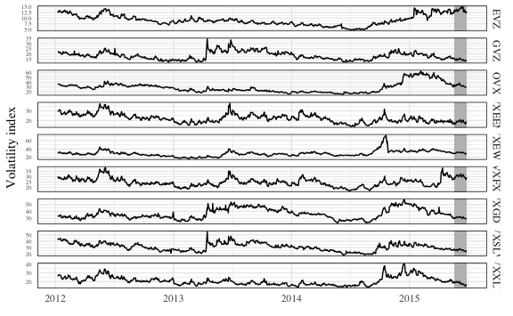

Empirical Analysis
================
Young Geun Kim
03 Jan, 2022

-   [Data](#data)
    -   [Split](#split)
-   [Model](#model)
    -   [VAR](#var)
    -   [VHAR](#vhar)
    -   [BVAR](#bvar)
    -   [BVHAR-S](#bvhar-s)
    -   [BVHAR-L](#bvhar-l)
    -   [Hyperparamers](#hyperparamers)
-   [Errors](#errors)
    -   [Relative Errors](#relative-errors)
    -   [Piecewise Errors](#piecewise-errors)
-   [Intervals](#intervals)

``` r
# tidyverse----------------------------
library(tidyverse)
# BVHAR custom package-----------------
library(bvhar)
# set seed for reproducible result-----
set.seed(1)
```

``` r
# result table-------------------------
source("report-fns.R")
# hyperparameter setting table---------
source("param-fns.R")
```

# Data

## Split

``` r
(h <- 42)
#> [1] 42
```

``` r
etf_split <- divide_ts(etf_vix, h)
etf_train <- etf_split$train
etf_test <- etf_split$test
```

``` r
bvhar:::etf_vix_raw %>% 
  mutate(
    train = c(
      rep(TRUE, nrow(etf_train)),
      rep(FALSE, nrow(etf_test))
    )
  ) %>% 
  pivot_longer(-c(DATE, train), names_to = "asset", values_to = "value") %>% 
  mutate(
    xmin = min(DATE[train == FALSE]),
    xmax = max(DATE)
  ) %>% 
  ggplot(aes(x = DATE, y = value)) +
  geom_rect(
    aes(xmin = xmin, xmax = xmax, ymin = -Inf, ymax = Inf),
    alpha = .7,
    fill = "grey" # test set
  ) +
  geom_path() +
  facet_grid(asset ~ ., scales = "free_y") +
  # scale_x_date(
  #   breaks = c(nrow(etf_train), nrow(etf_train) + nrow(etf_test))
  # ) +
  theme_minimal() +
  theme(panel.border = element_rect(fill = NA)) +
  labs(
    x = element_blank(),
    y = element_blank()
  )
```



# Model

## VAR

``` r
choose_var(etf_train, lag_max = 10)
#> $ic
#>       AIC   BIC    HQ   FPE
#> 1  0.1421 0.585 0.310 0.310
#> 2  0.0474 0.889 0.367 0.367
#> 3  0.0716 1.313 0.544 0.544
#> 4  0.1026 1.745 0.727 0.727
#> 5  0.1364 2.180 0.913 0.913
#> 6  0.2052 2.650 1.135 1.135
#> 7  0.2627 3.110 1.345 1.345
#> 8  0.3184 3.569 1.554 1.554
#> 9  0.2871 3.941 1.677 1.677
#> 10 0.3209 4.379 1.864 1.864
#> 
#> $min_lag
#> AIC BIC  HQ FPE 
#>   2   1   1   1
```

``` r
(var_lag <- 2)
#> [1] 2
```

``` r
fit_var <- var_lm(etf_train, 2)
```

## VHAR

``` r
fit_vhar <- vhar_lm(etf_train)
```

## BVAR

``` r
(bvar_lag <- 2)
#> [1] 2
```

``` r
n_asset <- ncol(etf_train)
bvar_init <- set_bvar(
  sigma = apply(etf_train, 2, sd),
  lambda = .2,
  delta = rep(.1, n_asset)
)
```

``` r
(bvar_optim <- choose_bvar(
  bvar_init, 
  lower = c(
    rep(1, n_asset), # sigma
    1e-4, # lambda
    rep(1e-2, n_asset) # delta
  ), 
  upper = c(
    rep(15, n_asset), # sigma
    Inf, # lambda
    rep(1, n_asset) # delta
  ), 
  y = etf_train, 
  p = bvar_lag, 
  include_mean = TRUE
))
#> Model Specification for BVAR
#> 
#> Parameters: Coefficent matrice and Covariance matrix
#> Prior: Minnesota
#> # Type '?bvar_minnesota' in the console for some help.
#> ========================================================
#> 
#> Setting for 'sigma':
#>   EVZCLS    GVZCLS    OVXCLS  VXEEMCLS  VXEWZCLS  VXFXICLS  VXGDXCLS  VXSLVCLS  
#>     1.42      1.88      6.92      2.32      6.09      3.07      8.67      2.08  
#> VXXLECLS  
#>     2.64  
#> 
#> Setting for 'lambda':
#>         
#> 0.0261  
#> 
#> Setting for 'delta':
#>                                                                
#> 0.952  0.896  0.954  0.905  0.960  0.944  0.930  0.931  0.925  
#> 
#> Setting for 'eps':
#> [1]  1e-04
```

``` r
fit_bvar <- bvar_optim$fit
```

## BVHAR-S

``` r
bvhar_init <- set_bvhar(
  sigma = apply(etf_train, 2, sd),
  lambda = .2,
  delta = rep(.1, n_asset)
)
```

``` r
(bvhar_var_optim <- choose_bvhar(
  bvhar_init, 
  lower = c(
    rep(1, n_asset), # sigma
    1e-4, # lambda
    rep(1e-2, n_asset) # delta
  ), 
  upper = c(
    rep(15, n_asset), # sigma
    Inf, # lambda
    rep(1, n_asset) # delta
  ), 
  y = etf_train, 
  include_mean = TRUE
))
#> Model Specification for BVHAR
#> 
#> Parameters: Coefficent matrice and Covariance matrix
#> Prior: MN_VAR
#> # Type '?bvhar_minnesota' in the console for some help.
#> ========================================================
#> 
#> Setting for 'sigma':
#>   EVZCLS    GVZCLS    OVXCLS  VXEEMCLS  VXEWZCLS  VXFXICLS  VXGDXCLS  VXSLVCLS  
#>     1.60      1.37      5.05      2.50      5.52      2.76      7.57      2.42  
#> VXXLECLS  
#>     2.45  
#> 
#> Setting for 'lambda':
#>         
#> 0.0295  
#> 
#> Setting for 'delta':
#>                                                                
#> 0.956  0.885  0.951  0.895  0.957  0.942  0.922  0.917  0.917  
#> 
#> Setting for 'eps':
#> [1]  1e-04
```

``` r
fit_bvhar <- bvhar_var_optim$fit
```

## BVHAR-L

``` r
bvhar_vhar_init <- set_weight_bvhar(
  sigma = apply(etf_train, 2, sd),
  lambda = .2,
  daily = rep(.1, n_asset),
  weekly = rep(.1, n_asset),
  monthly = rep(.1, n_asset)
)
```

``` r
(bvhar_vhar_optim <- choose_bvhar(
  bvhar_vhar_init, 
  lower = c(
    rep(1, n_asset), # sigma
    1e-4, # lambda
    rep(1e-2, n_asset), # daily
    rep(1e-2, n_asset), # weekly
    rep(1e-2, n_asset) # monthly
  ), 
  upper = c(
    rep(15, n_asset), # sigma
    Inf, # lambda
    rep(1, n_asset), # daily
    rep(1, n_asset), # weekly
    rep(1, n_asset) # monthly
  ), 
  y = etf_train, 
  include_mean = TRUE
))
#> Model Specification for BVHAR
#> 
#> Parameters: Coefficent matrice and Covariance matrix
#> Prior: MN_VHAR
#> # Type '?bvhar_minnesota' in the console for some help.
#> ========================================================
#> 
#> Setting for 'sigma':
#>   EVZCLS    GVZCLS    OVXCLS  VXEEMCLS  VXEWZCLS  VXFXICLS  VXGDXCLS  VXSLVCLS  
#>     1.74      1.61      9.33      2.87      7.09      4.67     10.12      3.06  
#> VXXLECLS  
#>     4.10  
#> 
#> Setting for 'lambda':
#>         
#> 0.0266  
#> 
#> Setting for 'eps':
#> [1]  1e-04
#> 
#> Setting for 'daily':
#>                                                                
#> 0.886  0.750  0.910  0.749  0.871  0.830  0.634  0.813  0.825  
#> 
#> Setting for 'weekly':
#>                                                                
#> 0.153  0.331  0.104  0.368  0.165  0.235  0.627  0.210  0.215  
#> 
#> Setting for 'monthly':
#>                                                                         
#> 0.0100  0.0332  0.0108  0.0363  0.0433  0.0365  0.0111  0.0870  0.0437
```

``` r
fit_bvhar_vhar <- bvhar_vhar_optim$fit
```

## Hyperparamers

# Errors

``` r
mod_list <- list(
  fit_var,
  fit_vhar,
  fit_bvar,
  fit_bvhar,
  fit_bvhar_vhar
)
# 1-step-----------
roll1 <- 
  mod_list %>% 
  lapply(
    function(mod) {
      forecast_roll(mod, 1, etf_test)
    }
  )
# 5-step-----------
roll2 <- 
  mod_list %>% 
  lapply(
    function(mod) {
      forecast_roll(mod, 5, etf_test)
    }
  )
# 20-step----------
roll3 <- 
  mod_list %>% 
  lapply(
    function(mod) {
      forecast_roll(mod, 20, etf_test)
    }
  )
```

``` r
roll_list <- 
  lapply(
    c(1, 5, 20),
    function(h) {
      mod_list %>% 
        lapply(
          function(mod) {
            forecast_roll(mod, h, etf_test)
          }
        )
    }
  )
```

## Relative Errors

``` r
get_rmfe_tr(
  roll_list,
  etf_test,
  ahead_list = c("$h = 1$", "$h = 5$", "$h = 20$"),
  benchmark_id = 1
)
#>           VHAR  BVAR BVHAR-S BVHAR-L
#> $h = 1$  1.002 0.989   0.988   0.966
#> $h = 5$  1.069 1.048   1.046   1.015
#> $h = 20$ 0.957 1.067   1.054   0.931
```

``` r
get_rmfe_tr(
  roll_list,
  etf_test,
  ahead_list = c("$h = 1$", "$h = 5$", "$h = 20$"),
  benchmark_id = 1,
  error = "rmsfe"
)
#>          VHAR  BVAR BVHAR-S BVHAR-L
#> $h = 1$  1.00 0.981   0.978   0.966
#> $h = 5$  1.10 1.059   1.039   1.011
#> $h = 20$ 1.04 1.089   1.031   0.898
```

``` r
get_rmfe_tr(
  roll_list,
  etf_test,
  ahead_list = c("$h = 1$", "$h = 5$", "$h = 20$"),
  benchmark_id = 1,
  error = "mape"
)
#>           VHAR  BVAR BVHAR-S BVHAR-L
#> $h = 1$  1.010 0.993   0.995   0.969
#> $h = 5$  1.076 1.057   1.066   1.006
#> $h = 20$ 0.951 1.095   1.095   0.941
```

``` r
get_rmfe_tr(
  roll_list,
  etf_test,
  ahead_list = c("$h = 1$", "$h = 5$", "$h = 20$"),
  benchmark_id = 1,
  error = "mase"
)
#>           VHAR  BVAR BVHAR-S BVHAR-L
#> $h = 1$  1.010 0.997   0.995   0.977
#> $h = 5$  1.072 1.041   1.040   1.015
#> $h = 20$ 0.975 1.069   1.062   0.940
```

## Piecewise Errors

# Intervals

``` r
pred_var <- predict(fit_var, h)
pred_vhar <- predict(fit_vhar, h)
pred_bvar <- predict(fit_bvar, h)
pred_bvhar <- predict(fit_bvhar, h)
pred_bvhar_vhar <- predict(fit_bvhar_vhar, h)
```

``` r
autoplot(pred_var, x_cut = 950, ci_alpha = .8, type = "wrap") +
  autolayer(pred_vhar, ci_alpha = .7) +
  autolayer(pred_bvar, ci_alpha = .6) +
  autolayer(pred_bvhar, ci_alpha = .5) +
  autolayer(pred_bvhar_vhar, ci_alpha = .4) +
  geom_eval(etf_test, num_train = nrow(etf_train), alpha = .3) +
  theme_minimal() +
  theme(
    panel.border = element_rect(fill = NA),
    axis.text.x = element_blank(),
    legend.position = "top"
  ) +
  scale_fill_discrete(labels = c("BVAR", "BVHAR-S", "BVHAR-L", "VAR", "VHAR"))
```


