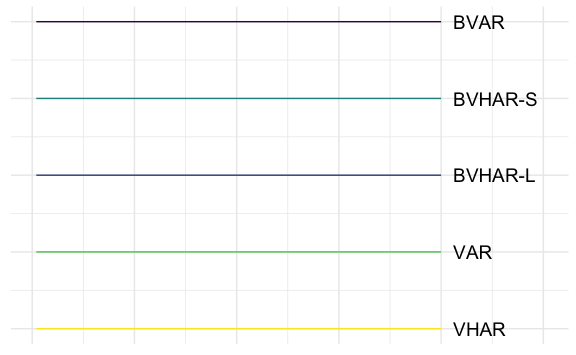

Simulating Minnesota VAR
================
Young Geun Kim
02 Jan, 2022

-   [BVAR Coefficient](#bvar-coefficient)
    -   [Minnesota prior](#minnesota-prior)
    -   [VAR(5)](#var5)
        -   [SMALL](#small)
        -   [MEDIUM](#medium)
        -   [LARGE](#large)
-   [Modeling](#modeling)
    -   [VAR](#var)
    -   [VHAR](#vhar)
    -   [BVAR](#bvar)
    -   [BVHAR-VAR](#bvhar-var)
    -   [BVHAR-VHAR](#bvhar-vhar)
-   [Errors](#errors)
    -   [Hyperparameters](#hyperparameters)
    -   [SMALL](#small-1)
        -   [Plots](#plots)
        -   [Tables](#tables)
    -   [MEDIUM](#medium-1)
        -   [Plots](#plots-1)
        -   [Tables](#tables-1)
    -   [LARGE](#large-1)
        -   [Plots](#plots-2)
        -   [Tables](#tables-2)
    -   [Average](#average)
        -   [SMALL](#small-2)
        -   [MEDIUM](#medium-2)
        -   [LARGE](#large-2)
        -   [RMSFE or RMAFE](#rmsfe-or-rmafe)
-   [Additional](#additional)
-   [Coefficients](#coefficients)

``` r
# tidyverse----------------------------
library(tidyverse)
# BVHAR custom package-----------------
library(bvhar)
# set seed for reproducible result-----
set.seed(1)
```

``` r
# result table-------------------------
source("report-fns.R")
# hyperparameter setting table---------
source("param-fns.R")
# Simulation---------------------------
dgp <- readRDS("../data/processed/bvarsim_dgp_wn.rds")
```

# BVAR Coefficient

## Minnesota prior

``` r
n_small <- length(bvar_small_spec$sigma)
n_medium <- length(bvar_medium_spec$sigma)
n_large <- length(bvar_large_spec$sigma)
```

## VAR(5)

### SMALL

``` r
y_small_train <- dgp$y_small_train
y_small_test <- dgp$y_small_test
```

``` r
y_small_train %>% 
  mutate(train = TRUE) %>% 
  bind_rows(y_small_test %>% mutate(train = FALSE)) %>% 
  mutate(id = 1:n()) %>% 
  pivot_longer(-c(id, train), names_to = "asset", values_to = "value") %>% 
  ggplot(aes(x = id, y = value)) +
  annotate(
    geom = "rect",
    xmin = nrow(y_small_train),
    xmax = nrow(y_small_train) + nrow(y_small_test),
    ymin = -Inf,
    ymax = Inf,
    alpha = .7,
    fill = "grey" # test set
  ) +
  # geom_path(aes(colour = asset), show.legend = FALSE, alpha = .5) +
  geom_path() +
  facet_grid(asset ~ ., scales = "free_y") +
  scale_x_continuous(
    breaks = c(nrow(y_small_train), nrow(y_small_train) + nrow(y_small_test))
  ) +
  theme_minimal() +
  theme(panel.border = element_rect(fill = NA)) +
  labs(
    x = element_blank(),
    y = element_blank()
  )
```


### MEDIUM

``` r
y_medium_train <- dgp$y_medium_train
y_medium_test <- dgp$y_medium_test
```

``` r
y_medium_train %>% 
  mutate(train = TRUE) %>% 
  bind_rows(y_medium_test %>% mutate(train = FALSE)) %>% 
  mutate(id = 1:n()) %>% 
  pivot_longer(-c(id, train), names_to = "asset", values_to = "value") %>% 
  ggplot(aes(x = id, y = value)) +
  annotate(
    geom = "rect",
    xmin = nrow(y_medium_train),
    xmax = nrow(y_medium_train) + nrow(y_medium_test),
    ymin = -Inf,
    ymax = Inf,
    alpha = .7,
    fill = "grey" # test set
  ) +
  geom_path() +
  facet_grid(asset ~ ., scales = "free_y") +
  scale_x_continuous(
    breaks = c(nrow(y_medium_train), nrow(y_medium_train) + nrow(y_medium_test))
  ) +
  theme_minimal() +
  theme(
    strip.text.y = element_text(size = 5), 
    panel.border = element_rect(fill = NA)
  ) +
  labs(
    x = element_blank(),
    y = element_blank()
  )
```


### LARGE

``` r
y_large_train <- dgp$y_large_train
y_large_test <- dgp$y_large_test
```

``` r
y_large_train %>% 
  mutate(train = TRUE) %>% 
  bind_rows(y_large_test %>% mutate(train = FALSE)) %>% 
  mutate(id = 1:n()) %>% 
  pivot_longer(-c(id, train), names_to = "asset", values_to = "value") %>% 
  ggplot(aes(x = id, y = value)) +
  annotate(
    geom = "rect",
    xmin = nrow(y_large_train),
    xmax = nrow(y_large_train) + nrow(y_large_test),
    ymin = -Inf,
    ymax = Inf,
    alpha = .7,
    fill = "grey" # test set
  ) +
  geom_path(size = .3) +
  facet_grid(asset ~ ., scales = "free_y") +
  scale_x_continuous(
    breaks = c(nrow(y_large_train), nrow(y_large_train) + nrow(y_large_test))
  ) +
  theme_minimal() +
  theme(
    strip.text.y = element_text(size = 5), 
    panel.border = element_rect(fill = NA),
    axis.text.y = element_text(size = 3)
  ) +
  labs(
    x = element_blank(),
    y = element_blank()
  )
```


# Modeling

## VAR

``` r
(var_lag <- 5)
#> [1] 5
```

``` r
fit_var_small <- var_lm(y_small_train, var_lag, include_mean = FALSE)
fit_var_medium <- var_lm(y_medium_train, var_lag, include_mean = FALSE)
fit_var_large <- var_lm(y_large_train, var_lag, include_mean = FALSE)
```

## VHAR

``` r
fit_vhar_small <- vhar_lm(y_small_train, include_mean = FALSE)
fit_vhar_medium <- vhar_lm(y_medium_train, include_mean = FALSE)
fit_vhar_large <- vhar_lm(y_large_train, include_mean = FALSE)
```

## BVAR

``` r
(bvar_lag <- 5)
#> [1] 5
```

``` r
(bvar_small_optim <- choose_bvar(
  bvar_small_spec, 
  lower = c(
    rep(1e-2, n_small), # sigma
    1e-2, # lambda
    rep(1e-2, n_small) # delta
  ), 
  upper = c(
    rep(1, n_small), # sigma
    Inf, # lambda
    rep(1, n_small) # delta
  ), 
  y = y_small_train, 
  p = bvar_lag, 
  include_mean = FALSE
))
#> Model Specification for BVAR
#> 
#> Parameters: Coefficent matrice and Covariance matrix
#> Prior: Minnesota
#> # Type '?bvar_minnesota' in the console for some help.
#> ========================================================
#> 
#> Setting for 'sigma':
#> [1]  0.0712  0.0339  0.0993
#> 
#> Setting for 'lambda':
#> [1]  0.427
#> 
#> Setting for 'delta':
#> [1]  0.0338  0.0636  0.0403
#> 
#> Setting for 'eps':
#> [1]  1e-04
```

``` r
(bvar_medium_optim <- choose_bvar(
  bvar_medium_spec, 
  lower = c(
    rep(1e-2, n_medium), # sigma
    1e-2, # lambda
    rep(1e-2, n_medium) # delta
  ), 
  upper = c(
    rep(1, n_medium), # sigma
    Inf, # lambda
    rep(1, n_medium) # delta
  ), 
  y = y_medium_train, 
  p = bvar_lag, 
  include_mean = FALSE
))
#> Model Specification for BVAR
#> 
#> Parameters: Coefficent matrice and Covariance matrix
#> Prior: Minnesota
#> # Type '?bvar_minnesota' in the console for some help.
#> ========================================================
#> 
#> Setting for 'sigma':
#> [1]  0.0380  0.0418  0.0454  0.0627  0.0676  0.0296  0.0679  0.1182  0.1057
#> 
#> Setting for 'lambda':
#> [1]  0.202
#> 
#> Setting for 'delta':
#> [1]  0.0960  0.0100  0.0734  0.0100  0.0100  0.0228  0.0700  0.0100  0.0259
#> 
#> Setting for 'eps':
#> [1]  1e-04
```

``` r
(bvar_large_optim <- choose_bvar(
  bvar_large_spec, 
  lower = c(
    rep(1e-2, n_large), # sigma
    1e-2, # lambda
    rep(1e-2, n_large) # delta
  ), 
  upper = c(
    rep(1, n_large), # sigma
    Inf, # lambda
    rep(1, n_large) # delta
  ), 
  y = y_large_train, 
  p = bvar_lag, 
  include_mean = FALSE
))
#> Model Specification for BVAR
#> 
#> Parameters: Coefficent matrice and Covariance matrix
#> Prior: Minnesota
#> # Type '?bvar_minnesota' in the console for some help.
#> ========================================================
#> 
#> Setting for 'sigma':
#>  [1]  0.0435  0.0475  0.0387  0.0594  0.0448  0.0491  0.0490  0.0651  0.0632
#> [10]  0.0885  0.0700  0.0920
#> 
#> Setting for 'lambda':
#> [1]  0.128
#> 
#> Setting for 'delta':
#>  [1]  0.0100  0.0100  0.0100  0.0108  0.0100  0.0241  0.0100  0.0121  0.0100
#> [10]  0.0106  0.0135  0.0124
#> 
#> Setting for 'eps':
#> [1]  1e-04
```

``` r
fit_small_bvar <- bvar_small_optim$fit
fit_medium_bvar <- bvar_medium_optim$fit
fit_large_bvar <- bvar_large_optim$fit
```

## BVHAR-VAR

``` r
bvhar_var_small_spec <- set_bvhar(
  sigma = bvar_small_spec$sigma,
  lambda = bvar_small_spec$lambda,
  delta = bvar_small_spec$delta
)
#----------------------------
bvhar_var_medium_spec <- set_bvhar(
  sigma = bvar_medium_spec$sigma,
  lambda = bvar_medium_spec$lambda,
  delta = bvar_medium_spec$delta
)
#----------------------------
bvhar_var_large_spec <- set_bvhar(
  sigma = bvar_large_spec$sigma,
  lambda = bvar_large_spec$lambda,
  delta = bvar_large_spec$delta
)
```

``` r
(bvhar_var_small_optim <- choose_bvhar(
  bvhar_var_small_spec, 
  lower = c(
    rep(1e-2, n_small), # sigma
    1e-2, # lambda
    rep(1e-2, n_small) # delta
  ), 
  upper = c(
    rep(1, n_small), # sigma
    Inf, # lambda
    rep(1, n_small) # delta
  ), 
  y = y_small_train, 
  include_mean = FALSE
))
#> Model Specification for BVHAR
#> 
#> Parameters: Coefficent matrice and Covariance matrix
#> Prior: MN_VAR
#> # Type '?bvhar_minnesota' in the console for some help.
#> ========================================================
#> 
#> Setting for 'sigma':
#> [1]  0.0619  0.0311  0.0811
#> 
#> Setting for 'lambda':
#> [1]  1.5
#> 
#> Setting for 'delta':
#> [1]  0.0117  0.0109  0.0116
#> 
#> Setting for 'eps':
#> [1]  1e-04
```

``` r
(bvhar_var_medium_optim <- choose_bvhar(
  bvhar_var_medium_spec, 
  lower = c(
    rep(1e-2, n_medium), # sigma
    1e-2, # lambda
    rep(1e-2, n_medium) # delta
  ), 
  upper = c(
    rep(1, n_medium), # sigma
    Inf, # lambda
    rep(1, n_medium) # delta
  ), 
  y = y_medium_train, 
  include_mean = FALSE
))
#> Model Specification for BVHAR
#> 
#> Parameters: Coefficent matrice and Covariance matrix
#> Prior: MN_VAR
#> # Type '?bvhar_minnesota' in the console for some help.
#> ========================================================
#> 
#> Setting for 'sigma':
#> [1]  0.0430  0.0421  0.0622  0.0602  0.0596  0.0100  0.0745  0.1259  0.1053
#> 
#> Setting for 'lambda':
#> [1]  0.206
#> 
#> Setting for 'delta':
#> [1]  0.0293  0.0100  0.0286  0.0100  0.0100  0.0100  0.0282  0.0100  0.0257
#> 
#> Setting for 'eps':
#> [1]  1e-04
```

``` r
(bvhar_var_large_optim <- choose_bvhar(
  bvhar_var_large_spec, 
  lower = c(
    rep(1e-2, n_large), # sigma
    1e-2, # lambda
    rep(1e-2, n_large) # delta
  ), 
  upper = c(
    rep(1, n_large), # sigma
    Inf, # lambda
    rep(1, n_large) # delta
  ), 
  y = y_large_train, 
  include_mean = FALSE
))
#> Model Specification for BVHAR
#> 
#> Parameters: Coefficent matrice and Covariance matrix
#> Prior: MN_VAR
#> # Type '?bvhar_minnesota' in the console for some help.
#> ========================================================
#> 
#> Setting for 'sigma':
#>  [1]  0.0782  0.0367  0.0402  0.0513  0.0497  0.0531  0.0614  0.0464  0.0410
#> [10]  0.0504  0.0394  0.0562
#> 
#> Setting for 'lambda':
#> [1]  0.948
#> 
#> Setting for 'delta':
#>  [1]  0.0101  0.0100  0.0100  0.0101  0.0100  0.0101  0.0101  0.0100  0.0100
#> [10]  0.0100  0.0101  0.0101
#> 
#> Setting for 'eps':
#> [1]  1e-04
```

``` r
fit_bvhar_small_var <- bvhar_var_small_optim$fit
fit_bvhar_medium_var <- bvhar_var_medium_optim$fit
fit_bvhar_large_var <- bvhar_var_large_optim$fit
```

## BVHAR-VHAR

``` r
bvhar_vhar_small_spec <- set_weight_bvhar(
  sigma = bvar_small_spec$sigma,
  lambda = bvar_small_spec$lambda,
  daily = bvar_small_spec$delta,
  weekly = bvar_small_spec$delta,
  monthly = bvar_small_spec$delta
)
#-----------------------------------------
bvhar_vhar_medium_spec <- set_weight_bvhar(
  sigma = bvar_medium_spec$sigma,
  lambda = bvar_medium_spec$lambda,
  daily = bvar_medium_spec$delta,
  weekly = bvar_medium_spec$delta,
  monthly = bvar_medium_spec$delta
)
#-----------------------------------------
bvhar_vhar_large_spec <- set_weight_bvhar(
  sigma = bvar_large_spec$sigma,
  lambda = bvar_large_spec$lambda,
  daily = bvar_large_spec$delta,
  weekly = bvar_large_spec$delta,
  monthly = bvar_large_spec$delta
)
```

``` r
(bvhar_vhar_small_optim <- choose_bvhar(
  bvhar_vhar_small_spec, 
  lower = c(
    rep(1e-2, n_small), # sigma
    1e-2, # lambda
    rep(1e-2, n_small), # daily
    rep(1e-2, n_small), # weekly
    rep(1e-2, n_small) # monthly
  ), 
  upper = c(
    rep(1, n_small), # sigma
    Inf, # lambda
    rep(1, n_small), # daily
    rep(1, n_small), # weekly
    rep(1, n_small) # monthly
  ), 
  y = y_small_train, 
  include_mean = FALSE
))
#> Model Specification for BVHAR
#> 
#> Parameters: Coefficent matrice and Covariance matrix
#> Prior: MN_VHAR
#> # Type '?bvhar_minnesota' in the console for some help.
#> ========================================================
#> 
#> Setting for 'sigma':
#> [1]  0.0766  0.0161  0.0835
#> 
#> Setting for 'lambda':
#> [1]  0.966
#> 
#> Setting for 'eps':
#> [1]  1e-04
#> 
#> Setting for 'daily':
#> [1]  0.0112  0.0113  0.0111
#> 
#> Setting for 'weekly':
#> [1]  0.0112  0.0116  0.0111
#> 
#> Setting for 'monthly':
#> [1]  0.0106  0.0137  0.0113
```

``` r
(bvhar_vhar_medium_optim <- choose_bvhar(
  bvhar_vhar_medium_spec, 
  lower = c(
    rep(1e-2, n_medium), # sigma
    1e-2, # lambda
    rep(1e-2, n_medium), # daily
    rep(1e-2, n_medium), # weekly
    rep(1e-2, n_medium) # monthly
  ), 
  upper = c(
    rep(1, n_medium), # sigma
    Inf, # lambda
    rep(1, n_medium), # daily
    rep(1, n_medium), # weekly
    rep(1, n_medium) # monthly
  ), 
  y = y_medium_train, 
  include_mean = FALSE
))
#> Model Specification for BVHAR
#> 
#> Parameters: Coefficent matrice and Covariance matrix
#> Prior: MN_VHAR
#> # Type '?bvhar_minnesota' in the console for some help.
#> ========================================================
#> 
#> Setting for 'sigma':
#> [1]  0.0459  0.0489  0.0570  0.0611  0.0831  0.0155  0.0900  0.1453  0.1160
#> 
#> Setting for 'lambda':
#> [1]  0.32
#> 
#> Setting for 'eps':
#> [1]  1e-04
#> 
#> Setting for 'daily':
#> [1]  0.0144  0.0100  0.0136  0.0100  0.0100  0.0109  0.0123  0.0100  0.0107
#> 
#> Setting for 'weekly':
#> [1]  0.0174  0.0124  0.0126  0.0100  0.0100  0.0157  0.0127  0.0108  0.0100
#> 
#> Setting for 'monthly':
#> [1]  0.0124  0.0103  0.0143  0.0100  0.0100  0.0202  0.0100  0.0100  0.0100
```

``` r
(bvhar_vhar_large_optim <- choose_bvhar(
  bvhar_vhar_large_spec, 
  lower = c(
    rep(1e-2, n_large), # sigma
    1e-2, # lambda
    rep(1e-2, n_large), # daily
    rep(1e-2, n_large), # weekly
    rep(1e-2, n_large) # monthly
  ), 
  upper = c(
    rep(2, n_large), # sigma
    Inf, # lambda
    rep(1, n_large), # daily
    rep(1, n_large), # weekly
    rep(1, n_large) # monthly
  ), 
  y = y_large_train, 
  include_mean = FALSE
))
#> Model Specification for BVHAR
#> 
#> Parameters: Coefficent matrice and Covariance matrix
#> Prior: MN_VHAR
#> # Type '?bvhar_minnesota' in the console for some help.
#> ========================================================
#> 
#> Setting for 'sigma':
#>  [1]  0.0503  0.0839  0.0667  0.0784  0.0867  0.1055  0.0646  0.0838  0.0710
#> [10]  0.0524  0.0729  0.0677
#> 
#> Setting for 'lambda':
#> [1]  1.02
#> 
#> Setting for 'eps':
#> [1]  1e-04
#> 
#> Setting for 'daily':
#>  [1]  0.0101  0.0100  0.0100  0.0101  0.0100  0.0161  0.0101  0.0101  0.0100
#> [10]  0.0100  0.0101  0.0103
#> 
#> Setting for 'weekly':
#>  [1]  0.0101  0.0100  0.0206  0.0286  0.0101  0.0100  0.0243  0.0101  0.0101
#> [10]  0.0148  0.0101  0.0101
#> 
#> Setting for 'monthly':
#>  [1]  0.0101  0.0171  0.0101  0.0170  0.0101  0.0141  0.0287  0.0275  0.0138
#> [10]  0.0100  0.0264  0.0101
```

``` r
fit_bvhar_small_vhar <- bvhar_vhar_small_optim$fit
fit_bvhar_medium_vhar <- bvhar_vhar_medium_optim$fit
fit_bvhar_large_vhar <- bvhar_vhar_large_optim$fit
```

# Errors

## Hyperparameters


    \begin{longtable}[t]{lllrrrrrrrrrrrr}
    \caption{\label{tab:empdgp1}Empirical Bayes Results for DGP1.}\\
    \toprule
     &    &     & y1 & y2 & y3 & y4 & y5 & y6 & y7 & y8 & y9 & y10 & y11 & y12\\
    \midrule
    \endfirsthead
    \caption[]{Empirical Bayes Results for DGP1. \textit{(continued)}}\\
    \toprule
      &    &     & y1 & y2 & y3 & y4 & y5 & y6 & y7 & y8 & y9 & y10 & y11 & y12\\
    \midrule
    \endhead

    \endfoot
    \bottomrule
    \endlastfoot
    \addlinespace[0.3em]
    \multicolumn{15}{l}{\textbf{SMALL}}\\
    \hspace{1em} & BVAR & $\sigma$ & 0.071 & 0.034 & 0.099 &  &  &  &  &  &  &  &  & \\

    \hspace{1em} &  & $\lambda$ & 0.427 &  &  &  &  &  &  &  &  &  &  & \\

    \hspace{1em} &  & $\delta$ & 0.034 & 0.064 & 0.040 &  &  &  &  &  &  &  &  & \\
    \cmidrule{2-15}
    \hspace{1em} & BVHAR-S & $\sigma$ & 0.062 & 0.031 & 0.081 &  &  &  &  &  &  &  &  & \\

    \hspace{1em} &  & $\lambda$ & 1.500 &  &  &  &  &  &  &  &  &  &  & \\

    \hspace{1em} &  & $\delta$ & 0.012 & 0.011 & 0.012 &  &  &  &  &  &  &  &  & \\
    \cmidrule{2-15}
    \hspace{1em} & BVHAR-L & $\sigma$ & 0.077 & 0.016 & 0.083 &  &  &  &  &  &  &  &  & \\

    \hspace{1em} &  & $\lambda$ & 0.966 &  &  &  &  &  &  &  &  &  &  & \\

    \hspace{1em} &  & $d_i$ & 0.011 & 0.011 & 0.011 &  &  &  &  &  &  &  &  & \\

    \hspace{1em} &  & $w_i$ & 0.011 & 0.012 & 0.011 &  &  &  &  &  &  &  &  & \\

    \hspace{1em} &  & $m_i$ & 0.011 & 0.014 & 0.011 &  &  &  &  &  &  &  &  & \\
    \cmidrule{1-15}
    \addlinespace[0.3em]
    \multicolumn{15}{l}{\textbf{MEDIUM}}\\
    \hspace{1em} & BVAR & $\sigma$ & 0.038 & 0.042 & 0.045 & 0.063 & 0.068 & 0.030 & 0.068 & 0.118 & 0.106 &  &  & \\

    \hspace{1em} &  & $\lambda$ & 0.202 &  &  &  &  &  &  &  &  &  &  & \\

    \hspace{1em} &  & $\delta$ & 0.096 & 0.010 & 0.073 & 0.010 & 0.010 & 0.023 & 0.070 & 0.010 & 0.026 &  &  & \\
    \cmidrule{2-15}
    \hspace{1em} & BVHAR-S & $\sigma$ & 0.043 & 0.042 & 0.062 & 0.060 & 0.060 & 0.010 & 0.075 & 0.126 & 0.105 &  &  & \\

    \hspace{1em} &  & $\lambda$ & 0.206 &  &  &  &  &  &  &  &  &  &  & \\

    \hspace{1em} &  & $\delta$ & 0.029 & 0.010 & 0.029 & 0.010 & 0.010 & 0.010 & 0.028 & 0.010 & 0.026 &  &  & \\
    \cmidrule{2-15}
    \hspace{1em} & BVHAR-L & $\sigma$ & 0.046 & 0.049 & 0.057 & 0.061 & 0.083 & 0.015 & 0.090 & 0.145 & 0.116 &  &  & \\

    \hspace{1em} &  & $\lambda$ & 0.320 &  &  &  &  &  &  &  &  &  &  & \\

    \hspace{1em} &  & $d_i$ & 0.014 & 0.010 & 0.014 & 0.010 & 0.010 & 0.011 & 0.012 & 0.010 & 0.011 &  &  & \\

    \hspace{1em} &  & $w_i$ & 0.017 & 0.012 & 0.013 & 0.010 & 0.010 & 0.016 & 0.013 & 0.011 & 0.010 &  &  & \\

    \hspace{1em} &  & $m_i$ & 0.012 & 0.010 & 0.014 & 0.010 & 0.010 & 0.020 & 0.010 & 0.010 & 0.010 &  &  & \\
    \cmidrule{1-15}
    \addlinespace[0.3em]
    \multicolumn{15}{l}{\textbf{LARGE}}\\
    \hspace{1em} & BVAR & $\sigma$ & 0.043 & 0.048 & 0.039 & 0.059 & 0.045 & 0.049 & 0.049 & 0.065 & 0.063 & 0.089 & 0.070 & 0.092\\

    \hspace{1em} &  & $\lambda$ & 0.128 &  &  &  &  &  &  &  &  &  &  & \\

    \hspace{1em} &  & $\delta$ & 0.010 & 0.010 & 0.010 & 0.011 & 0.010 & 0.024 & 0.010 & 0.012 & 0.010 & 0.011 & 0.014 & 0.012\\
    \cmidrule{2-15}
    \hspace{1em} & BVHAR-S & $\sigma$ & 0.078 & 0.037 & 0.040 & 0.051 & 0.050 & 0.053 & 0.061 & 0.046 & 0.041 & 0.050 & 0.039 & 0.056\\

    \hspace{1em} &  & $\lambda$ & 0.948 &  &  &  &  &  &  &  &  &  &  & \\

    \hspace{1em} &  & $\delta$ & 0.010 & 0.010 & 0.010 & 0.010 & 0.010 & 0.010 & 0.010 & 0.010 & 0.010 & 0.010 & 0.010 & 0.010\\
    \cmidrule{2-15}
    \hspace{1em} & BVHAR-L & $\sigma$ & 0.050 & 0.084 & 0.067 & 0.078 & 0.087 & 0.105 & 0.065 & 0.084 & 0.071 & 0.052 & 0.073 & 0.068\\

    \hspace{1em} &  & $\lambda$ & 1.015 &  &  &  &  &  &  &  &  &  &  & \\

    \hspace{1em} &  & $d_i$ & 0.010 & 0.010 & 0.010 & 0.010 & 0.010 & 0.016 & 0.010 & 0.010 & 0.010 & 0.010 & 0.010 & 0.010\\

    \hspace{1em} &  & $w_i$ & 0.010 & 0.010 & 0.021 & 0.029 & 0.010 & 0.010 & 0.024 & 0.010 & 0.010 & 0.015 & 0.010 & 0.010\\

    \hspace{1em} &  & $m_i$ & 0.010 & 0.017 & 0.010 & 0.017 & 0.010 & 0.014 & 0.029 & 0.027 & 0.014 & 0.010 & 0.026 & 0.010\\*
    \end{longtable}

## SMALL

``` r
mod_small_list <- list(
  fit_var_small,
  fit_vhar_small,
  fit_small_bvar,
  fit_bvhar_small_var,
  fit_bvhar_small_vhar
)
# 1-step-----------
cv_small_1 <- 
  mod_small_list %>% 
  lapply(
    function(mod) {
      forecast_roll(mod, 1, y_small_test)
    }
  )
# 5-step-----------
cv_small_5 <- 
  mod_small_list %>% 
  lapply(
    function(mod) {
      forecast_roll(mod, 5, y_small_test)
    }
  )
# 20-step----------
cv_small_20 <- 
  mod_small_list %>% 
  lapply(
    function(mod) {
      forecast_roll(mod, 20, y_small_test)
    }
  )
```

### Plots


### Tables

1-step:


    \begin{longtable}[t]{lllllll}
    \caption{\label{tab:smallone}SMALL Simulation - 1-step ahead Rolling Window Forecasting Loss}\\
    \toprule
    \multicolumn{1}{c}{ } & \multicolumn{1}{c}{ } & \multicolumn{2}{c}{Frequentist} & \multicolumn{1}{c}{BVAR} & \multicolumn{2}{c}{BVHAR} \\
    \cmidrule(l{3pt}r{3pt}){3-4} \cmidrule(l{3pt}r{3pt}){5-5} \cmidrule(l{3pt}r{3pt}){6-7}
     &  & VAR & VHAR & Minnesota & VAR-type & VHAR-type\\
    \midrule
    \endfirsthead
    \caption[]{SMALL Simulation - 1-step ahead Rolling Window Forecasting Loss \textit{(continued)}}\\
    \toprule
     &  & VAR & VHAR & Minnesota & VAR-type & VHAR-type\\
    \midrule
    \endhead

    \endfoot
    \bottomrule
    \endlastfoot
     & asset01 & \num{0.00098} & \num{0.000951} & \num{0.000963} & \textcolor{red}{\num{0.000947}} & \num{0.000948}\\
    \cmidrule{2-7}\nopagebreak
     & asset02 & \num{0.000921} & \num{0.000984} & \textcolor{red}{\num{0.000912}} & \num{0.00098} & \num{0.000976}\\
    \cmidrule{2-7}\nopagebreak
     & asset03 & \num{0.0149} & \textcolor{red}{\num{0.0144}} & \num{0.0147} & \num{0.0144} & \num{0.0144}\\
    \cmidrule{2-7}\nopagebreak
    \multirow{-4}{*}{\raggedright\arraybackslash MSE} & \cellcolor{gray}{Average} & \num{0.0056} & \num{0.00544} & \num{0.00552} & \num{0.00546} & \textcolor{red}{\num{0.00543}}\\
    \cmidrule{1-7}\pagebreak[0]
     & asset01 & \num{0.0255} & \num{0.0251} & \num{0.0252} & \num{0.025} & \textcolor{red}{\num{0.025}}\\
    \cmidrule{2-7}\nopagebreak
     & asset02 & \num{0.0239} & \num{0.0252} & \textcolor{red}{\num{0.0237}} & \num{0.0252} & \num{0.0251}\\
    \cmidrule{2-7}\nopagebreak
     & asset03 & \num{0.1011} & \num{0.0978} & \num{0.0997} & \num{0.0977} & \textcolor{red}{\num{0.0976}}\\
    \cmidrule{2-7}\nopagebreak
    \multirow{-4}{*}{\raggedright\arraybackslash MAE} & \cellcolor{gray}{Average} & \num{0.0502} & \num{0.0494} & \num{0.0495} & \num{0.0493} & \textcolor{red}{\num{0.0492}}\\
    \cmidrule{1-7}\pagebreak[0]
     & asset01 & \num{0.00564} & \num{0.00555} & \num{0.00557} & \num{0.00552} & \textcolor{red}{\num{0.00552}}\\
    \cmidrule{2-7}\nopagebreak
     & asset02 & \num{0.0512} & \num{0.054} & \textcolor{red}{\num{0.0507}} & \num{0.0539} & \num{0.0538}\\
    \cmidrule{2-7}\nopagebreak
     & asset03 & \num{0.00495} & \num{0.00479} & \num{0.00489} & \num{0.00479} & \textcolor{red}{\num{0.00478}}\\
    \cmidrule{2-7}\nopagebreak
    \multirow{-4}{*}{\raggedright\arraybackslash MAPE} & \cellcolor{gray}{Average} & \num{0.0206} & \num{0.0214} & \textcolor{red}{\num{0.0204}} & \num{0.0214} & \num{0.0214}\\
    \cmidrule{1-7}\pagebreak[0]
     & asset01 & \num{57.161} & \num{56.667} & \textcolor{red}{\num{56.434}} & \num{56.502} & \num{56.467}\\
    \cmidrule{2-7}\nopagebreak
     & asset02 & \num{52.16} & \num{56.654} & \textcolor{red}{\num{51.445}} & \num{56.631} & \num{56.479}\\
    \cmidrule{2-7}\nopagebreak
     & asset03 & \num{224.051} & \num{214.963} & \num{220.927} & \textcolor{red}{\num{214.894}} & \num{215.059}\\
    \cmidrule{2-7}\nopagebreak
    \multirow{-4}{*}{\raggedright\arraybackslash MASE} & \cellcolor{gray}{Average} & \num{111.124} & \num{109.428} & \num{109.602} & \num{109.342} & \textcolor{red}{\num{109.335}}\\*
    \end{longtable}

5-step:


    \begin{longtable}[t]{lllllll}
    \caption{\label{tab:smallfive}SMALL Simulation - 5-step ahead Rolling Window Forecasting Loss}\\
    \toprule
    \multicolumn{1}{c}{ } & \multicolumn{1}{c}{ } & \multicolumn{2}{c}{Frequentist} & \multicolumn{1}{c}{BVAR} & \multicolumn{2}{c}{BVHAR} \\
    \cmidrule(l{3pt}r{3pt}){3-4} \cmidrule(l{3pt}r{3pt}){5-5} \cmidrule(l{3pt}r{3pt}){6-7}
     &  & VAR & VHAR & Minnesota & VAR-type & VHAR-type\\
    \midrule
    \endfirsthead
    \caption[]{SMALL Simulation - 5-step ahead Rolling Window Forecasting Loss \textit{(continued)}}\\
    \toprule
     &  & VAR & VHAR & Minnesota & VAR-type & VHAR-type\\
    \midrule
    \endhead

    \endfoot
    \bottomrule
    \endlastfoot
     & asset01 & \num{0.0042} & \num{0.00393} & \num{0.00405} & \num{0.00392} & \textcolor{red}{\num{0.00386}}\\
    \cmidrule{2-7}\nopagebreak
     & asset02 & \num{0.00321} & \num{0.00317} & \textcolor{red}{\num{0.0031}} & \num{0.00315} & \num{0.00311}\\
    \cmidrule{2-7}\nopagebreak
     & asset03 & \num{0.0568} & \num{0.0536} & \num{0.0547} & \num{0.0534} & \textcolor{red}{\num{0.0523}}\\
    \cmidrule{2-7}\nopagebreak
    \multirow{-4}{*}{\raggedright\arraybackslash MSE} & \cellcolor{gray}{Average} & \num{0.0214} & \num{0.0202} & \num{0.0206} & \num{0.0201} & \textcolor{red}{\num{0.0198}}\\
    \cmidrule{1-7}\pagebreak[0]
     & asset01 & \num{0.0545} & \num{0.0525} & \num{0.0536} & \num{0.0529} & \textcolor{red}{\num{0.0524}}\\
    \cmidrule{2-7}\nopagebreak
     & asset02 & \num{0.045} & \num{0.0447} & \textcolor{red}{\num{0.0441}} & \num{0.0449} & \num{0.0445}\\
    \cmidrule{2-7}\nopagebreak
     & asset03 & \num{0.197} & \num{0.187} & \num{0.193} & \num{0.188} & \textcolor{red}{\num{0.185}}\\
    \cmidrule{2-7}\nopagebreak
    \multirow{-4}{*}{\raggedright\arraybackslash MAE} & \cellcolor{gray}{Average} & \num{0.0988} & \num{0.0946} & \num{0.0969} & \num{0.0952} & \textcolor{red}{\num{0.094}}\\
    \cmidrule{1-7}\pagebreak[0]
     & asset01 & \num{0.012} & \num{0.0116} & \num{0.0119} & \num{0.0117} & \textcolor{red}{\num{0.0116}}\\
    \cmidrule{2-7}\nopagebreak
     & asset02 & \num{0.0963} & \num{0.0958} & \textcolor{red}{\num{0.0945}} & \num{0.096} & \num{0.0953}\\
    \cmidrule{2-7}\nopagebreak
     & asset03 & \num{0.00965} & \num{0.00914} & \num{0.00946} & \num{0.00921} & \textcolor{red}{\num{0.00907}}\\
    \cmidrule{2-7}\nopagebreak
    \multirow{-4}{*}{\raggedright\arraybackslash MAPE} & \cellcolor{gray}{Average} & \num{0.0393} & \num{0.0389} & \textcolor{red}{\num{0.0386}} & \num{0.039} & \num{0.0387}\\
    \cmidrule{1-7}\pagebreak[0]
     & asset01 & \num{121.743} & \num{116.963} & \num{119.841} & \num{117.834} & \textcolor{red}{\num{116.673}}\\
    \cmidrule{2-7}\nopagebreak
     & asset02 & \num{103.244} & \num{102.338} & \textcolor{red}{\num{101.239}} & \num{102.972} & \num{102.28}\\
    \cmidrule{2-7}\nopagebreak
     & asset03 & \num{450.19} & \num{423.417} & \num{441.577} & \num{427.726} & \textcolor{red}{\num{421.554}}\\
    \cmidrule{2-7}\nopagebreak
    \multirow{-4}{*}{\raggedright\arraybackslash MASE} & \cellcolor{gray}{Average} & \num{225.059} & \num{214.239} & \num{220.885} & \num{216.177} & \textcolor{red}{\num{213.502}}\\*
    \end{longtable}

20-step:


    \begin{longtable}[t]{lllllll}
    \caption{\label{tab:smalltwenty}SMALL Simulation - 20-step ahead Rolling Window Forecasting Loss}\\
    \toprule
    \multicolumn{1}{c}{ } & \multicolumn{1}{c}{ } & \multicolumn{2}{c}{Frequentist} & \multicolumn{1}{c}{BVAR} & \multicolumn{2}{c}{BVHAR} \\
    \cmidrule(l{3pt}r{3pt}){3-4} \cmidrule(l{3pt}r{3pt}){5-5} \cmidrule(l{3pt}r{3pt}){6-7}
     &  & VAR & VHAR & Minnesota & VAR-type & VHAR-type\\
    \midrule
    \endfirsthead
    \caption[]{SMALL Simulation - 20-step ahead Rolling Window Forecasting Loss \textit{(continued)}}\\
    \toprule
     &  & VAR & VHAR & Minnesota & VAR-type & VHAR-type\\
    \midrule
    \endhead

    \endfoot
    \bottomrule
    \endlastfoot
     & asset01 & \num{0.00767} & \textcolor{red}{\num{0.00623}} & \num{0.00758} & \num{0.00641} & \num{0.00636}\\
    \cmidrule{2-7}\nopagebreak
     & asset02 & \num{0.00374} & \textcolor{red}{\num{0.00363}} & \num{0.00364} & \num{0.00374} & \num{0.00376}\\
    \cmidrule{2-7}\nopagebreak
     & asset03 & \num{0.1056} & \textcolor{red}{\num{0.0805}} & \num{0.1045} & \num{0.0826} & \num{0.0818}\\
    \cmidrule{2-7}\nopagebreak
    \multirow{-4}{*}{\raggedright\arraybackslash MSE} & \cellcolor{gray}{Average} & \num{0.039} & \textcolor{red}{\num{0.0301}} & \num{0.0386} & \num{0.0309} & \num{0.0306}\\
    \cmidrule{1-7}\pagebreak[0]
     & asset01 & \num{0.0723} & \textcolor{red}{\num{0.0633}} & \num{0.0717} & \num{0.0649} & \num{0.064}\\
    \cmidrule{2-7}\nopagebreak
     & asset02 & \num{0.049} & \textcolor{red}{\num{0.048}} & \num{0.0485} & \num{0.0488} & \num{0.0492}\\
    \cmidrule{2-7}\nopagebreak
     & asset03 & \num{0.27} & \textcolor{red}{\num{0.231}} & \num{0.269} & \num{0.238} & \num{0.233}\\
    \cmidrule{2-7}\nopagebreak
    \multirow{-4}{*}{\raggedright\arraybackslash MAE} & \cellcolor{gray}{Average} & \num{0.13} & \textcolor{red}{\num{0.114}} & \num{0.13} & \num{0.117} & \num{0.115}\\
    \cmidrule{1-7}\pagebreak[0]
     & asset01 & \num{0.016} & \textcolor{red}{\num{0.014}} & \num{0.0158} & \num{0.0144} & \num{0.0141}\\
    \cmidrule{2-7}\nopagebreak
     & asset02 & \num{0.105} & \textcolor{red}{\num{0.103}} & \num{0.104} & \num{0.104} & \num{0.105}\\
    \cmidrule{2-7}\nopagebreak
     & asset03 & \num{0.0132} & \textcolor{red}{\num{0.0113}} & \num{0.0132} & \num{0.0116} & \num{0.0114}\\
    \cmidrule{2-7}\nopagebreak
    \multirow{-4}{*}{\raggedright\arraybackslash MAPE} & \cellcolor{gray}{Average} & \num{0.0447} & \textcolor{red}{\num{0.0427}} & \num{0.0442} & \num{0.0435} & \num{0.0436}\\
    \cmidrule{1-7}\pagebreak[0]
     & asset01 & \num{158.39} & \textcolor{red}{\num{135.982}} & \num{157.068} & \num{141.203} & \num{137.917}\\
    \cmidrule{2-7}\nopagebreak
     & asset02 & \num{109.204} & \textcolor{red}{\num{106.14}} & \num{107.965} & \num{109.39} & \num{109.645}\\
    \cmidrule{2-7}\nopagebreak
     & asset03 & \num{605.516} & \textcolor{red}{\num{509.756}} & \num{602.157} & \num{532.723} & \num{517.917}\\
    \cmidrule{2-7}\nopagebreak
    \multirow{-4}{*}{\raggedright\arraybackslash MASE} & \cellcolor{gray}{Average} & \num{291.037} & \textcolor{red}{\num{250.626}} & \num{289.063} & \num{261.105} & \num{255.16}\\*
    \end{longtable}

## MEDIUM

``` r
mod_medium_list <- list(
  fit_var_medium,
  fit_vhar_medium,
  fit_medium_bvar,
  fit_bvhar_medium_var,
  fit_bvhar_medium_vhar
)
# 1-step-----------
cv_medium_1 <- 
  mod_medium_list %>% 
  lapply(
    function(mod) {
      forecast_roll(mod, 1, y_medium_test)
    }
  )
# 5-step-----------
cv_medium_5 <- 
  mod_medium_list %>% 
  lapply(
    function(mod) {
      forecast_roll(mod, 5, y_medium_test)
    }
  )
# 20-step----------
cv_medium_20 <- 
  mod_medium_list %>% 
  lapply(
    function(mod) {
      forecast_roll(mod, 20, y_medium_test)
    }
  )
```

### Plots

``` r
cv_medium_1 %>% 
  gg_loss(
    y_medium_test, 
    mean_line = TRUE, 
    line_param = list(size = .3), 
    mean_param = list(alpha = .5, size = .3), 
    viridis = TRUE, 
    show.legend = FALSE
  ) +
  theme_minimal() +
  theme(
    axis.text.x = element_text(angle = -30, vjust = -1),
    legend.title = element_text(size = 8),
    legend.text = element_text(size = 7),
    legend.key.size = unit(.3, "cm")
  )
```


``` r
cv_medium_5 %>% 
  gg_loss(
    y_medium_test, 
    mean_line = TRUE, 
    line_param = list(size = .3), 
    mean_param = list(alpha = .5, size = .3), 
    viridis = TRUE, 
    show.legend = FALSE
  ) +
  theme_minimal() +
  theme(
    axis.text.x = element_text(angle = -30, vjust = -1),
    legend.title = element_text(size = 8),
    legend.text = element_text(size = 7),
    legend.key.size = unit(.3, "cm")
  )
```


``` r
cv_medium_20 %>% 
  gg_loss(
    y_medium_test, 
    mean_line = TRUE, 
    line_param = list(size = .3), 
    mean_param = list(alpha = .5, size = .3), 
    viridis = TRUE, 
    show.legend = FALSE
  ) +
  theme_minimal() +
  theme(
    axis.text.x = element_text(angle = -30, vjust = -1),
    legend.title = element_text(size = 8),
    legend.text = element_text(size = 7),
    legend.key.size = unit(.3, "cm")
  )
```


### Tables

1-step:


    \begin{longtable}[t]{lllllll}
    \caption{\label{tab:medone}MEDIUM Simulation - 1-step ahead Rolling Window Forecasting Loss}\\
    \toprule
    \multicolumn{1}{c}{ } & \multicolumn{1}{c}{ } & \multicolumn{2}{c}{Frequentist} & \multicolumn{1}{c}{BVAR} & \multicolumn{2}{c}{BVHAR} \\
    \cmidrule(l{3pt}r{3pt}){3-4} \cmidrule(l{3pt}r{3pt}){5-5} \cmidrule(l{3pt}r{3pt}){6-7}
     &  & VAR & VHAR & Minnesota & VAR-type & VHAR-type\\
    \midrule
    \endfirsthead
    \caption[]{MEDIUM Simulation - 1-step ahead Rolling Window Forecasting Loss \textit{(continued)}}\\
    \toprule
     &  & VAR & VHAR & Minnesota & VAR-type & VHAR-type\\
    \midrule
    \endhead

    \endfoot
    \bottomrule
    \endlastfoot
     & asset01 & \num{0.000384} & \num{0.000373} & \num{0.00036} & \textcolor{red}{\num{0.000354}} & \num{0.000355}\\
    \cmidrule{2-7}\nopagebreak
     & asset02 & \num{0.000231} & \num{0.000254} & \textcolor{red}{\num{0.000226}} & \num{0.000237} & \num{0.000238}\\
    \cmidrule{2-7}\nopagebreak
     & asset03 & \num{0.000351} & \num{0.000357} & \num{0.00035} & \textcolor{red}{\num{0.000343}} & \num{0.000344}\\
    \cmidrule{2-7}\nopagebreak
     & asset04 & \num{0.000517} & \num{0.000538} & \num{0.000506} & \textcolor{red}{\num{0.000498}} & \num{0.000498}\\
    \cmidrule{2-7}\nopagebreak
     & asset05 & \num{0.00097} & \num{0.001027} & \textcolor{red}{\num{0.000965}} & \num{0.001007} & \num{0.001004}\\
    \cmidrule{2-7}\nopagebreak
     & asset06 & \textcolor{red}{\num{0.000842}} & \num{0.000853} & \num{0.000844} & \num{0.000866} & \num{0.000853}\\
    \cmidrule{2-7}\nopagebreak
     & asset07 & \num{0.000534} & \num{0.000547} & \textcolor{red}{\num{0.000517}} & \num{0.000546} & \num{0.000544}\\
    \cmidrule{2-7}\nopagebreak
     & asset08 & \num{0.00607} & \num{0.00606} & \textcolor{red}{\num{0.00582}} & \num{0.00596} & \num{0.00596}\\
    \cmidrule{2-7}\nopagebreak
     & asset09 & \textcolor{red}{\num{0.00414}} & \num{0.00435} & \num{0.00417} & \num{0.00442} & \num{0.00439}\\
    \cmidrule{2-7}\nopagebreak
    \multirow{-10}{*}{\raggedright\arraybackslash MSE} & \cellcolor{gray}{Average} & \num{0.00156} & \num{0.0016} & \textcolor{red}{\num{0.00153}} & \num{0.00158} & \num{0.00158}\\
    \cmidrule{1-7}\pagebreak[0]
     & asset01 & \num{0.0153} & \num{0.015} & \num{0.0146} & \textcolor{red}{\num{0.0145}} & \num{0.0146}\\
    \cmidrule{2-7}\nopagebreak
     & asset02 & \num{0.0125} & \num{0.0127} & \textcolor{red}{\num{0.0122}} & \num{0.0123} & \num{0.0123}\\
    \cmidrule{2-7}\nopagebreak
     & asset03 & \textcolor{red}{\num{0.0149}} & \num{0.0154} & \num{0.015} & \num{0.0152} & \num{0.0152}\\
    \cmidrule{2-7}\nopagebreak
     & asset04 & \num{0.0177} & \num{0.018} & \num{0.0173} & \textcolor{red}{\num{0.0172}} & \num{0.0172}\\
    \cmidrule{2-7}\nopagebreak
     & asset05 & \textcolor{red}{\num{0.0237}} & \num{0.025} & \num{0.024} & \num{0.0251} & \num{0.025}\\
    \cmidrule{2-7}\nopagebreak
     & asset06 & \num{0.0234} & \num{0.0239} & \textcolor{red}{\num{0.0231}} & \num{0.0239} & \num{0.0237}\\
    \cmidrule{2-7}\nopagebreak
     & asset07 & \num{0.0178} & \num{0.0178} & \textcolor{red}{\num{0.0172}} & \num{0.0176} & \num{0.0176}\\
    \cmidrule{2-7}\nopagebreak
     & asset08 & \num{0.0649} & \num{0.0646} & \textcolor{red}{\num{0.0634}} & \num{0.0637} & \num{0.0638}\\
    \cmidrule{2-7}\nopagebreak
     & asset09 & \textcolor{red}{\num{0.0523}} & \num{0.0538} & \num{0.053} & \num{0.0543} & \num{0.0542}\\
    \cmidrule{2-7}\nopagebreak
    \multirow{-10}{*}{\raggedright\arraybackslash MAE} & \cellcolor{gray}{Average} & \num{0.0269} & \num{0.0274} & \textcolor{red}{\num{0.0266}} & \num{0.0271} & \num{0.027}\\
    \cmidrule{1-7}\pagebreak[0]
     & asset01 & \num{0.00894} & \num{0.00878} & \num{0.00854} & \textcolor{red}{\num{0.00849}} & \num{0.00853}\\
    \cmidrule{2-7}\nopagebreak
     & asset02 & \num{0.00833} & \num{0.00848} & \textcolor{red}{\num{0.00815}} & \num{0.00821} & \num{0.00821}\\
    \cmidrule{2-7}\nopagebreak
     & asset03 & \textcolor{red}{\num{0.00875}} & \num{0.00902} & \num{0.00878} & \num{0.00891} & \num{0.00891}\\
    \cmidrule{2-7}\nopagebreak
     & asset04 & \num{0.0126} & \num{0.0128} & \num{0.0123} & \textcolor{red}{\num{0.0122}} & \num{0.0122}\\
    \cmidrule{2-7}\nopagebreak
     & asset05 & \textcolor{red}{\num{0.0274}} & \num{0.0288} & \num{0.0276} & \num{0.029} & \num{0.0288}\\
    \cmidrule{2-7}\nopagebreak
     & asset06 & \num{0.00398} & \num{0.00407} & \textcolor{red}{\num{0.00393}} & \num{0.00407} & \num{0.00403}\\
    \cmidrule{2-7}\nopagebreak
     & asset07 & \num{0.149} & \num{0.15} & \textcolor{red}{\num{0.144}} & \num{0.147} & \num{0.147}\\
    \cmidrule{2-7}\nopagebreak
     & asset08 & \num{0.0242} & \num{0.0241} & \textcolor{red}{\num{0.0236}} & \num{0.0237} & \num{0.0237}\\
    \cmidrule{2-7}\nopagebreak
     & asset09 & \textcolor{red}{\num{0.00713}} & \num{0.00733} & \num{0.00723} & \num{0.00741} & \num{0.00739}\\
    \cmidrule{2-7}\nopagebreak
    \multirow{-10}{*}{\raggedright\arraybackslash MAPE} & \cellcolor{gray}{Average} & \num{0.0279} & \num{0.0281} & \textcolor{red}{\num{0.0272}} & \num{0.0277} & \num{0.0277}\\
    \cmidrule{1-7}\pagebreak[0]
     & asset01 & \num{51.509} & \num{51.266} & \num{49.638} & \textcolor{red}{\num{49.626}} & \num{49.854}\\
    \cmidrule{2-7}\nopagebreak
     & asset02 & \num{40.704} & \num{40.981} & \num{39.864} & \num{39.595} & \textcolor{red}{\num{39.588}}\\
    \cmidrule{2-7}\nopagebreak
     & asset03 & \textcolor{red}{\num{50.379}} & \num{51.974} & \num{50.575} & \num{51.249} & \num{51.307}\\
    \cmidrule{2-7}\nopagebreak
     & asset04 & \num{57.845} & \num{59.858} & \num{56.761} & \textcolor{red}{\num{56.714}} & \num{56.765}\\
    \cmidrule{2-7}\nopagebreak
     & asset05 & \textcolor{red}{\num{79.297}} & \num{83.505} & \num{79.878} & \num{83.754} & \num{83.39}\\
    \cmidrule{2-7}\nopagebreak
     & asset06 & \textcolor{red}{\num{81.209}} & \num{82.254} & \num{81.228} & \num{83.855} & \num{82.841}\\
    \cmidrule{2-7}\nopagebreak
     & asset07 & \num{59.941} & \num{59.35} & \textcolor{red}{\num{57.783}} & \num{58.962} & \num{58.802}\\
    \cmidrule{2-7}\nopagebreak
     & asset08 & \num{212.812} & \num{211.622} & \textcolor{red}{\num{204.27}} & \num{205.079} & \num{205.69}\\
    \cmidrule{2-7}\nopagebreak
     & asset09 & \textcolor{red}{\num{178.448}} & \num{183.837} & \num{181.089} & \num{184.963} & \num{184.145}\\
    \cmidrule{2-7}\nopagebreak
    \multirow{-10}{*}{\raggedright\arraybackslash MASE} & \cellcolor{gray}{Average} & \num{90.238} & \num{91.627} & \textcolor{red}{\num{89.01}} & \num{90.422} & \num{90.265}\\*
    \end{longtable}

5-step:


    \begin{longtable}[t]{lllllll}
    \caption{\label{tab:medfive}MEDIUM Simulation - 5-step ahead Rolling Window Forecasting Loss}\\
    \toprule
    \multicolumn{1}{c}{ } & \multicolumn{1}{c}{ } & \multicolumn{2}{c}{Frequentist} & \multicolumn{1}{c}{BVAR} & \multicolumn{2}{c}{BVHAR} \\
    \cmidrule(l{3pt}r{3pt}){3-4} \cmidrule(l{3pt}r{3pt}){5-5} \cmidrule(l{3pt}r{3pt}){6-7}
     &  & VAR & VHAR & Minnesota & VAR-type & VHAR-type\\
    \midrule
    \endfirsthead
    \caption[]{MEDIUM Simulation - 5-step ahead Rolling Window Forecasting Loss \textit{(continued)}}\\
    \toprule
     &  & VAR & VHAR & Minnesota & VAR-type & VHAR-type\\
    \midrule
    \endhead

    \endfoot
    \bottomrule
    \endlastfoot
     & asset01 & \num{0.000364} & \num{0.000371} & \num{0.000362} & \textcolor{red}{\num{0.000362}} & \num{0.000363}\\
    \cmidrule{2-7}\nopagebreak
     & asset02 & \num{0.00022} & \num{0.000229} & \textcolor{red}{\num{0.000218}} & \num{0.000225} & \num{0.000224}\\
    \cmidrule{2-7}\nopagebreak
     & asset03 & \num{0.000409} & \num{0.000394} & \num{0.000408} & \textcolor{red}{\num{0.000385}} & \num{0.000386}\\
    \cmidrule{2-7}\nopagebreak
     & asset04 & \num{0.000514} & \num{0.000514} & \num{0.000504} & \textcolor{red}{\num{0.00049}} & \num{0.00049}\\
    \cmidrule{2-7}\nopagebreak
     & asset05 & \textcolor{red}{\num{0.00113}} & \num{0.00113} & \num{0.00114} & \num{0.00113} & \num{0.00113}\\
    \cmidrule{2-7}\nopagebreak
     & asset06 & \textcolor{red}{\num{0.000944}} & \num{0.000975} & \num{0.00097} & \num{0.000951} & \num{0.000953}\\
    \cmidrule{2-7}\nopagebreak
     & asset07 & \textcolor{red}{\num{0.000562}} & \num{0.000576} & \num{0.000565} & \num{0.000571} & \num{0.000572}\\
    \cmidrule{2-7}\nopagebreak
     & asset08 & \num{0.00658} & \num{0.00664} & \textcolor{red}{\num{0.00652}} & \num{0.00654} & \num{0.00654}\\
    \cmidrule{2-7}\nopagebreak
     & asset09 & \textcolor{red}{\num{0.00486}} & \num{0.00526} & \num{0.00486} & \num{0.00499} & \num{0.00502}\\
    \cmidrule{2-7}\nopagebreak
    \multirow{-10}{*}{\raggedright\arraybackslash MSE} & \cellcolor{gray}{Average} & \num{0.00173} & \num{0.00179} & \textcolor{red}{\num{0.00173}} & \num{0.00174} & \num{0.00174}\\
    \cmidrule{1-7}\pagebreak[0]
     & asset01 & \num{0.0151} & \num{0.0152} & \num{0.015} & \textcolor{red}{\num{0.0149}} & \num{0.0149}\\
    \cmidrule{2-7}\nopagebreak
     & asset02 & \num{0.0121} & \num{0.0122} & \textcolor{red}{\num{0.0118}} & \num{0.0121} & \num{0.0121}\\
    \cmidrule{2-7}\nopagebreak
     & asset03 & \num{0.0168} & \num{0.0164} & \num{0.0168} & \textcolor{red}{\num{0.0162}} & \num{0.0162}\\
    \cmidrule{2-7}\nopagebreak
     & asset04 & \num{0.018} & \num{0.0178} & \num{0.0176} & \textcolor{red}{\num{0.0172}} & \num{0.0172}\\
    \cmidrule{2-7}\nopagebreak
     & asset05 & \textcolor{red}{\num{0.0265}} & \num{0.0268} & \num{0.0269} & \num{0.0268} & \num{0.0268}\\
    \cmidrule{2-7}\nopagebreak
     & asset06 & \textcolor{red}{\num{0.0247}} & \num{0.0259} & \num{0.0255} & \num{0.0253} & \num{0.0253}\\
    \cmidrule{2-7}\nopagebreak
     & asset07 & \num{0.0176} & \num{0.0182} & \textcolor{red}{\num{0.0175}} & \num{0.0178} & \num{0.0179}\\
    \cmidrule{2-7}\nopagebreak
     & asset08 & \num{0.0654} & \num{0.0655} & \num{0.0643} & \textcolor{red}{\num{0.0643}} & \num{0.0644}\\
    \cmidrule{2-7}\nopagebreak
     & asset09 & \textcolor{red}{\num{0.0566}} & \num{0.0594} & \num{0.0576} & \num{0.0582} & \num{0.0582}\\
    \cmidrule{2-7}\nopagebreak
    \multirow{-10}{*}{\raggedright\arraybackslash MAE} & \cellcolor{gray}{Average} & \textcolor{red}{\num{0.0281}} & \num{0.0286} & \num{0.0281} & \num{0.0281} & \num{0.0281}\\
    \cmidrule{1-7}\pagebreak[0]
     & asset01 & \num{0.00883} & \num{0.00888} & \num{0.00881} & \textcolor{red}{\num{0.0087}} & \num{0.00874}\\
    \cmidrule{2-7}\nopagebreak
     & asset02 & \num{0.00809} & \num{0.00815} & \textcolor{red}{\num{0.00789}} & \num{0.00811} & \num{0.0081}\\
    \cmidrule{2-7}\nopagebreak
     & asset03 & \num{0.00981} & \num{0.00962} & \num{0.00981} & \textcolor{red}{\num{0.00951}} & \num{0.00951}\\
    \cmidrule{2-7}\nopagebreak
     & asset04 & \num{0.0128} & \num{0.0127} & \num{0.0125} & \textcolor{red}{\num{0.0123}} & \num{0.0123}\\
    \cmidrule{2-7}\nopagebreak
     & asset05 & \textcolor{red}{\num{0.0305}} & \num{0.0309} & \num{0.031} & \num{0.0309} & \num{0.0308}\\
    \cmidrule{2-7}\nopagebreak
     & asset06 & \textcolor{red}{\num{0.0042}} & \num{0.0044} & \num{0.00433} & \num{0.00431} & \num{0.00431}\\
    \cmidrule{2-7}\nopagebreak
     & asset07 & \num{0.148} & \num{0.152} & \textcolor{red}{\num{0.147}} & \num{0.149} & \num{0.15}\\
    \cmidrule{2-7}\nopagebreak
     & asset08 & \num{0.0243} & \num{0.0244} & \num{0.0239} & \textcolor{red}{\num{0.0239}} & \num{0.0239}\\
    \cmidrule{2-7}\nopagebreak
     & asset09 & \textcolor{red}{\num{0.00772}} & \num{0.0081} & \num{0.00785} & \num{0.00793} & \num{0.00793}\\
    \cmidrule{2-7}\nopagebreak
    \multirow{-10}{*}{\raggedright\arraybackslash MAPE} & \cellcolor{gray}{Average} & \num{0.0282} & \num{0.0288} & \textcolor{red}{\num{0.0282}} & \num{0.0283} & \num{0.0284}\\
    \cmidrule{1-7}\pagebreak[0]
     & asset01 & \num{50.156} & \num{49.668} & \num{49.628} & \textcolor{red}{\num{48.747}} & \num{48.989}\\
    \cmidrule{2-7}\nopagebreak
     & asset02 & \num{40.051} & \num{40.934} & \textcolor{red}{\num{38.849}} & \num{40.501} & \num{40.419}\\
    \cmidrule{2-7}\nopagebreak
     & asset03 & \num{54.794} & \num{54.227} & \num{55.296} & \textcolor{red}{\num{53.221}} & \num{53.238}\\
    \cmidrule{2-7}\nopagebreak
     & asset04 & \num{59.763} & \num{58.453} & \num{58.672} & \textcolor{red}{\num{56.763}} & \num{56.797}\\
    \cmidrule{2-7}\nopagebreak
     & asset05 & \textcolor{red}{\num{87.602}} & \num{88.474} & \num{89.222} & \num{88.883} & \num{88.691}\\
    \cmidrule{2-7}\nopagebreak
     & asset06 & \textcolor{red}{\num{77.395}} & \num{82.29} & \num{81.898} & \num{80.741} & \num{80.851}\\
    \cmidrule{2-7}\nopagebreak
     & asset07 & \num{59.53} & \num{61.16} & \textcolor{red}{\num{59.5}} & \num{60.42} & \num{60.632}\\
    \cmidrule{2-7}\nopagebreak
     & asset08 & \num{220.892} & \num{219.956} & \num{217.248} & \textcolor{red}{\num{216.358}} & \num{216.628}\\
    \cmidrule{2-7}\nopagebreak
     & asset09 & \textcolor{red}{\num{189.241}} & \num{200.779} & \num{194.086} & \num{194.883} & \num{195.053}\\
    \cmidrule{2-7}\nopagebreak
    \multirow{-10}{*}{\raggedright\arraybackslash MASE} & \cellcolor{gray}{Average} & \textcolor{red}{\num{93.269}} & \num{95.105} & \num{93.822} & \num{93.391} & \num{93.478}\\*
    \end{longtable}

20-step:


    \begin{longtable}[t]{lllllll}
    \caption{\label{tab:medtwenty}MEDIUM Simulation - 20-step ahead Rolling Window Forecasting Loss}\\
    \toprule
    \multicolumn{1}{c}{ } & \multicolumn{1}{c}{ } & \multicolumn{2}{c}{Frequentist} & \multicolumn{1}{c}{BVAR} & \multicolumn{2}{c}{BVHAR} \\
    \cmidrule(l{3pt}r{3pt}){3-4} \cmidrule(l{3pt}r{3pt}){5-5} \cmidrule(l{3pt}r{3pt}){6-7}
     &  & VAR & VHAR & Minnesota & VAR-type & VHAR-type\\
    \midrule
    \endfirsthead
    \caption[]{MEDIUM Simulation - 20-step ahead Rolling Window Forecasting Loss \textit{(continued)}}\\
    \toprule
     &  & VAR & VHAR & Minnesota & VAR-type & VHAR-type\\
    \midrule
    \endhead

    \endfoot
    \bottomrule
    \endlastfoot
     & asset01 & \num{0.000405} & \textcolor{red}{\num{0.000384}} & \num{0.00041} & \num{0.000403} & \num{0.000404}\\
    \cmidrule{2-7}\nopagebreak
     & asset02 & \num{0.000232} & \num{0.000232} & \num{0.000227} & \num{0.000224} & \textcolor{red}{\num{0.000223}}\\
    \cmidrule{2-7}\nopagebreak
     & asset03 & \textcolor{red}{\num{0.000371}} & \num{0.000381} & \num{0.000373} & \num{0.000374} & \num{0.000373}\\
    \cmidrule{2-7}\nopagebreak
     & asset04 & \num{0.00051} & \num{0.000508} & \num{0.000505} & \num{0.000505} & \textcolor{red}{\num{0.000505}}\\
    \cmidrule{2-7}\nopagebreak
     & asset05 & \num{0.000996} & \textcolor{red}{\num{0.00099}} & \num{0.000999} & \num{0.000994} & \num{0.000996}\\
    \cmidrule{2-7}\nopagebreak
     & asset06 & \num{0.000948} & \textcolor{red}{\num{0.00088}} & \num{0.000981} & \num{0.000918} & \num{0.000925}\\
    \cmidrule{2-7}\nopagebreak
     & asset07 & \num{0.000518} & \textcolor{red}{\num{0.000514}} & \num{0.000518} & \num{0.000518} & \num{0.000518}\\
    \cmidrule{2-7}\nopagebreak
     & asset08 & \num{0.0066} & \num{0.00666} & \textcolor{red}{\num{0.00657}} & \num{0.00659} & \num{0.00658}\\
    \cmidrule{2-7}\nopagebreak
     & asset09 & \num{0.00492} & \textcolor{red}{\num{0.00486}} & \num{0.00499} & \num{0.00492} & \num{0.00495}\\
    \cmidrule{2-7}\nopagebreak
    \multirow{-10}{*}{\raggedright\arraybackslash MSE} & \cellcolor{gray}{Average} & \num{0.00172} & \textcolor{red}{\num{0.00171}} & \num{0.00173} & \num{0.00172} & \num{0.00172}\\
    \cmidrule{1-7}\pagebreak[0]
     & asset01 & \num{0.0158} & \textcolor{red}{\num{0.0155}} & \num{0.0161} & \num{0.0158} & \num{0.0159}\\
    \cmidrule{2-7}\nopagebreak
     & asset02 & \num{0.0125} & \num{0.0123} & \num{0.0122} & \num{0.0122} & \textcolor{red}{\num{0.0122}}\\
    \cmidrule{2-7}\nopagebreak
     & asset03 & \num{0.0156} & \num{0.0158} & \num{0.0157} & \textcolor{red}{\num{0.0156}} & \num{0.0156}\\
    \cmidrule{2-7}\nopagebreak
     & asset04 & \num{0.0179} & \num{0.0178} & \num{0.0177} & \textcolor{red}{\num{0.0176}} & \num{0.0177}\\
    \cmidrule{2-7}\nopagebreak
     & asset05 & \num{0.0253} & \textcolor{red}{\num{0.0251}} & \num{0.0254} & \num{0.0252} & \num{0.0252}\\
    \cmidrule{2-7}\nopagebreak
     & asset06 & \num{0.0253} & \textcolor{red}{\num{0.0244}} & \num{0.0256} & \num{0.0246} & \num{0.0246}\\
    \cmidrule{2-7}\nopagebreak
     & asset07 & \num{0.0164} & \num{0.0165} & \num{0.0165} & \textcolor{red}{\num{0.0164}} & \num{0.0164}\\
    \cmidrule{2-7}\nopagebreak
     & asset08 & \num{0.0644} & \num{0.0648} & \textcolor{red}{\num{0.064}} & \num{0.0642} & \num{0.0642}\\
    \cmidrule{2-7}\nopagebreak
     & asset09 & \num{0.0579} & \textcolor{red}{\num{0.0563}} & \num{0.0583} & \num{0.0571} & \num{0.0573}\\
    \cmidrule{2-7}\nopagebreak
    \multirow{-10}{*}{\raggedright\arraybackslash MAE} & \cellcolor{gray}{Average} & \num{0.0279} & \num{0.0276} & \num{0.0279} & \textcolor{red}{\num{0.0276}} & \num{0.0277}\\
    \cmidrule{1-7}\pagebreak[0]
     & asset01 & \num{0.00928} & \textcolor{red}{\num{0.0091}} & \num{0.00941} & \num{0.00928} & \num{0.00929}\\
    \cmidrule{2-7}\nopagebreak
     & asset02 & \num{0.00833} & \num{0.00825} & \num{0.00818} & \num{0.00814} & \textcolor{red}{\num{0.00813}}\\
    \cmidrule{2-7}\nopagebreak
     & asset03 & \num{0.00916} & \num{0.00925} & \num{0.00916} & \textcolor{red}{\num{0.00915}} & \num{0.00915}\\
    \cmidrule{2-7}\nopagebreak
     & asset04 & \num{0.0127} & \num{0.0127} & \num{0.0126} & \textcolor{red}{\num{0.0126}} & \num{0.0126}\\
    \cmidrule{2-7}\nopagebreak
     & asset05 & \num{0.0292} & \textcolor{red}{\num{0.0289}} & \num{0.0293} & \num{0.029} & \num{0.0291}\\
    \cmidrule{2-7}\nopagebreak
     & asset06 & \num{0.0043} & \textcolor{red}{\num{0.00416}} & \num{0.00435} & \num{0.00418} & \num{0.00419}\\
    \cmidrule{2-7}\nopagebreak
     & asset07 & \num{0.138} & \num{0.139} & \num{0.138} & \textcolor{red}{\num{0.138}} & \num{0.138}\\
    \cmidrule{2-7}\nopagebreak
     & asset08 & \num{0.0239} & \num{0.0241} & \textcolor{red}{\num{0.0238}} & \num{0.0239} & \num{0.0239}\\
    \cmidrule{2-7}\nopagebreak
     & asset09 & \num{0.00789} & \textcolor{red}{\num{0.00768}} & \num{0.00795} & \num{0.00778} & \num{0.00781}\\
    \cmidrule{2-7}\nopagebreak
    \multirow{-10}{*}{\raggedright\arraybackslash MAPE} & \cellcolor{gray}{Average} & \num{0.027} & \num{0.027} & \num{0.027} & \textcolor{red}{\num{0.0269}} & \num{0.0269}\\
    \cmidrule{1-7}\pagebreak[0]
     & asset01 & \num{53.348} & \textcolor{red}{\num{52.844}} & \num{54.516} & \num{54.079} & \num{54.114}\\
    \cmidrule{2-7}\nopagebreak
     & asset02 & \num{43.814} & \num{43.198} & \num{42.805} & \textcolor{red}{\num{42.606}} & \num{42.661}\\
    \cmidrule{2-7}\nopagebreak
     & asset03 & \num{53.139} & \num{53.81} & \num{53.009} & \textcolor{red}{\num{52.864}} & \num{52.895}\\
    \cmidrule{2-7}\nopagebreak
     & asset04 & \num{56.958} & \num{56.916} & \num{56.22} & \textcolor{red}{\num{56.011}} & \num{56.181}\\
    \cmidrule{2-7}\nopagebreak
     & asset05 & \num{86.091} & \textcolor{red}{\num{85.69}} & \num{86.349} & \num{85.86} & \num{85.937}\\
    \cmidrule{2-7}\nopagebreak
     & asset06 & \num{81.114} & \textcolor{red}{\num{78.585}} & \num{83.218} & \num{79.258} & \num{79.473}\\
    \cmidrule{2-7}\nopagebreak
     & asset07 & \num{54.63} & \textcolor{red}{\num{54.583}} & \num{54.662} & \num{54.617} & \num{54.618}\\
    \cmidrule{2-7}\nopagebreak
     & asset08 & \num{203.476} & \num{203.247} & \textcolor{red}{\num{202.055}} & \num{203.002} & \num{202.845}\\
    \cmidrule{2-7}\nopagebreak
     & asset09 & \num{192.651} & \textcolor{red}{\num{188.692}} & \num{195.909} & \num{191.754} & \num{192.459}\\
    \cmidrule{2-7}\nopagebreak
    \multirow{-10}{*}{\raggedright\arraybackslash MASE} & \cellcolor{gray}{Average} & \num{91.691} & \textcolor{red}{\num{90.841}} & \num{92.083} & \num{91.117} & \num{91.242}\\*
    \end{longtable}

## LARGE

``` r
mod_large_list <- list(
  fit_var_large,
  fit_vhar_large,
  fit_large_bvar,
  fit_bvhar_large_var,
  fit_bvhar_large_vhar
)
# 1-step-----------
cv_large_1 <- 
  mod_large_list %>% 
  lapply(
    function(mod) {
      forecast_roll(mod, 1, y_large_test)
    }
  )
# 5-step-----------
cv_large_5 <- 
  mod_large_list %>% 
  lapply(
    function(mod) {
      forecast_roll(mod, 5, y_large_test)
    }
  )
# 20-step----------
cv_large_20 <- 
  mod_large_list %>% 
  lapply(
    function(mod) {
      forecast_roll(mod, 20, y_large_test)
    }
  )
```

### Plots

``` r
cv_large_1 %>% 
  gg_loss(
    y_large_test, 
    mean_line = TRUE, 
    line_param = list(size = .3),
    mean_param = list(alpha = .5, size = .3), 
    viridis = TRUE, 
    show.legend = FALSE
  ) +
  theme_minimal() +
  theme(
    axis.text.x = element_text(angle = -30, vjust = -1),
    legend.title = element_text(size = 8),
    legend.text = element_text(size = 7),
    legend.key.size = unit(.3, "cm")
  )
```


``` r
cv_large_5 %>% 
  gg_loss(
    y_large_test, 
    mean_line = TRUE, 
    line_param = list(size = .3),
    mean_param = list(alpha = .5, size = .3), 
    viridis = TRUE, 
    show.legend = FALSE
  ) +
  theme_minimal() +
  theme(
    axis.text.x = element_text(angle = -30, vjust = -1),
    legend.title = element_text(size = 8),
    legend.text = element_text(size = 7),
    legend.key.size = unit(.3, "cm")
  )
```


``` r
cv_large_20 %>% 
  gg_loss(
    y_large_test, 
    mean_line = TRUE, 
    line_param = list(size = .3),
    mean_param = list(alpha = .5, size = .3), 
    viridis = TRUE, 
    show.legend = FALSE
  ) +
  theme_minimal() +
  theme(
    axis.text.x = element_text(angle = -30, vjust = -1),
    legend.title = element_text(size = 8),
    legend.text = element_text(size = 7),
    legend.key.size = unit(.3, "cm")
  )
```


### Tables

1-step:


    \begin{longtable}[t]{lllllll}
    \caption{\label{tab:largeone}LARGE Simulation - 1-step ahead Rolling Window Forecasting Loss}\\
    \toprule
    \multicolumn{1}{c}{ } & \multicolumn{1}{c}{ } & \multicolumn{2}{c}{Frequentist} & \multicolumn{1}{c}{BVAR} & \multicolumn{2}{c}{BVHAR} \\
    \cmidrule(l{3pt}r{3pt}){3-4} \cmidrule(l{3pt}r{3pt}){5-5} \cmidrule(l{3pt}r{3pt}){6-7}
     &  & VAR & VHAR & Minnesota & VAR-type & VHAR-type\\
    \midrule
    \endfirsthead
    \caption[]{LARGE Simulation - 1-step ahead Rolling Window Forecasting Loss \textit{(continued)}}\\
    \toprule
     &  & VAR & VHAR & Minnesota & VAR-type & VHAR-type\\
    \midrule
    \endhead

    \endfoot
    \bottomrule
    \endlastfoot
     & asset01 & \num{0.000288} & \num{0.000297} & \textcolor{red}{\num{0.000283}} & \num{0.000293} & \num{0.000293}\\
    \cmidrule{2-7}\nopagebreak
     & asset02 & \num{0.000419} & \num{0.000403} & \textcolor{red}{\num{0.000377}} & \num{0.000391} & \num{0.000388}\\
    \cmidrule{2-7}\nopagebreak
     & asset03 & \num{0.000246} & \num{0.000255} & \textcolor{red}{\num{0.000238}} & \num{0.000251} & \num{0.000248}\\
    \cmidrule{2-7}\nopagebreak
     & asset04 & \num{0.000443} & \textcolor{red}{\num{0.00043}} & \num{0.000465} & \num{0.000446} & \num{0.000446}\\
    \cmidrule{2-7}\nopagebreak
     & asset05 & \num{0.000906} & \textcolor{red}{\num{0.000747}} & \num{0.00089} & \num{0.000814} & \num{0.000801}\\
    \cmidrule{2-7}\nopagebreak
     & asset06 & \num{0.000519} & \num{0.000516} & \textcolor{red}{\num{0.000495}} & \num{0.000508} & \num{0.000507}\\
    \cmidrule{2-7}\nopagebreak
     & asset07 & \num{0.000712} & \num{0.000762} & \textcolor{red}{\num{0.000666}} & \num{0.000736} & \num{0.000727}\\
    \cmidrule{2-7}\nopagebreak
     & asset08 & \num{0.00247} & \num{0.00227} & \num{0.00234} & \num{0.00219} & \textcolor{red}{\num{0.00219}}\\
    \cmidrule{2-7}\nopagebreak
     & asset09 & \num{0.0043} & \num{0.00388} & \num{0.00438} & \num{0.00364} & \textcolor{red}{\num{0.00362}}\\
    \cmidrule{2-7}\nopagebreak
     & asset10 & \num{0.00091} & \num{0.000889} & \textcolor{red}{\num{0.000872}} & \num{0.000882} & \num{0.000873}\\
    \cmidrule{2-7}\nopagebreak
     & asset11 & \num{0.00404} & \num{0.00389} & \textcolor{red}{\num{0.00364}} & \num{0.00378} & \num{0.00374}\\
    \cmidrule{2-7}\nopagebreak
     & asset12 & \num{0.00526} & \num{0.00507} & \num{0.00497} & \num{0.00487} & \textcolor{red}{\num{0.00484}}\\
    \cmidrule{2-7}\nopagebreak
    \multirow{-13}{*}{\raggedright\arraybackslash MSE} & \cellcolor{gray}{Average} & \num{0.00171} & \num{0.00162} & \num{0.00163} & \num{0.00157} & \textcolor{red}{\num{0.00156}}\\
    \cmidrule{1-7}\pagebreak[0]
     & asset01 & \num{0.0139} & \num{0.0139} & \textcolor{red}{\num{0.0136}} & \num{0.0138} & \num{0.0138}\\
    \cmidrule{2-7}\nopagebreak
     & asset02 & \num{0.0159} & \num{0.0157} & \textcolor{red}{\num{0.0153}} & \num{0.0155} & \num{0.0155}\\
    \cmidrule{2-7}\nopagebreak
     & asset03 & \num{0.0126} & \num{0.0126} & \textcolor{red}{\num{0.0123}} & \num{0.0125} & \num{0.0125}\\
    \cmidrule{2-7}\nopagebreak
     & asset04 & \num{0.0176} & \textcolor{red}{\num{0.017}} & \num{0.0174} & \num{0.0173} & \num{0.0172}\\
    \cmidrule{2-7}\nopagebreak
     & asset05 & \num{0.0231} & \textcolor{red}{\num{0.0216}} & \num{0.0234} & \num{0.0227} & \num{0.0225}\\
    \cmidrule{2-7}\nopagebreak
     & asset06 & \num{0.0184} & \num{0.0183} & \num{0.0182} & \textcolor{red}{\num{0.0182}} & \num{0.0182}\\
    \cmidrule{2-7}\nopagebreak
     & asset07 & \num{0.0221} & \num{0.0231} & \textcolor{red}{\num{0.0215}} & \num{0.0227} & \num{0.0226}\\
    \cmidrule{2-7}\nopagebreak
     & asset08 & \num{0.0401} & \num{0.0389} & \num{0.0389} & \textcolor{red}{\num{0.0377}} & \num{0.0377}\\
    \cmidrule{2-7}\nopagebreak
     & asset09 & \num{0.0517} & \num{0.049} & \num{0.0535} & \textcolor{red}{\num{0.0473}} & \num{0.0475}\\
    \cmidrule{2-7}\nopagebreak
     & asset10 & \num{0.0236} & \num{0.0237} & \num{0.0235} & \num{0.0236} & \textcolor{red}{\num{0.0235}}\\
    \cmidrule{2-7}\nopagebreak
     & asset11 & \num{0.0491} & \num{0.049} & \textcolor{red}{\num{0.0468}} & \num{0.0481} & \num{0.0476}\\
    \cmidrule{2-7}\nopagebreak
     & asset12 & \num{0.0582} & \num{0.0555} & \num{0.056} & \num{0.0556} & \textcolor{red}{\num{0.0552}}\\
    \cmidrule{2-7}\nopagebreak
    \multirow{-13}{*}{\raggedright\arraybackslash MAE} & \cellcolor{gray}{Average} & \num{0.0289} & \num{0.0282} & \num{0.0284} & \num{0.0279} & \textcolor{red}{\num{0.0278}}\\
    \cmidrule{1-7}\pagebreak[0]
     & asset01 & \num{0.0598} & \num{0.0598} & \textcolor{red}{\num{0.0585}} & \num{0.0592} & \num{0.0592}\\
    \cmidrule{2-7}\nopagebreak
     & asset02 & \num{0.0357} & \num{0.0352} & \textcolor{red}{\num{0.0344}} & \num{0.0349} & \num{0.0348}\\
    \cmidrule{2-7}\nopagebreak
     & asset03 & \num{0.00693} & \num{0.0069} & \textcolor{red}{\num{0.00673}} & \num{0.00687} & \num{0.00684}\\
    \cmidrule{2-7}\nopagebreak
     & asset04 & \num{0.01032} & \textcolor{red}{\num{0.00997}} & \num{0.01026} & \num{0.01016} & \num{0.01013}\\
    \cmidrule{2-7}\nopagebreak
     & asset05 & \num{0.00475} & \textcolor{red}{\num{0.00445}} & \num{0.0048} & \num{0.00467} & \num{0.00463}\\
    \cmidrule{2-7}\nopagebreak
     & asset06 & \num{0.054} & \num{0.0539} & \num{0.0535} & \textcolor{red}{\num{0.0534}} & \num{0.0536}\\
    \cmidrule{2-7}\nopagebreak
     & asset07 & \num{0.01014} & \num{0.01056} & \textcolor{red}{\num{0.00985}} & \num{0.01039} & \num{0.01035}\\
    \cmidrule{2-7}\nopagebreak
     & asset08 & \num{0.00929} & \num{0.00903} & \num{0.00902} & \textcolor{red}{\num{0.00874}} & \num{0.00875}\\
    \cmidrule{2-7}\nopagebreak
     & asset09 & \num{0.00414} & \num{0.00392} & \num{0.00428} & \textcolor{red}{\num{0.00378}} & \num{0.0038}\\
    \cmidrule{2-7}\nopagebreak
     & asset10 & \num{0.047} & \num{0.0471} & \num{0.0468} & \num{0.047} & \textcolor{red}{\num{0.0468}}\\
    \cmidrule{2-7}\nopagebreak
     & asset11 & \num{0.00837} & \num{0.00835} & \textcolor{red}{\num{0.00797}} & \num{0.0082} & \num{0.00811}\\
    \cmidrule{2-7}\nopagebreak
     & asset12 & \num{0.00496} & \num{0.00473} & \num{0.00476} & \num{0.00473} & \textcolor{red}{\num{0.0047}}\\
    \cmidrule{2-7}\nopagebreak
    \multirow{-13}{*}{\raggedright\arraybackslash MAPE} & \cellcolor{gray}{Average} & \num{0.0213} & \num{0.0212} & \textcolor{red}{\num{0.0209}} & \num{0.021} & \num{0.021}\\
    \cmidrule{1-7}\pagebreak[0]
     & asset01 & \num{50.293} & \num{51.425} & \textcolor{red}{\num{49.899}} & \num{51.003} & \num{50.918}\\
    \cmidrule{2-7}\nopagebreak
     & asset02 & \num{56.037} & \num{55.221} & \textcolor{red}{\num{53.924}} & \num{54.929} & \num{54.893}\\
    \cmidrule{2-7}\nopagebreak
     & asset03 & \num{41.545} & \num{40.296} & \textcolor{red}{\num{39.477}} & \num{40.609} & \num{40.566}\\
    \cmidrule{2-7}\nopagebreak
     & asset04 & \num{57.475} & \textcolor{red}{\num{54.74}} & \num{57.051} & \num{56.434} & \num{56.262}\\
    \cmidrule{2-7}\nopagebreak
     & asset05 & \num{80.44} & \textcolor{red}{\num{74.721}} & \num{80.644} & \num{76.716} & \num{76.372}\\
    \cmidrule{2-7}\nopagebreak
     & asset06 & \num{60.702} & \num{60.574} & \textcolor{red}{\num{59.943}} & \num{60.089} & \num{60.216}\\
    \cmidrule{2-7}\nopagebreak
     & asset07 & \num{76.875} & \num{79.158} & \textcolor{red}{\num{73.586}} & \num{77.901} & \num{77.586}\\
    \cmidrule{2-7}\nopagebreak
     & asset08 & \num{140.125} & \num{131.056} & \num{133.825} & \textcolor{red}{\num{127.086}} & \num{127.426}\\
    \cmidrule{2-7}\nopagebreak
     & asset09 & \num{175.575} & \num{160.646} & \num{181} & \num{157.306} & \textcolor{red}{\num{157.216}}\\
    \cmidrule{2-7}\nopagebreak
     & asset10 & \num{85.309} & \textcolor{red}{\num{82.656}} & \num{84.097} & \num{83.754} & \num{83.428}\\
    \cmidrule{2-7}\nopagebreak
     & asset11 & \num{170.476} & \num{168.24} & \num{164.259} & \num{165.048} & \textcolor{red}{\num{163.807}}\\
    \cmidrule{2-7}\nopagebreak
     & asset12 & \num{198.427} & \num{188.649} & \num{188.564} & \num{189.667} & \textcolor{red}{\num{187.551}}\\
    \cmidrule{2-7}\nopagebreak
    \multirow{-13}{*}{\raggedright\arraybackslash MASE} & \cellcolor{gray}{Average} & \num{99.44} & \num{95.615} & \num{97.189} & \num{95.045} & \textcolor{red}{\num{94.687}}\\*
    \end{longtable}

5-step:


    \begin{longtable}[t]{lllllll}
    \caption{\label{tab:largefive}LARGE Simulation - 5-step ahead Rolling Window Forecasting Loss}\\
    \toprule
    \multicolumn{1}{c}{ } & \multicolumn{1}{c}{ } & \multicolumn{2}{c}{Frequentist} & \multicolumn{1}{c}{BVAR} & \multicolumn{2}{c}{BVHAR} \\
    \cmidrule(l{3pt}r{3pt}){3-4} \cmidrule(l{3pt}r{3pt}){5-5} \cmidrule(l{3pt}r{3pt}){6-7}
     &  & VAR & VHAR & Minnesota & VAR-type & VHAR-type\\
    \midrule
    \endfirsthead
    \caption[]{LARGE Simulation - 5-step ahead Rolling Window Forecasting Loss \textit{(continued)}}\\
    \toprule
     &  & VAR & VHAR & Minnesota & VAR-type & VHAR-type\\
    \midrule
    \endhead

    \endfoot
    \bottomrule
    \endlastfoot
     & asset01 & \num{0.000277} & \num{0.000296} & \textcolor{red}{\num{0.000275}} & \num{0.000279} & \num{0.000277}\\
    \cmidrule{2-7}\nopagebreak
     & asset02 & \num{0.000375} & \num{0.000377} & \num{0.000369} & \num{0.000369} & \textcolor{red}{\num{0.000367}}\\
    \cmidrule{2-7}\nopagebreak
     & asset03 & \num{0.000236} & \num{0.000249} & \num{0.000244} & \textcolor{red}{\num{0.000232}} & \num{0.000234}\\
    \cmidrule{2-7}\nopagebreak
     & asset04 & \num{0.000476} & \num{0.000461} & \num{0.000469} & \num{0.00046} & \textcolor{red}{\num{0.00046}}\\
    \cmidrule{2-7}\nopagebreak
     & asset05 & \num{0.00083} & \num{0.000847} & \num{0.000855} & \textcolor{red}{\num{0.00076}} & \num{0.00077}\\
    \cmidrule{2-7}\nopagebreak
     & asset06 & \num{0.000492} & \num{0.000498} & \num{0.000491} & \num{0.000489} & \textcolor{red}{\num{0.000489}}\\
    \cmidrule{2-7}\nopagebreak
     & asset07 & \num{0.000743} & \num{0.000726} & \num{0.000724} & \num{0.000709} & \textcolor{red}{\num{0.000703}}\\
    \cmidrule{2-7}\nopagebreak
     & asset08 & \num{0.00215} & \num{0.00216} & \num{0.00213} & \num{0.00205} & \textcolor{red}{\num{0.00205}}\\
    \cmidrule{2-7}\nopagebreak
     & asset09 & \num{0.00404} & \num{0.00359} & \num{0.00424} & \textcolor{red}{\num{0.00349}} & \num{0.00351}\\
    \cmidrule{2-7}\nopagebreak
     & asset10 & \textcolor{red}{\num{0.000838}} & \num{0.00085} & \num{0.00085} & \num{0.000841} & \num{0.000839}\\
    \cmidrule{2-7}\nopagebreak
     & asset11 & \num{0.00361} & \num{0.00347} & \num{0.00361} & \num{0.00344} & \textcolor{red}{\num{0.00343}}\\
    \cmidrule{2-7}\nopagebreak
     & asset12 & \num{0.0051} & \textcolor{red}{\num{0.00435}} & \num{0.00509} & \num{0.00453} & \num{0.00454}\\
    \cmidrule{2-7}\nopagebreak
    \multirow{-13}{*}{\raggedright\arraybackslash MSE} & \cellcolor{gray}{Average} & \num{0.0016} & \num{0.00149} & \num{0.00161} & \textcolor{red}{\num{0.00147}} & \num{0.00147}\\
    \cmidrule{1-7}\pagebreak[0]
     & asset01 & \num{0.0135} & \num{0.0138} & \textcolor{red}{\num{0.0133}} & \num{0.0134} & \num{0.0134}\\
    \cmidrule{2-7}\nopagebreak
     & asset02 & \num{0.0154} & \num{0.0155} & \num{0.0154} & \num{0.0153} & \textcolor{red}{\num{0.0153}}\\
    \cmidrule{2-7}\nopagebreak
     & asset03 & \num{0.012} & \num{0.0122} & \num{0.0123} & \textcolor{red}{\num{0.0118}} & \num{0.0119}\\
    \cmidrule{2-7}\nopagebreak
     & asset04 & \num{0.0179} & \textcolor{red}{\num{0.0173}} & \num{0.0176} & \num{0.0175} & \num{0.0175}\\
    \cmidrule{2-7}\nopagebreak
     & asset05 & \num{0.0231} & \num{0.0231} & \num{0.0236} & \textcolor{red}{\num{0.0227}} & \num{0.0227}\\
    \cmidrule{2-7}\nopagebreak
     & asset06 & \textcolor{red}{\num{0.0177}} & \num{0.0179} & \num{0.0178} & \num{0.0178} & \num{0.0178}\\
    \cmidrule{2-7}\nopagebreak
     & asset07 & \num{0.0224} & \num{0.0224} & \num{0.022} & \num{0.022} & \textcolor{red}{\num{0.0219}}\\
    \cmidrule{2-7}\nopagebreak
     & asset08 & \num{0.037} & \num{0.0377} & \num{0.037} & \textcolor{red}{\num{0.0364}} & \num{0.0365}\\
    \cmidrule{2-7}\nopagebreak
     & asset09 & \num{0.0498} & \num{0.0472} & \num{0.051} & \textcolor{red}{\num{0.0454}} & \num{0.0457}\\
    \cmidrule{2-7}\nopagebreak
     & asset10 & \textcolor{red}{\num{0.0229}} & \num{0.0232} & \num{0.023} & \num{0.0231} & \num{0.023}\\
    \cmidrule{2-7}\nopagebreak
     & asset11 & \num{0.0477} & \num{0.0475} & \num{0.0482} & \num{0.0468} & \textcolor{red}{\num{0.0467}}\\
    \cmidrule{2-7}\nopagebreak
     & asset12 & \num{0.0571} & \textcolor{red}{\num{0.0531}} & \num{0.0567} & \num{0.0536} & \num{0.0537}\\
    \cmidrule{2-7}\nopagebreak
    \multirow{-13}{*}{\raggedright\arraybackslash MAE} & \cellcolor{gray}{Average} & \num{0.028} & \num{0.0276} & \num{0.0282} & \textcolor{red}{\num{0.0271}} & \num{0.0272}\\
    \cmidrule{1-7}\pagebreak[0]
     & asset01 & \num{0.058} & \num{0.0595} & \textcolor{red}{\num{0.0574}} & \num{0.0579} & \num{0.0577}\\
    \cmidrule{2-7}\nopagebreak
     & asset02 & \num{0.0345} & \num{0.0349} & \num{0.0346} & \num{0.0344} & \textcolor{red}{\num{0.0343}}\\
    \cmidrule{2-7}\nopagebreak
     & asset03 & \num{0.0066} & \num{0.0067} & \num{0.00674} & \textcolor{red}{\num{0.0065}} & \num{0.00653}\\
    \cmidrule{2-7}\nopagebreak
     & asset04 & \num{0.0105} & \textcolor{red}{\num{0.0101}} & \num{0.0103} & \num{0.0103} & \num{0.0103}\\
    \cmidrule{2-7}\nopagebreak
     & asset05 & \num{0.00475} & \num{0.00475} & \num{0.00484} & \textcolor{red}{\num{0.00466}} & \num{0.00467}\\
    \cmidrule{2-7}\nopagebreak
     & asset06 & \textcolor{red}{\num{0.0521}} & \num{0.0527} & \num{0.0524} & \num{0.0522} & \num{0.0522}\\
    \cmidrule{2-7}\nopagebreak
     & asset07 & \num{0.0102} & \num{0.0103} & \num{0.0101} & \num{0.0101} & \textcolor{red}{\num{0.01}}\\
    \cmidrule{2-7}\nopagebreak
     & asset08 & \num{0.00858} & \num{0.00874} & \num{0.00858} & \textcolor{red}{\num{0.00843}} & \num{0.00846}\\
    \cmidrule{2-7}\nopagebreak
     & asset09 & \num{0.00399} & \num{0.00378} & \num{0.00408} & \textcolor{red}{\num{0.00363}} & \num{0.00366}\\
    \cmidrule{2-7}\nopagebreak
     & asset10 & \textcolor{red}{\num{0.0455}} & \num{0.0461} & \num{0.0459} & \num{0.046} & \num{0.0459}\\
    \cmidrule{2-7}\nopagebreak
     & asset11 & \num{0.00813} & \num{0.00808} & \num{0.0082} & \num{0.00797} & \textcolor{red}{\num{0.00796}}\\
    \cmidrule{2-7}\nopagebreak
     & asset12 & \num{0.00486} & \textcolor{red}{\num{0.00452}} & \num{0.00483} & \num{0.00456} & \num{0.00457}\\
    \cmidrule{2-7}\nopagebreak
    \multirow{-13}{*}{\raggedright\arraybackslash MAPE} & \cellcolor{gray}{Average} & \num{0.0207} & \num{0.0208} & \num{0.0207} & \num{0.0206} & \textcolor{red}{\num{0.0205}}\\
    \cmidrule{1-7}\pagebreak[0]
     & asset01 & \num{42.778} & \num{43.927} & \textcolor{red}{\num{42.337}} & \num{42.719} & \num{42.467}\\
    \cmidrule{2-7}\nopagebreak
     & asset02 & \num{53.737} & \num{53.682} & \num{53.172} & \num{52.936} & \textcolor{red}{\num{52.847}}\\
    \cmidrule{2-7}\nopagebreak
     & asset03 & \num{39.712} & \num{40.369} & \num{40.523} & \textcolor{red}{\num{39.239}} & \num{39.369}\\
    \cmidrule{2-7}\nopagebreak
     & asset04 & \num{60.9} & \textcolor{red}{\num{58.514}} & \num{59.004} & \num{58.94} & \num{58.977}\\
    \cmidrule{2-7}\nopagebreak
     & asset05 & \num{78.352} & \textcolor{red}{\num{77.748}} & \num{80.556} & \num{78.324} & \num{78.256}\\
    \cmidrule{2-7}\nopagebreak
     & asset06 & \num{60.106} & \num{60.473} & \num{60.262} & \textcolor{red}{\num{59.906}} & \num{59.987}\\
    \cmidrule{2-7}\nopagebreak
     & asset07 & \num{78.059} & \num{78.998} & \num{77.523} & \num{76.859} & \textcolor{red}{\num{76.682}}\\
    \cmidrule{2-7}\nopagebreak
     & asset08 & \num{125.207} & \num{124.547} & \num{125.975} & \textcolor{red}{\num{121.859}} & \num{122.699}\\
    \cmidrule{2-7}\nopagebreak
     & asset09 & \num{168.387} & \num{159.074} & \num{169.418} & \textcolor{red}{\num{151.948}} & \num{154.082}\\
    \cmidrule{2-7}\nopagebreak
     & asset10 & \num{78.757} & \num{78.695} & \num{78.846} & \num{78.565} & \textcolor{red}{\num{78.351}}\\
    \cmidrule{2-7}\nopagebreak
     & asset11 & \num{160.037} & \num{159.947} & \num{160.313} & \num{156.509} & \textcolor{red}{\num{155.868}}\\
    \cmidrule{2-7}\nopagebreak
     & asset12 & \num{200.232} & \num{184.354} & \num{196.951} & \textcolor{red}{\num{184.264}} & \num{185.611}\\
    \cmidrule{2-7}\nopagebreak
    \multirow{-13}{*}{\raggedright\arraybackslash MASE} & \cellcolor{gray}{Average} & \num{95.522} & \num{93.361} & \num{95.407} & \textcolor{red}{\num{91.839}} & \num{92.1}\\*
    \end{longtable}

20-step:


    \begin{longtable}[t]{lllllll}
    \caption{\label{tab:largetwenty}LARGE Simulation - 20-step ahead Rolling Window Forecasting Loss}\\
    \toprule
    \multicolumn{1}{c}{ } & \multicolumn{1}{c}{ } & \multicolumn{2}{c}{Frequentist} & \multicolumn{1}{c}{BVAR} & \multicolumn{2}{c}{BVHAR} \\
    \cmidrule(l{3pt}r{3pt}){3-4} \cmidrule(l{3pt}r{3pt}){5-5} \cmidrule(l{3pt}r{3pt}){6-7}
     &  & VAR & VHAR & Minnesota & VAR-type & VHAR-type\\
    \midrule
    \endfirsthead
    \caption[]{LARGE Simulation - 20-step ahead Rolling Window Forecasting Loss \textit{(continued)}}\\
    \toprule
     &  & VAR & VHAR & Minnesota & VAR-type & VHAR-type\\
    \midrule
    \endhead

    \endfoot
    \bottomrule
    \endlastfoot
     & asset01 & \num{0.000291} & \textcolor{red}{\num{0.000281}} & \num{0.000289} & \num{0.000286} & \num{0.000285}\\
    \cmidrule{2-7}\nopagebreak
     & asset02 & \textcolor{red}{\num{0.000376}} & \num{0.000393} & \num{0.000377} & \num{0.000384} & \num{0.000384}\\
    \cmidrule{2-7}\nopagebreak
     & asset03 & \num{0.000263} & \num{0.000275} & \num{0.000255} & \num{0.000249} & \textcolor{red}{\num{0.000248}}\\
    \cmidrule{2-7}\nopagebreak
     & asset04 & \num{0.000458} & \num{0.000443} & \textcolor{red}{\num{0.000436}} & \num{0.000442} & \num{0.000446}\\
    \cmidrule{2-7}\nopagebreak
     & asset05 & \num{0.000845} & \num{0.000888} & \num{0.000797} & \num{0.000781} & \textcolor{red}{\num{0.000754}}\\
    \cmidrule{2-7}\nopagebreak
     & asset06 & \textcolor{red}{\num{0.000512}} & \num{0.000531} & \num{0.000513} & \num{0.000521} & \num{0.000522}\\
    \cmidrule{2-7}\nopagebreak
     & asset07 & \textcolor{red}{\num{0.000633}} & \num{0.000742} & \num{0.000654} & \num{0.00068} & \num{0.000678}\\
    \cmidrule{2-7}\nopagebreak
     & asset08 & \num{0.002} & \num{0.00193} & \num{0.0019} & \num{0.00191} & \textcolor{red}{\num{0.00185}}\\
    \cmidrule{2-7}\nopagebreak
     & asset09 & \num{0.00409} & \num{0.00392} & \num{0.00379} & \num{0.00386} & \textcolor{red}{\num{0.00373}}\\
    \cmidrule{2-7}\nopagebreak
     & asset10 & \textcolor{red}{\num{0.000831}} & \num{0.000847} & \num{0.000835} & \num{0.00084} & \num{0.000837}\\
    \cmidrule{2-7}\nopagebreak
     & asset11 & \textcolor{red}{\num{0.00292}} & \num{0.0035} & \num{0.00309} & \num{0.00317} & \num{0.00325}\\
    \cmidrule{2-7}\nopagebreak
     & asset12 & \textcolor{red}{\num{0.00409}} & \num{0.00483} & \num{0.00427} & \num{0.00426} & \num{0.00433}\\
    \cmidrule{2-7}\nopagebreak
    \multirow{-13}{*}{\raggedright\arraybackslash MSE} & \cellcolor{gray}{Average} & \num{0.00144} & \num{0.00155} & \textcolor{red}{\num{0.00143}} & \num{0.00145} & \num{0.00144}\\
    \cmidrule{1-7}\pagebreak[0]
     & asset01 & \num{0.0139} & \textcolor{red}{\num{0.0135}} & \num{0.0139} & \num{0.0137} & \num{0.0138}\\
    \cmidrule{2-7}\nopagebreak
     & asset02 & \textcolor{red}{\num{0.0154}} & \num{0.0157} & \num{0.0155} & \num{0.0156} & \num{0.0156}\\
    \cmidrule{2-7}\nopagebreak
     & asset03 & \num{0.0127} & \num{0.0129} & \num{0.0126} & \num{0.0126} & \textcolor{red}{\num{0.0123}}\\
    \cmidrule{2-7}\nopagebreak
     & asset04 & \num{0.0173} & \num{0.0171} & \textcolor{red}{\num{0.0168}} & \num{0.0171} & \num{0.0171}\\
    \cmidrule{2-7}\nopagebreak
     & asset05 & \num{0.0239} & \num{0.0244} & \num{0.0231} & \num{0.0224} & \textcolor{red}{\num{0.0222}}\\
    \cmidrule{2-7}\nopagebreak
     & asset06 & \textcolor{red}{\num{0.0187}} & \num{0.019} & \num{0.0187} & \num{0.0188} & \num{0.0188}\\
    \cmidrule{2-7}\nopagebreak
     & asset07 & \textcolor{red}{\num{0.021}} & \num{0.0231} & \num{0.0213} & \num{0.0219} & \num{0.0218}\\
    \cmidrule{2-7}\nopagebreak
     & asset08 & \num{0.036} & \num{0.0356} & \num{0.035} & \num{0.0348} & \textcolor{red}{\num{0.0345}}\\
    \cmidrule{2-7}\nopagebreak
     & asset09 & \num{0.0515} & \num{0.0491} & \num{0.0498} & \num{0.0491} & \textcolor{red}{\num{0.048}}\\
    \cmidrule{2-7}\nopagebreak
     & asset10 & \textcolor{red}{\num{0.0226}} & \num{0.0231} & \num{0.0227} & \num{0.0228} & \num{0.0227}\\
    \cmidrule{2-7}\nopagebreak
     & asset11 & \textcolor{red}{\num{0.0425}} & \num{0.0487} & \num{0.0436} & \num{0.0455} & \num{0.0457}\\
    \cmidrule{2-7}\nopagebreak
     & asset12 & \textcolor{red}{\num{0.0504}} & \num{0.0584} & \num{0.0519} & \num{0.051} & \num{0.0516}\\
    \cmidrule{2-7}\nopagebreak
    \multirow{-13}{*}{\raggedright\arraybackslash MAE} & \cellcolor{gray}{Average} & \num{0.0272} & \num{0.0284} & \num{0.0271} & \num{0.0271} & \textcolor{red}{\num{0.027}}\\
    \cmidrule{1-7}\pagebreak[0]
     & asset01 & \num{0.0597} & \textcolor{red}{\num{0.0582}} & \num{0.0597} & \num{0.0591} & \num{0.0592}\\
    \cmidrule{2-7}\nopagebreak
     & asset02 & \textcolor{red}{\num{0.0346}} & \num{0.0353} & \num{0.0347} & \num{0.035} & \num{0.035}\\
    \cmidrule{2-7}\nopagebreak
     & asset03 & \num{0.00698} & \num{0.00709} & \num{0.0069} & \num{0.00691} & \textcolor{red}{\num{0.00677}}\\
    \cmidrule{2-7}\nopagebreak
     & asset04 & \num{0.01016} & \num{0.01008} & \textcolor{red}{\num{0.00986}} & \num{0.01003} & \num{0.01006}\\
    \cmidrule{2-7}\nopagebreak
     & asset05 & \num{0.00491} & \num{0.00501} & \num{0.00475} & \num{0.0046} & \textcolor{red}{\num{0.00455}}\\
    \cmidrule{2-7}\nopagebreak
     & asset06 & \textcolor{red}{\num{0.0549}} & \num{0.0559} & \num{0.055} & \num{0.0553} & \num{0.0553}\\
    \cmidrule{2-7}\nopagebreak
     & asset07 & \textcolor{red}{\num{0.00963}} & \num{0.01059} & \num{0.00976} & \num{0.01003} & \num{0.00999}\\
    \cmidrule{2-7}\nopagebreak
     & asset08 & \num{0.00835} & \num{0.00824} & \num{0.00813} & \num{0.00806} & \textcolor{red}{\num{0.00801}}\\
    \cmidrule{2-7}\nopagebreak
     & asset09 & \num{0.00412} & \num{0.00393} & \num{0.00398} & \num{0.00393} & \textcolor{red}{\num{0.00384}}\\
    \cmidrule{2-7}\nopagebreak
     & asset10 & \textcolor{red}{\num{0.0449}} & \num{0.0459} & \num{0.0451} & \num{0.0454} & \num{0.0453}\\
    \cmidrule{2-7}\nopagebreak
     & asset11 & \textcolor{red}{\num{0.00725}} & \num{0.0083} & \num{0.00743} & \num{0.00776} & \num{0.00779}\\
    \cmidrule{2-7}\nopagebreak
     & asset12 & \textcolor{red}{\num{0.00429}} & \num{0.00497} & \num{0.00442} & \num{0.00434} & \num{0.00439}\\
    \cmidrule{2-7}\nopagebreak
    \multirow{-13}{*}{\raggedright\arraybackslash MAPE} & \cellcolor{gray}{Average} & \num{0.0208} & \num{0.0211} & \textcolor{red}{\num{0.0208}} & \num{0.0209} & \num{0.0209}\\
    \cmidrule{1-7}\pagebreak[0]
     & asset01 & \num{48.869} & \textcolor{red}{\num{47.683}} & \num{48.805} & \num{48.52} & \num{48.518}\\
    \cmidrule{2-7}\nopagebreak
     & asset02 & \num{49.07} & \num{50.378} & \textcolor{red}{\num{49.015}} & \num{49.685} & \num{49.792}\\
    \cmidrule{2-7}\nopagebreak
     & asset03 & \num{44.628} & \num{44.624} & \num{44.346} & \num{43.274} & \textcolor{red}{\num{42.733}}\\
    \cmidrule{2-7}\nopagebreak
     & asset04 & \num{57.807} & \num{57.905} & \textcolor{red}{\num{56.41}} & \num{57.453} & \num{57.53}\\
    \cmidrule{2-7}\nopagebreak
     & asset05 & \num{86.174} & \num{90.287} & \num{83.978} & \num{81.417} & \textcolor{red}{\num{79.91}}\\
    \cmidrule{2-7}\nopagebreak
     & asset06 & \num{64.421} & \num{65.208} & \textcolor{red}{\num{64.322}} & \num{64.762} & \num{64.81}\\
    \cmidrule{2-7}\nopagebreak
     & asset07 & \textcolor{red}{\num{70.038}} & \num{76.935} & \num{70.382} & \num{72.564} & \num{71.742}\\
    \cmidrule{2-7}\nopagebreak
     & asset08 & \num{116.824} & \num{116.396} & \num{112.388} & \num{112.863} & \textcolor{red}{\num{111.883}}\\
    \cmidrule{2-7}\nopagebreak
     & asset09 & \num{180.922} & \textcolor{red}{\num{167.215}} & \num{174.958} & \num{169.779} & \num{168.468}\\
    \cmidrule{2-7}\nopagebreak
     & asset10 & \textcolor{red}{\num{75.158}} & \num{76.412} & \num{75.494} & \num{75.801} & \num{75.726}\\
    \cmidrule{2-7}\nopagebreak
     & asset11 & \textcolor{red}{\num{135.615}} & \num{159.72} & \num{138.671} & \num{146.656} & \num{147.229}\\
    \cmidrule{2-7}\nopagebreak
     & asset12 & \textcolor{red}{\num{163.56}} & \num{202.085} & \num{169.939} & \num{172.213} & \num{171.413}\\
    \cmidrule{2-7}\nopagebreak
    \multirow{-13}{*}{\raggedright\arraybackslash MASE} & \cellcolor{gray}{Average} & \num{91.09} & \num{96.237} & \textcolor{red}{\num{90.726}} & \num{91.249} & \num{90.813}\\*
    \end{longtable}

## Average

### SMALL

1-step:

    \begin{table}

    \caption{\label{tab:smallonemean}SMALL Simulation - 1-step ahead Rolling Window Forecasting Average Loss}
    \centering
    \begin{tabular}[t]{llllll}
    \toprule
      & VAR & VHAR & BVAR-Minnesota & BVHAR-MN-VAR & BVHAR-MN-VHAR\\
    \midrule
    MSE & \num{0.0056} & \num{0.00544} & \num{0.00552} & \num{0.00546} & \textcolor{red}{\num{0.00543}}\\
    MAE & \num{0.0502} & \num{0.0494} & \num{0.0495} & \num{0.0493} & \textcolor{red}{\num{0.0492}}\\
    MAPE & \num{0.0206} & \num{0.0214} & \textcolor{red}{\num{0.0204}} & \num{0.0214} & \num{0.0214}\\
    MASE & \num{111.124} & \num{109.428} & \num{109.602} & \num{109.342} & \textcolor{red}{\num{109.335}}\\
    \bottomrule
    \end{tabular}
    \end{table}

5-step:

    \begin{table}

    \caption{\label{tab:smallfivemean}SMALL Simulation - 5-step ahead Rolling Window Forecasting Average Loss}
    \centering
    \begin{tabular}[t]{llllll}
    \toprule
      & VAR & VHAR & BVAR-Minnesota & BVHAR-MN-VAR & BVHAR-MN-VHAR\\
    \midrule
    MSE & \num{0.0214} & \num{0.0202} & \num{0.0206} & \num{0.0201} & \textcolor{red}{\num{0.0198}}\\
    MAE & \num{0.0988} & \num{0.0946} & \num{0.0969} & \num{0.0952} & \textcolor{red}{\num{0.094}}\\
    MAPE & \num{0.0393} & \num{0.0389} & \textcolor{red}{\num{0.0386}} & \num{0.039} & \num{0.0387}\\
    MASE & \num{225.059} & \num{214.239} & \num{220.885} & \num{216.177} & \textcolor{red}{\num{213.502}}\\
    \bottomrule
    \end{tabular}
    \end{table}

20-step:

    \begin{table}

    \caption{\label{tab:smalltwentyemean}SMALL Simulation - 20-step ahead Rolling Window Forecasting Average Loss}
    \centering
    \begin{tabular}[t]{llllll}
    \toprule
      & VAR & VHAR & BVAR-Minnesota & BVHAR-MN-VAR & BVHAR-MN-VHAR\\
    \midrule
    MSE & \num{0.039} & \textcolor{red}{\num{0.0301}} & \num{0.0386} & \num{0.0309} & \num{0.0306}\\
    MAE & \num{0.13} & \textcolor{red}{\num{0.114}} & \num{0.13} & \num{0.117} & \num{0.115}\\
    MAPE & \num{0.0447} & \textcolor{red}{\num{0.0427}} & \num{0.0442} & \num{0.0435} & \num{0.0436}\\
    MASE & \num{291.037} & \textcolor{red}{\num{250.626}} & \num{289.063} & \num{261.105} & \num{255.16}\\
    \bottomrule
    \end{tabular}
    \end{table}

### MEDIUM

1-step:

    \begin{table}

    \caption{\label{tab:medonemean}MEDIUM Simulation - 1-step ahead Rolling Window Forecasting Average Loss}
    \centering
    \begin{tabular}[t]{llllll}
    \toprule
      & VAR & VHAR & BVAR-Minnesota & BVHAR-MN-VAR & BVHAR-MN-VHAR\\
    \midrule
    MSE & \num{0.00156} & \num{0.0016} & \textcolor{red}{\num{0.00153}} & \num{0.00158} & \num{0.00158}\\
    MAE & \num{0.0269} & \num{0.0274} & \textcolor{red}{\num{0.0266}} & \num{0.0271} & \num{0.027}\\
    MAPE & \num{0.0279} & \num{0.0281} & \textcolor{red}{\num{0.0272}} & \num{0.0277} & \num{0.0277}\\
    MASE & \num{90.238} & \num{91.627} & \textcolor{red}{\num{89.01}} & \num{90.422} & \num{90.265}\\
    \bottomrule
    \end{tabular}
    \end{table}

5-step:

    \begin{table}

    \caption{\label{tab:medfivemean}MEDIUM Simulation - 5-step ahead Rolling Window Forecasting Average Loss}
    \centering
    \begin{tabular}[t]{llllll}
    \toprule
      & VAR & VHAR & BVAR-Minnesota & BVHAR-MN-VAR & BVHAR-MN-VHAR\\
    \midrule
    MSE & \num{0.00173} & \num{0.00179} & \textcolor{red}{\num{0.00173}} & \num{0.00174} & \num{0.00174}\\
    MAE & \textcolor{red}{\num{0.0281}} & \num{0.0286} & \num{0.0281} & \num{0.0281} & \num{0.0281}\\
    MAPE & \num{0.0282} & \num{0.0288} & \textcolor{red}{\num{0.0282}} & \num{0.0283} & \num{0.0284}\\
    MASE & \textcolor{red}{\num{93.269}} & \num{95.105} & \num{93.822} & \num{93.391} & \num{93.478}\\
    \bottomrule
    \end{tabular}
    \end{table}

20-step:

    \begin{table}

    \caption{\label{tab:medtwentyemean}MEDIUM Simulation - 20-step ahead Rolling Window Forecasting Average Loss}
    \centering
    \begin{tabular}[t]{llllll}
    \toprule
      & VAR & VHAR & BVAR-Minnesota & BVHAR-MN-VAR & BVHAR-MN-VHAR\\
    \midrule
    MSE & \num{0.00172} & \textcolor{red}{\num{0.00171}} & \num{0.00173} & \num{0.00172} & \num{0.00172}\\
    MAE & \num{0.0279} & \num{0.0276} & \num{0.0279} & \textcolor{red}{\num{0.0276}} & \num{0.0277}\\
    MAPE & \num{0.027} & \num{0.027} & \num{0.027} & \textcolor{red}{\num{0.0269}} & \num{0.0269}\\
    MASE & \num{91.691} & \textcolor{red}{\num{90.841}} & \num{92.083} & \num{91.117} & \num{91.242}\\
    \bottomrule
    \end{tabular}
    \end{table}

### LARGE

1-step:

    \begin{table}

    \caption{\label{tab:largeonemean}LARGE Simulation - 1-step ahead Rolling Window Forecasting Average Loss}
    \centering
    \begin{tabular}[t]{llllll}
    \toprule
      & VAR & VHAR & BVAR-Minnesota & BVHAR-MN-VAR & BVHAR-MN-VHAR\\
    \midrule
    MSE & \num{0.00171} & \num{0.00162} & \num{0.00163} & \num{0.00157} & \textcolor{red}{\num{0.00156}}\\
    MAE & \num{0.0289} & \num{0.0282} & \num{0.0284} & \num{0.0279} & \textcolor{red}{\num{0.0278}}\\
    MAPE & \num{0.0213} & \num{0.0212} & \textcolor{red}{\num{0.0209}} & \num{0.021} & \num{0.021}\\
    MASE & \num{99.44} & \num{95.615} & \num{97.189} & \num{95.045} & \textcolor{red}{\num{94.687}}\\
    \bottomrule
    \end{tabular}
    \end{table}

5-step:

    \begin{table}

    \caption{\label{tab:largefivemean}LARGE Simulation - 5-step ahead Rolling Window Forecasting Average Loss}
    \centering
    \begin{tabular}[t]{llllll}
    \toprule
      & VAR & VHAR & BVAR-Minnesota & BVHAR-MN-VAR & BVHAR-MN-VHAR\\
    \midrule
    MSE & \num{0.0016} & \num{0.00149} & \num{0.00161} & \textcolor{red}{\num{0.00147}} & \num{0.00147}\\
    MAE & \num{0.028} & \num{0.0276} & \num{0.0282} & \textcolor{red}{\num{0.0271}} & \num{0.0272}\\
    MAPE & \num{0.0207} & \num{0.0208} & \num{0.0207} & \num{0.0206} & \textcolor{red}{\num{0.0205}}\\
    MASE & \num{95.522} & \num{93.361} & \num{95.407} & \textcolor{red}{\num{91.839}} & \num{92.1}\\
    \bottomrule
    \end{tabular}
    \end{table}

20-step:

    \begin{table}

    \caption{\label{tab:largetwentyemean}LARGE Simulation - 20-step ahead Rolling Window Forecasting Average Loss}
    \centering
    \begin{tabular}[t]{llllll}
    \toprule
      & VAR & VHAR & BVAR-Minnesota & BVHAR-MN-VAR & BVHAR-MN-VHAR\\
    \midrule
    MSE & \num{0.00144} & \num{0.00155} & \textcolor{red}{\num{0.00143}} & \num{0.00145} & \num{0.00144}\\
    MAE & \num{0.0272} & \num{0.0284} & \num{0.0271} & \num{0.0271} & \textcolor{red}{\num{0.027}}\\
    MAPE & \num{0.0208} & \num{0.0211} & \textcolor{red}{\num{0.0208}} & \num{0.0209} & \num{0.0209}\\
    MASE & \num{91.09} & \num{96.237} & \textcolor{red}{\num{90.726}} & \num{91.249} & \num{90.813}\\
    \bottomrule
    \end{tabular}
    \end{table}

### RMSFE or RMAFE

Set VAR as the benchmark model.

``` r
# SMALL-------------------------------
cv_small_list <- 
  lapply(
    c(1, 5, 20),
    function(h) {
      mod_small_list %>% 
        lapply(
          function(mod) {
            forecast_roll(mod, h, y_small_test)
          }
        )
    }
  )
# MEDIUM------------------------------
cv_medium_list <- 
  lapply(
    c(1, 5, 20),
    function(h) {
      mod_small_list %>% 
        lapply(
          function(mod) {
            forecast_roll(mod, h, y_medium_test)
          }
        )
    }
  )
# LARGE-------------------------------
cv_large_list <- 
  lapply(
    c(1, 5, 20),
    function(h) {
      mod_small_list %>% 
        lapply(
          function(mod) {
            forecast_roll(mod, h, y_large_test)
          }
        )
    }
  )
```

    \begin{table}[H]

    \caption{\label{tab:dgp1result}Out-of-sample forecasting performance measures for DGP1.}
    \centering
    \resizebox{\linewidth}{!}{
    \begin{tabular}[t]{cc|ccc|ccc|ccc|}
    \toprule
    \multicolumn{2}{c}{ } & \multicolumn{3}{c}{RMAFE} & \multicolumn{3}{c}{RMSFE} & \multicolumn{3}{c}{RMASE} \\
    \cmidrule(l{3pt}r{3pt}){3-5} \cmidrule(l{3pt}r{3pt}){6-8} \cmidrule(l{3pt}r{3pt}){9-11}
    \rotatebox{0}{} & \rotatebox{0}{} & \rotatebox{0}{$h = 1$} & \rotatebox{0}{$h = 5$} & \rotatebox{0}{$h = 20$} & \rotatebox{0}{$h = 1$} & \rotatebox{0}{$h = 5$} & \rotatebox{0}{$h = 20$} & \rotatebox{0}{$h = 1$} & \rotatebox{0}{$h = 5$} & \rotatebox{0}{$h = 20$}\\
    \midrule
     & VHAR & \textcolor{black}{\num{0.984}} & \textcolor{black}{\num{0.957}} & \textcolor{red}{\num{0.875}} & \textcolor{black}{\num{0.971}} & \textcolor{black}{\num{0.944}} & \textcolor{red}{\num{0.772}} & \textcolor{black}{\num{0.985}} & \textcolor{black}{\num{0.952}} & \textcolor{red}{\num{0.861}}\\

     & BVAR & \textcolor{black}{\num{0.988}} & \textcolor{black}{\num{0.981}} & \textcolor{black}{\num{0.993}} & \textcolor{black}{\num{0.986}} & \textcolor{black}{\num{0.964}} & \textcolor{black}{\num{0.989}} & \textcolor{black}{\num{0.986}} & \textcolor{black}{\num{0.981}} & \textcolor{black}{\num{0.993}}\\

     & BVHAR-S & \textcolor{black}{\num{0.983}} & \textcolor{black}{\num{0.964}} & \textcolor{black}{\num{0.898}} & \textcolor{black}{\num{0.974}} & \textcolor{black}{\num{0.941}} & \textcolor{black}{\num{0.793}} & \textcolor{black}{\num{0.984}} & \textcolor{black}{\num{0.961}} & \textcolor{black}{\num{0.897}}\\

    \multirow{-4}{*}{\centering\arraybackslash SMALL} & BVHAR-L & \textcolor{red}{\num{0.982}} & \textcolor{red}{\num{0.951}} & \textcolor{black}{\num{0.885}} & \textcolor{red}{\num{0.970}} & \textcolor{red}{\num{0.923}} & \textcolor{black}{\num{0.785}} & \textcolor{red}{\num{0.984}} & \textcolor{red}{\num{0.949}} & \textcolor{black}{\num{0.877}}\\
    \cmidrule{1-11}
     & VHAR & \textcolor{black}{\num{0.622}} & \textcolor{red}{\num{0.0764}} & \textcolor{red}{\num{3.88e-05}} & \textcolor{black}{\num{0.458}} & \textcolor{red}{\num{0.00583}} & \textcolor{red}{\num{1.52e-09}} & \textcolor{black}{\num{0.642}} & \textcolor{red}{\num{0.0761}} & \textcolor{red}{\num{3.88e-05}}\\

     & BVAR & \textcolor{black}{\num{0.907}} & \textcolor{black}{\num{0.7498}} & \textcolor{black}{\num{3.17e-01}} & \textcolor{black}{\num{0.793}} & \textcolor{black}{\num{0.56240}} & \textcolor{black}{\num{1.01e-01}} & \textcolor{black}{\num{0.917}} & \textcolor{black}{\num{0.7498}} & \textcolor{black}{\num{3.17e-01}}\\

     & BVHAR-S & \textcolor{black}{\num{0.601}} & \textcolor{black}{\num{0.0875}} & \textcolor{black}{\num{6.58e-05}} & \textcolor{black}{\num{0.416}} & \textcolor{black}{\num{0.00766}} & \textcolor{black}{\num{4.37e-09}} & \textcolor{black}{\num{0.621}} & \textcolor{black}{\num{0.0872}} & \textcolor{black}{\num{6.58e-05}}\\

    \multirow{-4}{*}{\centering\arraybackslash MEDIUM} & BVHAR-L & \textcolor{red}{\num{0.580}} & \textcolor{black}{\num{0.0812}} & \textcolor{black}{\num{4.90e-05}} & \textcolor{red}{\num{0.379}} & \textcolor{black}{\num{0.00661}} & \textcolor{black}{\num{2.42e-09}} & \textcolor{red}{\num{0.601}} & \textcolor{black}{\num{0.0810}} & \textcolor{black}{\num{4.90e-05}}\\
    \cmidrule{1-11}
     & VHAR & \textcolor{black}{\num{0.778}} & \textcolor{red}{\num{0.0548}} & \textcolor{red}{\num{1.06e-05}} & \textcolor{black}{\num{0.514}} & \textcolor{red}{\num{0.00298}} & \textcolor{red}{\num{1.14e-10}} & \textcolor{black}{\num{0.739}} & \textcolor{red}{\num{0.0545}} & \textcolor{red}{\num{1.06e-05}}\\

     & BVAR & \textcolor{black}{\num{0.942}} & \textcolor{black}{\num{0.7514}} & \textcolor{black}{\num{3.21e-01}} & \textcolor{black}{\num{0.836}} & \textcolor{black}{\num{0.56468}} & \textcolor{black}{\num{1.03e-01}} & \textcolor{black}{\num{0.935}} & \textcolor{black}{\num{0.7514}} & \textcolor{black}{\num{3.21e-01}}\\

     & BVHAR-S & \textcolor{black}{\num{0.767}} & \textcolor{black}{\num{0.0657}} & \textcolor{black}{\num{2.17e-05}} & \textcolor{black}{\num{0.479}} & \textcolor{black}{\num{0.00431}} & \textcolor{black}{\num{4.74e-10}} & \textcolor{black}{\num{0.729}} & \textcolor{black}{\num{0.0655}} & \textcolor{black}{\num{2.17e-05}}\\

    \multirow{-4}{*}{\centering\arraybackslash LARGE} & BVHAR-L & \textcolor{red}{\num{0.759}} & \textcolor{black}{\num{0.0630}} & \textcolor{black}{\num{1.83e-05}} & \textcolor{red}{\num{0.457}} & \textcolor{black}{\num{0.00396}} & \textcolor{black}{\num{3.39e-10}} & \textcolor{red}{\num{0.721}} & \textcolor{black}{\num{0.0628}} & \textcolor{black}{\num{1.83e-05}}\\
    \bottomrule
    \end{tabular}}
    \end{table}

# Additional



# Coefficients

``` r
bayes_small_mod <- mod_small_list[3:5]
names(bayes_small_mod) <- sapply(bayes_small_mod, function(x) x$process)
small_vec <- names(y_small_train)
names(small_vec) <- names(y_small_train)
# draw---------------------
set.seed(1)
bayes_small_plot <- 
  bayes_small_mod %>% 
  lapply(
    function(mods) {
      lapply(
        small_vec,
        function(x) {
          autoplot(summary(mods), var_name = x) +
            theme_minimal()
        }
      )
    }
  )
# save---------------------
lapply(
  seq_along(bayes_small_plot),
  function(x) {
    process_name <- names(bayes_small_plot)[x] # one of the processes
    p_list <- bayes_small_plot[[process_name]]
    asset_name <- names(p_list) # character vector: asset_01, asset_02, ...
    lapply(
      asset_name,
      function(y) {
        file_name <- 
          paste0(
            "../output/dgp01-figs/small-coef/", 
            str_replace_all(process_name, pattern = "\\_", replacement = "\\-"), 
            "-", 
            str_remove_all(y, pattern = "\\_"),
            ".pdf"
          )
        ggsave(filename = file_name, plot = p_list[[y]])
      }
    )
  }
)
```

``` r
bayes_medium_mod <- mod_medium_list[3:5]
names(bayes_medium_mod) <- sapply(bayes_medium_mod, function(x) x$process)
medium_vec <- names(y_medium_train)
names(medium_vec) <- names(y_medium_train)
# draw---------------------
set.seed(1)
bayes_medium_plot <- 
  bayes_medium_mod %>% 
  lapply(
    function(mods) {
      lapply(
        medium_vec,
        function(x) {
          autoplot(summary(mods), var_name = x) +
            theme_minimal()
        }
      )
    }
  )
# save---------------------
lapply(
  seq_along(bayes_medium_plot),
  function(x) {
    process_name <- names(bayes_medium_plot)[x] # one of the processes
    p_list <- bayes_medium_plot[[process_name]]
    asset_name <- names(p_list) # character vector: asset_01, asset_02, ...
    lapply(
      asset_name,
      function(y) {
        file_name <- 
          paste0(
            "../output/dgp01-figs/med-coef/", 
            str_replace_all(process_name, pattern = "\\_", replacement = "\\-"), 
            "-", 
            str_remove_all(y, pattern = "\\_"),
            ".pdf"
          )
        ggsave(filename = file_name, plot = p_list[[y]])
      }
    )
  }
)
```

``` r
bayes_large_mod <- mod_large_list[3:5]
names(bayes_large_mod) <- sapply(bayes_large_mod, function(x) x$process)
large_vec <- names(y_large_train)
names(large_vec) <- names(y_large_train)
# draw---------------------
set.seed(1)
bayes_large_plot <- 
  bayes_large_mod %>% 
  lapply(
    function(mods) {
      lapply(
        large_vec,
        function(x) {
          autoplot(summary(mods), var_name = x) +
            theme_minimal()
        }
      )
    }
  )
# save---------------------
lapply(
  seq_along(bayes_large_plot),
  function(x) {
    process_name <- names(bayes_large_plot)[x] # one of the processes
    p_list <- bayes_large_plot[[process_name]]
    asset_name <- names(p_list) # character vector: asset_01, asset_02, ...
    lapply(
      asset_name,
      function(y) {
        file_name <- 
          paste0(
            "../output/dgp01-figs/large-coef/", 
            str_replace_all(process_name, pattern = "\\_", replacement = "\\-"), 
            "-", 
            str_remove_all(y, pattern = "\\_"),
            ".pdf"
          )
        ggsave(filename = file_name, plot = p_list[[y]])
      }
    )
  }
)
```
