Simulating Minnesota VAR
================
Young Geun Kim
31 Dec, 2021

-   [BVAR Coefficient](#bvar-coefficient)
    -   [Minnesota prior](#minnesota-prior)
    -   [VAR(5)](#var5)
        -   [SMALL](#small)
        -   [MEDIUM](#medium)
        -   [LARGE](#large)
-   [Modeling](#modeling)
    -   [VAR](#var)
    -   [VHAR](#vhar)
    -   [BVAR](#bvar)
    -   [BVHAR-VAR](#bvhar-var)
    -   [BVHAR-VHAR](#bvhar-vhar)
-   [Errors](#errors)
    -   [Hyperparameters](#hyperparameters)
        -   [SMALL](#small-1)
        -   [MEDIUM](#medium-1)
        -   [LARGE](#large-1)
    -   [SMALL](#small-2)
        -   [Plots](#plots)
        -   [Tables](#tables)
    -   [MEDIUM](#medium-2)
        -   [Plots](#plots-1)
        -   [Tables](#tables-1)
    -   [LARGE](#large-2)
        -   [Plots](#plots-2)
        -   [Tables](#tables-2)
    -   [Average](#average)
        -   [SMALL](#small-3)
        -   [MEDIUM](#medium-3)
        -   [LARGE](#large-3)
        -   [RMSFE or RMAFE](#rmsfe-or-rmafe)
-   [Coefficients](#coefficients)

``` r
# tidyverse----------------------------
library(tidyverse)
# BVHAR custom package-----------------
library(bvhar)
# set seed for reproducible result-----
set.seed(1)
```

``` r
# result table-------------------------
source("report-fns.R")
# hyperparameter setting table---------
source("param-fns.R")
# Simulation---------------------------
dgp <- readRDS("../data/processed/bvarsim_dgp_rw.rds")
```

# BVAR Coefficient

## Minnesota prior

    \begin{table}

    \caption{\label{tab:dgp2-truehyperparam}Hyperparameters for DGP2-BVAR(5).}
    \centering
    \begin{tabular}[t]{cccccccccccccc}
    \toprule
    \multicolumn{14}{l}{DGP2-BVAR(5)} \\
    \cmidrule(l{3pt}r{3pt}){1-14}
    SMALL & $\sigma$ & 0.087 & 0.118 & 0.176 &  &  &  &  &  &  &  &  & \\
     & $\lambda$ & 0.005 &  &  &  &  &  &  &  &  &  &  & \\

    \multirow{-2}{*}{\centering\arraybackslash SMALL} & $\delta$ & 0.546 & 0.129 & 0.540 &  &  &  &  &  &  &  &  & \\
    \cmidrule{1-14}
     & $\sigma$ & 0.030 & 0.131 & 0.256 & 0.264 & 0.014 & 0.271 & 0.025 & 0.249 & 0.195 &  &  & \\

     & $\lambda$ & 0.001 &  &  &  &  &  &  &  &  &  &  & \\

    \multirow{-3}{*}{\centering\arraybackslash MEDIUM} & $\delta$ & 0.291 & 0.311 & 0.023 & 0.270 & 0.556 & 0.476 & 0.106 & 0.177 & 0.353 &  &  & \\
    \cmidrule{1-14}
     & $\sigma$ & 0.216 & 0.195 & 0.208 & 0.210 & 0.170 & 0.225 & 0.297 & 0.185 & 0.093 & 0.080 & 0.248 & 0.043\\

     & $\lambda$ & 0.000 &  &  &  &  &  &  &  &  &  &  & \\

    \multirow{-3}{*}{\centering\arraybackslash LARGE} & $\delta$ & 0.145 & 0.245 & 0.168 & 0.262 & 0.235 & 0.217 & 0.055 & 0.341 & 0.117 & 0.515 & 0.464 & 0.488\\
    \bottomrule
    \end{tabular}
    \end{table}

``` r
n_small <- length(bvar_small_spec$sigma)
n_medium <- length(bvar_medium_spec$sigma)
n_large <- length(bvar_large_spec$sigma)
```

## VAR(5)

### SMALL

``` r
y_small_train <- dgp$y_small_train
y_small_test <- dgp$y_small_test
```

``` r
y_small_train %>% 
  mutate(train = TRUE) %>% 
  bind_rows(y_small_test %>% mutate(train = FALSE)) %>% 
  mutate(id = 1:n()) %>% 
  pivot_longer(-c(id, train), names_to = "asset", values_to = "value") %>% 
  ggplot(aes(x = id, y = value)) +
  annotate(
    geom = "rect",
    xmin = nrow(y_small_train),
    xmax = nrow(y_small_train) + nrow(y_small_test),
    ymin = -Inf,
    ymax = Inf,
    alpha = .7,
    fill = "grey" # test set
  ) +
  # geom_path(aes(colour = asset), show.legend = FALSE, alpha = .5) +
  geom_path() +
  facet_grid(asset ~ ., scales = "free_y") +
  scale_x_continuous(
    breaks = c(nrow(y_small_train), nrow(y_small_train) + nrow(y_small_test))
  ) +
  theme_minimal() +
  theme(panel.border = element_rect(fill = NA)) +
  labs(
    x = element_blank(),
    y = element_blank()
  )
```


### MEDIUM

``` r
y_medium_train <- dgp$y_medium_train
y_medium_test <- dgp$y_medium_test
```

``` r
y_medium_train %>% 
  mutate(train = TRUE) %>% 
  bind_rows(y_medium_test %>% mutate(train = FALSE)) %>% 
  mutate(id = 1:n()) %>% 
  pivot_longer(-c(id, train), names_to = "asset", values_to = "value") %>% 
  ggplot(aes(x = id, y = value)) +
  annotate(
    geom = "rect",
    xmin = nrow(y_medium_train),
    xmax = nrow(y_medium_train) + nrow(y_medium_test),
    ymin = -Inf,
    ymax = Inf,
    alpha = .7,
    fill = "grey" # test set
  ) +
  geom_path() +
  facet_grid(asset ~ ., scales = "free_y") +
  scale_x_continuous(
    breaks = c(nrow(y_medium_train), nrow(y_medium_train) + nrow(y_medium_test))
  ) +
  theme_minimal() +
  theme(
    strip.text.y = element_text(size = 5), 
    panel.border = element_rect(fill = NA)
  ) +
  labs(
    x = element_blank(),
    y = element_blank()
  )
```

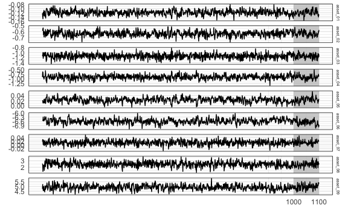

### LARGE

``` r
y_large_train <- dgp$y_large_train
y_large_test <- dgp$y_large_test
```

``` r
y_large_train %>% 
  mutate(train = TRUE) %>% 
  bind_rows(y_large_test %>% mutate(train = FALSE)) %>% 
  mutate(id = 1:n()) %>% 
  pivot_longer(-c(id, train), names_to = "asset", values_to = "value") %>% 
  ggplot(aes(x = id, y = value)) +
  annotate(
    geom = "rect",
    xmin = nrow(y_large_train),
    xmax = nrow(y_large_train) + nrow(y_large_test),
    ymin = -Inf,
    ymax = Inf,
    alpha = .7,
    fill = "grey" # test set
  ) +
  geom_path(size = .3) +
  facet_grid(asset ~ ., scales = "free_y") +
  scale_x_continuous(
    breaks = c(nrow(y_large_train), nrow(y_large_train) + nrow(y_large_test))
  ) +
  theme_minimal() +
  theme(
    strip.text.y = element_text(size = 5), 
    panel.border = element_rect(fill = NA),
    axis.text.y = element_text(size = 3)
  ) +
  labs(
    x = element_blank(),
    y = element_blank()
  )
```

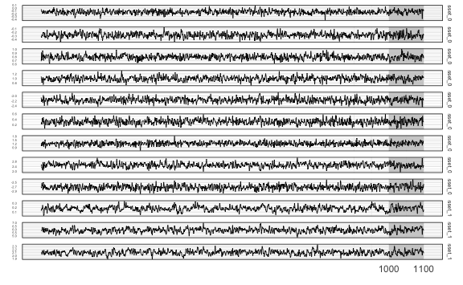

# Modeling

## VAR

``` r
(var_lag <- 5)
#> [1] 5
```

``` r
fit_var_small <- var_lm(y_small_train, var_lag, include_mean = FALSE)
fit_var_medium <- var_lm(y_medium_train, var_lag, include_mean = FALSE)
fit_var_large <- var_lm(y_large_train, var_lag, include_mean = FALSE)
```

## VHAR

``` r
fit_vhar_small <- vhar_lm(y_small_train, include_mean = FALSE)
fit_vhar_medium <- vhar_lm(y_medium_train, include_mean = FALSE)
fit_vhar_large <- vhar_lm(y_large_train, include_mean = FALSE)
```

## BVAR

``` r
(bvar_lag <- 5)
#> [1] 5
```

``` r
(bvar_small_optim <- choose_bvar(
  bvar_small_spec, 
  lower = c(
    rep(1e-2, n_small), # sigma
    1e-4, # lambda
    rep(1e-2, n_small) # delta
  ), 
  upper = c(
    rep(1, n_small), # sigma
    Inf, # lambda
    rep(1, n_small) # delta
  ), 
  y = y_small_train, 
  p = bvar_lag, 
  include_mean = FALSE
))
#> Model Specification for BVAR
#> 
#> Parameters: Coefficent matrice and Covariance matrix
#> Prior: Minnesota
#> # Type '?bvar_minnesota' in the console for some help.
#> ========================================================
#> 
#> Setting for 'sigma':
#> [1]  0.1090  0.0607  0.5813
#> 
#> Setting for 'lambda':
#> [1]  0.277
#> 
#> Setting for 'delta':
#> [1]  0.557  0.342  0.704
#> 
#> Setting for 'eps':
#> [1]  1e-04
```

``` r
(bvar_medium_optim <- choose_bvar(
  bvar_medium_spec, 
  lower = c(
    rep(1e-2, n_medium), # sigma
    1e-4, # lambda
    rep(1e-2, n_medium) # delta
  ), 
  upper = c(
    rep(1, n_medium), # sigma
    Inf, # lambda
    rep(1, n_medium) # delta
  ), 
  y = y_medium_train, 
  p = bvar_lag, 
  include_mean = FALSE
))
#> Model Specification for BVAR
#> 
#> Parameters: Coefficent matrice and Covariance matrix
#> Prior: Minnesota
#> # Type '?bvar_minnesota' in the console for some help.
#> ========================================================
#> 
#> Setting for 'sigma':
#> [1]  0.0230  0.0949  0.2415  0.2980  0.0195  0.1032  0.0294  0.7898  0.4474
#> 
#> Setting for 'lambda':
#> [1]  0.0828
#> 
#> Setting for 'delta':
#> [1]  0.3281  0.2984  0.0447  0.2529  0.5088  0.5683  0.1483  0.1949  0.3771
#> 
#> Setting for 'eps':
#> [1]  1e-04
```

``` r
(bvar_large_optim <- choose_bvar(
  bvar_large_spec, 
  lower = c(
    rep(1e-2, n_large), # sigma
    1e-4, # lambda
    rep(1e-2, n_large) # delta
  ), 
  upper = c(
    rep(1, n_large), # sigma
    Inf, # lambda
    rep(1, n_large) # delta
  ), 
  y = y_large_train, 
  p = bvar_lag, 
  include_mean = FALSE
))
#> Model Specification for BVAR
#> 
#> Parameters: Coefficent matrice and Covariance matrix
#> Prior: Minnesota
#> # Type '?bvar_minnesota' in the console for some help.
#> ========================================================
#> 
#> Setting for 'sigma':
#>  [1]  0.1807  0.1756  0.1628  0.2506  0.1937  0.2178  0.3495  0.1533  0.1867
#> [10]  0.1383  0.3180  0.0814
#> 
#> Setting for 'lambda':
#> [1]  0.097
#> 
#> Setting for 'delta':
#>  [1]  0.133  0.237  0.151  0.287  0.227  0.246  0.029  0.343  0.104  0.510
#> [11]  0.493  0.500
#> 
#> Setting for 'eps':
#> [1]  1e-04
```

``` r
fit_small_bvar <- bvar_small_optim$fit
fit_medium_bvar <- bvar_medium_optim$fit
fit_large_bvar <- bvar_large_optim$fit
```

## BVHAR-VAR

``` r
bvhar_var_small_spec <- set_bvhar(
  sigma = bvar_small_spec$sigma,
  lambda = bvar_small_spec$lambda,
  delta = bvar_small_spec$delta
)
#----------------------------
bvhar_var_medium_spec <- set_bvhar(
  sigma = bvar_medium_spec$sigma,
  lambda = bvar_medium_spec$lambda,
  delta = bvar_medium_spec$delta
)
#----------------------------
bvhar_var_large_spec <- set_bvhar(
  sigma = bvar_large_spec$sigma,
  lambda = bvar_large_spec$lambda,
  delta = bvar_large_spec$delta
)
```

``` r
(bvhar_var_small_optim <- choose_bvhar(
  bvhar_var_small_spec, 
  lower = c(
    rep(1e-2, n_small), # sigma
    1e-4, # lambda
    rep(1e-2, n_small) # delta
  ), 
  upper = c(
    rep(1, n_small), # sigma
    Inf, # lambda
    rep(1, n_small) # delta
  ), 
  y = y_small_train, 
  include_mean = FALSE
))
#> Model Specification for BVHAR
#> 
#> Parameters: Coefficent matrice and Covariance matrix
#> Prior: MN_VAR
#> # Type '?bvhar_minnesota' in the console for some help.
#> ========================================================
#> 
#> Setting for 'sigma':
#> [1]  0.1267  0.0631  0.5005
#> 
#> Setting for 'lambda':
#> [1]  0.925
#> 
#> Setting for 'delta':
#> [1]  0.547  0.129  0.541
#> 
#> Setting for 'eps':
#> [1]  1e-04
```

``` r
(bvhar_var_medium_optim <- choose_bvhar(
  bvhar_var_medium_spec, 
  lower = c(
    rep(1e-2, n_medium), # sigma
    1e-4, # lambda
    rep(1e-2, n_medium) # delta
  ), 
  upper = c(
    rep(1, n_medium), # sigma
    Inf, # lambda
    rep(1, n_medium) # delta
  ), 
  y = y_medium_train, 
  include_mean = FALSE
))
#> Model Specification for BVHAR
#> 
#> Parameters: Coefficent matrice and Covariance matrix
#> Prior: MN_VAR
#> # Type '?bvhar_minnesota' in the console for some help.
#> ========================================================
#> 
#> Setting for 'sigma':
#> [1]  0.0235  0.1103  0.2569  0.2811  0.0186  0.0302  0.0315  0.7635  0.4150
#> 
#> Setting for 'lambda':
#> [1]  0.0624
#> 
#> Setting for 'delta':
#> [1]  0.296  0.285  0.010  0.239  0.506  0.505  0.138  0.179  0.362
#> 
#> Setting for 'eps':
#> [1]  1e-04
```

``` r
(bvhar_var_large_optim <- choose_bvhar(
  bvhar_var_large_spec, 
  lower = c(
    rep(1e-2, n_large), # sigma
    1e-4, # lambda
    rep(1e-2, n_large) # delta
  ), 
  upper = c(
    rep(1, n_large), # sigma
    Inf, # lambda
    rep(1, n_large) # delta
  ), 
  y = y_large_train, 
  include_mean = FALSE
))
#> Model Specification for BVHAR
#> 
#> Parameters: Coefficent matrice and Covariance matrix
#> Prior: MN_VAR
#> # Type '?bvhar_minnesota' in the console for some help.
#> ========================================================
#> 
#> Setting for 'sigma':
#>  [1]  0.1754  0.1734  0.1856  0.2581  0.2238  0.2171  0.3854  0.1413  0.1776
#> [10]  0.1390  0.3771  0.0277
#> 
#> Setting for 'lambda':
#> [1]  0.103
#> 
#> Setting for 'delta':
#>  [1]  0.1355  0.2362  0.1448  0.2811  0.2275  0.2367  0.0194  0.3331  0.0954
#> [10]  0.5094  0.4866  0.4994
#> 
#> Setting for 'eps':
#> [1]  1e-04
```

``` r
fit_bvhar_small_var <- bvhar_var_small_optim$fit
fit_bvhar_medium_var <- bvhar_var_medium_optim$fit
fit_bvhar_large_var <- bvhar_var_large_optim$fit
```

## BVHAR-VHAR

``` r
bvhar_vhar_small_spec <- set_weight_bvhar(
  sigma = bvar_small_spec$sigma,
  lambda = bvar_small_spec$lambda,
  daily = bvar_small_spec$delta,
  weekly = bvar_small_spec$delta,
  monthly = bvar_small_spec$delta
)
#-----------------------------------------
bvhar_vhar_medium_spec <- set_weight_bvhar(
  sigma = bvar_medium_spec$sigma,
  lambda = bvar_medium_spec$lambda,
  daily = bvar_medium_spec$delta,
  weekly = bvar_medium_spec$delta,
  monthly = bvar_medium_spec$delta
)
#-----------------------------------------
bvhar_vhar_large_spec <- set_weight_bvhar(
  sigma = bvar_large_spec$sigma,
  lambda = bvar_large_spec$lambda,
  daily = bvar_large_spec$delta,
  weekly = bvar_large_spec$delta,
  monthly = bvar_large_spec$delta
)
```

``` r
(bvhar_vhar_small_optim <- choose_bvhar(
  bvhar_vhar_small_spec, 
  lower = c(
    rep(1e-2, n_small), # sigma
    1e-4, # lambda
    rep(1e-2, n_small), # daily
    rep(1e-2, n_small), # weekly
    rep(1e-2, n_small) # monthly
  ), 
  upper = c(
    rep(1, n_small), # sigma
    Inf, # lambda
    rep(1, n_small), # daily
    rep(1, n_small), # weekly
    rep(1, n_small) # monthly
  ), 
  y = y_small_train, 
  include_mean = FALSE
))
#> Model Specification for BVHAR
#> 
#> Parameters: Coefficent matrice and Covariance matrix
#> Prior: MN_VHAR
#> # Type '?bvhar_minnesota' in the console for some help.
#> ========================================================
#> 
#> Setting for 'sigma':
#> [1]  0.1264  0.0795  0.9685
#> 
#> Setting for 'lambda':
#> [1]  0.898
#> 
#> Setting for 'eps':
#> [1]  1e-04
#> 
#> Setting for 'daily':
#> [1]  0.541  0.135  0.545
#> 
#> Setting for 'weekly':
#> [1]  0.010  0.107  0.145
#> 
#> Setting for 'monthly':
#> [1]  0.117  0.783  0.631
```

``` r
(bvhar_vhar_medium_optim <- choose_bvhar(
  bvhar_vhar_medium_spec, 
  lower = c(
    rep(1e-2, n_medium), # sigma
    1e-4, # lambda
    rep(1e-2, n_medium), # daily
    rep(1e-2, n_medium), # weekly
    rep(1e-2, n_medium) # monthly
  ), 
  upper = c(
    rep(1, n_medium), # sigma
    Inf, # lambda
    rep(1, n_medium), # daily
    rep(1, n_medium), # weekly
    rep(1, n_medium) # monthly
  ), 
  y = y_medium_train, 
  include_mean = FALSE
))
#> Model Specification for BVHAR
#> 
#> Parameters: Coefficent matrice and Covariance matrix
#> Prior: MN_VHAR
#> # Type '?bvhar_minnesota' in the console for some help.
#> ========================================================
#> 
#> Setting for 'sigma':
#> [1]  0.0231  0.1114  0.2633  0.2903  0.0183  0.0546  0.0312  0.7727  0.4083
#> 
#> Setting for 'lambda':
#> [1]  0.0604
#> 
#> Setting for 'eps':
#> [1]  1e-04
#> 
#> Setting for 'daily':
#> [1]  0.264  0.277  0.010  0.240  0.503  0.496  0.137  0.161  0.347
#> 
#> Setting for 'weekly':
#> [1]  0.1617  0.0702  0.1690  0.0100  0.0195  0.0100  0.0160  0.0902  0.0100
#> 
#> Setting for 'monthly':
#> [1]  0.3120  0.3034  0.4658  0.0100  0.1563  0.8883  0.0811  0.0708  0.4116
```

``` r
(bvhar_vhar_large_optim <- choose_bvhar(
  bvhar_vhar_large_spec, 
  lower = c(
    rep(1e-2, n_large), # sigma
    1e-4, # lambda
    rep(1e-2, n_large), # daily
    rep(1e-2, n_large), # weekly
    rep(1e-2, n_large) # monthly
  ), 
  upper = c(
    rep(1, n_large), # sigma
    Inf, # lambda
    rep(1, n_large), # daily
    rep(1, n_large), # weekly
    rep(1, n_large) # monthly
  ), 
  y = y_large_train, 
  include_mean = FALSE
))
#> Model Specification for BVHAR
#> 
#> Parameters: Coefficent matrice and Covariance matrix
#> Prior: MN_VHAR
#> # Type '?bvhar_minnesota' in the console for some help.
#> ========================================================
#> 
#> Setting for 'sigma':
#>  [1]  0.1750  0.1705  0.1839  0.2509  0.2134  0.2116  0.3730  0.1756  0.1702
#> [10]  0.1374  0.3452  0.0662
#> 
#> Setting for 'lambda':
#> [1]  0.0881
#> 
#> Setting for 'eps':
#> [1]  1e-04
#> 
#> Setting for 'daily':
#>  [1]  0.1302  0.2293  0.1259  0.2551  0.2157  0.2292  0.0119  0.3282  0.0942
#> [10]  0.4822  0.4694  0.4924
#> 
#> Setting for 'weekly':
#>  [1]  0.0100  0.0376  0.1595  0.1571  0.0109  0.0100  0.0262  0.0100  0.0100
#> [10]  0.1336  0.0100  0.0380
#> 
#> Setting for 'monthly':
#>  [1]  0.3741  0.2312  0.4238  0.0274  0.8450  0.3480  0.8402  0.8409  1.0000
#> [10]  0.0849  0.6706  0.5535
```

``` r
fit_bvhar_small_vhar <- bvhar_vhar_small_optim$fit
fit_bvhar_medium_vhar <- bvhar_vhar_medium_optim$fit
fit_bvhar_large_vhar <- bvhar_vhar_large_optim$fit
```

# Errors

## Hyperparameters

### SMALL

    \begin{table}

    \caption{\label{tab:hyperparamsmall}SMALL Simulation - Hyperparameter Lists}
    \centering
    \begin{tabular}[t]{lrrr}
    \toprule
    \addlinespace[0.3em]
    \multicolumn{4}{l}{\textbf{BVAR}}\\
    \hspace{1em}$\sigma$ & 0.109 & 0.061 & 0.581\\
    \hspace{1em}$\lambda$ & 0.277 &  & \\
    \hspace{1em}$\delta$ & 0.557 & 0.342 & 0.704\\
    \addlinespace[0.3em]
    \multicolumn{4}{l}{\textbf{BVHAR-VAR}}\\
    \hspace{1em}$\sigma$1 & 0.127 & 0.063 & 0.500\\
    \hspace{1em}$\lambda$1 & 0.925 &  & \\
    \hspace{1em}$\delta$ 1 & 0.547 & 0.129 & 0.541\\
    \addlinespace[0.3em]
    \multicolumn{4}{l}{\textbf{BVHAR-VHAR}}\\
    \hspace{1em}$\sigma$2 & 0.126 & 0.080 & 0.968\\
    \hspace{1em}$\lambda$2 & 0.898 &  & \\
    \hspace{1em}$d_i$ & 0.541 & 0.135 & 0.545\\
    \hspace{1em}$w_i$ & 0.010 & 0.107 & 0.145\\
    \hspace{1em}$m_i$ & 0.117 & 0.783 & 0.631\\
    \bottomrule
    \end{tabular}
    \end{table}

### MEDIUM

    \begin{table}

    \caption{\label{tab:hyperparammed}MEDIUM Simulation - Hyperparameter Lists}
    \centering
    \begin{tabular}[t]{lrrrrrrrrr}
    \toprule
    \addlinespace[0.3em]
    \multicolumn{10}{l}{\textbf{BVAR}}\\
    \hspace{1em}$\sigma$ & 0.023 & 0.095 & 0.242 & 0.298 & 0.019 & 0.103 & 0.029 & 0.790 & 0.447\\
    \hspace{1em}$\lambda$ & 0.083 &  &  &  &  &  &  &  & \\
    \hspace{1em}$\delta$ & 0.328 & 0.298 & 0.045 & 0.253 & 0.509 & 0.568 & 0.148 & 0.195 & 0.377\\
    \addlinespace[0.3em]
    \multicolumn{10}{l}{\textbf{BVHAR-VAR}}\\
    \hspace{1em}$\sigma$1 & 0.024 & 0.110 & 0.257 & 0.281 & 0.019 & 0.030 & 0.031 & 0.764 & 0.415\\
    \hspace{1em}$\lambda$1 & 0.062 &  &  &  &  &  &  &  & \\
    \hspace{1em}$\delta$ 1 & 0.296 & 0.285 & 0.010 & 0.239 & 0.506 & 0.505 & 0.138 & 0.179 & 0.362\\
    \addlinespace[0.3em]
    \multicolumn{10}{l}{\textbf{BVHAR-VHAR}}\\
    \hspace{1em}$\sigma$2 & 0.023 & 0.111 & 0.263 & 0.290 & 0.018 & 0.055 & 0.031 & 0.773 & 0.408\\
    \hspace{1em}$\lambda$2 & 0.060 &  &  &  &  &  &  &  & \\
    \hspace{1em}$d_i$ & 0.264 & 0.277 & 0.010 & 0.240 & 0.503 & 0.496 & 0.137 & 0.161 & 0.347\\
    \hspace{1em}$w_i$ & 0.162 & 0.070 & 0.169 & 0.010 & 0.019 & 0.010 & 0.016 & 0.090 & 0.010\\
    \hspace{1em}$m_i$ & 0.312 & 0.303 & 0.466 & 0.010 & 0.156 & 0.888 & 0.081 & 0.071 & 0.412\\
    \bottomrule
    \end{tabular}
    \end{table}

### LARGE

    \begin{table}

    \caption{\label{tab:hyperparamlarge}LARGE Simulation - Hyperparameter Lists}
    \centering
    \begin{tabular}[t]{lrrrrrrrrrrrr}
    \toprule
    \addlinespace[0.3em]
    \multicolumn{13}{l}{\textbf{BVAR}}\\
    \hspace{1em}$\sigma$ & 0.181 & 0.176 & 0.163 & 0.251 & 0.194 & 0.218 & 0.349 & 0.153 & 0.187 & 0.138 & 0.318 & 0.081\\
    \hspace{1em}$\lambda$ & 0.097 &  &  &  &  &  &  &  &  &  &  & \\
    \hspace{1em}$\delta$ & 0.133 & 0.237 & 0.151 & 0.287 & 0.227 & 0.246 & 0.029 & 0.343 & 0.104 & 0.510 & 0.493 & 0.500\\
    \addlinespace[0.3em]
    \multicolumn{13}{l}{\textbf{BVHAR-VAR}}\\
    \hspace{1em}$\sigma$1 & 0.175 & 0.173 & 0.186 & 0.258 & 0.224 & 0.217 & 0.385 & 0.141 & 0.178 & 0.139 & 0.377 & 0.028\\
    \hspace{1em}$\lambda$1 & 0.103 &  &  &  &  &  &  &  &  &  &  & \\
    \hspace{1em}$\delta$ 1 & 0.136 & 0.236 & 0.145 & 0.281 & 0.227 & 0.237 & 0.019 & 0.333 & 0.095 & 0.509 & 0.487 & 0.499\\
    \addlinespace[0.3em]
    \multicolumn{13}{l}{\textbf{BVHAR-VHAR}}\\
    \hspace{1em}$\sigma$2 & 0.175 & 0.171 & 0.184 & 0.251 & 0.213 & 0.212 & 0.373 & 0.176 & 0.170 & 0.137 & 0.345 & 0.066\\
    \hspace{1em}$\lambda$2 & 0.088 &  &  &  &  &  &  &  &  &  &  & \\
    \hspace{1em}$d_i$ & 0.130 & 0.229 & 0.126 & 0.255 & 0.216 & 0.229 & 0.012 & 0.328 & 0.094 & 0.482 & 0.469 & 0.492\\
    \hspace{1em}$w_i$ & 0.010 & 0.038 & 0.159 & 0.157 & 0.011 & 0.010 & 0.026 & 0.010 & 0.010 & 0.134 & 0.010 & 0.038\\
    \hspace{1em}$m_i$ & 0.374 & 0.231 & 0.424 & 0.027 & 0.845 & 0.348 & 0.840 & 0.841 & 1.000 & 0.085 & 0.671 & 0.553\\
    \bottomrule
    \end{tabular}
    \end{table}

## SMALL

``` r
mod_small_list <- list(
  fit_var_small,
  fit_vhar_small,
  fit_small_bvar,
  fit_bvhar_small_var,
  fit_bvhar_small_vhar
)
# 1-step-----------
cv_small_1 <- 
  mod_small_list %>% 
  lapply(
    function(mod) {
      forecast_roll(mod, 1, y_small_test)
    }
  )
# 5-step-----------
cv_small_5 <- 
  mod_small_list %>% 
  lapply(
    function(mod) {
      forecast_roll(mod, 5, y_small_test)
    }
  )
# 20-step----------
cv_small_20 <- 
  mod_small_list %>% 
  lapply(
    function(mod) {
      forecast_roll(mod, 20, y_small_test)
    }
  )
```

### Plots

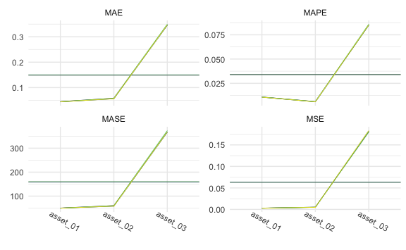

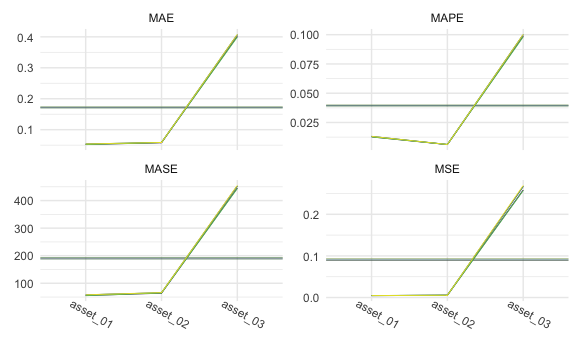

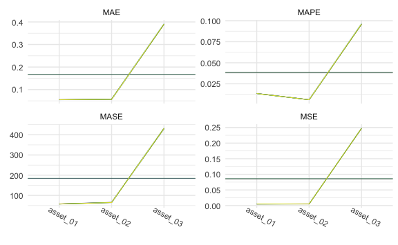

### Tables

1-step:


    \begin{longtable}[t]{lllllll}
    \caption{\label{tab:smallone}SMALL Simulation - 1-step ahead Rolling Window Forecasting Loss}\\
    \toprule
    \multicolumn{1}{c}{ } & \multicolumn{1}{c}{ } & \multicolumn{2}{c}{Frequentist} & \multicolumn{1}{c}{BVAR} & \multicolumn{2}{c}{BVHAR} \\
    \cmidrule(l{3pt}r{3pt}){3-4} \cmidrule(l{3pt}r{3pt}){5-5} \cmidrule(l{3pt}r{3pt}){6-7}
     &  & VAR & VHAR & Minnesota & VAR-type & VHAR-type\\
    \midrule
    \endfirsthead
    \caption[]{SMALL Simulation - 1-step ahead Rolling Window Forecasting Loss \textit{(continued)}}\\
    \toprule
     &  & VAR & VHAR & Minnesota & VAR-type & VHAR-type\\
    \midrule
    \endhead

    \endfoot
    \bottomrule
    \endlastfoot
     & asset01 & \num{0.00295} & \textcolor{red}{\num{0.00286}} & \num{0.00295} & \num{0.00286} & \num{0.00286}\\
    \cmidrule{2-7}\nopagebreak
     & asset02 & \num{0.00527} & \num{0.00495} & \num{0.00526} & \textcolor{red}{\num{0.00494}} & \num{0.00495}\\
    \cmidrule{2-7}\nopagebreak
     & asset03 & \textcolor{red}{\num{0.18}} & \num{0.183} & \num{0.181} & \num{0.182} & \num{0.183}\\
    \cmidrule{2-7}\nopagebreak
    \multirow{-4}{*}{\raggedright\arraybackslash MSE} & \cellcolor{gray}{Average} & \textcolor{red}{\num{0.0628}} & \num{0.0637} & \num{0.063} & \num{0.0634} & \num{0.0635}\\
    \cmidrule{1-7}\pagebreak[0]
     & asset01 & \num{0.0445} & \textcolor{red}{\num{0.0439}} & \num{0.0446} & \num{0.0439} & \num{0.044}\\
    \cmidrule{2-7}\nopagebreak
     & asset02 & \num{0.0578} & \textcolor{red}{\num{0.0561}} & \num{0.058} & \num{0.0563} & \num{0.0564}\\
    \cmidrule{2-7}\nopagebreak
     & asset03 & \num{0.349} & \num{0.346} & \num{0.347} & \textcolor{red}{\num{0.346}} & \num{0.346}\\
    \cmidrule{2-7}\nopagebreak
    \multirow{-4}{*}{\raggedright\arraybackslash MAE} & \cellcolor{gray}{Average} & \num{0.151} & \num{0.149} & \num{0.15} & \textcolor{red}{\num{0.149}} & \num{0.149}\\
    \cmidrule{1-7}\pagebreak[0]
     & asset01 & \num{0.0109} & \textcolor{red}{\num{0.0107}} & \num{0.0109} & \num{0.0107} & \num{0.0107}\\
    \cmidrule{2-7}\nopagebreak
     & asset02 & \num{0.0061} & \textcolor{red}{\num{0.00592}} & \num{0.00612} & \num{0.00594} & \num{0.00595}\\
    \cmidrule{2-7}\nopagebreak
     & asset03 & \num{0.0859} & \num{0.0851} & \num{0.0852} & \textcolor{red}{\num{0.085}} & \num{0.085}\\
    \cmidrule{2-7}\nopagebreak
    \multirow{-4}{*}{\raggedright\arraybackslash MAPE} & \cellcolor{gray}{Average} & \num{0.0343} & \num{0.0339} & \num{0.0341} & \textcolor{red}{\num{0.0339}} & \num{0.0339}\\
    \cmidrule{1-7}\pagebreak[0]
     & asset01 & \num{49.667} & \textcolor{red}{\num{49.527}} & \num{50.029} & \num{49.579} & \num{49.663}\\
    \cmidrule{2-7}\nopagebreak
     & asset02 & \num{60.154} & \textcolor{red}{\num{58.155}} & \num{60.248} & \num{58.307} & \num{58.437}\\
    \cmidrule{2-7}\nopagebreak
     & asset03 & \num{373.317} & \num{367.603} & \num{368.143} & \textcolor{red}{\num{367.174}} & \num{367.229}\\
    \cmidrule{2-7}\nopagebreak
    \multirow{-4}{*}{\raggedright\arraybackslash MASE} & \cellcolor{gray}{Average} & \num{161.046} & \num{158.428} & \num{159.473} & \textcolor{red}{\num{158.353}} & \num{158.443}\\*
    \end{longtable}

5-step:


    \begin{longtable}[t]{lllllll}
    \caption{\label{tab:smallfive}SMALL Simulation - 5-step ahead Rolling Window Forecasting Loss}\\
    \toprule
    \multicolumn{1}{c}{ } & \multicolumn{1}{c}{ } & \multicolumn{2}{c}{Frequentist} & \multicolumn{1}{c}{BVAR} & \multicolumn{2}{c}{BVHAR} \\
    \cmidrule(l{3pt}r{3pt}){3-4} \cmidrule(l{3pt}r{3pt}){5-5} \cmidrule(l{3pt}r{3pt}){6-7}
     &  & VAR & VHAR & Minnesota & VAR-type & VHAR-type\\
    \midrule
    \endfirsthead
    \caption[]{SMALL Simulation - 5-step ahead Rolling Window Forecasting Loss \textit{(continued)}}\\
    \toprule
     &  & VAR & VHAR & Minnesota & VAR-type & VHAR-type\\
    \midrule
    \endhead

    \endfoot
    \bottomrule
    \endlastfoot
     & asset01 & \textcolor{red}{\num{0.00451}} & \num{0.00471} & \num{0.00454} & \num{0.00469} & \num{0.00472}\\
    \cmidrule{2-7}\nopagebreak
     & asset02 & \num{0.00556} & \num{0.00544} & \num{0.00546} & \textcolor{red}{\num{0.0054}} & \num{0.00541}\\
    \cmidrule{2-7}\nopagebreak
     & asset03 & \textcolor{red}{\num{0.257}} & \num{0.269} & \num{0.258} & \num{0.267} & \num{0.267}\\
    \cmidrule{2-7}\nopagebreak
    \multirow{-4}{*}{\raggedright\arraybackslash MSE} & \cellcolor{gray}{Average} & \textcolor{red}{\num{0.089}} & \num{0.0931} & \num{0.0895} & \num{0.0923} & \num{0.0925}\\
    \cmidrule{1-7}\pagebreak[0]
     & asset01 & \textcolor{red}{\num{0.0519}} & \num{0.0539} & \num{0.0521} & \num{0.0536} & \num{0.0538}\\
    \cmidrule{2-7}\nopagebreak
     & asset02 & \num{0.0588} & \num{0.0587} & \textcolor{red}{\num{0.058}} & \num{0.0585} & \num{0.0586}\\
    \cmidrule{2-7}\nopagebreak
     & asset03 & \textcolor{red}{\num{0.399}} & \num{0.408} & \num{0.402} & \num{0.407} & \num{0.407}\\
    \cmidrule{2-7}\nopagebreak
    \multirow{-4}{*}{\raggedright\arraybackslash MAE} & \cellcolor{gray}{Average} & \textcolor{red}{\num{0.17}} & \num{0.173} & \num{0.171} & \num{0.173} & \num{0.173}\\
    \cmidrule{1-7}\pagebreak[0]
     & asset01 & \textcolor{red}{\num{0.0127}} & \num{0.0132} & \num{0.0127} & \num{0.0131} & \num{0.0131}\\
    \cmidrule{2-7}\nopagebreak
     & asset02 & \num{0.0062} & \num{0.0062} & \textcolor{red}{\num{0.00612}} & \num{0.00618} & \num{0.00618}\\
    \cmidrule{2-7}\nopagebreak
     & asset03 & \textcolor{red}{\num{0.0982}} & \num{0.1002} & \num{0.0987} & \num{0.1} & \num{0.1001}\\
    \cmidrule{2-7}\nopagebreak
    \multirow{-4}{*}{\raggedright\arraybackslash MAPE} & \cellcolor{gray}{Average} & \textcolor{red}{\num{0.039}} & \num{0.0399} & \num{0.0392} & \num{0.0398} & \num{0.0398}\\
    \cmidrule{1-7}\pagebreak[0]
     & asset01 & \textcolor{red}{\num{55.094}} & \num{58.144} & \num{55.45} & \num{57.881} & \num{58.036}\\
    \cmidrule{2-7}\nopagebreak
     & asset02 & \num{65.033} & \num{66.103} & \textcolor{red}{\num{64.101}} & \num{65.66} & \num{65.558}\\
    \cmidrule{2-7}\nopagebreak
     & asset03 & \textcolor{red}{\num{443.753}} & \num{454.823} & \num{445.838} & \num{453.185} & \num{453.154}\\
    \cmidrule{2-7}\nopagebreak
    \multirow{-4}{*}{\raggedright\arraybackslash MASE} & \cellcolor{gray}{Average} & \textcolor{red}{\num{187.96}} & \num{193.024} & \num{188.463} & \num{192.242} & \num{192.25}\\*
    \end{longtable}

20-step:


    \begin{longtable}[t]{lllllll}
    \caption{\label{tab:smalltwenty}SMALL Simulation - 20-step ahead Rolling Window Forecasting Loss}\\
    \toprule
    \multicolumn{1}{c}{ } & \multicolumn{1}{c}{ } & \multicolumn{2}{c}{Frequentist} & \multicolumn{1}{c}{BVAR} & \multicolumn{2}{c}{BVHAR} \\
    \cmidrule(l{3pt}r{3pt}){3-4} \cmidrule(l{3pt}r{3pt}){5-5} \cmidrule(l{3pt}r{3pt}){6-7}
     &  & VAR & VHAR & Minnesota & VAR-type & VHAR-type\\
    \midrule
    \endfirsthead
    \caption[]{SMALL Simulation - 20-step ahead Rolling Window Forecasting Loss \textit{(continued)}}\\
    \toprule
     &  & VAR & VHAR & Minnesota & VAR-type & VHAR-type\\
    \midrule
    \endhead

    \endfoot
    \bottomrule
    \endlastfoot
     & asset01 & \textcolor{red}{\num{0.00487}} & \num{0.00494} & \num{0.00495} & \num{0.00497} & \num{0.00499}\\
    \cmidrule{2-7}\nopagebreak
     & asset02 & \num{0.00533} & \num{0.00513} & \num{0.00543} & \textcolor{red}{\num{0.00511}} & \num{0.00513}\\
    \cmidrule{2-7}\nopagebreak
     & asset03 & \num{0.247} & \num{0.247} & \textcolor{red}{\num{0.246}} & \num{0.247} & \num{0.248}\\
    \cmidrule{2-7}\nopagebreak
    \multirow{-4}{*}{\raggedright\arraybackslash MSE} & \cellcolor{gray}{Average} & \num{0.0857} & \num{0.0858} & \textcolor{red}{\num{0.0856}} & \num{0.0858} & \num{0.0862}\\
    \cmidrule{1-7}\pagebreak[0]
     & asset01 & \textcolor{red}{\num{0.0547}} & \num{0.055} & \num{0.0552} & \num{0.055} & \num{0.0551}\\
    \cmidrule{2-7}\nopagebreak
     & asset02 & \num{0.057} & \num{0.0568} & \num{0.0576} & \textcolor{red}{\num{0.0567}} & \num{0.0569}\\
    \cmidrule{2-7}\nopagebreak
     & asset03 & \num{0.389} & \num{0.39} & \textcolor{red}{\num{0.389}} & \num{0.39} & \num{0.392}\\
    \cmidrule{2-7}\nopagebreak
    \multirow{-4}{*}{\raggedright\arraybackslash MAE} & \cellcolor{gray}{Average} & \textcolor{red}{\num{0.167}} & \num{0.167} & \num{0.167} & \num{0.167} & \num{0.168}\\
    \cmidrule{1-7}\pagebreak[0]
     & asset01 & \textcolor{red}{\num{0.0134}} & \num{0.0134} & \num{0.0135} & \num{0.0134} & \num{0.0134}\\
    \cmidrule{2-7}\nopagebreak
     & asset02 & \num{0.00602} & \num{0.00599} & \num{0.00608} & \textcolor{red}{\num{0.00598}} & \num{0.006}\\
    \cmidrule{2-7}\nopagebreak
     & asset03 & \num{0.0957} & \num{0.096} & \textcolor{red}{\num{0.0956}} & \num{0.0959} & \num{0.0964}\\
    \cmidrule{2-7}\nopagebreak
    \multirow{-4}{*}{\raggedright\arraybackslash MAPE} & \cellcolor{gray}{Average} & \textcolor{red}{\num{0.0384}} & \num{0.0385} & \num{0.0384} & \num{0.0384} & \num{0.0386}\\
    \cmidrule{1-7}\pagebreak[0]
     & asset01 & \num{57.544} & \num{57.415} & \num{57.951} & \textcolor{red}{\num{57.394}} & \num{57.5}\\
    \cmidrule{2-7}\nopagebreak
     & asset02 & \num{65.246} & \num{64.719} & \num{65.873} & \textcolor{red}{\num{64.532}} & \num{64.81}\\
    \cmidrule{2-7}\nopagebreak
     & asset03 & \num{430.027} & \num{432.15} & \textcolor{red}{\num{429.686}} & \num{431.7} & \num{433.544}\\
    \cmidrule{2-7}\nopagebreak
    \multirow{-4}{*}{\raggedright\arraybackslash MASE} & \cellcolor{gray}{Average} & \textcolor{red}{\num{184.272}} & \num{184.762} & \num{184.503} & \num{184.542} & \num{185.285}\\*
    \end{longtable}

## MEDIUM

``` r
mod_medium_list <- list(
  fit_var_medium,
  fit_vhar_medium,
  fit_medium_bvar,
  fit_bvhar_medium_var,
  fit_bvhar_medium_vhar
)
# 1-step-----------
cv_medium_1 <- 
  mod_medium_list %>% 
  lapply(
    function(mod) {
      forecast_roll(mod, 1, y_medium_test)
    }
  )
# 5-step-----------
cv_medium_5 <- 
  mod_medium_list %>% 
  lapply(
    function(mod) {
      forecast_roll(mod, 5, y_medium_test)
    }
  )
# 20-step----------
cv_medium_20 <- 
  mod_medium_list %>% 
  lapply(
    function(mod) {
      forecast_roll(mod, 20, y_medium_test)
    }
  )
```

### Plots

``` r
cv_medium_1 %>% 
  gg_loss(
    y_medium_test, 
    mean_line = TRUE, 
    line_param = list(size = .3), 
    mean_param = list(alpha = .5, size = .3), 
    viridis = TRUE, 
    show.legend = FALSE
  ) +
  theme_minimal() +
  theme(
    axis.text.x = element_text(angle = -30, vjust = -1),
    legend.title = element_text(size = 8),
    legend.text = element_text(size = 7),
    legend.key.size = unit(.3, "cm")
  )
```

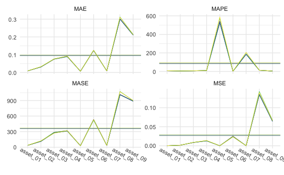

``` r
cv_medium_5 %>% 
  gg_loss(
    y_medium_test, 
    mean_line = TRUE, 
    line_param = list(size = .3), 
    mean_param = list(alpha = .5, size = .3), 
    viridis = TRUE, 
    show.legend = FALSE
  ) +
  theme_minimal() +
  theme(
    axis.text.x = element_text(angle = -30, vjust = -1),
    legend.title = element_text(size = 8),
    legend.text = element_text(size = 7),
    legend.key.size = unit(.3, "cm")
  )
```

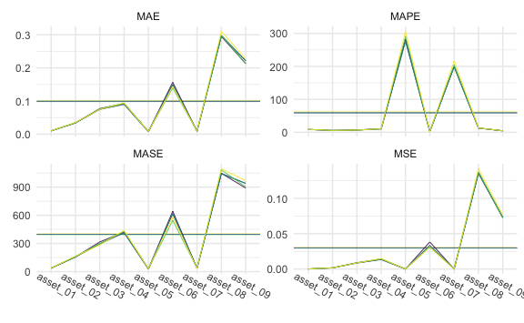

``` r
cv_medium_20 %>% 
  gg_loss(
    y_medium_test, 
    mean_line = TRUE, 
    line_param = list(size = .3), 
    mean_param = list(alpha = .5, size = .3), 
    viridis = TRUE, 
    show.legend = FALSE
  ) +
  theme_minimal() +
  theme(
    axis.text.x = element_text(angle = -30, vjust = -1),
    legend.title = element_text(size = 8),
    legend.text = element_text(size = 7),
    legend.key.size = unit(.3, "cm")
  )
```

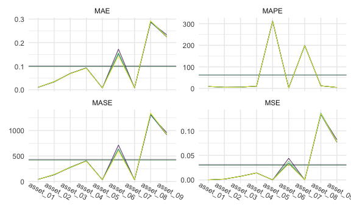

### Tables

1-step:


    \begin{longtable}[t]{lllllll}
    \caption{\label{tab:medone}MEDIUM Simulation - 1-step ahead Rolling Window Forecasting Loss}\\
    \toprule
    \multicolumn{1}{c}{ } & \multicolumn{1}{c}{ } & \multicolumn{2}{c}{Frequentist} & \multicolumn{1}{c}{BVAR} & \multicolumn{2}{c}{BVHAR} \\
    \cmidrule(l{3pt}r{3pt}){3-4} \cmidrule(l{3pt}r{3pt}){5-5} \cmidrule(l{3pt}r{3pt}){6-7}
     &  & VAR & VHAR & Minnesota & VAR-type & VHAR-type\\
    \midrule
    \endfirsthead
    \caption[]{MEDIUM Simulation - 1-step ahead Rolling Window Forecasting Loss \textit{(continued)}}\\
    \toprule
     &  & VAR & VHAR & Minnesota & VAR-type & VHAR-type\\
    \midrule
    \endhead

    \endfoot
    \bottomrule
    \endlastfoot
     & asset01 & \num{0.000133} & \num{0.000132} & \num{0.000124} & \textcolor{red}{\num{0.000122}} & \num{0.000122}\\
    \cmidrule{2-7}\nopagebreak
     & asset02 & \num{0.0015} & \num{0.00155} & \num{0.00147} & \num{0.00146} & \textcolor{red}{\num{0.00144}}\\
    \cmidrule{2-7}\nopagebreak
     & asset03 & \num{0.00895} & \num{0.00881} & \num{0.00877} & \textcolor{red}{\num{0.00844}} & \num{0.00847}\\
    \cmidrule{2-7}\nopagebreak
     & asset04 & \num{0.0135} & \num{0.0139} & \num{0.0132} & \textcolor{red}{\num{0.0129}} & \num{0.0129}\\
    \cmidrule{2-7}\nopagebreak
     & asset05 & \num{7.58e-05} & \num{7.71e-05} & \num{7.32e-05} & \num{7.32e-05} & \textcolor{red}{\num{7.28e-05}}\\
    \cmidrule{2-7}\nopagebreak
     & asset06 & \num{0.0247} & \textcolor{red}{\num{0.0236}} & \num{0.0252} & \num{0.0236} & \num{0.0236}\\
    \cmidrule{2-7}\nopagebreak
     & asset07 & \num{0.000134} & \num{0.00013} & \num{0.000131} & \textcolor{red}{\num{0.000128}} & \num{0.000129}\\
    \cmidrule{2-7}\nopagebreak
     & asset08 & \num{0.143} & \num{0.14} & \num{0.135} & \num{0.135} & \textcolor{red}{\num{0.134}}\\
    \cmidrule{2-7}\nopagebreak
     & asset09 & \num{0.0673} & \num{0.0661} & \num{0.0656} & \textcolor{red}{\num{0.0638}} & \num{0.0642}\\
    \cmidrule{2-7}\nopagebreak
    \multirow{-10}{*}{\raggedright\arraybackslash MSE} & \cellcolor{gray}{Average} & \num{0.0288} & \num{0.0282} & \num{0.0277} & \num{0.0272} & \textcolor{red}{\num{0.0272}}\\
    \cmidrule{1-7}\pagebreak[0]
     & asset01 & \num{0.00915} & \num{0.00899} & \textcolor{red}{\num{0.00867}} & \num{0.00868} & \num{0.00872}\\
    \cmidrule{2-7}\nopagebreak
     & asset02 & \num{0.0322} & \num{0.0326} & \num{0.0308} & \num{0.0308} & \textcolor{red}{\num{0.0307}}\\
    \cmidrule{2-7}\nopagebreak
     & asset03 & \num{0.0766} & \num{0.0757} & \num{0.0757} & \textcolor{red}{\num{0.0745}} & \num{0.0747}\\
    \cmidrule{2-7}\nopagebreak
     & asset04 & \num{0.0916} & \num{0.0922} & \num{0.0904} & \textcolor{red}{\num{0.0891}} & \num{0.0893}\\
    \cmidrule{2-7}\nopagebreak
     & asset05 & \num{0.00683} & \num{0.00691} & \num{0.00664} & \num{0.00663} & \textcolor{red}{\num{0.00661}}\\
    \cmidrule{2-7}\nopagebreak
     & asset06 & \num{0.125} & \num{0.125} & \num{0.125} & \num{0.124} & \textcolor{red}{\num{0.123}}\\
    \cmidrule{2-7}\nopagebreak
     & asset07 & \num{0.00892} & \num{0.00858} & \num{0.0085} & \textcolor{red}{\num{0.00846}} & \num{0.00847}\\
    \cmidrule{2-7}\nopagebreak
     & asset08 & \num{0.312} & \num{0.311} & \num{0.302} & \textcolor{red}{\num{0.3}} & \num{0.3}\\
    \cmidrule{2-7}\nopagebreak
     & asset09 & \num{0.214} & \num{0.212} & \num{0.213} & \textcolor{red}{\num{0.21}} & \num{0.21}\\
    \cmidrule{2-7}\nopagebreak
    \multirow{-10}{*}{\raggedright\arraybackslash MAE} & \cellcolor{gray}{Average} & \num{0.0974} & \num{0.097} & \num{0.0955} & \textcolor{red}{\num{0.0946}} & \num{0.0947}\\
    \cmidrule{1-7}\pagebreak[0]
     & asset01 & \num{7.868} & \num{7.777} & \textcolor{red}{\num{7.486}} & \num{7.487} & \num{7.526}\\
    \cmidrule{2-7}\nopagebreak
     & asset02 & \num{5.158} & \num{5.214} & \num{4.951} & \num{4.943} & \textcolor{red}{\num{4.925}}\\
    \cmidrule{2-7}\nopagebreak
     & asset03 & \num{6.821} & \num{6.696} & \num{6.76} & \textcolor{red}{\num{6.642}} & \num{6.649}\\
    \cmidrule{2-7}\nopagebreak
     & asset04 & \num{10.535} & \num{10.558} & \num{10.408} & \textcolor{red}{\num{10.259}} & \num{10.279}\\
    \cmidrule{2-7}\nopagebreak
     & asset05 & \num{574.144} & \num{588.314} & \num{540.285} & \num{530.958} & \textcolor{red}{\num{522.379}}\\
    \cmidrule{2-7}\nopagebreak
     & asset06 & \num{1.878} & \num{1.87} & \num{1.869} & \num{1.851} & \textcolor{red}{\num{1.851}}\\
    \cmidrule{2-7}\nopagebreak
     & asset07 & \num{203.896} & \num{205.719} & \num{187.766} & \num{184.955} & \textcolor{red}{\num{184.892}}\\
    \cmidrule{2-7}\nopagebreak
     & asset08 & \num{13.44} & \num{13.417} & \num{13.031} & \num{12.952} & \textcolor{red}{\num{12.948}}\\
    \cmidrule{2-7}\nopagebreak
     & asset09 & \num{4.327} & \num{4.303} & \num{4.31} & \textcolor{red}{\num{4.249}} & \num{4.263}\\
    \cmidrule{2-7}\nopagebreak
    \multirow{-10}{*}{\raggedright\arraybackslash MAPE} & \cellcolor{gray}{Average} & \num{92.008} & \num{93.763} & \num{86.318} & \num{84.922} & \textcolor{red}{\num{83.968}}\\
    \cmidrule{1-7}\pagebreak[0]
     & asset01 & \num{38.824} & \num{37.54} & \num{36.113} & \textcolor{red}{\num{35.819}} & \num{36}\\
    \cmidrule{2-7}\nopagebreak
     & asset02 & \num{120.567} & \num{122.662} & \textcolor{red}{\num{112.526}} & \num{113.819} & \num{113.07}\\
    \cmidrule{2-7}\nopagebreak
     & asset03 & \num{286.794} & \textcolor{red}{\num{269.779}} & \num{286.534} & \num{274.886} & \num{276.178}\\
    \cmidrule{2-7}\nopagebreak
     & asset04 & \num{317.975} & \num{319.564} & \num{319.346} & \textcolor{red}{\num{311.533}} & \num{312.34}\\
    \cmidrule{2-7}\nopagebreak
     & asset05 & \textcolor{red}{\num{28.443}} & \num{28.619} & \num{28.63} & \num{28.689} & \num{28.456}\\
    \cmidrule{2-7}\nopagebreak
     & asset06 & \textcolor{red}{\num{519.776}} & \num{531.72} & \num{533.871} & \num{530.995} & \num{530.628}\\
    \cmidrule{2-7}\nopagebreak
     & asset07 & \num{34.715} & \num{33.903} & \textcolor{red}{\num{33.892}} & \num{33.91} & \num{33.984}\\
    \cmidrule{2-7}\nopagebreak
     & asset08 & \num{1074.802} & \num{1067.922} & \num{1015.921} & \num{1012.269} & \textcolor{red}{\num{1008.768}}\\
    \cmidrule{2-7}\nopagebreak
     & asset09 & \num{899.092} & \num{900.24} & \num{892.503} & \textcolor{red}{\num{884.235}} & \num{887.862}\\
    \cmidrule{2-7}\nopagebreak
    \multirow{-10}{*}{\raggedright\arraybackslash MASE} & \cellcolor{gray}{Average} & \num{368.999} & \num{367.994} & \num{362.148} & \textcolor{red}{\num{358.462}} & \num{358.587}\\*
    \end{longtable}

5-step:


    \begin{longtable}[t]{lllllll}
    \caption{\label{tab:medfive}MEDIUM Simulation - 5-step ahead Rolling Window Forecasting Loss}\\
    \toprule
    \multicolumn{1}{c}{ } & \multicolumn{1}{c}{ } & \multicolumn{2}{c}{Frequentist} & \multicolumn{1}{c}{BVAR} & \multicolumn{2}{c}{BVHAR} \\
    \cmidrule(l{3pt}r{3pt}){3-4} \cmidrule(l{3pt}r{3pt}){5-5} \cmidrule(l{3pt}r{3pt}){6-7}
     &  & VAR & VHAR & Minnesota & VAR-type & VHAR-type\\
    \midrule
    \endfirsthead
    \caption[]{MEDIUM Simulation - 5-step ahead Rolling Window Forecasting Loss \textit{(continued)}}\\
    \toprule
     &  & VAR & VHAR & Minnesota & VAR-type & VHAR-type\\
    \midrule
    \endhead

    \endfoot
    \bottomrule
    \endlastfoot
     & asset01 & \num{0.000152} & \num{0.000155} & \num{0.00015} & \textcolor{red}{\num{0.000147}} & \num{0.000148}\\
    \cmidrule{2-7}\nopagebreak
     & asset02 & \num{0.00176} & \num{0.00185} & \num{0.00174} & \num{0.00175} & \textcolor{red}{\num{0.00173}}\\
    \cmidrule{2-7}\nopagebreak
     & asset03 & \num{0.00896} & \num{0.00866} & \num{0.00895} & \textcolor{red}{\num{0.00851}} & \num{0.00865}\\
    \cmidrule{2-7}\nopagebreak
     & asset04 & \num{0.0145} & \num{0.0148} & \num{0.0141} & \textcolor{red}{\num{0.0136}} & \num{0.0136}\\
    \cmidrule{2-7}\nopagebreak
     & asset05 & \num{9.96e-05} & \num{0.000105} & \num{9.59e-05} & \num{9.56e-05} & \textcolor{red}{\num{9.45e-05}}\\
    \cmidrule{2-7}\nopagebreak
     & asset06 & \num{0.0312} & \textcolor{red}{\num{0.031}} & \num{0.0383} & \num{0.0332} & \num{0.0332}\\
    \cmidrule{2-7}\nopagebreak
     & asset07 & \textcolor{red}{\num{0.000132}} & \num{0.000133} & \num{0.000133} & \num{0.000133} & \num{0.000133}\\
    \cmidrule{2-7}\nopagebreak
     & asset08 & \num{0.138} & \num{0.142} & \textcolor{red}{\num{0.135}} & \num{0.137} & \num{0.136}\\
    \cmidrule{2-7}\nopagebreak
     & asset09 & \textcolor{red}{\num{0.0723}} & \num{0.0767} & \num{0.0729} & \num{0.0728} & \num{0.0734}\\
    \cmidrule{2-7}\nopagebreak
    \multirow{-10}{*}{\raggedright\arraybackslash MSE} & \cellcolor{gray}{Average} & \textcolor{red}{\num{0.0296}} & \num{0.0306} & \num{0.0302} & \num{0.0297} & \num{0.0297}\\
    \cmidrule{1-7}\pagebreak[0]
     & asset01 & \num{0.01006} & \num{0.01012} & \num{0.00992} & \textcolor{red}{\num{0.00977}} & \num{0.00991}\\
    \cmidrule{2-7}\nopagebreak
     & asset02 & \num{0.0342} & \num{0.0355} & \textcolor{red}{\num{0.0339}} & \num{0.034} & \num{0.0341}\\
    \cmidrule{2-7}\nopagebreak
     & asset03 & \num{0.0763} & \textcolor{red}{\num{0.0746}} & \num{0.0771} & \num{0.0746} & \num{0.0752}\\
    \cmidrule{2-7}\nopagebreak
     & asset04 & \num{0.0939} & \num{0.0936} & \num{0.0923} & \textcolor{red}{\num{0.09}} & \num{0.0901}\\
    \cmidrule{2-7}\nopagebreak
     & asset05 & \num{0.00805} & \num{0.00822} & \num{0.00779} & \num{0.00776} & \textcolor{red}{\num{0.00775}}\\
    \cmidrule{2-7}\nopagebreak
     & asset06 & \textcolor{red}{\num{0.139}} & \num{0.144} & \num{0.156} & \num{0.149} & \num{0.149}\\
    \cmidrule{2-7}\nopagebreak
     & asset07 & \textcolor{red}{\num{0.00862}} & \num{0.00882} & \num{0.00869} & \num{0.00868} & \num{0.00869}\\
    \cmidrule{2-7}\nopagebreak
     & asset08 & \num{0.299} & \num{0.31} & \textcolor{red}{\num{0.295}} & \num{0.298} & \num{0.297}\\
    \cmidrule{2-7}\nopagebreak
     & asset09 & \textcolor{red}{\num{0.212}} & \num{0.227} & \num{0.213} & \num{0.221} & \num{0.222}\\
    \cmidrule{2-7}\nopagebreak
    \multirow{-10}{*}{\raggedright\arraybackslash MAE} & \cellcolor{gray}{Average} & \textcolor{red}{\num{0.0979}} & \num{0.1014} & \num{0.0994} & \num{0.0993} & \num{0.0993}\\
    \cmidrule{1-7}\pagebreak[0]
     & asset01 & \num{8.676} & \num{8.811} & \num{8.59} & \textcolor{red}{\num{8.475}} & \num{8.587}\\
    \cmidrule{2-7}\nopagebreak
     & asset02 & \num{5.445} & \num{5.636} & \textcolor{red}{\num{5.409}} & \num{5.434} & \num{5.442}\\
    \cmidrule{2-7}\nopagebreak
     & asset03 & \num{6.773} & \textcolor{red}{\num{6.601}} & \num{6.857} & \num{6.637} & \num{6.677}\\
    \cmidrule{2-7}\nopagebreak
     & asset04 & \num{10.59} & \num{10.538} & \num{10.451} & \textcolor{red}{\num{10.196}} & \num{10.207}\\
    \cmidrule{2-7}\nopagebreak
     & asset05 & \num{291.487} & \num{306.521} & \num{282.832} & \num{277.86} & \textcolor{red}{\num{276.347}}\\
    \cmidrule{2-7}\nopagebreak
     & asset06 & \textcolor{red}{\num{2.075}} & \num{2.141} & \num{2.335} & \num{2.228} & \num{2.227}\\
    \cmidrule{2-7}\nopagebreak
     & asset07 & \num{204.822} & \num{217.396} & \num{200.176} & \textcolor{red}{\num{199.123}} & \num{199.407}\\
    \cmidrule{2-7}\nopagebreak
     & asset08 & \num{12.829} & \num{13.384} & \textcolor{red}{\num{12.707}} & \num{12.824} & \num{12.768}\\
    \cmidrule{2-7}\nopagebreak
     & asset09 & \textcolor{red}{\num{4.286}} & \num{4.603} & \num{4.32} & \num{4.48} & \num{4.483}\\
    \cmidrule{2-7}\nopagebreak
    \multirow{-10}{*}{\raggedright\arraybackslash MAPE} & \cellcolor{gray}{Average} & \num{60.776} & \num{63.959} & \num{59.298} & \num{58.584} & \textcolor{red}{\num{58.461}}\\
    \cmidrule{1-7}\pagebreak[0]
     & asset01 & \num{37.664} & \num{37.932} & \num{38.329} & \textcolor{red}{\num{36.621}} & \num{37.282}\\
    \cmidrule{2-7}\nopagebreak
     & asset02 & \num{161.839} & \num{164.799} & \textcolor{red}{\num{156.096}} & \num{157.587} & \num{157.511}\\
    \cmidrule{2-7}\nopagebreak
     & asset03 & \num{299.459} & \textcolor{red}{\num{283.874}} & \num{316.315} & \num{294.851} & \num{296.368}\\
    \cmidrule{2-7}\nopagebreak
     & asset04 & \num{430.872} & \num{437.888} & \num{422.306} & \textcolor{red}{\num{415.104}} & \num{415.314}\\
    \cmidrule{2-7}\nopagebreak
     & asset05 & \num{30.253} & \num{31.064} & \num{28.472} & \textcolor{red}{\num{27.939}} & \num{28.038}\\
    \cmidrule{2-7}\nopagebreak
     & asset06 & \textcolor{red}{\num{546.161}} & \num{583.104} & \num{642.972} & \num{617.88} & \num{617.529}\\
    \cmidrule{2-7}\nopagebreak
     & asset07 & \num{36.338} & \num{36.607} & \num{35.993} & \textcolor{red}{\num{35.946}} & \num{35.948}\\
    \cmidrule{2-7}\nopagebreak
     & asset08 & \num{1083.767} & \num{1096.02} & \num{1047.838} & \num{1046.449} & \textcolor{red}{\num{1044.084}}\\
    \cmidrule{2-7}\nopagebreak
     & asset09 & \num{903.454} & \num{968.981} & \textcolor{red}{\num{890.235}} & \num{940.088} & \num{939.214}\\
    \cmidrule{2-7}\nopagebreak
    \multirow{-10}{*}{\raggedright\arraybackslash MASE} & \cellcolor{gray}{Average} & \textcolor{red}{\num{392.201}} & \num{404.474} & \num{397.617} & \num{396.94} & \num{396.81}\\*
    \end{longtable}

20-step:


    \begin{longtable}[t]{lllllll}
    \caption{\label{tab:medtwenty}MEDIUM Simulation - 20-step ahead Rolling Window Forecasting Loss}\\
    \toprule
    \multicolumn{1}{c}{ } & \multicolumn{1}{c}{ } & \multicolumn{2}{c}{Frequentist} & \multicolumn{1}{c}{BVAR} & \multicolumn{2}{c}{BVHAR} \\
    \cmidrule(l{3pt}r{3pt}){3-4} \cmidrule(l{3pt}r{3pt}){5-5} \cmidrule(l{3pt}r{3pt}){6-7}
     &  & VAR & VHAR & Minnesota & VAR-type & VHAR-type\\
    \midrule
    \endfirsthead
    \caption[]{MEDIUM Simulation - 20-step ahead Rolling Window Forecasting Loss \textit{(continued)}}\\
    \toprule
     &  & VAR & VHAR & Minnesota & VAR-type & VHAR-type\\
    \midrule
    \endhead

    \endfoot
    \bottomrule
    \endlastfoot
     & asset01 & \num{0.000161} & \textcolor{red}{\num{0.000159}} & \num{0.000165} & \num{0.000163} & \num{0.000161}\\
    \cmidrule{2-7}\nopagebreak
     & asset02 & \num{0.00183} & \num{0.00172} & \num{0.00172} & \num{0.00166} & \textcolor{red}{\num{0.00164}}\\
    \cmidrule{2-7}\nopagebreak
     & asset03 & \num{0.00734} & \num{0.00728} & \num{0.00745} & \num{0.0073} & \textcolor{red}{\num{0.00725}}\\
    \cmidrule{2-7}\nopagebreak
     & asset04 & \textcolor{red}{\num{0.0142}} & \num{0.0142} & \num{0.0143} & \num{0.0142} & \num{0.0142}\\
    \cmidrule{2-7}\nopagebreak
     & asset05 & \num{9.6e-05} & \textcolor{red}{\num{9.27e-05}} & \num{9.52e-05} & \num{9.57e-05} & \num{9.46e-05}\\
    \cmidrule{2-7}\nopagebreak
     & asset06 & \num{0.0382} & \textcolor{red}{\num{0.0324}} & \num{0.044} & \num{0.0341} & \num{0.0341}\\
    \cmidrule{2-7}\nopagebreak
     & asset07 & \num{0.000122} & \num{0.000122} & \num{0.000123} & \textcolor{red}{\num{0.000122}} & \num{0.000122}\\
    \cmidrule{2-7}\nopagebreak
     & asset08 & \num{0.137} & \num{0.134} & \num{0.134} & \num{0.133} & \textcolor{red}{\num{0.133}}\\
    \cmidrule{2-7}\nopagebreak
     & asset09 & \num{0.0779} & \num{0.0774} & \num{0.0819} & \textcolor{red}{\num{0.0764}} & \num{0.077}\\
    \cmidrule{2-7}\nopagebreak
    \multirow{-10}{*}{\raggedright\arraybackslash MSE} & \cellcolor{gray}{Average} & \num{0.0307} & \num{0.0297} & \num{0.0315} & \textcolor{red}{\num{0.0297}} & \num{0.0298}\\
    \cmidrule{1-7}\pagebreak[0]
     & asset01 & \num{0.0103} & \num{0.0103} & \num{0.0104} & \num{0.0102} & \textcolor{red}{\num{0.0102}}\\
    \cmidrule{2-7}\nopagebreak
     & asset02 & \num{0.0352} & \num{0.0339} & \num{0.0338} & \num{0.0333} & \textcolor{red}{\num{0.0333}}\\
    \cmidrule{2-7}\nopagebreak
     & asset03 & \num{0.0688} & \textcolor{red}{\num{0.0683}} & \num{0.0695} & \num{0.0689} & \num{0.0686}\\
    \cmidrule{2-7}\nopagebreak
     & asset04 & \num{0.092} & \textcolor{red}{\num{0.0919}} & \num{0.0929} & \num{0.0928} & \num{0.0928}\\
    \cmidrule{2-7}\nopagebreak
     & asset05 & \num{0.00769} & \textcolor{red}{\num{0.00757}} & \num{0.00766} & \num{0.00766} & \num{0.00765}\\
    \cmidrule{2-7}\nopagebreak
     & asset06 & \num{0.157} & \textcolor{red}{\num{0.143}} & \num{0.172} & \num{0.153} & \num{0.153}\\
    \cmidrule{2-7}\nopagebreak
     & asset07 & \num{0.00815} & \num{0.00816} & \num{0.00816} & \textcolor{red}{\num{0.00814}} & \num{0.00815}\\
    \cmidrule{2-7}\nopagebreak
     & asset08 & \num{0.292} & \num{0.292} & \textcolor{red}{\num{0.286}} & \num{0.289} & \num{0.288}\\
    \cmidrule{2-7}\nopagebreak
     & asset09 & \num{0.227} & \num{0.225} & \num{0.234} & \textcolor{red}{\num{0.224}} & \num{0.225}\\
    \cmidrule{2-7}\nopagebreak
    \multirow{-10}{*}{\raggedright\arraybackslash MAE} & \cellcolor{gray}{Average} & \num{0.0999} & \textcolor{red}{\num{0.0977}} & \num{0.1017} & \num{0.0985} & \num{0.0986}\\
    \cmidrule{1-7}\pagebreak[0]
     & asset01 & \num{8.912} & \num{8.938} & \num{9.068} & \num{8.937} & \textcolor{red}{\num{8.889}}\\
    \cmidrule{2-7}\nopagebreak
     & asset02 & \num{5.613} & \num{5.436} & \num{5.421} & \num{5.34} & \textcolor{red}{\num{5.333}}\\
    \cmidrule{2-7}\nopagebreak
     & asset03 & \num{6.079} & \textcolor{red}{\num{6.043}} & \num{6.156} & \num{6.117} & \num{6.088}\\
    \cmidrule{2-7}\nopagebreak
     & asset04 & \textcolor{red}{\num{10.23}} & \num{10.233} & \num{10.367} & \num{10.37} & \num{10.375}\\
    \cmidrule{2-7}\nopagebreak
     & asset05 & \num{311.946} & \num{310.05} & \textcolor{red}{\num{309.799}} & \num{312.64} & \num{310.771}\\
    \cmidrule{2-7}\nopagebreak
     & asset06 & \num{2.329} & \textcolor{red}{\num{2.116}} & \num{2.564} & \num{2.275} & \num{2.277}\\
    \cmidrule{2-7}\nopagebreak
     & asset07 & \textcolor{red}{\num{197.056}} & \num{199.236} & \num{199.141} & \num{199.096} & \num{198.852}\\
    \cmidrule{2-7}\nopagebreak
     & asset08 & \num{12.308} & \num{12.323} & \textcolor{red}{\num{12.111}} & \num{12.208} & \num{12.196}\\
    \cmidrule{2-7}\nopagebreak
     & asset09 & \num{4.522} & \num{4.485} & \num{4.657} & \textcolor{red}{\num{4.478}} & \num{4.497}\\
    \cmidrule{2-7}\nopagebreak
    \multirow{-10}{*}{\raggedright\arraybackslash MAPE} & \cellcolor{gray}{Average} & \num{62.111} & \textcolor{red}{\num{62.096}} & \num{62.143} & \num{62.385} & \num{62.142}\\
    \cmidrule{1-7}\pagebreak[0]
     & asset01 & \num{41.77} & \textcolor{red}{\num{41.388}} & \num{43.04} & \num{41.553} & \num{41.401}\\
    \cmidrule{2-7}\nopagebreak
     & asset02 & \num{140.422} & \num{136.159} & \textcolor{red}{\num{131.675}} & \num{132.006} & \num{132.456}\\
    \cmidrule{2-7}\nopagebreak
     & asset03 & \textcolor{red}{\num{270.002}} & \num{279.51} & \num{278.423} & \num{280.063} & \num{278.911}\\
    \cmidrule{2-7}\nopagebreak
     & asset04 & \num{401.106} & \textcolor{red}{\num{397.742}} & \num{403.496} & \num{405.368} & \num{405.616}\\
    \cmidrule{2-7}\nopagebreak
     & asset05 & \num{34.169} & \textcolor{red}{\num{33.469}} & \num{34.037} & \num{34.09} & \num{34.012}\\
    \cmidrule{2-7}\nopagebreak
     & asset06 & \num{632.923} & \textcolor{red}{\num{592.58}} & \num{714.492} & \num{638.468} & \num{638.619}\\
    \cmidrule{2-7}\nopagebreak
     & asset07 & \textcolor{red}{\num{31.778}} & \num{32.691} & \num{31.911} & \num{31.857} & \num{31.878}\\
    \cmidrule{2-7}\nopagebreak
     & asset08 & \num{1332.374} & \num{1347.147} & \textcolor{red}{\num{1305.228}} & \num{1314.773} & \num{1314.664}\\
    \cmidrule{2-7}\nopagebreak
     & asset09 & \num{933.056} & \num{922.684} & \num{959.843} & \textcolor{red}{\num{915.176}} & \num{923.504}\\
    \cmidrule{2-7}\nopagebreak
    \multirow{-10}{*}{\raggedright\arraybackslash MASE} & \cellcolor{gray}{Average} & \num{424.178} & \textcolor{red}{\num{420.375}} & \num{433.572} & \num{421.484} & \num{422.34}\\*
    \end{longtable}

## LARGE

``` r
mod_large_list <- list(
  fit_var_large,
  fit_vhar_large,
  fit_large_bvar,
  fit_bvhar_large_var,
  fit_bvhar_large_vhar
)
# 1-step-----------
cv_large_1 <- 
  mod_large_list %>% 
  lapply(
    function(mod) {
      forecast_roll(mod, 1, y_large_test)
    }
  )
# 5-step-----------
cv_large_5 <- 
  mod_large_list %>% 
  lapply(
    function(mod) {
      forecast_roll(mod, 5, y_large_test)
    }
  )
# 20-step----------
cv_large_20 <- 
  mod_large_list %>% 
  lapply(
    function(mod) {
      forecast_roll(mod, 20, y_large_test)
    }
  )
```

### Plots

``` r
cv_large_1 %>% 
  gg_loss(
    y_large_test, 
    mean_line = TRUE, 
    line_param = list(size = .3),
    mean_param = list(alpha = .5, size = .3), 
    viridis = TRUE, 
    show.legend = FALSE
  ) +
  theme_minimal() +
  theme(
    axis.text.x = element_text(angle = -30, vjust = -1),
    legend.title = element_text(size = 8),
    legend.text = element_text(size = 7),
    legend.key.size = unit(.3, "cm")
  )
```

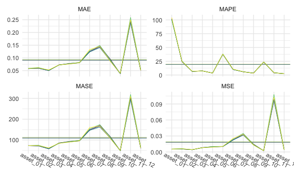

``` r
cv_large_5 %>% 
  gg_loss(
    y_large_test, 
    mean_line = TRUE, 
    line_param = list(size = .3),
    mean_param = list(alpha = .5, size = .3), 
    viridis = TRUE, 
    show.legend = FALSE
  ) +
  theme_minimal() +
  theme(
    axis.text.x = element_text(angle = -30, vjust = -1),
    legend.title = element_text(size = 8),
    legend.text = element_text(size = 7),
    legend.key.size = unit(.3, "cm")
  )
```

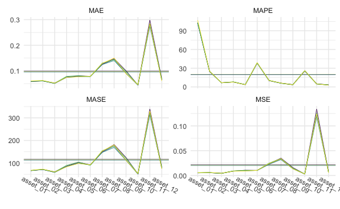

``` r
cv_large_20 %>% 
  gg_loss(
    y_large_test, 
    mean_line = TRUE, 
    line_param = list(size = .3),
    mean_param = list(alpha = .5, size = .3), 
    viridis = TRUE, 
    show.legend = FALSE
  ) +
  theme_minimal() +
  theme(
    axis.text.x = element_text(angle = -30, vjust = -1),
    legend.title = element_text(size = 8),
    legend.text = element_text(size = 7),
    legend.key.size = unit(.3, "cm")
  )
```

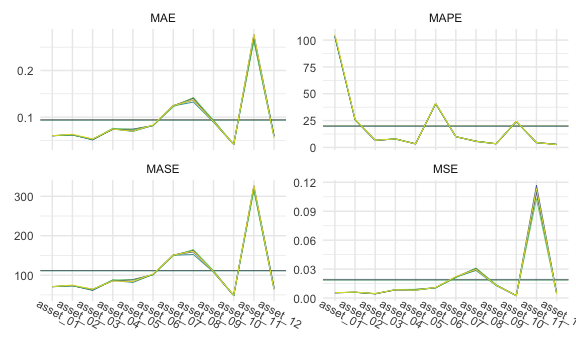

### Tables

1-step:


    \begin{longtable}[t]{lllllll}
    \caption{\label{tab:largeone}LARGE Simulation - 1-step ahead Rolling Window Forecasting Loss}\\
    \toprule
    \multicolumn{1}{c}{ } & \multicolumn{1}{c}{ } & \multicolumn{2}{c}{Frequentist} & \multicolumn{1}{c}{BVAR} & \multicolumn{2}{c}{BVHAR} \\
    \cmidrule(l{3pt}r{3pt}){3-4} \cmidrule(l{3pt}r{3pt}){5-5} \cmidrule(l{3pt}r{3pt}){6-7}
     &  & VAR & VHAR & Minnesota & VAR-type & VHAR-type\\
    \midrule
    \endfirsthead
    \caption[]{LARGE Simulation - 1-step ahead Rolling Window Forecasting Loss \textit{(continued)}}\\
    \toprule
     &  & VAR & VHAR & Minnesota & VAR-type & VHAR-type\\
    \midrule
    \endhead

    \endfoot
    \bottomrule
    \endlastfoot
     & asset01 & \num{0.00541} & \num{0.00543} & \num{0.00528} & \num{0.0053} & \textcolor{red}{\num{0.00525}}\\
    \cmidrule{2-7}\nopagebreak
     & asset02 & \num{0.00617} & \num{0.0059} & \num{0.00551} & \num{0.00546} & \textcolor{red}{\num{0.00544}}\\
    \cmidrule{2-7}\nopagebreak
     & asset03 & \num{0.00422} & \num{0.0044} & \num{0.00416} & \num{0.00416} & \textcolor{red}{\num{0.00412}}\\
    \cmidrule{2-7}\nopagebreak
     & asset04 & \textcolor{red}{\num{0.00778}} & \num{0.00801} & \num{0.00815} & \num{0.00812} & \num{0.00815}\\
    \cmidrule{2-7}\nopagebreak
     & asset05 & \num{0.01016} & \textcolor{red}{\num{0.00896}} & \num{0.00995} & \num{0.00938} & \num{0.00944}\\
    \cmidrule{2-7}\nopagebreak
     & asset06 & \num{0.0104} & \num{0.0103} & \num{0.0101} & \num{0.0101} & \textcolor{red}{\num{0.01}}\\
    \cmidrule{2-7}\nopagebreak
     & asset07 & \num{0.0243} & \num{0.0253} & \num{0.0226} & \num{0.0226} & \textcolor{red}{\num{0.0223}}\\
    \cmidrule{2-7}\nopagebreak
     & asset08 & \num{0.0348} & \num{0.033} & \num{0.0332} & \num{0.0324} & \textcolor{red}{\num{0.0316}}\\
    \cmidrule{2-7}\nopagebreak
     & asset09 & \num{0.0141} & \textcolor{red}{\num{0.013}} & \num{0.0146} & \num{0.0133} & \num{0.0131}\\
    \cmidrule{2-7}\nopagebreak
     & asset10 & \num{0.00246} & \num{0.00242} & \num{0.00229} & \textcolor{red}{\num{0.00227}} & \num{0.00228}\\
    \cmidrule{2-7}\nopagebreak
     & asset11 & \num{0.1077} & \num{0.1025} & \num{0.098} & \num{0.0984} & \textcolor{red}{\num{0.0964}}\\
    \cmidrule{2-7}\nopagebreak
     & asset12 & \num{0.00436} & \textcolor{red}{\num{0.00399}} & \num{0.00411} & \num{0.00406} & \num{0.00405}\\
    \cmidrule{2-7}\nopagebreak
    \multirow{-13}{*}{\raggedright\arraybackslash MSE} & \cellcolor{gray}{Average} & \num{0.0193} & \num{0.0186} & \num{0.0182} & \num{0.018} & \textcolor{red}{\num{0.0177}}\\
    \cmidrule{1-7}\pagebreak[0]
     & asset01 & \num{0.0592} & \num{0.0585} & \num{0.058} & \textcolor{red}{\num{0.0577}} & \num{0.0578}\\
    \cmidrule{2-7}\nopagebreak
     & asset02 & \num{0.0623} & \num{0.0608} & \num{0.0594} & \num{0.0594} & \textcolor{red}{\num{0.0594}}\\
    \cmidrule{2-7}\nopagebreak
     & asset03 & \num{0.0517} & \num{0.053} & \num{0.0506} & \textcolor{red}{\num{0.0505}} & \num{0.0506}\\
    \cmidrule{2-7}\nopagebreak
     & asset04 & \textcolor{red}{\num{0.072}} & \num{0.0725} & \num{0.0724} & \num{0.0724} & \num{0.0728}\\
    \cmidrule{2-7}\nopagebreak
     & asset05 & \num{0.0776} & \textcolor{red}{\num{0.0761}} & \num{0.0781} & \num{0.0771} & \num{0.077}\\
    \cmidrule{2-7}\nopagebreak
     & asset06 & \num{0.082} & \num{0.0811} & \num{0.0815} & \num{0.0808} & \textcolor{red}{\num{0.0806}}\\
    \cmidrule{2-7}\nopagebreak
     & asset07 & \num{0.128} & \num{0.133} & \num{0.125} & \num{0.125} & \textcolor{red}{\num{0.123}}\\
    \cmidrule{2-7}\nopagebreak
     & asset08 & \num{0.149} & \num{0.145} & \num{0.146} & \num{0.143} & \textcolor{red}{\num{0.14}}\\
    \cmidrule{2-7}\nopagebreak
     & asset09 & \num{0.0936} & \textcolor{red}{\num{0.0877}} & \num{0.0963} & \num{0.0896} & \num{0.0895}\\
    \cmidrule{2-7}\nopagebreak
     & asset10 & \num{0.0393} & \num{0.0394} & \num{0.0381} & \textcolor{red}{\num{0.0379}} & \num{0.038}\\
    \cmidrule{2-7}\nopagebreak
     & asset11 & \num{0.259} & \num{0.249} & \num{0.242} & \num{0.244} & \textcolor{red}{\num{0.238}}\\
    \cmidrule{2-7}\nopagebreak
     & asset12 & \num{0.0533} & \num{0.051} & \textcolor{red}{\num{0.0506}} & \num{0.0511} & \num{0.0508}\\
    \cmidrule{2-7}\nopagebreak
    \multirow{-13}{*}{\raggedright\arraybackslash MAE} & \cellcolor{gray}{Average} & \num{0.0939} & \num{0.0922} & \num{0.0915} & \num{0.0907} & \textcolor{red}{\num{0.0899}}\\
    \cmidrule{1-7}\pagebreak[0]
     & asset01 & \textcolor{red}{\num{100.312}} & \num{104.284} & \num{102.061} & \num{101.902} & \num{101.085}\\
    \cmidrule{2-7}\nopagebreak
     & asset02 & \num{25.62} & \num{24.859} & \textcolor{red}{\num{24.493}} & \num{24.503} & \num{24.518}\\
    \cmidrule{2-7}\nopagebreak
     & asset03 & \num{6.695} & \num{6.877} & \num{6.547} & \textcolor{red}{\num{6.533}} & \num{6.542}\\
    \cmidrule{2-7}\nopagebreak
     & asset04 & \textcolor{red}{\num{7.42}} & \num{7.528} & \num{7.516} & \num{7.52} & \num{7.554}\\
    \cmidrule{2-7}\nopagebreak
     & asset05 & \num{3.566} & \textcolor{red}{\num{3.506}} & \num{3.593} & \num{3.549} & \num{3.543}\\
    \cmidrule{2-7}\nopagebreak
     & asset06 & \num{38.36} & \num{38.077} & \num{37.721} & \num{37.774} & \textcolor{red}{\num{37.523}}\\
    \cmidrule{2-7}\nopagebreak
     & asset07 & \num{10.412} & \num{10.729} & \num{10.111} & \num{10.103} & \textcolor{red}{\num{10.019}}\\
    \cmidrule{2-7}\nopagebreak
     & asset08 & \num{6.089} & \num{5.924} & \num{5.965} & \num{5.864} & \textcolor{red}{\num{5.753}}\\
    \cmidrule{2-7}\nopagebreak
     & asset09 & \num{3.5} & \textcolor{red}{\num{3.283}} & \num{3.604} & \num{3.352} & \num{3.345}\\
    \cmidrule{2-7}\nopagebreak
     & asset10 & \num{24.075} & \num{23.898} & \num{23.565} & \textcolor{red}{\num{23.449}} & \num{23.517}\\
    \cmidrule{2-7}\nopagebreak
     & asset11 & \num{4.401} & \num{4.215} & \num{4.114} & \num{4.135} & \textcolor{red}{\num{4.043}}\\
    \cmidrule{2-7}\nopagebreak
     & asset12 & \num{2.535} & \num{2.42} & \textcolor{red}{\num{2.407}} & \num{2.428} & \num{2.416}\\
    \cmidrule{2-7}\nopagebreak
    \multirow{-13}{*}{\raggedright\arraybackslash MAPE} & \cellcolor{gray}{Average} & \num{19.416} & \num{19.633} & \num{19.308} & \num{19.259} & \textcolor{red}{\num{19.155}}\\
    \cmidrule{1-7}\pagebreak[0]
     & asset01 & \num{73.376} & \textcolor{red}{\num{73.118}} & \num{73.599} & \num{73.255} & \num{73.204}\\
    \cmidrule{2-7}\nopagebreak
     & asset02 & \num{74.869} & \num{73.116} & \textcolor{red}{\num{71.682}} & \num{71.87} & \num{71.791}\\
    \cmidrule{2-7}\nopagebreak
     & asset03 & \num{61.15} & \num{62.141} & \num{58.003} & \textcolor{red}{\num{57.696}} & \num{57.753}\\
    \cmidrule{2-7}\nopagebreak
     & asset04 & \textcolor{red}{\num{83.369}} & \num{84.501} & \num{85.663} & \num{84.973} & \num{85.598}\\
    \cmidrule{2-7}\nopagebreak
     & asset05 & \num{92.347} & \textcolor{red}{\num{89.608}} & \num{93.058} & \num{91.355} & \num{91.083}\\
    \cmidrule{2-7}\nopagebreak
     & asset06 & \num{98.035} & \num{95.941} & \num{96.971} & \num{95.602} & \textcolor{red}{\num{95.275}}\\
    \cmidrule{2-7}\nopagebreak
     & asset07 & \num{153.691} & \num{159.838} & \num{148.963} & \num{148.606} & \textcolor{red}{\num{146.414}}\\
    \cmidrule{2-7}\nopagebreak
     & asset08 & \num{174.094} & \num{166.985} & \num{170.287} & \num{166.115} & \textcolor{red}{\num{161.978}}\\
    \cmidrule{2-7}\nopagebreak
     & asset09 & \num{115.716} & \textcolor{red}{\num{108.535}} & \num{117.549} & \num{110.371} & \num{110.109}\\
    \cmidrule{2-7}\nopagebreak
     & asset10 & \num{49.622} & \num{49.452} & \num{48.56} & \textcolor{red}{\num{48.411}} & \num{48.536}\\
    \cmidrule{2-7}\nopagebreak
     & asset11 & \num{318.43} & \num{309.164} & \num{301.534} & \num{302.884} & \textcolor{red}{\num{293.866}}\\
    \cmidrule{2-7}\nopagebreak
     & asset12 & \num{65.057} & \num{61.378} & \textcolor{red}{\num{60.87}} & \num{61.496} & \num{61.234}\\
    \cmidrule{2-7}\nopagebreak
    \multirow{-13}{*}{\raggedright\arraybackslash MASE} & \cellcolor{gray}{Average} & \num{113.313} & \num{111.148} & \num{110.562} & \num{109.386} & \textcolor{red}{\num{108.07}}\\*
    \end{longtable}

5-step:


    \begin{longtable}[t]{lllllll}
    \caption{\label{tab:largefive}LARGE Simulation - 5-step ahead Rolling Window Forecasting Loss}\\
    \toprule
    \multicolumn{1}{c}{ } & \multicolumn{1}{c}{ } & \multicolumn{2}{c}{Frequentist} & \multicolumn{1}{c}{BVAR} & \multicolumn{2}{c}{BVHAR} \\
    \cmidrule(l{3pt}r{3pt}){3-4} \cmidrule(l{3pt}r{3pt}){5-5} \cmidrule(l{3pt}r{3pt}){6-7}
     &  & VAR & VHAR & Minnesota & VAR-type & VHAR-type\\
    \midrule
    \endfirsthead
    \caption[]{LARGE Simulation - 5-step ahead Rolling Window Forecasting Loss \textit{(continued)}}\\
    \toprule
     &  & VAR & VHAR & Minnesota & VAR-type & VHAR-type\\
    \midrule
    \endhead

    \endfoot
    \bottomrule
    \endlastfoot
     & asset01 & \num{0.00547} & \num{0.00567} & \num{0.00527} & \textcolor{red}{\num{0.00527}} & \num{0.00529}\\
    \cmidrule{2-7}\nopagebreak
     & asset02 & \num{0.00585} & \num{0.00599} & \num{0.00575} & \textcolor{red}{\num{0.00566}} & \num{0.0057}\\
    \cmidrule{2-7}\nopagebreak
     & asset03 & \num{0.00433} & \num{0.00453} & \num{0.00437} & \num{0.00424} & \textcolor{red}{\num{0.00418}}\\
    \cmidrule{2-7}\nopagebreak
     & asset04 & \num{0.00922} & \textcolor{red}{\num{0.00864}} & \num{0.00885} & \num{0.00885} & \num{0.00885}\\
    \cmidrule{2-7}\nopagebreak
     & asset05 & \num{0.01029} & \textcolor{red}{\num{0.0091}} & \num{0.01059} & \num{0.00958} & \num{0.00968}\\
    \cmidrule{2-7}\nopagebreak
     & asset06 & \textcolor{red}{\num{0.0101}} & \num{0.0103} & \num{0.0103} & \num{0.0102} & \num{0.0102}\\
    \cmidrule{2-7}\nopagebreak
     & asset07 & \num{0.0249} & \num{0.0241} & \num{0.0239} & \num{0.023} & \textcolor{red}{\num{0.0228}}\\
    \cmidrule{2-7}\nopagebreak
     & asset08 & \num{0.0339} & \num{0.0337} & \num{0.0349} & \num{0.0332} & \textcolor{red}{\num{0.032}}\\
    \cmidrule{2-7}\nopagebreak
     & asset09 & \num{0.0146} & \textcolor{red}{\num{0.0134}} & \num{0.0159} & \num{0.0138} & \num{0.0135}\\
    \cmidrule{2-7}\nopagebreak
     & asset10 & \num{0.00309} & \num{0.00311} & \num{0.00291} & \textcolor{red}{\num{0.00284}} & \num{0.00293}\\
    \cmidrule{2-7}\nopagebreak
     & asset11 & \num{0.125} & \num{0.124} & \num{0.134} & \num{0.123} & \textcolor{red}{\num{0.119}}\\
    \cmidrule{2-7}\nopagebreak
     & asset12 & \num{0.00662} & \textcolor{red}{\num{0.00551}} & \num{0.00735} & \num{0.00634} & \num{0.00631}\\
    \cmidrule{2-7}\nopagebreak
    \multirow{-13}{*}{\raggedright\arraybackslash MSE} & \cellcolor{gray}{Average} & \num{0.0212} & \num{0.0207} & \num{0.022} & \num{0.0205} & \textcolor{red}{\num{0.02}}\\
    \cmidrule{1-7}\pagebreak[0]
     & asset01 & \num{0.0599} & \num{0.0603} & \num{0.0588} & \textcolor{red}{\num{0.0585}} & \num{0.0586}\\
    \cmidrule{2-7}\nopagebreak
     & asset02 & \num{0.0613} & \num{0.0623} & \num{0.0609} & \textcolor{red}{\num{0.0605}} & \num{0.0607}\\
    \cmidrule{2-7}\nopagebreak
     & asset03 & \num{0.0515} & \num{0.052} & \num{0.0522} & \textcolor{red}{\num{0.0508}} & \num{0.051}\\
    \cmidrule{2-7}\nopagebreak
     & asset04 & \num{0.0786} & \textcolor{red}{\num{0.0744}} & \num{0.0754} & \num{0.0748} & \num{0.0746}\\
    \cmidrule{2-7}\nopagebreak
     & asset05 & \num{0.081} & \textcolor{red}{\num{0.0769}} & \num{0.0806} & \num{0.0785} & \num{0.0773}\\
    \cmidrule{2-7}\nopagebreak
     & asset06 & \textcolor{red}{\num{0.0774}} & \num{0.079} & \num{0.0786} & \num{0.0783} & \num{0.0783}\\
    \cmidrule{2-7}\nopagebreak
     & asset07 & \num{0.13} & \num{0.129} & \num{0.127} & \num{0.126} & \textcolor{red}{\num{0.124}}\\
    \cmidrule{2-7}\nopagebreak
     & asset08 & \num{0.144} & \num{0.15} & \num{0.148} & \num{0.145} & \textcolor{red}{\num{0.14}}\\
    \cmidrule{2-7}\nopagebreak
     & asset09 & \num{0.0967} & \textcolor{red}{\num{0.0889}} & \num{0.1001} & \num{0.0903} & \num{0.0899}\\
    \cmidrule{2-7}\nopagebreak
     & asset10 & \num{0.0452} & \num{0.0462} & \num{0.0446} & \textcolor{red}{\num{0.0442}} & \num{0.0446}\\
    \cmidrule{2-7}\nopagebreak
     & asset11 & \num{0.283} & \num{0.284} & \num{0.298} & \num{0.283} & \textcolor{red}{\num{0.275}}\\
    \cmidrule{2-7}\nopagebreak
     & asset12 & \num{0.0667} & \textcolor{red}{\num{0.0606}} & \num{0.0699} & \num{0.0647} & \num{0.0645}\\
    \cmidrule{2-7}\nopagebreak
    \multirow{-13}{*}{\raggedright\arraybackslash MAE} & \cellcolor{gray}{Average} & \num{0.098} & \num{0.097} & \num{0.0995} & \num{0.0962} & \textcolor{red}{\num{0.0949}}\\
    \cmidrule{1-7}\pagebreak[0]
     & asset01 & \num{103.259} & \num{106.828} & \num{102.695} & \num{102.289} & \textcolor{red}{\num{102.066}}\\
    \cmidrule{2-7}\nopagebreak
     & asset02 & \num{25.008} & \num{25.158} & \num{24.942} & \textcolor{red}{\num{24.721}} & \num{24.829}\\
    \cmidrule{2-7}\nopagebreak
     & asset03 & \num{6.616} & \num{6.683} & \num{6.704} & \textcolor{red}{\num{6.521}} & \num{6.534}\\
    \cmidrule{2-7}\nopagebreak
     & asset04 & \num{8.205} & \num{7.811} & \num{7.873} & \num{7.822} & \textcolor{red}{\num{7.792}}\\
    \cmidrule{2-7}\nopagebreak
     & asset05 & \num{3.72} & \textcolor{red}{\num{3.537}} & \num{3.699} & \num{3.6} & \num{3.547}\\
    \cmidrule{2-7}\nopagebreak
     & asset06 & \num{38.539} & \num{38.786} & \num{38.433} & \num{38.205} & \textcolor{red}{\num{38.031}}\\
    \cmidrule{2-7}\nopagebreak
     & asset07 & \num{10.516} & \num{10.282} & \num{10.207} & \num{10.076} & \textcolor{red}{\num{10.017}}\\
    \cmidrule{2-7}\nopagebreak
     & asset08 & \num{5.955} & \num{6.205} & \num{6.116} & \num{6.004} & \textcolor{red}{\num{5.806}}\\
    \cmidrule{2-7}\nopagebreak
     & asset09 & \num{3.621} & \textcolor{red}{\num{3.341}} & \num{3.746} & \num{3.384} & \num{3.362}\\
    \cmidrule{2-7}\nopagebreak
     & asset10 & \num{26.164} & \num{26.167} & \num{25.845} & \textcolor{red}{\num{25.516}} & \num{25.877}\\
    \cmidrule{2-7}\nopagebreak
     & asset11 & \num{4.751} & \num{4.732} & \num{4.987} & \num{4.731} & \textcolor{red}{\num{4.598}}\\
    \cmidrule{2-7}\nopagebreak
     & asset12 & \num{3.156} & \textcolor{red}{\num{2.86}} & \num{3.308} & \num{3.058} & \num{3.048}\\
    \cmidrule{2-7}\nopagebreak
    \multirow{-13}{*}{\raggedright\arraybackslash MAPE} & \cellcolor{gray}{Average} & \num{19.959} & \num{20.199} & \num{19.88} & \num{19.661} & \textcolor{red}{\num{19.626}}\\
    \cmidrule{1-7}\pagebreak[0]
     & asset01 & \num{67.315} & \num{67.595} & \num{66.579} & \num{66.306} & \textcolor{red}{\num{66.195}}\\
    \cmidrule{2-7}\nopagebreak
     & asset02 & \num{71.999} & \num{72.976} & \num{71.665} & \textcolor{red}{\num{71.259}} & \num{71.521}\\
    \cmidrule{2-7}\nopagebreak
     & asset03 & \num{60.315} & \num{60.267} & \num{61.077} & \num{58.946} & \textcolor{red}{\num{58.506}}\\
    \cmidrule{2-7}\nopagebreak
     & asset04 & \num{89.886} & \textcolor{red}{\num{83.066}} & \num{86.144} & \num{84.853} & \num{84.611}\\
    \cmidrule{2-7}\nopagebreak
     & asset05 & \num{103.95} & \textcolor{red}{\num{98.428}} & \num{103.547} & \num{100.525} & \num{98.438}\\
    \cmidrule{2-7}\nopagebreak
     & asset06 & \textcolor{red}{\num{89.92}} & \num{92.318} & \num{91.854} & \num{91.566} & \num{91.514}\\
    \cmidrule{2-7}\nopagebreak
     & asset07 & \num{154.446} & \num{153.08} & \num{150.565} & \num{148.322} & \textcolor{red}{\num{147.302}}\\
    \cmidrule{2-7}\nopagebreak
     & asset08 & \num{175.444} & \num{180.314} & \num{181.588} & \num{175.974} & \textcolor{red}{\num{169.231}}\\
    \cmidrule{2-7}\nopagebreak
     & asset09 & \num{120.911} & \textcolor{red}{\num{112.275}} & \num{124.185} & \num{113.281} & \num{112.277}\\
    \cmidrule{2-7}\nopagebreak
     & asset10 & \num{52.755} & \num{53.09} & \num{51.748} & \textcolor{red}{\num{51.143}} & \num{51.901}\\
    \cmidrule{2-7}\nopagebreak
     & asset11 & \num{325.1} & \num{329.837} & \num{338.457} & \num{321.499} & \textcolor{red}{\num{314.897}}\\
    \cmidrule{2-7}\nopagebreak
     & asset12 & \num{81.115} & \textcolor{red}{\num{73.989}} & \num{83.25} & \num{77.723} & \num{77.5}\\
    \cmidrule{2-7}\nopagebreak
    \multirow{-13}{*}{\raggedright\arraybackslash MASE} & \cellcolor{gray}{Average} & \num{116.096} & \num{114.77} & \num{117.555} & \num{113.45} & \textcolor{red}{\num{111.991}}\\*
    \end{longtable}

20-step:


    \begin{longtable}[t]{lllllll}
    \caption{\label{tab:largetwenty}LARGE Simulation - 20-step ahead Rolling Window Forecasting Loss}\\
    \toprule
    \multicolumn{1}{c}{ } & \multicolumn{1}{c}{ } & \multicolumn{2}{c}{Frequentist} & \multicolumn{1}{c}{BVAR} & \multicolumn{2}{c}{BVHAR} \\
    \cmidrule(l{3pt}r{3pt}){3-4} \cmidrule(l{3pt}r{3pt}){5-5} \cmidrule(l{3pt}r{3pt}){6-7}
     &  & VAR & VHAR & Minnesota & VAR-type & VHAR-type\\
    \midrule
    \endfirsthead
    \caption[]{LARGE Simulation - 20-step ahead Rolling Window Forecasting Loss \textit{(continued)}}\\
    \toprule
     &  & VAR & VHAR & Minnesota & VAR-type & VHAR-type\\
    \midrule
    \endhead

    \endfoot
    \bottomrule
    \endlastfoot
     & asset01 & \num{0.0055} & \num{0.00551} & \num{0.0055} & \textcolor{red}{\num{0.00541}} & \num{0.00545}\\
    \cmidrule{2-7}\nopagebreak
     & asset02 & \textcolor{red}{\num{0.00591}} & \num{0.00621} & \num{0.00592} & \num{0.00601} & \num{0.00599}\\
    \cmidrule{2-7}\nopagebreak
     & asset03 & \num{0.00448} & \num{0.00462} & \num{0.00454} & \textcolor{red}{\num{0.00427}} & \num{0.00434}\\
    \cmidrule{2-7}\nopagebreak
     & asset04 & \num{0.00873} & \num{0.00852} & \textcolor{red}{\num{0.00835}} & \num{0.00861} & \num{0.00856}\\
    \cmidrule{2-7}\nopagebreak
     & asset05 & \num{0.00898} & \num{0.00812} & \num{0.0088} & \num{0.00825} & \textcolor{red}{\num{0.00804}}\\
    \cmidrule{2-7}\nopagebreak
     & asset06 & \textcolor{red}{\num{0.0106}} & \num{0.011} & \num{0.0107} & \num{0.0108} & \num{0.0108}\\
    \cmidrule{2-7}\nopagebreak
     & asset07 & \textcolor{red}{\num{0.0211}} & \num{0.0223} & \num{0.0217} & \num{0.0218} & \num{0.0216}\\
    \cmidrule{2-7}\nopagebreak
     & asset08 & \num{0.0311} & \num{0.0296} & \num{0.0306} & \num{0.0295} & \textcolor{red}{\num{0.0286}}\\
    \cmidrule{2-7}\nopagebreak
     & asset09 & \num{0.0139} & \num{0.0132} & \num{0.0132} & \num{0.0135} & \textcolor{red}{\num{0.0129}}\\
    \cmidrule{2-7}\nopagebreak
     & asset10 & \textcolor{red}{\num{0.00243}} & \num{0.00252} & \num{0.00247} & \num{0.00249} & \num{0.00248}\\
    \cmidrule{2-7}\nopagebreak
     & asset11 & \textcolor{red}{\num{0.103}} & \num{0.113} & \num{0.11} & \num{0.117} & \num{0.112}\\
    \cmidrule{2-7}\nopagebreak
     & asset12 & \textcolor{red}{\num{0.00448}} & \num{0.0045} & \num{0.00501} & \num{0.00525} & \num{0.00515}\\
    \cmidrule{2-7}\nopagebreak
    \multirow{-13}{*}{\raggedright\arraybackslash MSE} & \cellcolor{gray}{Average} & \textcolor{red}{\num{0.0183}} & \num{0.0191} & \num{0.0189} & \num{0.0194} & \num{0.0188}\\
    \cmidrule{1-7}\pagebreak[0]
     & asset01 & \num{0.0604} & \num{0.0603} & \num{0.0604} & \textcolor{red}{\num{0.0599}} & \num{0.0601}\\
    \cmidrule{2-7}\nopagebreak
     & asset02 & \textcolor{red}{\num{0.0618}} & \num{0.0635} & \num{0.0618} & \num{0.0625} & \num{0.0624}\\
    \cmidrule{2-7}\nopagebreak
     & asset03 & \num{0.0525} & \num{0.0533} & \num{0.0529} & \textcolor{red}{\num{0.0512}} & \num{0.0517}\\
    \cmidrule{2-7}\nopagebreak
     & asset04 & \num{0.076} & \num{0.0743} & \textcolor{red}{\num{0.0735}} & \num{0.0748} & \num{0.0746}\\
    \cmidrule{2-7}\nopagebreak
     & asset05 & \num{0.0737} & \num{0.0699} & \num{0.0741} & \num{0.0705} & \textcolor{red}{\num{0.0694}}\\
    \cmidrule{2-7}\nopagebreak
     & asset06 & \textcolor{red}{\num{0.0819}} & \num{0.0832} & \num{0.082} & \num{0.0824} & \num{0.0823}\\
    \cmidrule{2-7}\nopagebreak
     & asset07 & \textcolor{red}{\num{0.122}} & \num{0.125} & \num{0.124} & \num{0.125} & \num{0.124}\\
    \cmidrule{2-7}\nopagebreak
     & asset08 & \num{0.142} & \num{0.137} & \num{0.141} & \num{0.137} & \textcolor{red}{\num{0.132}}\\
    \cmidrule{2-7}\nopagebreak
     & asset09 & \num{0.0935} & \num{0.0904} & \num{0.0899} & \num{0.092} & \textcolor{red}{\num{0.0896}}\\
    \cmidrule{2-7}\nopagebreak
     & asset10 & \textcolor{red}{\num{0.0412}} & \num{0.0416} & \num{0.0415} & \num{0.0416} & \num{0.0415}\\
    \cmidrule{2-7}\nopagebreak
     & asset11 & \textcolor{red}{\num{0.264}} & \num{0.277} & \num{0.267} & \num{0.277} & \num{0.271}\\
    \cmidrule{2-7}\nopagebreak
     & asset12 & \num{0.0564} & \textcolor{red}{\num{0.0562}} & \num{0.0593} & \num{0.0608} & \num{0.0602}\\
    \cmidrule{2-7}\nopagebreak
    \multirow{-13}{*}{\raggedright\arraybackslash MAE} & \cellcolor{gray}{Average} & \num{0.0938} & \num{0.0943} & \num{0.0939} & \num{0.0945} & \textcolor{red}{\num{0.0933}}\\
    \cmidrule{1-7}\pagebreak[0]
     & asset01 & \num{103.969} & \num{105.31} & \num{103.987} & \textcolor{red}{\num{103.073}} & \num{103.224}\\
    \cmidrule{2-7}\nopagebreak
     & asset02 & \num{25.772} & \num{26.43} & \textcolor{red}{\num{25.752}} & \num{26.049} & \num{26.027}\\
    \cmidrule{2-7}\nopagebreak
     & asset03 & \num{6.651} & \num{6.736} & \num{6.692} & \textcolor{red}{\num{6.477}} & \num{6.542}\\
    \cmidrule{2-7}\nopagebreak
     & asset04 & \num{8.097} & \num{7.923} & \textcolor{red}{\num{7.833}} & \num{7.971} & \num{7.948}\\
    \cmidrule{2-7}\nopagebreak
     & asset05 & \num{3.405} & \num{3.238} & \num{3.422} & \num{3.261} & \textcolor{red}{\num{3.207}}\\
    \cmidrule{2-7}\nopagebreak
     & asset06 & \textcolor{red}{\num{40.668}} & \num{41.258} & \num{40.725} & \num{40.982} & \num{40.974}\\
    \cmidrule{2-7}\nopagebreak
     & asset07 & \textcolor{red}{\num{9.861}} & \num{10.076} & \num{10.003} & \num{10.057} & \num{10.021}\\
    \cmidrule{2-7}\nopagebreak
     & asset08 & \num{5.905} & \num{5.696} & \num{5.852} & \num{5.686} & \textcolor{red}{\num{5.512}}\\
    \cmidrule{2-7}\nopagebreak
     & asset09 & \num{3.507} & \num{3.387} & \num{3.369} & \num{3.45} & \textcolor{red}{\num{3.356}}\\
    \cmidrule{2-7}\nopagebreak
     & asset10 & \textcolor{red}{\num{24.036}} & \num{24.475} & \num{24.185} & \num{24.227} & \num{24.168}\\
    \cmidrule{2-7}\nopagebreak
     & asset11 & \textcolor{red}{\num{4.382}} & \num{4.612} & \num{4.429} & \num{4.603} & \num{4.502}\\
    \cmidrule{2-7}\nopagebreak
     & asset12 & \num{2.663} & \textcolor{red}{\num{2.653}} & \num{2.795} & \num{2.869} & \num{2.838}\\
    \cmidrule{2-7}\nopagebreak
    \multirow{-13}{*}{\raggedright\arraybackslash MAPE} & \cellcolor{gray}{Average} & \num{19.91} & \num{20.15} & \num{19.92} & \num{19.892} & \textcolor{red}{\num{19.86}}\\
    \cmidrule{1-7}\pagebreak[0]
     & asset01 & \num{71.092} & \num{71.193} & \num{71.151} & \textcolor{red}{\num{70.552}} & \num{70.757}\\
    \cmidrule{2-7}\nopagebreak
     & asset02 & \textcolor{red}{\num{72.91}} & \num{74.903} & \num{73.078} & \num{73.768} & \num{73.733}\\
    \cmidrule{2-7}\nopagebreak
     & asset03 & \num{63.657} & \num{64.506} & \num{64.219} & \textcolor{red}{\num{61.582}} & \num{62.13}\\
    \cmidrule{2-7}\nopagebreak
     & asset04 & \num{88.028} & \textcolor{red}{\num{85.241}} & \num{85.457} & \num{87.289} & \num{86.59}\\
    \cmidrule{2-7}\nopagebreak
     & asset05 & \num{88.031} & \num{83.839} & \num{88.554} & \num{83.464} & \textcolor{red}{\num{81.634}}\\
    \cmidrule{2-7}\nopagebreak
     & asset06 & \textcolor{red}{\num{101.282}} & \num{103.136} & \num{101.338} & \num{102.115} & \num{101.922}\\
    \cmidrule{2-7}\nopagebreak
     & asset07 & \textcolor{red}{\num{149.055}} & \num{150.989} & \num{150.739} & \num{150.922} & \num{150.592}\\
    \cmidrule{2-7}\nopagebreak
     & asset08 & \num{164.793} & \num{160.791} & \num{162.505} & \num{159.026} & \textcolor{red}{\num{152.356}}\\
    \cmidrule{2-7}\nopagebreak
     & asset09 & \num{111.246} & \num{108.414} & \num{107.982} & \num{109.605} & \textcolor{red}{\num{107.824}}\\
    \cmidrule{2-7}\nopagebreak
     & asset10 & \textcolor{red}{\num{48.062}} & \num{49.096} & \num{48.507} & \num{48.733} & \num{48.431}\\
    \cmidrule{2-7}\nopagebreak
     & asset11 & \textcolor{red}{\num{314.776}} & \num{327.442} & \num{319.846} & \num{326.963} & \num{321.508}\\
    \cmidrule{2-7}\nopagebreak
     & asset12 & \textcolor{red}{\num{63.549}} & \num{64.155} & \num{64.923} & \num{69.314} & \num{68.151}\\
    \cmidrule{2-7}\nopagebreak
    \multirow{-13}{*}{\raggedright\arraybackslash MASE} & \cellcolor{gray}{Average} & \num{111.374} & \num{111.976} & \num{111.525} & \num{111.944} & \textcolor{red}{\num{110.469}}\\*
    \end{longtable}

## Average

### SMALL

1-step:

    \begin{table}

    \caption{\label{tab:smallonemean}SMALL Simulation - 1-step ahead Rolling Window Forecasting Average Loss}
    \centering
    \begin{tabular}[t]{llllll}
    \toprule
      & VAR & VHAR & BVAR-Minnesota & BVHAR-MN-VAR & BVHAR-MN-VHAR\\
    \midrule
    MSE & \textcolor{red}{\num{0.0628}} & \num{0.0637} & \num{0.063} & \num{0.0634} & \num{0.0635}\\
    MAE & \num{0.151} & \num{0.149} & \num{0.15} & \textcolor{red}{\num{0.149}} & \num{0.149}\\
    MAPE & \num{0.0343} & \num{0.0339} & \num{0.0341} & \textcolor{red}{\num{0.0339}} & \num{0.0339}\\
    MASE & \num{161.046} & \num{158.428} & \num{159.473} & \textcolor{red}{\num{158.353}} & \num{158.443}\\
    \bottomrule
    \end{tabular}
    \end{table}

5-step:

    \begin{table}

    \caption{\label{tab:smallfivemean}SMALL Simulation - 5-step ahead Rolling Window Forecasting Average Loss}
    \centering
    \begin{tabular}[t]{llllll}
    \toprule
      & VAR & VHAR & BVAR-Minnesota & BVHAR-MN-VAR & BVHAR-MN-VHAR\\
    \midrule
    MSE & \textcolor{red}{\num{0.089}} & \num{0.0931} & \num{0.0895} & \num{0.0923} & \num{0.0925}\\
    MAE & \textcolor{red}{\num{0.17}} & \num{0.173} & \num{0.171} & \num{0.173} & \num{0.173}\\
    MAPE & \textcolor{red}{\num{0.039}} & \num{0.0399} & \num{0.0392} & \num{0.0398} & \num{0.0398}\\
    MASE & \textcolor{red}{\num{187.96}} & \num{193.024} & \num{188.463} & \num{192.242} & \num{192.25}\\
    \bottomrule
    \end{tabular}
    \end{table}

20-step:

    \begin{table}

    \caption{\label{tab:smalltwentyemean}SMALL Simulation - 20-step ahead Rolling Window Forecasting Average Loss}
    \centering
    \begin{tabular}[t]{llllll}
    \toprule
      & VAR & VHAR & BVAR-Minnesota & BVHAR-MN-VAR & BVHAR-MN-VHAR\\
    \midrule
    MSE & \num{0.0857} & \num{0.0858} & \textcolor{red}{\num{0.0856}} & \num{0.0858} & \num{0.0862}\\
    MAE & \textcolor{red}{\num{0.167}} & \num{0.167} & \num{0.167} & \num{0.167} & \num{0.168}\\
    MAPE & \textcolor{red}{\num{0.0384}} & \num{0.0385} & \num{0.0384} & \num{0.0384} & \num{0.0386}\\
    MASE & \textcolor{red}{\num{184.272}} & \num{184.762} & \num{184.503} & \num{184.542} & \num{185.285}\\
    \bottomrule
    \end{tabular}
    \end{table}

### MEDIUM

1-step:

    \begin{table}

    \caption{\label{tab:medonemean}MEDIUM Simulation - 1-step ahead Rolling Window Forecasting Average Loss}
    \centering
    \begin{tabular}[t]{llllll}
    \toprule
      & VAR & VHAR & BVAR-Minnesota & BVHAR-MN-VAR & BVHAR-MN-VHAR\\
    \midrule
    MSE & \num{0.0288} & \num{0.0282} & \num{0.0277} & \num{0.0272} & \textcolor{red}{\num{0.0272}}\\
    MAE & \num{0.0974} & \num{0.097} & \num{0.0955} & \textcolor{red}{\num{0.0946}} & \num{0.0947}\\
    MAPE & \num{92.008} & \num{93.763} & \num{86.318} & \num{84.922} & \textcolor{red}{\num{83.968}}\\
    MASE & \num{368.999} & \num{367.994} & \num{362.148} & \textcolor{red}{\num{358.462}} & \num{358.587}\\
    \bottomrule
    \end{tabular}
    \end{table}

5-step:

    \begin{table}

    \caption{\label{tab:medfivemean}MEDIUM Simulation - 5-step ahead Rolling Window Forecasting Average Loss}
    \centering
    \begin{tabular}[t]{llllll}
    \toprule
      & VAR & VHAR & BVAR-Minnesota & BVHAR-MN-VAR & BVHAR-MN-VHAR\\
    \midrule
    MSE & \textcolor{red}{\num{0.0296}} & \num{0.0306} & \num{0.0302} & \num{0.0297} & \num{0.0297}\\
    MAE & \textcolor{red}{\num{0.0979}} & \num{0.1014} & \num{0.0994} & \num{0.0993} & \num{0.0993}\\
    MAPE & \num{60.776} & \num{63.959} & \num{59.298} & \num{58.584} & \textcolor{red}{\num{58.461}}\\
    MASE & \textcolor{red}{\num{392.201}} & \num{404.474} & \num{397.617} & \num{396.94} & \num{396.81}\\
    \bottomrule
    \end{tabular}
    \end{table}

20-step:

    \begin{table}

    \caption{\label{tab:medtwentyemean}MEDIUM Simulation - 20-step ahead Rolling Window Forecasting Average Loss}
    \centering
    \begin{tabular}[t]{llllll}
    \toprule
      & VAR & VHAR & BVAR-Minnesota & BVHAR-MN-VAR & BVHAR-MN-VHAR\\
    \midrule
    MSE & \num{0.0307} & \num{0.0297} & \num{0.0315} & \textcolor{red}{\num{0.0297}} & \num{0.0298}\\
    MAE & \num{0.0999} & \textcolor{red}{\num{0.0977}} & \num{0.1017} & \num{0.0985} & \num{0.0986}\\
    MAPE & \num{62.111} & \textcolor{red}{\num{62.096}} & \num{62.143} & \num{62.385} & \num{62.142}\\
    MASE & \num{424.178} & \textcolor{red}{\num{420.375}} & \num{433.572} & \num{421.484} & \num{422.34}\\
    \bottomrule
    \end{tabular}
    \end{table}

### LARGE

1-step:

    \begin{table}

    \caption{\label{tab:largeonemean}LARGE Simulation - 1-step ahead Rolling Window Forecasting Average Loss}
    \centering
    \begin{tabular}[t]{llllll}
    \toprule
      & VAR & VHAR & BVAR-Minnesota & BVHAR-MN-VAR & BVHAR-MN-VHAR\\
    \midrule
    MSE & \num{0.0193} & \num{0.0186} & \num{0.0182} & \num{0.018} & \textcolor{red}{\num{0.0177}}\\
    MAE & \num{0.0939} & \num{0.0922} & \num{0.0915} & \num{0.0907} & \textcolor{red}{\num{0.0899}}\\
    MAPE & \num{19.416} & \num{19.633} & \num{19.308} & \num{19.259} & \textcolor{red}{\num{19.155}}\\
    MASE & \num{113.313} & \num{111.148} & \num{110.562} & \num{109.386} & \textcolor{red}{\num{108.07}}\\
    \bottomrule
    \end{tabular}
    \end{table}

5-step:

    \begin{table}

    \caption{\label{tab:largefivemean}LARGE Simulation - 5-step ahead Rolling Window Forecasting Average Loss}
    \centering
    \begin{tabular}[t]{llllll}
    \toprule
      & VAR & VHAR & BVAR-Minnesota & BVHAR-MN-VAR & BVHAR-MN-VHAR\\
    \midrule
    MSE & \num{0.0212} & \num{0.0207} & \num{0.022} & \num{0.0205} & \textcolor{red}{\num{0.02}}\\
    MAE & \num{0.098} & \num{0.097} & \num{0.0995} & \num{0.0962} & \textcolor{red}{\num{0.0949}}\\
    MAPE & \num{19.959} & \num{20.199} & \num{19.88} & \num{19.661} & \textcolor{red}{\num{19.626}}\\
    MASE & \num{116.096} & \num{114.77} & \num{117.555} & \num{113.45} & \textcolor{red}{\num{111.991}}\\
    \bottomrule
    \end{tabular}
    \end{table}

20-step:

    \begin{table}

    \caption{\label{tab:largetwentyemean}LARGE Simulation - 20-step ahead Rolling Window Forecasting Average Loss}
    \centering
    \begin{tabular}[t]{llllll}
    \toprule
      & VAR & VHAR & BVAR-Minnesota & BVHAR-MN-VAR & BVHAR-MN-VHAR\\
    \midrule
    MSE & \textcolor{red}{\num{0.0183}} & \num{0.0191} & \num{0.0189} & \num{0.0194} & \num{0.0188}\\
    MAE & \num{0.0938} & \num{0.0943} & \num{0.0939} & \num{0.0945} & \textcolor{red}{\num{0.0933}}\\
    MAPE & \num{19.91} & \num{20.15} & \num{19.92} & \num{19.892} & \textcolor{red}{\num{19.86}}\\
    MASE & \num{111.374} & \num{111.976} & \num{111.525} & \num{111.944} & \textcolor{red}{\num{110.469}}\\
    \bottomrule
    \end{tabular}
    \end{table}

### RMSFE or RMAFE

Set VAR as the benchmark model.

``` r
# SMALL-------------------------------
cv_small_list <- 
  lapply(
    c(1, 5, 20),
    function(h) {
      mod_small_list %>% 
        lapply(
          function(mod) {
            forecast_roll(mod, h, y_small_test)
          }
        )
    }
  )
# MEDIUM------------------------------
cv_medium_list <- 
  lapply(
    c(1, 5, 20),
    function(h) {
      mod_small_list %>% 
        lapply(
          function(mod) {
            forecast_roll(mod, h, y_medium_test)
          }
        )
    }
  )
# LARGE-------------------------------
cv_large_list <- 
  lapply(
    c(1, 5, 20),
    function(h) {
      mod_small_list %>% 
        lapply(
          function(mod) {
            forecast_roll(mod, h, y_large_test)
          }
        )
    }
  )
```

    \begin{table}[H]

    \caption{\label{tab:dgp2result}Out-of-sample forecasting performance measures for DGP2.}
    \centering
    \resizebox{\linewidth}{!}{
    \begin{tabular}[t]{cc|ccc|ccc|ccc|}
    \toprule
    \multicolumn{2}{c}{ } & \multicolumn{3}{c}{RMAFE} & \multicolumn{3}{c}{RMSFE} & \multicolumn{3}{c}{RMASE} \\
    \cmidrule(l{3pt}r{3pt}){3-5} \cmidrule(l{3pt}r{3pt}){6-8} \cmidrule(l{3pt}r{3pt}){9-11}
    \rotatebox{0}{} & \rotatebox{0}{} & \rotatebox{0}{$h = 1$} & \rotatebox{0}{$h = 5$} & \rotatebox{0}{$h = 20$} & \rotatebox{0}{$h = 1$} & \rotatebox{0}{$h = 5$} & \rotatebox{0}{$h = 20$} & \rotatebox{0}{$h = 1$} & \rotatebox{0}{$h = 5$} & \rotatebox{0}{$h = 20$}\\
    \midrule
     & VHAR & \textcolor{black}{\num{0.988}} & \textcolor{black}{\num{1.020}} & \textcolor{black}{\num{1.002}} & \textcolor{black}{\num{1.014}} & \textcolor{black}{\num{1.046}} & \textcolor{black}{\num{1.002}} & \textcolor{black}{\num{0.984}} & \textcolor{black}{\num{1.027}} & \textcolor{black}{\num{1.003}}\\

     & BVAR & \textcolor{black}{\num{0.994}} & \textcolor{red}{\num{1.003}} & \textcolor{black}{\num{1.001}} & \textcolor{red}{\num{1.003}} & \textcolor{red}{\num{1.005}} & \textcolor{red}{\num{0.999}} & \textcolor{black}{\num{0.990}} & \textcolor{red}{\num{1.003}} & \textcolor{red}{\num{1.001}}\\

     & BVHAR-S & \textcolor{red}{\num{0.987}} & \textcolor{black}{\num{1.017}} & \textcolor{red}{\num{1.001}} & \textcolor{black}{\num{1.010}} & \textcolor{black}{\num{1.037}} & \textcolor{black}{\num{1.001}} & \textcolor{red}{\num{0.983}} & \textcolor{black}{\num{1.023}} & \textcolor{black}{\num{1.001}}\\

    \multirow{-4}{*}{\centering\arraybackslash SMALL} & BVHAR-L & \textcolor{black}{\num{0.988}} & \textcolor{black}{\num{1.019}} & \textcolor{black}{\num{1.006}} & \textcolor{black}{\num{1.011}} & \textcolor{black}{\num{1.038}} & \textcolor{black}{\num{1.006}} & \textcolor{black}{\num{0.984}} & \textcolor{black}{\num{1.023}} & \textcolor{black}{\num{1.005}}\\
    \cmidrule{1-11}
     & VHAR & \textcolor{black}{\num{0.380}} & \textcolor{black}{\num{0.000602}} & \textcolor{black}{\num{8.92e-15}} & \textcolor{black}{\num{0.278}} & \textcolor{black}{\num{1.91e-07}} & \textcolor{black}{\num{7.28e-29}} & \textcolor{black}{\num{0.496}} & \textcolor{black}{\num{0.000309}} & \textcolor{black}{\num{8.51e-15}}\\

     & BVAR & \textcolor{black}{\num{0.608}} & \textcolor{black}{\num{0.180098}} & \textcolor{black}{\num{1.08e-03}} & \textcolor{black}{\num{0.424}} & \textcolor{black}{\num{3.25e-02}} & \textcolor{black}{\num{1.17e-06}} & \textcolor{black}{\num{0.607}} & \textcolor{black}{\num{0.180089}} & \textcolor{black}{\num{1.08e-03}}\\

     & BVHAR-S & \textcolor{black}{\num{0.343}} & \textcolor{black}{\num{0.000565}} & \textcolor{black}{\num{2.65e-14}} & \textcolor{black}{\num{0.203}} & \textcolor{black}{\num{1.67e-07}} & \textcolor{black}{\num{7.13e-28}} & \textcolor{black}{\num{0.438}} & \textcolor{black}{\num{0.000380}} & \textcolor{black}{\num{2.64e-14}}\\

    \multirow{-4}{*}{\centering\arraybackslash MEDIUM} & BVHAR-L & \textcolor{red}{\num{0.289}} & \textcolor{red}{\num{0.000316}} & \textcolor{red}{\num{2.11e-15}} & \textcolor{red}{\num{0.139}} & \textcolor{red}{\num{5.11e-08}} & \textcolor{red}{\num{4.48e-30}} & \textcolor{red}{\num{0.367}} & \textcolor{red}{\num{0.000203}} & \textcolor{red}{\num{2.10e-15}}\\
    \cmidrule{1-11}
     & VHAR & \textcolor{black}{\num{0.380}} & \textcolor{black}{\num{0.000602}} & \textcolor{black}{\num{8.93e-15}} & \textcolor{black}{\num{0.278}} & \textcolor{black}{\num{1.91e-07}} & \textcolor{black}{\num{7.29e-29}} & \textcolor{black}{\num{0.497}} & \textcolor{black}{\num{0.000309}} & \textcolor{black}{\num{8.52e-15}}\\

     & BVAR & \textcolor{black}{\num{0.607}} & \textcolor{black}{\num{0.180129}} & \textcolor{black}{\num{1.08e-03}} & \textcolor{black}{\num{0.424}} & \textcolor{black}{\num{3.25e-02}} & \textcolor{black}{\num{1.18e-06}} & \textcolor{black}{\num{0.607}} & \textcolor{black}{\num{0.180120}} & \textcolor{black}{\num{1.08e-03}}\\

     & BVHAR-S & \textcolor{black}{\num{0.344}} & \textcolor{black}{\num{0.000565}} & \textcolor{black}{\num{2.66e-14}} & \textcolor{black}{\num{0.203}} & \textcolor{black}{\num{1.67e-07}} & \textcolor{black}{\num{7.16e-28}} & \textcolor{black}{\num{0.439}} & \textcolor{black}{\num{0.000380}} & \textcolor{black}{\num{2.65e-14}}\\

    \multirow{-4}{*}{\centering\arraybackslash LARGE} & BVHAR-L & \textcolor{red}{\num{0.289}} & \textcolor{red}{\num{0.000316}} & \textcolor{red}{\num{2.12e-15}} & \textcolor{red}{\num{0.139}} & \textcolor{red}{\num{5.12e-08}} & \textcolor{red}{\num{4.50e-30}} & \textcolor{red}{\num{0.368}} & \textcolor{red}{\num{0.000203}} & \textcolor{red}{\num{2.10e-15}}\\
    \bottomrule
    \end{tabular}}
    \end{table}

# Coefficients

``` r
bayes_small_mod <- mod_small_list[3:5]
names(bayes_small_mod) <- sapply(bayes_small_mod, function(x) x$process)
small_vec <- names(y_small_train)
names(small_vec) <- names(y_small_train)
# draw---------------------
set.seed(1)
bayes_small_plot <- 
  bayes_small_mod %>% 
  lapply(
    function(mods) {
      lapply(
        small_vec,
        function(x) {
          autoplot(summary(mods), var_name = x) +
            theme_minimal()
        }
      )
    }
  )
# save---------------------
lapply(
  seq_along(bayes_small_plot),
  function(x) {
    process_name <- names(bayes_small_plot)[x] # one of the processes
    p_list <- bayes_small_plot[[process_name]]
    asset_name <- names(p_list) # character vector: asset_01, asset_02, ...
    lapply(
      asset_name,
      function(y) {
        file_name <- 
          paste0(
            "../output/dgp02-figs/small-coef/", 
            str_replace_all(process_name, pattern = "\\_", replacement = "\\-"), 
            "-", 
            str_remove_all(y, pattern = "\\_"),
            ".pdf"
          )
        ggsave(filename = file_name, plot = p_list[[y]])
      }
    )
  }
)
```

``` r
bayes_medium_mod <- mod_medium_list[3:5]
names(bayes_medium_mod) <- sapply(bayes_medium_mod, function(x) x$process)
medium_vec <- names(y_medium_train)
names(medium_vec) <- names(y_medium_train)
# draw---------------------
set.seed(1)
bayes_medium_plot <- 
  bayes_medium_mod %>% 
  lapply(
    function(mods) {
      lapply(
        medium_vec,
        function(x) {
          autoplot(summary(mods), var_name = x) +
            theme_minimal()
        }
      )
    }
  )
# save---------------------
lapply(
  seq_along(bayes_medium_plot),
  function(x) {
    process_name <- names(bayes_medium_plot)[x] # one of the processes
    p_list <- bayes_medium_plot[[process_name]]
    asset_name <- names(p_list) # character vector: asset_01, asset_02, ...
    lapply(
      asset_name,
      function(y) {
        file_name <- 
          paste0(
            "../output/dgp02-figs/med-coef/", 
            str_replace_all(process_name, pattern = "\\_", replacement = "\\-"), 
            "-", 
            str_remove_all(y, pattern = "\\_"),
            ".pdf"
          )
        ggsave(filename = file_name, plot = p_list[[y]])
      }
    )
  }
)
```

``` r
bayes_large_mod <- mod_large_list[3:5]
names(bayes_large_mod) <- sapply(bayes_large_mod, function(x) x$process)
large_vec <- names(y_large_train)
names(large_vec) <- names(y_large_train)
# draw---------------------
set.seed(1)
bayes_large_plot <- 
  bayes_large_mod %>% 
  lapply(
    function(mods) {
      lapply(
        large_vec,
        function(x) {
          autoplot(summary(mods), var_name = x) +
            theme_minimal()
        }
      )
    }
  )
# save---------------------
lapply(
  seq_along(bayes_large_plot),
  function(x) {
    process_name <- names(bayes_large_plot)[x] # one of the processes
    p_list <- bayes_large_plot[[process_name]]
    asset_name <- names(p_list) # character vector: asset_01, asset_02, ...
    lapply(
      asset_name,
      function(y) {
        file_name <- 
          paste0(
            "../output/dgp02-figs/large-coef/", 
            str_replace_all(process_name, pattern = "\\_", replacement = "\\-"), 
            "-", 
            str_remove_all(y, pattern = "\\_"),
            ".pdf"
          )
        ggsave(filename = file_name, plot = p_list[[y]])
      }
    )
  }
)
```
