Simulating Minnesota VAR
================
Young Geun Kim
06 Jan, 2022

-   [BVAR Coefficient](#bvar-coefficient)
    -   [Minnesota prior](#minnesota-prior)
    -   [VAR(5)](#var5)
        -   [SMALL](#small)
        -   [MEDIUM](#medium)
        -   [LARGE](#large)
-   [Modeling](#modeling)
    -   [VAR](#var)
    -   [VHAR](#vhar)
    -   [BVAR](#bvar)
    -   [BVHAR-VAR](#bvhar-var)
    -   [BVHAR-VHAR](#bvhar-vhar)
    -   [Hyperparameters](#hyperparameters)
-   [Errors](#errors)
    -   [Rolling Windows](#rolling-windows)
        -   [SMALL](#small-1)
        -   [MEDIUM](#medium-1)
        -   [LARGE](#large-1)
        -   [Lists](#lists)
    -   [Relative Errors](#relative-errors)
    -   [Piecewise Errors](#piecewise-errors)
        -   [SMALL](#small-2)
        -   [MEDIUM](#medium-2)
        -   [LARGE](#large-2)
        -   [Average](#average)
-   [Coefficients](#coefficients)

``` r
sim_data <- "../data/processed/bvarsim_dgp_rw.rds"
```

``` r
# tidyverse----------------------------
library(tidyverse)
# BVHAR custom package-----------------
library(bvhar)
# Set the number of processor cores----
cl <- parallel::makeCluster(8, type = "FORK")
# set seed for reproducible result-----
set.seed(1)
```

``` r
# result table-------------------------
source("report-fns.R")
# hyperparameter setting table---------
source("param-fns.R")
# Simulation---------------------------
dgp <- readRDS(sim_data)
```

# BVAR Coefficient

## Minnesota prior

``` r
n_small <- length(bvar_small_spec$sigma)
n_medium <- length(bvar_medium_spec$sigma)
n_large <- length(bvar_large_spec$sigma)
```

## VAR(5)

### SMALL

``` r
y_small_train <- dgp$y_small_train
y_small_test <- dgp$y_small_test
```

``` r
y_small_train %>% 
  mutate(train = TRUE) %>% 
  bind_rows(y_small_test %>% mutate(train = FALSE)) %>% 
  mutate(id = 1:n()) %>% 
  pivot_longer(-c(id, train), names_to = "asset", values_to = "value") %>% 
  ggplot(aes(x = id, y = value)) +
  annotate(
    geom = "rect",
    xmin = nrow(y_small_train),
    xmax = nrow(y_small_train) + nrow(y_small_test),
    ymin = -Inf,
    ymax = Inf,
    alpha = .7,
    fill = "grey" # test set
  ) +
  # geom_path(aes(colour = asset), show.legend = FALSE, alpha = .5) +
  geom_path() +
  facet_grid(asset ~ ., scales = "free_y") +
  scale_x_continuous(
    breaks = c(nrow(y_small_train), nrow(y_small_train) + nrow(y_small_test))
  ) +
  theme_minimal() +
  theme(panel.border = element_rect(fill = NA)) +
  labs(
    x = element_blank(),
    y = element_blank()
  )
```

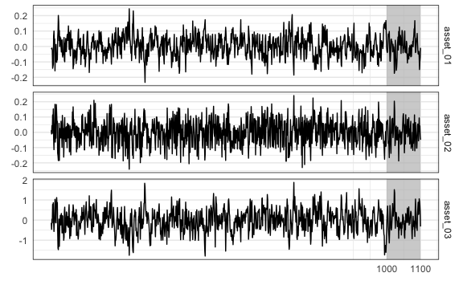

### MEDIUM

``` r
y_medium_train <- dgp$y_medium_train
y_medium_test <- dgp$y_medium_test
```

``` r
y_medium_train %>% 
  mutate(train = TRUE) %>% 
  bind_rows(y_medium_test %>% mutate(train = FALSE)) %>% 
  mutate(id = 1:n()) %>% 
  pivot_longer(-c(id, train), names_to = "asset", values_to = "value") %>% 
  ggplot(aes(x = id, y = value)) +
  annotate(
    geom = "rect",
    xmin = nrow(y_medium_train),
    xmax = nrow(y_medium_train) + nrow(y_medium_test),
    ymin = -Inf,
    ymax = Inf,
    alpha = .7,
    fill = "grey" # test set
  ) +
  geom_path() +
  facet_grid(asset ~ ., scales = "free_y") +
  scale_x_continuous(
    breaks = c(nrow(y_medium_train), nrow(y_medium_train) + nrow(y_medium_test))
  ) +
  theme_minimal() +
  theme(
    strip.text.y = element_text(size = 5), 
    panel.border = element_rect(fill = NA)
  ) +
  labs(
    x = element_blank(),
    y = element_blank()
  )
```

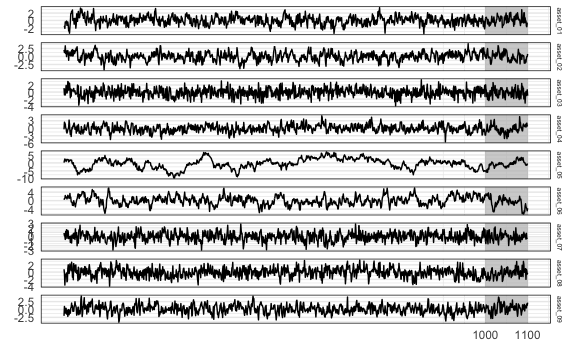

### LARGE

``` r
y_large_train <- dgp$y_large_train
y_large_test <- dgp$y_large_test
```

``` r
y_large_train %>% 
  mutate(train = TRUE) %>% 
  bind_rows(y_large_test %>% mutate(train = FALSE)) %>% 
  mutate(id = 1:n()) %>% 
  pivot_longer(-c(id, train), names_to = "asset", values_to = "value") %>% 
  ggplot(aes(x = id, y = value)) +
  annotate(
    geom = "rect",
    xmin = nrow(y_large_train),
    xmax = nrow(y_large_train) + nrow(y_large_test),
    ymin = -Inf,
    ymax = Inf,
    alpha = .7,
    fill = "grey" # test set
  ) +
  geom_path(size = .3) +
  facet_grid(asset ~ ., scales = "free_y") +
  scale_x_continuous(
    breaks = c(nrow(y_large_train), nrow(y_large_train) + nrow(y_large_test))
  ) +
  theme_minimal() +
  theme(
    strip.text.y = element_text(size = 5), 
    panel.border = element_rect(fill = NA),
    axis.text.y = element_text(size = 3)
  ) +
  labs(
    x = element_blank(),
    y = element_blank()
  )
```

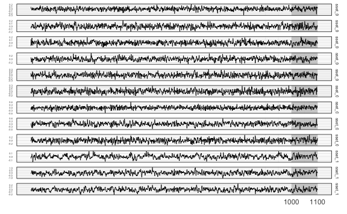

# Modeling

## VAR

``` r
(var_lag <- 5)
#> [1] 5
```

``` r
fit_var_small <- var_lm(y_small_train, var_lag, include_mean = FALSE)
fit_var_medium <- var_lm(y_medium_train, var_lag, include_mean = FALSE)
fit_var_large <- var_lm(y_large_train, var_lag, include_mean = FALSE)
```

## VHAR

``` r
fit_vhar_small <- vhar_lm(y_small_train, include_mean = FALSE)
fit_vhar_medium <- vhar_lm(y_medium_train, include_mean = FALSE)
fit_vhar_large <- vhar_lm(y_large_train, include_mean = FALSE)
```

## BVAR

``` r
(bvar_lag <- 5)
#> [1] 5
```

``` r
(bvar_small_optim <- choose_bvar(
  bvar_small_spec, 
  lower = c(
    rep(1e-2, n_small), # sigma
    1e-4, # lambda
    rep(1e-2, n_small) # delta
  ), 
  upper = c(
    rep(1, n_small), # sigma
    Inf, # lambda
    rep(1, n_small) # delta
  ), 
  y = y_small_train, 
  p = bvar_lag, 
  include_mean = FALSE,
  parallel = list(cl = cl, forward = FALSE, loginfo = FALSE)
))
#> Model Specification for BVAR
#> 
#> Parameters: Coefficent matrice and Covariance matrix
#> Prior: Minnesota
#> # Type '?bvar_minnesota' in the console for some help.
#> ========================================================
#> 
#> Setting for 'sigma':
#> [1]  0.0553  0.0524  0.0882
#> 
#> Setting for 'lambda':
#> [1]  0.118
#> 
#> Setting for 'delta':
#> [1]  0.14  0.13  0.11
#> 
#> Setting for 'eps':
#> [1]  1e-04
```

``` r
(bvar_medium_optim <- choose_bvar(
  bvar_medium_spec, 
  lower = c(
    rep(1e-2, n_medium), # sigma
    1e-4, # lambda
    rep(1e-2, n_medium) # delta
  ), 
  upper = c(
    rep(1, n_medium), # sigma
    Inf, # lambda
    rep(1, n_medium) # delta
  ), 
  y = y_medium_train, 
  p = bvar_lag, 
  include_mean = FALSE,
  parallel = list(cl = cl, forward = FALSE, loginfo = FALSE)
))
#> Model Specification for BVAR
#> 
#> Parameters: Coefficent matrice and Covariance matrix
#> Prior: Minnesota
#> # Type '?bvar_minnesota' in the console for some help.
#> ========================================================
#> 
#> Setting for 'sigma':
#> [1]  0.0387  0.0397  0.0496  0.0553  0.0627  0.0581  0.0648  0.1150  0.0931
#> 
#> Setting for 'lambda':
#> [1]  0.0722
#> 
#> Setting for 'delta':
#> [1]  0.1340  0.0457  0.0863  0.0665  0.0540  0.0592  0.1390  0.0642  0.1086
#> 
#> Setting for 'eps':
#> [1]  1e-04
```

``` r
(bvar_large_optim <- choose_bvar(
  bvar_large_spec, 
  lower = c(
    rep(1e-2, n_large), # sigma
    1e-4, # lambda
    rep(1e-2, n_large) # delta
  ), 
  upper = c(
    rep(1, n_large), # sigma
    Inf, # lambda
    rep(1, n_large) # delta
  ), 
  y = y_large_train, 
  p = bvar_lag, 
  include_mean = FALSE,
  parallel = list(cl = cl, forward = FALSE, loginfo = FALSE)
))
#> Model Specification for BVAR
#> 
#> Parameters: Coefficent matrice and Covariance matrix
#> Prior: Minnesota
#> # Type '?bvar_minnesota' in the console for some help.
#> ========================================================
#> 
#> Setting for 'sigma':
#>  [1]  0.0378  0.0403  0.0438  0.0555  0.0667  0.0420  0.0651  0.0599  0.0887
#> [10]  0.0789  0.0715  0.0989
#> 
#> Setting for 'lambda':
#> [1]  1e-04
#> 
#> Setting for 'delta':
#>  [1]  0.0800  0.0848  0.0694  0.0974  0.0665  0.0806  0.0525  0.1082  0.0884
#> [10]  0.0870  0.0810  0.0897
#> 
#> Setting for 'eps':
#> [1]  1e-04
```

``` r
fit_small_bvar <- bvar_small_optim$fit
fit_medium_bvar <- bvar_medium_optim$fit
fit_large_bvar <- bvar_large_optim$fit
```

## BVHAR-VAR

``` r
bvhar_var_small_spec <- set_bvhar(
  sigma = bvar_small_spec$sigma,
  lambda = bvar_small_spec$lambda,
  delta = bvar_small_spec$delta
)
#----------------------------
bvhar_var_medium_spec <- set_bvhar(
  sigma = bvar_medium_spec$sigma,
  lambda = bvar_medium_spec$lambda,
  delta = bvar_medium_spec$delta
)
#----------------------------
bvhar_var_large_spec <- set_bvhar(
  sigma = bvar_large_spec$sigma,
  lambda = bvar_large_spec$lambda,
  delta = bvar_large_spec$delta
)
```

``` r
(bvhar_var_small_optim <- choose_bvhar(
  bvhar_var_small_spec, 
  lower = c(
    rep(1e-2, n_small), # sigma
    1e-4, # lambda
    rep(1e-2, n_small) # delta
  ), 
  upper = c(
    rep(1, n_small), # sigma
    Inf, # lambda
    rep(1, n_small) # delta
  ), 
  y = y_small_train, 
  include_mean = FALSE,
  parallel = list(cl = cl, forward = FALSE, loginfo = FALSE)
))
#> Model Specification for BVHAR
#> 
#> Parameters: Coefficent matrice and Covariance matrix
#> Prior: MN_VAR
#> # Type '?bvhar_minnesota' in the console for some help.
#> ========================================================
#> 
#> Setting for 'sigma':
#> [1]  0.0554  0.0524  0.0933
#> 
#> Setting for 'lambda':
#> [1]  0.152
#> 
#> Setting for 'delta':
#> [1]  0.136  0.109  0.104
#> 
#> Setting for 'eps':
#> [1]  1e-04
```

``` r
(bvhar_var_medium_optim <- choose_bvhar(
  bvhar_var_medium_spec, 
  lower = c(
    rep(1e-2, n_medium), # sigma
    1e-4, # lambda
    rep(1e-2, n_medium) # delta
  ), 
  upper = c(
    rep(1, n_medium), # sigma
    Inf, # lambda
    rep(1, n_medium) # delta
  ), 
  y = y_medium_train, 
  include_mean = FALSE,
  parallel = list(cl = cl, forward = FALSE, loginfo = FALSE)
))
#> Model Specification for BVHAR
#> 
#> Parameters: Coefficent matrice and Covariance matrix
#> Prior: MN_VAR
#> # Type '?bvhar_minnesota' in the console for some help.
#> ========================================================
#> 
#> Setting for 'sigma':
#> [1]  0.0380  0.0388  0.0483  0.0517  0.0645  0.0565  0.0630  0.1364  0.1013
#> 
#> Setting for 'lambda':
#> [1]  0.045
#> 
#> Setting for 'delta':
#> [1]  0.1239  0.0546  0.0861  0.0688  0.0522  0.0583  0.1400  0.0565  0.1072
#> 
#> Setting for 'eps':
#> [1]  1e-04
```

``` r
(bvhar_var_large_optim <- choose_bvhar(
  bvhar_var_large_spec, 
  lower = c(
    rep(1e-2, n_large), # sigma
    1e-4, # lambda
    rep(1e-2, n_large) # delta
  ), 
  upper = c(
    rep(1, n_large), # sigma
    Inf, # lambda
    rep(1, n_large) # delta
  ), 
  y = y_large_train, 
  include_mean = FALSE,
  parallel = list(cl = cl, forward = FALSE, loginfo = FALSE)
))
#> Model Specification for BVHAR
#> 
#> Parameters: Coefficent matrice and Covariance matrix
#> Prior: MN_VAR
#> # Type '?bvhar_minnesota' in the console for some help.
#> ========================================================
#> 
#> Setting for 'sigma':
#>  [1]  0.0379  0.0404  0.0438  0.0557  0.0664  0.0419  0.0648  0.0593  0.0885
#> [10]  0.0784  0.0714  0.0994
#> 
#> Setting for 'lambda':
#> [1]  1e-04
#> 
#> Setting for 'delta':
#>  [1]  0.0836  0.0844  0.0708  0.0978  0.0721  0.0765  0.0511  0.1137  0.0927
#> [10]  0.0805  0.0854  0.0928
#> 
#> Setting for 'eps':
#> [1]  1e-04
```

``` r
fit_bvhar_small_var <- bvhar_var_small_optim$fit
fit_bvhar_medium_var <- bvhar_var_medium_optim$fit
fit_bvhar_large_var <- bvhar_var_large_optim$fit
```

## BVHAR-VHAR

``` r
bvhar_vhar_small_spec <- set_weight_bvhar(
  sigma = bvar_small_spec$sigma,
  lambda = bvar_small_spec$lambda,
  daily = bvar_small_spec$delta,
  weekly = bvar_small_spec$delta,
  monthly = bvar_small_spec$delta
)
#-----------------------------------------
bvhar_vhar_medium_spec <- set_weight_bvhar(
  sigma = bvar_medium_spec$sigma,
  lambda = bvar_medium_spec$lambda,
  daily = bvar_medium_spec$delta,
  weekly = bvar_medium_spec$delta,
  monthly = bvar_medium_spec$delta
)
#-----------------------------------------
bvhar_vhar_large_spec <- set_weight_bvhar(
  sigma = bvar_large_spec$sigma,
  lambda = bvar_large_spec$lambda,
  daily = bvar_large_spec$delta,
  weekly = bvar_large_spec$delta,
  monthly = bvar_large_spec$delta
)
```

``` r
(bvhar_vhar_small_optim <- choose_bvhar(
  bvhar_vhar_small_spec, 
  lower = c(
    rep(1e-2, n_small), # sigma
    1e-4, # lambda
    rep(1e-2, n_small), # daily
    rep(1e-2, n_small), # weekly
    rep(1e-2, n_small) # monthly
  ), 
  upper = c(
    rep(1, n_small), # sigma
    Inf, # lambda
    rep(1, n_small), # daily
    rep(1, n_small), # weekly
    rep(1, n_small) # monthly
  ), 
  y = y_small_train, 
  include_mean = FALSE,
  parallel = list(cl = cl, forward = FALSE, loginfo = FALSE)
))
#> Model Specification for BVHAR
#> 
#> Parameters: Coefficent matrice and Covariance matrix
#> Prior: MN_VHAR
#> # Type '?bvhar_minnesota' in the console for some help.
#> ========================================================
#> 
#> Setting for 'sigma':
#> [1]  0.0558  0.0528  0.0884
#> 
#> Setting for 'lambda':
#> [1]  0.135
#> 
#> Setting for 'eps':
#> [1]  1e-04
#> 
#> Setting for 'daily':
#> [1]  0.1278  0.1060  0.0956
#> 
#> Setting for 'weekly':
#> [1]  0.0684  0.0100  0.1574
#> 
#> Setting for 'monthly':
#> [1]  0.0723  0.0321  0.0100
```

``` r
(bvhar_vhar_medium_optim <- choose_bvhar(
  bvhar_vhar_medium_spec, 
  lower = c(
    rep(1e-2, n_medium), # sigma
    1e-4, # lambda
    rep(1e-2, n_medium), # daily
    rep(1e-2, n_medium), # weekly
    rep(1e-2, n_medium) # monthly
  ), 
  upper = c(
    rep(1, n_medium), # sigma
    Inf, # lambda
    rep(1, n_medium), # daily
    rep(1, n_medium), # weekly
    rep(1, n_medium) # monthly
  ), 
  y = y_medium_train, 
  include_mean = FALSE,
  parallel = list(cl = cl, forward = FALSE, loginfo = FALSE)
))
#> Model Specification for BVHAR
#> 
#> Parameters: Coefficent matrice and Covariance matrix
#> Prior: MN_VHAR
#> # Type '?bvhar_minnesota' in the console for some help.
#> ========================================================
#> 
#> Setting for 'sigma':
#> [1]  0.0380  0.0390  0.0484  0.0516  0.0644  0.0562  0.0631  0.1370  0.1007
#> 
#> Setting for 'lambda':
#> [1]  0.0435
#> 
#> Setting for 'eps':
#> [1]  1e-04
#> 
#> Setting for 'daily':
#> [1]  0.0982  0.0466  0.0827  0.0676  0.0484  0.0566  0.1383  0.0445  0.1018
#> 
#> Setting for 'weekly':
#> [1]  0.2056  0.0720  0.0115  0.0100  0.0100  0.0100  0.0100  0.1031  0.0100
#> 
#> Setting for 'monthly':
#> [1]  0.0100  0.0100  0.0907  0.0100  0.0100  0.0100  0.0100  0.0100  0.1349
```

``` r
(bvhar_vhar_large_optim <- choose_bvhar(
  bvhar_vhar_large_spec, 
  lower = c(
    rep(1e-2, n_large), # sigma
    1e-4, # lambda
    rep(1e-2, n_large), # daily
    rep(1e-2, n_large), # weekly
    rep(1e-2, n_large) # monthly
  ), 
  upper = c(
    rep(1, n_large), # sigma
    Inf, # lambda
    rep(1, n_large), # daily
    rep(1, n_large), # weekly
    rep(1, n_large) # monthly
  ), 
  y = y_large_train, 
  include_mean = FALSE,
  parallel = list(cl = cl, forward = FALSE, loginfo = FALSE)
))
#> Model Specification for BVHAR
#> 
#> Parameters: Coefficent matrice and Covariance matrix
#> Prior: MN_VHAR
#> # Type '?bvhar_minnesota' in the console for some help.
#> ========================================================
#> 
#> Setting for 'sigma':
#>  [1]  0.0379  0.0403  0.0438  0.0557  0.0665  0.0418  0.0647  0.0592  0.0883
#> [10]  0.0782  0.0712  0.0990
#> 
#> Setting for 'lambda':
#> [1]  1e-04
#> 
#> Setting for 'eps':
#> [1]  1e-04
#> 
#> Setting for 'daily':
#>  [1]  0.0811  0.0823  0.0530  0.0895  0.0709  0.0743  0.0484  0.1090  0.0877
#> [10]  0.0581  0.0753  0.0912
#> 
#> Setting for 'weekly':
#>  [1]  0.0100  0.0100  0.1538  0.0511  0.0114  0.0100  0.0100  0.0100  0.0100
#> [10]  0.1599  0.0505  0.0100
#> 
#> Setting for 'monthly':
#>  [1]  0.104  0.010  0.010  0.151  0.010  0.010  0.010  0.179  0.186  0.151
#> [11]  0.235  0.010
```

``` r
fit_bvhar_small_vhar <- bvhar_vhar_small_optim$fit
fit_bvhar_medium_vhar <- bvhar_vhar_medium_optim$fit
fit_bvhar_large_vhar <- bvhar_vhar_large_optim$fit
```

``` r
parallel::stopCluster(cl)
```

## Hyperparameters


    \begin{longtable}[t]{lllrrrrrrrrrrrr}
    \caption{\label{tab:empdgp2}Empirical Bayes Results for DGP2.}\\
    \toprule
     &    &     & y1 & y2 & y3 & y4 & y5 & y6 & y7 & y8 & y9 & y10 & y11 & y12\\
    \midrule
    \endfirsthead
    \caption[]{Empirical Bayes Results for DGP2. \textit{(continued)}}\\
    \toprule
      &    &     & y1 & y2 & y3 & y4 & y5 & y6 & y7 & y8 & y9 & y10 & y11 & y12\\
    \midrule
    \endhead

    \endfoot
    \bottomrule
    \endlastfoot
    \addlinespace[0.3em]
    \multicolumn{15}{l}{\textbf{SMALL}}\\
    \hspace{1em} & BVAR & $\sigma$ & 0.055 & 0.052 & 0.088 &  &  &  &  &  &  &  &  & \\

    \hspace{1em} &  & $\lambda$ & 0.118 &  &  &  &  &  &  &  &  &  &  & \\

    \hspace{1em} &  & $\delta$ & 0.140 & 0.130 & 0.110 &  &  &  &  &  &  &  &  & \\
    \cmidrule{2-15}
    \hspace{1em} & BVHAR-S & $\sigma$ & 0.055 & 0.052 & 0.093 &  &  &  &  &  &  &  &  & \\

    \hspace{1em} &  & $\lambda$ & 0.152 &  &  &  &  &  &  &  &  &  &  & \\

    \hspace{1em} &  & $\delta$ & 0.136 & 0.109 & 0.104 &  &  &  &  &  &  &  &  & \\
    \cmidrule{2-15}
    \hspace{1em} & BVHAR-L & $\sigma$ & 0.056 & 0.053 & 0.088 &  &  &  &  &  &  &  &  & \\

    \hspace{1em} &  & $\lambda$ & 0.135 &  &  &  &  &  &  &  &  &  &  & \\

    \hspace{1em} &  & $d_i$ & 0.128 & 0.106 & 0.096 &  &  &  &  &  &  &  &  & \\

    \hspace{1em} &  & $w_i$ & 0.068 & 0.010 & 0.157 &  &  &  &  &  &  &  &  & \\

    \hspace{1em} &  & $m_i$ & 0.072 & 0.032 & 0.010 &  &  &  &  &  &  &  &  & \\
    \cmidrule{1-15}
    \addlinespace[0.3em]
    \multicolumn{15}{l}{\textbf{MEDIUM}}\\
    \hspace{1em} & BVAR & $\sigma$ & 0.039 & 0.040 & 0.050 & 0.055 & 0.063 & 0.058 & 0.065 & 0.115 & 0.093 &  &  & \\

    \hspace{1em} &  & $\lambda$ & 0.072 &  &  &  &  &  &  &  &  &  &  & \\

    \hspace{1em} &  & $\delta$ & 0.134 & 0.046 & 0.086 & 0.066 & 0.054 & 0.059 & 0.139 & 0.064 & 0.109 &  &  & \\
    \cmidrule{2-15}
    \hspace{1em} & BVHAR-S & $\sigma$ & 0.038 & 0.039 & 0.048 & 0.052 & 0.064 & 0.056 & 0.063 & 0.136 & 0.101 &  &  & \\

    \hspace{1em} &  & $\lambda$ & 0.045 &  &  &  &  &  &  &  &  &  &  & \\

    \hspace{1em} &  & $\delta$ & 0.124 & 0.055 & 0.086 & 0.069 & 0.052 & 0.058 & 0.140 & 0.057 & 0.107 &  &  & \\
    \cmidrule{2-15}
    \hspace{1em} & BVHAR-L & $\sigma$ & 0.038 & 0.039 & 0.048 & 0.052 & 0.064 & 0.056 & 0.063 & 0.137 & 0.101 &  &  & \\

    \hspace{1em} &  & $\lambda$ & 0.043 &  &  &  &  &  &  &  &  &  &  & \\

    \hspace{1em} &  & $d_i$ & 0.098 & 0.047 & 0.083 & 0.068 & 0.048 & 0.057 & 0.138 & 0.045 & 0.102 &  &  & \\

    \hspace{1em} &  & $w_i$ & 0.206 & 0.072 & 0.011 & 0.010 & 0.010 & 0.010 & 0.010 & 0.103 & 0.010 &  &  & \\

    \hspace{1em} &  & $m_i$ & 0.010 & 0.010 & 0.091 & 0.010 & 0.010 & 0.010 & 0.010 & 0.010 & 0.135 &  &  & \\
    \cmidrule{1-15}
    \addlinespace[0.3em]
    \multicolumn{15}{l}{\textbf{LARGE}}\\
    \hspace{1em} & BVAR & $\sigma$ & 0.038 & 0.040 & 0.044 & 0.056 & 0.067 & 0.042 & 0.065 & 0.060 & 0.089 & 0.079 & 0.071 & 0.099\\

    \hspace{1em}\hspace{1em}\hspace{1em} &  & $\lambda$ & 0.000 &  &  &  &  &  &  &  &  &  &  & \\

    \hspace{1em} &  & $\delta$ & 0.080 & 0.085 & 0.069 & 0.097 & 0.067 & 0.081 & 0.053 & 0.108 & 0.088 & 0.087 & 0.081 & 0.090\\
    \cmidrule{2-15}
    \hspace{1em} & BVHAR-S & $\sigma$ & 0.038 & 0.040 & 0.044 & 0.056 & 0.066 & 0.042 & 0.065 & 0.059 & 0.088 & 0.078 & 0.071 & 0.099\\

     &  & $\lambda$ & 0.000 &  &  &  &  &  &  &  &  &  &  & \\

    \hspace{1em} &  & $\delta$ & 0.084 & 0.084 & 0.071 & 0.098 & 0.072 & 0.077 & 0.051 & 0.114 & 0.093 & 0.081 & 0.085 & 0.093\\
    \cmidrule{2-15}
    \hspace{1em} & BVHAR-L & $\sigma$ & 0.038 & 0.040 & 0.044 & 0.056 & 0.067 & 0.042 & 0.065 & 0.059 & 0.088 & 0.078 & 0.071 & 0.099\\

     &  & $\lambda$ & 0.000 &  &  &  &  &  &  &  &  &  &  & \\

    \hspace{1em} &  & $d_i$ & 0.081 & 0.082 & 0.053 & 0.090 & 0.071 & 0.074 & 0.048 & 0.109 & 0.088 & 0.058 & 0.075 & 0.091\\

    \hspace{1em} &  & $w_i$ & 0.010 & 0.010 & 0.154 & 0.051 & 0.011 & 0.010 & 0.010 & 0.010 & 0.010 & 0.160 & 0.051 & 0.010\\

    \hspace{1em} &  & $m_i$ & 0.104 & 0.010 & 0.010 & 0.151 & 0.010 & 0.010 & 0.010 & 0.179 & 0.186 & 0.151 & 0.235 & 0.010\\*
    \end{longtable}

# Errors

## Rolling Windows

### SMALL

``` r
mod_small_list <- list(
  fit_var_small,
  fit_vhar_small,
  fit_small_bvar,
  fit_bvhar_small_var,
  fit_bvhar_small_vhar
)
# 1-step-----------
cv_small_1 <- 
  mod_small_list %>% 
  lapply(
    function(mod) {
      forecast_roll(mod, 1, y_small_test)
    }
  )
# 5-step-----------
cv_small_5 <- 
  mod_small_list %>% 
  lapply(
    function(mod) {
      forecast_roll(mod, 5, y_small_test)
    }
  )
# 20-step----------
cv_small_20 <- 
  mod_small_list %>% 
  lapply(
    function(mod) {
      forecast_roll(mod, 20, y_small_test)
    }
  )
```

### MEDIUM

``` r
mod_medium_list <- list(
  fit_var_medium,
  fit_vhar_medium,
  fit_medium_bvar,
  fit_bvhar_medium_var,
  fit_bvhar_medium_vhar
)
# 1-step-----------
cv_medium_1 <- 
  mod_medium_list %>% 
  lapply(
    function(mod) {
      forecast_roll(mod, 1, y_medium_test)
    }
  )
# 5-step-----------
cv_medium_5 <- 
  mod_medium_list %>% 
  lapply(
    function(mod) {
      forecast_roll(mod, 5, y_medium_test)
    }
  )
# 20-step----------
cv_medium_20 <- 
  mod_medium_list %>% 
  lapply(
    function(mod) {
      forecast_roll(mod, 20, y_medium_test)
    }
  )
```

### LARGE

``` r
mod_large_list <- list(
  fit_var_large,
  fit_vhar_large,
  fit_large_bvar,
  fit_bvhar_large_var,
  fit_bvhar_large_vhar
)
# 1-step-----------
cv_large_1 <- 
  mod_large_list %>% 
  lapply(
    function(mod) {
      forecast_roll(mod, 1, y_large_test)
    }
  )
# 5-step-----------
cv_large_5 <- 
  mod_large_list %>% 
  lapply(
    function(mod) {
      forecast_roll(mod, 5, y_large_test)
    }
  )
# 20-step----------
cv_large_20 <- 
  mod_large_list %>% 
  lapply(
    function(mod) {
      forecast_roll(mod, 20, y_large_test)
    }
  )
```

### Lists

``` r
# SMALL-------------------------------
cv_small_list <- 
  lapply(
    c(1, 5, 20),
    function(h) {
      mod_small_list %>% 
        lapply(
          function(mod) {
            forecast_roll(mod, h, y_small_test)
          }
        )
    }
  )
# MEDIUM------------------------------
cv_medium_list <- 
  lapply(
    c(1, 5, 20),
    function(h) {
      mod_small_list %>% 
        lapply(
          function(mod) {
            forecast_roll(mod, h, y_medium_test)
          }
        )
    }
  )
# LARGE-------------------------------
cv_large_list <- 
  lapply(
    c(1, 5, 20),
    function(h) {
      mod_small_list %>% 
        lapply(
          function(mod) {
            forecast_roll(mod, h, y_large_test)
          }
        )
    }
  )
```

## Relative Errors

Set VAR as the benchmark model.

    \begin{table}[H]

    \caption{\label{tab:dgp2result}Out-of-sample forecasting performance measures for DGP2.}
    \centering
    \resizebox{\linewidth}{!}{
    \begin{tabular}[t]{cc|ccc|ccc|ccc|}
    \toprule
    \multicolumn{2}{c}{ } & \multicolumn{3}{c}{RMAFE} & \multicolumn{3}{c}{RMSFE} & \multicolumn{3}{c}{RMASE} \\
    \cmidrule(l{3pt}r{3pt}){3-5} \cmidrule(l{3pt}r{3pt}){6-8} \cmidrule(l{3pt}r{3pt}){9-11}
    \rotatebox{0}{} & \rotatebox{0}{} & \rotatebox{0}{$h = 1$} & \rotatebox{0}{$h = 5$} & \rotatebox{0}{$h = 20$} & \rotatebox{0}{$h = 1$} & \rotatebox{0}{$h = 5$} & \rotatebox{0}{$h = 20$} & \rotatebox{0}{$h = 1$} & \rotatebox{0}{$h = 5$} & \rotatebox{0}{$h = 20$}\\
    \midrule
     & VHAR & \textcolor{black}{\num{.984}} & \textcolor{black}{\num{1.008}} & \textcolor{black}{\num{1.004}} & \textcolor{black}{\num{.982}} & \textcolor{black}{\num{1.005}} & \textcolor{black}{\num{1.005}} & \textcolor{black}{\num{.981}} & \textcolor{black}{\num{.992}} & \textcolor{black}{\num{1.003}}\\

     & BVAR & \textcolor{black}{\num{.974}} & \textcolor{black}{\num{.990}} & \textcolor{red}{\num{1.000}} & \textcolor{black}{\num{.973}} & \textcolor{black}{\num{.972}} & \textcolor{red}{\num{1.000}} & \textcolor{red}{\num{.971}} & \textcolor{black}{\num{.986}} & \textcolor{red}{\num{1.000}}\\

     & BVHAR-S & \textcolor{red}{\num{.973}} & \textcolor{black}{\num{.992}} & \textcolor{black}{\num{1.002}} & \textcolor{red}{\num{.969}} & \textcolor{black}{\num{.974}} & \textcolor{black}{\num{1.002}} & \textcolor{black}{\num{.972}} & \textcolor{black}{\num{.987}} & \textcolor{black}{\num{1.002}}\\

    \multirow{-4}{*}{\centering\arraybackslash SMALL} & BVHAR-L & \textcolor{black}{\num{.974}} & \textcolor{red}{\num{.990}} & \textcolor{black}{\num{1.002}} & \textcolor{black}{\num{.971}} & \textcolor{red}{\num{.970}} & \textcolor{black}{\num{1.002}} & \textcolor{black}{\num{.973}} & \textcolor{red}{\num{.986}} & \textcolor{black}{\num{1.001}}\\
    \cmidrule{1-11}
     & VHAR & \textcolor{black}{\num{1.002}} & \textcolor{black}{\num{1.075}} & \textcolor{black}{\num{1.013}} & \textcolor{black}{\num{.988}} & \textcolor{black}{\num{1.114}} & \textcolor{black}{\num{1.019}} & \textcolor{black}{\num{1.009}} & \textcolor{black}{\num{1.078}} & \textcolor{black}{\num{1.015}}\\

     & BVAR & \textcolor{black}{\num{.970}} & \textcolor{black}{\num{.984}} & \textcolor{black}{\num{1.000}} & \textcolor{black}{\num{.961}} & \textcolor{black}{\num{.981}} & \textcolor{red}{\num{1.000}} & \textcolor{black}{\num{.972}} & \textcolor{black}{\num{.984}} & \textcolor{black}{\num{1.000}}\\

     & BVHAR-S & \textcolor{red}{\num{.967}} & \textcolor{black}{\num{.983}} & \textcolor{black}{\num{1.000}} & \textcolor{black}{\num{.958}} & \textcolor{red}{\num{.979}} & \textcolor{black}{\num{1.000}} & \textcolor{red}{\num{.970}} & \textcolor{red}{\num{.982}} & \textcolor{black}{\num{1.000}}\\

    \multirow{-4}{*}{\centering\arraybackslash MEDIUM} & BVHAR-L & \textcolor{black}{\num{.967}} & \textcolor{red}{\num{.983}} & \textcolor{red}{\num{1.000}} & \textcolor{red}{\num{.958}} & \textcolor{black}{\num{.979}} & \textcolor{black}{\num{1.000}} & \textcolor{black}{\num{.970}} & \textcolor{black}{\num{.982}} & \textcolor{red}{\num{1.000}}\\
    \cmidrule{1-11}
     & VHAR & \textcolor{black}{\num{1.000}} & \textcolor{black}{\num{1.072}} & \textcolor{black}{\num{1.011}} & \textcolor{black}{\num{.998}} & \textcolor{black}{\num{1.124}} & \textcolor{black}{\num{1.017}} & \textcolor{black}{\num{.994}} & \textcolor{black}{\num{1.071}} & \textcolor{black}{\num{1.016}}\\

     & BVAR & \textcolor{black}{\num{.969}} & \textcolor{red}{\num{.992}} & \textcolor{black}{\num{1.000}} & \textcolor{black}{\num{.955}} & \textcolor{red}{\num{.992}} & \textcolor{black}{\num{1.000}} & \textcolor{black}{\num{.967}} & \textcolor{black}{\num{.992}} & \textcolor{black}{\num{1.000}}\\

     & BVHAR-S & \textcolor{black}{\num{.969}} & \textcolor{black}{\num{.993}} & \textcolor{red}{\num{1.000}} & \textcolor{black}{\num{.951}} & \textcolor{black}{\num{.992}} & \textcolor{red}{\num{1.000}} & \textcolor{black}{\num{.965}} & \textcolor{black}{\num{.992}} & \textcolor{red}{\num{1.000}}\\

    \multirow{-4}{*}{\centering\arraybackslash LARGE} & BVHAR-L & \textcolor{red}{\num{.968}} & \textcolor{black}{\num{.993}} & \textcolor{black}{\num{1.000}} & \textcolor{red}{\num{.949}} & \textcolor{black}{\num{.992}} & \textcolor{black}{\num{1.000}} & \textcolor{red}{\num{.964}} & \textcolor{red}{\num{.992}} & \textcolor{black}{\num{1.000}}\\
    \bottomrule
    \end{tabular}}
    \end{table}

## Piecewise Errors

### SMALL

Plots

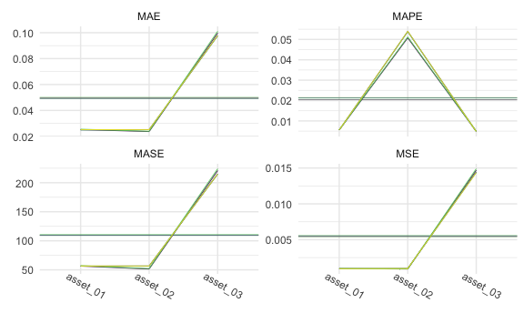

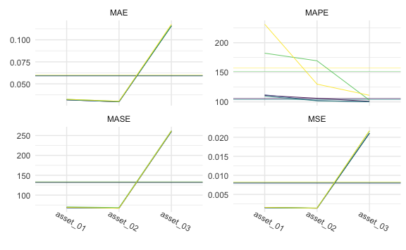

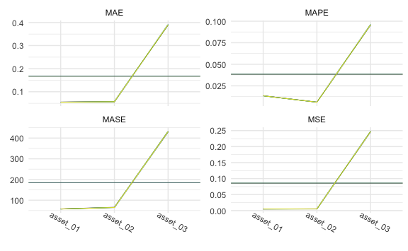

Tables

1-step:


    \begin{longtable}[t]{lllllll}
    \caption{\label{tab:smallone}SMALL Simulation - 1-step ahead Rolling Window Forecasting Loss}\\
    \toprule
    \multicolumn{1}{c}{ } & \multicolumn{1}{c}{ } & \multicolumn{2}{c}{Frequentist} & \multicolumn{1}{c}{BVAR} & \multicolumn{2}{c}{BVHAR} \\
    \cmidrule(l{3pt}r{3pt}){3-4} \cmidrule(l{3pt}r{3pt}){5-5} \cmidrule(l{3pt}r{3pt}){6-7}
     &  & VAR & VHAR & Minnesota & VAR-type & VHAR-type\\
    \midrule
    \endfirsthead
    \caption[]{SMALL Simulation - 1-step ahead Rolling Window Forecasting Loss \textit{(continued)}}\\
    \toprule
     &  & VAR & VHAR & Minnesota & VAR-type & VHAR-type\\
    \midrule
    \endhead

    \endfoot
    \bottomrule
    \endlastfoot
     & asset01 & \num{0.000971} & \num{0.000941} & \num{0.000934} & \textcolor{red}{\num{0.000927}} & \num{0.00093}\\
    \cmidrule{2-7}\nopagebreak
     & asset02 & \num{0.000893} & \num{0.000892} & \textcolor{red}{\num{0.000855}} & \num{0.000878} & \num{0.000878}\\
    \cmidrule{2-7}\nopagebreak
     & asset03 & \num{0.0148} & \num{0.0145} & \num{0.0145} & \textcolor{red}{\num{0.0144}} & \num{0.0144}\\
    \cmidrule{2-7}\nopagebreak
    \multirow{-4}{*}{\raggedright\arraybackslash MSE} & \cellcolor{gray}{Average} & \num{0.00556} & \num{0.00546} & \num{0.00541} & \textcolor{red}{\num{0.00539}} & \num{0.0054}\\
    \cmidrule{1-7}\pagebreak[0]
     & asset01 & \num{0.0253} & \num{0.0246} & \num{0.0248} & \textcolor{red}{\num{0.0246}} & \num{0.0246}\\
    \cmidrule{2-7}\nopagebreak
     & asset02 & \num{0.0237} & \num{0.0242} & \textcolor{red}{\num{0.0234}} & \num{0.0239} & \num{0.0239}\\
    \cmidrule{2-7}\nopagebreak
     & asset03 & \num{0.1011} & \num{0.099} & \num{0.098} & \textcolor{red}{\num{0.0976}} & \num{0.0977}\\
    \cmidrule{2-7}\nopagebreak
    \multirow{-4}{*}{\raggedright\arraybackslash MAE} & \cellcolor{gray}{Average} & \num{0.05} & \num{0.0492} & \num{0.0487} & \textcolor{red}{\num{0.0487}} & \num{0.0487}\\
    \cmidrule{1-7}\pagebreak[0]
     & asset01 & \textcolor{red}{\num{208.111}} & \num{306.087} & \num{220.86} & \num{245.365} & \num{244.156}\\
    \cmidrule{2-7}\nopagebreak
     & asset02 & \textcolor{red}{\num{179.296}} & \num{268.688} & \num{220.156} & \num{269.486} & \num{269.331}\\
    \cmidrule{2-7}\nopagebreak
     & asset03 & \num{192.424} & \num{177.286} & \num{178.2} & \num{175.453} & \textcolor{red}{\num{175.302}}\\
    \cmidrule{2-7}\nopagebreak
    \multirow{-4}{*}{\raggedright\arraybackslash MAPE} & \cellcolor{gray}{Average} & \textcolor{red}{\num{193.277}} & \num{250.687} & \num{206.405} & \num{230.101} & \num{229.596}\\
    \cmidrule{1-7}\pagebreak[0]
     & asset01 & \num{57.443} & \num{56.671} & \num{56.491} & \textcolor{red}{\num{56.261}} & \num{56.416}\\
    \cmidrule{2-7}\nopagebreak
     & asset02 & \num{52.389} & \num{54.007} & \textcolor{red}{\num{51.666}} & \num{53.311} & \num{53.342}\\
    \cmidrule{2-7}\nopagebreak
     & asset03 & \num{226.772} & \num{219.693} & \num{218.817} & \textcolor{red}{\num{217.659}} & \num{217.883}\\
    \cmidrule{2-7}\nopagebreak
    \multirow{-4}{*}{\raggedright\arraybackslash MASE} & \cellcolor{gray}{Average} & \num{112.201} & \num{110.124} & \textcolor{red}{\num{108.991}} & \num{109.077} & \num{109.214}\\*
    \end{longtable}

5-step:


    \begin{longtable}[t]{lllllll}
    \caption{\label{tab:smallfive}SMALL Simulation - 5-step ahead Rolling Window Forecasting Loss}\\
    \toprule
    \multicolumn{1}{c}{ } & \multicolumn{1}{c}{ } & \multicolumn{2}{c}{Frequentist} & \multicolumn{1}{c}{BVAR} & \multicolumn{2}{c}{BVHAR} \\
    \cmidrule(l{3pt}r{3pt}){3-4} \cmidrule(l{3pt}r{3pt}){5-5} \cmidrule(l{3pt}r{3pt}){6-7}
     &  & VAR & VHAR & Minnesota & VAR-type & VHAR-type\\
    \midrule
    \endfirsthead
    \caption[]{SMALL Simulation - 5-step ahead Rolling Window Forecasting Loss \textit{(continued)}}\\
    \toprule
     &  & VAR & VHAR & Minnesota & VAR-type & VHAR-type\\
    \midrule
    \endhead

    \endfoot
    \bottomrule
    \endlastfoot
     & asset01 & \num{0.00156} & \num{0.00159} & \textcolor{red}{\num{0.00151}} & \num{0.00152} & \num{0.00152}\\
    \cmidrule{2-7}\nopagebreak
     & asset02 & \num{0.00142} & \num{0.00139} & \textcolor{red}{\num{0.00137}} & \num{0.00137} & \num{0.00137}\\
    \cmidrule{2-7}\nopagebreak
     & asset03 & \num{0.0216} & \num{0.0217} & \num{0.021} & \num{0.0211} & \textcolor{red}{\num{0.021}}\\
    \cmidrule{2-7}\nopagebreak
    \multirow{-4}{*}{\raggedright\arraybackslash MSE} & \cellcolor{gray}{Average} & \num{0.0082} & \num{0.00824} & \num{0.00798} & \num{0.00799} & \textcolor{red}{\num{0.00796}}\\
    \cmidrule{1-7}\pagebreak[0]
     & asset01 & \num{0.0325} & \num{0.0325} & \textcolor{red}{\num{0.0318}} & \num{0.0319} & \num{0.0319}\\
    \cmidrule{2-7}\nopagebreak
     & asset02 & \num{0.0302} & \num{0.0302} & \textcolor{red}{\num{0.0296}} & \num{0.0297} & \num{0.0296}\\
    \cmidrule{2-7}\nopagebreak
     & asset03 & \num{0.116} & \num{0.118} & \num{0.116} & \num{0.116} & \textcolor{red}{\num{0.116}}\\
    \cmidrule{2-7}\nopagebreak
    \multirow{-4}{*}{\raggedright\arraybackslash MAE} & \cellcolor{gray}{Average} & \num{0.0596} & \num{0.0601} & \num{0.0591} & \num{0.0591} & \textcolor{red}{\num{0.059}}\\
    \cmidrule{1-7}\pagebreak[0]
     & asset01 & \num{182.318} & \num{231.297} & \num{110.956} & \num{111.869} & \textcolor{red}{\num{109.476}}\\
    \cmidrule{2-7}\nopagebreak
     & asset02 & \num{169.434} & \num{129.972} & \num{106.025} & \num{102.146} & \textcolor{red}{\num{101.777}}\\
    \cmidrule{2-7}\nopagebreak
     & asset03 & \num{102.909} & \num{111.041} & \num{100.918} & \textcolor{red}{\num{100.073}} & \num{100.256}\\
    \cmidrule{2-7}\nopagebreak
    \multirow{-4}{*}{\raggedright\arraybackslash MAPE} & \cellcolor{gray}{Average} & \num{151.554} & \num{157.436} & \num{105.966} & \num{104.696} & \textcolor{red}{\num{103.836}}\\
    \cmidrule{1-7}\pagebreak[0]
     & asset01 & \num{70.381} & \num{69.171} & \textcolor{red}{\num{68.36}} & \num{68.496} & \num{68.488}\\
    \cmidrule{2-7}\nopagebreak
     & asset02 & \num{68.565} & \textcolor{red}{\num{67.073}} & \num{67.135} & \num{67.29} & \num{67.193}\\
    \cmidrule{2-7}\nopagebreak
     & asset03 & \num{262.345} & \num{261.708} & \num{260.192} & \num{260.343} & \textcolor{red}{\num{259.971}}\\
    \cmidrule{2-7}\nopagebreak
    \multirow{-4}{*}{\raggedright\arraybackslash MASE} & \cellcolor{gray}{Average} & \num{133.764} & \num{132.651} & \num{131.896} & \num{132.043} & \textcolor{red}{\num{131.884}}\\*
    \end{longtable}

20-step:


    \begin{longtable}[t]{lllllll}
    \caption{\label{tab:smalltwenty}SMALL Simulation - 20-step ahead Rolling Window Forecasting Loss}\\
    \toprule
    \multicolumn{1}{c}{ } & \multicolumn{1}{c}{ } & \multicolumn{2}{c}{Frequentist} & \multicolumn{1}{c}{BVAR} & \multicolumn{2}{c}{BVHAR} \\
    \cmidrule(l{3pt}r{3pt}){3-4} \cmidrule(l{3pt}r{3pt}){5-5} \cmidrule(l{3pt}r{3pt}){6-7}
     &  & VAR & VHAR & Minnesota & VAR-type & VHAR-type\\
    \midrule
    \endfirsthead
    \caption[]{SMALL Simulation - 20-step ahead Rolling Window Forecasting Loss \textit{(continued)}}\\
    \toprule
     &  & VAR & VHAR & Minnesota & VAR-type & VHAR-type\\
    \midrule
    \endhead

    \endfoot
    \bottomrule
    \endlastfoot
     & asset01 & \num{0.00161} & \textcolor{red}{\num{0.0016}} & \num{0.00161} & \num{0.00162} & \num{0.00162}\\
    \cmidrule{2-7}\nopagebreak
     & asset02 & \num{0.00128} & \textcolor{red}{\num{0.00128}} & \num{0.00128} & \num{0.00128} & \num{0.00128}\\
    \cmidrule{2-7}\nopagebreak
     & asset03 & \num{0.0201} & \num{0.0202} & \textcolor{red}{\num{0.0201}} & \num{0.0201} & \num{0.0201}\\
    \cmidrule{2-7}\nopagebreak
    \multirow{-4}{*}{\raggedright\arraybackslash MSE} & \cellcolor{gray}{Average} & \num{0.00765} & \num{0.00769} & \textcolor{red}{\num{0.00765}} & \num{0.00767} & \num{0.00766}\\
    \cmidrule{1-7}\pagebreak[0]
     & asset01 & \num{0.0325} & \textcolor{red}{\num{0.0324}} & \num{0.0325} & \num{0.0326} & \num{0.0326}\\
    \cmidrule{2-7}\nopagebreak
     & asset02 & \num{0.0285} & \textcolor{red}{\num{0.0284}} & \num{0.0285} & \num{0.0285} & \num{0.0285}\\
    \cmidrule{2-7}\nopagebreak
     & asset03 & \num{0.112} & \num{0.112} & \textcolor{red}{\num{0.112}} & \num{0.112} & \num{0.112}\\
    \cmidrule{2-7}\nopagebreak
    \multirow{-4}{*}{\raggedright\arraybackslash MAE} & \cellcolor{gray}{Average} & \num{0.0575} & \num{0.0578} & \textcolor{red}{\num{0.0575}} & \num{0.0577} & \num{0.0576}\\
    \cmidrule{1-7}\pagebreak[0]
     & asset01 & \num{99.976} & \num{106.891} & \num{100} & \num{99.073} & \textcolor{red}{\num{98.963}}\\
    \cmidrule{2-7}\nopagebreak
     & asset02 & \num{99.955} & \num{106.589} & \num{100} & \textcolor{red}{\num{99.842}} & \num{99.947}\\
    \cmidrule{2-7}\nopagebreak
     & asset03 & \num{100.025} & \num{108.117} & \textcolor{red}{\num{100}} & \num{100.485} & \num{100.367}\\
    \cmidrule{2-7}\nopagebreak
    \multirow{-4}{*}{\raggedright\arraybackslash MAPE} & \cellcolor{gray}{Average} & \num{99.985} & \num{107.199} & \num{100} & \num{99.8} & \textcolor{red}{\num{99.759}}\\
    \cmidrule{1-7}\pagebreak[0]
     & asset01 & \num{69.543} & \textcolor{red}{\num{69.168}} & \num{69.542} & \num{69.647} & \num{69.641}\\
    \cmidrule{2-7}\nopagebreak
     & asset02 & \num{64.872} & \textcolor{red}{\num{64.319}} & \num{64.871} & \num{64.954} & \num{64.953}\\
    \cmidrule{2-7}\nopagebreak
     & asset03 & \num{250.106} & \num{252.109} & \textcolor{red}{\num{250.089}} & \num{250.656} & \num{250.501}\\
    \cmidrule{2-7}\nopagebreak
    \multirow{-4}{*}{\raggedright\arraybackslash MASE} & \cellcolor{gray}{Average} & \num{128.173} & \num{128.532} & \textcolor{red}{\num{128.168}} & \num{128.419} & \num{128.365}\\*
    \end{longtable}

### MEDIUM

Plots

``` r
cv_medium_1 %>% 
  gg_loss(
    y_medium_test, 
    mean_line = TRUE, 
    line_param = list(size = .3), 
    mean_param = list(alpha = .5, size = .3), 
    viridis = TRUE, 
    show.legend = FALSE
  ) +
  theme_minimal() +
  theme(
    axis.text.x = element_text(angle = -30, vjust = -1),
    legend.title = element_text(size = 8),
    legend.text = element_text(size = 7),
    legend.key.size = unit(.3, "cm")
  )
```

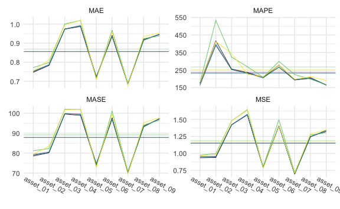

``` r
cv_medium_5 %>% 
  gg_loss(
    y_medium_test, 
    mean_line = TRUE, 
    line_param = list(size = .3), 
    mean_param = list(alpha = .5, size = .3), 
    viridis = TRUE, 
    show.legend = FALSE
  ) +
  theme_minimal() +
  theme(
    axis.text.x = element_text(angle = -30, vjust = -1),
    legend.title = element_text(size = 8),
    legend.text = element_text(size = 7),
    legend.key.size = unit(.3, "cm")
  )
```

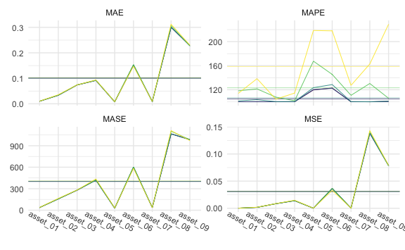

``` r
cv_medium_20 %>% 
  gg_loss(
    y_medium_test, 
    mean_line = TRUE, 
    line_param = list(size = .3), 
    mean_param = list(alpha = .5, size = .3), 
    viridis = TRUE, 
    show.legend = FALSE
  ) +
  theme_minimal() +
  theme(
    axis.text.x = element_text(angle = -30, vjust = -1),
    legend.title = element_text(size = 8),
    legend.text = element_text(size = 7),
    legend.key.size = unit(.3, "cm")
  )
```

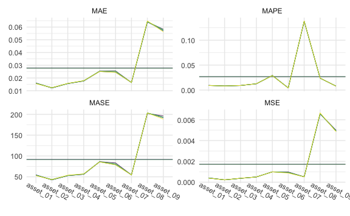

Tables

1-step:


    \begin{longtable}[t]{lllllll}
    \caption{\label{tab:medone}MEDIUM Simulation - 1-step ahead Rolling Window Forecasting Loss}\\
    \toprule
    \multicolumn{1}{c}{ } & \multicolumn{1}{c}{ } & \multicolumn{2}{c}{Frequentist} & \multicolumn{1}{c}{BVAR} & \multicolumn{2}{c}{BVHAR} \\
    \cmidrule(l{3pt}r{3pt}){3-4} \cmidrule(l{3pt}r{3pt}){5-5} \cmidrule(l{3pt}r{3pt}){6-7}
     &  & VAR & VHAR & Minnesota & VAR-type & VHAR-type\\
    \midrule
    \endfirsthead
    \caption[]{MEDIUM Simulation - 1-step ahead Rolling Window Forecasting Loss \textit{(continued)}}\\
    \toprule
     &  & VAR & VHAR & Minnesota & VAR-type & VHAR-type\\
    \midrule
    \endhead

    \endfoot
    \bottomrule
    \endlastfoot
     & asset01 & \num{0.000377} & \num{0.000374} & \num{0.000349} & \textcolor{red}{\num{0.000348}} & \num{0.000348}\\
    \cmidrule{2-7}\nopagebreak
     & asset02 & \num{0.000234} & \num{0.000239} & \num{0.000217} & \num{0.000216} & \textcolor{red}{\num{0.000216}}\\
    \cmidrule{2-7}\nopagebreak
     & asset03 & \num{0.000347} & \num{0.000344} & \num{0.00033} & \textcolor{red}{\num{0.000328}} & \num{0.000328}\\
    \cmidrule{2-7}\nopagebreak
     & asset04 & \num{0.00051} & \num{0.000532} & \textcolor{red}{\num{0.000503}} & \num{0.000504} & \num{0.000504}\\
    \cmidrule{2-7}\nopagebreak
     & asset05 & \num{0.000962} & \num{0.000979} & \textcolor{red}{\num{0.000959}} & \num{0.000979} & \num{0.000979}\\
    \cmidrule{2-7}\nopagebreak
     & asset06 & \num{0.000857} & \textcolor{red}{\num{0.000832}} & \num{0.000846} & \num{0.000865} & \num{0.000865}\\
    \cmidrule{2-7}\nopagebreak
     & asset07 & \num{0.000533} & \num{0.000534} & \textcolor{red}{\num{0.000517}} & \num{0.000528} & \num{0.000529}\\
    \cmidrule{2-7}\nopagebreak
     & asset08 & \num{0.00605} & \num{0.00599} & \textcolor{red}{\num{0.00579}} & \num{0.00588} & \num{0.0059}\\
    \cmidrule{2-7}\nopagebreak
     & asset09 & \textcolor{red}{\num{0.00412}} & \num{0.00419} & \num{0.00417} & \num{0.00432} & \num{0.00432}\\
    \cmidrule{2-7}\nopagebreak
    \multirow{-10}{*}{\raggedright\arraybackslash MSE} & \cellcolor{gray}{Average} & \num{0.00155} & \num{0.00156} & \textcolor{red}{\num{0.00152}} & \num{0.00155} & \num{0.00155}\\
    \cmidrule{1-7}\pagebreak[0]
     & asset01 & \num{0.0152} & \num{0.0152} & \num{0.0146} & \textcolor{red}{\num{0.0145}} & \num{0.0145}\\
    \cmidrule{2-7}\nopagebreak
     & asset02 & \num{0.0127} & \num{0.0125} & \num{0.012} & \num{0.0119} & \textcolor{red}{\num{0.0119}}\\
    \cmidrule{2-7}\nopagebreak
     & asset03 & \num{0.0151} & \num{0.015} & \textcolor{red}{\num{0.0148}} & \num{0.0148} & \num{0.0148}\\
    \cmidrule{2-7}\nopagebreak
     & asset04 & \num{0.0174} & \num{0.0179} & \textcolor{red}{\num{0.0174}} & \num{0.0174} & \num{0.0174}\\
    \cmidrule{2-7}\nopagebreak
     & asset05 & \textcolor{red}{\num{0.0237}} & \num{0.0243} & \num{0.0241} & \num{0.0246} & \num{0.0246}\\
    \cmidrule{2-7}\nopagebreak
     & asset06 & \num{0.0241} & \textcolor{red}{\num{0.0237}} & \num{0.0238} & \num{0.024} & \num{0.024}\\
    \cmidrule{2-7}\nopagebreak
     & asset07 & \num{0.0177} & \num{0.0175} & \textcolor{red}{\num{0.017}} & \num{0.0171} & \num{0.0171}\\
    \cmidrule{2-7}\nopagebreak
     & asset08 & \num{0.0646} & \num{0.0644} & \textcolor{red}{\num{0.0628}} & \num{0.063} & \num{0.0631}\\
    \cmidrule{2-7}\nopagebreak
     & asset09 & \num{0.053} & \textcolor{red}{\num{0.0529}} & \num{0.0536} & \num{0.0542} & \num{0.0543}\\
    \cmidrule{2-7}\nopagebreak
    \multirow{-10}{*}{\raggedright\arraybackslash MAE} & \cellcolor{gray}{Average} & \num{0.0271} & \num{0.027} & \textcolor{red}{\num{0.0267}} & \num{0.0268} & \num{0.0269}\\
    \cmidrule{1-7}\pagebreak[0]
     & asset01 & \num{177.801} & \num{189.722} & \num{144.31} & \num{143.138} & \textcolor{red}{\num{124.6}}\\
    \cmidrule{2-7}\nopagebreak
     & asset02 & \num{132.477} & \num{117.801} & \num{104.833} & \textcolor{red}{\num{102.136}} & \num{102.731}\\
    \cmidrule{2-7}\nopagebreak
     & asset03 & \num{112.32} & \num{106.081} & \num{98.894} & \textcolor{red}{\num{98.065}} & \num{98.24}\\
    \cmidrule{2-7}\nopagebreak
     & asset04 & \num{118.901} & \num{131.272} & \textcolor{red}{\num{104.092}} & \num{107.506} & \num{107.565}\\
    \cmidrule{2-7}\nopagebreak
     & asset05 & \num{128.031} & \num{113.082} & \num{110.281} & \num{108.51} & \textcolor{red}{\num{108.008}}\\
    \cmidrule{2-7}\nopagebreak
     & asset06 & \num{186.201} & \num{154.939} & \num{151.085} & \num{112.385} & \textcolor{red}{\num{111.474}}\\
    \cmidrule{2-7}\nopagebreak
     & asset07 & \num{344.489} & \num{287.686} & \num{195.809} & \num{125.517} & \textcolor{red}{\num{123.373}}\\
    \cmidrule{2-7}\nopagebreak
     & asset08 & \num{156.787} & \num{163.871} & \num{111.896} & \num{111.037} & \textcolor{red}{\num{108.711}}\\
    \cmidrule{2-7}\nopagebreak
     & asset09 & \num{215.965} & \num{262.876} & \textcolor{red}{\num{139.358}} & \num{154.729} & \num{160.398}\\
    \cmidrule{2-7}\nopagebreak
    \multirow{-10}{*}{\raggedright\arraybackslash MAPE} & \cellcolor{gray}{Average} & \num{174.775} & \num{169.703} & \num{128.951} & \num{118.114} & \textcolor{red}{\num{116.122}}\\
    \cmidrule{1-7}\pagebreak[0]
     & asset01 & \num{55.268} & \num{56.158} & \num{53.349} & \num{53.302} & \textcolor{red}{\num{53.108}}\\
    \cmidrule{2-7}\nopagebreak
     & asset02 & \num{45.185} & \num{44.255} & \num{42.362} & \num{41.942} & \textcolor{red}{\num{41.863}}\\
    \cmidrule{2-7}\nopagebreak
     & asset03 & \num{55.268} & \num{54.805} & \num{53.904} & \textcolor{red}{\num{53.802}} & \num{53.814}\\
    \cmidrule{2-7}\nopagebreak
     & asset04 & \textcolor{red}{\num{62.081}} & \num{64.273} & \num{62.157} & \num{62.551} & \num{62.525}\\
    \cmidrule{2-7}\nopagebreak
     & asset05 & \textcolor{red}{\num{85.653}} & \num{87.133} & \num{87.045} & \num{89.055} & \num{89.076}\\
    \cmidrule{2-7}\nopagebreak
     & asset06 & \num{88.517} & \textcolor{red}{\num{87.67}} & \num{88.639} & \num{89.665} & \num{89.689}\\
    \cmidrule{2-7}\nopagebreak
     & asset07 & \num{64.64} & \num{63.706} & \textcolor{red}{\num{62.305}} & \num{62.996} & \num{63.008}\\
    \cmidrule{2-7}\nopagebreak
     & asset08 & \num{228.882} & \num{227.809} & \textcolor{red}{\num{218.009}} & \num{218.643} & \num{219.06}\\
    \cmidrule{2-7}\nopagebreak
     & asset09 & \textcolor{red}{\num{193.415}} & \num{197.3} & \num{196.102} & \num{198.693} & \num{198.927}\\
    \cmidrule{2-7}\nopagebreak
    \multirow{-10}{*}{\raggedright\arraybackslash MASE} & \cellcolor{gray}{Average} & \num{97.657} & \num{98.123} & \textcolor{red}{\num{95.986}} & \num{96.739} & \num{96.786}\\*
    \end{longtable}

5-step:


    \begin{longtable}[t]{lllllll}
    \caption{\label{tab:medfive}MEDIUM Simulation - 5-step ahead Rolling Window Forecasting Loss}\\
    \toprule
    \multicolumn{1}{c}{ } & \multicolumn{1}{c}{ } & \multicolumn{2}{c}{Frequentist} & \multicolumn{1}{c}{BVAR} & \multicolumn{2}{c}{BVHAR} \\
    \cmidrule(l{3pt}r{3pt}){3-4} \cmidrule(l{3pt}r{3pt}){5-5} \cmidrule(l{3pt}r{3pt}){6-7}
     &  & VAR & VHAR & Minnesota & VAR-type & VHAR-type\\
    \midrule
    \endfirsthead
    \caption[]{MEDIUM Simulation - 5-step ahead Rolling Window Forecasting Loss \textit{(continued)}}\\
    \toprule
     &  & VAR & VHAR & Minnesota & VAR-type & VHAR-type\\
    \midrule
    \endhead

    \endfoot
    \bottomrule
    \endlastfoot
     & asset01 & \num{0.000361} & \num{0.000376} & \num{0.000361} & \textcolor{red}{\num{0.000361}} & \num{0.000363}\\
    \cmidrule{2-7}\nopagebreak
     & asset02 & \num{0.000215} & \num{0.000223} & \num{0.000211} & \textcolor{red}{\num{0.000211}} & \num{0.000211}\\
    \cmidrule{2-7}\nopagebreak
     & asset03 & \num{0.000339} & \num{0.000345} & \num{0.000338} & \textcolor{red}{\num{0.000338}} & \num{0.000339}\\
    \cmidrule{2-7}\nopagebreak
     & asset04 & \num{0.000494} & \num{0.000508} & \num{0.000489} & \num{0.000489} & \textcolor{red}{\num{0.000488}}\\
    \cmidrule{2-7}\nopagebreak
     & asset05 & \textcolor{red}{\num{0.000959}} & \num{0.000967} & \num{0.00097} & \num{0.000969} & \num{0.000969}\\
    \cmidrule{2-7}\nopagebreak
     & asset06 & \num{0.000918} & \textcolor{red}{\num{0.000889}} & \num{0.000914} & \num{0.000914} & \num{0.000913}\\
    \cmidrule{2-7}\nopagebreak
     & asset07 & \textcolor{red}{\num{0.000532}} & \num{0.000544} & \num{0.000539} & \num{0.000539} & \num{0.000539}\\
    \cmidrule{2-7}\nopagebreak
     & asset08 & \num{0.00597} & \num{0.006} & \num{0.00593} & \num{0.00593} & \textcolor{red}{\num{0.00592}}\\
    \cmidrule{2-7}\nopagebreak
     & asset09 & \textcolor{red}{\num{0.00462}} & \num{0.00475} & \num{0.00466} & \num{0.00467} & \num{0.00466}\\
    \cmidrule{2-7}\nopagebreak
    \multirow{-10}{*}{\raggedright\arraybackslash MSE} & \cellcolor{gray}{Average} & \num{0.0016} & \num{0.00162} & \num{0.0016} & \num{0.0016} & \textcolor{red}{\num{0.0016}}\\
    \cmidrule{1-7}\pagebreak[0]
     & asset01 & \num{0.0152} & \num{0.0154} & \num{0.015} & \textcolor{red}{\num{0.015}} & \num{0.0151}\\
    \cmidrule{2-7}\nopagebreak
     & asset02 & \num{0.0121} & \num{0.0122} & \num{0.0119} & \textcolor{red}{\num{0.0119}} & \num{0.012}\\
    \cmidrule{2-7}\nopagebreak
     & asset03 & \num{0.0152} & \num{0.0153} & \textcolor{red}{\num{0.0152}} & \num{0.0152} & \num{0.0152}\\
    \cmidrule{2-7}\nopagebreak
     & asset04 & \num{0.0174} & \num{0.0175} & \num{0.0173} & \num{0.0173} & \textcolor{red}{\num{0.0173}}\\
    \cmidrule{2-7}\nopagebreak
     & asset05 & \num{0.0243} & \textcolor{red}{\num{0.0242}} & \num{0.0243} & \num{0.0243} & \num{0.0243}\\
    \cmidrule{2-7}\nopagebreak
     & asset06 & \num{0.0252} & \textcolor{red}{\num{0.0249}} & \num{0.025} & \num{0.0249} & \num{0.0249}\\
    \cmidrule{2-7}\nopagebreak
     & asset07 & \num{0.0173} & \num{0.0172} & \num{0.0171} & \num{0.0171} & \textcolor{red}{\num{0.0171}}\\
    \cmidrule{2-7}\nopagebreak
     & asset08 & \num{0.0638} & \num{0.0635} & \num{0.0627} & \textcolor{red}{\num{0.0626}} & \num{0.0627}\\
    \cmidrule{2-7}\nopagebreak
     & asset09 & \textcolor{red}{\num{0.0558}} & \num{0.0562} & \num{0.0563} & \num{0.0563} & \num{0.0563}\\
    \cmidrule{2-7}\nopagebreak
    \multirow{-10}{*}{\raggedright\arraybackslash MAE} & \cellcolor{gray}{Average} & \num{0.0274} & \num{0.0274} & \num{0.0272} & \textcolor{red}{\num{0.0272}} & \num{0.0272}\\
    \cmidrule{1-7}\pagebreak[0]
     & asset01 & \num{123.46} & \num{141.046} & \textcolor{red}{\num{98.572}} & \num{99.809} & \num{101.745}\\
    \cmidrule{2-7}\nopagebreak
     & asset02 & \num{105.15} & \num{105.826} & \textcolor{red}{\num{99.921}} & \num{99.999} & \num{100.79}\\
    \cmidrule{2-7}\nopagebreak
     & asset03 & \num{100.091} & \num{102.059} & \textcolor{red}{\num{99.796}} & \num{100.019} & \num{100.065}\\
    \cmidrule{2-7}\nopagebreak
     & asset04 & \num{103.257} & \num{104.752} & \num{100.729} & \textcolor{red}{\num{100.169}} & \num{100.401}\\
    \cmidrule{2-7}\nopagebreak
     & asset05 & \num{114.015} & \num{106.552} & \num{100.144} & \num{100.047} & \textcolor{red}{\num{99.984}}\\
    \cmidrule{2-7}\nopagebreak
     & asset06 & \num{137.732} & \num{161.793} & \num{100.565} & \textcolor{red}{\num{99.148}} & \num{99.222}\\
    \cmidrule{2-7}\nopagebreak
     & asset07 & \num{206.408} & \num{123.974} & \num{109.228} & \textcolor{red}{\num{101.687}} & \num{102.224}\\
    \cmidrule{2-7}\nopagebreak
     & asset08 & \num{121.639} & \num{131.558} & \num{101.724} & \textcolor{red}{\num{99.74}} & \num{102.55}\\
    \cmidrule{2-7}\nopagebreak
     & asset09 & \num{122.646} & \num{219.372} & \textcolor{red}{\num{99.209}} & \num{99.683} & \num{99.312}\\
    \cmidrule{2-7}\nopagebreak
    \multirow{-10}{*}{\raggedright\arraybackslash MAPE} & \cellcolor{gray}{Average} & \num{126.044} & \num{132.993} & \num{101.099} & \textcolor{red}{\num{100.033}} & \num{100.699}\\
    \cmidrule{1-7}\pagebreak[0]
     & asset01 & \num{54.833} & \num{55.087} & \num{54.319} & \textcolor{red}{\num{54.256}} & \num{54.521}\\
    \cmidrule{2-7}\nopagebreak
     & asset02 & \num{43.028} & \num{44.021} & \num{42.482} & \textcolor{red}{\num{42.481}} & \num{42.582}\\
    \cmidrule{2-7}\nopagebreak
     & asset03 & \num{54.094} & \num{54.639} & \num{54.079} & \textcolor{red}{\num{54.07}} & \num{54.124}\\
    \cmidrule{2-7}\nopagebreak
     & asset04 & \num{62.131} & \num{61.897} & \num{61.579} & \num{61.525} & \textcolor{red}{\num{61.52}}\\
    \cmidrule{2-7}\nopagebreak
     & asset05 & \num{87.366} & \textcolor{red}{\num{86.895}} & \num{87.419} & \num{87.347} & \num{87.341}\\
    \cmidrule{2-7}\nopagebreak
     & asset06 & \num{85.418} & \num{85.912} & \num{84.938} & \num{84.93} & \textcolor{red}{\num{84.913}}\\
    \cmidrule{2-7}\nopagebreak
     & asset07 & \num{63.374} & \textcolor{red}{\num{63.003}} & \num{63.247} & \num{63.241} & \num{63.224}\\
    \cmidrule{2-7}\nopagebreak
     & asset08 & \num{235.437} & \num{234.849} & \num{232.37} & \textcolor{red}{\num{232.175}} & \num{232.198}\\
    \cmidrule{2-7}\nopagebreak
     & asset09 & \textcolor{red}{\num{201.641}} & \num{205.915} & \num{203.48} & \num{203.563} & \num{203.693}\\
    \cmidrule{2-7}\nopagebreak
    \multirow{-10}{*}{\raggedright\arraybackslash MASE} & \cellcolor{gray}{Average} & \num{98.591} & \num{99.136} & \num{98.213} & \textcolor{red}{\num{98.177}} & \num{98.235}\\*
    \end{longtable}

20-step:


    \begin{longtable}[t]{lllllll}
    \caption{\label{tab:medtwenty}MEDIUM Simulation - 20-step ahead Rolling Window Forecasting Loss}\\
    \toprule
    \multicolumn{1}{c}{ } & \multicolumn{1}{c}{ } & \multicolumn{2}{c}{Frequentist} & \multicolumn{1}{c}{BVAR} & \multicolumn{2}{c}{BVHAR} \\
    \cmidrule(l{3pt}r{3pt}){3-4} \cmidrule(l{3pt}r{3pt}){5-5} \cmidrule(l{3pt}r{3pt}){6-7}
     &  & VAR & VHAR & Minnesota & VAR-type & VHAR-type\\
    \midrule
    \endfirsthead
    \caption[]{MEDIUM Simulation - 20-step ahead Rolling Window Forecasting Loss \textit{(continued)}}\\
    \toprule
     &  & VAR & VHAR & Minnesota & VAR-type & VHAR-type\\
    \midrule
    \endhead

    \endfoot
    \bottomrule
    \endlastfoot
     & asset01 & \num{0.000389} & \textcolor{red}{\num{0.000387}} & \num{0.000389} & \num{0.000389} & \num{0.000389}\\
    \cmidrule{2-7}\nopagebreak
     & asset02 & \num{0.000218} & \textcolor{red}{\num{0.000217}} & \num{0.000218} & \num{0.000218} & \num{0.000218}\\
    \cmidrule{2-7}\nopagebreak
     & asset03 & \num{0.000317} & \textcolor{red}{\num{0.000314}} & \num{0.000317} & \num{0.000317} & \num{0.000317}\\
    \cmidrule{2-7}\nopagebreak
     & asset04 & \num{0.000515} & \textcolor{red}{\num{0.000506}} & \num{0.000515} & \num{0.000515} & \num{0.000515}\\
    \cmidrule{2-7}\nopagebreak
     & asset05 & \num{0.000862} & \textcolor{red}{\num{0.000855}} & \num{0.000862} & \num{0.000862} & \num{0.000862}\\
    \cmidrule{2-7}\nopagebreak
     & asset06 & \num{0.000845} & \textcolor{red}{\num{0.000838}} & \num{0.000845} & \num{0.000845} & \num{0.000845}\\
    \cmidrule{2-7}\nopagebreak
     & asset07 & \num{0.000491} & \textcolor{red}{\num{0.00048}} & \num{0.000491} & \num{0.000491} & \num{0.000491}\\
    \cmidrule{2-7}\nopagebreak
     & asset08 & \num{0.00583} & \num{0.00584} & \num{0.00583} & \num{0.00583} & \textcolor{red}{\num{0.00583}}\\
    \cmidrule{2-7}\nopagebreak
     & asset09 & \num{0.0045} & \num{0.00458} & \num{0.0045} & \textcolor{red}{\num{0.0045}} & \num{0.00451}\\
    \cmidrule{2-7}\nopagebreak
    \multirow{-10}{*}{\raggedright\arraybackslash MSE} & \cellcolor{gray}{Average} & \num{0.00155} & \num{0.00156} & \textcolor{red}{\num{0.00155}} & \num{0.00155} & \num{0.00155}\\
    \cmidrule{1-7}\pagebreak[0]
     & asset01 & \num{0.0156} & \num{0.0158} & \num{0.0156} & \num{0.0156} & \textcolor{red}{\num{0.0156}}\\
    \cmidrule{2-7}\nopagebreak
     & asset02 & \num{0.0123} & \textcolor{red}{\num{0.0122}} & \num{0.0123} & \num{0.0123} & \num{0.0123}\\
    \cmidrule{2-7}\nopagebreak
     & asset03 & \num{0.0145} & \textcolor{red}{\num{0.0145}} & \num{0.0145} & \num{0.0145} & \num{0.0145}\\
    \cmidrule{2-7}\nopagebreak
     & asset04 & \num{0.018} & \textcolor{red}{\num{0.0177}} & \num{0.018} & \num{0.018} & \num{0.018}\\
    \cmidrule{2-7}\nopagebreak
     & asset05 & \num{0.0228} & \textcolor{red}{\num{0.0227}} & \num{0.0228} & \num{0.0228} & \num{0.0228}\\
    \cmidrule{2-7}\nopagebreak
     & asset06 & \num{0.024} & \textcolor{red}{\num{0.0238}} & \num{0.024} & \num{0.024} & \num{0.024}\\
    \cmidrule{2-7}\nopagebreak
     & asset07 & \num{0.0159} & \textcolor{red}{\num{0.0158}} & \num{0.0159} & \num{0.0159} & \num{0.0159}\\
    \cmidrule{2-7}\nopagebreak
     & asset08 & \num{0.0613} & \num{0.0614} & \num{0.0613} & \num{0.0613} & \textcolor{red}{\num{0.0613}}\\
    \cmidrule{2-7}\nopagebreak
     & asset09 & \num{0.0552} & \num{0.0554} & \num{0.0552} & \textcolor{red}{\num{0.0552}} & \num{0.0553}\\
    \cmidrule{2-7}\nopagebreak
    \multirow{-10}{*}{\raggedright\arraybackslash MAE} & \cellcolor{gray}{Average} & \num{0.0266} & \textcolor{red}{\num{0.0266}} & \num{0.0266} & \num{0.0266} & \num{0.0266}\\
    \cmidrule{1-7}\pagebreak[0]
     & asset01 & \num{99.956} & \num{123.007} & \num{100} & \num{99.999} & \textcolor{red}{\num{99.939}}\\
    \cmidrule{2-7}\nopagebreak
     & asset02 & \num{100.002} & \num{101.637} & \num{100} & \num{99.993} & \textcolor{red}{\num{99.991}}\\
    \cmidrule{2-7}\nopagebreak
     & asset03 & \num{100} & \num{100.126} & \num{100} & \num{99.997} & \textcolor{red}{\num{99.827}}\\
    \cmidrule{2-7}\nopagebreak
     & asset04 & \num{100.014} & \textcolor{red}{\num{94.371}} & \num{100} & \num{99.985} & \num{99.963}\\
    \cmidrule{2-7}\nopagebreak
     & asset05 & \num{100.006} & \textcolor{red}{\num{98.246}} & \num{100} & \num{100.004} & \num{99.995}\\
    \cmidrule{2-7}\nopagebreak
     & asset06 & \num{100.053} & \num{106.45} & \num{100} & \num{99.996} & \textcolor{red}{\num{99.922}}\\
    \cmidrule{2-7}\nopagebreak
     & asset07 & \num{100.066} & \num{111.337} & \num{100} & \textcolor{red}{\num{99.962}} & \num{99.984}\\
    \cmidrule{2-7}\nopagebreak
     & asset08 & \num{100.004} & \num{123.164} & \num{100} & \num{99.986} & \textcolor{red}{\num{99.948}}\\
    \cmidrule{2-7}\nopagebreak
     & asset09 & \textcolor{red}{\num{99.916}} & \num{155.717} & \num{100} & \num{100.03} & \num{100.202}\\
    \cmidrule{2-7}\nopagebreak
    \multirow{-10}{*}{\raggedright\arraybackslash MAPE} & \cellcolor{gray}{Average} & \num{100.002} & \num{112.673} & \num{100} & \num{99.995} & \textcolor{red}{\num{99.975}}\\
    \cmidrule{1-7}\pagebreak[0]
     & asset01 & \num{57.493} & \num{57.669} & \num{57.494} & \num{57.494} & \textcolor{red}{\num{57.491}}\\
    \cmidrule{2-7}\nopagebreak
     & asset02 & \num{47.333} & \textcolor{red}{\num{46.972}} & \num{47.333} & \num{47.332} & \num{47.331}\\
    \cmidrule{2-7}\nopagebreak
     & asset03 & \num{53.678} & \textcolor{red}{\num{53.405}} & \num{53.678} & \num{53.678} & \num{53.646}\\
    \cmidrule{2-7}\nopagebreak
     & asset04 & \num{62.397} & \textcolor{red}{\num{61.176}} & \num{62.395} & \num{62.394} & \num{62.394}\\
    \cmidrule{2-7}\nopagebreak
     & asset05 & \num{83.982} & \textcolor{red}{\num{83.257}} & \num{83.981} & \num{83.981} & \num{83.982}\\
    \cmidrule{2-7}\nopagebreak
     & asset06 & \num{82.035} & \textcolor{red}{\num{81.392}} & \num{82.034} & \num{82.033} & \num{82.036}\\
    \cmidrule{2-7}\nopagebreak
     & asset07 & \num{57.286} & \textcolor{red}{\num{56.63}} & \num{57.286} & \num{57.283} & \num{57.286}\\
    \cmidrule{2-7}\nopagebreak
     & asset08 & \num{209.696} & \textcolor{red}{\num{208.602}} & \num{209.694} & \num{209.694} & \num{209.688}\\
    \cmidrule{2-7}\nopagebreak
     & asset09 & \textcolor{red}{\num{197.877}} & \num{198.317} & \num{197.879} & \num{197.878} & \num{198.082}\\
    \cmidrule{2-7}\nopagebreak
    \multirow{-10}{*}{\raggedright\arraybackslash MASE} & \cellcolor{gray}{Average} & \num{94.642} & \textcolor{red}{\num{94.158}} & \num{94.642} & \num{94.641} & \num{94.66}\\*
    \end{longtable}

### LARGE

Plots

``` r
cv_large_1 %>% 
  gg_loss(
    y_large_test, 
    mean_line = TRUE, 
    line_param = list(size = .3),
    mean_param = list(alpha = .5, size = .3), 
    viridis = TRUE, 
    show.legend = FALSE
  ) +
  theme_minimal() +
  theme(
    axis.text.x = element_text(angle = -30, vjust = -1),
    legend.title = element_text(size = 8),
    legend.text = element_text(size = 7),
    legend.key.size = unit(.3, "cm")
  )
```

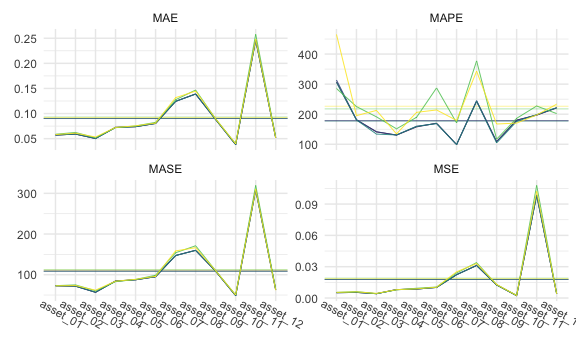

``` r
cv_large_5 %>% 
  gg_loss(
    y_large_test, 
    mean_line = TRUE, 
    line_param = list(size = .3),
    mean_param = list(alpha = .5, size = .3), 
    viridis = TRUE, 
    show.legend = FALSE
  ) +
  theme_minimal() +
  theme(
    axis.text.x = element_text(angle = -30, vjust = -1),
    legend.title = element_text(size = 8),
    legend.text = element_text(size = 7),
    legend.key.size = unit(.3, "cm")
  )
```

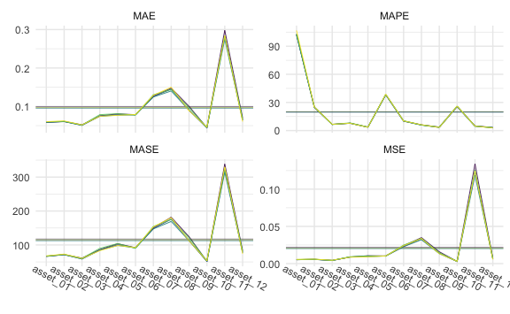

``` r
cv_large_20 %>% 
  gg_loss(
    y_large_test, 
    mean_line = TRUE, 
    line_param = list(size = .3),
    mean_param = list(alpha = .5, size = .3), 
    viridis = TRUE, 
    show.legend = FALSE
  ) +
  theme_minimal() +
  theme(
    axis.text.x = element_text(angle = -30, vjust = -1),
    legend.title = element_text(size = 8),
    legend.text = element_text(size = 7),
    legend.key.size = unit(.3, "cm")
  )
```

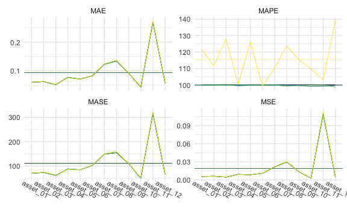

Tables

1-step:


    \begin{longtable}[t]{lllllll}
    \caption{\label{tab:largeone}LARGE Simulation - 1-step ahead Rolling Window Forecasting Loss}\\
    \toprule
    \multicolumn{1}{c}{ } & \multicolumn{1}{c}{ } & \multicolumn{2}{c}{Frequentist} & \multicolumn{1}{c}{BVAR} & \multicolumn{2}{c}{BVHAR} \\
    \cmidrule(l{3pt}r{3pt}){3-4} \cmidrule(l{3pt}r{3pt}){5-5} \cmidrule(l{3pt}r{3pt}){6-7}
     &  & VAR & VHAR & Minnesota & VAR-type & VHAR-type\\
    \midrule
    \endfirsthead
    \caption[]{LARGE Simulation - 1-step ahead Rolling Window Forecasting Loss \textit{(continued)}}\\
    \toprule
     &  & VAR & VHAR & Minnesota & VAR-type & VHAR-type\\
    \midrule
    \endhead

    \endfoot
    \bottomrule
    \endlastfoot
     & asset01 & \num{0.000286} & \num{0.000291} & \num{0.000272} & \textcolor{red}{\num{0.000272}} & \num{0.000272}\\
    \cmidrule{2-7}\nopagebreak
     & asset02 & \num{0.000419} & \num{0.000403} & \num{0.000361} & \textcolor{red}{\num{0.000361}} & \num{0.000361}\\
    \cmidrule{2-7}\nopagebreak
     & asset03 & \num{0.000244} & \num{0.000258} & \num{0.00024} & \num{0.00024} & \textcolor{red}{\num{0.000239}}\\
    \cmidrule{2-7}\nopagebreak
     & asset04 & \textcolor{red}{\num{0.000436}} & \num{0.000449} & \num{0.000466} & \num{0.000466} & \num{0.000464}\\
    \cmidrule{2-7}\nopagebreak
     & asset05 & \num{0.00082} & \num{0.000781} & \num{0.000761} & \num{0.000761} & \textcolor{red}{\num{0.000761}}\\
    \cmidrule{2-7}\nopagebreak
     & asset06 & \num{0.000525} & \num{0.00052} & \num{0.000495} & \num{0.000495} & \textcolor{red}{\num{0.000495}}\\
    \cmidrule{2-7}\nopagebreak
     & asset07 & \num{0.000714} & \num{0.000749} & \num{0.000669} & \num{0.000669} & \textcolor{red}{\num{0.000669}}\\
    \cmidrule{2-7}\nopagebreak
     & asset08 & \num{0.00238} & \num{0.00229} & \num{0.00215} & \num{0.00215} & \textcolor{red}{\num{0.00214}}\\
    \cmidrule{2-7}\nopagebreak
     & asset09 & \num{0.00377} & \num{0.00375} & \num{0.00368} & \num{0.00368} & \textcolor{red}{\num{0.00367}}\\
    \cmidrule{2-7}\nopagebreak
     & asset10 & \num{0.000925} & \num{0.000937} & \num{0.000872} & \textcolor{red}{\num{0.000871}} & \num{0.000872}\\
    \cmidrule{2-7}\nopagebreak
     & asset11 & \num{0.0041} & \num{0.0038} & \num{0.00365} & \num{0.00365} & \textcolor{red}{\num{0.00362}}\\
    \cmidrule{2-7}\nopagebreak
     & asset12 & \num{0.00515} & \textcolor{red}{\num{0.00482}} & \num{0.00488} & \num{0.00487} & \num{0.00488}\\
    \cmidrule{2-7}\nopagebreak
    \multirow{-13}{*}{\raggedright\arraybackslash MSE} & \cellcolor{gray}{Average} & \num{0.00165} & \num{0.00159} & \num{0.00154} & \num{0.00154} & \textcolor{red}{\num{0.00154}}\\
    \cmidrule{1-7}\pagebreak[0]
     & asset01 & \num{0.0137} & \num{0.0138} & \num{0.0133} & \textcolor{red}{\num{0.0133}} & \num{0.0133}\\
    \cmidrule{2-7}\nopagebreak
     & asset02 & \num{0.016} & \num{0.0157} & \textcolor{red}{\num{0.0152}} & \num{0.0152} & \num{0.0152}\\
    \cmidrule{2-7}\nopagebreak
     & asset03 & \num{0.0124} & \num{0.0128} & \num{0.012} & \textcolor{red}{\num{0.012}} & \num{0.0121}\\
    \cmidrule{2-7}\nopagebreak
     & asset04 & \textcolor{red}{\num{0.0172}} & \num{0.0172} & \num{0.0175} & \num{0.0175} & \num{0.0174}\\
    \cmidrule{2-7}\nopagebreak
     & asset05 & \num{0.0223} & \num{0.0224} & \num{0.0221} & \num{0.0221} & \textcolor{red}{\num{0.0221}}\\
    \cmidrule{2-7}\nopagebreak
     & asset06 & \num{0.0184} & \num{0.0183} & \num{0.018} & \num{0.018} & \textcolor{red}{\num{0.018}}\\
    \cmidrule{2-7}\nopagebreak
     & asset07 & \num{0.0221} & \num{0.0229} & \textcolor{red}{\num{0.0215}} & \num{0.0215} & \num{0.0215}\\
    \cmidrule{2-7}\nopagebreak
     & asset08 & \num{0.0393} & \num{0.0386} & \num{0.037} & \num{0.037} & \textcolor{red}{\num{0.0369}}\\
    \cmidrule{2-7}\nopagebreak
     & asset09 & \num{0.0491} & \num{0.0493} & \num{0.0481} & \num{0.0481} & \textcolor{red}{\num{0.048}}\\
    \cmidrule{2-7}\nopagebreak
     & asset10 & \num{0.0239} & \num{0.0244} & \num{0.0236} & \num{0.0237} & \textcolor{red}{\num{0.0236}}\\
    \cmidrule{2-7}\nopagebreak
     & asset11 & \num{0.0493} & \num{0.0489} & \num{0.0481} & \num{0.048} & \textcolor{red}{\num{0.0476}}\\
    \cmidrule{2-7}\nopagebreak
     & asset12 & \num{0.0585} & \textcolor{red}{\num{0.0561}} & \num{0.0565} & \num{0.0565} & \num{0.0565}\\
    \cmidrule{2-7}\nopagebreak
    \multirow{-13}{*}{\raggedright\arraybackslash MAE} & \cellcolor{gray}{Average} & \num{0.0285} & \num{0.0284} & \num{0.0277} & \num{0.0277} & \textcolor{red}{\num{0.0277}}\\
    \cmidrule{1-7}\pagebreak[0]
     & asset01 & \num{200.742} & \num{175.616} & \textcolor{red}{\num{128.089}} & \num{129.648} & \num{129.773}\\
    \cmidrule{2-7}\nopagebreak
     & asset02 & \num{439.83} & \num{378.268} & \num{209.821} & \num{209.191} & \textcolor{red}{\num{206.831}}\\
    \cmidrule{2-7}\nopagebreak
     & asset03 & \num{1162.549} & \num{962.334} & \num{278.029} & \num{281.708} & \textcolor{red}{\num{143.592}}\\
    \cmidrule{2-7}\nopagebreak
     & asset04 & \num{214.246} & \num{222.21} & \num{139.657} & \num{139.812} & \textcolor{red}{\num{133.87}}\\
    \cmidrule{2-7}\nopagebreak
     & asset05 & \num{137.648} & \num{136.406} & \textcolor{red}{\num{105.354}} & \num{105.804} & \num{105.491}\\
    \cmidrule{2-7}\nopagebreak
     & asset06 & \num{205.081} & \num{213.714} & \num{126.073} & \num{124.362} & \textcolor{red}{\num{123.816}}\\
    \cmidrule{2-7}\nopagebreak
     & asset07 & \num{2416.412} & \num{1902.12} & \num{402.229} & \textcolor{red}{\num{393.625}} & \num{394.159}\\
    \cmidrule{2-7}\nopagebreak
     & asset08 & \num{172.873} & \num{142.431} & \textcolor{red}{\num{107.554}} & \num{108.343} & \num{111.834}\\
    \cmidrule{2-7}\nopagebreak
     & asset09 & \num{154.649} & \num{278.818} & \num{148.545} & \num{151.259} & \textcolor{red}{\num{146.086}}\\
    \cmidrule{2-7}\nopagebreak
     & asset10 & \num{138.185} & \num{139.941} & \num{99.981} & \textcolor{red}{\num{99.563}} & \num{105.527}\\
    \cmidrule{2-7}\nopagebreak
     & asset11 & \num{185.115} & \num{255.285} & \textcolor{red}{\num{152.75}} & \num{155.714} & \num{188.24}\\
    \cmidrule{2-7}\nopagebreak
     & asset12 & \num{118.207} & \num{115.133} & \textcolor{red}{\num{96.844}} & \num{96.942} & \num{97.362}\\
    \cmidrule{2-7}\nopagebreak
    \multirow{-13}{*}{\raggedright\arraybackslash MAPE} & \cellcolor{gray}{Average} & \num{462.128} & \num{410.19} & \num{166.244} & \num{166.331} & \textcolor{red}{\num{157.215}}\\
    \cmidrule{1-7}\pagebreak[0]
     & asset01 & \num{52.616} & \num{53.716} & \num{51.644} & \num{51.63} & \textcolor{red}{\num{51.621}}\\
    \cmidrule{2-7}\nopagebreak
     & asset02 & \num{59.227} & \num{58.174} & \textcolor{red}{\num{56.5}} & \num{56.503} & \num{56.512}\\
    \cmidrule{2-7}\nopagebreak
     & asset03 & \num{43.079} & \num{43.914} & \num{41.053} & \textcolor{red}{\num{41.042}} & \num{41.39}\\
    \cmidrule{2-7}\nopagebreak
     & asset04 & \num{59.371} & \num{59.375} & \num{59.426} & \num{59.426} & \textcolor{red}{\num{59.176}}\\
    \cmidrule{2-7}\nopagebreak
     & asset05 & \num{81.815} & \textcolor{red}{\num{79.408}} & \num{80.396} & \num{80.441} & \num{80.371}\\
    \cmidrule{2-7}\nopagebreak
     & asset06 & \num{64.31} & \num{63.873} & \num{62.282} & \num{62.228} & \textcolor{red}{\num{62.216}}\\
    \cmidrule{2-7}\nopagebreak
     & asset07 & \num{80.597} & \num{83.577} & \num{77.157} & \num{77.162} & \textcolor{red}{\num{77.145}}\\
    \cmidrule{2-7}\nopagebreak
     & asset08 & \num{142.643} & \num{135.898} & \num{133.71} & \num{133.697} & \textcolor{red}{\num{133.245}}\\
    \cmidrule{2-7}\nopagebreak
     & asset09 & \num{176.072} & \num{173.704} & \num{170.92} & \num{170.877} & \textcolor{red}{\num{170.81}}\\
    \cmidrule{2-7}\nopagebreak
     & asset10 & \num{90.424} & \num{89.615} & \num{88.334} & \num{88.407} & \textcolor{red}{\num{88.236}}\\
    \cmidrule{2-7}\nopagebreak
     & asset11 & \num{181.682} & \num{176.392} & \num{176.92} & \num{176.856} & \textcolor{red}{\num{175.134}}\\
    \cmidrule{2-7}\nopagebreak
     & asset12 & \num{212.972} & \num{203.889} & \num{202.724} & \num{202.5} & \textcolor{red}{\num{202.473}}\\
    \cmidrule{2-7}\nopagebreak
    \multirow{-13}{*}{\raggedright\arraybackslash MASE} & \cellcolor{gray}{Average} & \num{103.734} & \num{101.795} & \num{100.089} & \num{100.064} & \textcolor{red}{\num{99.861}}\\*
    \end{longtable}

5-step:


    \begin{longtable}[t]{lllllll}
    \caption{\label{tab:largefive}LARGE Simulation - 5-step ahead Rolling Window Forecasting Loss}\\
    \toprule
    \multicolumn{1}{c}{ } & \multicolumn{1}{c}{ } & \multicolumn{2}{c}{Frequentist} & \multicolumn{1}{c}{BVAR} & \multicolumn{2}{c}{BVHAR} \\
    \cmidrule(l{3pt}r{3pt}){3-4} \cmidrule(l{3pt}r{3pt}){5-5} \cmidrule(l{3pt}r{3pt}){6-7}
     &  & VAR & VHAR & Minnesota & VAR-type & VHAR-type\\
    \midrule
    \endfirsthead
    \caption[]{LARGE Simulation - 5-step ahead Rolling Window Forecasting Loss \textit{(continued)}}\\
    \toprule
     &  & VAR & VHAR & Minnesota & VAR-type & VHAR-type\\
    \midrule
    \endhead

    \endfoot
    \bottomrule
    \endlastfoot
     & asset01 & \num{0.000283} & \num{0.000298} & \num{0.000279} & \textcolor{red}{\num{0.000279}} & \num{0.00028}\\
    \cmidrule{2-7}\nopagebreak
     & asset02 & \num{0.000377} & \num{0.000387} & \num{0.000366} & \textcolor{red}{\num{0.000366}} & \num{0.000366}\\
    \cmidrule{2-7}\nopagebreak
     & asset03 & \textcolor{red}{\num{0.000232}} & \num{0.000248} & \num{0.000233} & \num{0.000233} & \num{0.000232}\\
    \cmidrule{2-7}\nopagebreak
     & asset04 & \num{0.000485} & \textcolor{red}{\num{0.000473}} & \num{0.000483} & \num{0.000483} & \num{0.000481}\\
    \cmidrule{2-7}\nopagebreak
     & asset05 & \num{0.000766} & \textcolor{red}{\num{0.00076}} & \num{0.000774} & \num{0.000774} & \num{0.000774}\\
    \cmidrule{2-7}\nopagebreak
     & asset06 & \num{0.000497} & \num{0.000508} & \num{0.000495} & \textcolor{red}{\num{0.000495}} & \num{0.000495}\\
    \cmidrule{2-7}\nopagebreak
     & asset07 & \num{0.000689} & \num{7e-04} & \num{0.000664} & \textcolor{red}{\num{0.000664}} & \num{0.000664}\\
    \cmidrule{2-7}\nopagebreak
     & asset08 & \num{0.00216} & \num{0.00217} & \num{0.00213} & \num{0.00213} & \textcolor{red}{\num{0.00212}}\\
    \cmidrule{2-7}\nopagebreak
     & asset09 & \num{0.00388} & \textcolor{red}{\num{0.00385}} & \num{0.00388} & \num{0.00388} & \num{0.00386}\\
    \cmidrule{2-7}\nopagebreak
     & asset10 & \num{0.00087} & \num{0.000903} & \num{0.000856} & \textcolor{red}{\num{0.000856}} & \num{0.000862}\\
    \cmidrule{2-7}\nopagebreak
     & asset11 & \num{0.00355} & \num{0.00352} & \num{0.00347} & \num{0.00347} & \textcolor{red}{\num{0.00345}}\\
    \cmidrule{2-7}\nopagebreak
     & asset12 & \num{0.00494} & \textcolor{red}{\num{0.00483}} & \num{0.00485} & \num{0.00485} & \num{0.00485}\\
    \cmidrule{2-7}\nopagebreak
    \multirow{-13}{*}{\raggedright\arraybackslash MSE} & \cellcolor{gray}{Average} & \num{0.00156} & \num{0.00155} & \num{0.00154} & \num{0.00154} & \textcolor{red}{\num{0.00154}}\\
    \cmidrule{1-7}\pagebreak[0]
     & asset01 & \num{0.0137} & \num{0.0139} & \textcolor{red}{\num{0.0135}} & \num{0.0135} & \num{0.0135}\\
    \cmidrule{2-7}\nopagebreak
     & asset02 & \num{0.0155} & \num{0.0159} & \num{0.0155} & \textcolor{red}{\num{0.0155}} & \num{0.0155}\\
    \cmidrule{2-7}\nopagebreak
     & asset03 & \num{0.0119} & \num{0.0123} & \num{0.0119} & \num{0.0119} & \textcolor{red}{\num{0.0119}}\\
    \cmidrule{2-7}\nopagebreak
     & asset04 & \num{0.0179} & \textcolor{red}{\num{0.0175}} & \num{0.0178} & \num{0.0178} & \num{0.0177}\\
    \cmidrule{2-7}\nopagebreak
     & asset05 & \textcolor{red}{\num{0.0216}} & \num{0.0219} & \num{0.022} & \num{0.022} & \num{0.022}\\
    \cmidrule{2-7}\nopagebreak
     & asset06 & \textcolor{red}{\num{0.0176}} & \num{0.018} & \num{0.0177} & \num{0.0177} & \num{0.0177}\\
    \cmidrule{2-7}\nopagebreak
     & asset07 & \num{0.0217} & \num{0.0222} & \num{0.0214} & \textcolor{red}{\num{0.0214}} & \num{0.0214}\\
    \cmidrule{2-7}\nopagebreak
     & asset08 & \num{0.037} & \num{0.0378} & \num{0.0369} & \num{0.0369} & \textcolor{red}{\num{0.0368}}\\
    \cmidrule{2-7}\nopagebreak
     & asset09 & \num{0.0496} & \textcolor{red}{\num{0.0483}} & \num{0.049} & \num{0.049} & \num{0.049}\\
    \cmidrule{2-7}\nopagebreak
     & asset10 & \num{0.0237} & \num{0.0243} & \num{0.0237} & \num{0.0237} & \textcolor{red}{\num{0.0237}}\\
    \cmidrule{2-7}\nopagebreak
     & asset11 & \num{0.0471} & \num{0.0478} & \num{0.0471} & \num{0.0471} & \textcolor{red}{\num{0.0468}}\\
    \cmidrule{2-7}\nopagebreak
     & asset12 & \num{0.0571} & \textcolor{red}{\num{0.0567}} & \num{0.0568} & \num{0.0568} & \num{0.0568}\\
    \cmidrule{2-7}\nopagebreak
    \multirow{-13}{*}{\raggedright\arraybackslash MAE} & \cellcolor{gray}{Average} & \num{0.0279} & \num{0.028} & \num{0.0278} & \num{0.0278} & \textcolor{red}{\num{0.0277}}\\
    \cmidrule{1-7}\pagebreak[0]
     & asset01 & \num{126.654} & \num{145.931} & \num{99.999} & \textcolor{red}{\num{99.999}} & \num{101.863}\\
    \cmidrule{2-7}\nopagebreak
     & asset02 & \num{224.897} & \num{235.59} & \num{100.006} & \textcolor{red}{\num{100.006}} & \num{102.536}\\
    \cmidrule{2-7}\nopagebreak
     & asset03 & \num{183.146} & \num{581.547} & \textcolor{red}{\num{100.004}} & \num{100.005} & \num{145.487}\\
    \cmidrule{2-7}\nopagebreak
     & asset04 & \num{150.62} & \num{137.445} & \num{99.997} & \num{99.997} & \textcolor{red}{\num{97.752}}\\
    \cmidrule{2-7}\nopagebreak
     & asset05 & \textcolor{red}{\num{99.336}} & \num{115.991} & \num{100} & \num{100} & \num{99.868}\\
    \cmidrule{2-7}\nopagebreak
     & asset06 & \num{130.815} & \num{154.698} & \num{100.002} & \textcolor{red}{\num{100.001}} & \num{100.666}\\
    \cmidrule{2-7}\nopagebreak
     & asset07 & \num{175.097} & \num{632.064} & \num{100.001} & \num{100.001} & \textcolor{red}{\num{99.358}}\\
    \cmidrule{2-7}\nopagebreak
     & asset08 & \num{123.124} & \num{136.324} & \textcolor{red}{\num{100.003}} & \num{100.004} & \num{102.243}\\
    \cmidrule{2-7}\nopagebreak
     & asset09 & \num{138.059} & \num{127.789} & \textcolor{red}{\num{100.001}} & \num{100.001} & \num{103.327}\\
    \cmidrule{2-7}\nopagebreak
     & asset10 & \num{118.722} & \num{108.359} & \num{100} & \num{100} & \textcolor{red}{\num{99.318}}\\
    \cmidrule{2-7}\nopagebreak
     & asset11 & \num{123.119} & \num{180.301} & \textcolor{red}{\num{100.001}} & \num{100.002} & \num{121.082}\\
    \cmidrule{2-7}\nopagebreak
     & asset12 & \num{104.346} & \num{130.492} & \num{99.999} & \num{99.999} & \textcolor{red}{\num{99.684}}\\
    \cmidrule{2-7}\nopagebreak
    \multirow{-13}{*}{\raggedright\arraybackslash MAPE} & \cellcolor{gray}{Average} & \num{141.495} & \num{223.878} & \textcolor{red}{\num{100.001}} & \num{100.001} & \num{106.099}\\
    \cmidrule{1-7}\pagebreak[0]
     & asset01 & \num{46.112} & \num{47.179} & \num{45.775} & \num{45.775} & \textcolor{red}{\num{45.768}}\\
    \cmidrule{2-7}\nopagebreak
     & asset02 & \num{56.068} & \num{56.589} & \num{55.489} & \textcolor{red}{\num{55.489}} & \num{55.502}\\
    \cmidrule{2-7}\nopagebreak
     & asset03 & \num{41.977} & \num{43.463} & \num{41.76} & \textcolor{red}{\num{41.76}} & \num{41.763}\\
    \cmidrule{2-7}\nopagebreak
     & asset04 & \num{64.552} & \textcolor{red}{\num{62.638}} & \num{63.344} & \num{63.344} & \num{63.206}\\
    \cmidrule{2-7}\nopagebreak
     & asset05 & \textcolor{red}{\num{77.838}} & \num{79.099} & \num{79.106} & \num{79.106} & \num{79.081}\\
    \cmidrule{2-7}\nopagebreak
     & asset06 & \textcolor{red}{\num{62.168}} & \num{63.607} & \num{62.697} & \num{62.697} & \num{62.704}\\
    \cmidrule{2-7}\nopagebreak
     & asset07 & \textcolor{red}{\num{79.268}} & \num{81.711} & \num{79.536} & \num{79.536} & \num{79.543}\\
    \cmidrule{2-7}\nopagebreak
     & asset08 & \textcolor{red}{\num{130.855}} & \num{132.254} & \num{132.093} & \num{132.093} & \num{131.939}\\
    \cmidrule{2-7}\nopagebreak
     & asset09 & \num{180.405} & \textcolor{red}{\num{173.682}} & \num{177.418} & \num{177.418} & \num{177.366}\\
    \cmidrule{2-7}\nopagebreak
     & asset10 & \num{86.095} & \num{87.332} & \num{85.816} & \num{85.816} & \textcolor{red}{\num{85.775}}\\
    \cmidrule{2-7}\nopagebreak
     & asset11 & \num{168.116} & \num{170.847} & \num{168.444} & \num{168.444} & \textcolor{red}{\num{167.124}}\\
    \cmidrule{2-7}\nopagebreak
     & asset12 & \num{211.945} & \textcolor{red}{\num{210.021}} & \num{210.386} & \num{210.386} & \num{210.343}\\
    \cmidrule{2-7}\nopagebreak
    \multirow{-13}{*}{\raggedright\arraybackslash MASE} & \cellcolor{gray}{Average} & \num{100.45} & \num{100.702} & \num{100.155} & \num{100.155} & \textcolor{red}{\num{100.01}}\\*
    \end{longtable}

20-step:


    \begin{longtable}[t]{lllllll}
    \caption{\label{tab:largetwenty}LARGE Simulation - 20-step ahead Rolling Window Forecasting Loss}\\
    \toprule
    \multicolumn{1}{c}{ } & \multicolumn{1}{c}{ } & \multicolumn{2}{c}{Frequentist} & \multicolumn{1}{c}{BVAR} & \multicolumn{2}{c}{BVHAR} \\
    \cmidrule(l{3pt}r{3pt}){3-4} \cmidrule(l{3pt}r{3pt}){5-5} \cmidrule(l{3pt}r{3pt}){6-7}
     &  & VAR & VHAR & Minnesota & VAR-type & VHAR-type\\
    \midrule
    \endfirsthead
    \caption[]{LARGE Simulation - 20-step ahead Rolling Window Forecasting Loss \textit{(continued)}}\\
    \toprule
     &  & VAR & VHAR & Minnesota & VAR-type & VHAR-type\\
    \midrule
    \endhead

    \endfoot
    \bottomrule
    \endlastfoot
     & asset01 & \num{0.000289} & \textcolor{red}{\num{0.000286}} & \num{0.000289} & \num{0.000289} & \num{0.000289}\\
    \cmidrule{2-7}\nopagebreak
     & asset02 & \num{0.000386} & \num{0.000394} & \num{0.000386} & \num{0.000386} & \textcolor{red}{\num{0.000386}}\\
    \cmidrule{2-7}\nopagebreak
     & asset03 & \num{0.000243} & \num{0.000251} & \textcolor{red}{\num{0.000243}} & \num{0.000243} & \num{0.000243}\\
    \cmidrule{2-7}\nopagebreak
     & asset04 & \num{0.000474} & \textcolor{red}{\num{0.000466}} & \num{0.000474} & \num{0.000474} & \num{0.000473}\\
    \cmidrule{2-7}\nopagebreak
     & asset05 & \num{0.000742} & \textcolor{red}{\num{0.00074}} & \num{0.000742} & \num{0.000742} & \num{0.000742}\\
    \cmidrule{2-7}\nopagebreak
     & asset06 & \textcolor{red}{\num{0.000525}} & \num{0.000533} & \num{0.000525} & \num{0.000525} & \num{0.000525}\\
    \cmidrule{2-7}\nopagebreak
     & asset07 & \num{0.000657} & \num{0.000675} & \num{0.000657} & \num{0.000657} & \textcolor{red}{\num{0.000657}}\\
    \cmidrule{2-7}\nopagebreak
     & asset08 & \num{0.00194} & \num{0.00198} & \num{0.00194} & \num{0.00194} & \textcolor{red}{\num{0.00193}}\\
    \cmidrule{2-7}\nopagebreak
     & asset09 & \num{0.00406} & \num{0.00408} & \num{0.00406} & \num{0.00406} & \textcolor{red}{\num{0.00404}}\\
    \cmidrule{2-7}\nopagebreak
     & asset10 & \num{0.00084} & \num{0.000859} & \num{0.00084} & \num{0.00084} & \textcolor{red}{\num{0.000839}}\\
    \cmidrule{2-7}\nopagebreak
     & asset11 & \num{0.00318} & \num{0.00323} & \num{0.00318} & \num{0.00318} & \textcolor{red}{\num{0.00317}}\\
    \cmidrule{2-7}\nopagebreak
     & asset12 & \textcolor{red}{\num{0.00448}} & \num{0.00459} & \num{0.00448} & \num{0.00448} & \num{0.00448}\\
    \cmidrule{2-7}\nopagebreak
    \multirow{-13}{*}{\raggedright\arraybackslash MSE} & \cellcolor{gray}{Average} & \num{0.00148} & \num{0.00151} & \num{0.00148} & \num{0.00148} & \textcolor{red}{\num{0.00148}}\\
    \cmidrule{1-7}\pagebreak[0]
     & asset01 & \num{0.0138} & \textcolor{red}{\num{0.0137}} & \num{0.0138} & \num{0.0138} & \num{0.0138}\\
    \cmidrule{2-7}\nopagebreak
     & asset02 & \num{0.0158} & \num{0.016} & \num{0.0158} & \num{0.0158} & \textcolor{red}{\num{0.0158}}\\
    \cmidrule{2-7}\nopagebreak
     & asset03 & \num{0.0122} & \num{0.0124} & \textcolor{red}{\num{0.0122}} & \num{0.0122} & \num{0.0122}\\
    \cmidrule{2-7}\nopagebreak
     & asset04 & \num{0.0176} & \textcolor{red}{\num{0.0174}} & \num{0.0176} & \num{0.0176} & \num{0.0175}\\
    \cmidrule{2-7}\nopagebreak
     & asset05 & \num{0.0215} & \num{0.0217} & \num{0.0215} & \num{0.0215} & \textcolor{red}{\num{0.0215}}\\
    \cmidrule{2-7}\nopagebreak
     & asset06 & \num{0.0187} & \num{0.0188} & \num{0.0187} & \num{0.0187} & \textcolor{red}{\num{0.0187}}\\
    \cmidrule{2-7}\nopagebreak
     & asset07 & \num{0.0215} & \num{0.0219} & \num{0.0215} & \num{0.0215} & \textcolor{red}{\num{0.0215}}\\
    \cmidrule{2-7}\nopagebreak
     & asset08 & \num{0.0345} & \num{0.0352} & \num{0.0345} & \num{0.0345} & \textcolor{red}{\num{0.0344}}\\
    \cmidrule{2-7}\nopagebreak
     & asset09 & \num{0.0499} & \num{0.0501} & \num{0.0499} & \num{0.0499} & \textcolor{red}{\num{0.0498}}\\
    \cmidrule{2-7}\nopagebreak
     & asset10 & \num{0.0234} & \num{0.0239} & \num{0.0234} & \num{0.0234} & \textcolor{red}{\num{0.0234}}\\
    \cmidrule{2-7}\nopagebreak
     & asset11 & \num{0.0453} & \num{0.0457} & \num{0.0453} & \num{0.0453} & \textcolor{red}{\num{0.0452}}\\
    \cmidrule{2-7}\nopagebreak
     & asset12 & \textcolor{red}{\num{0.0546}} & \num{0.0554} & \num{0.0546} & \num{0.0546} & \num{0.0546}\\
    \cmidrule{2-7}\nopagebreak
    \multirow{-13}{*}{\raggedright\arraybackslash MAE} & \cellcolor{gray}{Average} & \num{0.0274} & \num{0.0277} & \num{0.0274} & \num{0.0274} & \textcolor{red}{\num{0.0274}}\\
    \cmidrule{1-7}\pagebreak[0]
     & asset01 & \num{100.027} & \num{120.667} & \textcolor{red}{\num{100}} & \num{100} & \num{101.627}\\
    \cmidrule{2-7}\nopagebreak
     & asset02 & \num{100.145} & \num{176.954} & \textcolor{red}{\num{100}} & \num{100} & \num{100.132}\\
    \cmidrule{2-7}\nopagebreak
     & asset03 & \num{101.732} & \num{458.921} & \num{100} & \num{100} & \textcolor{red}{\num{99.547}}\\
    \cmidrule{2-7}\nopagebreak
     & asset04 & \num{100.03} & \num{132.651} & \num{100} & \num{100} & \textcolor{red}{\num{99.377}}\\
    \cmidrule{2-7}\nopagebreak
     & asset05 & \num{100.063} & \num{102.772} & \num{100} & \textcolor{red}{\num{100}} & \num{100.005}\\
    \cmidrule{2-7}\nopagebreak
     & asset06 & \textcolor{red}{\num{99.992}} & \num{103.348} & \num{100} & \num{100} & \num{100.098}\\
    \cmidrule{2-7}\nopagebreak
     & asset07 & \num{100.99} & \num{375.742} & \num{100} & \num{100} & \textcolor{red}{\num{98.79}}\\
    \cmidrule{2-7}\nopagebreak
     & asset08 & \num{100.002} & \num{117.236} & \num{100} & \num{100} & \textcolor{red}{\num{98.907}}\\
    \cmidrule{2-7}\nopagebreak
     & asset09 & \num{100.189} & \num{107.833} & \num{100} & \num{100} & \textcolor{red}{\num{99.519}}\\
    \cmidrule{2-7}\nopagebreak
     & asset10 & \num{99.687} & \num{130.568} & \num{100} & \num{100} & \textcolor{red}{\num{99.377}}\\
    \cmidrule{2-7}\nopagebreak
     & asset11 & \num{100.004} & \num{117.08} & \textcolor{red}{\num{100}} & \num{100} & \num{101.15}\\
    \cmidrule{2-7}\nopagebreak
     & asset12 & \textcolor{red}{\num{99.892}} & \num{103.658} & \num{100} & \num{100} & \num{99.959}\\
    \cmidrule{2-7}\nopagebreak
    \multirow{-13}{*}{\raggedright\arraybackslash MAPE} & \cellcolor{gray}{Average} & \num{100.23} & \num{170.619} & \num{100} & \num{100} & \textcolor{red}{\num{99.874}}\\
    \cmidrule{1-7}\pagebreak[0]
     & asset01 & \num{50.639} & \textcolor{red}{\num{50.074}} & \num{50.64} & \num{50.64} & \num{50.667}\\
    \cmidrule{2-7}\nopagebreak
     & asset02 & \num{53.715} & \num{54.445} & \num{53.716} & \num{53.716} & \textcolor{red}{\num{53.712}}\\
    \cmidrule{2-7}\nopagebreak
     & asset03 & \num{45.093} & \num{45.769} & \textcolor{red}{\num{45.09}} & \num{45.09} & \num{45.093}\\
    \cmidrule{2-7}\nopagebreak
     & asset04 & \num{62.393} & \textcolor{red}{\num{62.033}} & \num{62.395} & \num{62.395} & \num{62.338}\\
    \cmidrule{2-7}\nopagebreak
     & asset05 & \num{82.285} & \num{82.966} & \num{82.278} & \num{82.278} & \textcolor{red}{\num{82.277}}\\
    \cmidrule{2-7}\nopagebreak
     & asset06 & \num{68.256} & \num{68.508} & \num{68.261} & \num{68.261} & \textcolor{red}{\num{68.254}}\\
    \cmidrule{2-7}\nopagebreak
     & asset07 & \num{75.054} & \num{75.904} & \num{75.052} & \num{75.052} & \textcolor{red}{\num{75.045}}\\
    \cmidrule{2-7}\nopagebreak
     & asset08 & \num{117.611} & \num{120.119} & \num{117.614} & \num{117.614} & \textcolor{red}{\num{117.415}}\\
    \cmidrule{2-7}\nopagebreak
     & asset09 & \num{179.905} & \num{181.014} & \num{179.898} & \num{179.898} & \textcolor{red}{\num{179.674}}\\
    \cmidrule{2-7}\nopagebreak
     & asset10 & \num{82.216} & \num{84.032} & \num{82.232} & \num{82.232} & \textcolor{red}{\num{82.165}}\\
    \cmidrule{2-7}\nopagebreak
     & asset11 & \num{156.127} & \num{156.785} & \num{156.166} & \num{156.166} & \textcolor{red}{\num{155.614}}\\
    \cmidrule{2-7}\nopagebreak
     & asset12 & \textcolor{red}{\num{195.375}} & \num{198.773} & \num{195.408} & \num{195.408} & \num{195.382}\\
    \cmidrule{2-7}\nopagebreak
    \multirow{-13}{*}{\raggedright\arraybackslash MASE} & \cellcolor{gray}{Average} & \num{97.389} & \num{98.368} & \num{97.396} & \num{97.396} & \textcolor{red}{\num{97.303}}\\*
    \end{longtable}

### Average

SMALL

1-step:

    \begin{table}

    \caption{\label{tab:smallonemean}SMALL Simulation - 1-step ahead Rolling Window Forecasting Average Loss}
    \centering
    \begin{tabular}[t]{llllll}
    \toprule
      & VAR & VHAR & BVAR-Minnesota & BVHAR-MN-VAR & BVHAR-MN-VHAR\\
    \midrule
    MSE & \num{0.00556} & \num{0.00546} & \num{0.00541} & \textcolor{red}{\num{0.00539}} & \num{0.0054}\\
    MAE & \num{0.05} & \num{0.0492} & \num{0.0487} & \textcolor{red}{\num{0.0487}} & \num{0.0487}\\
    MAPE & \textcolor{red}{\num{193.277}} & \num{250.687} & \num{206.405} & \num{230.101} & \num{229.596}\\
    MASE & \num{112.201} & \num{110.124} & \textcolor{red}{\num{108.991}} & \num{109.077} & \num{109.214}\\
    \bottomrule
    \end{tabular}
    \end{table}

5-step:

    \begin{table}

    \caption{\label{tab:smallfivemean}SMALL Simulation - 5-step ahead Rolling Window Forecasting Average Loss}
    \centering
    \begin{tabular}[t]{llllll}
    \toprule
      & VAR & VHAR & BVAR-Minnesota & BVHAR-MN-VAR & BVHAR-MN-VHAR\\
    \midrule
    MSE & \num{0.0082} & \num{0.00824} & \num{0.00798} & \num{0.00799} & \textcolor{red}{\num{0.00796}}\\
    MAE & \num{0.0596} & \num{0.0601} & \num{0.0591} & \num{0.0591} & \textcolor{red}{\num{0.059}}\\
    MAPE & \num{151.554} & \num{157.436} & \num{105.966} & \num{104.696} & \textcolor{red}{\num{103.836}}\\
    MASE & \num{133.764} & \num{132.651} & \num{131.896} & \num{132.043} & \textcolor{red}{\num{131.884}}\\
    \bottomrule
    \end{tabular}
    \end{table}

20-step:

    \begin{table}

    \caption{\label{tab:smalltwentyemean}SMALL Simulation - 20-step ahead Rolling Window Forecasting Average Loss}
    \centering
    \begin{tabular}[t]{llllll}
    \toprule
      & VAR & VHAR & BVAR-Minnesota & BVHAR-MN-VAR & BVHAR-MN-VHAR\\
    \midrule
    MSE & \num{0.00765} & \num{0.00769} & \textcolor{red}{\num{0.00765}} & \num{0.00767} & \num{0.00766}\\
    MAE & \num{0.0575} & \num{0.0578} & \textcolor{red}{\num{0.0575}} & \num{0.0577} & \num{0.0576}\\
    MAPE & \num{99.985} & \num{107.199} & \num{100} & \num{99.8} & \textcolor{red}{\num{99.759}}\\
    MASE & \num{128.173} & \num{128.532} & \textcolor{red}{\num{128.168}} & \num{128.419} & \num{128.365}\\
    \bottomrule
    \end{tabular}
    \end{table}

MEDIUM

1-step:

    \begin{table}

    \caption{\label{tab:medonemean}MEDIUM Simulation - 1-step ahead Rolling Window Forecasting Average Loss}
    \centering
    \begin{tabular}[t]{llllll}
    \toprule
      & VAR & VHAR & BVAR-Minnesota & BVHAR-MN-VAR & BVHAR-MN-VHAR\\
    \midrule
    MSE & \num{0.00155} & \num{0.00156} & \textcolor{red}{\num{0.00152}} & \num{0.00155} & \num{0.00155}\\
    MAE & \num{0.0271} & \num{0.027} & \textcolor{red}{\num{0.0267}} & \num{0.0268} & \num{0.0269}\\
    MAPE & \num{174.775} & \num{169.703} & \num{128.951} & \num{118.114} & \textcolor{red}{\num{116.122}}\\
    MASE & \num{97.657} & \num{98.123} & \textcolor{red}{\num{95.986}} & \num{96.739} & \num{96.786}\\
    \bottomrule
    \end{tabular}
    \end{table}

5-step:

    \begin{table}

    \caption{\label{tab:medfivemean}MEDIUM Simulation - 5-step ahead Rolling Window Forecasting Average Loss}
    \centering
    \begin{tabular}[t]{llllll}
    \toprule
      & VAR & VHAR & BVAR-Minnesota & BVHAR-MN-VAR & BVHAR-MN-VHAR\\
    \midrule
    MSE & \num{0.0016} & \num{0.00162} & \num{0.0016} & \num{0.0016} & \textcolor{red}{\num{0.0016}}\\
    MAE & \num{0.0274} & \num{0.0274} & \num{0.0272} & \textcolor{red}{\num{0.0272}} & \num{0.0272}\\
    MAPE & \num{126.044} & \num{132.993} & \num{101.099} & \textcolor{red}{\num{100.033}} & \num{100.699}\\
    MASE & \num{98.591} & \num{99.136} & \num{98.213} & \textcolor{red}{\num{98.177}} & \num{98.235}\\
    \bottomrule
    \end{tabular}
    \end{table}

20-step:

    \begin{table}

    \caption{\label{tab:medtwentyemean}MEDIUM Simulation - 20-step ahead Rolling Window Forecasting Average Loss}
    \centering
    \begin{tabular}[t]{llllll}
    \toprule
      & VAR & VHAR & BVAR-Minnesota & BVHAR-MN-VAR & BVHAR-MN-VHAR\\
    \midrule
    MSE & \num{0.00155} & \num{0.00156} & \textcolor{red}{\num{0.00155}} & \num{0.00155} & \num{0.00155}\\
    MAE & \num{0.0266} & \textcolor{red}{\num{0.0266}} & \num{0.0266} & \num{0.0266} & \num{0.0266}\\
    MAPE & \num{100.002} & \num{112.673} & \num{100} & \num{99.995} & \textcolor{red}{\num{99.975}}\\
    MASE & \num{94.642} & \textcolor{red}{\num{94.158}} & \num{94.642} & \num{94.641} & \num{94.66}\\
    \bottomrule
    \end{tabular}
    \end{table}

LARGE

1-step:

    \begin{table}

    \caption{\label{tab:largeonemean}LARGE Simulation - 1-step ahead Rolling Window Forecasting Average Loss}
    \centering
    \begin{tabular}[t]{llllll}
    \toprule
      & VAR & VHAR & BVAR-Minnesota & BVHAR-MN-VAR & BVHAR-MN-VHAR\\
    \midrule
    MSE & \num{0.00165} & \num{0.00159} & \num{0.00154} & \num{0.00154} & \textcolor{red}{\num{0.00154}}\\
    MAE & \num{0.0285} & \num{0.0284} & \num{0.0277} & \num{0.0277} & \textcolor{red}{\num{0.0277}}\\
    MAPE & \num{462.128} & \num{410.19} & \num{166.244} & \num{166.331} & \textcolor{red}{\num{157.215}}\\
    MASE & \num{103.734} & \num{101.795} & \num{100.089} & \num{100.064} & \textcolor{red}{\num{99.861}}\\
    \bottomrule
    \end{tabular}
    \end{table}

5-step:

    \begin{table}

    \caption{\label{tab:largefivemean}LARGE Simulation - 5-step ahead Rolling Window Forecasting Average Loss}
    \centering
    \begin{tabular}[t]{llllll}
    \toprule
      & VAR & VHAR & BVAR-Minnesota & BVHAR-MN-VAR & BVHAR-MN-VHAR\\
    \midrule
    MSE & \num{0.00156} & \num{0.00155} & \num{0.00154} & \num{0.00154} & \textcolor{red}{\num{0.00154}}\\
    MAE & \num{0.0279} & \num{0.028} & \num{0.0278} & \num{0.0278} & \textcolor{red}{\num{0.0277}}\\
    MAPE & \num{141.495} & \num{223.878} & \textcolor{red}{\num{100.001}} & \num{100.001} & \num{106.099}\\
    MASE & \num{100.45} & \num{100.702} & \num{100.155} & \num{100.155} & \textcolor{red}{\num{100.01}}\\
    \bottomrule
    \end{tabular}
    \end{table}

20-step:

    \begin{table}

    \caption{\label{tab:largetwentyemean}LARGE Simulation - 20-step ahead Rolling Window Forecasting Average Loss}
    \centering
    \begin{tabular}[t]{llllll}
    \toprule
      & VAR & VHAR & BVAR-Minnesota & BVHAR-MN-VAR & BVHAR-MN-VHAR\\
    \midrule
    MSE & \num{0.00148} & \num{0.00151} & \num{0.00148} & \num{0.00148} & \textcolor{red}{\num{0.00148}}\\
    MAE & \num{0.0274} & \num{0.0277} & \num{0.0274} & \num{0.0274} & \textcolor{red}{\num{0.0274}}\\
    MAPE & \num{100.23} & \num{170.619} & \num{100} & \num{100} & \textcolor{red}{\num{99.874}}\\
    MASE & \num{97.389} & \num{98.368} & \num{97.396} & \num{97.396} & \textcolor{red}{\num{97.303}}\\
    \bottomrule
    \end{tabular}
    \end{table}

# Coefficients

``` r
bayes_small_mod <- mod_small_list[3:5]
names(bayes_small_mod) <- sapply(bayes_small_mod, function(x) x$process)
small_vec <- names(y_small_train)
names(small_vec) <- names(y_small_train)
# draw---------------------
set.seed(1)
bayes_small_plot <- 
  bayes_small_mod %>% 
  lapply(
    function(mods) {
      lapply(
        small_vec,
        function(x) {
          autoplot(summary(mods), var_name = x) +
            theme_minimal()
        }
      )
    }
  )
# save---------------------
lapply(
  seq_along(bayes_small_plot),
  function(x) {
    process_name <- names(bayes_small_plot)[x] # one of the processes
    p_list <- bayes_small_plot[[process_name]]
    asset_name <- names(p_list) # character vector: asset_01, asset_02, ...
    lapply(
      asset_name,
      function(y) {
        file_name <- 
          paste0(
            "../output/dgp02-figs/small-coef/", 
            str_replace_all(process_name, pattern = "\\_", replacement = "\\-"), 
            "-", 
            str_remove_all(y, pattern = "\\_"),
            ".pdf"
          )
        ggsave(filename = file_name, plot = p_list[[y]])
      }
    )
  }
)
```

``` r
bayes_medium_mod <- mod_medium_list[3:5]
names(bayes_medium_mod) <- sapply(bayes_medium_mod, function(x) x$process)
medium_vec <- names(y_medium_train)
names(medium_vec) <- names(y_medium_train)
# draw---------------------
set.seed(1)
bayes_medium_plot <- 
  bayes_medium_mod %>% 
  lapply(
    function(mods) {
      lapply(
        medium_vec,
        function(x) {
          autoplot(summary(mods), var_name = x) +
            theme_minimal()
        }
      )
    }
  )
# save---------------------
lapply(
  seq_along(bayes_medium_plot),
  function(x) {
    process_name <- names(bayes_medium_plot)[x] # one of the processes
    p_list <- bayes_medium_plot[[process_name]]
    asset_name <- names(p_list) # character vector: asset_01, asset_02, ...
    lapply(
      asset_name,
      function(y) {
        file_name <- 
          paste0(
            "../output/dgp02-figs/med-coef/", 
            str_replace_all(process_name, pattern = "\\_", replacement = "\\-"), 
            "-", 
            str_remove_all(y, pattern = "\\_"),
            ".pdf"
          )
        ggsave(filename = file_name, plot = p_list[[y]])
      }
    )
  }
)
```

``` r
bayes_large_mod <- mod_large_list[3:5]
names(bayes_large_mod) <- sapply(bayes_large_mod, function(x) x$process)
large_vec <- names(y_large_train)
names(large_vec) <- names(y_large_train)
# draw---------------------
set.seed(1)
bayes_large_plot <- 
  bayes_large_mod %>% 
  lapply(
    function(mods) {
      lapply(
        large_vec,
        function(x) {
          autoplot(summary(mods), var_name = x) +
            theme_minimal()
        }
      )
    }
  )
# save---------------------
lapply(
  seq_along(bayes_large_plot),
  function(x) {
    process_name <- names(bayes_large_plot)[x] # one of the processes
    p_list <- bayes_large_plot[[process_name]]
    asset_name <- names(p_list) # character vector: asset_01, asset_02, ...
    lapply(
      asset_name,
      function(y) {
        file_name <- 
          paste0(
            "../output/dgp02-figs/large-coef/", 
            str_replace_all(process_name, pattern = "\\_", replacement = "\\-"), 
            "-", 
            str_remove_all(y, pattern = "\\_"),
            ".pdf"
          )
        ggsave(filename = file_name, plot = p_list[[y]])
      }
    )
  }
)
```
