Simulating VAR-type Minnesota BVHAR
================
Young Geun Kim
07 Jan, 2022

-   [BVHAR Coefficient](#bvhar-coefficient)
    -   [VAR-type Minnesota prior](#var-type-minnesota-prior)
    -   [VAR(5)](#var5)
        -   [SMALL](#small)
        -   [MEDIUM](#medium)
        -   [LARGE](#large)
-   [Modeling](#modeling)
    -   [VAR](#var)
    -   [VHAR](#vhar)
    -   [BVAR](#bvar)
    -   [BVHAR-VAR](#bvhar-var)
    -   [BVHAR-VHAR](#bvhar-vhar)
    -   [Hyperparameters](#hyperparameters)
-   [Errors](#errors)
    -   [Rolling Windows](#rolling-windows)
        -   [SMALL](#small-1)
        -   [MEDIUM](#medium-1)
        -   [LARGE](#large-1)
        -   [Lists](#lists)
    -   [Relative Error](#relative-error)
    -   [Piecewise Errors](#piecewise-errors)
        -   [SMALL](#small-2)
        -   [MEDIUM](#medium-2)
        -   [LARGE](#large-2)
        -   [Average](#average)
-   [Coefficients](#coefficients)

``` r
sim_data <- "../data/processed/bvharsim_dgp_s.rds"
```

``` r
# tidyverse----------------------------
library(tidyverse)
# BVHAR custom package-----------------
library(bvhar)
# Set the number of processor cores----
cl <- parallel::makeCluster(8, type = "FORK")
# set seed for reproducible result-----
set.seed(1)
```

``` r
# result table-------------------------
source("report-fns.R")
# hyperparameter setting table---------
source("param-fns.R")
# Simulation---------------------------
dgp <- readRDS(sim_data)
```

# BVHAR Coefficient

## VAR-type Minnesota prior

``` r
n_small <- length(bvhar_small_spec$sigma)
n_medium <- length(bvhar_medium_spec$sigma)
n_large <- length(bvhar_large_spec$sigma)
```

## VAR(5)

### SMALL

``` r
y_small_train <- dgp$y_small_train
y_small_test <- dgp$y_small_test
```

``` r
y_small_train %>% 
  mutate(train = TRUE) %>% 
  bind_rows(y_small_test %>% mutate(train = FALSE)) %>% 
  mutate(id = 1:n()) %>% 
  pivot_longer(-c(id, train), names_to = "asset", values_to = "value") %>% 
  ggplot(aes(x = id, y = value)) +
  annotate(
    geom = "rect",
    xmin = nrow(y_small_train),
    xmax = nrow(y_small_train) + nrow(y_small_test),
    ymin = -Inf,
    ymax = Inf,
    alpha = .7,
    fill = "grey" # test set
  ) +
  geom_path() +
  facet_grid(asset ~ ., scales = "free_y") +
  scale_x_continuous(
    breaks = c(nrow(y_small_train), nrow(y_small_train) + nrow(y_small_test))
  ) +
  theme_minimal() +
  theme(panel.border = element_rect(fill = NA)) +
  labs(
    x = element_blank(),
    y = element_blank()
  )
```

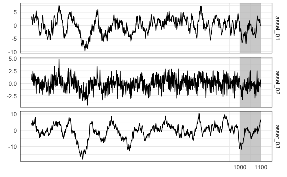

### MEDIUM

``` r
y_medium_train <- dgp$y_medium_train
y_medium_test <- dgp$y_medium_test
```

``` r
y_medium_train %>% 
  mutate(train = TRUE) %>% 
  bind_rows(y_medium_test %>% mutate(train = FALSE)) %>% 
  mutate(id = 1:n()) %>% 
  pivot_longer(-c(id, train), names_to = "asset", values_to = "value") %>% 
  ggplot(aes(x = id, y = value)) +
  annotate(
    geom = "rect",
    xmin = nrow(y_medium_train),
    xmax = nrow(y_medium_train) + nrow(y_medium_test),
    ymin = -Inf,
    ymax = Inf,
    alpha = .7,
    fill = "grey" # test set
  ) +
  geom_path() +
  facet_grid(asset ~ ., scales = "free_y") +
  scale_x_continuous(
    breaks = c(nrow(y_medium_train), nrow(y_medium_train) + nrow(y_medium_test))
  ) +
  theme_minimal() +
  theme(
    strip.text.y = element_text(size = 5), 
    panel.border = element_rect(fill = NA)
  ) +
  labs(
    x = element_blank(),
    y = element_blank()
  )
```

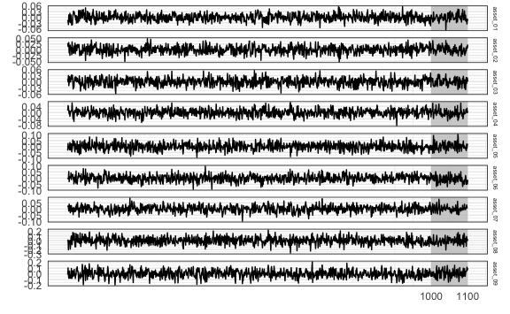

### LARGE

``` r
y_large_train <- dgp$y_large_train
y_large_test <- dgp$y_large_test
```

``` r
y_large_train %>% 
  mutate(train = TRUE) %>% 
  bind_rows(y_large_test %>% mutate(train = FALSE)) %>% 
  mutate(id = 1:n()) %>% 
  pivot_longer(-c(id, train), names_to = "asset", values_to = "value") %>% 
  ggplot(aes(x = id, y = value)) +
  annotate(
    geom = "rect",
    xmin = nrow(y_large_train),
    xmax = nrow(y_large_train) + nrow(y_large_test),
    ymin = -Inf,
    ymax = Inf,
    alpha = .7,
    fill = "grey" # test set
  ) +
  geom_path(size = .3) +
  facet_grid(asset ~ ., scales = "free_y") +
  scale_x_continuous(
    breaks = c(nrow(y_large_train), nrow(y_large_train) + nrow(y_large_test))
  ) +
  theme_minimal() +
  theme(
    strip.text.y = element_text(size = 5), 
    panel.border = element_rect(fill = NA),
    axis.text.y = element_text(size = 3)
  ) +
  labs(
    x = element_blank(),
    y = element_blank()
  )
```

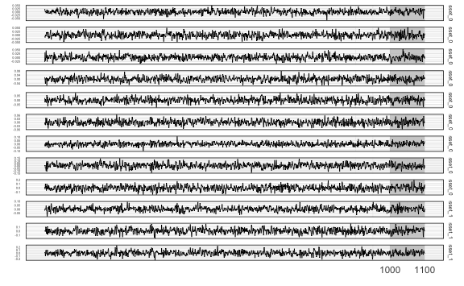

# Modeling

## VAR

``` r
(var_lag <- 5)
#> [1] 5
```

``` r
fit_var_small <- var_lm(y_small_train, var_lag, include_mean = FALSE)
fit_var_medium <- var_lm(y_medium_train, var_lag, include_mean = FALSE)
fit_var_large <- var_lm(y_large_train, var_lag, include_mean = FALSE)
```

## VHAR

``` r
fit_vhar_small <- vhar_lm(y_small_train, include_mean = FALSE)
fit_vhar_medium <- vhar_lm(y_medium_train, include_mean = FALSE)
fit_vhar_large <- vhar_lm(y_large_train, include_mean = FALSE)
```

## BVAR

``` r
(bvar_lag <- 5)
#> [1] 5
```

``` r
bvar_small_spec <- set_bvar(
  sigma = bvhar_small_spec$sigma,
  lambda = bvhar_small_spec$lambda,
  delta = bvhar_small_spec$delta
)
#----------------------------
bvar_medium_spec <- set_bvar(
  sigma = bvhar_medium_spec$sigma,
  lambda = bvhar_medium_spec$lambda,
  delta = bvhar_medium_spec$delta
)
#----------------------------
bvar_large_spec <- set_bvar(
  sigma = bvhar_large_spec$sigma,
  lambda = bvhar_large_spec$lambda,
  delta = bvhar_large_spec$delta
)
```

``` r
(bvar_small_optim <- choose_bvar(
  bvar_small_spec, 
  lower = c(
    rep(1e-2, n_small), # sigma
    1e-2, # lambda
    rep(1e-2, n_small) # delta
  ), 
  upper = c(
    rep(1, n_small), # sigma
    Inf, # lambda
    rep(1, n_small) # delta
  ), 
  y = y_small_train, 
  p = bvar_lag, 
  include_mean = FALSE,
  parallel = list(cl = cl, forward = FALSE, loginfo = FALSE)
))
#> Model Specification for BVAR
#> 
#> Parameters: Coefficent matrice and Covariance matrix
#> Prior: Minnesota
#> # Type '?bvar_minnesota' in the console for some help.
#> ========================================================
#> 
#> Setting for 'sigma':
#> [1]  0.0550  0.0527  0.0878
#> 
#> Setting for 'lambda':
#> [1]  0.109
#> 
#> Setting for 'delta':
#> [1]  0.147  0.130  0.120
#> 
#> Setting for 'eps':
#> [1]  1e-04
```

``` r
(bvar_medium_optim <- choose_bvar(
  bvar_medium_spec, 
  lower = c(
    rep(1e-2, n_medium), # sigma
    1e-2, # lambda
    rep(1e-2, n_medium) # delta
  ), 
  upper = c(
    rep(1, n_medium), # sigma
    Inf, # lambda
    rep(1, n_medium) # delta
  ), 
  y = y_medium_train, 
  p = bvar_lag, 
  include_mean = FALSE,
  parallel = list(cl = cl, forward = FALSE, loginfo = FALSE)
))
#> Model Specification for BVAR
#> 
#> Parameters: Coefficent matrice and Covariance matrix
#> Prior: Minnesota
#> # Type '?bvar_minnesota' in the console for some help.
#> ========================================================
#> 
#> Setting for 'sigma':
#> [1]  0.0393  0.0396  0.0489  0.0544  0.0635  0.0580  0.0636  0.1167  0.0956
#> 
#> Setting for 'lambda':
#> [1]  0.0649
#> 
#> Setting for 'delta':
#> [1]  0.1323  0.0491  0.0860  0.0647  0.0503  0.0598  0.1374  0.0636  0.1067
#> 
#> Setting for 'eps':
#> [1]  1e-04
```

``` r
(bvar_large_optim <- choose_bvar(
  bvar_large_spec, 
  lower = c(
    rep(1e-2, n_large), # sigma
    1e-2, # lambda
    rep(1e-2, n_large) # delta
  ), 
  upper = c(
    rep(1, n_large), # sigma
    Inf, # lambda
    rep(1, n_large) # delta
  ), 
  y = y_large_train, 
  p = bvar_lag, 
  include_mean = FALSE,
  parallel = list(cl = cl, forward = FALSE, loginfo = FALSE)
))
#> Model Specification for BVAR
#> 
#> Parameters: Coefficent matrice and Covariance matrix
#> Prior: Minnesota
#> # Type '?bvar_minnesota' in the console for some help.
#> ========================================================
#> 
#> Setting for 'sigma':
#>  [1]  0.0378  0.0403  0.0438  0.0556  0.0668  0.0422  0.0650  0.0604  0.0890
#> [10]  0.0788  0.0725  0.0999
#> 
#> Setting for 'lambda':
#> [1]  0.01
#> 
#> Setting for 'delta':
#>  [1]  0.0796  0.0852  0.0696  0.0979  0.0665  0.0830  0.0525  0.1088  0.0887
#> [10]  0.0873  0.0821  0.0891
#> 
#> Setting for 'eps':
#> [1]  1e-04
```

``` r
fit_small_bvar <- bvar_small_optim$fit
fit_medium_bvar <- bvar_medium_optim$fit
fit_large_bvar <- bvar_large_optim$fit
```

## BVHAR-VAR

``` r
(bvhar_var_small_optim <- choose_bvhar(
  bvhar_small_spec, 
  lower = c(
    rep(1e-2, n_small), # sigma
    1e-2, # lambda
    rep(1e-2, n_small) # delta
  ), 
  upper = c(
    rep(1, n_small), # sigma
    Inf, # lambda
    rep(1, n_small) # delta
  ), 
  y = y_small_train, 
  include_mean = FALSE,
  parallel = list(cl = cl, forward = FALSE, loginfo = FALSE)
))
#> Model Specification for BVHAR
#> 
#> Parameters: Coefficent matrice and Covariance matrix
#> Prior: MN_VAR
#> # Type '?bvhar_minnesota' in the console for some help.
#> ========================================================
#> 
#> Setting for 'sigma':
#> [1]  0.0552  0.0524  0.0926
#> 
#> Setting for 'lambda':
#> [1]  0.139
#> 
#> Setting for 'delta':
#> [1]  0.149  0.117  0.115
#> 
#> Setting for 'eps':
#> [1]  1e-04
```

``` r
(bvhar_var_medium_optim <- choose_bvhar(
  bvhar_medium_spec, 
  lower = c(
    rep(1e-2, n_medium), # sigma
    1e-2, # lambda
    rep(1e-2, n_medium) # delta
  ), 
  upper = c(
    rep(1, n_medium), # sigma
    Inf, # lambda
    rep(1, n_medium) # delta
  ), 
  y = y_medium_train, 
  include_mean = FALSE,
  parallel = list(cl = cl, forward = FALSE, loginfo = FALSE)
))
#> Model Specification for BVHAR
#> 
#> Parameters: Coefficent matrice and Covariance matrix
#> Prior: MN_VAR
#> # Type '?bvhar_minnesota' in the console for some help.
#> ========================================================
#> 
#> Setting for 'sigma':
#> [1]  0.0380  0.0389  0.0481  0.0516  0.0650  0.0571  0.0629  0.1339  0.1008
#> 
#> Setting for 'lambda':
#> [1]  0.0459
#> 
#> Setting for 'delta':
#> [1]  0.1219  0.0576  0.0854  0.0665  0.0488  0.0585  0.1382  0.0565  0.1048
#> 
#> Setting for 'eps':
#> [1]  1e-04
```

``` r
(bvhar_var_large_optim <- choose_bvhar(
  bvhar_large_spec, 
  lower = c(
    rep(1e-2, n_large), # sigma
    1e-2, # lambda
    rep(1e-2, n_large) # delta
  ), 
  upper = c(
    rep(1, n_large), # sigma
    Inf, # lambda
    rep(1, n_large) # delta
  ), 
  y = y_large_train, 
  include_mean = FALSE,
  parallel = list(cl = cl, forward = FALSE, loginfo = FALSE)
))
#> Model Specification for BVHAR
#> 
#> Parameters: Coefficent matrice and Covariance matrix
#> Prior: MN_VAR
#> # Type '?bvhar_minnesota' in the console for some help.
#> ========================================================
#> 
#> Setting for 'sigma':
#>  [1]  0.0379  0.0404  0.0438  0.0557  0.0666  0.0421  0.0647  0.0600  0.0890
#> [10]  0.0784  0.0723  0.1001
#> 
#> Setting for 'lambda':
#> [1]  0.01
#> 
#> Setting for 'delta':
#>  [1]  0.0831  0.0847  0.0709  0.0980  0.0721  0.0789  0.0509  0.1141  0.0929
#> [10]  0.0806  0.0862  0.0920
#> 
#> Setting for 'eps':
#> [1]  1e-04
```

``` r
fit_bvhar_small_var <- bvhar_var_small_optim$fit
fit_bvhar_medium_var <- bvhar_var_medium_optim$fit
fit_bvhar_large_var <- bvhar_var_large_optim$fit
```

## BVHAR-VHAR

``` r
bvhar_vhar_small_spec <- set_weight_bvhar(
  sigma = bvhar_small_spec$sigma,
  lambda = bvhar_small_spec$lambda,
  daily = bvhar_small_spec$delta,
  weekly = bvhar_small_spec$delta,
  monthly = bvhar_small_spec$delta
)
#-----------------------------------------
bvhar_vhar_medium_spec <- set_weight_bvhar(
  sigma = bvhar_medium_spec$sigma,
  lambda = bvhar_medium_spec$lambda,
  daily = bvhar_medium_spec$delta,
  weekly = bvhar_medium_spec$delta,
  monthly = bvhar_medium_spec$delta
)
#-----------------------------------------
bvhar_vhar_large_spec <- set_weight_bvhar(
  sigma = bvhar_large_spec$sigma,
  lambda = bvhar_large_spec$lambda,
  daily = bvhar_large_spec$delta,
  weekly = bvhar_large_spec$delta,
  monthly = bvhar_large_spec$delta
)
```

``` r
(bvhar_vhar_small_optim <- choose_bvhar(
  bvhar_vhar_small_spec, 
  lower = c(
    rep(1e-2, n_small), # sigma
    1e-2, # lambda
    rep(1e-2, n_small), # daily
    rep(1e-2, n_small), # weekly
    rep(1e-2, n_small) # monthly
  ), 
  upper = c(
    rep(1, n_small), # sigma
    Inf, # lambda
    rep(1, n_small), # daily
    rep(1, n_small), # weekly
    rep(1, n_small) # monthly
  ), 
  y = y_small_train, 
  include_mean = FALSE,
  parallel = list(cl = cl, forward = FALSE, loginfo = FALSE)
))
#> Model Specification for BVHAR
#> 
#> Parameters: Coefficent matrice and Covariance matrix
#> Prior: MN_VHAR
#> # Type '?bvhar_minnesota' in the console for some help.
#> ========================================================
#> 
#> Setting for 'sigma':
#> [1]  0.0557  0.0527  0.0882
#> 
#> Setting for 'lambda':
#> [1]  0.126
#> 
#> Setting for 'eps':
#> [1]  1e-04
#> 
#> Setting for 'daily':
#> [1]  0.139  0.114  0.108
#> 
#> Setting for 'weekly':
#> [1]  0.0944  0.0100  0.1222
#> 
#> Setting for 'monthly':
#> [1]  0.0519  0.0227  0.0100
```

``` r
(bvhar_vhar_medium_optim <- choose_bvhar(
  bvhar_vhar_medium_spec, 
  lower = c(
    rep(1e-2, n_medium), # sigma
    1e-2, # lambda
    rep(1e-2, n_medium), # daily
    rep(1e-2, n_medium), # weekly
    rep(1e-2, n_medium) # monthly
  ), 
  upper = c(
    rep(1, n_medium), # sigma
    Inf, # lambda
    rep(1, n_medium), # daily
    rep(1, n_medium), # weekly
    rep(1, n_medium) # monthly
  ), 
  y = y_medium_train, 
  include_mean = FALSE,
  parallel = list(cl = cl, forward = FALSE, loginfo = FALSE)
))
#> Model Specification for BVHAR
#> 
#> Parameters: Coefficent matrice and Covariance matrix
#> Prior: MN_VHAR
#> # Type '?bvhar_minnesota' in the console for some help.
#> ========================================================
#> 
#> Setting for 'sigma':
#> [1]  0.0380  0.0391  0.0482  0.0515  0.0649  0.0568  0.0630  0.1344  0.1003
#> 
#> Setting for 'lambda':
#> [1]  0.0443
#> 
#> Setting for 'eps':
#> [1]  1e-04
#> 
#> Setting for 'daily':
#> [1]  0.0993  0.0482  0.0802  0.0653  0.0447  0.0569  0.1365  0.0407  0.0992
#> 
#> Setting for 'weekly':
#> [1]  0.1817  0.0847  0.0291  0.0100  0.0100  0.0100  0.0100  0.1436  0.0100
#> 
#> Setting for 'monthly':
#> [1]  0.0100  0.0100  0.0912  0.0100  0.0100  0.0100  0.0100  0.0100  0.1505
```

``` r
(bvhar_vhar_large_optim <- choose_bvhar(
  bvhar_vhar_large_spec, 
  lower = c(
    rep(1e-2, n_large), # sigma
    1e-2, # lambda
    rep(1e-2, n_large), # daily
    rep(1e-2, n_large), # weekly
    rep(1e-2, n_large) # monthly
  ), 
  upper = c(
    rep(2, n_large), # sigma
    Inf, # lambda
    rep(1, n_large), # daily
    rep(1, n_large), # weekly
    rep(1, n_large) # monthly
  ), 
  y = y_large_train, 
  include_mean = FALSE,
  parallel = list(cl = cl, forward = FALSE, loginfo = FALSE)
))
#> Model Specification for BVHAR
#> 
#> Parameters: Coefficent matrice and Covariance matrix
#> Prior: MN_VHAR
#> # Type '?bvhar_minnesota' in the console for some help.
#> ========================================================
#> 
#> Setting for 'sigma':
#>  [1]  0.0379  0.0404  0.0438  0.0558  0.0667  0.0421  0.0646  0.0600  0.0888
#> [10]  0.0782  0.0722  0.0998
#> 
#> Setting for 'lambda':
#> [1]  0.01
#> 
#> Setting for 'eps':
#> [1]  1e-04
#> 
#> Setting for 'daily':
#>  [1]  0.0807  0.0826  0.0525  0.0900  0.0706  0.0766  0.0483  0.1097  0.0882
#> [10]  0.0583  0.0769  0.0905
#> 
#> Setting for 'weekly':
#>  [1]  0.0100  0.0100  0.1581  0.0514  0.0149  0.0100  0.0100  0.0100  0.0100
#> [10]  0.1607  0.0441  0.0100
#> 
#> Setting for 'monthly':
#>  [1]  0.0991  0.0100  0.0100  0.1431  0.0100  0.0100  0.0100  0.1686  0.1728
#> [10]  0.1523  0.2344  0.0100
```

``` r
fit_bvhar_small_vhar <- bvhar_vhar_small_optim$fit
fit_bvhar_medium_vhar <- bvhar_vhar_medium_optim$fit
fit_bvhar_large_vhar <- bvhar_vhar_large_optim$fit
```

``` r
parallel::stopCluster(cl)
```

## Hyperparameters


    \begin{longtable}[t]{lllrrrrrrrrrrrr}
    \caption{\label{tab:empdgp3}Empirical Bayes Results for DGP3.}\\
    \toprule
     &    &     & y1 & y2 & y3 & y4 & y5 & y6 & y7 & y8 & y9 & y10 & y11 & y12\\
    \midrule
    \endfirsthead
    \caption[]{Empirical Bayes Results for DGP3. \textit{(continued)}}\\
    \toprule
      &    &     & y1 & y2 & y3 & y4 & y5 & y6 & y7 & y8 & y9 & y10 & y11 & y12\\
    \midrule
    \endhead

    \endfoot
    \bottomrule
    \endlastfoot
    \addlinespace[0.3em]
    \multicolumn{15}{l}{\textbf{SMALL}}\\
    \hspace{1em} & BVAR & $\sigma$ & 0.055 & 0.053 & 0.088 &  &  &  &  &  &  &  &  & \\

    \hspace{1em} &  & $\lambda$ & 0.109 &  &  &  &  &  &  &  &  &  &  & \\

    \hspace{1em} &  & $\delta$ & 0.147 & 0.130 & 0.120 &  &  &  &  &  &  &  &  & \\
    \cmidrule{2-15}
    \hspace{1em} & BVHAR-S & $\sigma$ & 0.055 & 0.052 & 0.093 &  &  &  &  &  &  &  &  & \\

    \hspace{1em} &  & $\lambda$ & 0.139 &  &  &  &  &  &  &  &  &  &  & \\

    \hspace{1em} &  & $\delta$ & 0.149 & 0.117 & 0.115 &  &  &  &  &  &  &  &  & \\
    \cmidrule{2-15}
    \hspace{1em} & BVHAR-L & $\sigma$ & 0.056 & 0.053 & 0.088 &  &  &  &  &  &  &  &  & \\

    \hspace{1em} &  & $\lambda$ & 0.126 &  &  &  &  &  &  &  &  &  &  & \\

    \hspace{1em} &  & $d_i$ & 0.139 & 0.114 & 0.108 &  &  &  &  &  &  &  &  & \\

    \hspace{1em} &  & $w_i$ & 0.094 & 0.010 & 0.122 &  &  &  &  &  &  &  &  & \\

    \hspace{1em} &  & $m_i$ & 0.052 & 0.023 & 0.010 &  &  &  &  &  &  &  &  & \\
    \cmidrule{1-15}
    \addlinespace[0.3em]
    \multicolumn{15}{l}{\textbf{MEDIUM}}\\
    \hspace{1em} & BVAR & $\sigma$ & 0.039 & 0.040 & 0.049 & 0.054 & 0.063 & 0.058 & 0.064 & 0.117 & 0.096 &  &  & \\

    \hspace{1em} &  & $\lambda$ & 0.065 &  &  &  &  &  &  &  &  &  &  & \\

    \hspace{1em} &  & $\delta$ & 0.132 & 0.049 & 0.086 & 0.065 & 0.050 & 0.060 & 0.137 & 0.064 & 0.107 &  &  & \\
    \cmidrule{2-15}
    \hspace{1em} & BVHAR-S & $\sigma$ & 0.038 & 0.039 & 0.048 & 0.052 & 0.065 & 0.057 & 0.063 & 0.134 & 0.101 &  &  & \\

    \hspace{1em} &  & $\lambda$ & 0.046 &  &  &  &  &  &  &  &  &  &  & \\

    \hspace{1em} &  & $\delta$ & 0.122 & 0.058 & 0.085 & 0.067 & 0.049 & 0.059 & 0.138 & 0.056 & 0.105 &  &  & \\
    \cmidrule{2-15}
    \hspace{1em} & BVHAR-L & $\sigma$ & 0.038 & 0.039 & 0.048 & 0.051 & 0.065 & 0.057 & 0.063 & 0.134 & 0.100 &  &  & \\

    \hspace{1em} &  & $\lambda$ & 0.044 &  &  &  &  &  &  &  &  &  &  & \\

    \hspace{1em} &  & $d_i$ & 0.099 & 0.048 & 0.080 & 0.065 & 0.045 & 0.057 & 0.137 & 0.041 & 0.099 &  &  & \\

    \hspace{1em} &  & $w_i$ & 0.182 & 0.085 & 0.029 & 0.010 & 0.010 & 0.010 & 0.010 & 0.144 & 0.010 &  &  & \\

    \hspace{1em} &  & $m_i$ & 0.010 & 0.010 & 0.091 & 0.010 & 0.010 & 0.010 & 0.010 & 0.010 & 0.151 &  &  & \\
    \cmidrule{1-15}
    \addlinespace[0.3em]
    \multicolumn{15}{l}{\textbf{LARGE}}\\
    \hspace{1em} & BVAR & $\sigma$ & 0.038 & 0.040 & 0.044 & 0.056 & 0.067 & 0.042 & 0.065 & 0.060 & 0.089 & 0.079 & 0.073 & 0.100\\

    \hspace{1em}\hspace{1em}\hspace{1em} &  & $\lambda$ & 0.010 &  &  &  &  &  &  &  &  &  &  & \\

    \hspace{1em} &  & $\delta$ & 0.080 & 0.085 & 0.070 & 0.098 & 0.066 & 0.083 & 0.052 & 0.109 & 0.089 & 0.087 & 0.082 & 0.089\\
    \cmidrule{2-15}
    \hspace{1em} & BVHAR-S & $\sigma$ & 0.038 & 0.040 & 0.044 & 0.056 & 0.067 & 0.042 & 0.065 & 0.060 & 0.089 & 0.078 & 0.072 & 0.100\\

     &  & $\lambda$ & 0.010 &  &  &  &  &  &  &  &  &  &  & \\

    \hspace{1em} &  & $\delta$ & 0.083 & 0.085 & 0.071 & 0.098 & 0.072 & 0.079 & 0.051 & 0.114 & 0.093 & 0.081 & 0.086 & 0.092\\
    \cmidrule{2-15}
    \hspace{1em} & BVHAR-L & $\sigma$ & 0.038 & 0.040 & 0.044 & 0.056 & 0.067 & 0.042 & 0.065 & 0.060 & 0.089 & 0.078 & 0.072 & 0.100\\

     &  & $\lambda$ & 0.010 &  &  &  &  &  &  &  &  &  &  & \\

    \hspace{1em} &  & $d_i$ & 0.081 & 0.083 & 0.053 & 0.090 & 0.071 & 0.077 & 0.048 & 0.110 & 0.088 & 0.058 & 0.077 & 0.091\\

    \hspace{1em} &  & $w_i$ & 0.010 & 0.010 & 0.158 & 0.051 & 0.015 & 0.010 & 0.010 & 0.010 & 0.010 & 0.161 & 0.044 & 0.010\\

    \hspace{1em} &  & $m_i$ & 0.099 & 0.010 & 0.010 & 0.143 & 0.010 & 0.010 & 0.010 & 0.169 & 0.173 & 0.152 & 0.234 & 0.010\\*
    \end{longtable}

# Errors

## Rolling Windows

### SMALL

``` r
mod_small_list <- list(
  fit_var_small,
  fit_vhar_small,
  fit_small_bvar,
  fit_bvhar_small_var,
  fit_bvhar_small_vhar
)
# 1-step-----------
cv_small_1 <- 
  mod_small_list %>% 
  lapply(
    function(mod) {
      forecast_roll(mod, 1, y_small_test)
    }
  )
# 5-step-----------
cv_small_5 <- 
  mod_small_list %>% 
  lapply(
    function(mod) {
      forecast_roll(mod, 5, y_small_test)
    }
  )
# 20-step----------
cv_small_20 <- 
  mod_small_list %>% 
  lapply(
    function(mod) {
      forecast_roll(mod, 20, y_small_test)
    }
  )
```

### MEDIUM

``` r
mod_medium_list <- list(
  fit_var_medium,
  fit_vhar_medium,
  fit_medium_bvar,
  fit_bvhar_medium_var,
  fit_bvhar_medium_vhar
)
# 1-step-----------
cv_medium_1 <- 
  mod_medium_list %>% 
  lapply(
    function(mod) {
      forecast_roll(mod, 1, y_medium_test)
    }
  )
# 5-step-----------
cv_medium_5 <- 
  mod_medium_list %>% 
  lapply(
    function(mod) {
      forecast_roll(mod, 5, y_medium_test)
    }
  )
# 20-step----------
cv_medium_20 <- 
  mod_medium_list %>% 
  lapply(
    function(mod) {
      forecast_roll(mod, 20, y_medium_test)
    }
  )
```

### LARGE

``` r
mod_large_list <- list(
  fit_var_large,
  fit_vhar_large,
  fit_large_bvar,
  fit_bvhar_large_var,
  fit_bvhar_large_vhar
)
# 1-step-----------
cv_large_1 <- 
  mod_large_list %>% 
  lapply(
    function(mod) {
      forecast_roll(mod, 1, y_large_test)
    }
  )
# 5-step-----------
cv_large_5 <- 
  mod_large_list %>% 
  lapply(
    function(mod) {
      forecast_roll(mod, 5, y_large_test)
    }
  )
# 20-step----------
cv_large_20 <- 
  mod_large_list %>% 
  lapply(
    function(mod) {
      forecast_roll(mod, 20, y_large_test)
    }
  )
```

### Lists

``` r
# SMALL-------------------------------
cv_small_list <- 
  lapply(
    c(1, 5, 20),
    function(h) {
      mod_small_list %>% 
        lapply(
          function(mod) {
            forecast_roll(mod, h, y_small_test)
          }
        )
    }
  )
# MEDIUM------------------------------
cv_medium_list <- 
  lapply(
    c(1, 5, 20),
    function(h) {
      mod_small_list %>% 
        lapply(
          function(mod) {
            forecast_roll(mod, h, y_medium_test)
          }
        )
    }
  )
# LARGE-------------------------------
cv_large_list <- 
  lapply(
    c(1, 5, 20),
    function(h) {
      mod_small_list %>% 
        lapply(
          function(mod) {
            forecast_roll(mod, h, y_large_test)
          }
        )
    }
  )
```

## Relative Error

Set VAR as the benchmark model.

    \begin{table}[H]

    \caption{\label{tab:dgp3result}Out-of-sample forecasting performance measures for DGP3.}
    \centering
    \resizebox{\linewidth}{!}{
    \begin{tabular}[t]{cc|ccc|ccc|ccc|}
    \toprule
    \multicolumn{2}{c}{ } & \multicolumn{3}{c}{RMAFE} & \multicolumn{3}{c}{RMSFE} & \multicolumn{3}{c}{RMASE} \\
    \cmidrule(l{3pt}r{3pt}){3-5} \cmidrule(l{3pt}r{3pt}){6-8} \cmidrule(l{3pt}r{3pt}){9-11}
    \rotatebox{0}{} & \rotatebox{0}{} & \rotatebox{0}{$h = 1$} & \rotatebox{0}{$h = 5$} & \rotatebox{0}{$h = 20$} & \rotatebox{0}{$h = 1$} & \rotatebox{0}{$h = 5$} & \rotatebox{0}{$h = 20$} & \rotatebox{0}{$h = 1$} & \rotatebox{0}{$h = 5$} & \rotatebox{0}{$h = 20$}\\
    \midrule
     & VHAR & \textcolor{black}{\num{.981}} & \textcolor{black}{\num{1.002}} & \textcolor{black}{\num{1.002}} & \textcolor{black}{\num{.977}} & \textcolor{black}{\num{.994}} & \textcolor{black}{\num{1.002}} & \textcolor{black}{\num{.979}} & \textcolor{red}{\num{.984}} & \textcolor{black}{\num{1.001}}\\

     & BVAR & \textcolor{black}{\num{.975}} & \textcolor{black}{\num{.991}} & \textcolor{red}{\num{1.000}} & \textcolor{black}{\num{.975}} & \textcolor{black}{\num{.972}} & \textcolor{red}{\num{1.000}} & \textcolor{black}{\num{.972}} & \textcolor{black}{\num{.986}} & \textcolor{red}{\num{1.000}}\\

     & BVHAR-S & \textcolor{red}{\num{.972}} & \textcolor{black}{\num{.992}} & \textcolor{black}{\num{1.002}} & \textcolor{red}{\num{.969}} & \textcolor{black}{\num{.973}} & \textcolor{black}{\num{1.002}} & \textcolor{red}{\num{.972}} & \textcolor{black}{\num{.987}} & \textcolor{black}{\num{1.002}}\\

    \multirow{-4}{*}{\centering\arraybackslash SMALL} & BVHAR-L & \textcolor{black}{\num{.973}} & \textcolor{red}{\num{.990}} & \textcolor{black}{\num{1.002}} & \textcolor{black}{\num{.971}} & \textcolor{red}{\num{.970}} & \textcolor{black}{\num{1.002}} & \textcolor{black}{\num{.973}} & \textcolor{black}{\num{.986}} & \textcolor{black}{\num{1.002}}\\
    \cmidrule{1-11}
     & VHAR & \textcolor{black}{\num{1.001}} & \textcolor{black}{\num{1.077}} & \textcolor{black}{\num{1.013}} & \textcolor{black}{\num{.987}} & \textcolor{black}{\num{1.113}} & \textcolor{black}{\num{1.020}} & \textcolor{black}{\num{1.008}} & \textcolor{black}{\num{1.081}} & \textcolor{black}{\num{1.016}}\\

     & BVAR & \textcolor{black}{\num{.969}} & \textcolor{black}{\num{.984}} & \textcolor{red}{\num{1.000}} & \textcolor{black}{\num{.960}} & \textcolor{black}{\num{.981}} & \textcolor{red}{\num{1.000}} & \textcolor{black}{\num{.972}} & \textcolor{black}{\num{.983}} & \textcolor{red}{\num{1.000}}\\

     & BVHAR-S & \textcolor{red}{\num{.969}} & \textcolor{black}{\num{.983}} & \textcolor{black}{\num{1.000}} & \textcolor{black}{\num{.959}} & \textcolor{black}{\num{.979}} & \textcolor{black}{\num{1.000}} & \textcolor{red}{\num{.971}} & \textcolor{red}{\num{.982}} & \textcolor{black}{\num{1.000}}\\

    \multirow{-4}{*}{\centering\arraybackslash MEDIUM} & BVHAR-L & \textcolor{black}{\num{.969}} & \textcolor{red}{\num{.983}} & \textcolor{black}{\num{1.000}} & \textcolor{red}{\num{.959}} & \textcolor{red}{\num{.979}} & \textcolor{black}{\num{1.000}} & \textcolor{black}{\num{.971}} & \textcolor{black}{\num{.982}} & \textcolor{black}{\num{1.000}}\\
    \cmidrule{1-11}
     & VHAR & \textcolor{black}{\num{.998}} & \textcolor{black}{\num{1.067}} & \textcolor{black}{\num{1.012}} & \textcolor{black}{\num{.995}} & \textcolor{black}{\num{1.114}} & \textcolor{black}{\num{1.017}} & \textcolor{black}{\num{.992}} & \textcolor{black}{\num{1.067}} & \textcolor{black}{\num{1.016}}\\

     & BVAR & \textcolor{black}{\num{.970}} & \textcolor{red}{\num{.992}} & \textcolor{black}{\num{1.000}} & \textcolor{black}{\num{.956}} & \textcolor{red}{\num{.991}} & \textcolor{black}{\num{1.000}} & \textcolor{black}{\num{.968}} & \textcolor{black}{\num{.992}} & \textcolor{black}{\num{1.000}}\\

     & BVHAR-S & \textcolor{black}{\num{.969}} & \textcolor{black}{\num{.993}} & \textcolor{red}{\num{1.000}} & \textcolor{black}{\num{.953}} & \textcolor{black}{\num{.992}} & \textcolor{red}{\num{1.000}} & \textcolor{black}{\num{.965}} & \textcolor{red}{\num{.992}} & \textcolor{red}{\num{1.000}}\\

    \multirow{-4}{*}{\centering\arraybackslash LARGE} & BVHAR-L & \textcolor{red}{\num{.969}} & \textcolor{black}{\num{.993}} & \textcolor{black}{\num{1.000}} & \textcolor{red}{\num{.952}} & \textcolor{black}{\num{.992}} & \textcolor{black}{\num{1.000}} & \textcolor{red}{\num{.965}} & \textcolor{black}{\num{.992}} & \textcolor{black}{\num{1.000}}\\
    \bottomrule
    \end{tabular}}
    \end{table}

## Piecewise Errors

### SMALL

Plots

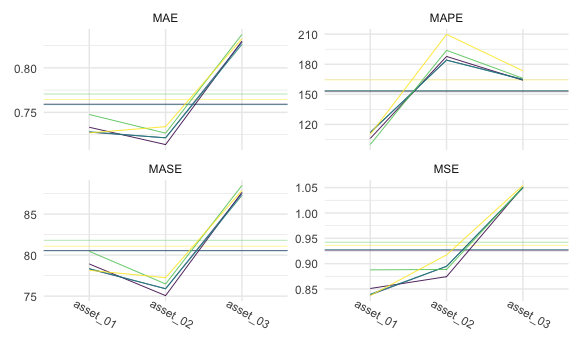

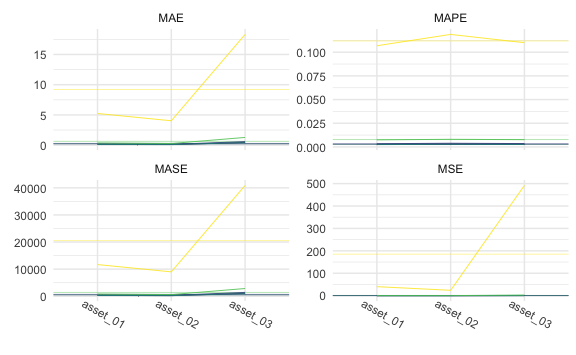

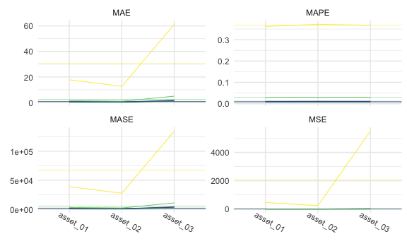

Tables

1-step:


    \begin{longtable}[t]{lllllll}
    \caption{\label{tab:smallone}SMALL Simulation - 1-step ahead Rolling Window Forecasting Loss}\\
    \toprule
    \multicolumn{1}{c}{ } & \multicolumn{1}{c}{ } & \multicolumn{2}{c}{Frequentist} & \multicolumn{1}{c}{BVAR} & \multicolumn{2}{c}{BVHAR} \\
    \cmidrule(l{3pt}r{3pt}){3-4} \cmidrule(l{3pt}r{3pt}){5-5} \cmidrule(l{3pt}r{3pt}){6-7}
     &  & VAR & VHAR & Minnesota & VAR-type & VHAR-type\\
    \midrule
    \endfirsthead
    \caption[]{SMALL Simulation - 1-step ahead Rolling Window Forecasting Loss \textit{(continued)}}\\
    \toprule
     &  & VAR & VHAR & Minnesota & VAR-type & VHAR-type\\
    \midrule
    \endhead

    \endfoot
    \bottomrule
    \endlastfoot
     & asset01 & \num{0.00097} & \num{0.000924} & \num{0.000933} & \textcolor{red}{\num{0.000916}} & \num{0.000917}\\
    \cmidrule{2-7}\nopagebreak
     & asset02 & \num{0.000892} & \num{0.000879} & \textcolor{red}{\num{0.000855}} & \num{0.000868} & \num{0.000869}\\
    \cmidrule{2-7}\nopagebreak
     & asset03 & \num{0.0148} & \num{0.0145} & \num{0.0145} & \textcolor{red}{\num{0.0144}} & \num{0.0144}\\
    \cmidrule{2-7}\nopagebreak
    \multirow{-4}{*}{\raggedright\arraybackslash MSE} & \cellcolor{gray}{Average} & \num{0.00556} & \num{0.00543} & \num{0.00542} & \textcolor{red}{\num{0.00539}} & \num{0.00539}\\
    \cmidrule{1-7}\pagebreak[0]
     & asset01 & \num{0.0253} & \textcolor{red}{\num{0.0245}} & \num{0.0248} & \num{0.0246} & \num{0.0246}\\
    \cmidrule{2-7}\nopagebreak
     & asset02 & \num{0.0237} & \num{0.024} & \textcolor{red}{\num{0.0234}} & \num{0.0237} & \num{0.0237}\\
    \cmidrule{2-7}\nopagebreak
     & asset03 & \num{0.101} & \num{0.0987} & \num{0.098} & \textcolor{red}{\num{0.0976}} & \num{0.0977}\\
    \cmidrule{2-7}\nopagebreak
    \multirow{-4}{*}{\raggedright\arraybackslash MAE} & \cellcolor{gray}{Average} & \num{0.05} & \num{0.049} & \num{0.0487} & \textcolor{red}{\num{0.0486}} & \num{0.0487}\\
    \cmidrule{1-7}\pagebreak[0]
     & asset01 & \num{179.757} & \textcolor{red}{\num{148.191}} & \num{162.914} & \num{160.074} & \num{159.12}\\
    \cmidrule{2-7}\nopagebreak
     & asset02 & \num{156.045} & \num{166.118} & \textcolor{red}{\num{155.151}} & \num{162.883} & \num{162.8}\\
    \cmidrule{2-7}\nopagebreak
     & asset03 & \num{173.366} & \num{160.399} & \num{161.089} & \num{159.478} & \textcolor{red}{\num{159.385}}\\
    \cmidrule{2-7}\nopagebreak
    \multirow{-4}{*}{\raggedright\arraybackslash MAPE} & \cellcolor{gray}{Average} & \num{169.723} & \textcolor{red}{\num{158.236}} & \num{159.718} & \num{160.812} & \num{160.435}\\
    \cmidrule{1-7}\pagebreak[0]
     & asset01 & \num{57.806} & \num{56.926} & \num{56.943} & \textcolor{red}{\num{56.662}} & \num{56.812}\\
    \cmidrule{2-7}\nopagebreak
     & asset02 & \num{52.693} & \num{53.784} & \textcolor{red}{\num{51.955}} & \num{53.026} & \num{53.06}\\
    \cmidrule{2-7}\nopagebreak
     & asset03 & \num{228.109} & \num{220.686} & \num{220.371} & \textcolor{red}{\num{219.407}} & \num{219.613}\\
    \cmidrule{2-7}\nopagebreak
    \multirow{-4}{*}{\raggedright\arraybackslash MASE} & \cellcolor{gray}{Average} & \num{112.869} & \num{110.465} & \num{109.757} & \textcolor{red}{\num{109.698}} & \num{109.828}\\*
    \end{longtable}

5-step:


    \begin{longtable}[t]{lllllll}
    \caption{\label{tab:smallfive}SMALL Simulation - 5-step ahead Rolling Window Forecasting Loss}\\
    \toprule
    \multicolumn{1}{c}{ } & \multicolumn{1}{c}{ } & \multicolumn{2}{c}{Frequentist} & \multicolumn{1}{c}{BVAR} & \multicolumn{2}{c}{BVHAR} \\
    \cmidrule(l{3pt}r{3pt}){3-4} \cmidrule(l{3pt}r{3pt}){5-5} \cmidrule(l{3pt}r{3pt}){6-7}
     &  & VAR & VHAR & Minnesota & VAR-type & VHAR-type\\
    \midrule
    \endfirsthead
    \caption[]{SMALL Simulation - 5-step ahead Rolling Window Forecasting Loss \textit{(continued)}}\\
    \toprule
     &  & VAR & VHAR & Minnesota & VAR-type & VHAR-type\\
    \midrule
    \endhead

    \endfoot
    \bottomrule
    \endlastfoot
     & asset01 & \num{0.00161} & \num{0.00161} & \num{0.00155} & \num{0.00155} & \textcolor{red}{\num{0.00155}}\\
    \cmidrule{2-7}\nopagebreak
     & asset02 & \num{0.00137} & \num{0.00134} & \textcolor{red}{\num{0.00132}} & \num{0.00132} & \num{0.00132}\\
    \cmidrule{2-7}\nopagebreak
     & asset03 & \num{0.0214} & \num{0.0213} & \num{0.0209} & \num{0.0209} & \textcolor{red}{\num{0.0208}}\\
    \cmidrule{2-7}\nopagebreak
    \multirow{-4}{*}{\raggedright\arraybackslash MSE} & \cellcolor{gray}{Average} & \num{0.00814} & \num{0.00809} & \num{0.00791} & \num{0.00792} & \textcolor{red}{\num{0.0079}}\\
    \cmidrule{1-7}\pagebreak[0]
     & asset01 & \num{0.0329} & \num{0.0327} & \textcolor{red}{\num{0.0323}} & \num{0.0323} & \num{0.0323}\\
    \cmidrule{2-7}\nopagebreak
     & asset02 & \num{0.0296} & \num{0.0295} & \textcolor{red}{\num{0.029}} & \num{0.029} & \num{0.029}\\
    \cmidrule{2-7}\nopagebreak
     & asset03 & \num{0.116} & \num{0.116} & \num{0.115} & \num{0.115} & \textcolor{red}{\num{0.115}}\\
    \cmidrule{2-7}\nopagebreak
    \multirow{-4}{*}{\raggedright\arraybackslash MAE} & \cellcolor{gray}{Average} & \num{0.0594} & \num{0.0595} & \num{0.0589} & \num{0.0589} & \textcolor{red}{\num{0.0588}}\\
    \cmidrule{1-7}\pagebreak[0]
     & asset01 & \num{120.296} & \num{128.473} & \textcolor{red}{\num{101.686}} & \num{102.317} & \num{102.906}\\
    \cmidrule{2-7}\nopagebreak
     & asset02 & \num{109.384} & \num{132.168} & \textcolor{red}{\num{100.52}} & \num{102.372} & \num{102.597}\\
    \cmidrule{2-7}\nopagebreak
     & asset03 & \num{102.434} & \num{108.832} & \num{100.7} & \textcolor{red}{\num{100.026}} & \num{100.108}\\
    \cmidrule{2-7}\nopagebreak
    \multirow{-4}{*}{\raggedright\arraybackslash MAPE} & \cellcolor{gray}{Average} & \num{110.705} & \num{123.158} & \textcolor{red}{\num{100.969}} & \num{101.572} & \num{101.87}\\
    \cmidrule{1-7}\pagebreak[0]
     & asset01 & \num{72.196} & \num{70.457} & \textcolor{red}{\num{70.079}} & \num{70.166} & \num{70.16}\\
    \cmidrule{2-7}\nopagebreak
     & asset02 & \num{67.698} & \textcolor{red}{\num{65.903}} & \num{66.282} & \num{66.434} & \num{66.357}\\
    \cmidrule{2-7}\nopagebreak
     & asset03 & \num{263.182} & \textcolor{red}{\num{260.445}} & \num{261.15} & \num{261.089} & \num{260.849}\\
    \cmidrule{2-7}\nopagebreak
    \multirow{-4}{*}{\raggedright\arraybackslash MASE} & \cellcolor{gray}{Average} & \num{134.359} & \textcolor{red}{\num{132.268}} & \num{132.504} & \num{132.563} & \num{132.456}\\*
    \end{longtable}

20-step:


    \begin{longtable}[t]{lllllll}
    \caption{\label{tab:smalltwenty}SMALL Simulation - 20-step ahead Rolling Window Forecasting Loss}\\
    \toprule
    \multicolumn{1}{c}{ } & \multicolumn{1}{c}{ } & \multicolumn{2}{c}{Frequentist} & \multicolumn{1}{c}{BVAR} & \multicolumn{2}{c}{BVHAR} \\
    \cmidrule(l{3pt}r{3pt}){3-4} \cmidrule(l{3pt}r{3pt}){5-5} \cmidrule(l{3pt}r{3pt}){6-7}
     &  & VAR & VHAR & Minnesota & VAR-type & VHAR-type\\
    \midrule
    \endfirsthead
    \caption[]{SMALL Simulation - 20-step ahead Rolling Window Forecasting Loss \textit{(continued)}}\\
    \toprule
     &  & VAR & VHAR & Minnesota & VAR-type & VHAR-type\\
    \midrule
    \endhead

    \endfoot
    \bottomrule
    \endlastfoot
     & asset01 & \num{0.00166} & \textcolor{red}{\num{0.00166}} & \num{0.00166} & \num{0.00167} & \num{0.00167}\\
    \cmidrule{2-7}\nopagebreak
     & asset02 & \num{0.00124} & \textcolor{red}{\num{0.00124}} & \num{0.00124} & \num{0.00124} & \num{0.00124}\\
    \cmidrule{2-7}\nopagebreak
     & asset03 & \num{0.02} & \num{0.0201} & \textcolor{red}{\num{0.02}} & \num{0.0201} & \num{0.0201}\\
    \cmidrule{2-7}\nopagebreak
    \multirow{-4}{*}{\raggedright\arraybackslash MSE} & \cellcolor{gray}{Average} & \num{0.00764} & \num{0.00766} & \textcolor{red}{\num{0.00764}} & \num{0.00766} & \num{0.00766}\\
    \cmidrule{1-7}\pagebreak[0]
     & asset01 & \num{0.0332} & \textcolor{red}{\num{0.033}} & \num{0.0332} & \num{0.0332} & \num{0.0332}\\
    \cmidrule{2-7}\nopagebreak
     & asset02 & \num{0.028} & \textcolor{red}{\num{0.0278}} & \num{0.028} & \num{0.028} & \num{0.028}\\
    \cmidrule{2-7}\nopagebreak
     & asset03 & \num{0.112} & \num{0.112} & \textcolor{red}{\num{0.112}} & \num{0.112} & \num{0.112}\\
    \cmidrule{2-7}\nopagebreak
    \multirow{-4}{*}{\raggedright\arraybackslash MAE} & \cellcolor{gray}{Average} & \num{0.0576} & \num{0.0577} & \textcolor{red}{\num{0.0576}} & \num{0.0577} & \num{0.0577}\\
    \cmidrule{1-7}\pagebreak[0]
     & asset01 & \textcolor{red}{\num{99.991}} & \num{115.267} & \num{99.999} & \num{101.518} & \num{101.456}\\
    \cmidrule{2-7}\nopagebreak
     & asset02 & \num{100.023} & \num{100.29} & \textcolor{red}{\num{100}} & \num{100.47} & \num{100.407}\\
    \cmidrule{2-7}\nopagebreak
     & asset03 & \num{100.027} & \num{106.981} & \textcolor{red}{\num{100}} & \num{100.438} & \num{100.365}\\
    \cmidrule{2-7}\nopagebreak
    \multirow{-4}{*}{\raggedright\arraybackslash MAPE} & \cellcolor{gray}{Average} & \num{100.014} & \num{107.513} & \textcolor{red}{\num{100}} & \num{100.809} & \num{100.743}\\
    \cmidrule{1-7}\pagebreak[0]
     & asset01 & \num{71.438} & \textcolor{red}{\num{71.024}} & \num{71.438} & \num{71.571} & \num{71.569}\\
    \cmidrule{2-7}\nopagebreak
     & asset02 & \num{64.304} & \textcolor{red}{\num{63.5}} & \num{64.302} & \num{64.384} & \num{64.384}\\
    \cmidrule{2-7}\nopagebreak
     & asset03 & \num{251.847} & \num{253.298} & \textcolor{red}{\num{251.824}} & \num{252.386} & \num{252.285}\\
    \cmidrule{2-7}\nopagebreak
    \multirow{-4}{*}{\raggedright\arraybackslash MASE} & \cellcolor{gray}{Average} & \num{129.196} & \num{129.274} & \textcolor{red}{\num{129.188}} & \num{129.447} & \num{129.413}\\*
    \end{longtable}

### MEDIUM

Plots

``` r
cv_medium_1 %>% 
  gg_loss(
    y_medium_test, 
    mean_line = TRUE, 
    line_param = list(size = .3), 
    mean_param = list(alpha = .5, size = .3), 
    viridis = TRUE, 
    show.legend = FALSE
  ) +
  theme_minimal() +
  theme(
    axis.text.x = element_text(angle = -30, vjust = -1),
    legend.title = element_text(size = 8),
    legend.text = element_text(size = 7),
    legend.key.size = unit(.3, "cm")
  )
```

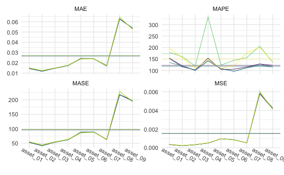

``` r
cv_medium_5 %>% 
  gg_loss(
    y_medium_test, 
    mean_line = TRUE, 
    line_param = list(size = .3), 
    mean_param = list(alpha = .5, size = .3), 
    viridis = TRUE, 
    show.legend = FALSE
  ) +
  theme_minimal() +
  theme(
    axis.text.x = element_text(angle = -30, vjust = -1),
    legend.title = element_text(size = 8),
    legend.text = element_text(size = 7),
    legend.key.size = unit(.3, "cm")
  )
```

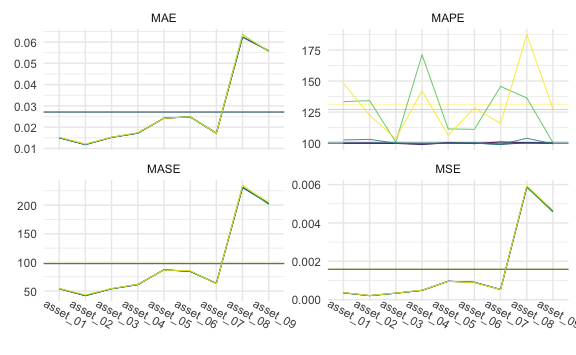

``` r
cv_medium_20 %>% 
  gg_loss(
    y_medium_test, 
    mean_line = TRUE, 
    line_param = list(size = .3), 
    mean_param = list(alpha = .5, size = .3), 
    viridis = TRUE, 
    show.legend = FALSE
  ) +
  theme_minimal() +
  theme(
    axis.text.x = element_text(angle = -30, vjust = -1),
    legend.title = element_text(size = 8),
    legend.text = element_text(size = 7),
    legend.key.size = unit(.3, "cm")
  )
```

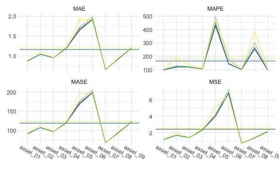

Tables

1-step:


    \begin{longtable}[t]{lllllll}
    \caption{\label{tab:medone}MEDIUM Simulation - 1-step ahead Rolling Window Forecasting Loss}\\
    \toprule
    \multicolumn{1}{c}{ } & \multicolumn{1}{c}{ } & \multicolumn{2}{c}{Frequentist} & \multicolumn{1}{c}{BVAR} & \multicolumn{2}{c}{BVHAR} \\
    \cmidrule(l{3pt}r{3pt}){3-4} \cmidrule(l{3pt}r{3pt}){5-5} \cmidrule(l{3pt}r{3pt}){6-7}
     &  & VAR & VHAR & Minnesota & VAR-type & VHAR-type\\
    \midrule
    \endfirsthead
    \caption[]{MEDIUM Simulation - 1-step ahead Rolling Window Forecasting Loss \textit{(continued)}}\\
    \toprule
     &  & VAR & VHAR & Minnesota & VAR-type & VHAR-type\\
    \midrule
    \endhead

    \endfoot
    \bottomrule
    \endlastfoot
     & asset01 & \num{0.000377} & \num{0.000372} & \num{0.000347} & \textcolor{red}{\num{0.000346}} & \num{0.000346}\\
    \cmidrule{2-7}\nopagebreak
     & asset02 & \num{0.000234} & \num{0.000237} & \num{0.000215} & \num{0.000214} & \textcolor{red}{\num{0.000214}}\\
    \cmidrule{2-7}\nopagebreak
     & asset03 & \num{0.000348} & \num{0.000344} & \num{0.000327} & \textcolor{red}{\num{0.000326}} & \num{0.000326}\\
    \cmidrule{2-7}\nopagebreak
     & asset04 & \num{0.00051} & \num{0.00053} & \num{0.000501} & \num{0.000501} & \textcolor{red}{\num{5e-04}}\\
    \cmidrule{2-7}\nopagebreak
     & asset05 & \num{0.000962} & \num{0.000975} & \textcolor{red}{\num{0.000955}} & \num{0.000969} & \num{0.000969}\\
    \cmidrule{2-7}\nopagebreak
     & asset06 & \num{0.000856} & \textcolor{red}{\num{0.000824}} & \num{0.000844} & \num{0.000857} & \num{0.000857}\\
    \cmidrule{2-7}\nopagebreak
     & asset07 & \num{0.000532} & \num{0.000529} & \textcolor{red}{\num{0.000518}} & \num{0.000521} & \num{0.000522}\\
    \cmidrule{2-7}\nopagebreak
     & asset08 & \num{0.00604} & \num{0.00596} & \textcolor{red}{\num{0.00579}} & \num{0.00584} & \num{0.00586}\\
    \cmidrule{2-7}\nopagebreak
     & asset09 & \textcolor{red}{\num{0.00411}} & \num{0.00414} & \num{0.00416} & \num{0.00426} & \num{0.00427}\\
    \cmidrule{2-7}\nopagebreak
    \multirow{-10}{*}{\raggedright\arraybackslash MSE} & \cellcolor{gray}{Average} & \num{0.00155} & \num{0.00155} & \textcolor{red}{\num{0.00152}} & \num{0.00154} & \num{0.00154}\\
    \cmidrule{1-7}\pagebreak[0]
     & asset01 & \num{0.0152} & \num{0.0151} & \num{0.0145} & \textcolor{red}{\num{0.0145}} & \num{0.0145}\\
    \cmidrule{2-7}\nopagebreak
     & asset02 & \num{0.0127} & \num{0.0124} & \num{0.0119} & \num{0.0118} & \textcolor{red}{\num{0.0118}}\\
    \cmidrule{2-7}\nopagebreak
     & asset03 & \num{0.0151} & \num{0.015} & \textcolor{red}{\num{0.0148}} & \num{0.0148} & \num{0.0148}\\
    \cmidrule{2-7}\nopagebreak
     & asset04 & \num{0.0174} & \num{0.0178} & \textcolor{red}{\num{0.0173}} & \num{0.0174} & \num{0.0174}\\
    \cmidrule{2-7}\nopagebreak
     & asset05 & \textcolor{red}{\num{0.0237}} & \num{0.0243} & \num{0.0241} & \num{0.0245} & \num{0.0245}\\
    \cmidrule{2-7}\nopagebreak
     & asset06 & \num{0.0241} & \textcolor{red}{\num{0.0236}} & \num{0.0238} & \num{0.0239} & \num{0.0239}\\
    \cmidrule{2-7}\nopagebreak
     & asset07 & \num{0.0177} & \num{0.0174} & \textcolor{red}{\num{0.017}} & \num{0.017} & \num{0.017}\\
    \cmidrule{2-7}\nopagebreak
     & asset08 & \num{0.0646} & \num{0.0643} & \textcolor{red}{\num{0.0627}} & \num{0.0628} & \num{0.0629}\\
    \cmidrule{2-7}\nopagebreak
     & asset09 & \num{0.0529} & \textcolor{red}{\num{0.0525}} & \num{0.0534} & \num{0.0538} & \num{0.0538}\\
    \cmidrule{2-7}\nopagebreak
    \multirow{-10}{*}{\raggedright\arraybackslash MAE} & \cellcolor{gray}{Average} & \num{0.027} & \num{0.0269} & \textcolor{red}{\num{0.0266}} & \num{0.0267} & \num{0.0267}\\
    \cmidrule{1-7}\pagebreak[0]
     & asset01 & \num{178.846} & \num{198.001} & \num{152.95} & \num{153.637} & \textcolor{red}{\num{135.009}}\\
    \cmidrule{2-7}\nopagebreak
     & asset02 & \num{160.555} & \num{154.378} & \textcolor{red}{\num{116.087}} & \num{120.767} & \num{119.476}\\
    \cmidrule{2-7}\nopagebreak
     & asset03 & \num{119.546} & \num{109.266} & \num{102.435} & \textcolor{red}{\num{99.916}} & \num{100.504}\\
    \cmidrule{2-7}\nopagebreak
     & asset04 & \num{333.328} & \num{146.636} & \num{153.482} & \textcolor{red}{\num{141.664}} & \num{142.564}\\
    \cmidrule{2-7}\nopagebreak
     & asset05 & \num{123.68} & \num{108.692} & \textcolor{red}{\num{104.05}} & \num{108.602} & \num{108.083}\\
    \cmidrule{2-7}\nopagebreak
     & asset06 & \num{143.894} & \num{121.224} & \num{105.485} & \num{96.644} & \textcolor{red}{\num{96.456}}\\
    \cmidrule{2-7}\nopagebreak
     & asset07 & \num{156.428} & \num{176.808} & \num{115.509} & \num{111.618} & \textcolor{red}{\num{111.508}}\\
    \cmidrule{2-7}\nopagebreak
     & asset08 & \num{205.694} & \num{200.817} & \num{128.345} & \num{127.938} & \textcolor{red}{\num{121.069}}\\
    \cmidrule{2-7}\nopagebreak
     & asset09 & \num{135.898} & \num{138.286} & \num{122.446} & \textcolor{red}{\num{115.01}} & \num{115.075}\\
    \cmidrule{2-7}\nopagebreak
    \multirow{-10}{*}{\raggedright\arraybackslash MAPE} & \cellcolor{gray}{Average} & \num{173.097} & \num{150.456} & \num{122.31} & \num{119.533} & \textcolor{red}{\num{116.638}}\\
    \cmidrule{1-7}\pagebreak[0]
     & asset01 & \num{55.173} & \num{55.904} & \num{53.131} & \num{53.102} & \textcolor{red}{\num{52.948}}\\
    \cmidrule{2-7}\nopagebreak
     & asset02 & \num{45.125} & \num{44.008} & \num{41.934} & \num{41.533} & \textcolor{red}{\num{41.438}}\\
    \cmidrule{2-7}\nopagebreak
     & asset03 & \num{55.27} & \num{54.795} & \num{53.809} & \textcolor{red}{\num{53.771}} & \num{53.794}\\
    \cmidrule{2-7}\nopagebreak
     & asset04 & \num{61.998} & \num{64.147} & \textcolor{red}{\num{61.916}} & \num{62.256} & \num{62.229}\\
    \cmidrule{2-7}\nopagebreak
     & asset05 & \textcolor{red}{\num{85.555}} & \num{86.95} & \num{87.045} & \num{88.685} & \num{88.705}\\
    \cmidrule{2-7}\nopagebreak
     & asset06 & \num{88.419} & \textcolor{red}{\num{87.18}} & \num{88.523} & \num{89.126} & \num{89.143}\\
    \cmidrule{2-7}\nopagebreak
     & asset07 & \num{64.572} & \num{63.439} & \textcolor{red}{\num{62.489}} & \num{62.733} & \num{62.746}\\
    \cmidrule{2-7}\nopagebreak
     & asset08 & \num{228.701} & \num{226.996} & \textcolor{red}{\num{217.313}} & \num{217.492} & \num{218.093}\\
    \cmidrule{2-7}\nopagebreak
     & asset09 & \textcolor{red}{\num{193.064}} & \num{196.359} & \num{195.746} & \num{197.612} & \num{197.876}\\
    \cmidrule{2-7}\nopagebreak
    \multirow{-10}{*}{\raggedright\arraybackslash MASE} & \cellcolor{gray}{Average} & \num{97.542} & \num{97.753} & \textcolor{red}{\num{95.767}} & \num{96.257} & \num{96.33}\\*
    \end{longtable}

5-step:


    \begin{longtable}[t]{lllllll}
    \caption{\label{tab:medfive}MEDIUM Simulation - 5-step ahead Rolling Window Forecasting Loss}\\
    \toprule
    \multicolumn{1}{c}{ } & \multicolumn{1}{c}{ } & \multicolumn{2}{c}{Frequentist} & \multicolumn{1}{c}{BVAR} & \multicolumn{2}{c}{BVHAR} \\
    \cmidrule(l{3pt}r{3pt}){3-4} \cmidrule(l{3pt}r{3pt}){5-5} \cmidrule(l{3pt}r{3pt}){6-7}
     &  & VAR & VHAR & Minnesota & VAR-type & VHAR-type\\
    \midrule
    \endfirsthead
    \caption[]{MEDIUM Simulation - 5-step ahead Rolling Window Forecasting Loss \textit{(continued)}}\\
    \toprule
     &  & VAR & VHAR & Minnesota & VAR-type & VHAR-type\\
    \midrule
    \endhead

    \endfoot
    \bottomrule
    \endlastfoot
     & asset01 & \num{0.000358} & \num{0.000372} & \num{0.000358} & \textcolor{red}{\num{0.000358}} & \num{0.00036}\\
    \cmidrule{2-7}\nopagebreak
     & asset02 & \num{0.000213} & \num{0.000222} & \num{0.000209} & \textcolor{red}{\num{0.000208}} & \num{0.000209}\\
    \cmidrule{2-7}\nopagebreak
     & asset03 & \num{0.000338} & \num{0.000344} & \num{0.000336} & \textcolor{red}{\num{0.000336}} & \num{0.000337}\\
    \cmidrule{2-7}\nopagebreak
     & asset04 & \num{0.000489} & \num{0.000503} & \num{0.000485} & \num{0.000485} & \textcolor{red}{\num{0.000484}}\\
    \cmidrule{2-7}\nopagebreak
     & asset05 & \textcolor{red}{\num{0.000949}} & \num{0.000958} & \num{0.000961} & \num{0.000959} & \num{0.000959}\\
    \cmidrule{2-7}\nopagebreak
     & asset06 & \num{0.000907} & \textcolor{red}{\num{0.000879}} & \num{0.000905} & \num{0.000904} & \num{0.000904}\\
    \cmidrule{2-7}\nopagebreak
     & asset07 & \textcolor{red}{\num{0.000525}} & \num{0.000535} & \num{0.000532} & \num{0.000532} & \num{0.000531}\\
    \cmidrule{2-7}\nopagebreak
     & asset08 & \num{0.00592} & \num{0.00595} & \num{0.00588} & \num{0.00588} & \textcolor{red}{\num{0.00587}}\\
    \cmidrule{2-7}\nopagebreak
     & asset09 & \textcolor{red}{\num{0.00455}} & \num{0.00467} & \num{0.0046} & \num{0.0046} & \num{0.0046}\\
    \cmidrule{2-7}\nopagebreak
    \multirow{-10}{*}{\raggedright\arraybackslash MSE} & \cellcolor{gray}{Average} & \textcolor{red}{\num{0.00158}} & \num{0.0016} & \num{0.00159} & \num{0.00159} & \num{0.00158}\\
    \cmidrule{1-7}\pagebreak[0]
     & asset01 & \num{0.0151} & \num{0.0153} & \num{0.015} & \textcolor{red}{\num{0.015}} & \num{0.015}\\
    \cmidrule{2-7}\nopagebreak
     & asset02 & \num{0.0119} & \num{0.0121} & \num{0.0118} & \textcolor{red}{\num{0.0118}} & \num{0.0118}\\
    \cmidrule{2-7}\nopagebreak
     & asset03 & \num{0.0152} & \num{0.0153} & \num{0.0152} & \textcolor{red}{\num{0.0152}} & \num{0.0152}\\
    \cmidrule{2-7}\nopagebreak
     & asset04 & \num{0.0173} & \num{0.0174} & \num{0.0172} & \num{0.0172} & \textcolor{red}{\num{0.0172}}\\
    \cmidrule{2-7}\nopagebreak
     & asset05 & \num{0.0242} & \textcolor{red}{\num{0.0241}} & \num{0.0242} & \num{0.0242} & \num{0.0242}\\
    \cmidrule{2-7}\nopagebreak
     & asset06 & \num{0.025} & \num{0.0249} & \num{0.0248} & \num{0.0248} & \textcolor{red}{\num{0.0248}}\\
    \cmidrule{2-7}\nopagebreak
     & asset07 & \num{0.0173} & \textcolor{red}{\num{0.0171}} & \num{0.0171} & \num{0.0171} & \num{0.0171}\\
    \cmidrule{2-7}\nopagebreak
     & asset08 & \num{0.0636} & \num{0.0634} & \num{0.0624} & \textcolor{red}{\num{0.0624}} & \num{0.0624}\\
    \cmidrule{2-7}\nopagebreak
     & asset09 & \textcolor{red}{\num{0.0555}} & \num{0.0559} & \num{0.0559} & \num{0.056} & \num{0.056}\\
    \cmidrule{2-7}\nopagebreak
    \multirow{-10}{*}{\raggedright\arraybackslash MAE} & \cellcolor{gray}{Average} & \num{0.0272} & \num{0.0273} & \num{0.0271} & \textcolor{red}{\num{0.0271}} & \num{0.0271}\\
    \cmidrule{1-7}\pagebreak[0]
     & asset01 & \num{133.384} & \num{148.228} & \num{99.997} & \textcolor{red}{\num{99.794}} & \num{102.562}\\
    \cmidrule{2-7}\nopagebreak
     & asset02 & \num{134.261} & \num{122.341} & \textcolor{red}{\num{99.979}} & \num{99.985} & \num{103.025}\\
    \cmidrule{2-7}\nopagebreak
     & asset03 & \num{100.733} & \num{103.484} & \textcolor{red}{\num{99.741}} & \num{100.028} & \num{99.935}\\
    \cmidrule{2-7}\nopagebreak
     & asset04 & \num{171.122} & \num{142.09} & \textcolor{red}{\num{98.844}} & \num{99.187} & \num{99.708}\\
    \cmidrule{2-7}\nopagebreak
     & asset05 & \num{111.45} & \num{106.25} & \num{100.378} & \num{99.981} & \textcolor{red}{\num{99.954}}\\
    \cmidrule{2-7}\nopagebreak
     & asset06 & \num{111.061} & \num{128.385} & \textcolor{red}{\num{99.572}} & \num{100.155} & \num{100}\\
    \cmidrule{2-7}\nopagebreak
     & asset07 & \num{145.681} & \num{115.772} & \num{100.99} & \textcolor{red}{\num{98.812}} & \num{98.86}\\
    \cmidrule{2-7}\nopagebreak
     & asset08 & \num{136.362} & \num{187.569} & \textcolor{red}{\num{100.307}} & \num{100.413} & \num{103.929}\\
    \cmidrule{2-7}\nopagebreak
     & asset09 & \num{100.393} & \num{127.602} & \num{100.081} & \num{99.967} & \textcolor{red}{\num{99.423}}\\
    \cmidrule{2-7}\nopagebreak
    \multirow{-10}{*}{\raggedright\arraybackslash MAPE} & \cellcolor{gray}{Average} & \num{127.161} & \num{131.302} & \num{99.987} & \textcolor{red}{\num{99.813}} & \num{100.822}\\
    \cmidrule{1-7}\pagebreak[0]
     & asset01 & \num{54.544} & \num{54.841} & \num{54.108} & \textcolor{red}{\num{54.059}} & \num{54.301}\\
    \cmidrule{2-7}\nopagebreak
     & asset02 & \num{42.581} & \num{43.62} & \num{42.016} & \textcolor{red}{\num{42.014}} & \num{42.133}\\
    \cmidrule{2-7}\nopagebreak
     & asset03 & \num{54.104} & \num{54.613} & \num{54.019} & \textcolor{red}{\num{54.012}} & \num{54.07}\\
    \cmidrule{2-7}\nopagebreak
     & asset04 & \num{61.994} & \num{61.738} & \num{61.307} & \num{61.271} & \textcolor{red}{\num{61.264}}\\
    \cmidrule{2-7}\nopagebreak
     & asset05 & \num{86.967} & \textcolor{red}{\num{86.607}} & \num{87.135} & \num{87.085} & \num{87.075}\\
    \cmidrule{2-7}\nopagebreak
     & asset06 & \num{84.833} & \num{85.667} & \textcolor{red}{\num{84.44}} & \num{84.46} & \num{84.44}\\
    \cmidrule{2-7}\nopagebreak
     & asset07 & \num{63.567} & \textcolor{red}{\num{62.396}} & \num{63.346} & \num{63.288} & \num{63.26}\\
    \cmidrule{2-7}\nopagebreak
     & asset08 & \num{234.353} & \num{233.993} & \num{231.088} & \num{230.971} & \textcolor{red}{\num{230.876}}\\
    \cmidrule{2-7}\nopagebreak
     & asset09 & \textcolor{red}{\num{200.743}} & \num{205.801} & \num{202.709} & \num{202.791} & \num{202.931}\\
    \cmidrule{2-7}\nopagebreak
    \multirow{-10}{*}{\raggedright\arraybackslash MASE} & \cellcolor{gray}{Average} & \num{98.187} & \num{98.808} & \num{97.796} & \textcolor{red}{\num{97.772}} & \num{97.817}\\*
    \end{longtable}

20-step:


    \begin{longtable}[t]{lllllll}
    \caption{\label{tab:medtwenty}MEDIUM Simulation - 20-step ahead Rolling Window Forecasting Loss}\\
    \toprule
    \multicolumn{1}{c}{ } & \multicolumn{1}{c}{ } & \multicolumn{2}{c}{Frequentist} & \multicolumn{1}{c}{BVAR} & \multicolumn{2}{c}{BVHAR} \\
    \cmidrule(l{3pt}r{3pt}){3-4} \cmidrule(l{3pt}r{3pt}){5-5} \cmidrule(l{3pt}r{3pt}){6-7}
     &  & VAR & VHAR & Minnesota & VAR-type & VHAR-type\\
    \midrule
    \endfirsthead
    \caption[]{MEDIUM Simulation - 20-step ahead Rolling Window Forecasting Loss \textit{(continued)}}\\
    \toprule
     &  & VAR & VHAR & Minnesota & VAR-type & VHAR-type\\
    \midrule
    \endhead

    \endfoot
    \bottomrule
    \endlastfoot
     & asset01 & \num{0.000385} & \textcolor{red}{\num{0.000383}} & \num{0.000385} & \num{0.000385} & \num{0.000385}\\
    \cmidrule{2-7}\nopagebreak
     & asset02 & \num{0.000217} & \textcolor{red}{\num{0.000216}} & \num{0.000217} & \num{0.000217} & \num{0.000217}\\
    \cmidrule{2-7}\nopagebreak
     & asset03 & \num{0.000317} & \textcolor{red}{\num{0.000314}} & \num{0.000317} & \num{0.000317} & \num{0.000317}\\
    \cmidrule{2-7}\nopagebreak
     & asset04 & \num{0.00051} & \textcolor{red}{\num{0.000503}} & \num{0.00051} & \num{0.00051} & \num{0.00051}\\
    \cmidrule{2-7}\nopagebreak
     & asset05 & \num{0.000857} & \textcolor{red}{\num{0.000849}} & \num{0.000857} & \num{0.000857} & \num{0.000857}\\
    \cmidrule{2-7}\nopagebreak
     & asset06 & \num{0.000835} & \textcolor{red}{\num{0.00083}} & \num{0.000835} & \num{0.000835} & \num{0.000835}\\
    \cmidrule{2-7}\nopagebreak
     & asset07 & \num{0.000487} & \textcolor{red}{\num{0.000477}} & \num{0.000487} & \num{0.000487} & \num{0.000487}\\
    \cmidrule{2-7}\nopagebreak
     & asset08 & \num{0.00578} & \num{0.00579} & \num{0.00578} & \num{0.00578} & \textcolor{red}{\num{0.00578}}\\
    \cmidrule{2-7}\nopagebreak
     & asset09 & \textcolor{red}{\num{0.00445}} & \num{0.00453} & \num{0.00445} & \num{0.00445} & \num{0.00446}\\
    \cmidrule{2-7}\nopagebreak
    \multirow{-10}{*}{\raggedright\arraybackslash MSE} & \cellcolor{gray}{Average} & \num{0.00154} & \num{0.00154} & \textcolor{red}{\num{0.00154}} & \num{0.00154} & \num{0.00154}\\
    \cmidrule{1-7}\pagebreak[0]
     & asset01 & \num{0.0155} & \num{0.0157} & \num{0.0155} & \num{0.0155} & \textcolor{red}{\num{0.0155}}\\
    \cmidrule{2-7}\nopagebreak
     & asset02 & \num{0.0122} & \textcolor{red}{\num{0.0122}} & \num{0.0122} & \num{0.0122} & \num{0.0122}\\
    \cmidrule{2-7}\nopagebreak
     & asset03 & \num{0.0145} & \textcolor{red}{\num{0.0145}} & \num{0.0145} & \num{0.0145} & \num{0.0145}\\
    \cmidrule{2-7}\nopagebreak
     & asset04 & \num{0.0179} & \textcolor{red}{\num{0.0177}} & \num{0.0179} & \num{0.0179} & \num{0.0179}\\
    \cmidrule{2-7}\nopagebreak
     & asset05 & \num{0.0228} & \textcolor{red}{\num{0.0227}} & \num{0.0228} & \num{0.0228} & \num{0.0228}\\
    \cmidrule{2-7}\nopagebreak
     & asset06 & \num{0.0238} & \textcolor{red}{\num{0.0237}} & \num{0.0238} & \num{0.0238} & \num{0.0238}\\
    \cmidrule{2-7}\nopagebreak
     & asset07 & \num{0.0159} & \textcolor{red}{\num{0.0159}} & \num{0.0159} & \num{0.0159} & \num{0.0159}\\
    \cmidrule{2-7}\nopagebreak
     & asset08 & \num{0.061} & \num{0.0611} & \num{0.061} & \num{0.061} & \textcolor{red}{\num{0.061}}\\
    \cmidrule{2-7}\nopagebreak
     & asset09 & \textcolor{red}{\num{0.0549}} & \num{0.0551} & \num{0.0549} & \num{0.0549} & \num{0.055}\\
    \cmidrule{2-7}\nopagebreak
    \multirow{-10}{*}{\raggedright\arraybackslash MAE} & \cellcolor{gray}{Average} & \num{0.0265} & \textcolor{red}{\num{0.0265}} & \num{0.0265} & \num{0.0265} & \num{0.0265}\\
    \cmidrule{1-7}\pagebreak[0]
     & asset01 & \num{99.945} & \num{125.942} & \num{100} & \num{99.937} & \textcolor{red}{\num{99.815}}\\
    \cmidrule{2-7}\nopagebreak
     & asset02 & \num{100.001} & \num{102.555} & \num{100} & \num{99.99} & \textcolor{red}{\num{99.988}}\\
    \cmidrule{2-7}\nopagebreak
     & asset03 & \num{100.001} & \num{99.86} & \num{100} & \num{99.998} & \textcolor{red}{\num{99.759}}\\
    \cmidrule{2-7}\nopagebreak
     & asset04 & \num{99.995} & \num{100.804} & \num{100} & \textcolor{red}{\num{99.979}} & \num{100.057}\\
    \cmidrule{2-7}\nopagebreak
     & asset05 & \num{100.005} & \num{101.696} & \textcolor{red}{\num{100}} & \num{100.008} & \num{100.012}\\
    \cmidrule{2-7}\nopagebreak
     & asset06 & \textcolor{red}{\num{99.984}} & \num{116.428} & \num{100} & \num{100.001} & \num{99.998}\\
    \cmidrule{2-7}\nopagebreak
     & asset07 & \textcolor{red}{\num{99.974}} & \num{104.761} & \num{100} & \num{99.981} & \num{100.051}\\
    \cmidrule{2-7}\nopagebreak
     & asset08 & \textcolor{red}{\num{99.964}} & \num{164.637} & \num{100} & \num{100.084} & \num{100.165}\\
    \cmidrule{2-7}\nopagebreak
     & asset09 & \textcolor{red}{\num{99.993}} & \num{100.887} & \num{100} & \num{99.993} & \num{100.553}\\
    \cmidrule{2-7}\nopagebreak
    \multirow{-10}{*}{\raggedright\arraybackslash MAPE} & \cellcolor{gray}{Average} & \textcolor{red}{\num{99.985}} & \num{113.063} & \num{100} & \num{99.997} & \num{100.044}\\
    \cmidrule{1-7}\pagebreak[0]
     & asset01 & \num{57.096} & \num{57.2} & \num{57.096} & \num{57.097} & \textcolor{red}{\num{57.094}}\\
    \cmidrule{2-7}\nopagebreak
     & asset02 & \num{47.058} & \textcolor{red}{\num{46.686}} & \num{47.058} & \num{47.057} & \num{47.056}\\
    \cmidrule{2-7}\nopagebreak
     & asset03 & \num{53.662} & \textcolor{red}{\num{53.386}} & \num{53.661} & \num{53.661} & \num{53.631}\\
    \cmidrule{2-7}\nopagebreak
     & asset04 & \num{61.823} & \textcolor{red}{\num{60.919}} & \num{61.822} & \num{61.821} & \num{61.821}\\
    \cmidrule{2-7}\nopagebreak
     & asset05 & \num{83.773} & \textcolor{red}{\num{82.989}} & \num{83.772} & \num{83.772} & \num{83.773}\\
    \cmidrule{2-7}\nopagebreak
     & asset06 & \num{81.518} & \textcolor{red}{\num{81.041}} & \num{81.518} & \num{81.517} & \num{81.52}\\
    \cmidrule{2-7}\nopagebreak
     & asset07 & \num{57.512} & \textcolor{red}{\num{56.927}} & \num{57.513} & \num{57.511} & \num{57.514}\\
    \cmidrule{2-7}\nopagebreak
     & asset08 & \num{207.688} & \textcolor{red}{\num{206.661}} & \num{207.686} & \num{207.688} & \num{207.683}\\
    \cmidrule{2-7}\nopagebreak
     & asset09 & \textcolor{red}{\num{197.198}} & \num{197.674} & \num{197.2} & \num{197.199} & \num{197.427}\\
    \cmidrule{2-7}\nopagebreak
    \multirow{-10}{*}{\raggedright\arraybackslash MASE} & \cellcolor{gray}{Average} & \num{94.147} & \textcolor{red}{\num{93.72}} & \num{94.147} & \num{94.147} & \num{94.169}\\*
    \end{longtable}

### LARGE

Plots

``` r
cv_large_1 %>% 
  gg_loss(
    y_large_test, 
    mean_line = TRUE, 
    line_param = list(size = .3),
    mean_param = list(alpha = .5, size = .3), 
    viridis = TRUE, 
    show.legend = FALSE
  ) +
  theme_minimal() +
  theme(
    axis.text.x = element_text(angle = -30, vjust = -1),
    legend.title = element_text(size = 8),
    legend.text = element_text(size = 7),
    legend.key.size = unit(.3, "cm")
  )
```

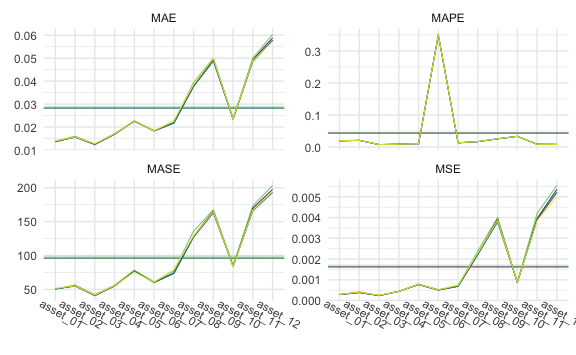

``` r
cv_large_5 %>% 
  gg_loss(
    y_large_test, 
    mean_line = TRUE, 
    line_param = list(size = .3),
    mean_param = list(alpha = .5, size = .3), 
    viridis = TRUE, 
    show.legend = FALSE
  ) +
  theme_minimal() +
  theme(
    axis.text.x = element_text(angle = -30, vjust = -1),
    legend.title = element_text(size = 8),
    legend.text = element_text(size = 7),
    legend.key.size = unit(.3, "cm")
  )
```

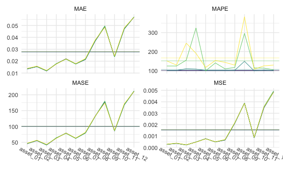

``` r
cv_large_20 %>% 
  gg_loss(
    y_large_test, 
    mean_line = TRUE, 
    line_param = list(size = .3),
    mean_param = list(alpha = .5, size = .3), 
    viridis = TRUE, 
    show.legend = FALSE
  ) +
  theme_minimal() +
  theme(
    axis.text.x = element_text(angle = -30, vjust = -1),
    legend.title = element_text(size = 8),
    legend.text = element_text(size = 7),
    legend.key.size = unit(.3, "cm")
  )
```

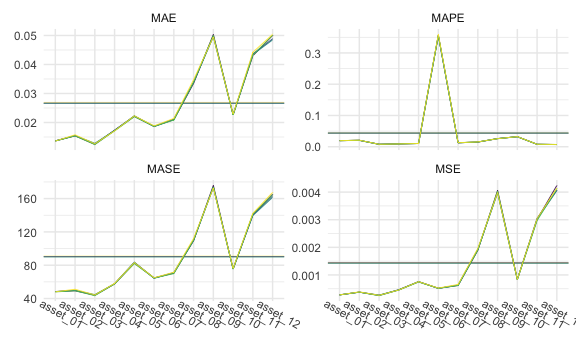

Tables

1-step:


    \begin{longtable}[t]{lllllll}
    \caption{\label{tab:largeone}LARGE Simulation - 1-step ahead Rolling Window Forecasting Loss}\\
    \toprule
    \multicolumn{1}{c}{ } & \multicolumn{1}{c}{ } & \multicolumn{2}{c}{Frequentist} & \multicolumn{1}{c}{BVAR} & \multicolumn{2}{c}{BVHAR} \\
    \cmidrule(l{3pt}r{3pt}){3-4} \cmidrule(l{3pt}r{3pt}){5-5} \cmidrule(l{3pt}r{3pt}){6-7}
     &  & VAR & VHAR & Minnesota & VAR-type & VHAR-type\\
    \midrule
    \endfirsthead
    \caption[]{LARGE Simulation - 1-step ahead Rolling Window Forecasting Loss \textit{(continued)}}\\
    \toprule
     &  & VAR & VHAR & Minnesota & VAR-type & VHAR-type\\
    \midrule
    \endhead

    \endfoot
    \bottomrule
    \endlastfoot
     & asset01 & \num{0.000286} & \num{0.000291} & \num{0.000272} & \textcolor{red}{\num{0.000272}} & \num{0.000272}\\
    \cmidrule{2-7}\nopagebreak
     & asset02 & \num{0.000419} & \num{0.000404} & \num{0.000362} & \textcolor{red}{\num{0.000362}} & \num{0.000362}\\
    \cmidrule{2-7}\nopagebreak
     & asset03 & \num{0.000244} & \num{0.000258} & \num{0.000239} & \num{0.000239} & \textcolor{red}{\num{0.000239}}\\
    \cmidrule{2-7}\nopagebreak
     & asset04 & \textcolor{red}{\num{0.000436}} & \num{0.000449} & \num{0.000466} & \num{0.000466} & \num{0.000464}\\
    \cmidrule{2-7}\nopagebreak
     & asset05 & \num{0.000819} & \num{0.00078} & \num{0.000761} & \num{0.000761} & \textcolor{red}{\num{0.000761}}\\
    \cmidrule{2-7}\nopagebreak
     & asset06 & \num{0.000525} & \num{0.000521} & \num{0.000495} & \num{0.000495} & \textcolor{red}{\num{0.000495}}\\
    \cmidrule{2-7}\nopagebreak
     & asset07 & \num{0.000715} & \num{0.00075} & \num{0.000669} & \num{0.000669} & \textcolor{red}{\num{0.000669}}\\
    \cmidrule{2-7}\nopagebreak
     & asset08 & \num{0.00238} & \num{0.0023} & \num{0.00216} & \num{0.00215} & \textcolor{red}{\num{0.00215}}\\
    \cmidrule{2-7}\nopagebreak
     & asset09 & \num{0.00377} & \num{0.00375} & \num{0.00369} & \num{0.00369} & \textcolor{red}{\num{0.00368}}\\
    \cmidrule{2-7}\nopagebreak
     & asset10 & \num{0.000925} & \num{0.000936} & \num{0.000871} & \textcolor{red}{\num{0.00087}} & \num{0.000871}\\
    \cmidrule{2-7}\nopagebreak
     & asset11 & \num{0.0041} & \num{0.00381} & \num{0.00367} & \num{0.00367} & \textcolor{red}{\num{0.00363}}\\
    \cmidrule{2-7}\nopagebreak
     & asset12 & \num{0.00515} & \textcolor{red}{\num{0.00482}} & \num{0.00489} & \num{0.00489} & \num{0.00489}\\
    \cmidrule{2-7}\nopagebreak
    \multirow{-13}{*}{\raggedright\arraybackslash MSE} & \cellcolor{gray}{Average} & \num{0.00165} & \num{0.00159} & \num{0.00154} & \num{0.00154} & \textcolor{red}{\num{0.00154}}\\
    \cmidrule{1-7}\pagebreak[0]
     & asset01 & \num{0.0137} & \num{0.0138} & \num{0.0133} & \textcolor{red}{\num{0.0133}} & \num{0.0133}\\
    \cmidrule{2-7}\nopagebreak
     & asset02 & \num{0.016} & \num{0.0157} & \num{0.0152} & \num{0.0152} & \textcolor{red}{\num{0.0152}}\\
    \cmidrule{2-7}\nopagebreak
     & asset03 & \num{0.0124} & \num{0.0128} & \num{0.012} & \textcolor{red}{\num{0.012}} & \num{0.0121}\\
    \cmidrule{2-7}\nopagebreak
     & asset04 & \textcolor{red}{\num{0.0172}} & \num{0.0172} & \num{0.0175} & \num{0.0175} & \num{0.0174}\\
    \cmidrule{2-7}\nopagebreak
     & asset05 & \num{0.0223} & \num{0.0223} & \num{0.0221} & \num{0.0221} & \textcolor{red}{\num{0.022}}\\
    \cmidrule{2-7}\nopagebreak
     & asset06 & \num{0.0184} & \num{0.0183} & \num{0.018} & \num{0.018} & \textcolor{red}{\num{0.018}}\\
    \cmidrule{2-7}\nopagebreak
     & asset07 & \num{0.0221} & \num{0.0229} & \textcolor{red}{\num{0.0215}} & \num{0.0215} & \num{0.0215}\\
    \cmidrule{2-7}\nopagebreak
     & asset08 & \num{0.0393} & \num{0.0386} & \num{0.037} & \num{0.037} & \textcolor{red}{\num{0.0369}}\\
    \cmidrule{2-7}\nopagebreak
     & asset09 & \num{0.0491} & \num{0.0493} & \num{0.0481} & \num{0.0481} & \textcolor{red}{\num{0.048}}\\
    \cmidrule{2-7}\nopagebreak
     & asset10 & \num{0.0239} & \num{0.0244} & \num{0.0236} & \num{0.0236} & \textcolor{red}{\num{0.0236}}\\
    \cmidrule{2-7}\nopagebreak
     & asset11 & \num{0.0493} & \num{0.049} & \num{0.0482} & \num{0.0482} & \textcolor{red}{\num{0.0478}}\\
    \cmidrule{2-7}\nopagebreak
     & asset12 & \num{0.0585} & \textcolor{red}{\num{0.0562}} & \num{0.0566} & \num{0.0566} & \num{0.0566}\\
    \cmidrule{2-7}\nopagebreak
    \multirow{-13}{*}{\raggedright\arraybackslash MAE} & \cellcolor{gray}{Average} & \num{0.0285} & \num{0.0284} & \num{0.0278} & \num{0.0278} & \textcolor{red}{\num{0.0277}}\\
    \cmidrule{1-7}\pagebreak[0]
     & asset01 & \num{191.13} & \num{160.864} & \textcolor{red}{\num{129.391}} & \num{131.085} & \num{131.723}\\
    \cmidrule{2-7}\nopagebreak
     & asset02 & \num{164.612} & \num{161.164} & \num{109.285} & \num{109.209} & \textcolor{red}{\num{107.991}}\\
    \cmidrule{2-7}\nopagebreak
     & asset03 & \num{387.577} & \num{357.399} & \num{150.338} & \num{151.499} & \textcolor{red}{\num{125.688}}\\
    \cmidrule{2-7}\nopagebreak
     & asset04 & \num{508.691} & \num{364.154} & \textcolor{red}{\num{244.025}} & \num{244.462} & \num{245.518}\\
    \cmidrule{2-7}\nopagebreak
     & asset05 & \num{142.361} & \num{140.963} & \textcolor{red}{\num{105.625}} & \num{106.107} & \num{105.796}\\
    \cmidrule{2-7}\nopagebreak
     & asset06 & \num{210.287} & \num{213.766} & \num{127.903} & \num{126.109} & \textcolor{red}{\num{125.974}}\\
    \cmidrule{2-7}\nopagebreak
     & asset07 & \num{216.531} & \num{187.629} & \num{106.55} & \textcolor{red}{\num{106.255}} & \num{106.385}\\
    \cmidrule{2-7}\nopagebreak
     & asset08 & \num{164.36} & \num{139.679} & \textcolor{red}{\num{108.643}} & \num{109.468} & \num{111.627}\\
    \cmidrule{2-7}\nopagebreak
     & asset09 & \textcolor{red}{\num{510.853}} & \num{1855.24} & \num{608.135} & \num{632.468} & \num{588.176}\\
    \cmidrule{2-7}\nopagebreak
     & asset10 & \num{136.385} & \num{127.286} & \num{99.679} & \textcolor{red}{\num{99.252}} & \num{102.347}\\
    \cmidrule{2-7}\nopagebreak
     & asset11 & \num{162.545} & \num{170.4} & \num{110.598} & \num{111.354} & \textcolor{red}{\num{110.133}}\\
    \cmidrule{2-7}\nopagebreak
     & asset12 & \num{117.685} & \num{114.881} & \textcolor{red}{\num{96.459}} & \num{96.5} & \num{96.957}\\
    \cmidrule{2-7}\nopagebreak
    \multirow{-13}{*}{\raggedright\arraybackslash MAPE} & \cellcolor{gray}{Average} & \num{242.751} & \num{332.785} & \num{166.386} & \num{168.647} & \textcolor{red}{\num{163.193}}\\
    \cmidrule{1-7}\pagebreak[0]
     & asset01 & \num{52.638} & \num{53.677} & \num{51.604} & \num{51.59} & \textcolor{red}{\num{51.588}}\\
    \cmidrule{2-7}\nopagebreak
     & asset02 & \num{59.243} & \num{58.243} & \textcolor{red}{\num{56.535}} & \num{56.538} & \num{56.54}\\
    \cmidrule{2-7}\nopagebreak
     & asset03 & \num{43.1} & \num{43.924} & \num{41.046} & \textcolor{red}{\num{41.035}} & \num{41.4}\\
    \cmidrule{2-7}\nopagebreak
     & asset04 & \num{59.395} & \num{59.35} & \num{59.389} & \num{59.388} & \textcolor{red}{\num{59.148}}\\
    \cmidrule{2-7}\nopagebreak
     & asset05 & \num{81.862} & \textcolor{red}{\num{79.36}} & \num{80.445} & \num{80.49} & \num{80.403}\\
    \cmidrule{2-7}\nopagebreak
     & asset06 & \num{64.354} & \num{63.88} & \num{62.217} & \num{62.162} & \textcolor{red}{\num{62.151}}\\
    \cmidrule{2-7}\nopagebreak
     & asset07 & \num{80.612} & \num{83.571} & \num{77.189} & \num{77.192} & \textcolor{red}{\num{77.165}}\\
    \cmidrule{2-7}\nopagebreak
     & asset08 & \num{142.706} & \num{136.1} & \num{133.93} & \num{133.918} & \textcolor{red}{\num{133.493}}\\
    \cmidrule{2-7}\nopagebreak
     & asset09 & \num{176.106} & \num{173.854} & \num{171.222} & \num{171.178} & \textcolor{red}{\num{171.128}}\\
    \cmidrule{2-7}\nopagebreak
     & asset10 & \num{90.484} & \num{89.516} & \num{88.263} & \num{88.335} & \textcolor{red}{\num{88.178}}\\
    \cmidrule{2-7}\nopagebreak
     & asset11 & \num{181.782} & \num{177.14} & \num{177.545} & \num{177.5} & \textcolor{red}{\num{175.859}}\\
    \cmidrule{2-7}\nopagebreak
     & asset12 & \num{213.014} & \num{204.263} & \num{203.161} & \num{202.941} & \textcolor{red}{\num{202.928}}\\
    \cmidrule{2-7}\nopagebreak
    \multirow{-13}{*}{\raggedright\arraybackslash MASE} & \cellcolor{gray}{Average} & \num{103.775} & \num{101.907} & \num{100.212} & \num{100.189} & \textcolor{red}{\num{99.998}}\\*
    \end{longtable}

5-step:


    \begin{longtable}[t]{lllllll}
    \caption{\label{tab:largefive}LARGE Simulation - 5-step ahead Rolling Window Forecasting Loss}\\
    \toprule
    \multicolumn{1}{c}{ } & \multicolumn{1}{c}{ } & \multicolumn{2}{c}{Frequentist} & \multicolumn{1}{c}{BVAR} & \multicolumn{2}{c}{BVHAR} \\
    \cmidrule(l{3pt}r{3pt}){3-4} \cmidrule(l{3pt}r{3pt}){5-5} \cmidrule(l{3pt}r{3pt}){6-7}
     &  & VAR & VHAR & Minnesota & VAR-type & VHAR-type\\
    \midrule
    \endfirsthead
    \caption[]{LARGE Simulation - 5-step ahead Rolling Window Forecasting Loss \textit{(continued)}}\\
    \toprule
     &  & VAR & VHAR & Minnesota & VAR-type & VHAR-type\\
    \midrule
    \endhead

    \endfoot
    \bottomrule
    \endlastfoot
     & asset01 & \num{0.000283} & \num{0.000298} & \num{0.000279} & \textcolor{red}{\num{0.000279}} & \num{0.000279}\\
    \cmidrule{2-7}\nopagebreak
     & asset02 & \num{0.000377} & \num{0.000387} & \num{0.000366} & \textcolor{red}{\num{0.000366}} & \num{0.000367}\\
    \cmidrule{2-7}\nopagebreak
     & asset03 & \textcolor{red}{\num{0.000232}} & \num{0.000248} & \num{0.000232} & \num{0.000232} & \num{0.000232}\\
    \cmidrule{2-7}\nopagebreak
     & asset04 & \num{0.000485} & \textcolor{red}{\num{0.000474}} & \num{0.000483} & \num{0.000483} & \num{0.000481}\\
    \cmidrule{2-7}\nopagebreak
     & asset05 & \num{0.000767} & \textcolor{red}{\num{0.00076}} & \num{0.000775} & \num{0.000775} & \num{0.000774}\\
    \cmidrule{2-7}\nopagebreak
     & asset06 & \num{0.000497} & \num{0.000508} & \num{0.000495} & \textcolor{red}{\num{0.000495}} & \num{0.000495}\\
    \cmidrule{2-7}\nopagebreak
     & asset07 & \num{0.00069} & \num{0.000701} & \num{0.000664} & \textcolor{red}{\num{0.000664}} & \num{0.000664}\\
    \cmidrule{2-7}\nopagebreak
     & asset08 & \num{0.00217} & \num{0.00218} & \num{0.00213} & \num{0.00213} & \textcolor{red}{\num{0.00213}}\\
    \cmidrule{2-7}\nopagebreak
     & asset09 & \num{0.00389} & \textcolor{red}{\num{0.00386}} & \num{0.00389} & \num{0.00389} & \num{0.00388}\\
    \cmidrule{2-7}\nopagebreak
     & asset10 & \num{0.000869} & \num{0.000903} & \num{0.000856} & \textcolor{red}{\num{0.000856}} & \num{0.000862}\\
    \cmidrule{2-7}\nopagebreak
     & asset11 & \num{0.00357} & \num{0.00354} & \num{0.00349} & \num{0.00349} & \textcolor{red}{\num{0.00347}}\\
    \cmidrule{2-7}\nopagebreak
     & asset12 & \num{0.00495} & \textcolor{red}{\num{0.00484}} & \num{0.00486} & \num{0.00486} & \num{0.00486}\\
    \cmidrule{2-7}\nopagebreak
    \multirow{-13}{*}{\raggedright\arraybackslash MSE} & \cellcolor{gray}{Average} & \num{0.00156} & \num{0.00156} & \num{0.00154} & \num{0.00154} & \textcolor{red}{\num{0.00154}}\\
    \cmidrule{1-7}\pagebreak[0]
     & asset01 & \num{0.0137} & \num{0.0139} & \textcolor{red}{\num{0.0135}} & \num{0.0135} & \num{0.0135}\\
    \cmidrule{2-7}\nopagebreak
     & asset02 & \num{0.0155} & \num{0.0159} & \num{0.0155} & \textcolor{red}{\num{0.0155}} & \num{0.0155}\\
    \cmidrule{2-7}\nopagebreak
     & asset03 & \num{0.0119} & \num{0.0123} & \num{0.0119} & \num{0.0119} & \textcolor{red}{\num{0.0119}}\\
    \cmidrule{2-7}\nopagebreak
     & asset04 & \num{0.0179} & \textcolor{red}{\num{0.0175}} & \num{0.0178} & \num{0.0178} & \num{0.0177}\\
    \cmidrule{2-7}\nopagebreak
     & asset05 & \textcolor{red}{\num{0.0216}} & \num{0.0219} & \num{0.022} & \num{0.022} & \num{0.022}\\
    \cmidrule{2-7}\nopagebreak
     & asset06 & \textcolor{red}{\num{0.0176}} & \num{0.018} & \num{0.0177} & \num{0.0177} & \num{0.0177}\\
    \cmidrule{2-7}\nopagebreak
     & asset07 & \num{0.0217} & \num{0.0222} & \num{0.0214} & \textcolor{red}{\num{0.0214}} & \num{0.0214}\\
    \cmidrule{2-7}\nopagebreak
     & asset08 & \num{0.0371} & \num{0.0378} & \num{0.0369} & \num{0.0369} & \textcolor{red}{\num{0.0368}}\\
    \cmidrule{2-7}\nopagebreak
     & asset09 & \num{0.0497} & \textcolor{red}{\num{0.0484}} & \num{0.0491} & \num{0.0491} & \num{0.049}\\
    \cmidrule{2-7}\nopagebreak
     & asset10 & \num{0.0237} & \num{0.0243} & \num{0.0237} & \num{0.0237} & \textcolor{red}{\num{0.0237}}\\
    \cmidrule{2-7}\nopagebreak
     & asset11 & \num{0.0473} & \num{0.048} & \num{0.0472} & \num{0.0472} & \textcolor{red}{\num{0.0469}}\\
    \cmidrule{2-7}\nopagebreak
     & asset12 & \num{0.0572} & \textcolor{red}{\num{0.0568}} & \num{0.0569} & \num{0.0569} & \num{0.0569}\\
    \cmidrule{2-7}\nopagebreak
    \multirow{-13}{*}{\raggedright\arraybackslash MAE} & \cellcolor{gray}{Average} & \num{0.0279} & \num{0.0281} & \num{0.0278} & \num{0.0278} & \textcolor{red}{\num{0.0277}}\\
    \cmidrule{1-7}\pagebreak[0]
     & asset01 & \num{123.693} & \num{150.546} & \num{100} & \textcolor{red}{\num{100}} & \num{100.187}\\
    \cmidrule{2-7}\nopagebreak
     & asset02 & \num{123.677} & \num{128.848} & \num{100.001} & \textcolor{red}{\num{100.001}} & \num{100.29}\\
    \cmidrule{2-7}\nopagebreak
     & asset03 & \num{154.451} & \num{244.588} & \textcolor{red}{\num{100.001}} & \num{100.001} & \num{109.374}\\
    \cmidrule{2-7}\nopagebreak
     & asset04 & \num{323.994} & \num{190.728} & \num{100} & \textcolor{red}{\num{100}} & \num{107.47}\\
    \cmidrule{2-7}\nopagebreak
     & asset05 & \textcolor{red}{\num{98.245}} & \num{116.319} & \num{100} & \num{100} & \num{99.856}\\
    \cmidrule{2-7}\nopagebreak
     & asset06 & \num{139.932} & \num{152.983} & \num{100.001} & \textcolor{red}{\num{100.001}} & \num{100.243}\\
    \cmidrule{2-7}\nopagebreak
     & asset07 & \num{108.823} & \num{143.027} & \num{100} & \textcolor{red}{\num{100}} & \num{100.22}\\
    \cmidrule{2-7}\nopagebreak
     & asset08 & \num{116.387} & \num{128.354} & \textcolor{red}{\num{100.002}} & \num{100.003} & \num{101.4}\\
    \cmidrule{2-7}\nopagebreak
     & asset09 & \num{296.2} & \num{383.098} & \num{99.989} & \textcolor{red}{\num{99.986}} & \num{148.57}\\
    \cmidrule{2-7}\nopagebreak
     & asset10 & \num{113.495} & \num{107.022} & \num{100} & \num{100} & \textcolor{red}{\num{98.141}}\\
    \cmidrule{2-7}\nopagebreak
     & asset11 & \num{112.792} & \num{124.638} & \textcolor{red}{\num{100}} & \num{100} & \num{101.867}\\
    \cmidrule{2-7}\nopagebreak
     & asset12 & \num{103.66} & \num{128.646} & \num{99.999} & \num{99.999} & \textcolor{red}{\num{99.731}}\\
    \cmidrule{2-7}\nopagebreak
    \multirow{-13}{*}{\raggedright\arraybackslash MAPE} & \cellcolor{gray}{Average} & \num{151.279} & \num{166.566} & \num{99.999} & \textcolor{red}{\num{99.999}} & \num{105.612}\\
    \cmidrule{1-7}\pagebreak[0]
     & asset01 & \num{46.138} & \num{47.155} & \num{45.793} & \num{45.793} & \textcolor{red}{\num{45.783}}\\
    \cmidrule{2-7}\nopagebreak
     & asset02 & \num{56.107} & \num{56.578} & \num{55.513} & \textcolor{red}{\num{55.513}} & \num{55.523}\\
    \cmidrule{2-7}\nopagebreak
     & asset03 & \num{41.951} & \num{43.44} & \num{41.749} & \textcolor{red}{\num{41.749}} & \num{41.756}\\
    \cmidrule{2-7}\nopagebreak
     & asset04 & \num{64.538} & \textcolor{red}{\num{62.566}} & \num{63.272} & \num{63.272} & \num{63.167}\\
    \cmidrule{2-7}\nopagebreak
     & asset05 & \textcolor{red}{\num{77.86}} & \num{79.082} & \num{79.112} & \num{79.112} & \num{79.079}\\
    \cmidrule{2-7}\nopagebreak
     & asset06 & \textcolor{red}{\num{62.216}} & \num{63.628} & \num{62.702} & \num{62.702} & \num{62.71}\\
    \cmidrule{2-7}\nopagebreak
     & asset07 & \textcolor{red}{\num{79.307}} & \num{81.695} & \num{79.53} & \num{79.53} & \num{79.538}\\
    \cmidrule{2-7}\nopagebreak
     & asset08 & \textcolor{red}{\num{130.991}} & \num{132.348} & \num{132.127} & \num{132.127} & \num{131.984}\\
    \cmidrule{2-7}\nopagebreak
     & asset09 & \num{180.746} & \textcolor{red}{\num{174.058}} & \num{177.69} & \num{177.69} & \num{177.678}\\
    \cmidrule{2-7}\nopagebreak
     & asset10 & \num{86.136} & \num{87.442} & \num{85.868} & \num{85.868} & \textcolor{red}{\num{85.825}}\\
    \cmidrule{2-7}\nopagebreak
     & asset11 & \num{168.792} & \num{171.515} & \num{168.953} & \num{168.953} & \textcolor{red}{\num{167.689}}\\
    \cmidrule{2-7}\nopagebreak
     & asset12 & \num{212.332} & \textcolor{red}{\num{210.461}} & \num{210.932} & \num{210.932} & \num{210.89}\\
    \cmidrule{2-7}\nopagebreak
    \multirow{-13}{*}{\raggedright\arraybackslash MASE} & \cellcolor{gray}{Average} & \num{100.593} & \num{100.831} & \num{100.27} & \num{100.27} & \textcolor{red}{\num{100.135}}\\*
    \end{longtable}

20-step:


    \begin{longtable}[t]{lllllll}
    \caption{\label{tab:largetwenty}LARGE Simulation - 20-step ahead Rolling Window Forecasting Loss}\\
    \toprule
    \multicolumn{1}{c}{ } & \multicolumn{1}{c}{ } & \multicolumn{2}{c}{Frequentist} & \multicolumn{1}{c}{BVAR} & \multicolumn{2}{c}{BVHAR} \\
    \cmidrule(l{3pt}r{3pt}){3-4} \cmidrule(l{3pt}r{3pt}){5-5} \cmidrule(l{3pt}r{3pt}){6-7}
     &  & VAR & VHAR & Minnesota & VAR-type & VHAR-type\\
    \midrule
    \endfirsthead
    \caption[]{LARGE Simulation - 20-step ahead Rolling Window Forecasting Loss \textit{(continued)}}\\
    \toprule
     &  & VAR & VHAR & Minnesota & VAR-type & VHAR-type\\
    \midrule
    \endhead

    \endfoot
    \bottomrule
    \endlastfoot
     & asset01 & \num{0.000289} & \textcolor{red}{\num{0.000286}} & \num{0.000289} & \num{0.000289} & \num{0.000289}\\
    \cmidrule{2-7}\nopagebreak
     & asset02 & \num{0.000385} & \num{0.000393} & \num{0.000385} & \num{0.000385} & \textcolor{red}{\num{0.000385}}\\
    \cmidrule{2-7}\nopagebreak
     & asset03 & \num{0.000242} & \num{0.00025} & \textcolor{red}{\num{0.000242}} & \num{0.000242} & \num{0.000242}\\
    \cmidrule{2-7}\nopagebreak
     & asset04 & \num{0.000474} & \textcolor{red}{\num{0.000467}} & \num{0.000474} & \num{0.000474} & \num{0.000473}\\
    \cmidrule{2-7}\nopagebreak
     & asset05 & \num{0.000742} & \textcolor{red}{\num{0.000741}} & \num{0.000742} & \num{0.000742} & \num{0.000742}\\
    \cmidrule{2-7}\nopagebreak
     & asset06 & \textcolor{red}{\num{0.000525}} & \num{0.000533} & \num{0.000525} & \num{0.000525} & \num{0.000525}\\
    \cmidrule{2-7}\nopagebreak
     & asset07 & \num{0.000656} & \num{0.000674} & \num{0.000656} & \num{0.000656} & \textcolor{red}{\num{0.000656}}\\
    \cmidrule{2-7}\nopagebreak
     & asset08 & \num{0.00194} & \num{0.00198} & \num{0.00194} & \num{0.00194} & \textcolor{red}{\num{0.00194}}\\
    \cmidrule{2-7}\nopagebreak
     & asset09 & \num{0.00407} & \num{0.0041} & \num{0.00407} & \num{0.00407} & \textcolor{red}{\num{0.00406}}\\
    \cmidrule{2-7}\nopagebreak
     & asset10 & \num{0.000839} & \num{0.000858} & \num{0.000839} & \num{0.000839} & \textcolor{red}{\num{0.000838}}\\
    \cmidrule{2-7}\nopagebreak
     & asset11 & \num{0.00319} & \num{0.00324} & \num{0.00319} & \num{0.00319} & \textcolor{red}{\num{0.00318}}\\
    \cmidrule{2-7}\nopagebreak
     & asset12 & \textcolor{red}{\num{0.00449}} & \num{0.0046} & \num{0.00449} & \num{0.00449} & \num{0.00449}\\
    \cmidrule{2-7}\nopagebreak
    \multirow{-13}{*}{\raggedright\arraybackslash MSE} & \cellcolor{gray}{Average} & \num{0.00149} & \num{0.00151} & \num{0.00149} & \num{0.00149} & \textcolor{red}{\num{0.00148}}\\
    \cmidrule{1-7}\pagebreak[0]
     & asset01 & \num{0.0138} & \textcolor{red}{\num{0.0137}} & \num{0.0138} & \num{0.0138} & \num{0.0138}\\
    \cmidrule{2-7}\nopagebreak
     & asset02 & \num{0.0158} & \num{0.016} & \num{0.0158} & \num{0.0158} & \textcolor{red}{\num{0.0158}}\\
    \cmidrule{2-7}\nopagebreak
     & asset03 & \num{0.0122} & \num{0.0124} & \textcolor{red}{\num{0.0122}} & \num{0.0122} & \num{0.0122}\\
    \cmidrule{2-7}\nopagebreak
     & asset04 & \num{0.0175} & \textcolor{red}{\num{0.0174}} & \num{0.0175} & \num{0.0175} & \num{0.0175}\\
    \cmidrule{2-7}\nopagebreak
     & asset05 & \num{0.0215} & \num{0.0217} & \num{0.0215} & \num{0.0215} & \textcolor{red}{\num{0.0215}}\\
    \cmidrule{2-7}\nopagebreak
     & asset06 & \num{0.0186} & \num{0.0188} & \num{0.0186} & \num{0.0186} & \textcolor{red}{\num{0.0186}}\\
    \cmidrule{2-7}\nopagebreak
     & asset07 & \num{0.0215} & \num{0.0219} & \num{0.0215} & \num{0.0215} & \textcolor{red}{\num{0.0215}}\\
    \cmidrule{2-7}\nopagebreak
     & asset08 & \num{0.0344} & \num{0.0352} & \num{0.0344} & \num{0.0344} & \textcolor{red}{\num{0.0344}}\\
    \cmidrule{2-7}\nopagebreak
     & asset09 & \num{0.0499} & \num{0.0501} & \num{0.0499} & \num{0.0499} & \textcolor{red}{\num{0.0499}}\\
    \cmidrule{2-7}\nopagebreak
     & asset10 & \num{0.0234} & \num{0.0239} & \num{0.0234} & \num{0.0234} & \textcolor{red}{\num{0.0234}}\\
    \cmidrule{2-7}\nopagebreak
     & asset11 & \num{0.0453} & \num{0.0457} & \num{0.0453} & \num{0.0453} & \textcolor{red}{\num{0.0452}}\\
    \cmidrule{2-7}\nopagebreak
     & asset12 & \num{0.0548} & \num{0.0555} & \num{0.0548} & \num{0.0548} & \textcolor{red}{\num{0.0548}}\\
    \cmidrule{2-7}\nopagebreak
    \multirow{-13}{*}{\raggedright\arraybackslash MAE} & \cellcolor{gray}{Average} & \num{0.0274} & \num{0.0277} & \num{0.0274} & \num{0.0274} & \textcolor{red}{\num{0.0274}}\\
    \cmidrule{1-7}\pagebreak[0]
     & asset01 & \num{100.069} & \num{125.252} & \num{100} & \num{100} & \textcolor{red}{\num{99.837}}\\
    \cmidrule{2-7}\nopagebreak
     & asset02 & \num{100.038} & \num{115.499} & \num{100} & \num{100} & \textcolor{red}{\num{99.962}}\\
    \cmidrule{2-7}\nopagebreak
     & asset03 & \num{100.416} & \num{201} & \num{100} & \num{100} & \textcolor{red}{\num{99.951}}\\
    \cmidrule{2-7}\nopagebreak
     & asset04 & \num{100.941} & \num{185.291} & \num{100} & \textcolor{red}{\num{100}} & \num{116.044}\\
    \cmidrule{2-7}\nopagebreak
     & asset05 & \num{100.058} & \num{102.464} & \num{100} & \num{100} & \textcolor{red}{\num{99.999}}\\
    \cmidrule{2-7}\nopagebreak
     & asset06 & \num{99.989} & \num{111.004} & \num{100} & \num{100} & \textcolor{red}{\num{99.989}}\\
    \cmidrule{2-7}\nopagebreak
     & asset07 & \num{100.034} & \num{109.833} & \num{100} & \num{100} & \textcolor{red}{\num{99.944}}\\
    \cmidrule{2-7}\nopagebreak
     & asset08 & \num{99.986} & \num{110.928} & \num{100} & \num{100} & \textcolor{red}{\num{99.455}}\\
    \cmidrule{2-7}\nopagebreak
     & asset09 & \num{100.077} & \num{213.129} & \num{100} & \textcolor{red}{\num{100}} & \num{106.16}\\
    \cmidrule{2-7}\nopagebreak
     & asset10 & \num{99.83} & \num{121.913} & \num{100} & \num{100} & \textcolor{red}{\num{99.771}}\\
    \cmidrule{2-7}\nopagebreak
     & asset11 & \num{99.941} & \num{115.85} & \num{100} & \num{100} & \textcolor{red}{\num{99.365}}\\
    \cmidrule{2-7}\nopagebreak
     & asset12 & \textcolor{red}{\num{99.923}} & \num{103.873} & \num{100} & \num{100} & \num{99.949}\\
    \cmidrule{2-7}\nopagebreak
    \multirow{-13}{*}{\raggedright\arraybackslash MAPE} & \cellcolor{gray}{Average} & \num{100.109} & \num{134.67} & \num{100} & \textcolor{red}{\num{100}} & \num{101.702}\\
    \cmidrule{1-7}\pagebreak[0]
     & asset01 & \num{50.539} & \textcolor{red}{\num{49.998}} & \num{50.539} & \num{50.539} & \num{50.561}\\
    \cmidrule{2-7}\nopagebreak
     & asset02 & \num{53.722} & \num{54.428} & \num{53.723} & \num{53.723} & \textcolor{red}{\num{53.718}}\\
    \cmidrule{2-7}\nopagebreak
     & asset03 & \num{45.075} & \num{45.768} & \textcolor{red}{\num{45.072}} & \num{45.072} & \num{45.075}\\
    \cmidrule{2-7}\nopagebreak
     & asset04 & \num{62.328} & \textcolor{red}{\num{61.965}} & \num{62.328} & \num{62.328} & \num{62.307}\\
    \cmidrule{2-7}\nopagebreak
     & asset05 & \num{82.386} & \num{83.047} & \num{82.379} & \num{82.379} & \textcolor{red}{\num{82.378}}\\
    \cmidrule{2-7}\nopagebreak
     & asset06 & \num{68.198} & \num{68.466} & \num{68.203} & \num{68.203} & \textcolor{red}{\num{68.196}}\\
    \cmidrule{2-7}\nopagebreak
     & asset07 & \num{74.985} & \num{75.831} & \num{74.983} & \num{74.983} & \textcolor{red}{\num{74.976}}\\
    \cmidrule{2-7}\nopagebreak
     & asset08 & \num{117.522} & \num{120.048} & \num{117.524} & \num{117.524} & \textcolor{red}{\num{117.339}}\\
    \cmidrule{2-7}\nopagebreak
     & asset09 & \num{180.11} & \num{181.297} & \num{180.106} & \num{180.106} & \textcolor{red}{\num{179.908}}\\
    \cmidrule{2-7}\nopagebreak
     & asset10 & \num{82.186} & \num{84.017} & \num{82.201} & \num{82.201} & \textcolor{red}{\num{82.135}}\\
    \cmidrule{2-7}\nopagebreak
     & asset11 & \num{156.479} & \num{157.13} & \num{156.515} & \num{156.515} & \textcolor{red}{\num{155.967}}\\
    \cmidrule{2-7}\nopagebreak
     & asset12 & \textcolor{red}{\num{195.851}} & \num{199.213} & \num{195.881} & \num{195.881} & \num{195.855}\\
    \cmidrule{2-7}\nopagebreak
    \multirow{-13}{*}{\raggedright\arraybackslash MASE} & \cellcolor{gray}{Average} & \num{97.448} & \num{98.434} & \num{97.455} & \num{97.455} & \textcolor{red}{\num{97.368}}\\*
    \end{longtable}

### Average

SMALL

1-step:

    \begin{table}

    \caption{\label{tab:smallonemean}SMALL Simulation - 1-step ahead Rolling Window Forecasting Average Loss}
    \centering
    \begin{tabular}[t]{llllll}
    \toprule
      & VAR & VHAR & BVAR-Minnesota & BVHAR-MN-VAR & BVHAR-MN-VHAR\\
    \midrule
    MSE & \num{0.00556} & \num{0.00543} & \num{0.00542} & \textcolor{red}{\num{0.00539}} & \num{0.00539}\\
    MAE & \num{0.05} & \num{0.049} & \num{0.0487} & \textcolor{red}{\num{0.0486}} & \num{0.0487}\\
    MAPE & \num{169.723} & \textcolor{red}{\num{158.236}} & \num{159.718} & \num{160.812} & \num{160.435}\\
    MASE & \num{112.869} & \num{110.465} & \num{109.757} & \textcolor{red}{\num{109.698}} & \num{109.828}\\
    \bottomrule
    \end{tabular}
    \end{table}

5-step:

    \begin{table}

    \caption{\label{tab:smallfivemean}SMALL Simulation - 5-step ahead Rolling Window Forecasting Average Loss}
    \centering
    \begin{tabular}[t]{llllll}
    \toprule
      & VAR & VHAR & BVAR-Minnesota & BVHAR-MN-VAR & BVHAR-MN-VHAR\\
    \midrule
    MSE & \num{0.00814} & \num{0.00809} & \num{0.00791} & \num{0.00792} & \textcolor{red}{\num{0.0079}}\\
    MAE & \num{0.0594} & \num{0.0595} & \num{0.0589} & \num{0.0589} & \textcolor{red}{\num{0.0588}}\\
    MAPE & \num{110.705} & \num{123.158} & \textcolor{red}{\num{100.969}} & \num{101.572} & \num{101.87}\\
    MASE & \num{134.359} & \textcolor{red}{\num{132.268}} & \num{132.504} & \num{132.563} & \num{132.456}\\
    \bottomrule
    \end{tabular}
    \end{table}

20-step:

    \begin{table}

    \caption{\label{tab:smalltwentyemean}SMALL Simulation - 20-step ahead Rolling Window Forecasting Average Loss}
    \centering
    \begin{tabular}[t]{llllll}
    \toprule
      & VAR & VHAR & BVAR-Minnesota & BVHAR-MN-VAR & BVHAR-MN-VHAR\\
    \midrule
    MSE & \num{0.00764} & \num{0.00766} & \textcolor{red}{\num{0.00764}} & \num{0.00766} & \num{0.00766}\\
    MAE & \num{0.0576} & \num{0.0577} & \textcolor{red}{\num{0.0576}} & \num{0.0577} & \num{0.0577}\\
    MAPE & \num{100.014} & \num{107.513} & \textcolor{red}{\num{100}} & \num{100.809} & \num{100.743}\\
    MASE & \num{129.196} & \num{129.274} & \textcolor{red}{\num{129.188}} & \num{129.447} & \num{129.413}\\
    \bottomrule
    \end{tabular}
    \end{table}

MEDIUM

1-step:

    \begin{table}

    \caption{\label{tab:medonemean}MEDIUM Simulation - 1-step ahead Rolling Window Forecasting Average Loss}
    \centering
    \begin{tabular}[t]{llllll}
    \toprule
      & VAR & VHAR & BVAR-Minnesota & BVHAR-MN-VAR & BVHAR-MN-VHAR\\
    \midrule
    MSE & \num{0.00155} & \num{0.00155} & \textcolor{red}{\num{0.00152}} & \num{0.00154} & \num{0.00154}\\
    MAE & \num{0.027} & \num{0.0269} & \textcolor{red}{\num{0.0266}} & \num{0.0267} & \num{0.0267}\\
    MAPE & \num{173.097} & \num{150.456} & \num{122.31} & \num{119.533} & \textcolor{red}{\num{116.638}}\\
    MASE & \num{97.542} & \num{97.753} & \textcolor{red}{\num{95.767}} & \num{96.257} & \num{96.33}\\
    \bottomrule
    \end{tabular}
    \end{table}

5-step:

    \begin{table}

    \caption{\label{tab:medfivemean}MEDIUM Simulation - 5-step ahead Rolling Window Forecasting Average Loss}
    \centering
    \begin{tabular}[t]{llllll}
    \toprule
      & VAR & VHAR & BVAR-Minnesota & BVHAR-MN-VAR & BVHAR-MN-VHAR\\
    \midrule
    MSE & \textcolor{red}{\num{0.00158}} & \num{0.0016} & \num{0.00159} & \num{0.00159} & \num{0.00158}\\
    MAE & \num{0.0272} & \num{0.0273} & \num{0.0271} & \textcolor{red}{\num{0.0271}} & \num{0.0271}\\
    MAPE & \num{127.161} & \num{131.302} & \num{99.987} & \textcolor{red}{\num{99.813}} & \num{100.822}\\
    MASE & \num{98.187} & \num{98.808} & \num{97.796} & \textcolor{red}{\num{97.772}} & \num{97.817}\\
    \bottomrule
    \end{tabular}
    \end{table}

20-step:

    \begin{table}

    \caption{\label{tab:medtwentyemean}MEDIUM Simulation - 20-step ahead Rolling Window Forecasting Average Loss}
    \centering
    \begin{tabular}[t]{llllll}
    \toprule
      & VAR & VHAR & BVAR-Minnesota & BVHAR-MN-VAR & BVHAR-MN-VHAR\\
    \midrule
    MSE & \num{0.00154} & \num{0.00154} & \textcolor{red}{\num{0.00154}} & \num{0.00154} & \num{0.00154}\\
    MAE & \num{0.0265} & \textcolor{red}{\num{0.0265}} & \num{0.0265} & \num{0.0265} & \num{0.0265}\\
    MAPE & \textcolor{red}{\num{99.985}} & \num{113.063} & \num{100} & \num{99.997} & \num{100.044}\\
    MASE & \num{94.147} & \textcolor{red}{\num{93.72}} & \num{94.147} & \num{94.147} & \num{94.169}\\
    \bottomrule
    \end{tabular}
    \end{table}

LARGE

1-step:

    \begin{table}

    \caption{\label{tab:largeonemean}LARGE Simulation - 1-step ahead Rolling Window Forecasting Average Loss}
    \centering
    \begin{tabular}[t]{llllll}
    \toprule
      & VAR & VHAR & BVAR-Minnesota & BVHAR-MN-VAR & BVHAR-MN-VHAR\\
    \midrule
    MSE & \num{0.00165} & \num{0.00159} & \num{0.00154} & \num{0.00154} & \textcolor{red}{\num{0.00154}}\\
    MAE & \num{0.0285} & \num{0.0284} & \num{0.0278} & \num{0.0278} & \textcolor{red}{\num{0.0277}}\\
    MAPE & \num{242.751} & \num{332.785} & \num{166.386} & \num{168.647} & \textcolor{red}{\num{163.193}}\\
    MASE & \num{103.775} & \num{101.907} & \num{100.212} & \num{100.189} & \textcolor{red}{\num{99.998}}\\
    \bottomrule
    \end{tabular}
    \end{table}

5-step:

    \begin{table}

    \caption{\label{tab:largefivemean}LARGE Simulation - 5-step ahead Rolling Window Forecasting Average Loss}
    \centering
    \begin{tabular}[t]{llllll}
    \toprule
      & VAR & VHAR & BVAR-Minnesota & BVHAR-MN-VAR & BVHAR-MN-VHAR\\
    \midrule
    MSE & \num{0.00156} & \num{0.00156} & \num{0.00154} & \num{0.00154} & \textcolor{red}{\num{0.00154}}\\
    MAE & \num{0.0279} & \num{0.0281} & \num{0.0278} & \num{0.0278} & \textcolor{red}{\num{0.0277}}\\
    MAPE & \num{151.279} & \num{166.566} & \num{99.999} & \textcolor{red}{\num{99.999}} & \num{105.612}\\
    MASE & \num{100.593} & \num{100.831} & \num{100.27} & \num{100.27} & \textcolor{red}{\num{100.135}}\\
    \bottomrule
    \end{tabular}
    \end{table}

20-step:

    \begin{table}

    \caption{\label{tab:largetwentyemean}LARGE Simulation - 20-step ahead Rolling Window Forecasting Average Loss}
    \centering
    \begin{tabular}[t]{llllll}
    \toprule
      & VAR & VHAR & BVAR-Minnesota & BVHAR-MN-VAR & BVHAR-MN-VHAR\\
    \midrule
    MSE & \num{0.00149} & \num{0.00151} & \num{0.00149} & \num{0.00149} & \textcolor{red}{\num{0.00148}}\\
    MAE & \num{0.0274} & \num{0.0277} & \num{0.0274} & \num{0.0274} & \textcolor{red}{\num{0.0274}}\\
    MAPE & \num{100.109} & \num{134.67} & \num{100} & \textcolor{red}{\num{100}} & \num{101.702}\\
    MASE & \num{97.448} & \num{98.434} & \num{97.455} & \num{97.455} & \textcolor{red}{\num{97.368}}\\
    \bottomrule
    \end{tabular}
    \end{table}

# Coefficients

``` r
bayes_small_mod <- mod_small_list[3:5]
names(bayes_small_mod) <- sapply(bayes_small_mod, function(x) x$process)
small_vec <- names(y_small_train)
names(small_vec) <- names(y_small_train)
# draw---------------------
set.seed(1)
bayes_small_plot <- 
  bayes_small_mod %>% 
  lapply(
    function(mods) {
      lapply(
        small_vec,
        function(x) {
          autoplot(summary(mods), var_name = x) +
            theme_minimal()
        }
      )
    }
  )
# save---------------------
lapply(
  seq_along(bayes_small_plot),
  function(x) {
    process_name <- names(bayes_small_plot)[x] # one of the processes
    p_list <- bayes_small_plot[[process_name]]
    asset_name <- names(p_list) # character vector: asset_01, asset_02, ...
    lapply(
      asset_name,
      function(y) {
        file_name <- 
          paste0(
            "../output/dgp03-figs/small-coef/", 
            str_replace_all(process_name, pattern = "\\_", replacement = "\\-"), 
            "-", 
            str_remove_all(y, pattern = "\\_"),
            ".pdf"
          )
        ggsave(filename = file_name, plot = p_list[[y]])
      }
    )
  }
)
```

``` r
bayes_medium_mod <- mod_medium_list[3:5]
names(bayes_medium_mod) <- sapply(bayes_medium_mod, function(x) x$process)
medium_vec <- names(y_medium_train)
names(medium_vec) <- names(y_medium_train)
# draw---------------------
set.seed(1)
bayes_medium_plot <- 
  bayes_medium_mod %>% 
  lapply(
    function(mods) {
      lapply(
        medium_vec,
        function(x) {
          autoplot(summary(mods), var_name = x) +
            theme_minimal()
        }
      )
    }
  )
# save---------------------
lapply(
  seq_along(bayes_medium_plot),
  function(x) {
    process_name <- names(bayes_medium_plot)[x] # one of the processes
    p_list <- bayes_medium_plot[[process_name]]
    asset_name <- names(p_list) # character vector: asset_01, asset_02, ...
    lapply(
      asset_name,
      function(y) {
        file_name <- 
          paste0(
            "../output/dgp03-figs/med-coef/", 
            str_replace_all(process_name, pattern = "\\_", replacement = "\\-"), 
            "-", 
            str_remove_all(y, pattern = "\\_"),
            ".pdf"
          )
        ggsave(filename = file_name, plot = p_list[[y]])
      }
    )
  }
)
```

``` r
bayes_large_mod <- mod_large_list[3:5]
names(bayes_large_mod) <- sapply(bayes_large_mod, function(x) x$process)
large_vec <- names(y_large_train)
names(large_vec) <- names(y_large_train)
# draw---------------------
set.seed(1)
bayes_large_plot <- 
  bayes_large_mod %>% 
  lapply(
    function(mods) {
      lapply(
        large_vec,
        function(x) {
          autoplot(summary(mods), var_name = x) +
            theme_minimal()
        }
      )
    }
  )
# save---------------------
lapply(
  seq_along(bayes_large_plot),
  function(x) {
    process_name <- names(bayes_large_plot)[x] # one of the processes
    p_list <- bayes_large_plot[[process_name]]
    asset_name <- names(p_list) # character vector: asset_01, asset_02, ...
    lapply(
      asset_name,
      function(y) {
        file_name <- 
          paste0(
            "../output/dgp03-figs/large-coef/", 
            str_replace_all(process_name, pattern = "\\_", replacement = "\\-"), 
            "-", 
            str_remove_all(y, pattern = "\\_"),
            ".pdf"
          )
        ggsave(filename = file_name, plot = p_list[[y]])
      }
    )
  }
)
```
