Simulating VHAR-type Minnesota BVHAR
================
Young Geun Kim
06 Jan, 2022

-   [BVHAR Coefficient](#bvhar-coefficient)
    -   [VAR-type Minnesota prior](#var-type-minnesota-prior)
    -   [VAR(5)](#var5)
        -   [SMALL](#small)
        -   [MEDIUM](#medium)
        -   [LARGE](#large)
-   [Modeling](#modeling)
    -   [VAR](#var)
    -   [VHAR](#vhar)
    -   [BVAR](#bvar)
    -   [BVHAR-VAR](#bvhar-var)
    -   [BVHAR-VHAR](#bvhar-vhar)
    -   [Hyperparameters](#hyperparameters)
-   [Errors](#errors)
    -   [Rolling Windows](#rolling-windows)
        -   [SMALL](#small-1)
        -   [MEDIUM](#medium-1)
        -   [LARGE](#large-1)
        -   [Lists](#lists)
    -   [Relative Error](#relative-error)
    -   [Piecewise Errors](#piecewise-errors)
        -   [SMALL](#small-2)
        -   [MEDIUM](#medium-2)
        -   [LARGE](#large-2)
        -   [Average](#average)
-   [Coefficients](#coefficients)

``` r
sim_data <- "../data/processed/bvharsim_dgp_l.rds"
```

``` r
# tidyverse----------------------------
library(tidyverse)
# BVHAR custom package-----------------
library(bvhar)
# Set the number of processor cores----
cl <- parallel::makeCluster(8, type = "FORK")
# set seed for reproducible result-----
set.seed(1)
```

``` r
# result table-------------------------
source("report-fns.R")
# hyperparameter setting table---------
source("param-fns.R")
# Simulation---------------------------
dgp <- readRDS(sim_data)
```

# BVHAR Coefficient

## VAR-type Minnesota prior

``` r
n_small <- length(bvhar_small_spec$sigma)
n_medium <- length(bvhar_medium_spec$sigma)
n_large <- length(bvhar_large_spec$sigma)
```

## VAR(5)

### SMALL

``` r
y_small_train <- dgp$y_small_train
y_small_test <- dgp$y_small_test
```

``` r
y_small_train %>% 
  mutate(train = TRUE) %>% 
  bind_rows(y_small_test %>% mutate(train = FALSE)) %>% 
  mutate(id = 1:n()) %>% 
  pivot_longer(-c(id, train), names_to = "asset", values_to = "value") %>% 
  ggplot(aes(x = id, y = value)) +
  annotate(
    geom = "rect",
    xmin = nrow(y_small_train),
    xmax = nrow(y_small_train) + nrow(y_small_test),
    ymin = -Inf,
    ymax = Inf,
    alpha = .7,
    fill = "grey" # test set
  ) +
  geom_path() +
  facet_grid(asset ~ ., scales = "free_y") +
  scale_x_continuous(
    breaks = c(nrow(y_small_train), nrow(y_small_train) + nrow(y_small_test))
  ) +
  theme_minimal() +
  theme(panel.border = element_rect(fill = NA)) +
  labs(
    x = element_blank(),
    y = element_blank()
  )
```

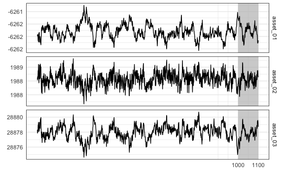

### MEDIUM

``` r
y_medium_train <- dgp$y_medium_train
y_medium_test <- dgp$y_medium_test
```

``` r
y_medium_train %>% 
  mutate(train = TRUE) %>% 
  bind_rows(y_medium_test %>% mutate(train = FALSE)) %>% 
  mutate(id = 1:n()) %>% 
  pivot_longer(-c(id, train), names_to = "asset", values_to = "value") %>% 
  ggplot(aes(x = id, y = value)) +
  annotate(
    geom = "rect",
    xmin = nrow(y_medium_train),
    xmax = nrow(y_medium_train) + nrow(y_medium_test),
    ymin = -Inf,
    ymax = Inf,
    alpha = .7,
    fill = "grey" # test set
  ) +
  geom_path() +
  facet_grid(asset ~ ., scales = "free_y") +
  scale_x_continuous(
    breaks = c(nrow(y_medium_train), nrow(y_medium_train) + nrow(y_medium_test))
  ) +
  theme_minimal() +
  theme(
    strip.text.y = element_text(size = 5), 
    panel.border = element_rect(fill = NA)
  ) +
  labs(
    x = element_blank(),
    y = element_blank()
  )
```

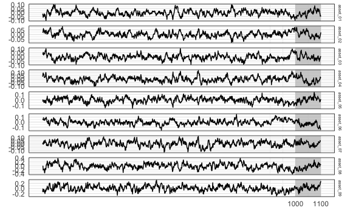

### LARGE

``` r
y_large_train <- dgp$y_large_train
y_large_test <- dgp$y_large_test
```

``` r
y_large_train %>% 
  mutate(train = TRUE) %>% 
  bind_rows(y_large_test %>% mutate(train = FALSE)) %>% 
  mutate(id = 1:n()) %>% 
  pivot_longer(-c(id, train), names_to = "asset", values_to = "value") %>% 
  ggplot(aes(x = id, y = value)) +
  annotate(
    geom = "rect",
    xmin = nrow(y_large_train),
    xmax = nrow(y_large_train) + nrow(y_large_test),
    ymin = -Inf,
    ymax = Inf,
    alpha = .7,
    fill = "grey" # test set
  ) +
  geom_path(size = .3) +
  facet_grid(asset ~ ., scales = "free_y") +
  scale_x_continuous(
    breaks = c(nrow(y_large_train), nrow(y_large_train) + nrow(y_large_test))
  ) +
  theme_minimal() +
  theme(
    strip.text.y = element_text(size = 5), 
    panel.border = element_rect(fill = NA),
    axis.text.y = element_text(size = 3)
  ) +
  labs(
    x = element_blank(),
    y = element_blank()
  )
```


# Modeling

## VAR

``` r
(var_lag <- 5)
#> [1] 5
```

``` r
fit_var_small <- var_lm(y_small_train, var_lag, include_mean = FALSE)
fit_var_medium <- var_lm(y_medium_train, var_lag, include_mean = FALSE)
fit_var_large <- var_lm(y_large_train, var_lag, include_mean = FALSE)
```

## VHAR

``` r
fit_vhar_small <- vhar_lm(y_small_train, include_mean = FALSE)
fit_vhar_medium <- vhar_lm(y_medium_train, include_mean = FALSE)
fit_vhar_large <- vhar_lm(y_large_train, include_mean = FALSE)
```

## BVAR

``` r
(bvar_lag <- 5)
#> [1] 5
```

``` r
bvar_small_spec <- set_bvar(
  sigma = bvhar_small_spec$sigma,
  lambda = bvhar_small_spec$lambda,
  delta = bvhar_small_spec$daily
)
#----------------------------
bvar_medium_spec <- set_bvar(
  sigma = bvhar_medium_spec$sigma,
  lambda = bvhar_medium_spec$lambda,
  delta = bvhar_medium_spec$daily
)
#----------------------------
bvar_large_spec <- set_bvar(
  sigma = bvhar_large_spec$sigma,
  lambda = bvhar_large_spec$lambda,
  delta = bvhar_large_spec$daily
)
```

``` r
(bvar_small_optim <- choose_bvar(
  bvar_small_spec, 
  lower = c(
    rep(1e-2, n_small), # sigma
    1e-3, # lambda
    rep(1e-2, n_small) # delta
  ), 
  upper = c(
    rep(1, n_small), # sigma
    Inf, # lambda
    rep(1, n_small) # delta
  ), 
  y = y_small_train, 
  p = bvar_lag, 
  include_mean = FALSE,
  parallel = list(cl = cl, forward = FALSE, loginfo = FALSE)
))
#> Model Specification for BVAR
#> 
#> Parameters: Coefficent matrice and Covariance matrix
#> Prior: Minnesota
#> # Type '?bvar_minnesota' in the console for some help.
#> ========================================================
#> 
#> Setting for 'sigma':
#> [1]  0.510  0.798  1.000
#> 
#> Setting for 'lambda':
#> [1]  0.0709
#> 
#> Setting for 'delta':
#> [1]  0.170  0.149  0.156
#> 
#> Setting for 'eps':
#> [1]  1e-04
```

``` r
(bvar_medium_optim <- choose_bvar(
  bvar_medium_spec, 
  lower = c(
    rep(1e-2, n_medium), # sigma
    1e-3, # lambda
    rep(1e-2, n_medium) # delta
  ), 
  upper = c(
    rep(1, n_medium), # sigma
    Inf, # lambda
    rep(1, n_medium) # delta
  ), 
  y = y_medium_train, 
  p = bvar_lag, 
  include_mean = FALSE,
  parallel = list(cl = cl, forward = FALSE, loginfo = FALSE)
))
#> Model Specification for BVAR
#> 
#> Parameters: Coefficent matrice and Covariance matrix
#> Prior: Minnesota
#> # Type '?bvar_minnesota' in the console for some help.
#> ========================================================
#> 
#> Setting for 'sigma':
#> [1]  0.562  0.586  0.888  1.000  1.000  0.900  1.000  1.000  1.000
#> 
#> Setting for 'lambda':
#> [1]  0.0653
#> 
#> Setting for 'delta':
#> [1]  0.1673  0.0951  0.1021  0.0927  0.0914  0.1234  0.1832  0.1342  0.1518
#> 
#> Setting for 'eps':
#> [1]  1e-04
```

``` r
(bvar_large_optim <- choose_bvar(
  bvar_large_spec, 
  lower = c(
    rep(1e-2, n_large), # sigma
    1e-3, # lambda
    rep(1e-2, n_large) # delta
  ), 
  upper = c(
    rep(1, n_large), # sigma
    Inf, # lambda
    rep(1, n_large) # delta
  ), 
  y = y_large_train, 
  p = bvar_lag, 
  include_mean = FALSE,
  parallel = list(cl = cl, forward = FALSE, loginfo = FALSE)
))
#> Model Specification for BVAR
#> 
#> Parameters: Coefficent matrice and Covariance matrix
#> Prior: Minnesota
#> # Type '?bvar_minnesota' in the console for some help.
#> ========================================================
#> 
#> Setting for 'sigma':
#>  [1]  0.753  0.798  0.857  1.000  1.000  0.871  1.000  1.000  1.000  1.000
#> [11]  1.000  1.000
#> 
#> Setting for 'lambda':
#> [1]  0.0317
#> 
#> Setting for 'delta':
#>  [1]  0.1222  0.1379  0.1161  0.1519  0.1161  0.1381  0.0867  0.1323  0.1194
#> [10]  0.1323  0.1266  0.1302
#> 
#> Setting for 'eps':
#> [1]  1e-04
```

``` r
fit_small_bvar <- bvar_small_optim$fit
fit_medium_bvar <- bvar_medium_optim$fit
fit_large_bvar <- bvar_large_optim$fit
```

## BVHAR-VAR

``` r
bvhar_var_small_spec <- set_bvhar(
  sigma = bvhar_small_spec$sigma,
  lambda = bvhar_small_spec$lambda,
  delta = bvhar_small_spec$daily
)
#-----------------------------------------
bvhar_var_medium_spec <- set_bvhar(
  sigma = bvhar_medium_spec$sigma,
  lambda = bvhar_medium_spec$lambda,
  delta = bvhar_medium_spec$daily
)
#-----------------------------------------
bvhar_var_large_spec <- set_bvhar(
  sigma = bvhar_large_spec$sigma,
  lambda = bvhar_large_spec$lambda,
  delta = bvhar_large_spec$daily
)
```

``` r
(bvhar_var_small_optim <- choose_bvhar(
  bvhar_var_small_spec, 
  lower = c(
    rep(1e-2, n_small), # sigma
    1e-3, # lambda
    rep(1e-2, n_small) # delta
  ), 
  upper = c(
    rep(1, n_small), # sigma
    Inf, # lambda
    rep(1, n_small) # delta
  ), 
  y = y_small_train, 
  include_mean = FALSE,
  parallel = list(cl = cl, forward = FALSE, loginfo = FALSE)
))
#> Model Specification for BVHAR
#> 
#> Parameters: Coefficent matrice and Covariance matrix
#> Prior: MN_VAR
#> # Type '?bvhar_minnesota' in the console for some help.
#> ========================================================
#> 
#> Setting for 'sigma':
#> [1]  0.993  1.000  1.000
#> 
#> Setting for 'lambda':
#> [1]  0.0542
#> 
#> Setting for 'delta':
#> [1]  0.188  0.152  0.166
#> 
#> Setting for 'eps':
#> [1]  1e-04
```

``` r
(bvhar_var_medium_optim <- choose_bvhar(
  bvhar_var_medium_spec, 
  lower = c(
    rep(1e-2, n_medium), # sigma
    1e-3, # lambda
    rep(1e-2, n_medium) # delta
  ), 
  upper = c(
    rep(1, n_medium), # sigma
    Inf, # lambda
    rep(1, n_medium) # delta
  ), 
  y = y_medium_train, 
  include_mean = FALSE,
  parallel = list(cl = cl, forward = FALSE, loginfo = FALSE)
))
#> Model Specification for BVHAR
#> 
#> Parameters: Coefficent matrice and Covariance matrix
#> Prior: MN_VAR
#> # Type '?bvhar_minnesota' in the console for some help.
#> ========================================================
#> 
#> Setting for 'sigma':
#> [1]  0.752  0.835  0.966  0.988  1.000  1.000  1.000  1.000  1.000
#> 
#> Setting for 'lambda':
#> [1]  0.001
#> 
#> Setting for 'delta':
#> [1]  0.1534  0.1182  0.1130  0.1048  0.0887  0.1292  0.1753  0.1231  0.1440
#> 
#> Setting for 'eps':
#> [1]  1e-04
```

``` r
(bvhar_var_large_optim <- choose_bvhar(
  bvhar_var_large_spec, 
  lower = c(
    rep(1e-2, n_large), # sigma
    1e-3, # lambda
    rep(1e-2, n_large) # delta
  ), 
  upper = c(
    rep(1, n_large), # sigma
    Inf, # lambda
    rep(1, n_large) # delta
  ), 
  y = y_large_train, 
  include_mean = FALSE,
  parallel = list(cl = cl, forward = FALSE, loginfo = FALSE)
))
#> Model Specification for BVHAR
#> 
#> Parameters: Coefficent matrice and Covariance matrix
#> Prior: MN_VAR
#> # Type '?bvhar_minnesota' in the console for some help.
#> ========================================================
#> 
#> Setting for 'sigma':
#>  [1]  0.772  0.813  0.899  1.000  1.000  0.847  1.000  1.000  1.000  1.000
#> [11]  1.000  1.000
#> 
#> Setting for 'lambda':
#> [1]  0.001
#> 
#> Setting for 'delta':
#>  [1]  0.1295  0.1404  0.1198  0.1522  0.1259  0.1236  0.0875  0.1557  0.1394
#> [10]  0.1307  0.1329  0.1373
#> 
#> Setting for 'eps':
#> [1]  1e-04
```

``` r
fit_bvhar_small_var <- bvhar_var_small_optim$fit
fit_bvhar_medium_var <- bvhar_var_medium_optim$fit
fit_bvhar_large_var <- bvhar_var_large_optim$fit
```

## BVHAR-VHAR

``` r
(bvhar_vhar_small_optim <- choose_bvhar(
  bvhar_small_spec, 
  lower = c(
    rep(1e-2, n_small), # sigma
    1e-3, # lambda
    rep(1e-2, n_small), # daily
    rep(1e-2, n_small), # weekly
    rep(1e-2, n_small) # monthly
  ), 
  upper = c(
    rep(1, n_small), # sigma
    Inf, # lambda
    rep(1, n_small), # daily
    rep(1, n_small), # weekly
    rep(1, n_small) # monthly
  ), 
  y = y_small_train, 
  include_mean = FALSE,
  parallel = list(cl = cl, forward = FALSE, loginfo = FALSE)
))
#> Model Specification for BVHAR
#> 
#> Parameters: Coefficent matrice and Covariance matrix
#> Prior: MN_VHAR
#> # Type '?bvhar_minnesota' in the console for some help.
#> ========================================================
#> 
#> Setting for 'sigma':
#> [1]  1.000  0.979  1.000
#> 
#> Setting for 'lambda':
#> [1]  0.0352
#> 
#> Setting for 'eps':
#> [1]  1e-04
#> 
#> Setting for 'daily':
#> [1]  0.126  0.134  0.132
#> 
#> Setting for 'weekly':
#> [1]  0.430  0.165  0.344
#> 
#> Setting for 'monthly':
#> [1]  0.0529  0.0957  0.0100
```

``` r
(bvhar_vhar_medium_optim <- choose_bvhar(
  bvhar_medium_spec, 
  lower = c(
    rep(1e-2, n_medium), # sigma
    1e-3, # lambda
    rep(1e-2, n_medium), # daily
    rep(1e-2, n_medium), # weekly
    rep(1e-2, n_medium) # monthly
  ), 
  upper = c(
    rep(1, n_medium), # sigma
    Inf, # lambda
    rep(1, n_medium), # daily
    rep(1, n_medium), # weekly
    rep(1, n_medium) # monthly
  ), 
  y = y_medium_train, 
  include_mean = FALSE,
  parallel = list(cl = cl, forward = FALSE, loginfo = FALSE)
))
#> Model Specification for BVHAR
#> 
#> Parameters: Coefficent matrice and Covariance matrix
#> Prior: MN_VHAR
#> # Type '?bvhar_minnesota' in the console for some help.
#> ========================================================
#> 
#> Setting for 'sigma':
#> [1]  0.744  0.829  0.962  0.985  1.000  1.000  1.000  1.000  1.000
#> 
#> Setting for 'lambda':
#> [1]  0.001
#> 
#> Setting for 'eps':
#> [1]  1e-04
#> 
#> Setting for 'daily':
#> [1]  0.0693  0.0490  0.0531  0.0559  0.0507  0.0775  0.1237  0.0589  0.0952
#> 
#> Setting for 'weekly':
#> [1]  0.533  0.485  0.437  0.364  0.263  0.360  0.351  0.442  0.289
#> 
#> Setting for 'monthly':
#> [1]  0.0100  0.0100  0.0777  0.0100  0.2271  0.0224  0.0100  0.0100  0.2395
```

``` r
(bvhar_vhar_large_optim <- choose_bvhar(
  bvhar_large_spec, 
  lower = c(
    rep(1e-2, n_large), # sigma
    1e-3, # lambda
    rep(1e-2, n_large), # daily
    rep(1e-2, n_large), # weekly
    rep(1e-2, n_large) # monthly
  ), 
  upper = c(
    rep(1, n_large), # sigma
    Inf, # lambda
    rep(1, n_large), # daily
    rep(1, n_large), # weekly
    rep(1, n_large) # monthly
  ), 
  y = y_large_train, 
  include_mean = FALSE,
  parallel = list(cl = cl, forward = FALSE, loginfo = FALSE)
))
#> Model Specification for BVHAR
#> 
#> Parameters: Coefficent matrice and Covariance matrix
#> Prior: MN_VHAR
#> # Type '?bvhar_minnesota' in the console for some help.
#> ========================================================
#> 
#> Setting for 'sigma':
#>  [1]  0.767  0.806  0.891  1.000  1.000  0.842  1.000  1.000  1.000  1.000
#> [11]  1.000  1.000
#> 
#> Setting for 'lambda':
#> [1]  0.001
#> 
#> Setting for 'eps':
#> [1]  1e-04
#> 
#> Setting for 'daily':
#>  [1]  0.0785  0.0855  0.0476  0.0912  0.0756  0.0800  0.0461  0.1126  0.1001
#> [10]  0.0452  0.0778  0.0913
#> 
#> Setting for 'weekly':
#>  [1]  0.368  0.379  0.507  0.415  0.372  0.303  0.283  0.270  0.223  0.551
#> [11]  0.366  0.327
#> 
#> Setting for 'monthly':
#>  [1]  0.0712  0.0100  0.0100  0.1031  0.0100  0.0216  0.0100  0.2466  0.3464
#> [10]  0.0838  0.2025  0.0100
```

``` r
fit_bvhar_small_vhar <- bvhar_vhar_small_optim$fit
fit_bvhar_medium_vhar <- bvhar_vhar_medium_optim$fit
fit_bvhar_large_vhar <- bvhar_vhar_large_optim$fit
```

``` r
parallel::stopCluster(cl)
```

## Hyperparameters


    \begin{longtable}[t]{lllrrrrrrrrrrrr}
    \caption{\label{tab:empdgp4}Empirical Bayes Results for DGP4.}\\
    \toprule
     &    &     & y1 & y2 & y3 & y4 & y5 & y6 & y7 & y8 & y9 & y10 & y11 & y12\\
    \midrule
    \endfirsthead
    \caption[]{Empirical Bayes Results for DGP4. \textit{(continued)}}\\
    \toprule
      &    &     & y1 & y2 & y3 & y4 & y5 & y6 & y7 & y8 & y9 & y10 & y11 & y12\\
    \midrule
    \endhead

    \endfoot
    \bottomrule
    \endlastfoot
    \addlinespace[0.3em]
    \multicolumn{15}{l}{\textbf{SMALL}}\\
    \hspace{1em} & BVAR & $\sigma$ & 0.510 & 0.798 & 1.000 &  &  &  &  &  &  &  &  & \\

    \hspace{1em} &  & $\lambda$ & 0.071 &  &  &  &  &  &  &  &  &  &  & \\

    \hspace{1em} &  & $\delta$ & 0.170 & 0.149 & 0.156 &  &  &  &  &  &  &  &  & \\
    \cmidrule{2-15}
    \hspace{1em} & BVHAR-S & $\sigma$ & 0.993 & 1.000 & 1.000 &  &  &  &  &  &  &  &  & \\

    \hspace{1em} &  & $\lambda$ & 0.054 &  &  &  &  &  &  &  &  &  &  & \\

    \hspace{1em} &  & $\delta$ & 0.188 & 0.152 & 0.166 &  &  &  &  &  &  &  &  & \\
    \cmidrule{2-15}
    \hspace{1em} & BVHAR-L & $\sigma$ & 1.000 & 0.979 & 1.000 &  &  &  &  &  &  &  &  & \\

    \hspace{1em} &  & $\lambda$ & 0.035 &  &  &  &  &  &  &  &  &  &  & \\

    \hspace{1em} &  & $d_i$ & 0.126 & 0.134 & 0.132 &  &  &  &  &  &  &  &  & \\

    \hspace{1em} &  & $w_i$ & 0.430 & 0.165 & 0.344 &  &  &  &  &  &  &  &  & \\

    \hspace{1em} &  & $m_i$ & 0.053 & 0.096 & 0.010 &  &  &  &  &  &  &  &  & \\
    \cmidrule{1-15}
    \addlinespace[0.3em]
    \multicolumn{15}{l}{\textbf{MEDIUM}}\\
    \hspace{1em} & BVAR & $\sigma$ & 0.562 & 0.586 & 0.888 & 1.000 & 1.000 & 0.900 & 1.000 & 1.000 & 1.000 &  &  & \\

    \hspace{1em} &  & $\lambda$ & 0.065 &  &  &  &  &  &  &  &  &  &  & \\

    \hspace{1em} &  & $\delta$ & 0.167 & 0.095 & 0.102 & 0.093 & 0.091 & 0.123 & 0.183 & 0.134 & 0.152 &  &  & \\
    \cmidrule{2-15}
    \hspace{1em} & BVHAR-S & $\sigma$ & 0.752 & 0.835 & 0.966 & 0.988 & 1.000 & 1.000 & 1.000 & 1.000 & 1.000 &  &  & \\

    \hspace{1em}\hspace{1em}\hspace{1em}\hspace{1em} &  & $\lambda$ & 0.001 &  &  &  &  &  &  &  &  &  &  & \\

    \hspace{1em} &  & $\delta$ & 0.153 & 0.118 & 0.113 & 0.105 & 0.089 & 0.129 & 0.175 & 0.123 & 0.144 &  &  & \\
    \cmidrule{2-15}
    \hspace{1em} & BVHAR-L & $\sigma$ & 0.744 & 0.829 & 0.962 & 0.985 & 1.000 & 1.000 & 1.000 & 1.000 & 1.000 &  &  & \\

     &  & $\lambda$ & 0.001 &  &  &  &  &  &  &  &  &  &  & \\

    \hspace{1em} &  & $d_i$ & 0.069 & 0.049 & 0.053 & 0.056 & 0.051 & 0.078 & 0.124 & 0.059 & 0.095 &  &  & \\

    \hspace{1em} &  & $w_i$ & 0.533 & 0.485 & 0.437 & 0.364 & 0.263 & 0.360 & 0.351 & 0.442 & 0.289 &  &  & \\

    \hspace{1em} &  & $m_i$ & 0.010 & 0.010 & 0.078 & 0.010 & 0.227 & 0.022 & 0.010 & 0.010 & 0.239 &  &  & \\
    \cmidrule{1-15}
    \addlinespace[0.3em]
    \multicolumn{15}{l}{\textbf{LARGE}}\\
    \hspace{1em} & BVAR & $\sigma$ & 0.753 & 0.798 & 0.857 & 1.000 & 1.000 & 0.871 & 1.000 & 1.000 & 1.000 & 1.000 & 1.000 & 1.000\\

    \hspace{1em} &  & $\lambda$ & 0.032 &  &  &  &  &  &  &  &  &  &  & \\

    \hspace{1em} &  & $\delta$ & 0.122 & 0.138 & 0.116 & 0.152 & 0.116 & 0.138 & 0.087 & 0.132 & 0.119 & 0.132 & 0.127 & 0.130\\
    \cmidrule{2-15}
    \hspace{1em} & BVHAR-S & $\sigma$ & 0.772 & 0.813 & 0.899 & 1.000 & 1.000 & 0.847 & 1.000 & 1.000 & 1.000 & 1.000 & 1.000 & 1.000\\

     &  & $\lambda$ & 0.001 &  &  &  &  &  &  &  &  &  &  & \\

    \hspace{1em} &  & $\delta$ & 0.129 & 0.140 & 0.120 & 0.152 & 0.126 & 0.124 & 0.087 & 0.156 & 0.139 & 0.131 & 0.133 & 0.137\\
    \cmidrule{2-15}
    \hspace{1em} & BVHAR-L & $\sigma$ & 0.767 & 0.806 & 0.891 & 1.000 & 1.000 & 0.842 & 1.000 & 1.000 & 1.000 & 1.000 & 1.000 & 1.000\\

     &  & $\lambda$ & 0.001 &  &  &  &  &  &  &  &  &  &  & \\

    \hspace{1em} &  & $d_i$ & 0.079 & 0.085 & 0.048 & 0.091 & 0.076 & 0.080 & 0.046 & 0.113 & 0.100 & 0.045 & 0.078 & 0.091\\

    \hspace{1em} &  & $w_i$ & 0.368 & 0.379 & 0.507 & 0.415 & 0.372 & 0.303 & 0.283 & 0.270 & 0.223 & 0.551 & 0.366 & 0.327\\

    \hspace{1em} &  & $m_i$ & 0.071 & 0.010 & 0.010 & 0.103 & 0.010 & 0.022 & 0.010 & 0.247 & 0.346 & 0.084 & 0.202 & 0.010\\*
    \end{longtable}

# Errors

## Rolling Windows

### SMALL

``` r
mod_small_list <- list(
  fit_var_small,
  fit_vhar_small,
  fit_small_bvar,
  fit_bvhar_small_var,
  fit_bvhar_small_vhar
)
# 1-step-----------
cv_small_1 <- 
  mod_small_list %>% 
  lapply(
    function(mod) {
      forecast_roll(mod, 1, y_small_test)
    }
  )
# 5-step-----------
cv_small_5 <- 
  mod_small_list %>% 
  lapply(
    function(mod) {
      forecast_roll(mod, 5, y_small_test)
    }
  )
# 20-step----------
cv_small_20 <- 
  mod_small_list %>% 
  lapply(
    function(mod) {
      forecast_roll(mod, 20, y_small_test)
    }
  )
```

### MEDIUM

``` r
mod_medium_list <- list(
  fit_var_medium,
  fit_vhar_medium,
  fit_medium_bvar,
  fit_bvhar_medium_var,
  fit_bvhar_medium_vhar
)
# 1-step-----------
cv_medium_1 <- 
  mod_medium_list %>% 
  lapply(
    function(mod) {
      forecast_roll(mod, 1, y_medium_test)
    }
  )
# 5-step-----------
cv_medium_5 <- 
  mod_medium_list %>% 
  lapply(
    function(mod) {
      forecast_roll(mod, 5, y_medium_test)
    }
  )
# 20-step----------
cv_medium_20 <- 
  mod_medium_list %>% 
  lapply(
    function(mod) {
      forecast_roll(mod, 20, y_medium_test)
    }
  )
```

### LARGE

``` r
mod_large_list <- list(
  fit_var_large,
  fit_vhar_large,
  fit_large_bvar,
  fit_bvhar_large_var,
  fit_bvhar_large_vhar
)
# 1-step-----------
cv_large_1 <- 
  mod_large_list %>% 
  lapply(
    function(mod) {
      forecast_roll(mod, 1, y_large_test)
    }
  )
# 5-step-----------
cv_large_5 <- 
  mod_large_list %>% 
  lapply(
    function(mod) {
      forecast_roll(mod, 5, y_large_test)
    }
  )
# 20-step----------
cv_large_20 <- 
  mod_large_list %>% 
  lapply(
    function(mod) {
      forecast_roll(mod, 20, y_large_test)
    }
  )
```

### Lists

``` r
# SMALL-------------------------------
cv_small_list <- 
  lapply(
    c(1, 5, 20),
    function(h) {
      mod_small_list %>% 
        lapply(
          function(mod) {
            forecast_roll(mod, h, y_small_test)
          }
        )
    }
  )
# MEDIUM------------------------------
cv_medium_list <- 
  lapply(
    c(1, 5, 20),
    function(h) {
      mod_small_list %>% 
        lapply(
          function(mod) {
            forecast_roll(mod, h, y_medium_test)
          }
        )
    }
  )
# LARGE-------------------------------
cv_large_list <- 
  lapply(
    c(1, 5, 20),
    function(h) {
      mod_small_list %>% 
        lapply(
          function(mod) {
            forecast_roll(mod, h, y_large_test)
          }
        )
    }
  )
```

## Relative Error

Set VAR as the benchmark model.

    \begin{table}[H]

    \caption{\label{tab:dgp4result}Out-of-sample forecasting performance measures for DGP4.}
    \centering
    \resizebox{\linewidth}{!}{
    \begin{tabular}[t]{cc|ccc|ccc|ccc|}
    \toprule
    \multicolumn{2}{c}{ } & \multicolumn{3}{c}{RMAFE} & \multicolumn{3}{c}{RMSFE} & \multicolumn{3}{c}{RMASE} \\
    \cmidrule(l{3pt}r{3pt}){3-5} \cmidrule(l{3pt}r{3pt}){6-8} \cmidrule(l{3pt}r{3pt}){9-11}
    \rotatebox{0}{} & \rotatebox{0}{} & \rotatebox{0}{$h = 1$} & \rotatebox{0}{$h = 5$} & \rotatebox{0}{$h = 20$} & \rotatebox{0}{$h = 1$} & \rotatebox{0}{$h = 5$} & \rotatebox{0}{$h = 20$} & \rotatebox{0}{$h = 1$} & \rotatebox{0}{$h = 5$} & \rotatebox{0}{$h = 20$}\\
    \midrule
     & VHAR & \textcolor{black}{\num{1.001}} & \textcolor{black}{\num{.987}} & \textcolor{red}{\num{.996}} & \textcolor{black}{\num{1.012}} & \textcolor{black}{\num{.977}} & \textcolor{black}{\num{1.002}} & \textcolor{black}{\num{1.002}} & \textcolor{red}{\num{.971}} & \textcolor{red}{\num{.994}}\\

     & BVAR & \textcolor{red}{\num{.981}} & \textcolor{black}{\num{.986}} & \textcolor{black}{\num{1.000}} & \textcolor{red}{\num{.979}} & \textcolor{black}{\num{.972}} & \textcolor{red}{\num{1.000}} & \textcolor{red}{\num{.977}} & \textcolor{black}{\num{.979}} & \textcolor{black}{\num{1.000}}\\

     & BVHAR-S & \textcolor{black}{\num{.989}} & \textcolor{black}{\num{.983}} & \textcolor{black}{\num{1.002}} & \textcolor{black}{\num{.993}} & \textcolor{black}{\num{.965}} & \textcolor{black}{\num{1.003}} & \textcolor{black}{\num{.990}} & \textcolor{black}{\num{.975}} & \textcolor{black}{\num{1.002}}\\

    \multirow{-4}{*}{\centering\arraybackslash SMALL} & BVHAR-L & \textcolor{black}{\num{.995}} & \textcolor{red}{\num{.980}} & \textcolor{black}{\num{1.002}} & \textcolor{black}{\num{1.000}} & \textcolor{red}{\num{.960}} & \textcolor{black}{\num{1.002}} & \textcolor{black}{\num{.995}} & \textcolor{black}{\num{.975}} & \textcolor{black}{\num{1.002}}\\
    \cmidrule{1-11}
     & VHAR & \textcolor{black}{\num{1.002}} & \textcolor{black}{\num{1.047}} & \textcolor{black}{\num{1.014}} & \textcolor{black}{\num{.995}} & \textcolor{black}{\num{1.060}} & \textcolor{black}{\num{1.020}} & \textcolor{black}{\num{1.008}} & \textcolor{black}{\num{1.055}} & \textcolor{black}{\num{1.019}}\\

     & BVAR & \textcolor{red}{\num{.965}} & \textcolor{black}{\num{.985}} & \textcolor{black}{\num{1.000}} & \textcolor{red}{\num{.964}} & \textcolor{black}{\num{.983}} & \textcolor{red}{\num{1.000}} & \textcolor{red}{\num{.968}} & \textcolor{black}{\num{.984}} & \textcolor{black}{\num{1.000}}\\

     & BVHAR-S & \textcolor{black}{\num{.971}} & \textcolor{red}{\num{.981}} & \textcolor{black}{\num{1.000}} & \textcolor{black}{\num{.968}} & \textcolor{red}{\num{.978}} & \textcolor{black}{\num{1.000}} & \textcolor{black}{\num{.975}} & \textcolor{red}{\num{.981}} & \textcolor{black}{\num{1.000}}\\

    \multirow{-4}{*}{\centering\arraybackslash MEDIUM} & BVHAR-L & \textcolor{black}{\num{.976}} & \textcolor{black}{\num{.984}} & \textcolor{red}{\num{1.000}} & \textcolor{black}{\num{.976}} & \textcolor{black}{\num{.981}} & \textcolor{black}{\num{1.000}} & \textcolor{black}{\num{.980}} & \textcolor{black}{\num{.984}} & \textcolor{red}{\num{1.000}}\\
    \cmidrule{1-11}
     & VHAR & \textcolor{black}{\num{.996}} & \textcolor{black}{\num{1.042}} & \textcolor{black}{\num{1.012}} & \textcolor{black}{\num{.982}} & \textcolor{black}{\num{1.065}} & \textcolor{black}{\num{1.017}} & \textcolor{black}{\num{.992}} & \textcolor{black}{\num{1.042}} & \textcolor{black}{\num{1.017}}\\

     & BVAR & \textcolor{black}{\num{.970}} & \textcolor{black}{\num{.992}} & \textcolor{black}{\num{1.000}} & \textcolor{black}{\num{.957}} & \textcolor{black}{\num{.992}} & \textcolor{black}{\num{1.000}} & \textcolor{black}{\num{.971}} & \textcolor{black}{\num{.991}} & \textcolor{black}{\num{1.000}}\\

     & BVHAR-S & \textcolor{red}{\num{.966}} & \textcolor{red}{\num{.991}} & \textcolor{red}{\num{1.000}} & \textcolor{red}{\num{.948}} & \textcolor{red}{\num{.990}} & \textcolor{red}{\num{1.000}} & \textcolor{red}{\num{.966}} & \textcolor{red}{\num{.990}} & \textcolor{red}{\num{1.000}}\\

    \multirow{-4}{*}{\centering\arraybackslash LARGE} & BVHAR-L & \textcolor{black}{\num{.968}} & \textcolor{black}{\num{.991}} & \textcolor{black}{\num{1.000}} & \textcolor{black}{\num{.952}} & \textcolor{black}{\num{.990}} & \textcolor{black}{\num{1.000}} & \textcolor{black}{\num{.968}} & \textcolor{black}{\num{.991}} & \textcolor{black}{\num{1.000}}\\
    \bottomrule
    \end{tabular}}
    \end{table}

## Piecewise Errors

### SMALL

Plots

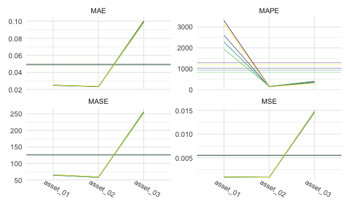

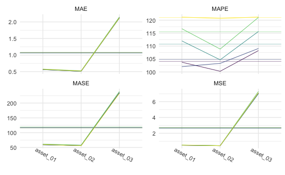

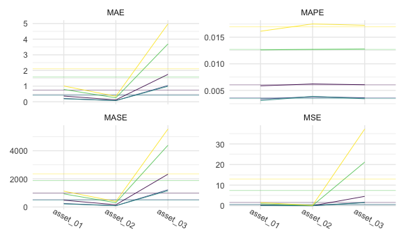

Tables

1-step:


    \begin{longtable}[t]{lllllll}
    \caption{\label{tab:smallone}SMALL Simulation - 1-step ahead Rolling Window Forecasting Loss}\\
    \toprule
    \multicolumn{1}{c}{ } & \multicolumn{1}{c}{ } & \multicolumn{2}{c}{Frequentist} & \multicolumn{1}{c}{BVAR} & \multicolumn{2}{c}{BVHAR} \\
    \cmidrule(l{3pt}r{3pt}){3-4} \cmidrule(l{3pt}r{3pt}){5-5} \cmidrule(l{3pt}r{3pt}){6-7}
     &  & VAR & VHAR & Minnesota & VAR-type & VHAR-type\\
    \midrule
    \endfirsthead
    \caption[]{SMALL Simulation - 1-step ahead Rolling Window Forecasting Loss \textit{(continued)}}\\
    \toprule
     &  & VAR & VHAR & Minnesota & VAR-type & VHAR-type\\
    \midrule
    \endhead

    \endfoot
    \bottomrule
    \endlastfoot
     & asset01 & \num{0.391} & \num{0.381} & \num{0.374} & \textcolor{red}{\num{0.372}} & \num{0.375}\\
    \cmidrule{2-7}\nopagebreak
     & asset02 & \num{0.356} & \num{0.343} & \num{0.339} & \num{0.339} & \textcolor{red}{\num{0.339}}\\
    \cmidrule{2-7}\nopagebreak
     & asset03 & \num{5.929} & \num{6.032} & \textcolor{red}{\num{5.82}} & \num{5.92} & \num{5.962}\\
    \cmidrule{2-7}\nopagebreak
    \multirow{-4}{*}{\raggedright\arraybackslash MSE} & \cellcolor{gray}{Average} & \num{2.225} & \num{2.252} & \textcolor{red}{\num{2.178}} & \num{2.21} & \num{2.225}\\
    \cmidrule{1-7}\pagebreak[0]
     & asset01 & \num{0.508} & \num{0.509} & \textcolor{red}{\num{0.5}} & \num{0.504} & \num{0.511}\\
    \cmidrule{2-7}\nopagebreak
     & asset02 & \num{0.473} & \num{0.473} & \textcolor{red}{\num{0.467}} & \num{0.468} & \num{0.468}\\
    \cmidrule{2-7}\nopagebreak
     & asset03 & \num{2.016} & \num{2.018} & \textcolor{red}{\num{1.974}} & \num{1.993} & \num{2.002}\\
    \cmidrule{2-7}\nopagebreak
    \multirow{-4}{*}{\raggedright\arraybackslash MAE} & \cellcolor{gray}{Average} & \num{0.999} & \num{1} & \textcolor{red}{\num{0.98}} & \num{0.988} & \num{0.994}\\
    \cmidrule{1-7}\pagebreak[0]
     & asset01 & \textcolor{red}{\num{158.519}} & \num{168.815} & \num{160.128} & \num{165.151} & \num{163.648}\\
    \cmidrule{2-7}\nopagebreak
     & asset02 & \num{152.342} & \textcolor{red}{\num{139.73}} & \num{146.798} & \num{142.433} & \num{140.295}\\
    \cmidrule{2-7}\nopagebreak
     & asset03 & \num{250.731} & \num{222.074} & \num{239.661} & \textcolor{red}{\num{221.196}} & \num{222.085}\\
    \cmidrule{2-7}\nopagebreak
    \multirow{-4}{*}{\raggedright\arraybackslash MAPE} & \cellcolor{gray}{Average} & \num{187.197} & \num{176.873} & \num{182.196} & \num{176.26} & \textcolor{red}{\num{175.343}}\\
    \cmidrule{1-7}\pagebreak[0]
     & asset01 & \num{56.413} & \num{57.329} & \textcolor{red}{\num{55.392}} & \num{56.215} & \num{57.316}\\
    \cmidrule{2-7}\nopagebreak
     & asset02 & \num{50.857} & \num{50.967} & \num{50.284} & \num{49.781} & \textcolor{red}{\num{49.65}}\\
    \cmidrule{2-7}\nopagebreak
     & asset03 & \num{221.222} & \num{220.774} & \textcolor{red}{\num{215.191}} & \num{219.254} & \num{219.954}\\
    \cmidrule{2-7}\nopagebreak
    \multirow{-4}{*}{\raggedright\arraybackslash MASE} & \cellcolor{gray}{Average} & \num{109.497} & \num{109.69} & \textcolor{red}{\num{106.956}} & \num{108.416} & \num{108.974}\\*
    \end{longtable}

5-step:


    \begin{longtable}[t]{lllllll}
    \caption{\label{tab:smallfive}SMALL Simulation - 5-step ahead Rolling Window Forecasting Loss}\\
    \toprule
    \multicolumn{1}{c}{ } & \multicolumn{1}{c}{ } & \multicolumn{2}{c}{Frequentist} & \multicolumn{1}{c}{BVAR} & \multicolumn{2}{c}{BVHAR} \\
    \cmidrule(l{3pt}r{3pt}){3-4} \cmidrule(l{3pt}r{3pt}){5-5} \cmidrule(l{3pt}r{3pt}){6-7}
     &  & VAR & VHAR & Minnesota & VAR-type & VHAR-type\\
    \midrule
    \endfirsthead
    \caption[]{SMALL Simulation - 5-step ahead Rolling Window Forecasting Loss \textit{(continued)}}\\
    \toprule
     &  & VAR & VHAR & Minnesota & VAR-type & VHAR-type\\
    \midrule
    \endhead

    \endfoot
    \bottomrule
    \endlastfoot
     & asset01 & \num{0.518} & \num{0.509} & \num{0.496} & \num{0.491} & \textcolor{red}{\num{0.49}}\\
    \cmidrule{2-7}\nopagebreak
     & asset02 & \num{0.444} & \num{0.427} & \num{0.427} & \num{0.426} & \textcolor{red}{\num{0.424}}\\
    \cmidrule{2-7}\nopagebreak
     & asset03 & \num{7.295} & \num{7.131} & \num{7.107} & \num{7.055} & \textcolor{red}{\num{7.01}}\\
    \cmidrule{2-7}\nopagebreak
    \multirow{-4}{*}{\raggedright\arraybackslash MSE} & \cellcolor{gray}{Average} & \num{2.752} & \num{2.689} & \num{2.676} & \num{2.657} & \textcolor{red}{\num{2.642}}\\
    \cmidrule{1-7}\pagebreak[0]
     & asset01 & \num{0.578} & \num{0.571} & \num{0.565} & \textcolor{red}{\num{0.562}} & \num{0.563}\\
    \cmidrule{2-7}\nopagebreak
     & asset02 & \num{0.526} & \num{0.518} & \num{0.513} & \num{0.513} & \textcolor{red}{\num{0.511}}\\
    \cmidrule{2-7}\nopagebreak
     & asset03 & \num{2.15} & \num{2.123} & \num{2.131} & \num{2.123} & \textcolor{red}{\num{2.114}}\\
    \cmidrule{2-7}\nopagebreak
    \multirow{-4}{*}{\raggedright\arraybackslash MAE} & \cellcolor{gray}{Average} & \num{1.085} & \num{1.071} & \num{1.07} & \num{1.066} & \textcolor{red}{\num{1.063}}\\
    \cmidrule{1-7}\pagebreak[0]
     & asset01 & \num{116.695} & \num{121.209} & \num{103.766} & \textcolor{red}{\num{102.059}} & \num{111.986}\\
    \cmidrule{2-7}\nopagebreak
     & asset02 & \num{108.845} & \num{120.616} & \textcolor{red}{\num{100.263}} & \num{103.315} & \num{104.696}\\
    \cmidrule{2-7}\nopagebreak
     & asset03 & \num{121.065} & \num{121.239} & \textcolor{red}{\num{108.248}} & \num{109.059} & \num{115.63}\\
    \cmidrule{2-7}\nopagebreak
    \multirow{-4}{*}{\raggedright\arraybackslash MAPE} & \cellcolor{gray}{Average} & \num{115.535} & \num{121.021} & \textcolor{red}{\num{104.092}} & \num{104.811} & \num{110.771}\\
    \cmidrule{1-7}\pagebreak[0]
     & asset01 & \num{61.611} & \num{60.023} & \num{59.448} & \textcolor{red}{\num{58.992}} & \num{59.53}\\
    \cmidrule{2-7}\nopagebreak
     & asset02 & \num{58.081} & \textcolor{red}{\num{55.928}} & \num{56.471} & \num{56.452} & \num{56.297}\\
    \cmidrule{2-7}\nopagebreak
     & asset03 & \num{239.17} & \textcolor{red}{\num{232.453}} & \num{235.262} & \num{234.295} & \num{234.209}\\
    \cmidrule{2-7}\nopagebreak
    \multirow{-4}{*}{\raggedright\arraybackslash MASE} & \cellcolor{gray}{Average} & \num{119.621} & \textcolor{red}{\num{116.135}} & \num{117.06} & \num{116.58} & \num{116.679}\\*
    \end{longtable}

20-step:


    \begin{longtable}[t]{lllllll}
    \caption{\label{tab:smalltwenty}SMALL Simulation - 20-step ahead Rolling Window Forecasting Loss}\\
    \toprule
    \multicolumn{1}{c}{ } & \multicolumn{1}{c}{ } & \multicolumn{2}{c}{Frequentist} & \multicolumn{1}{c}{BVAR} & \multicolumn{2}{c}{BVHAR} \\
    \cmidrule(l{3pt}r{3pt}){3-4} \cmidrule(l{3pt}r{3pt}){5-5} \cmidrule(l{3pt}r{3pt}){6-7}
     &  & VAR & VHAR & Minnesota & VAR-type & VHAR-type\\
    \midrule
    \endfirsthead
    \caption[]{SMALL Simulation - 20-step ahead Rolling Window Forecasting Loss \textit{(continued)}}\\
    \toprule
     &  & VAR & VHAR & Minnesota & VAR-type & VHAR-type\\
    \midrule
    \endhead

    \endfoot
    \bottomrule
    \endlastfoot
     & asset01 & \num{0.546} & \textcolor{red}{\num{0.542}} & \num{0.546} & \num{0.548} & \num{0.548}\\
    \cmidrule{2-7}\nopagebreak
     & asset02 & \num{0.41} & \textcolor{red}{\num{0.409}} & \num{0.41} & \num{0.41} & \num{0.411}\\
    \cmidrule{2-7}\nopagebreak
     & asset03 & \textcolor{red}{\num{7}} & \num{7.017} & \num{7} & \num{7.018} & \num{7.009}\\
    \cmidrule{2-7}\nopagebreak
    \multirow{-4}{*}{\raggedright\arraybackslash MSE} & \cellcolor{gray}{Average} & \textcolor{red}{\num{2.652}} & \num{2.656} & \num{2.652} & \num{2.659} & \num{2.656}\\
    \cmidrule{1-7}\pagebreak[0]
     & asset01 & \num{0.587} & \textcolor{red}{\num{0.582}} & \num{0.587} & \num{0.589} & \num{0.589}\\
    \cmidrule{2-7}\nopagebreak
     & asset02 & \num{0.501} & \textcolor{red}{\num{0.496}} & \num{0.501} & \num{0.502} & \num{0.502}\\
    \cmidrule{2-7}\nopagebreak
     & asset03 & \num{2.109} & \textcolor{red}{\num{2.107}} & \num{2.109} & \num{2.114} & \num{2.112}\\
    \cmidrule{2-7}\nopagebreak
    \multirow{-4}{*}{\raggedright\arraybackslash MAE} & \cellcolor{gray}{Average} & \num{1.066} & \textcolor{red}{\num{1.062}} & \num{1.066} & \num{1.068} & \num{1.068}\\
    \cmidrule{1-7}\pagebreak[0]
     & asset01 & \num{100.01} & \num{114.488} & \textcolor{red}{\num{99.999}} & \num{100.94} & \num{100.702}\\
    \cmidrule{2-7}\nopagebreak
     & asset02 & \num{100.018} & \textcolor{red}{\num{98.47}} & \num{100.002} & \num{100.334} & \num{100.779}\\
    \cmidrule{2-7}\nopagebreak
     & asset03 & \num{100.124} & \num{107.13} & \textcolor{red}{\num{100.018}} & \num{101.745} & \num{100.954}\\
    \cmidrule{2-7}\nopagebreak
    \multirow{-4}{*}{\raggedright\arraybackslash MAPE} & \cellcolor{gray}{Average} & \num{100.051} & \num{106.696} & \textcolor{red}{\num{100.006}} & \num{101.006} & \num{100.811}\\
    \cmidrule{1-7}\pagebreak[0]
     & asset01 & \num{61.111} & \textcolor{red}{\num{60.45}} & \num{61.112} & \num{61.269} & \num{61.252}\\
    \cmidrule{2-7}\nopagebreak
     & asset02 & \num{55.048} & \textcolor{red}{\num{54.011}} & \num{55.05} & \num{55.134} & \num{55.233}\\
    \cmidrule{2-7}\nopagebreak
     & asset03 & \num{231.428} & \textcolor{red}{\num{231.163}} & \num{231.417} & \num{231.919} & \num{231.678}\\
    \cmidrule{2-7}\nopagebreak
    \multirow{-4}{*}{\raggedright\arraybackslash MASE} & \cellcolor{gray}{Average} & \num{115.862} & \textcolor{red}{\num{115.208}} & \num{115.86} & \num{116.107} & \num{116.054}\\*
    \end{longtable}

### MEDIUM

Plots

``` r
cv_medium_1 %>% 
  gg_loss(
    y_medium_test, 
    mean_line = TRUE, 
    line_param = list(size = .3), 
    mean_param = list(alpha = .5, size = .3), 
    viridis = TRUE, 
    show.legend = FALSE
  ) +
  theme_minimal() +
  theme(
    axis.text.x = element_text(angle = -30, vjust = -1),
    legend.title = element_text(size = 8),
    legend.text = element_text(size = 7),
    legend.key.size = unit(.3, "cm")
  )
```

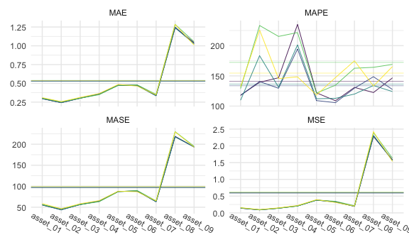

``` r
cv_medium_5 %>% 
  gg_loss(
    y_medium_test, 
    mean_line = TRUE, 
    line_param = list(size = .3), 
    mean_param = list(alpha = .5, size = .3), 
    viridis = TRUE, 
    show.legend = FALSE
  ) +
  theme_minimal() +
  theme(
    axis.text.x = element_text(angle = -30, vjust = -1),
    legend.title = element_text(size = 8),
    legend.text = element_text(size = 7),
    legend.key.size = unit(.3, "cm")
  )
```

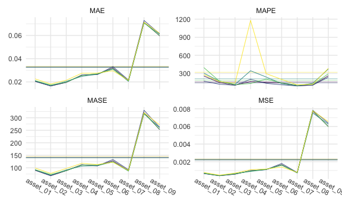

``` r
cv_medium_20 %>% 
  gg_loss(
    y_medium_test, 
    mean_line = TRUE, 
    line_param = list(size = .3), 
    mean_param = list(alpha = .5, size = .3), 
    viridis = TRUE, 
    show.legend = FALSE
  ) +
  theme_minimal() +
  theme(
    axis.text.x = element_text(angle = -30, vjust = -1),
    legend.title = element_text(size = 8),
    legend.text = element_text(size = 7),
    legend.key.size = unit(.3, "cm")
  )
```

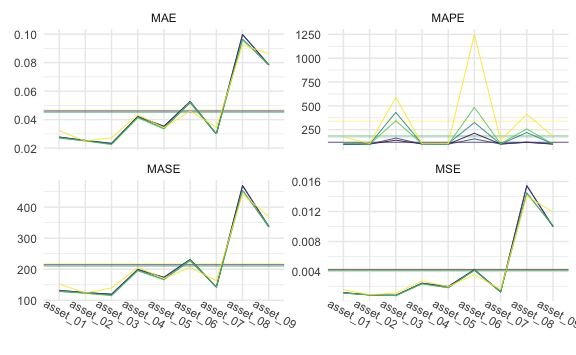

Tables

1-step:


    \begin{longtable}[t]{lllllll}
    \caption{\label{tab:medone}MEDIUM Simulation - 1-step ahead Rolling Window Forecasting Loss}\\
    \toprule
    \multicolumn{1}{c}{ } & \multicolumn{1}{c}{ } & \multicolumn{2}{c}{Frequentist} & \multicolumn{1}{c}{BVAR} & \multicolumn{2}{c}{BVHAR} \\
    \cmidrule(l{3pt}r{3pt}){3-4} \cmidrule(l{3pt}r{3pt}){5-5} \cmidrule(l{3pt}r{3pt}){6-7}
     &  & VAR & VHAR & Minnesota & VAR-type & VHAR-type\\
    \midrule
    \endfirsthead
    \caption[]{MEDIUM Simulation - 1-step ahead Rolling Window Forecasting Loss \textit{(continued)}}\\
    \toprule
     &  & VAR & VHAR & Minnesota & VAR-type & VHAR-type\\
    \midrule
    \endhead

    \endfoot
    \bottomrule
    \endlastfoot
     & asset01 & \num{0.15} & \num{0.154} & \textcolor{red}{\num{0.14}} & \num{0.144} & \num{0.143}\\
    \cmidrule{2-7}\nopagebreak
     & asset02 & \num{0.0943} & \num{0.0991} & \textcolor{red}{\num{0.0896}} & \num{0.0911} & \num{0.0898}\\
    \cmidrule{2-7}\nopagebreak
     & asset03 & \num{0.14} & \num{0.15} & \num{0.14} & \textcolor{red}{\num{0.14}} & \num{0.14}\\
    \cmidrule{2-7}\nopagebreak
     & asset04 & \textcolor{red}{\num{0.205}} & \num{0.219} & \num{0.206} & \num{0.212} & \num{0.206}\\
    \cmidrule{2-7}\nopagebreak
     & asset05 & \num{0.384} & \num{0.395} & \textcolor{red}{\num{0.38}} & \num{0.382} & \num{0.38}\\
    \cmidrule{2-7}\nopagebreak
     & asset06 & \num{0.343} & \textcolor{red}{\num{0.31}} & \num{0.333} & \num{0.332} & \num{0.319}\\
    \cmidrule{2-7}\nopagebreak
     & asset07 & \num{0.214} & \num{0.202} & \num{0.196} & \textcolor{red}{\num{0.194}} & \num{0.196}\\
    \cmidrule{2-7}\nopagebreak
     & asset08 & \num{2.393} & \num{2.424} & \textcolor{red}{\num{2.279}} & \num{2.313} & \num{2.298}\\
    \cmidrule{2-7}\nopagebreak
     & asset09 & \num{1.635} & \textcolor{red}{\num{1.533}} & \num{1.585} & \num{1.566} & \num{1.567}\\
    \cmidrule{2-7}\nopagebreak
    \multirow{-10}{*}{\raggedright\arraybackslash MSE} & \cellcolor{gray}{Average} & \num{0.618} & \num{0.61} & \num{0.594} & \num{0.597} & \textcolor{red}{\num{0.593}}\\
    \cmidrule{1-7}\pagebreak[0]
     & asset01 & \num{0.304} & \num{0.31} & \textcolor{red}{\num{0.296}} & \num{0.297} & \num{0.296}\\
    \cmidrule{2-7}\nopagebreak
     & asset02 & \num{0.255} & \num{0.256} & \num{0.243} & \num{0.243} & \textcolor{red}{\num{0.243}}\\
    \cmidrule{2-7}\nopagebreak
     & asset03 & \num{0.302} & \num{0.313} & \num{0.304} & \textcolor{red}{\num{0.301}} & \num{0.303}\\
    \cmidrule{2-7}\nopagebreak
     & asset04 & \textcolor{red}{\num{0.349}} & \num{0.364} & \num{0.356} & \num{0.362} & \num{0.355}\\
    \cmidrule{2-7}\nopagebreak
     & asset05 & \num{0.473} & \num{0.485} & \num{0.476} & \num{0.474} & \textcolor{red}{\num{0.473}}\\
    \cmidrule{2-7}\nopagebreak
     & asset06 & \num{0.48} & \textcolor{red}{\num{0.464}} & \num{0.474} & \num{0.476} & \num{0.469}\\
    \cmidrule{2-7}\nopagebreak
     & asset07 & \num{0.353} & \num{0.347} & \num{0.339} & \num{0.336} & \textcolor{red}{\num{0.333}}\\
    \cmidrule{2-7}\nopagebreak
     & asset08 & \num{1.285} & \num{1.284} & \num{1.241} & \num{1.25} & \textcolor{red}{\num{1.24}}\\
    \cmidrule{2-7}\nopagebreak
     & asset09 & \num{1.055} & \textcolor{red}{\num{1.01}} & \num{1.043} & \num{1.032} & \num{1.027}\\
    \cmidrule{2-7}\nopagebreak
    \multirow{-10}{*}{\raggedright\arraybackslash MAE} & \cellcolor{gray}{Average} & \num{0.54} & \num{0.537} & \num{0.53} & \num{0.53} & \textcolor{red}{\num{0.527}}\\
    \cmidrule{1-7}\pagebreak[0]
     & asset01 & \num{129.196} & \num{132.347} & \num{118.064} & \num{117.924} & \textcolor{red}{\num{109.813}}\\
    \cmidrule{2-7}\nopagebreak
     & asset02 & \num{233.344} & \num{225.766} & \textcolor{red}{\num{139.437}} & \num{140.729} & \num{183.436}\\
    \cmidrule{2-7}\nopagebreak
     & asset03 & \num{215.269} & \num{145.58} & \num{146.933} & \textcolor{red}{\num{129.55}} & \num{131.256}\\
    \cmidrule{2-7}\nopagebreak
     & asset04 & \num{221.653} & \textcolor{red}{\num{148.385}} & \num{235.102} & \num{194.499} & \num{201.255}\\
    \cmidrule{2-7}\nopagebreak
     & asset05 & \num{121.57} & \num{118.421} & \num{122.018} & \textcolor{red}{\num{109.145}} & \num{112.216}\\
    \cmidrule{2-7}\nopagebreak
     & asset06 & \num{134.668} & \num{147.318} & \num{108.907} & \textcolor{red}{\num{105.797}} & \num{112.925}\\
    \cmidrule{2-7}\nopagebreak
     & asset07 & \num{162.673} & \num{174.919} & \num{130.984} & \num{129.741} & \textcolor{red}{\num{119.985}}\\
    \cmidrule{2-7}\nopagebreak
     & asset08 & \num{164.187} & \num{133.222} & \textcolor{red}{\num{122.498}} & \num{148.659} & \num{134.095}\\
    \cmidrule{2-7}\nopagebreak
     & asset09 & \num{169.014} & \num{165.446} & \num{146.646} & \num{127.583} & \textcolor{red}{\num{124.136}}\\
    \cmidrule{2-7}\nopagebreak
    \multirow{-10}{*}{\raggedright\arraybackslash MAPE} & \cellcolor{gray}{Average} & \num{172.397} & \num{154.601} & \num{141.177} & \textcolor{red}{\num{133.736}} & \num{136.568}\\
    \cmidrule{1-7}\pagebreak[0]
     & asset01 & \num{56.149} & \num{58.662} & \textcolor{red}{\num{55.274}} & \num{56.325} & \num{55.413}\\
    \cmidrule{2-7}\nopagebreak
     & asset02 & \num{46.439} & \num{46.223} & \num{44.204} & \num{44.238} & \textcolor{red}{\num{43.675}}\\
    \cmidrule{2-7}\nopagebreak
     & asset03 & \num{56.29} & \num{58.446} & \num{56.618} & \textcolor{red}{\num{56.254}} & \num{56.58}\\
    \cmidrule{2-7}\nopagebreak
     & asset04 & \textcolor{red}{\num{63.223}} & \num{65.738} & \num{64.072} & \num{65.016} & \num{64.067}\\
    \cmidrule{2-7}\nopagebreak
     & asset05 & \textcolor{red}{\num{86.902}} & \num{88.103} & \num{87.492} & \num{87.489} & \num{87.39}\\
    \cmidrule{2-7}\nopagebreak
     & asset06 & \num{89.826} & \textcolor{red}{\num{86.898}} & \num{88.621} & \num{88.715} & \num{88.483}\\
    \cmidrule{2-7}\nopagebreak
     & asset07 & \num{65.138} & \num{65.104} & \num{63.205} & \num{63.264} & \textcolor{red}{\num{62.89}}\\
    \cmidrule{2-7}\nopagebreak
     & asset08 & \num{229.949} & \num{229.54} & \num{218.409} & \num{218.795} & \textcolor{red}{\num{217.25}}\\
    \cmidrule{2-7}\nopagebreak
     & asset09 & \num{195.174} & \num{193.289} & \num{193.955} & \textcolor{red}{\num{193.218}} & \num{193.595}\\
    \cmidrule{2-7}\nopagebreak
    \multirow{-10}{*}{\raggedright\arraybackslash MASE} & \cellcolor{gray}{Average} & \num{98.788} & \num{99.111} & \num{96.872} & \num{97.035} & \textcolor{red}{\num{96.594}}\\*
    \end{longtable}

5-step:


    \begin{longtable}[t]{lllllll}
    \caption{\label{tab:medfive}MEDIUM Simulation - 5-step ahead Rolling Window Forecasting Loss}\\
    \toprule
    \multicolumn{1}{c}{ } & \multicolumn{1}{c}{ } & \multicolumn{2}{c}{Frequentist} & \multicolumn{1}{c}{BVAR} & \multicolumn{2}{c}{BVHAR} \\
    \cmidrule(l{3pt}r{3pt}){3-4} \cmidrule(l{3pt}r{3pt}){5-5} \cmidrule(l{3pt}r{3pt}){6-7}
     &  & VAR & VHAR & Minnesota & VAR-type & VHAR-type\\
    \midrule
    \endfirsthead
    \caption[]{MEDIUM Simulation - 5-step ahead Rolling Window Forecasting Loss \textit{(continued)}}\\
    \toprule
     &  & VAR & VHAR & Minnesota & VAR-type & VHAR-type\\
    \midrule
    \endhead

    \endfoot
    \bottomrule
    \endlastfoot
     & asset01 & \num{0.157} & \num{0.167} & \num{0.155} & \textcolor{red}{\num{0.154}} & \num{0.158}\\
    \cmidrule{2-7}\nopagebreak
     & asset02 & \num{0.0968} & \num{0.1041} & \num{0.0933} & \textcolor{red}{\num{0.0928}} & \num{0.0937}\\
    \cmidrule{2-7}\nopagebreak
     & asset03 & \num{0.147} & \num{0.155} & \num{0.146} & \textcolor{red}{\num{0.145}} & \num{0.15}\\
    \cmidrule{2-7}\nopagebreak
     & asset04 & \num{0.216} & \num{0.225} & \num{0.212} & \num{0.211} & \textcolor{red}{\num{0.208}}\\
    \cmidrule{2-7}\nopagebreak
     & asset05 & \textcolor{red}{\num{0.368}} & \num{0.378} & \num{0.371} & \num{0.369} & \num{0.369}\\
    \cmidrule{2-7}\nopagebreak
     & asset06 & \num{0.364} & \textcolor{red}{\num{0.332}} & \num{0.365} & \num{0.364} & \num{0.356}\\
    \cmidrule{2-7}\nopagebreak
     & asset07 & \num{0.197} & \textcolor{red}{\num{0.194}} & \num{0.199} & \num{0.199} & \num{0.194}\\
    \cmidrule{2-7}\nopagebreak
     & asset08 & \num{2.339} & \num{2.407} & \num{2.316} & \num{2.33} & \textcolor{red}{\num{2.299}}\\
    \cmidrule{2-7}\nopagebreak
     & asset09 & \textcolor{red}{\num{1.635}} & \num{1.663} & \num{1.679} & \num{1.681} & \num{1.672}\\
    \cmidrule{2-7}\nopagebreak
    \multirow{-10}{*}{\raggedright\arraybackslash MSE} & \cellcolor{gray}{Average} & \num{0.613} & \num{0.625} & \num{0.615} & \num{0.616} & \textcolor{red}{\num{0.611}}\\
    \cmidrule{1-7}\pagebreak[0]
     & asset01 & \num{0.319} & \num{0.326} & \num{0.314} & \textcolor{red}{\num{0.312}} & \num{0.317}\\
    \cmidrule{2-7}\nopagebreak
     & asset02 & \num{0.257} & \num{0.263} & \num{0.25} & \textcolor{red}{\num{0.248}} & \num{0.253}\\
    \cmidrule{2-7}\nopagebreak
     & asset03 & \num{0.31} & \num{0.318} & \num{0.309} & \textcolor{red}{\num{0.307}} & \num{0.314}\\
    \cmidrule{2-7}\nopagebreak
     & asset04 & \num{0.367} & \num{0.376} & \num{0.363} & \num{0.362} & \textcolor{red}{\num{0.36}}\\
    \cmidrule{2-7}\nopagebreak
     & asset05 & \textcolor{red}{\num{0.464}} & \num{0.474} & \num{0.469} & \num{0.468} & \num{0.468}\\
    \cmidrule{2-7}\nopagebreak
     & asset06 & \num{0.499} & \textcolor{red}{\num{0.485}} & \num{0.5} & \num{0.5} & \num{0.499}\\
    \cmidrule{2-7}\nopagebreak
     & asset07 & \num{0.341} & \textcolor{red}{\num{0.333}} & \num{0.34} & \num{0.339} & \num{0.335}\\
    \cmidrule{2-7}\nopagebreak
     & asset08 & \num{1.253} & \num{1.27} & \num{1.246} & \num{1.252} & \textcolor{red}{\num{1.237}}\\
    \cmidrule{2-7}\nopagebreak
     & asset09 & \textcolor{red}{\num{1.047}} & \num{1.051} & \num{1.061} & \num{1.062} & \num{1.063}\\
    \cmidrule{2-7}\nopagebreak
    \multirow{-10}{*}{\raggedright\arraybackslash MAE} & \cellcolor{gray}{Average} & \num{0.54} & \num{0.544} & \num{0.539} & \num{0.539} & \textcolor{red}{\num{0.539}}\\
    \cmidrule{1-7}\pagebreak[0]
     & asset01 & \num{120.537} & \num{122.142} & \num{100.528} & \textcolor{red}{\num{99.991}} & \num{101.946}\\
    \cmidrule{2-7}\nopagebreak
     & asset02 & \num{158.943} & \num{216.04} & \num{127.437} & \textcolor{red}{\num{100.003}} & \num{127.231}\\
    \cmidrule{2-7}\nopagebreak
     & asset03 & \num{112.981} & \num{141.726} & \num{103.09} & \textcolor{red}{\num{100.004}} & \num{117.344}\\
    \cmidrule{2-7}\nopagebreak
     & asset04 & \num{112.904} & \num{193.381} & \textcolor{red}{\num{99.225}} & \num{99.999} & \num{103.97}\\
    \cmidrule{2-7}\nopagebreak
     & asset05 & \num{104.613} & \num{110.742} & \num{100.828} & \textcolor{red}{\num{100}} & \num{102.089}\\
    \cmidrule{2-7}\nopagebreak
     & asset06 & \num{105.309} & \num{119.315} & \num{100.419} & \textcolor{red}{\num{99.999}} & \num{108.898}\\
    \cmidrule{2-7}\nopagebreak
     & asset07 & \num{119.737} & \num{126.137} & \num{101.913} & \textcolor{red}{\num{99.987}} & \num{105.165}\\
    \cmidrule{2-7}\nopagebreak
     & asset08 & \num{105.641} & \num{118.1} & \textcolor{red}{\num{98.89}} & \num{100.001} & \num{99.042}\\
    \cmidrule{2-7}\nopagebreak
     & asset09 & \num{106.891} & \num{136.746} & \textcolor{red}{\num{99.651}} & \num{100.004} & \num{114.238}\\
    \cmidrule{2-7}\nopagebreak
    \multirow{-10}{*}{\raggedright\arraybackslash MAPE} & \cellcolor{gray}{Average} & \num{116.395} & \num{142.703} & \num{103.553} & \textcolor{red}{\num{99.999}} & \num{108.88}\\
    \cmidrule{1-7}\pagebreak[0]
     & asset01 & \num{58.901} & \num{59.655} & \num{57.734} & \textcolor{red}{\num{57.277}} & \num{58.257}\\
    \cmidrule{2-7}\nopagebreak
     & asset02 & \num{45.98} & \num{47.996} & \num{44.758} & \textcolor{red}{\num{44.523}} & \num{45.685}\\
    \cmidrule{2-7}\nopagebreak
     & asset03 & \num{55.983} & \num{57.683} & \num{56.005} & \textcolor{red}{\num{55.796}} & \num{56.629}\\
    \cmidrule{2-7}\nopagebreak
     & asset04 & \num{66.805} & \num{67.637} & \num{65.944} & \num{65.62} & \textcolor{red}{\num{65.312}}\\
    \cmidrule{2-7}\nopagebreak
     & asset05 & \textcolor{red}{\num{84.204}} & \num{86.381} & \num{85.431} & \num{85.466} & \num{85.057}\\
    \cmidrule{2-7}\nopagebreak
     & asset06 & \num{85.327} & \textcolor{red}{\num{85.284}} & \num{86.253} & \num{86.393} & \num{86.349}\\
    \cmidrule{2-7}\nopagebreak
     & asset07 & \num{62.444} & \textcolor{red}{\num{60.408}} & \num{62.513} & \num{62.363} & \num{61.453}\\
    \cmidrule{2-7}\nopagebreak
     & asset08 & \num{233.531} & \num{236.852} & \num{233.99} & \num{235.426} & \textcolor{red}{\num{231.179}}\\
    \cmidrule{2-7}\nopagebreak
     & asset09 & \textcolor{red}{\num{192.392}} & \num{197.915} & \num{195.671} & \num{195.997} & \num{196.88}\\
    \cmidrule{2-7}\nopagebreak
    \multirow{-10}{*}{\raggedright\arraybackslash MASE} & \cellcolor{gray}{Average} & \textcolor{red}{\num{98.396}} & \num{99.979} & \num{98.7} & \num{98.762} & \num{98.534}\\*
    \end{longtable}

20-step:


    \begin{longtable}[t]{lllllll}
    \caption{\label{tab:medtwenty}MEDIUM Simulation - 20-step ahead Rolling Window Forecasting Loss}\\
    \toprule
    \multicolumn{1}{c}{ } & \multicolumn{1}{c}{ } & \multicolumn{2}{c}{Frequentist} & \multicolumn{1}{c}{BVAR} & \multicolumn{2}{c}{BVHAR} \\
    \cmidrule(l{3pt}r{3pt}){3-4} \cmidrule(l{3pt}r{3pt}){5-5} \cmidrule(l{3pt}r{3pt}){6-7}
     &  & VAR & VHAR & Minnesota & VAR-type & VHAR-type\\
    \midrule
    \endfirsthead
    \caption[]{MEDIUM Simulation - 20-step ahead Rolling Window Forecasting Loss \textit{(continued)}}\\
    \toprule
     &  & VAR & VHAR & Minnesota & VAR-type & VHAR-type\\
    \midrule
    \endhead

    \endfoot
    \bottomrule
    \endlastfoot
     & asset01 & \num{0.167} & \textcolor{red}{\num{0.167}} & \num{0.167} & \num{0.167} & \num{0.167}\\
    \cmidrule{2-7}\nopagebreak
     & asset02 & \num{0.0972} & \textcolor{red}{\num{0.0963}} & \num{0.0972} & \num{0.0972} & \num{0.0971}\\
    \cmidrule{2-7}\nopagebreak
     & asset03 & \num{0.136} & \textcolor{red}{\num{0.135}} & \num{0.136} & \num{0.136} & \num{0.136}\\
    \cmidrule{2-7}\nopagebreak
     & asset04 & \num{0.226} & \textcolor{red}{\num{0.219}} & \num{0.226} & \num{0.226} & \num{0.226}\\
    \cmidrule{2-7}\nopagebreak
     & asset05 & \num{0.348} & \textcolor{red}{\num{0.337}} & \num{0.349} & \num{0.349} & \num{0.347}\\
    \cmidrule{2-7}\nopagebreak
     & asset06 & \num{0.352} & \textcolor{red}{\num{0.341}} & \num{0.352} & \num{0.352} & \num{0.352}\\
    \cmidrule{2-7}\nopagebreak
     & asset07 & \num{0.19} & \textcolor{red}{\num{0.187}} & \num{0.19} & \num{0.19} & \num{0.19}\\
    \cmidrule{2-7}\nopagebreak
     & asset08 & \num{2.238} & \textcolor{red}{\num{2.229}} & \num{2.238} & \num{2.238} & \num{2.237}\\
    \cmidrule{2-7}\nopagebreak
     & asset09 & \num{1.669} & \num{1.721} & \textcolor{red}{\num{1.668}} & \num{1.668} & \num{1.674}\\
    \cmidrule{2-7}\nopagebreak
    \multirow{-10}{*}{\raggedright\arraybackslash MSE} & \cellcolor{gray}{Average} & \num{0.603} & \num{0.603} & \textcolor{red}{\num{0.603}} & \num{0.603} & \num{0.603}\\
    \cmidrule{1-7}\pagebreak[0]
     & asset01 & \num{0.324} & \num{0.328} & \num{0.324} & \num{0.324} & \textcolor{red}{\num{0.324}}\\
    \cmidrule{2-7}\nopagebreak
     & asset02 & \num{0.257} & \textcolor{red}{\num{0.253}} & \num{0.257} & \num{0.257} & \num{0.257}\\
    \cmidrule{2-7}\nopagebreak
     & asset03 & \num{0.294} & \textcolor{red}{\num{0.291}} & \num{0.294} & \num{0.294} & \num{0.294}\\
    \cmidrule{2-7}\nopagebreak
     & asset04 & \num{0.381} & \textcolor{red}{\num{0.373}} & \num{0.381} & \num{0.381} & \num{0.381}\\
    \cmidrule{2-7}\nopagebreak
     & asset05 & \num{0.446} & \textcolor{red}{\num{0.435}} & \num{0.446} & \num{0.446} & \num{0.445}\\
    \cmidrule{2-7}\nopagebreak
     & asset06 & \num{0.491} & \textcolor{red}{\num{0.478}} & \num{0.491} & \num{0.491} & \num{0.491}\\
    \cmidrule{2-7}\nopagebreak
     & asset07 & \textcolor{red}{\num{0.322}} & \num{0.324} & \num{0.322} & \num{0.322} & \num{0.322}\\
    \cmidrule{2-7}\nopagebreak
     & asset08 & \num{1.208} & \num{1.212} & \num{1.208} & \num{1.208} & \textcolor{red}{\num{1.208}}\\
    \cmidrule{2-7}\nopagebreak
     & asset09 & \num{1.052} & \num{1.063} & \textcolor{red}{\num{1.052}} & \num{1.052} & \num{1.055}\\
    \cmidrule{2-7}\nopagebreak
    \multirow{-10}{*}{\raggedright\arraybackslash MAE} & \cellcolor{gray}{Average} & \num{0.531} & \textcolor{red}{\num{0.529}} & \num{0.531} & \num{0.531} & \num{0.531}\\
    \cmidrule{1-7}\pagebreak[0]
     & asset01 & \num{100.009} & \num{107.968} & \num{100} & \num{100} & \textcolor{red}{\num{99.949}}\\
    \cmidrule{2-7}\nopagebreak
     & asset02 & \textcolor{red}{\num{99.204}} & \num{141.588} & \num{100} & \num{100} & \num{99.447}\\
    \cmidrule{2-7}\nopagebreak
     & asset03 & \num{100.011} & \textcolor{red}{\num{99.744}} & \num{100} & \num{100} & \num{100.009}\\
    \cmidrule{2-7}\nopagebreak
     & asset04 & \num{100.022} & \num{104.599} & \num{100} & \textcolor{red}{\num{100}} & \num{100.033}\\
    \cmidrule{2-7}\nopagebreak
     & asset05 & \num{100.018} & \num{104.81} & \num{100} & \textcolor{red}{\num{100}} & \num{100.593}\\
    \cmidrule{2-7}\nopagebreak
     & asset06 & \num{99.976} & \textcolor{red}{\num{99.391}} & \num{100} & \num{100} & \num{99.926}\\
    \cmidrule{2-7}\nopagebreak
     & asset07 & \textcolor{red}{\num{99.937}} & \num{128.772} & \num{100} & \num{100} & \num{100.01}\\
    \cmidrule{2-7}\nopagebreak
     & asset08 & \num{99.981} & \num{114.751} & \num{99.999} & \num{100} & \textcolor{red}{\num{99.83}}\\
    \cmidrule{2-7}\nopagebreak
     & asset09 & \textcolor{red}{\num{99.971}} & \num{108.637} & \num{100} & \num{100} & \num{101.581}\\
    \cmidrule{2-7}\nopagebreak
    \multirow{-10}{*}{\raggedright\arraybackslash MAPE} & \cellcolor{gray}{Average} & \textcolor{red}{\num{99.903}} & \num{112.251} & \num{100} & \num{100} & \num{100.153}\\
    \cmidrule{1-7}\pagebreak[0]
     & asset01 & \num{61.215} & \num{61.675} & \num{61.216} & \num{61.216} & \textcolor{red}{\num{61.208}}\\
    \cmidrule{2-7}\nopagebreak
     & asset02 & \num{50.735} & \textcolor{red}{\num{49.943}} & \num{50.731} & \num{50.731} & \num{50.727}\\
    \cmidrule{2-7}\nopagebreak
     & asset03 & \num{55.634} & \textcolor{red}{\num{54.95}} & \num{55.631} & \num{55.631} & \num{55.601}\\
    \cmidrule{2-7}\nopagebreak
     & asset04 & \num{68.203} & \textcolor{red}{\num{66.648}} & \num{68.198} & \num{68.198} & \num{68.194}\\
    \cmidrule{2-7}\nopagebreak
     & asset05 & \num{83.084} & \textcolor{red}{\num{80.367}} & \num{83.084} & \num{83.084} & \num{82.985}\\
    \cmidrule{2-7}\nopagebreak
     & asset06 & \num{85.103} & \textcolor{red}{\num{83.478}} & \num{85.098} & \num{85.098} & \num{85.096}\\
    \cmidrule{2-7}\nopagebreak
     & asset07 & \num{59.903} & \textcolor{red}{\num{59.754}} & \num{59.905} & \num{59.905} & \num{59.904}\\
    \cmidrule{2-7}\nopagebreak
     & asset08 & \num{207.523} & \textcolor{red}{\num{207.363}} & \num{207.522} & \num{207.522} & \num{207.495}\\
    \cmidrule{2-7}\nopagebreak
     & asset09 & \num{192.108} & \num{193.771} & \textcolor{red}{\num{192.104}} & \num{192.104} & \num{192.513}\\
    \cmidrule{2-7}\nopagebreak
    \multirow{-10}{*}{\raggedright\arraybackslash MASE} & \cellcolor{gray}{Average} & \num{95.945} & \textcolor{red}{\num{95.328}} & \num{95.943} & \num{95.943} & \num{95.969}\\*
    \end{longtable}

### LARGE

Plots

``` r
cv_large_1 %>% 
  gg_loss(
    y_large_test, 
    mean_line = TRUE, 
    line_param = list(size = .3),
    mean_param = list(alpha = .5, size = .3), 
    viridis = TRUE, 
    show.legend = FALSE
  ) +
  theme_minimal() +
  theme(
    axis.text.x = element_text(angle = -30, vjust = -1),
    legend.title = element_text(size = 8),
    legend.text = element_text(size = 7),
    legend.key.size = unit(.3, "cm")
  )
```

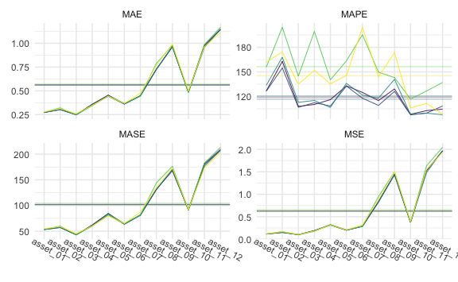

``` r
cv_large_5 %>% 
  gg_loss(
    y_large_test, 
    mean_line = TRUE, 
    line_param = list(size = .3),
    mean_param = list(alpha = .5, size = .3), 
    viridis = TRUE, 
    show.legend = FALSE
  ) +
  theme_minimal() +
  theme(
    axis.text.x = element_text(angle = -30, vjust = -1),
    legend.title = element_text(size = 8),
    legend.text = element_text(size = 7),
    legend.key.size = unit(.3, "cm")
  )
```

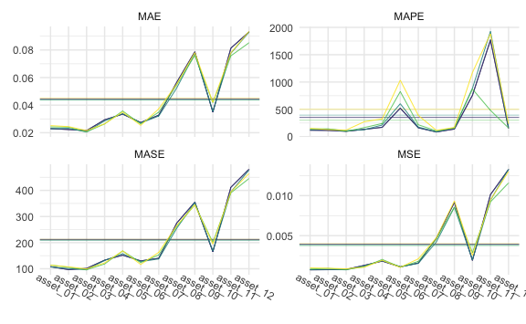

``` r
cv_large_20 %>% 
  gg_loss(
    y_large_test, 
    mean_line = TRUE, 
    line_param = list(size = .3),
    mean_param = list(alpha = .5, size = .3), 
    viridis = TRUE, 
    show.legend = FALSE
  ) +
  theme_minimal() +
  theme(
    axis.text.x = element_text(angle = -30, vjust = -1),
    legend.title = element_text(size = 8),
    legend.text = element_text(size = 7),
    legend.key.size = unit(.3, "cm")
  )
```

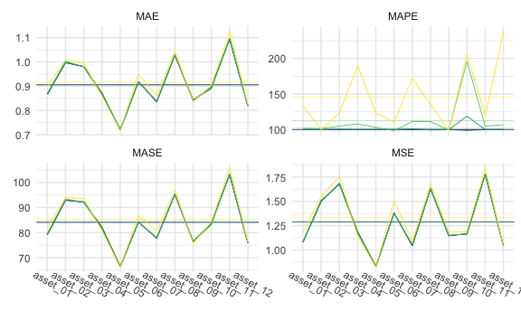

Tables

1-step:


    \begin{longtable}[t]{lllllll}
    \caption{\label{tab:largeone}LARGE Simulation - 1-step ahead Rolling Window Forecasting Loss}\\
    \toprule
    \multicolumn{1}{c}{ } & \multicolumn{1}{c}{ } & \multicolumn{2}{c}{Frequentist} & \multicolumn{1}{c}{BVAR} & \multicolumn{2}{c}{BVHAR} \\
    \cmidrule(l{3pt}r{3pt}){3-4} \cmidrule(l{3pt}r{3pt}){5-5} \cmidrule(l{3pt}r{3pt}){6-7}
     &  & VAR & VHAR & Minnesota & VAR-type & VHAR-type\\
    \midrule
    \endfirsthead
    \caption[]{LARGE Simulation - 1-step ahead Rolling Window Forecasting Loss \textit{(continued)}}\\
    \toprule
     &  & VAR & VHAR & Minnesota & VAR-type & VHAR-type\\
    \midrule
    \endhead

    \endfoot
    \bottomrule
    \endlastfoot
     & asset01 & \num{0.115} & \num{0.122} & \num{0.117} & \num{0.116} & \textcolor{red}{\num{0.115}}\\
    \cmidrule{2-7}\nopagebreak
     & asset02 & \num{0.169} & \num{0.168} & \num{0.154} & \num{0.151} & \textcolor{red}{\num{0.151}}\\
    \cmidrule{2-7}\nopagebreak
     & asset03 & \textcolor{red}{\num{0.0971}} & \num{0.1079} & \num{0.1021} & \num{0.1031} & \num{0.1013}\\
    \cmidrule{2-7}\nopagebreak
     & asset04 & \textcolor{red}{\num{0.174}} & \num{0.181} & \num{0.191} & \num{0.191} & \num{0.187}\\
    \cmidrule{2-7}\nopagebreak
     & asset05 & \num{0.328} & \num{0.314} & \num{0.318} & \num{0.32} & \textcolor{red}{\num{0.311}}\\
    \cmidrule{2-7}\nopagebreak
     & asset06 & \num{0.21} & \num{0.208} & \num{0.202} & \num{0.202} & \textcolor{red}{\num{0.2}}\\
    \cmidrule{2-7}\nopagebreak
     & asset07 & \num{0.288} & \num{0.319} & \num{0.29} & \num{0.287} & \textcolor{red}{\num{0.283}}\\
    \cmidrule{2-7}\nopagebreak
     & asset08 & \num{0.95} & \num{0.889} & \num{0.836} & \num{0.834} & \textcolor{red}{\num{0.822}}\\
    \cmidrule{2-7}\nopagebreak
     & asset09 & \num{1.5} & \num{1.503} & \num{1.449} & \textcolor{red}{\num{1.43}} & \num{1.446}\\
    \cmidrule{2-7}\nopagebreak
     & asset10 & \num{0.379} & \num{0.396} & \num{0.374} & \num{0.377} & \textcolor{red}{\num{0.373}}\\
    \cmidrule{2-7}\nopagebreak
     & asset11 & \num{1.634} & \num{1.548} & \num{1.523} & \num{1.536} & \textcolor{red}{\num{1.483}}\\
    \cmidrule{2-7}\nopagebreak
     & asset12 & \num{2.045} & \textcolor{red}{\num{1.936}} & \num{1.964} & \num{1.962} & \num{1.976}\\
    \cmidrule{2-7}\nopagebreak
    \multirow{-13}{*}{\raggedright\arraybackslash MSE} & \cellcolor{gray}{Average} & \num{0.657} & \num{0.641} & \num{0.627} & \num{0.626} & \textcolor{red}{\num{0.62}}\\
    \cmidrule{1-7}\pagebreak[0]
     & asset01 & \num{0.275} & \num{0.28} & \num{0.273} & \num{0.273} & \textcolor{red}{\num{0.272}}\\
    \cmidrule{2-7}\nopagebreak
     & asset02 & \num{0.322} & \num{0.312} & \num{0.305} & \textcolor{red}{\num{0.302}} & \num{0.303}\\
    \cmidrule{2-7}\nopagebreak
     & asset03 & \textcolor{red}{\num{0.248}} & \num{0.26} & \num{0.249} & \num{0.25} & \num{0.249}\\
    \cmidrule{2-7}\nopagebreak
     & asset04 & \textcolor{red}{\num{0.344}} & \num{0.347} & \num{0.358} & \num{0.359} & \num{0.353}\\
    \cmidrule{2-7}\nopagebreak
     & asset05 & \num{0.447} & \num{0.444} & \num{0.454} & \num{0.454} & \textcolor{red}{\num{0.442}}\\
    \cmidrule{2-7}\nopagebreak
     & asset06 & \num{0.371} & \num{0.367} & \num{0.362} & \num{0.362} & \textcolor{red}{\num{0.361}}\\
    \cmidrule{2-7}\nopagebreak
     & asset07 & \textcolor{red}{\num{0.444}} & \num{0.474} & \num{0.449} & \num{0.448} & \num{0.444}\\
    \cmidrule{2-7}\nopagebreak
     & asset08 & \num{0.788} & \num{0.766} & \num{0.726} & \num{0.728} & \textcolor{red}{\num{0.724}}\\
    \cmidrule{2-7}\nopagebreak
     & asset09 & \num{0.978} & \num{0.993} & \num{0.967} & \textcolor{red}{\num{0.96}} & \num{0.967}\\
    \cmidrule{2-7}\nopagebreak
     & asset10 & \textcolor{red}{\num{0.483}} & \num{0.499} & \num{0.486} & \num{0.489} & \num{0.484}\\
    \cmidrule{2-7}\nopagebreak
     & asset11 & \num{0.987} & \num{0.963} & \num{0.973} & \num{0.985} & \textcolor{red}{\num{0.956}}\\
    \cmidrule{2-7}\nopagebreak
     & asset12 & \num{1.168} & \textcolor{red}{\num{1.114}} & \num{1.142} & \num{1.149} & \num{1.147}\\
    \cmidrule{2-7}\nopagebreak
    \multirow{-13}{*}{\raggedright\arraybackslash MAE} & \cellcolor{gray}{Average} & \num{0.571} & \num{0.568} & \num{0.562} & \num{0.563} & \textcolor{red}{\num{0.558}}\\
    \cmidrule{1-7}\pagebreak[0]
     & asset01 & \num{155.785} & \num{161.779} & \num{126.824} & \textcolor{red}{\num{126.384}} & \num{133.607}\\
    \cmidrule{2-7}\nopagebreak
     & asset02 & \num{204.358} & \num{174.244} & \num{162.897} & \textcolor{red}{\num{154.869}} & \num{167.959}\\
    \cmidrule{2-7}\nopagebreak
     & asset03 & \num{144.717} & \num{134.989} & \num{107.907} & \textcolor{red}{\num{106.758}} & \num{112.876}\\
    \cmidrule{2-7}\nopagebreak
     & asset04 & \num{199.385} & \num{151.858} & \textcolor{red}{\num{110.262}} & \num{112.434} & \num{115.092}\\
    \cmidrule{2-7}\nopagebreak
     & asset05 & \num{140.298} & \num{135.391} & \num{116.145} & \num{108.371} & \textcolor{red}{\num{106.606}}\\
    \cmidrule{2-7}\nopagebreak
     & asset06 & \num{163.462} & \num{145.658} & \num{132.99} & \textcolor{red}{\num{132.676}} & \num{136.07}\\
    \cmidrule{2-7}\nopagebreak
     & asset07 & \num{195.344} & \num{204.332} & \num{124.941} & \textcolor{red}{\num{117.878}} & \num{121.718}\\
    \cmidrule{2-7}\nopagebreak
     & asset08 & \num{149.712} & \num{143.798} & \num{114.99} & \textcolor{red}{\num{109.097}} & \num{117.914}\\
    \cmidrule{2-7}\nopagebreak
     & asset09 & \num{143.023} & \num{173.505} & \num{129.259} & \textcolor{red}{\num{126.193}} & \num{140.971}\\
    \cmidrule{2-7}\nopagebreak
     & asset10 & \num{116.804} & \num{105.917} & \num{98.302} & \textcolor{red}{\num{97.581}} & \num{97.94}\\
    \cmidrule{2-7}\nopagebreak
     & asset11 & \num{126.674} & \num{111.687} & \num{102.756} & \num{99.692} & \textcolor{red}{\num{99.614}}\\
    \cmidrule{2-7}\nopagebreak
     & asset12 & \num{137.066} & \num{98.313} & \num{104.544} & \num{108.379} & \textcolor{red}{\num{97.718}}\\
    \cmidrule{2-7}\nopagebreak
    \multirow{-13}{*}{\raggedright\arraybackslash MAPE} & \cellcolor{gray}{Average} & \num{156.386} & \num{145.123} & \num{119.318} & \textcolor{red}{\num{116.693}} & \num{120.674}\\
    \cmidrule{1-7}\pagebreak[0]
     & asset01 & \num{53.302} & \num{55.052} & \num{53.417} & \num{53.341} & \textcolor{red}{\num{53.006}}\\
    \cmidrule{2-7}\nopagebreak
     & asset02 & \num{60.027} & \num{58.699} & \num{57.72} & \num{57.199} & \textcolor{red}{\num{57.139}}\\
    \cmidrule{2-7}\nopagebreak
     & asset03 & \num{43.139} & \num{45.337} & \textcolor{red}{\num{42.885}} & \num{43.121} & \num{43.118}\\
    \cmidrule{2-7}\nopagebreak
     & asset04 & \textcolor{red}{\num{59.782}} & \num{60.199} & \num{61.84} & \num{62.154} & \num{60.703}\\
    \cmidrule{2-7}\nopagebreak
     & asset05 & \num{82.681} & \textcolor{red}{\num{79.739}} & \num{84.175} & \num{84.613} & \num{81.627}\\
    \cmidrule{2-7}\nopagebreak
     & asset06 & \num{65.293} & \num{64.889} & \textcolor{red}{\num{63.635}} & \num{64.013} & \num{63.684}\\
    \cmidrule{2-7}\nopagebreak
     & asset07 & \num{81.387} & \num{87.355} & \num{81.573} & \num{81.503} & \textcolor{red}{\num{80.525}}\\
    \cmidrule{2-7}\nopagebreak
     & asset08 & \num{144.026} & \num{135.259} & \textcolor{red}{\num{130.948}} & \num{131.815} & \num{131.105}\\
    \cmidrule{2-7}\nopagebreak
     & asset09 & \num{176.482} & \num{173.17} & \num{169.916} & \textcolor{red}{\num{167.46}} & \num{169.661}\\
    \cmidrule{2-7}\nopagebreak
     & asset10 & \num{92.155} & \num{92.315} & \num{91.451} & \num{91.888} & \textcolor{red}{\num{91.224}}\\
    \cmidrule{2-7}\nopagebreak
     & asset11 & \num{182.815} & \textcolor{red}{\num{173.249}} & \num{180.013} & \num{181.913} & \num{176.551}\\
    \cmidrule{2-7}\nopagebreak
     & asset12 & \num{213.376} & \textcolor{red}{\num{203.383}} & \num{207.489} & \num{209.382} & \num{207.504}\\
    \cmidrule{2-7}\nopagebreak
    \multirow{-13}{*}{\raggedright\arraybackslash MASE} & \cellcolor{gray}{Average} & \num{104.539} & \num{102.387} & \num{102.088} & \num{102.367} & \textcolor{red}{\num{101.321}}\\*
    \end{longtable}

5-step:


    \begin{longtable}[t]{lllllll}
    \caption{\label{tab:largefive}LARGE Simulation - 5-step ahead Rolling Window Forecasting Loss}\\
    \toprule
    \multicolumn{1}{c}{ } & \multicolumn{1}{c}{ } & \multicolumn{2}{c}{Frequentist} & \multicolumn{1}{c}{BVAR} & \multicolumn{2}{c}{BVHAR} \\
    \cmidrule(l{3pt}r{3pt}){3-4} \cmidrule(l{3pt}r{3pt}){5-5} \cmidrule(l{3pt}r{3pt}){6-7}
     &  & VAR & VHAR & Minnesota & VAR-type & VHAR-type\\
    \midrule
    \endfirsthead
    \caption[]{LARGE Simulation - 5-step ahead Rolling Window Forecasting Loss \textit{(continued)}}\\
    \toprule
     &  & VAR & VHAR & Minnesota & VAR-type & VHAR-type\\
    \midrule
    \endhead

    \endfoot
    \bottomrule
    \endlastfoot
     & asset01 & \num{0.125} & \num{0.133} & \num{0.122} & \textcolor{red}{\num{0.122}} & \num{0.123}\\
    \cmidrule{2-7}\nopagebreak
     & asset02 & \num{0.16} & \num{0.164} & \num{0.152} & \textcolor{red}{\num{0.152}} & \num{0.154}\\
    \cmidrule{2-7}\nopagebreak
     & asset03 & \num{0.104} & \num{0.113} & \num{0.104} & \num{0.104} & \textcolor{red}{\num{0.103}}\\
    \cmidrule{2-7}\nopagebreak
     & asset04 & \num{0.203} & \textcolor{red}{\num{0.195}} & \num{0.203} & \num{0.203} & \num{0.202}\\
    \cmidrule{2-7}\nopagebreak
     & asset05 & \num{0.33} & \textcolor{red}{\num{0.313}} & \num{0.328} & \num{0.329} & \num{0.324}\\
    \cmidrule{2-7}\nopagebreak
     & asset06 & \textcolor{red}{\num{0.203}} & \num{0.207} & \num{0.204} & \num{0.204} & \num{0.205}\\
    \cmidrule{2-7}\nopagebreak
     & asset07 & \num{0.298} & \num{0.305} & \num{0.283} & \textcolor{red}{\num{0.283}} & \num{0.284}\\
    \cmidrule{2-7}\nopagebreak
     & asset08 & \num{0.851} & \num{0.862} & \num{0.835} & \num{0.835} & \textcolor{red}{\num{0.825}}\\
    \cmidrule{2-7}\nopagebreak
     & asset09 & \num{1.546} & \num{1.563} & \textcolor{red}{\num{1.544}} & \num{1.546} & \num{1.547}\\
    \cmidrule{2-7}\nopagebreak
     & asset10 & \num{0.394} & \num{0.399} & \textcolor{red}{\num{0.367}} & \num{0.367} & \num{0.378}\\
    \cmidrule{2-7}\nopagebreak
     & asset11 & \num{1.496} & \num{1.498} & \num{1.485} & \num{1.484} & \textcolor{red}{\num{1.476}}\\
    \cmidrule{2-7}\nopagebreak
     & asset12 & \num{2.004} & \textcolor{red}{\num{1.954}} & \num{2.006} & \num{2.008} & \num{2.021}\\
    \cmidrule{2-7}\nopagebreak
    \multirow{-13}{*}{\raggedright\arraybackslash MSE} & \cellcolor{gray}{Average} & \num{0.643} & \num{0.642} & \textcolor{red}{\num{0.636}} & \num{0.636} & \num{0.637}\\
    \cmidrule{1-7}\pagebreak[0]
     & asset01 & \num{0.285} & \num{0.293} & \textcolor{red}{\num{0.28}} & \num{0.28} & \num{0.28}\\
    \cmidrule{2-7}\nopagebreak
     & asset02 & \num{0.31} & \num{0.314} & \textcolor{red}{\num{0.306}} & \num{0.306} & \num{0.309}\\
    \cmidrule{2-7}\nopagebreak
     & asset03 & \num{0.249} & \num{0.26} & \textcolor{red}{\num{0.248}} & \num{0.248} & \num{0.25}\\
    \cmidrule{2-7}\nopagebreak
     & asset04 & \num{0.375} & \textcolor{red}{\num{0.357}} & \num{0.37} & \num{0.369} & \num{0.366}\\
    \cmidrule{2-7}\nopagebreak
     & asset05 & \num{0.461} & \textcolor{red}{\num{0.442}} & \num{0.454} & \num{0.456} & \num{0.448}\\
    \cmidrule{2-7}\nopagebreak
     & asset06 & \textcolor{red}{\num{0.351}} & \num{0.355} & \num{0.355} & \num{0.355} & \num{0.355}\\
    \cmidrule{2-7}\nopagebreak
     & asset07 & \num{0.45} & \num{0.462} & \num{0.443} & \textcolor{red}{\num{0.443}} & \num{0.443}\\
    \cmidrule{2-7}\nopagebreak
     & asset08 & \num{0.748} & \num{0.77} & \num{0.739} & \num{0.739} & \textcolor{red}{\num{0.734}}\\
    \cmidrule{2-7}\nopagebreak
     & asset09 & \num{0.996} & \textcolor{red}{\num{0.989}} & \num{0.991} & \num{0.992} & \num{0.992}\\
    \cmidrule{2-7}\nopagebreak
     & asset10 & \num{0.505} & \num{0.51} & \textcolor{red}{\num{0.492}} & \num{0.493} & \num{0.497}\\
    \cmidrule{2-7}\nopagebreak
     & asset11 & \num{0.976} & \num{0.981} & \num{0.985} & \num{0.986} & \textcolor{red}{\num{0.975}}\\
    \cmidrule{2-7}\nopagebreak
     & asset12 & \num{1.178} & \textcolor{red}{\num{1.154}} & \num{1.173} & \num{1.173} & \num{1.172}\\
    \cmidrule{2-7}\nopagebreak
    \multirow{-13}{*}{\raggedright\arraybackslash MAE} & \cellcolor{gray}{Average} & \num{0.574} & \num{0.574} & \num{0.57} & \num{0.57} & \textcolor{red}{\num{0.569}}\\
    \cmidrule{1-7}\pagebreak[0]
     & asset01 & \num{114.47} & \num{127.339} & \num{99.837} & \num{99.997} & \textcolor{red}{\num{98.674}}\\
    \cmidrule{2-7}\nopagebreak
     & asset02 & \num{117.808} & \num{143.599} & \textcolor{red}{\num{99.444}} & \num{100.009} & \num{115.156}\\
    \cmidrule{2-7}\nopagebreak
     & asset03 & \num{113.252} & \num{115.455} & \num{100.053} & \textcolor{red}{\num{100.003}} & \num{114.357}\\
    \cmidrule{2-7}\nopagebreak
     & asset04 & \num{120.125} & \num{111.97} & \textcolor{red}{\num{99.876}} & \num{100.012} & \num{105.955}\\
    \cmidrule{2-7}\nopagebreak
     & asset05 & \num{116.678} & \num{108.809} & \num{98.606} & \num{99.996} & \textcolor{red}{\num{96.289}}\\
    \cmidrule{2-7}\nopagebreak
     & asset06 & \num{111.095} & \num{117.533} & \textcolor{red}{\num{99.678}} & \num{99.998} & \num{101.596}\\
    \cmidrule{2-7}\nopagebreak
     & asset07 & \num{119.561} & \num{137.641} & \num{99.365} & \num{99.998} & \textcolor{red}{\num{98.442}}\\
    \cmidrule{2-7}\nopagebreak
     & asset08 & \num{128.661} & \num{128.189} & \num{100.914} & \textcolor{red}{\num{100.004}} & \num{105.81}\\
    \cmidrule{2-7}\nopagebreak
     & asset09 & \num{119.087} & \num{131.838} & \num{100.089} & \textcolor{red}{\num{99.997}} & \num{105.152}\\
    \cmidrule{2-7}\nopagebreak
     & asset10 & \num{109.666} & \num{112.827} & \num{100.072} & \textcolor{red}{\num{100.002}} & \num{104.992}\\
    \cmidrule{2-7}\nopagebreak
     & asset11 & \num{101.144} & \num{110.214} & \textcolor{red}{\num{99.907}} & \num{100.001} & \num{100.093}\\
    \cmidrule{2-7}\nopagebreak
     & asset12 & \num{127.585} & \num{138.863} & \num{100.1} & \textcolor{red}{\num{99.991}} & \num{102.976}\\
    \cmidrule{2-7}\nopagebreak
    \multirow{-13}{*}{\raggedright\arraybackslash MAPE} & \cellcolor{gray}{Average} & \num{116.594} & \num{123.69} & \textcolor{red}{\num{99.829}} & \num{100.001} & \num{104.124}\\
    \cmidrule{1-7}\pagebreak[0]
     & asset01 & \num{48.822} & \num{50.609} & \num{48.265} & \num{48.274} & \textcolor{red}{\num{48.244}}\\
    \cmidrule{2-7}\nopagebreak
     & asset02 & \num{56.677} & \num{56.617} & \num{55.441} & \textcolor{red}{\num{55.441}} & \num{56.131}\\
    \cmidrule{2-7}\nopagebreak
     & asset03 & \num{44.785} & \num{46.972} & \textcolor{red}{\num{44.536}} & \num{44.538} & \num{44.835}\\
    \cmidrule{2-7}\nopagebreak
     & asset04 & \num{68.218} & \textcolor{red}{\num{64.15}} & \num{66.54} & \num{66.484} & \num{66.144}\\
    \cmidrule{2-7}\nopagebreak
     & asset05 & \num{83.64} & \textcolor{red}{\num{81.024}} & \num{83.085} & \num{83.366} & \num{82.073}\\
    \cmidrule{2-7}\nopagebreak
     & asset06 & \textcolor{red}{\num{63.413}} & \num{63.98} & \num{64.273} & \num{64.326} & \num{64.284}\\
    \cmidrule{2-7}\nopagebreak
     & asset07 & \num{82.494} & \num{84.513} & \num{81.737} & \textcolor{red}{\num{81.725}} & \num{81.741}\\
    \cmidrule{2-7}\nopagebreak
     & asset08 & \num{134.501} & \num{138.359} & \num{134.061} & \num{133.985} & \textcolor{red}{\num{133.927}}\\
    \cmidrule{2-7}\nopagebreak
     & asset09 & \num{177.767} & \textcolor{red}{\num{174.021}} & \num{177.031} & \num{177.083} & \num{177.633}\\
    \cmidrule{2-7}\nopagebreak
     & asset10 & \num{91.937} & \num{92.127} & \textcolor{red}{\num{89.591}} & \num{89.691} & \num{90.292}\\
    \cmidrule{2-7}\nopagebreak
     & asset11 & \textcolor{red}{\num{178.681}} & \num{180.115} & \num{180.928} & \num{181.004} & \num{178.787}\\
    \cmidrule{2-7}\nopagebreak
     & asset12 & \num{222.42} & \textcolor{red}{\num{219.379}} & \num{223.225} & \num{223.228} & \num{222.951}\\
    \cmidrule{2-7}\nopagebreak
    \multirow{-13}{*}{\raggedright\arraybackslash MASE} & \cellcolor{gray}{Average} & \num{104.446} & \num{104.322} & \num{104.059} & \num{104.095} & \textcolor{red}{\num{103.92}}\\*
    \end{longtable}

20-step:


    \begin{longtable}[t]{lllllll}
    \caption{\label{tab:largetwenty}LARGE Simulation - 20-step ahead Rolling Window Forecasting Loss}\\
    \toprule
    \multicolumn{1}{c}{ } & \multicolumn{1}{c}{ } & \multicolumn{2}{c}{Frequentist} & \multicolumn{1}{c}{BVAR} & \multicolumn{2}{c}{BVHAR} \\
    \cmidrule(l{3pt}r{3pt}){3-4} \cmidrule(l{3pt}r{3pt}){5-5} \cmidrule(l{3pt}r{3pt}){6-7}
     &  & VAR & VHAR & Minnesota & VAR-type & VHAR-type\\
    \midrule
    \endfirsthead
    \caption[]{LARGE Simulation - 20-step ahead Rolling Window Forecasting Loss \textit{(continued)}}\\
    \toprule
     &  & VAR & VHAR & Minnesota & VAR-type & VHAR-type\\
    \midrule
    \endhead

    \endfoot
    \bottomrule
    \endlastfoot
     & asset01 & \num{0.125} & \textcolor{red}{\num{0.125}} & \num{0.125} & \num{0.125} & \num{0.126}\\
    \cmidrule{2-7}\nopagebreak
     & asset02 & \textcolor{red}{\num{0.164}} & \num{0.17} & \num{0.164} & \num{0.164} & \num{0.164}\\
    \cmidrule{2-7}\nopagebreak
     & asset03 & \num{0.105} & \num{0.109} & \textcolor{red}{\num{0.105}} & \num{0.105} & \num{0.105}\\
    \cmidrule{2-7}\nopagebreak
     & asset04 & \num{0.202} & \textcolor{red}{\num{0.197}} & \num{0.202} & \num{0.202} & \num{0.201}\\
    \cmidrule{2-7}\nopagebreak
     & asset05 & \num{0.308} & \textcolor{red}{\num{0.302}} & \num{0.308} & \num{0.308} & \num{0.308}\\
    \cmidrule{2-7}\nopagebreak
     & asset06 & \textcolor{red}{\num{0.215}} & \num{0.218} & \num{0.215} & \num{0.215} & \num{0.215}\\
    \cmidrule{2-7}\nopagebreak
     & asset07 & \num{0.282} & \num{0.294} & \num{0.282} & \num{0.282} & \textcolor{red}{\num{0.281}}\\
    \cmidrule{2-7}\nopagebreak
     & asset08 & \num{0.769} & \num{0.792} & \num{0.769} & \num{0.769} & \textcolor{red}{\num{0.764}}\\
    \cmidrule{2-7}\nopagebreak
     & asset09 & \num{1.624} & \num{1.634} & \num{1.624} & \num{1.624} & \textcolor{red}{\num{1.61}}\\
    \cmidrule{2-7}\nopagebreak
     & asset10 & \textcolor{red}{\num{0.355}} & \num{0.368} & \num{0.355} & \num{0.355} & \num{0.355}\\
    \cmidrule{2-7}\nopagebreak
     & asset11 & \num{1.349} & \num{1.385} & \num{1.352} & \num{1.352} & \textcolor{red}{\num{1.343}}\\
    \cmidrule{2-7}\nopagebreak
     & asset12 & \textcolor{red}{\num{1.778}} & \num{1.812} & \num{1.781} & \num{1.781} & \num{1.78}\\
    \cmidrule{2-7}\nopagebreak
    \multirow{-13}{*}{\raggedright\arraybackslash MSE} & \cellcolor{gray}{Average} & \num{0.606} & \num{0.617} & \num{0.607} & \num{0.607} & \textcolor{red}{\num{0.604}}\\
    \cmidrule{1-7}\pagebreak[0]
     & asset01 & \num{0.287} & \textcolor{red}{\num{0.284}} & \num{0.287} & \num{0.287} & \num{0.287}\\
    \cmidrule{2-7}\nopagebreak
     & asset02 & \textcolor{red}{\num{0.317}} & \num{0.321} & \num{0.317} & \num{0.317} & \num{0.317}\\
    \cmidrule{2-7}\nopagebreak
     & asset03 & \num{0.251} & \num{0.256} & \textcolor{red}{\num{0.251}} & \num{0.251} & \num{0.251}\\
    \cmidrule{2-7}\nopagebreak
     & asset04 & \num{0.366} & \textcolor{red}{\num{0.358}} & \num{0.366} & \num{0.366} & \num{0.365}\\
    \cmidrule{2-7}\nopagebreak
     & asset05 & \num{0.443} & \textcolor{red}{\num{0.442}} & \num{0.443} & \num{0.443} & \num{0.443}\\
    \cmidrule{2-7}\nopagebreak
     & asset06 & \textcolor{red}{\num{0.376}} & \num{0.378} & \num{0.376} & \num{0.376} & \num{0.376}\\
    \cmidrule{2-7}\nopagebreak
     & asset07 & \num{0.447} & \num{0.454} & \num{0.447} & \num{0.447} & \textcolor{red}{\num{0.447}}\\
    \cmidrule{2-7}\nopagebreak
     & asset08 & \num{0.703} & \num{0.72} & \num{0.703} & \num{0.703} & \textcolor{red}{\num{0.7}}\\
    \cmidrule{2-7}\nopagebreak
     & asset09 & \num{1.012} & \num{1.013} & \num{1.012} & \num{1.012} & \textcolor{red}{\num{1.006}}\\
    \cmidrule{2-7}\nopagebreak
     & asset10 & \textcolor{red}{\num{0.482}} & \num{0.491} & \num{0.483} & \num{0.483} & \num{0.482}\\
    \cmidrule{2-7}\nopagebreak
     & asset11 & \num{0.956} & \num{0.965} & \num{0.957} & \num{0.957} & \textcolor{red}{\num{0.953}}\\
    \cmidrule{2-7}\nopagebreak
     & asset12 & \textcolor{red}{\num{1.115}} & \num{1.128} & \num{1.116} & \num{1.116} & \num{1.116}\\
    \cmidrule{2-7}\nopagebreak
    \multirow{-13}{*}{\raggedright\arraybackslash MAE} & \cellcolor{gray}{Average} & \num{0.563} & \num{0.568} & \num{0.563} & \num{0.563} & \textcolor{red}{\num{0.562}}\\
    \cmidrule{1-7}\pagebreak[0]
     & asset01 & \num{100.009} & \num{109.824} & \textcolor{red}{\num{100}} & \num{100} & \num{100.599}\\
    \cmidrule{2-7}\nopagebreak
     & asset02 & \textcolor{red}{\num{99.571}} & \num{104.537} & \num{100} & \num{100} & \num{100.01}\\
    \cmidrule{2-7}\nopagebreak
     & asset03 & \textcolor{red}{\num{99.984}} & \num{112.299} & \num{100} & \num{100} & \num{100.051}\\
    \cmidrule{2-7}\nopagebreak
     & asset04 & \num{100.039} & \num{114.656} & \num{100} & \num{100} & \textcolor{red}{\num{99.173}}\\
    \cmidrule{2-7}\nopagebreak
     & asset05 & \num{100.02} & \num{105.822} & \textcolor{red}{\num{100}} & \num{100} & \num{100.03}\\
    \cmidrule{2-7}\nopagebreak
     & asset06 & \num{100.061} & \textcolor{red}{\num{99.225}} & \num{100} & \num{100} & \num{99.901}\\
    \cmidrule{2-7}\nopagebreak
     & asset07 & \num{100.197} & \num{119.434} & \textcolor{red}{\num{100}} & \num{100} & \num{100.016}\\
    \cmidrule{2-7}\nopagebreak
     & asset08 & \textcolor{red}{\num{99.933}} & \num{107.34} & \num{100} & \num{100} & \num{100.92}\\
    \cmidrule{2-7}\nopagebreak
     & asset09 & \num{100.146} & \num{104.952} & \num{100} & \num{100} & \textcolor{red}{\num{95.753}}\\
    \cmidrule{2-7}\nopagebreak
     & asset10 & \num{99.741} & \num{100.697} & \num{100} & \num{100} & \textcolor{red}{\num{99.619}}\\
    \cmidrule{2-7}\nopagebreak
     & asset11 & \num{99.919} & \num{103.327} & \num{100} & \num{100} & \textcolor{red}{\num{99.342}}\\
    \cmidrule{2-7}\nopagebreak
     & asset12 & \textcolor{red}{\num{99.891}} & \num{103.152} & \num{100} & \num{100} & \num{99.993}\\
    \cmidrule{2-7}\nopagebreak
    \multirow{-13}{*}{\raggedright\arraybackslash MAPE} & \cellcolor{gray}{Average} & \num{99.959} & \num{107.105} & \num{100} & \num{100} & \textcolor{red}{\num{99.617}}\\
    \cmidrule{1-7}\pagebreak[0]
     & asset01 & \num{53.489} & \textcolor{red}{\num{52.744}} & \num{53.496} & \num{53.496} & \num{53.542}\\
    \cmidrule{2-7}\nopagebreak
     & asset02 & \textcolor{red}{\num{54.542}} & \num{55.502} & \num{54.575} & \num{54.575} & \num{54.567}\\
    \cmidrule{2-7}\nopagebreak
     & asset03 & \num{47.541} & \num{48.525} & \textcolor{red}{\num{47.54}} & \num{47.54} & \num{47.543}\\
    \cmidrule{2-7}\nopagebreak
     & asset04 & \num{65.414} & \textcolor{red}{\num{64.619}} & \num{65.416} & \num{65.416} & \num{65.363}\\
    \cmidrule{2-7}\nopagebreak
     & asset05 & \num{85.12} & \textcolor{red}{\num{85.05}} & \num{85.126} & \num{85.125} & \num{85.123}\\
    \cmidrule{2-7}\nopagebreak
     & asset06 & \textcolor{red}{\num{68.321}} & \num{68.525} & \num{68.355} & \num{68.355} & \num{68.325}\\
    \cmidrule{2-7}\nopagebreak
     & asset07 & \num{77.942} & \num{78.873} & \num{77.933} & \num{77.933} & \textcolor{red}{\num{77.925}}\\
    \cmidrule{2-7}\nopagebreak
     & asset08 & \num{121.279} & \num{125.118} & \num{121.329} & \num{121.329} & \textcolor{red}{\num{120.829}}\\
    \cmidrule{2-7}\nopagebreak
     & asset09 & \num{183.01} & \num{183.381} & \num{182.988} & \num{182.988} & \textcolor{red}{\num{182.088}}\\
    \cmidrule{2-7}\nopagebreak
     & asset10 & \textcolor{red}{\num{85.836}} & \num{88.027} & \num{85.924} & \num{85.924} & \num{85.849}\\
    \cmidrule{2-7}\nopagebreak
     & asset11 & \num{165.049} & \num{165.861} & \num{165.277} & \num{165.277} & \textcolor{red}{\num{164.518}}\\
    \cmidrule{2-7}\nopagebreak
     & asset12 & \textcolor{red}{\num{204.126}} & \num{207.086} & \num{204.344} & \num{204.344} & \num{204.322}\\
    \cmidrule{2-7}\nopagebreak
    \multirow{-13}{*}{\raggedright\arraybackslash MASE} & \cellcolor{gray}{Average} & \num{100.972} & \num{101.943} & \num{101.025} & \num{101.025} & \textcolor{red}{\num{100.833}}\\*
    \end{longtable}

### Average

SMALL

1-step:

    \begin{table}

    \caption{\label{tab:smallonemean}SMALL Simulation - 1-step ahead Rolling Window Forecasting Average Loss}
    \centering
    \begin{tabular}[t]{llllll}
    \toprule
      & VAR & VHAR & BVAR-Minnesota & BVHAR-MN-VAR & BVHAR-MN-VHAR\\
    \midrule
    MSE & \num{2.225} & \num{2.252} & \textcolor{red}{\num{2.178}} & \num{2.21} & \num{2.225}\\
    MAE & \num{0.999} & \num{1} & \textcolor{red}{\num{0.98}} & \num{0.988} & \num{0.994}\\
    MAPE & \num{187.197} & \num{176.873} & \num{182.196} & \num{176.26} & \textcolor{red}{\num{175.343}}\\
    MASE & \num{109.497} & \num{109.69} & \textcolor{red}{\num{106.956}} & \num{108.416} & \num{108.974}\\
    \bottomrule
    \end{tabular}
    \end{table}

5-step:

    \begin{table}

    \caption{\label{tab:smallfivemean}SMALL Simulation - 5-step ahead Rolling Window Forecasting Average Loss}
    \centering
    \begin{tabular}[t]{llllll}
    \toprule
      & VAR & VHAR & BVAR-Minnesota & BVHAR-MN-VAR & BVHAR-MN-VHAR\\
    \midrule
    MSE & \num{2.752} & \num{2.689} & \num{2.676} & \num{2.657} & \textcolor{red}{\num{2.642}}\\
    MAE & \num{1.085} & \num{1.071} & \num{1.07} & \num{1.066} & \textcolor{red}{\num{1.063}}\\
    MAPE & \num{115.535} & \num{121.021} & \textcolor{red}{\num{104.092}} & \num{104.811} & \num{110.771}\\
    MASE & \num{119.621} & \textcolor{red}{\num{116.135}} & \num{117.06} & \num{116.58} & \num{116.679}\\
    \bottomrule
    \end{tabular}
    \end{table}

20-step:

    \begin{table}

    \caption{\label{tab:smalltwentyemean}SMALL Simulation - 20-step ahead Rolling Window Forecasting Average Loss}
    \centering
    \begin{tabular}[t]{llllll}
    \toprule
      & VAR & VHAR & BVAR-Minnesota & BVHAR-MN-VAR & BVHAR-MN-VHAR\\
    \midrule
    MSE & \textcolor{red}{\num{2.652}} & \num{2.656} & \num{2.652} & \num{2.659} & \num{2.656}\\
    MAE & \num{1.066} & \textcolor{red}{\num{1.062}} & \num{1.066} & \num{1.068} & \num{1.068}\\
    MAPE & \num{100.051} & \num{106.696} & \textcolor{red}{\num{100.006}} & \num{101.006} & \num{100.811}\\
    MASE & \num{115.862} & \textcolor{red}{\num{115.208}} & \num{115.86} & \num{116.107} & \num{116.054}\\
    \bottomrule
    \end{tabular}
    \end{table}

MEDIUM

1-step:

    \begin{table}

    \caption{\label{tab:medonemean}MEDIUM Simulation - 1-step ahead Rolling Window Forecasting Average Loss}
    \centering
    \begin{tabular}[t]{llllll}
    \toprule
      & VAR & VHAR & BVAR-Minnesota & BVHAR-MN-VAR & BVHAR-MN-VHAR\\
    \midrule
    MSE & \num{0.618} & \num{0.61} & \num{0.594} & \num{0.597} & \textcolor{red}{\num{0.593}}\\
    MAE & \num{0.54} & \num{0.537} & \num{0.53} & \num{0.53} & \textcolor{red}{\num{0.527}}\\
    MAPE & \num{172.397} & \num{154.601} & \num{141.177} & \textcolor{red}{\num{133.736}} & \num{136.568}\\
    MASE & \num{98.788} & \num{99.111} & \num{96.872} & \num{97.035} & \textcolor{red}{\num{96.594}}\\
    \bottomrule
    \end{tabular}
    \end{table}

5-step:

    \begin{table}

    \caption{\label{tab:medfivemean}MEDIUM Simulation - 5-step ahead Rolling Window Forecasting Average Loss}
    \centering
    \begin{tabular}[t]{llllll}
    \toprule
      & VAR & VHAR & BVAR-Minnesota & BVHAR-MN-VAR & BVHAR-MN-VHAR\\
    \midrule
    MSE & \num{0.613} & \num{0.625} & \num{0.615} & \num{0.616} & \textcolor{red}{\num{0.611}}\\
    MAE & \num{0.54} & \num{0.544} & \num{0.539} & \num{0.539} & \textcolor{red}{\num{0.539}}\\
    MAPE & \num{116.395} & \num{142.703} & \num{103.553} & \textcolor{red}{\num{99.999}} & \num{108.88}\\
    MASE & \textcolor{red}{\num{98.396}} & \num{99.979} & \num{98.7} & \num{98.762} & \num{98.534}\\
    \bottomrule
    \end{tabular}
    \end{table}

20-step:

    \begin{table}

    \caption{\label{tab:medtwentyemean}MEDIUM Simulation - 20-step ahead Rolling Window Forecasting Average Loss}
    \centering
    \begin{tabular}[t]{llllll}
    \toprule
      & VAR & VHAR & BVAR-Minnesota & BVHAR-MN-VAR & BVHAR-MN-VHAR\\
    \midrule
    MSE & \num{0.603} & \num{0.603} & \textcolor{red}{\num{0.603}} & \num{0.603} & \num{0.603}\\
    MAE & \num{0.531} & \textcolor{red}{\num{0.529}} & \num{0.531} & \num{0.531} & \num{0.531}\\
    MAPE & \textcolor{red}{\num{99.903}} & \num{112.251} & \num{100} & \num{100} & \num{100.153}\\
    MASE & \num{95.945} & \textcolor{red}{\num{95.328}} & \num{95.943} & \num{95.943} & \num{95.969}\\
    \bottomrule
    \end{tabular}
    \end{table}

LARGE

1-step:

    \begin{table}

    \caption{\label{tab:largeonemean}LARGE Simulation - 1-step ahead Rolling Window Forecasting Average Loss}
    \centering
    \begin{tabular}[t]{llllll}
    \toprule
      & VAR & VHAR & BVAR-Minnesota & BVHAR-MN-VAR & BVHAR-MN-VHAR\\
    \midrule
    MSE & \num{0.657} & \num{0.641} & \num{0.627} & \num{0.626} & \textcolor{red}{\num{0.62}}\\
    MAE & \num{0.571} & \num{0.568} & \num{0.562} & \num{0.563} & \textcolor{red}{\num{0.558}}\\
    MAPE & \num{156.386} & \num{145.123} & \num{119.318} & \textcolor{red}{\num{116.693}} & \num{120.674}\\
    MASE & \num{104.539} & \num{102.387} & \num{102.088} & \num{102.367} & \textcolor{red}{\num{101.321}}\\
    \bottomrule
    \end{tabular}
    \end{table}

5-step:

    \begin{table}

    \caption{\label{tab:largefivemean}LARGE Simulation - 5-step ahead Rolling Window Forecasting Average Loss}
    \centering
    \begin{tabular}[t]{llllll}
    \toprule
      & VAR & VHAR & BVAR-Minnesota & BVHAR-MN-VAR & BVHAR-MN-VHAR\\
    \midrule
    MSE & \num{0.643} & \num{0.642} & \textcolor{red}{\num{0.636}} & \num{0.636} & \num{0.637}\\
    MAE & \num{0.574} & \num{0.574} & \num{0.57} & \num{0.57} & \textcolor{red}{\num{0.569}}\\
    MAPE & \num{116.594} & \num{123.69} & \textcolor{red}{\num{99.829}} & \num{100.001} & \num{104.124}\\
    MASE & \num{104.446} & \num{104.322} & \num{104.059} & \num{104.095} & \textcolor{red}{\num{103.92}}\\
    \bottomrule
    \end{tabular}
    \end{table}

20-step:

    \begin{table}

    \caption{\label{tab:largetwentyemean}LARGE Simulation - 20-step ahead Rolling Window Forecasting Average Loss}
    \centering
    \begin{tabular}[t]{llllll}
    \toprule
      & VAR & VHAR & BVAR-Minnesota & BVHAR-MN-VAR & BVHAR-MN-VHAR\\
    \midrule
    MSE & \num{0.606} & \num{0.617} & \num{0.607} & \num{0.607} & \textcolor{red}{\num{0.604}}\\
    MAE & \num{0.563} & \num{0.568} & \num{0.563} & \num{0.563} & \textcolor{red}{\num{0.562}}\\
    MAPE & \num{99.959} & \num{107.105} & \num{100} & \num{100} & \textcolor{red}{\num{99.617}}\\
    MASE & \num{100.972} & \num{101.943} & \num{101.025} & \num{101.025} & \textcolor{red}{\num{100.833}}\\
    \bottomrule
    \end{tabular}
    \end{table}

# Coefficients

``` r
bayes_small_mod <- mod_small_list[3:5]
names(bayes_small_mod) <- sapply(bayes_small_mod, function(x) x$process)
small_vec <- names(y_small_train)
names(small_vec) <- names(y_small_train)
# draw---------------------
set.seed(1)
bayes_small_plot <- 
  bayes_small_mod %>% 
  lapply(
    function(mods) {
      lapply(
        small_vec,
        function(x) {
          autoplot(summary(mods), var_name = x) +
            theme_minimal()
        }
      )
    }
  )
# save---------------------
lapply(
  seq_along(bayes_small_plot),
  function(x) {
    process_name <- names(bayes_small_plot)[x] # one of the processes
    p_list <- bayes_small_plot[[process_name]]
    asset_name <- names(p_list) # character vector: asset_01, asset_02, ...
    lapply(
      asset_name,
      function(y) {
        file_name <- 
          paste0(
            "../output/dgp03-figs/small-coef/", 
            str_replace_all(process_name, pattern = "\\_", replacement = "\\-"), 
            "-", 
            str_remove_all(y, pattern = "\\_"),
            ".pdf"
          )
        ggsave(filename = file_name, plot = p_list[[y]])
      }
    )
  }
)
```

``` r
bayes_medium_mod <- mod_medium_list[3:5]
names(bayes_medium_mod) <- sapply(bayes_medium_mod, function(x) x$process)
medium_vec <- names(y_medium_train)
names(medium_vec) <- names(y_medium_train)
# draw---------------------
set.seed(1)
bayes_medium_plot <- 
  bayes_medium_mod %>% 
  lapply(
    function(mods) {
      lapply(
        medium_vec,
        function(x) {
          autoplot(summary(mods), var_name = x) +
            theme_minimal()
        }
      )
    }
  )
# save---------------------
lapply(
  seq_along(bayes_medium_plot),
  function(x) {
    process_name <- names(bayes_medium_plot)[x] # one of the processes
    p_list <- bayes_medium_plot[[process_name]]
    asset_name <- names(p_list) # character vector: asset_01, asset_02, ...
    lapply(
      asset_name,
      function(y) {
        file_name <- 
          paste0(
            "../output/dgp03-figs/med-coef/", 
            str_replace_all(process_name, pattern = "\\_", replacement = "\\-"), 
            "-", 
            str_remove_all(y, pattern = "\\_"),
            ".pdf"
          )
        ggsave(filename = file_name, plot = p_list[[y]])
      }
    )
  }
)
```

``` r
bayes_large_mod <- mod_large_list[3:5]
names(bayes_large_mod) <- sapply(bayes_large_mod, function(x) x$process)
large_vec <- names(y_large_train)
names(large_vec) <- names(y_large_train)
# draw---------------------
set.seed(1)
bayes_large_plot <- 
  bayes_large_mod %>% 
  lapply(
    function(mods) {
      lapply(
        large_vec,
        function(x) {
          autoplot(summary(mods), var_name = x) +
            theme_minimal()
        }
      )
    }
  )
# save---------------------
lapply(
  seq_along(bayes_large_plot),
  function(x) {
    process_name <- names(bayes_large_plot)[x] # one of the processes
    p_list <- bayes_large_plot[[process_name]]
    asset_name <- names(p_list) # character vector: asset_01, asset_02, ...
    lapply(
      asset_name,
      function(y) {
        file_name <- 
          paste0(
            "../output/dgp03-figs/large-coef/", 
            str_replace_all(process_name, pattern = "\\_", replacement = "\\-"), 
            "-", 
            str_remove_all(y, pattern = "\\_"),
            ".pdf"
          )
        ggsave(filename = file_name, plot = p_list[[y]])
      }
    )
  }
)
```
