Simulating VAR-type Minnesota BVHAR
================
Young Geun Kim
31 Dec, 2021

-   [BVHAR Coefficient](#bvhar-coefficient)
    -   [VAR-type Minnesota prior](#var-type-minnesota-prior)
    -   [VAR(5)](#var5)
        -   [SMALL](#small)
        -   [MEDIUM](#medium)
        -   [LARGE](#large)
-   [Modeling](#modeling)
    -   [VAR](#var)
    -   [VHAR](#vhar)
    -   [BVAR](#bvar)
    -   [BVHAR-VAR](#bvhar-var)
    -   [BVHAR-VHAR](#bvhar-vhar)
-   [Errors](#errors)
    -   [Hyperparameters](#hyperparameters)
    -   [SMALL](#small-1)
        -   [Plots](#plots)
        -   [Tables](#tables)
    -   [MEDIUM](#medium-1)
        -   [Plots](#plots-1)
        -   [Tables](#tables-1)
    -   [LARGE](#large-1)
        -   [Plots](#plots-2)
        -   [Tables](#tables-2)
    -   [Average](#average)
        -   [SMALL](#small-2)
        -   [MEDIUM](#medium-2)
        -   [LARGE](#large-2)
        -   [RMSFE or RMAFE](#rmsfe-or-rmafe)
-   [Coefficients](#coefficients)

``` r
# tidyverse----------------------------
library(tidyverse)
# BVHAR custom package-----------------
library(bvhar)
# set seed for reproducible result-----
set.seed(1)
```

``` r
# result table-------------------------
source("report-fns.R")
# hyperparameter setting table---------
source("param-fns.R")
# Simulation---------------------------
dgp <- readRDS("../data/processed/bvharsim_dgp_l.rds")
```

# BVHAR Coefficient

## VAR-type Minnesota prior

## VAR(5)

### SMALL

``` r
y_small_train <- dgp$y_small_train
y_small_test <- dgp$y_small_test
```

``` r
y_small_train %>% 
  mutate(train = TRUE) %>% 
  bind_rows(y_small_test %>% mutate(train = FALSE)) %>% 
  mutate(id = 1:n()) %>% 
  pivot_longer(-c(id, train), names_to = "asset", values_to = "value") %>% 
  ggplot(aes(x = id, y = value)) +
  annotate(
    geom = "rect",
    xmin = nrow(y_small_train),
    xmax = nrow(y_small_train) + nrow(y_small_test),
    ymin = -Inf,
    ymax = Inf,
    alpha = .7,
    fill = "grey" # test set
  ) +
  geom_path() +
  facet_grid(asset ~ ., scales = "free_y") +
  scale_x_continuous(
    breaks = c(nrow(y_small_train), nrow(y_small_train) + nrow(y_small_test))
  ) +
  theme_minimal() +
  theme(panel.border = element_rect(fill = NA)) +
  labs(
    x = element_blank(),
    y = element_blank()
  )
```

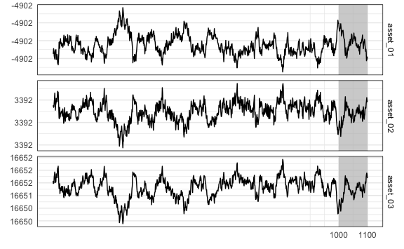

### MEDIUM

``` r
y_medium_train <- dgp$y_medium_train
y_medium_test <- dgp$y_medium_test
```

``` r
y_medium_train %>% 
  mutate(train = TRUE) %>% 
  bind_rows(y_medium_test %>% mutate(train = FALSE)) %>% 
  mutate(id = 1:n()) %>% 
  pivot_longer(-c(id, train), names_to = "asset", values_to = "value") %>% 
  ggplot(aes(x = id, y = value)) +
  annotate(
    geom = "rect",
    xmin = nrow(y_medium_train),
    xmax = nrow(y_medium_train) + nrow(y_medium_test),
    ymin = -Inf,
    ymax = Inf,
    alpha = .7,
    fill = "grey" # test set
  ) +
  geom_path() +
  facet_grid(asset ~ ., scales = "free_y") +
  scale_x_continuous(
    breaks = c(nrow(y_medium_train), nrow(y_medium_train) + nrow(y_medium_test))
  ) +
  theme_minimal() +
  theme(
    strip.text.y = element_text(size = 5), 
    panel.border = element_rect(fill = NA)
  ) +
  labs(
    x = element_blank(),
    y = element_blank()
  )
```

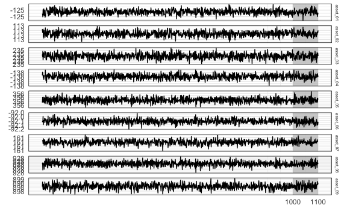

### LARGE

``` r
y_large_train <- dgp$y_large_train
y_large_test <- dgp$y_large_test
```

``` r
y_large_train %>% 
  mutate(train = TRUE) %>% 
  bind_rows(y_large_test %>% mutate(train = FALSE)) %>% 
  mutate(id = 1:n()) %>% 
  pivot_longer(-c(id, train), names_to = "asset", values_to = "value") %>% 
  ggplot(aes(x = id, y = value)) +
  annotate(
    geom = "rect",
    xmin = nrow(y_large_train),
    xmax = nrow(y_large_train) + nrow(y_large_test),
    ymin = -Inf,
    ymax = Inf,
    alpha = .7,
    fill = "grey" # test set
  ) +
  geom_path(size = .3) +
  facet_grid(asset ~ ., scales = "free_y") +
  scale_x_continuous(
    breaks = c(nrow(y_large_train), nrow(y_large_train) + nrow(y_large_test))
  ) +
  theme_minimal() +
  theme(
    strip.text.y = element_text(size = 5), 
    panel.border = element_rect(fill = NA),
    axis.text.y = element_text(size = 3)
  ) +
  labs(
    x = element_blank(),
    y = element_blank()
  )
```

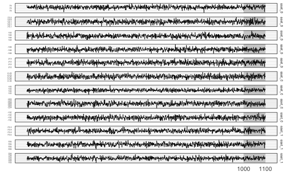

# Modeling

## VAR

``` r
(var_lag <- 5)
#> [1] 5
```

``` r
fit_var_small <- var_lm(y_small_train, var_lag, include_mean = FALSE)
fit_var_medium <- var_lm(y_medium_train, var_lag, include_mean = FALSE)
fit_var_large <- var_lm(y_large_train, var_lag, include_mean = FALSE)
```

## VHAR

``` r
fit_vhar_small <- vhar_lm(y_small_train, include_mean = FALSE)
fit_vhar_medium <- vhar_lm(y_medium_train, include_mean = FALSE)
fit_vhar_large <- vhar_lm(y_large_train, include_mean = FALSE)
```

## BVAR

``` r
(bvar_lag <- 5)
#> [1] 5
```

``` r
bvar_small_spec <- set_bvar(
  sigma = bvhar_small_spec$sigma,
  lambda = bvhar_small_spec$lambda,
  delta = bvhar_small_spec$daily
)
#----------------------------
bvar_medium_spec <- set_bvar(
  sigma = bvhar_medium_spec$sigma,
  lambda = bvhar_medium_spec$lambda,
  delta = bvhar_medium_spec$daily
)
#----------------------------
bvar_large_spec <- set_bvar(
  sigma = bvhar_large_spec$sigma,
  lambda = bvhar_large_spec$lambda,
  delta = bvhar_large_spec$daily
)
```

``` r
(bvar_small_optim <- choose_bvar(
  bvar_small_spec, 
  lower = c(
    rep(1e-2, n_small), # sigma
    1e-4, # lambda
    rep(1e-2, n_small) # delta
  ), 
  upper = c(
    rep(1, n_small), # sigma
    Inf, # lambda
    rep(1, n_small) # delta
  ), 
  y = y_small_train, 
  p = bvar_lag, 
  include_mean = FALSE
))
#> Model Specification for BVAR
#> 
#> Parameters: Coefficent matrice and Covariance matrix
#> Prior: Minnesota
#> # Type '?bvar_minnesota' in the console for some help.
#> ========================================================
#> 
#> Setting for 'sigma':
#> [1]  0.087  0.118  0.176
#> 
#> Setting for 'lambda':
#> [1]  0.25
#> 
#> Setting for 'delta':
#> [1]  0.455  0.109  0.450
#> 
#> Setting for 'eps':
#> [1]  1e-04
```

``` r
(bvar_medium_optim <- choose_bvar(
  bvar_medium_spec, 
  lower = c(
    rep(1e-2, n_medium), # sigma
    1e-4, # lambda
    rep(1e-2, n_medium) # delta
  ), 
  upper = c(
    rep(1, n_medium), # sigma
    Inf, # lambda
    rep(1, n_medium) # delta
  ), 
  y = y_medium_train, 
  p = bvar_lag, 
  include_mean = FALSE
))
#> Model Specification for BVAR
#> 
#> Parameters: Coefficent matrice and Covariance matrix
#> Prior: Minnesota
#> # Type '?bvar_minnesota' in the console for some help.
#> ========================================================
#> 
#> Setting for 'sigma':
#> [1]  0.0302  0.1312  0.2559  0.2640  0.0138  0.2709  0.0247  0.2487  0.1955
#> 
#> Setting for 'lambda':
#> [1]  1.01
#> 
#> Setting for 'delta':
#> [1]  0.2432  0.2601  0.0208  0.2262  0.4636  0.3973  0.0895  0.1487  0.2947
#> 
#> Setting for 'eps':
#> [1]  1e-04
```

``` r
(bvar_large_optim <- choose_bvar(
  bvar_large_spec, 
  lower = c(
    rep(1e-2, n_large), # sigma
    1e-4, # lambda
    rep(1e-2, n_large) # delta
  ), 
  upper = c(
    rep(1, n_large), # sigma
    Inf, # lambda
    rep(1, n_large) # delta
  ), 
  y = y_large_train, 
  p = bvar_lag, 
  include_mean = FALSE
))
#> Model Specification for BVAR
#> 
#> Parameters: Coefficent matrice and Covariance matrix
#> Prior: Minnesota
#> # Type '?bvar_minnesota' in the console for some help.
#> ========================================================
#> 
#> Setting for 'sigma':
#>  [1]  0.2173  0.1923  0.2089  0.2145  0.1684  0.2220  0.2896  0.1820  0.0934
#> [10]  0.0819  0.2453  0.0462
#> 
#> Setting for 'lambda':
#> [1]  1
#> 
#> Setting for 'delta':
#>  [1]  0.1223  0.2048  0.1412  0.2194  0.1972  0.1823  0.0470  0.2851  0.0985
#> [10]  0.4293  0.3871  0.4071
#> 
#> Setting for 'eps':
#> [1]  1e-04
```

``` r
fit_small_bvar <- bvar_small_optim$fit
fit_medium_bvar <- bvar_medium_optim$fit
fit_large_bvar <- bvar_large_optim$fit
```

## BVHAR-VAR

``` r
bvhar_var_small_spec <- set_bvhar(
  sigma = bvhar_small_spec$sigma,
  lambda = bvhar_small_spec$lambda,
  delta = bvhar_small_spec$daily
)
#-----------------------------------------
bvhar_var_medium_spec <- set_bvhar(
  sigma = bvhar_medium_spec$sigma,
  lambda = bvhar_medium_spec$lambda,
  delta = bvhar_medium_spec$daily
)
#-----------------------------------------
bvhar_var_large_spec <- set_bvhar(
  sigma = bvhar_large_spec$sigma,
  lambda = bvhar_large_spec$lambda,
  delta = bvhar_large_spec$daily
)
```

``` r
(bvhar_var_small_optim <- choose_bvhar(
  bvhar_var_small_spec, 
  lower = c(
    rep(1e-2, n_small), # sigma
    1e-4, # lambda
    rep(1e-2, n_small) # delta
  ), 
  upper = c(
    rep(1, n_small), # sigma
    Inf, # lambda
    rep(1, n_small) # delta
  ), 
  y = y_small_train, 
  include_mean = FALSE
))
#> Model Specification for BVHAR
#> 
#> Parameters: Coefficent matrice and Covariance matrix
#> Prior: MN_VAR
#> # Type '?bvhar_minnesota' in the console for some help.
#> ========================================================
#> 
#> Setting for 'sigma':
#> [1]  0.0869  0.1190  0.1772
#> 
#> Setting for 'lambda':
#> [1]  0.0553
#> 
#> Setting for 'delta':
#> [1]  0.456  0.110  0.451
#> 
#> Setting for 'eps':
#> [1]  1e-04
```

``` r
(bvhar_var_medium_optim <- choose_bvhar(
  bvhar_var_medium_spec, 
  lower = c(
    rep(1e-2, n_medium), # sigma
    1e-4, # lambda
    rep(1e-2, n_medium) # delta
  ), 
  upper = c(
    rep(1, n_medium), # sigma
    Inf, # lambda
    rep(1, n_medium) # delta
  ), 
  y = y_medium_train, 
  include_mean = FALSE
))
#> Model Specification for BVHAR
#> 
#> Parameters: Coefficent matrice and Covariance matrix
#> Prior: MN_VAR
#> # Type '?bvhar_minnesota' in the console for some help.
#> ========================================================
#> 
#> Setting for 'sigma':
#> [1]  0.0301  0.1312  0.2559  0.2640  0.0138  0.2708  0.0247  0.2486  0.1955
#> 
#> Setting for 'lambda':
#> [1]  1.01
#> 
#> Setting for 'delta':
#> [1]  0.2432  0.2601  0.0208  0.2262  0.4636  0.3973  0.0895  0.1487  0.2947
#> 
#> Setting for 'eps':
#> [1]  1e-04
```

``` r
(bvhar_var_large_optim <- choose_bvhar(
  bvhar_var_large_spec, 
  lower = c(
    rep(1e-2, n_large), # sigma
    1e-4, # lambda
    rep(1e-2, n_large) # delta
  ), 
  upper = c(
    rep(1, n_large), # sigma
    Inf, # lambda
    rep(1, n_large) # delta
  ), 
  y = y_large_train, 
  include_mean = FALSE
))
#> Model Specification for BVHAR
#> 
#> Parameters: Coefficent matrice and Covariance matrix
#> Prior: MN_VAR
#> # Type '?bvhar_minnesota' in the console for some help.
#> ========================================================
#> 
#> Setting for 'sigma':
#>  [1]  0.1683  0.1927  0.2420  0.4040  0.4424  0.3793  0.3318  0.0894  0.3229
#> [10]  0.1121  0.4173  0.0744
#> 
#> Setting for 'lambda':
#> [1]  0.697
#> 
#> Setting for 'delta':
#>  [1]  0.1209  0.2762  0.1099  0.2831  0.2640  0.2749  0.0382  0.2643  0.0774
#> [10]  0.4476  0.3883  0.4811
#> 
#> Setting for 'eps':
#> [1]  1e-04
```

``` r
fit_bvhar_small_var <- bvhar_var_small_optim$fit
fit_bvhar_medium_var <- bvhar_var_medium_optim$fit
fit_bvhar_large_var <- bvhar_var_large_optim$fit
```

## BVHAR-VHAR

``` r
(bvhar_vhar_small_optim <- choose_bvhar(
  bvhar_small_spec, 
  lower = c(
    rep(1e-2, n_small), # sigma
    1e-4, # lambda
    rep(1e-2, n_small), # daily
    rep(1e-2, n_small), # weekly
    rep(1e-2, n_small) # monthly
  ), 
  upper = c(
    rep(1, n_small), # sigma
    Inf, # lambda
    rep(1, n_small), # daily
    rep(1, n_small), # weekly
    rep(1, n_small) # monthly
  ), 
  y = y_small_train, 
  include_mean = FALSE
))
#> Model Specification for BVHAR
#> 
#> Parameters: Coefficent matrice and Covariance matrix
#> Prior: MN_VHAR
#> # Type '?bvhar_minnesota' in the console for some help.
#> ========================================================
#> 
#> Setting for 'sigma':
#> [1]  0.0745  0.1004  0.3095
#> 
#> Setting for 'lambda':
#> [1]  0.042
#> 
#> Setting for 'eps':
#> [1]  1e-04
#> 
#> Setting for 'daily':
#> [1]  0.543  0.253  0.539
#> 
#> Setting for 'weekly':
#> [1]  0.558  0.281  0.429
#> 
#> Setting for 'monthly':
#> [1]  0.1957  0.2549  0.0825
```

``` r
(bvhar_vhar_medium_optim <- choose_bvhar(
  bvhar_medium_spec, 
  lower = c(
    rep(1e-2, n_medium), # sigma
    1e-4, # lambda
    rep(1e-2, n_medium), # daily
    rep(1e-2, n_medium), # weekly
    rep(1e-2, n_medium) # monthly
  ), 
  upper = c(
    rep(1, n_medium), # sigma
    Inf, # lambda
    rep(1, n_medium), # daily
    rep(1, n_medium), # weekly
    rep(1, n_medium) # monthly
  ), 
  y = y_medium_train, 
  include_mean = FALSE
))
#> Model Specification for BVHAR
#> 
#> Parameters: Coefficent matrice and Covariance matrix
#> Prior: MN_VHAR
#> # Type '?bvhar_minnesota' in the console for some help.
#> ========================================================
#> 
#> Setting for 'sigma':
#> [1]  0.0301  0.1311  0.2559  0.2639  0.0138  0.2708  0.0247  0.2486  0.1955
#> 
#> Setting for 'lambda':
#> [1]  0.266
#> 
#> Setting for 'eps':
#> [1]  1e-04
#> 
#> Setting for 'daily':
#> [1]  0.2432  0.2601  0.0208  0.2262  0.4636  0.3973  0.0895  0.1486  0.2947
#> 
#> Setting for 'weekly':
#> [1]  0.3627  0.1680  0.0911  0.4798  0.4838  0.0469  0.4437  0.4314  0.4301
#> 
#> Setting for 'monthly':
#> [1]  0.379  0.371  0.143  0.451  0.427  0.369  0.162  0.376  0.415
```

``` r
(bvhar_vhar_large_optim <- choose_bvhar(
  bvhar_large_spec, 
  lower = c(
    rep(1e-2, n_large), # sigma
    1e-4, # lambda
    rep(1e-2, n_large), # daily
    rep(1e-2, n_large), # weekly
    rep(1e-2, n_large) # monthly
  ), 
  upper = c(
    rep(2, n_large), # sigma
    Inf, # lambda
    rep(1, n_large), # daily
    rep(1, n_large), # weekly
    rep(1, n_large) # monthly
  ), 
  y = y_large_train, 
  include_mean = FALSE
))
#> Model Specification for BVHAR
#> 
#> Parameters: Coefficent matrice and Covariance matrix
#> Prior: MN_VHAR
#> # Type '?bvhar_minnesota' in the console for some help.
#> ========================================================
#> 
#> Setting for 'sigma':
#>  [1]  0.2020  0.2106  0.1940  0.2216  0.1602  0.2327  0.3106  0.1851  0.1048
#> [10]  0.0912  0.2501  0.0369
#> 
#> Setting for 'lambda':
#> [1]  1.01
#> 
#> Setting for 'eps':
#> [1]  1e-04
#> 
#> Setting for 'daily':
#>  [1]  0.1223  0.2048  0.1412  0.2194  0.1972  0.1823  0.0470  0.2851  0.0985
#> [10]  0.4293  0.3871  0.4071
#> 
#> Setting for 'weekly':
#>  [1]  0.2045  0.0662  0.1057  0.3588  0.0690  0.3099  0.2887  0.3048  0.1710
#> [10]  0.3479  0.2587  0.3855
#> 
#> Setting for 'monthly':
#>  [1]  0.1232  0.2308  0.3035  0.0634  0.0221  0.4696  0.4777  0.0355  0.3337
#> [10]  0.3117  0.0200  0.2333
```

``` r
fit_bvhar_small_vhar <- bvhar_vhar_small_optim$fit
fit_bvhar_medium_vhar <- bvhar_vhar_medium_optim$fit
fit_bvhar_large_vhar <- bvhar_vhar_large_optim$fit
```

# Errors

## Hyperparameters

## SMALL

``` r
mod_small_list <- list(
  fit_var_small,
  fit_vhar_small,
  fit_small_bvar,
  fit_bvhar_small_var,
  fit_bvhar_small_vhar
)
# 1-step-----------
cv_small_1 <- 
  mod_small_list %>% 
  lapply(
    function(mod) {
      forecast_roll(mod, 1, y_small_test)
    }
  )
# 5-step-----------
cv_small_5 <- 
  mod_small_list %>% 
  lapply(
    function(mod) {
      forecast_roll(mod, 5, y_small_test)
    }
  )
# 20-step----------
cv_small_20 <- 
  mod_small_list %>% 
  lapply(
    function(mod) {
      forecast_roll(mod, 20, y_small_test)
    }
  )
```

### Plots

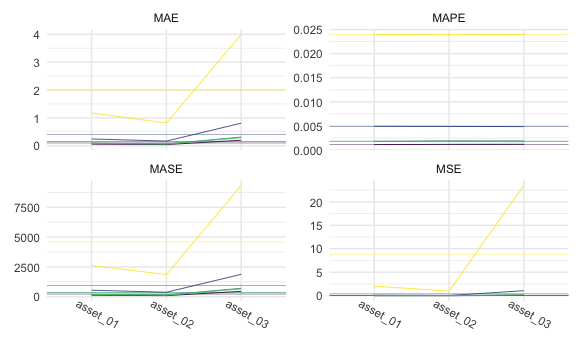

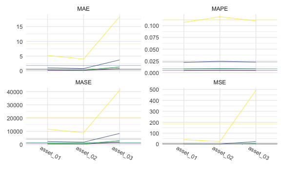

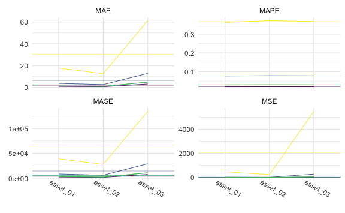

### Tables

1-step:


    \begin{longtable}[t]{lllllll}
    \caption{\label{tab:smallone}SMALL Simulation - 1-step ahead Rolling Window Forecasting Loss}\\
    \toprule
    \multicolumn{1}{c}{ } & \multicolumn{1}{c}{ } & \multicolumn{2}{c}{Frequentist} & \multicolumn{1}{c}{BVAR} & \multicolumn{2}{c}{BVHAR} \\
    \cmidrule(l{3pt}r{3pt}){3-4} \cmidrule(l{3pt}r{3pt}){5-5} \cmidrule(l{3pt}r{3pt}){6-7}
     &  & VAR & VHAR & Minnesota & VAR-type & VHAR-type\\
    \midrule
    \endfirsthead
    \caption[]{SMALL Simulation - 1-step ahead Rolling Window Forecasting Loss \textit{(continued)}}\\
    \toprule
     &  & VAR & VHAR & Minnesota & VAR-type & VHAR-type\\
    \midrule
    \endhead

    \endfoot
    \bottomrule
    \endlastfoot
     & asset01 & \num{0.00791} & \num{0.01366} & \num{0.00387} & \textcolor{red}{\num{0.00305}} & \num{0.00325}\\
    \cmidrule{2-7}\nopagebreak
     & asset02 & \num{0.00541} & \num{0.00567} & \num{0.00502} & \num{0.00504} & \textcolor{red}{\num{0.00499}}\\
    \cmidrule{2-7}\nopagebreak
     & asset03 & \num{0.283} & \num{0.349} & \num{0.211} & \textcolor{red}{\num{0.192}} & \num{0.194}\\
    \cmidrule{2-7}\nopagebreak
    \multirow{-4}{*}{\raggedright\arraybackslash MSE} & \cellcolor{gray}{Average} & \num{0.0986} & \num{0.1229} & \num{0.0733} & \textcolor{red}{\num{0.0666}} & \num{0.0675}\\
    \cmidrule{1-7}\pagebreak[0]
     & asset01 & \num{0.0694} & \num{0.0967} & \num{0.0509} & \textcolor{red}{\num{0.0456}} & \num{0.0462}\\
    \cmidrule{2-7}\nopagebreak
     & asset02 & \num{0.0588} & \num{0.0597} & \num{0.0582} & \textcolor{red}{\num{0.0578}} & \num{0.0579}\\
    \cmidrule{2-7}\nopagebreak
     & asset03 & \num{0.419} & \num{0.466} & \num{0.378} & \textcolor{red}{\num{0.355}} & \num{0.356}\\
    \cmidrule{2-7}\nopagebreak
    \multirow{-4}{*}{\raggedright\arraybackslash MAE} & \cellcolor{gray}{Average} & \num{0.182} & \num{0.208} & \num{0.162} & \textcolor{red}{\num{0.153}} & \num{0.153}\\
    \cmidrule{1-7}\pagebreak[0]
     & asset01 & \num{0.001108} & \num{0.001544} & \num{0.000813} & \textcolor{red}{\num{0.000728}} & \num{0.000739}\\
    \cmidrule{2-7}\nopagebreak
     & asset02 & \num{0.00296} & \num{0.003} & \num{0.00293} & \textcolor{red}{\num{0.00291}} & \num{0.00291}\\
    \cmidrule{2-7}\nopagebreak
     & asset03 & \num{0.00145} & \num{0.00161} & \num{0.00131} & \textcolor{red}{\num{0.00123}} & \num{0.00123}\\
    \cmidrule{2-7}\nopagebreak
    \multirow{-4}{*}{\raggedright\arraybackslash MAPE} & \cellcolor{gray}{Average} & \num{0.00184} & \num{0.00205} & \num{0.00168} & \textcolor{red}{\num{0.00162}} & \num{0.00163}\\
    \cmidrule{1-7}\pagebreak[0]
     & asset01 & \num{86.131} & \num{107.403} & \num{61.896} & \textcolor{red}{\num{55.406}} & \num{55.802}\\
    \cmidrule{2-7}\nopagebreak
     & asset02 & \num{64.9} & \num{63.819} & \num{64.791} & \num{63.068} & \textcolor{red}{\num{62.945}}\\
    \cmidrule{2-7}\nopagebreak
     & asset03 & \num{487.697} & \num{529.675} & \num{425.803} & \textcolor{red}{\num{409.368}} & \num{414.413}\\
    \cmidrule{2-7}\nopagebreak
    \multirow{-4}{*}{\raggedright\arraybackslash MASE} & \cellcolor{gray}{Average} & \num{212.909} & \num{233.632} & \num{184.163} & \textcolor{red}{\num{175.947}} & \num{177.72}\\*
    \end{longtable}

5-step:


    \begin{longtable}[t]{lllllll}
    \caption{\label{tab:smallfive}SMALL Simulation - 5-step ahead Rolling Window Forecasting Loss}\\
    \toprule
    \multicolumn{1}{c}{ } & \multicolumn{1}{c}{ } & \multicolumn{2}{c}{Frequentist} & \multicolumn{1}{c}{BVAR} & \multicolumn{2}{c}{BVHAR} \\
    \cmidrule(l{3pt}r{3pt}){3-4} \cmidrule(l{3pt}r{3pt}){5-5} \cmidrule(l{3pt}r{3pt}){6-7}
     &  & VAR & VHAR & Minnesota & VAR-type & VHAR-type\\
    \midrule
    \endfirsthead
    \caption[]{SMALL Simulation - 5-step ahead Rolling Window Forecasting Loss \textit{(continued)}}\\
    \toprule
     &  & VAR & VHAR & Minnesota & VAR-type & VHAR-type\\
    \midrule
    \endhead

    \endfoot
    \bottomrule
    \endlastfoot
     & asset01 & \num{0.0744} & \num{0.1439} & \num{0.0273} & \num{0.0153} & \textcolor{red}{\num{0.0139}}\\
    \cmidrule{2-7}\nopagebreak
     & asset02 & \num{0.01493} & \num{0.01935} & \num{0.00984} & \num{0.0079} & \textcolor{red}{\num{0.00739}}\\
    \cmidrule{2-7}\nopagebreak
     & asset03 & \num{1.903} & \num{3.512} & \num{0.91} & \num{0.597} & \textcolor{red}{\num{0.541}}\\
    \cmidrule{2-7}\nopagebreak
    \multirow{-4}{*}{\raggedright\arraybackslash MSE} & \cellcolor{gray}{Average} & \num{0.664} & \num{1.225} & \num{0.316} & \num{0.207} & \textcolor{red}{\num{0.188}}\\
    \cmidrule{1-7}\pagebreak[0]
     & asset01 & \num{0.221} & \num{0.306} & \num{0.135} & \num{0.103} & \textcolor{red}{\num{0.098}}\\
    \cmidrule{2-7}\nopagebreak
     & asset02 & \num{0.0967} & \num{0.1112} & \num{0.0751} & \num{0.0706} & \textcolor{red}{\num{0.0685}}\\
    \cmidrule{2-7}\nopagebreak
     & asset03 & \num{1.101} & \num{1.51} & \num{0.734} & \num{0.626} & \textcolor{red}{\num{0.594}}\\
    \cmidrule{2-7}\nopagebreak
    \multirow{-4}{*}{\raggedright\arraybackslash MAE} & \cellcolor{gray}{Average} & \num{0.473} & \num{0.642} & \num{0.315} & \num{0.267} & \textcolor{red}{\num{0.254}}\\
    \cmidrule{1-7}\pagebreak[0]
     & asset01 & \num{0.00352} & \num{0.00489} & \num{0.00215} & \num{0.00165} & \textcolor{red}{\num{0.00157}}\\
    \cmidrule{2-7}\nopagebreak
     & asset02 & \num{0.00486} & \num{0.00559} & \num{0.00378} & \num{0.00355} & \textcolor{red}{\num{0.00345}}\\
    \cmidrule{2-7}\nopagebreak
     & asset03 & \num{0.00381} & \num{0.00523} & \num{0.00254} & \num{0.00217} & \textcolor{red}{\num{0.00206}}\\
    \cmidrule{2-7}\nopagebreak
    \multirow{-4}{*}{\raggedright\arraybackslash MAPE} & \cellcolor{gray}{Average} & \num{0.00407} & \num{0.00524} & \num{0.00282} & \num{0.00246} & \textcolor{red}{\num{0.00236}}\\
    \cmidrule{1-7}\pagebreak[0]
     & asset01 & \num{261.332} & \num{328.303} & \num{167.956} & \num{119.518} & \textcolor{red}{\num{112.298}}\\
    \cmidrule{2-7}\nopagebreak
     & asset02 & \num{119.456} & \num{126.159} & \num{92.962} & \num{84.052} & \textcolor{red}{\num{81.811}}\\
    \cmidrule{2-7}\nopagebreak
     & asset03 & \num{1312.87} & \num{1646.938} & \num{922.662} & \num{748.495} & \textcolor{red}{\num{703.937}}\\
    \cmidrule{2-7}\nopagebreak
    \multirow{-4}{*}{\raggedright\arraybackslash MASE} & \cellcolor{gray}{Average} & \num{564.553} & \num{700.467} & \num{394.527} & \num{317.355} & \textcolor{red}{\num{299.349}}\\*
    \end{longtable}

20-step:


    \begin{longtable}[t]{lllllll}
    \caption{\label{tab:smalltwenty}SMALL Simulation - 20-step ahead Rolling Window Forecasting Loss}\\
    \toprule
    \multicolumn{1}{c}{ } & \multicolumn{1}{c}{ } & \multicolumn{2}{c}{Frequentist} & \multicolumn{1}{c}{BVAR} & \multicolumn{2}{c}{BVHAR} \\
    \cmidrule(l{3pt}r{3pt}){3-4} \cmidrule(l{3pt}r{3pt}){5-5} \cmidrule(l{3pt}r{3pt}){6-7}
     &  & VAR & VHAR & Minnesota & VAR-type & VHAR-type\\
    \midrule
    \endfirsthead
    \caption[]{SMALL Simulation - 20-step ahead Rolling Window Forecasting Loss \textit{(continued)}}\\
    \toprule
     &  & VAR & VHAR & Minnesota & VAR-type & VHAR-type\\
    \midrule
    \endhead

    \endfoot
    \bottomrule
    \endlastfoot
     & asset01 & \num{0.9542} & \num{1.5353} & \num{0.2062} & \num{0.0638} & \textcolor{red}{\num{0.0556}}\\
    \cmidrule{2-7}\nopagebreak
     & asset02 & \num{0.09998} & \num{0.18177} & \num{0.02366} & \num{0.00973} & \textcolor{red}{\num{0.00943}}\\
    \cmidrule{2-7}\nopagebreak
     & asset03 & \num{21.147} & \num{37.218} & \num{4.542} & \num{1.58} & \textcolor{red}{\num{1.505}}\\
    \cmidrule{2-7}\nopagebreak
    \multirow{-4}{*}{\raggedright\arraybackslash MSE} & \cellcolor{gray}{Average} & \num{7.4} & \num{12.978} & \num{1.59} & \num{0.551} & \textcolor{red}{\num{0.523}}\\
    \cmidrule{1-7}\pagebreak[0]
     & asset01 & \num{0.789} & \num{1.009} & \num{0.366} & \num{0.21} & \textcolor{red}{\num{0.193}}\\
    \cmidrule{2-7}\nopagebreak
     & asset02 & \num{0.2525} & \num{0.3478} & \num{0.1235} & \textcolor{red}{\num{0.076}} & \num{0.0769}\\
    \cmidrule{2-7}\nopagebreak
     & asset03 & \num{3.693} & \num{4.973} & \num{1.751} & \num{1.041} & \textcolor{red}{\num{0.991}}\\
    \cmidrule{2-7}\nopagebreak
    \multirow{-4}{*}{\raggedright\arraybackslash MAE} & \cellcolor{gray}{Average} & \num{1.578} & \num{2.11} & \num{0.747} & \num{0.442} & \textcolor{red}{\num{0.42}}\\
    \cmidrule{1-7}\pagebreak[0]
     & asset01 & \num{0.0126} & \num{0.01612} & \num{0.00585} & \num{0.00336} & \textcolor{red}{\num{0.00308}}\\
    \cmidrule{2-7}\nopagebreak
     & asset02 & \num{0.0127} & \num{0.01749} & \num{0.00621} & \textcolor{red}{\num{0.00382}} & \num{0.00387}\\
    \cmidrule{2-7}\nopagebreak
     & asset03 & \num{0.01279} & \num{0.01722} & \num{0.00606} & \num{0.0036} & \textcolor{red}{\num{0.00343}}\\
    \cmidrule{2-7}\nopagebreak
    \multirow{-4}{*}{\raggedright\arraybackslash MAPE} & \cellcolor{gray}{Average} & \num{0.0127} & \num{0.01694} & \num{0.00604} & \num{0.00359} & \textcolor{red}{\num{0.00346}}\\
    \cmidrule{1-7}\pagebreak[0]
     & asset01 & \num{931.135} & \num{1124.781} & \num{484.973} & \num{246.457} & \textcolor{red}{\num{219.347}}\\
    \cmidrule{2-7}\nopagebreak
     & asset02 & \num{302.33} & \num{389.593} & \num{157.702} & \textcolor{red}{\num{91.538}} & \num{91.849}\\
    \cmidrule{2-7}\nopagebreak
     & asset03 & \num{4385.949} & \num{5539.39} & \num{2329.886} & \num{1222.626} & \textcolor{red}{\num{1157.313}}\\
    \cmidrule{2-7}\nopagebreak
    \multirow{-4}{*}{\raggedright\arraybackslash MASE} & \cellcolor{gray}{Average} & \num{1873.138} & \num{2351.255} & \num{990.854} & \num{520.207} & \textcolor{red}{\num{489.503}}\\*
    \end{longtable}

## MEDIUM

``` r
mod_medium_list <- list(
  fit_var_medium,
  fit_vhar_medium,
  fit_medium_bvar,
  fit_bvhar_medium_var,
  fit_bvhar_medium_vhar
)
# 1-step-----------
cv_medium_1 <- 
  mod_medium_list %>% 
  lapply(
    function(mod) {
      forecast_roll(mod, 1, y_medium_test)
    }
  )
# 5-step-----------
cv_medium_5 <- 
  mod_medium_list %>% 
  lapply(
    function(mod) {
      forecast_roll(mod, 5, y_medium_test)
    }
  )
# 20-step----------
cv_medium_20 <- 
  mod_medium_list %>% 
  lapply(
    function(mod) {
      forecast_roll(mod, 20, y_medium_test)
    }
  )
```

### Plots

``` r
cv_medium_1 %>% 
  gg_loss(
    y_medium_test, 
    mean_line = TRUE, 
    line_param = list(size = .3), 
    mean_param = list(alpha = .5, size = .3), 
    viridis = TRUE, 
    show.legend = FALSE
  ) +
  theme_minimal() +
  theme(
    axis.text.x = element_text(angle = -30, vjust = -1),
    legend.title = element_text(size = 8),
    legend.text = element_text(size = 7),
    legend.key.size = unit(.3, "cm")
  )
```

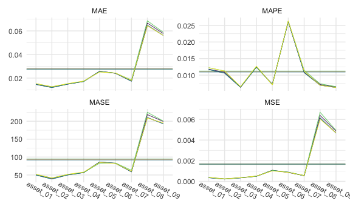

``` r
cv_medium_5 %>% 
  gg_loss(
    y_medium_test, 
    mean_line = TRUE, 
    line_param = list(size = .3), 
    mean_param = list(alpha = .5, size = .3), 
    viridis = TRUE, 
    show.legend = FALSE
  ) +
  theme_minimal() +
  theme(
    axis.text.x = element_text(angle = -30, vjust = -1),
    legend.title = element_text(size = 8),
    legend.text = element_text(size = 7),
    legend.key.size = unit(.3, "cm")
  )
```

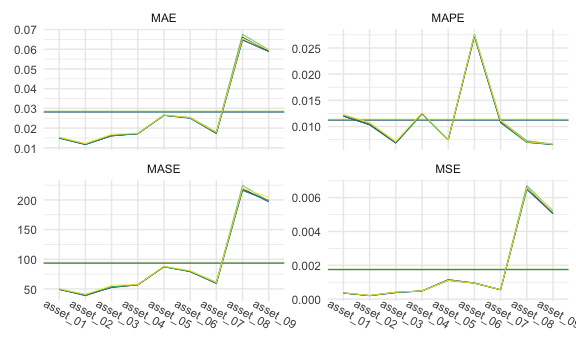

``` r
cv_medium_20 %>% 
  gg_loss(
    y_medium_test, 
    mean_line = TRUE, 
    line_param = list(size = .3), 
    mean_param = list(alpha = .5, size = .3), 
    viridis = TRUE, 
    show.legend = FALSE
  ) +
  theme_minimal() +
  theme(
    axis.text.x = element_text(angle = -30, vjust = -1),
    legend.title = element_text(size = 8),
    legend.text = element_text(size = 7),
    legend.key.size = unit(.3, "cm")
  )
```

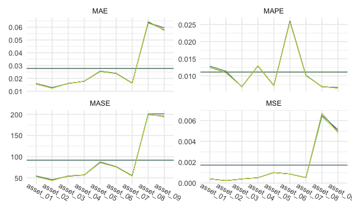

### Tables

1-step:


    \begin{longtable}[t]{lllllll}
    \caption{\label{tab:medone}MEDIUM Simulation - 1-step ahead Rolling Window Forecasting Loss}\\
    \toprule
    \multicolumn{1}{c}{ } & \multicolumn{1}{c}{ } & \multicolumn{2}{c}{Frequentist} & \multicolumn{1}{c}{BVAR} & \multicolumn{2}{c}{BVHAR} \\
    \cmidrule(l{3pt}r{3pt}){3-4} \cmidrule(l{3pt}r{3pt}){5-5} \cmidrule(l{3pt}r{3pt}){6-7}
     &  & VAR & VHAR & Minnesota & VAR-type & VHAR-type\\
    \midrule
    \endfirsthead
    \caption[]{MEDIUM Simulation - 1-step ahead Rolling Window Forecasting Loss \textit{(continued)}}\\
    \toprule
     &  & VAR & VHAR & Minnesota & VAR-type & VHAR-type\\
    \midrule
    \endhead

    \endfoot
    \bottomrule
    \endlastfoot
     & asset01 & \num{0.000134} & \num{0.000146} & \num{0.000134} & \num{0.000147} & \textcolor{red}{\num{0.000133}}\\
    \cmidrule{2-7}\nopagebreak
     & asset02 & \num{0.00159} & \num{0.00164} & \num{0.00157} & \num{0.00167} & \textcolor{red}{\num{0.00156}}\\
    \cmidrule{2-7}\nopagebreak
     & asset03 & \num{0.00884} & \num{0.00929} & \num{0.00885} & \num{0.00914} & \textcolor{red}{\num{0.0087}}\\
    \cmidrule{2-7}\nopagebreak
     & asset04 & \textcolor{red}{\num{0.0126}} & \num{0.0149} & \num{0.0132} & \num{0.0152} & \num{0.0139}\\
    \cmidrule{2-7}\nopagebreak
     & asset05 & \num{9.77e-05} & \num{0.000136} & \textcolor{red}{\num{8.94e-05}} & \num{0.000111} & \num{9.46e-05}\\
    \cmidrule{2-7}\nopagebreak
     & asset06 & \num{0.0253} & \textcolor{red}{\num{0.0237}} & \num{0.0257} & \num{0.0242} & \num{0.0237}\\
    \cmidrule{2-7}\nopagebreak
     & asset07 & \num{0.000144} & \num{0.00014} & \num{0.000143} & \num{0.000131} & \textcolor{red}{\num{0.000124}}\\
    \cmidrule{2-7}\nopagebreak
     & asset08 & \num{0.149} & \num{0.155} & \num{0.14} & \num{0.138} & \textcolor{red}{\num{0.138}}\\
    \cmidrule{2-7}\nopagebreak
     & asset09 & \num{0.0737} & \num{0.0759} & \num{0.0749} & \num{0.0738} & \textcolor{red}{\num{0.0628}}\\
    \cmidrule{2-7}\nopagebreak
    \multirow{-10}{*}{\raggedright\arraybackslash MSE} & \cellcolor{gray}{Average} & \num{0.0301} & \num{0.0312} & \num{0.0294} & \num{0.0291} & \textcolor{red}{\num{0.0276}}\\
    \cmidrule{1-7}\pagebreak[0]
     & asset01 & \num{0.00918} & \num{0.00951} & \num{0.00922} & \num{0.00949} & \textcolor{red}{\num{0.0091}}\\
    \cmidrule{2-7}\nopagebreak
     & asset02 & \num{0.0331} & \num{0.0333} & \num{0.033} & \num{0.0337} & \textcolor{red}{\num{0.0326}}\\
    \cmidrule{2-7}\nopagebreak
     & asset03 & \num{0.0765} & \num{0.0785} & \num{0.076} & \num{0.0775} & \textcolor{red}{\num{0.0755}}\\
    \cmidrule{2-7}\nopagebreak
     & asset04 & \textcolor{red}{\num{0.0877}} & \num{0.0985} & \num{0.0901} & \num{0.0991} & \num{0.0931}\\
    \cmidrule{2-7}\nopagebreak
     & asset05 & \num{0.00804} & \num{0.00979} & \num{0.00772} & \num{0.00852} & \textcolor{red}{\num{0.00747}}\\
    \cmidrule{2-7}\nopagebreak
     & asset06 & \num{0.129} & \num{0.124} & \num{0.129} & \num{0.125} & \textcolor{red}{\num{0.124}}\\
    \cmidrule{2-7}\nopagebreak
     & asset07 & \num{0.00922} & \num{0.0092} & \num{0.00912} & \num{0.00889} & \textcolor{red}{\num{0.00861}}\\
    \cmidrule{2-7}\nopagebreak
     & asset08 & \num{0.317} & \num{0.322} & \num{0.305} & \num{0.307} & \textcolor{red}{\num{0.302}}\\
    \cmidrule{2-7}\nopagebreak
     & asset09 & \num{0.231} & \num{0.227} & \num{0.228} & \num{0.223} & \textcolor{red}{\num{0.21}}\\
    \cmidrule{2-7}\nopagebreak
    \multirow{-10}{*}{\raggedright\arraybackslash MAE} & \cellcolor{gray}{Average} & \num{0.1001} & \num{0.1014} & \num{0.0986} & \num{0.0992} & \textcolor{red}{\num{0.0958}}\\
    \cmidrule{1-7}\pagebreak[0]
     & asset01 & \num{0.00663} & \num{0.00686} & \num{0.00666} & \num{0.00685} & \textcolor{red}{\num{0.00657}}\\
    \cmidrule{2-7}\nopagebreak
     & asset02 & \num{0.00627} & \num{0.00632} & \num{0.00626} & \num{0.00638} & \textcolor{red}{\num{0.00617}}\\
    \cmidrule{2-7}\nopagebreak
     & asset03 & \num{0.00954} & \num{0.00979} & \num{0.00947} & \num{0.00966} & \textcolor{red}{\num{0.00941}}\\
    \cmidrule{2-7}\nopagebreak
     & asset04 & \textcolor{red}{\num{0.00467}} & \num{0.00525} & \num{0.0048} & \num{0.00528} & \num{0.00496}\\
    \cmidrule{2-7}\nopagebreak
     & asset05 & \num{0.001047} & \num{0.001275} & \num{0.001006} & \num{0.001109} & \textcolor{red}{\num{0.000973}}\\
    \cmidrule{2-7}\nopagebreak
     & asset06 & \num{0.00835} & \num{0.00806} & \num{0.00836} & \num{0.00813} & \textcolor{red}{\num{0.00804}}\\
    \cmidrule{2-7}\nopagebreak
     & asset07 & \num{0.00637} & \num{0.00635} & \num{0.0063} & \num{0.00614} & \textcolor{red}{\num{0.00595}}\\
    \cmidrule{2-7}\nopagebreak
     & asset08 & \num{0.00302} & \num{0.00307} & \num{0.00291} & \num{0.00293} & \textcolor{red}{\num{0.00288}}\\
    \cmidrule{2-7}\nopagebreak
     & asset09 & \num{0.0021} & \num{0.00205} & \num{0.00207} & \num{0.00202} & \textcolor{red}{\num{0.0019}}\\
    \cmidrule{2-7}\nopagebreak
    \multirow{-10}{*}{\raggedright\arraybackslash MAPE} & \cellcolor{gray}{Average} & \num{0.00533} & \num{0.00545} & \num{0.00531} & \num{0.00539} & \textcolor{red}{\num{0.0052}}\\
    \cmidrule{1-7}\pagebreak[0]
     & asset01 & \num{38.571} & \num{40.684} & \textcolor{red}{\num{38.405}} & \num{40.922} & \num{38.421}\\
    \cmidrule{2-7}\nopagebreak
     & asset02 & \num{126.68} & \num{125.404} & \num{126.141} & \textcolor{red}{\num{122.725}} & \num{123.445}\\
    \cmidrule{2-7}\nopagebreak
     & asset03 & \num{277.593} & \num{278.262} & \num{274.06} & \num{277.377} & \textcolor{red}{\num{270.992}}\\
    \cmidrule{2-7}\nopagebreak
     & asset04 & \textcolor{red}{\num{298.11}} & \num{363.537} & \num{306.831} & \num{353.741} & \num{335.63}\\
    \cmidrule{2-7}\nopagebreak
     & asset05 & \num{35.558} & \num{43.929} & \textcolor{red}{\num{32.764}} & \num{37.124} & \num{33.119}\\
    \cmidrule{2-7}\nopagebreak
     & asset06 & \num{543.582} & \textcolor{red}{\num{502.857}} & \num{555.504} & \num{511.408} & \num{514.234}\\
    \cmidrule{2-7}\nopagebreak
     & asset07 & \textcolor{red}{\num{35.493}} & \num{37.747} & \num{36.008} & \num{36.438} & \num{35.532}\\
    \cmidrule{2-7}\nopagebreak
     & asset08 & \num{1116.961} & \num{1269.166} & \textcolor{red}{\num{1072.17}} & \num{1120.131} & \num{1123.272}\\
    \cmidrule{2-7}\nopagebreak
     & asset09 & \num{914.271} & \num{961.175} & \num{920.033} & \num{871.999} & \textcolor{red}{\num{818.792}}\\
    \cmidrule{2-7}\nopagebreak
    \multirow{-10}{*}{\raggedright\arraybackslash MASE} & \cellcolor{gray}{Average} & \num{376.313} & \num{402.529} & \num{373.546} & \num{374.652} & \textcolor{red}{\num{365.937}}\\*
    \end{longtable}

5-step:


    \begin{longtable}[t]{lllllll}
    \caption{\label{tab:medfive}MEDIUM Simulation - 5-step ahead Rolling Window Forecasting Loss}\\
    \toprule
    \multicolumn{1}{c}{ } & \multicolumn{1}{c}{ } & \multicolumn{2}{c}{Frequentist} & \multicolumn{1}{c}{BVAR} & \multicolumn{2}{c}{BVHAR} \\
    \cmidrule(l{3pt}r{3pt}){3-4} \cmidrule(l{3pt}r{3pt}){5-5} \cmidrule(l{3pt}r{3pt}){6-7}
     &  & VAR & VHAR & Minnesota & VAR-type & VHAR-type\\
    \midrule
    \endfirsthead
    \caption[]{MEDIUM Simulation - 5-step ahead Rolling Window Forecasting Loss \textit{(continued)}}\\
    \toprule
     &  & VAR & VHAR & Minnesota & VAR-type & VHAR-type\\
    \midrule
    \endhead

    \endfoot
    \bottomrule
    \endlastfoot
     & asset01 & \num{0.000208} & \num{0.000211} & \num{0.000194} & \num{0.000203} & \textcolor{red}{\num{0.000193}}\\
    \cmidrule{2-7}\nopagebreak
     & asset02 & \num{0.00193} & \num{0.00228} & \textcolor{red}{\num{0.00191}} & \num{0.00209} & \num{0.00199}\\
    \cmidrule{2-7}\nopagebreak
     & asset03 & \num{0.00914} & \num{0.00929} & \textcolor{red}{\num{0.00875}} & \num{0.00898} & \num{0.00879}\\
    \cmidrule{2-7}\nopagebreak
     & asset04 & \num{0.0184} & \num{0.0211} & \num{0.0194} & \num{0.0198} & \textcolor{red}{\num{0.0171}}\\
    \cmidrule{2-7}\nopagebreak
     & asset05 & \num{0.000334} & \num{0.000429} & \num{0.000334} & \num{0.000328} & \textcolor{red}{\num{0.000171}}\\
    \cmidrule{2-7}\nopagebreak
     & asset06 & \num{0.0369} & \num{0.0335} & \num{0.0369} & \textcolor{red}{\num{0.0332}} & \num{0.0339}\\
    \cmidrule{2-7}\nopagebreak
     & asset07 & \num{0.000142} & \num{0.000141} & \num{0.000141} & \num{0.000135} & \textcolor{red}{\num{0.000128}}\\
    \cmidrule{2-7}\nopagebreak
     & asset08 & \num{0.175} & \num{0.164} & \num{0.151} & \num{0.149} & \textcolor{red}{\num{0.128}}\\
    \cmidrule{2-7}\nopagebreak
     & asset09 & \num{0.1221} & \num{0.1355} & \num{0.0966} & \num{0.1093} & \textcolor{red}{\num{0.0893}}\\
    \cmidrule{2-7}\nopagebreak
    \multirow{-10}{*}{\raggedright\arraybackslash MSE} & \cellcolor{gray}{Average} & \num{0.0405} & \num{0.0408} & \num{0.0351} & \num{0.0359} & \textcolor{red}{\num{0.031}}\\
    \cmidrule{1-7}\pagebreak[0]
     & asset01 & \num{0.0113} & \num{0.0116} & \num{0.0112} & \num{0.0115} & \textcolor{red}{\num{0.011}}\\
    \cmidrule{2-7}\nopagebreak
     & asset02 & \num{0.0359} & \num{0.0396} & \textcolor{red}{\num{0.0357}} & \num{0.0375} & \num{0.0369}\\
    \cmidrule{2-7}\nopagebreak
     & asset03 & \num{0.0766} & \num{0.0778} & \textcolor{red}{\num{0.0745}} & \num{0.0762} & \num{0.0753}\\
    \cmidrule{2-7}\nopagebreak
     & asset04 & \num{0.106} & \num{0.12} & \num{0.113} & \num{0.114} & \textcolor{red}{\num{0.103}}\\
    \cmidrule{2-7}\nopagebreak
     & asset05 & \num{0.0141} & \num{0.0162} & \num{0.0143} & \num{0.0143} & \textcolor{red}{\num{0.0102}}\\
    \cmidrule{2-7}\nopagebreak
     & asset06 & \num{0.153} & \num{0.149} & \num{0.156} & \textcolor{red}{\num{0.148}} & \num{0.148}\\
    \cmidrule{2-7}\nopagebreak
     & asset07 & \num{0.00919} & \num{0.00918} & \num{0.0091} & \num{0.00891} & \textcolor{red}{\num{0.0087}}\\
    \cmidrule{2-7}\nopagebreak
     & asset08 & \num{0.336} & \num{0.33} & \num{0.303} & \num{0.315} & \textcolor{red}{\num{0.289}}\\
    \cmidrule{2-7}\nopagebreak
     & asset09 & \num{0.286} & \num{0.286} & \textcolor{red}{\num{0.233}} & \num{0.257} & \num{0.238}\\
    \cmidrule{2-7}\nopagebreak
    \multirow{-10}{*}{\raggedright\arraybackslash MAE} & \cellcolor{gray}{Average} & \num{0.114} & \num{0.115} & \num{0.106} & \num{0.109} & \textcolor{red}{\num{0.102}}\\
    \cmidrule{1-7}\pagebreak[0]
     & asset01 & \num{0.00812} & \num{0.00834} & \num{0.0081} & \num{0.00828} & \textcolor{red}{\num{0.00795}}\\
    \cmidrule{2-7}\nopagebreak
     & asset02 & \num{0.00681} & \num{0.0075} & \textcolor{red}{\num{0.00676}} & \num{0.00711} & \num{0.007}\\
    \cmidrule{2-7}\nopagebreak
     & asset03 & \num{0.00954} & \num{0.0097} & \textcolor{red}{\num{0.00928}} & \num{0.00949} & \num{0.00939}\\
    \cmidrule{2-7}\nopagebreak
     & asset04 & \num{0.00565} & \num{0.0064} & \num{0.00602} & \num{0.00606} & \textcolor{red}{\num{0.00549}}\\
    \cmidrule{2-7}\nopagebreak
     & asset05 & \num{0.00183} & \num{0.00211} & \num{0.00186} & \num{0.00186} & \textcolor{red}{\num{0.00133}}\\
    \cmidrule{2-7}\nopagebreak
     & asset06 & \num{0.00993} & \num{0.00963} & \num{0.01009} & \textcolor{red}{\num{0.00956}} & \num{0.0096}\\
    \cmidrule{2-7}\nopagebreak
     & asset07 & \num{0.00635} & \num{0.00635} & \num{0.00629} & \num{0.00616} & \textcolor{red}{\num{0.00601}}\\
    \cmidrule{2-7}\nopagebreak
     & asset08 & \num{0.0032} & \num{0.00314} & \num{0.00289} & \num{0.00301} & \textcolor{red}{\num{0.00275}}\\
    \cmidrule{2-7}\nopagebreak
     & asset09 & \num{0.00259} & \num{0.00259} & \textcolor{red}{\num{0.00211}} & \num{0.00233} & \num{0.00216}\\
    \cmidrule{2-7}\nopagebreak
    \multirow{-10}{*}{\raggedright\arraybackslash MAPE} & \cellcolor{gray}{Average} & \num{0.006} & \num{0.0062} & \num{0.00593} & \num{0.00598} & \textcolor{red}{\num{0.00574}}\\
    \cmidrule{1-7}\pagebreak[0]
     & asset01 & \textcolor{red}{\num{36.775}} & \num{40.682} & \num{43.213} & \num{42.698} & \num{40.063}\\
    \cmidrule{2-7}\nopagebreak
     & asset02 & \textcolor{red}{\num{159.812}} & \num{176.982} & \num{165.794} & \num{170.132} & \num{166.289}\\
    \cmidrule{2-7}\nopagebreak
     & asset03 & \num{304.111} & \textcolor{red}{\num{285.169}} & \num{288.551} & \num{287.593} & \num{288.919}\\
    \cmidrule{2-7}\nopagebreak
     & asset04 & \num{502.071} & \num{533.845} & \num{527.023} & \num{515.049} & \textcolor{red}{\num{468.462}}\\
    \cmidrule{2-7}\nopagebreak
     & asset05 & \num{55.424} & \num{59.945} & \num{51.13} & \num{56.423} & \textcolor{red}{\num{38.989}}\\
    \cmidrule{2-7}\nopagebreak
     & asset06 & \num{614.497} & \textcolor{red}{\num{581.479}} & \num{610.413} & \num{586.95} & \num{585.748}\\
    \cmidrule{2-7}\nopagebreak
     & asset07 & \num{39.167} & \num{38.508} & \num{38.481} & \num{37.642} & \textcolor{red}{\num{36.554}}\\
    \cmidrule{2-7}\nopagebreak
     & asset08 & \num{1129.072} & \num{1119.983} & \num{1006.156} & \num{1081.243} & \textcolor{red}{\num{938.789}}\\
    \cmidrule{2-7}\nopagebreak
     & asset09 & \num{1181.661} & \num{1086.261} & \num{887.563} & \num{1084.819} & \textcolor{red}{\num{858.396}}\\
    \cmidrule{2-7}\nopagebreak
    \multirow{-10}{*}{\raggedright\arraybackslash MASE} & \cellcolor{gray}{Average} & \num{446.954} & \num{435.873} & \num{402.036} & \num{429.172} & \textcolor{red}{\num{380.245}}\\*
    \end{longtable}

20-step:


    \begin{longtable}[t]{lllllll}
    \caption{\label{tab:medtwenty}MEDIUM Simulation - 20-step ahead Rolling Window Forecasting Loss}\\
    \toprule
    \multicolumn{1}{c}{ } & \multicolumn{1}{c}{ } & \multicolumn{2}{c}{Frequentist} & \multicolumn{1}{c}{BVAR} & \multicolumn{2}{c}{BVHAR} \\
    \cmidrule(l{3pt}r{3pt}){3-4} \cmidrule(l{3pt}r{3pt}){5-5} \cmidrule(l{3pt}r{3pt}){6-7}
     &  & VAR & VHAR & Minnesota & VAR-type & VHAR-type\\
    \midrule
    \endfirsthead
    \caption[]{MEDIUM Simulation - 20-step ahead Rolling Window Forecasting Loss \textit{(continued)}}\\
    \toprule
     &  & VAR & VHAR & Minnesota & VAR-type & VHAR-type\\
    \midrule
    \endhead

    \endfoot
    \bottomrule
    \endlastfoot
     & asset01 & \num{0.000288} & \num{0.00026} & \num{0.000312} & \num{0.000261} & \textcolor{red}{\num{0.000205}}\\
    \cmidrule{2-7}\nopagebreak
     & asset02 & \num{0.00305} & \num{0.00277} & \num{0.00335} & \num{0.00274} & \textcolor{red}{\num{0.00219}}\\
    \cmidrule{2-7}\nopagebreak
     & asset03 & \num{0.01044} & \num{0.00874} & \num{0.00847} & \num{0.00859} & \textcolor{red}{\num{0.00744}}\\
    \cmidrule{2-7}\nopagebreak
     & asset04 & \num{0.0324} & \textcolor{red}{\num{0.0237}} & \num{0.0387} & \num{0.024} & \num{0.0246}\\
    \cmidrule{2-7}\nopagebreak
     & asset05 & \num{0.002696} & \num{0.001222} & \num{0.002359} & \num{0.001119} & \textcolor{red}{\num{0.000509}}\\
    \cmidrule{2-7}\nopagebreak
     & asset06 & \num{0.0435} & \textcolor{red}{\num{0.0359}} & \num{0.0421} & \num{0.0378} & \num{0.0373}\\
    \cmidrule{2-7}\nopagebreak
     & asset07 & \num{0.000195} & \num{0.000138} & \num{0.000148} & \num{0.000149} & \textcolor{red}{\num{0.000132}}\\
    \cmidrule{2-7}\nopagebreak
     & asset08 & \num{0.498} & \num{0.185} & \num{0.392} & \num{0.188} & \textcolor{red}{\num{0.151}}\\
    \cmidrule{2-7}\nopagebreak
     & asset09 & \num{0.567} & \num{0.206} & \num{0.495} & \num{0.227} & \textcolor{red}{\num{0.137}}\\
    \cmidrule{2-7}\nopagebreak
    \multirow{-10}{*}{\raggedright\arraybackslash MSE} & \cellcolor{gray}{Average} & \num{0.1286} & \num{0.0515} & \num{0.1091} & \num{0.0545} & \textcolor{red}{\num{0.04}}\\
    \cmidrule{1-7}\pagebreak[0]
     & asset01 & \num{0.0135} & \num{0.0133} & \num{0.0142} & \num{0.0129} & \textcolor{red}{\num{0.0116}}\\
    \cmidrule{2-7}\nopagebreak
     & asset02 & \num{0.0452} & \num{0.0413} & \num{0.0467} & \num{0.0425} & \textcolor{red}{\num{0.0391}}\\
    \cmidrule{2-7}\nopagebreak
     & asset03 & \num{0.0818} & \num{0.0748} & \num{0.075} & \num{0.0756} & \textcolor{red}{\num{0.0691}}\\
    \cmidrule{2-7}\nopagebreak
     & asset04 & \num{0.146} & \num{0.127} & \num{0.152} & \textcolor{red}{\num{0.125}} & \num{0.126}\\
    \cmidrule{2-7}\nopagebreak
     & asset05 & \num{0.0418} & \num{0.027} & \num{0.0382} & \num{0.0271} & \textcolor{red}{\num{0.0184}}\\
    \cmidrule{2-7}\nopagebreak
     & asset06 & \num{0.167} & \textcolor{red}{\num{0.147}} & \num{0.159} & \num{0.153} & \num{0.152}\\
    \cmidrule{2-7}\nopagebreak
     & asset07 & \num{0.01095} & \num{0.00874} & \num{0.00963} & \num{0.00891} & \textcolor{red}{\num{0.00863}}\\
    \cmidrule{2-7}\nopagebreak
     & asset08 & \num{0.549} & \num{0.368} & \num{0.485} & \num{0.345} & \textcolor{red}{\num{0.302}}\\
    \cmidrule{2-7}\nopagebreak
     & asset09 & \num{0.602} & \num{0.36} & \num{0.567} & \num{0.392} & \textcolor{red}{\num{0.284}}\\
    \cmidrule{2-7}\nopagebreak
    \multirow{-10}{*}{\raggedright\arraybackslash MAE} & \cellcolor{gray}{Average} & \num{0.184} & \num{0.13} & \num{0.172} & \num{0.131} & \textcolor{red}{\num{0.112}}\\
    \cmidrule{1-7}\pagebreak[0]
     & asset01 & \num{0.00977} & \num{0.00959} & \num{0.01026} & \num{0.00931} & \textcolor{red}{\num{0.00838}}\\
    \cmidrule{2-7}\nopagebreak
     & asset02 & \num{0.00857} & \num{0.00783} & \num{0.00885} & \num{0.00805} & \textcolor{red}{\num{0.0074}}\\
    \cmidrule{2-7}\nopagebreak
     & asset03 & \num{0.0102} & \num{0.00932} & \num{0.00935} & \num{0.00943} & \textcolor{red}{\num{0.00861}}\\
    \cmidrule{2-7}\nopagebreak
     & asset04 & \num{0.00776} & \num{0.00677} & \num{0.00809} & \textcolor{red}{\num{0.00664}} & \num{0.00671}\\
    \cmidrule{2-7}\nopagebreak
     & asset05 & \num{0.00545} & \num{0.00352} & \num{0.00498} & \num{0.00352} & \textcolor{red}{\num{0.0024}}\\
    \cmidrule{2-7}\nopagebreak
     & asset06 & \num{0.01082} & \textcolor{red}{\num{0.00949}} & \num{0.0103} & \num{0.00991} & \num{0.00984}\\
    \cmidrule{2-7}\nopagebreak
     & asset07 & \num{0.00757} & \num{0.00604} & \num{0.00665} & \num{0.00615} & \textcolor{red}{\num{0.00596}}\\
    \cmidrule{2-7}\nopagebreak
     & asset08 & \num{0.00523} & \num{0.00351} & \num{0.00462} & \num{0.00329} & \textcolor{red}{\num{0.00288}}\\
    \cmidrule{2-7}\nopagebreak
     & asset09 & \num{0.00546} & \num{0.00327} & \num{0.00514} & \num{0.00355} & \textcolor{red}{\num{0.00258}}\\
    \cmidrule{2-7}\nopagebreak
    \multirow{-10}{*}{\raggedright\arraybackslash MAPE} & \cellcolor{gray}{Average} & \num{0.00787} & \num{0.00659} & \num{0.00758} & \num{0.00665} & \textcolor{red}{\num{0.00609}}\\
    \cmidrule{1-7}\pagebreak[0]
     & asset01 & \num{56.283} & \num{58.787} & \num{59.559} & \num{58.158} & \textcolor{red}{\num{47.279}}\\
    \cmidrule{2-7}\nopagebreak
     & asset02 & \num{192.434} & \num{172.945} & \num{199.524} & \num{167.859} & \textcolor{red}{\num{154.97}}\\
    \cmidrule{2-7}\nopagebreak
     & asset03 & \num{317.16} & \num{305.058} & \num{315.76} & \num{313.053} & \textcolor{red}{\num{277.145}}\\
    \cmidrule{2-7}\nopagebreak
     & asset04 & \num{646.766} & \textcolor{red}{\num{483.776}} & \num{687.492} & \num{513.381} & \num{546.28}\\
    \cmidrule{2-7}\nopagebreak
     & asset05 & \num{175.787} & \num{99.784} & \num{172.754} & \num{118.825} & \textcolor{red}{\num{79.081}}\\
    \cmidrule{2-7}\nopagebreak
     & asset06 & \num{666.887} & \textcolor{red}{\num{588.118}} & \num{667.649} & \num{612.625} & \num{627.26}\\
    \cmidrule{2-7}\nopagebreak
     & asset07 & \num{41.384} & \num{34.372} & \num{37.086} & \textcolor{red}{\num{33.332}} & \num{33.584}\\
    \cmidrule{2-7}\nopagebreak
     & asset08 & \num{2413.303} & \num{1301.074} & \num{2150.454} & \num{1383.536} & \textcolor{red}{\num{1217.205}}\\
    \cmidrule{2-7}\nopagebreak
     & asset09 & \num{2502.6} & \num{1389.695} & \num{2452.877} & \num{1541.494} & \textcolor{red}{\num{1017.281}}\\
    \cmidrule{2-7}\nopagebreak
    \multirow{-10}{*}{\raggedright\arraybackslash MASE} & \cellcolor{gray}{Average} & \num{779.178} & \num{492.623} & \num{749.239} & \num{526.918} & \textcolor{red}{\num{444.454}}\\*
    \end{longtable}

## LARGE

``` r
mod_large_list <- list(
  fit_var_large,
  fit_vhar_large,
  fit_large_bvar,
  fit_bvhar_large_var,
  fit_bvhar_large_vhar
)
# 1-step-----------
cv_large_1 <- 
  mod_large_list %>% 
  lapply(
    function(mod) {
      forecast_roll(mod, 1, y_large_test)
    }
  )
# 5-step-----------
cv_large_5 <- 
  mod_large_list %>% 
  lapply(
    function(mod) {
      forecast_roll(mod, 5, y_large_test)
    }
  )
# 20-step----------
cv_large_20 <- 
  mod_large_list %>% 
  lapply(
    function(mod) {
      forecast_roll(mod, 20, y_large_test)
    }
  )
```

### Plots

``` r
cv_large_1 %>% 
  gg_loss(
    y_large_test, 
    mean_line = TRUE, 
    line_param = list(size = .3),
    mean_param = list(alpha = .5, size = .3), 
    viridis = TRUE, 
    show.legend = FALSE
  ) +
  theme_minimal() +
  theme(
    axis.text.x = element_text(angle = -30, vjust = -1),
    legend.title = element_text(size = 8),
    legend.text = element_text(size = 7),
    legend.key.size = unit(.3, "cm")
  )
```

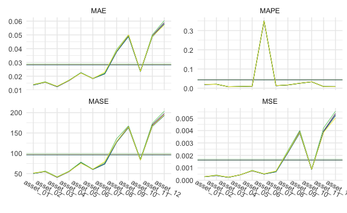

``` r
cv_large_5 %>% 
  gg_loss(
    y_large_test, 
    mean_line = TRUE, 
    line_param = list(size = .3),
    mean_param = list(alpha = .5, size = .3), 
    viridis = TRUE, 
    show.legend = FALSE
  ) +
  theme_minimal() +
  theme(
    axis.text.x = element_text(angle = -30, vjust = -1),
    legend.title = element_text(size = 8),
    legend.text = element_text(size = 7),
    legend.key.size = unit(.3, "cm")
  )
```

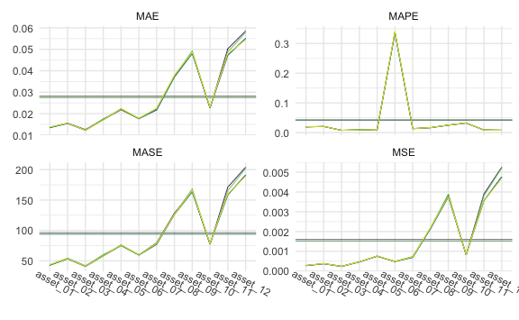

``` r
cv_large_20 %>% 
  gg_loss(
    y_large_test, 
    mean_line = TRUE, 
    line_param = list(size = .3),
    mean_param = list(alpha = .5, size = .3), 
    viridis = TRUE, 
    show.legend = FALSE
  ) +
  theme_minimal() +
  theme(
    axis.text.x = element_text(angle = -30, vjust = -1),
    legend.title = element_text(size = 8),
    legend.text = element_text(size = 7),
    legend.key.size = unit(.3, "cm")
  )
```

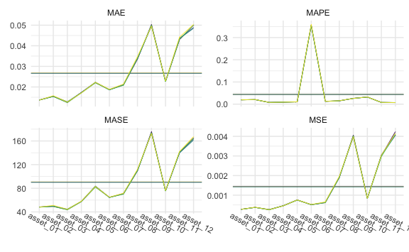

### Tables

1-step:


    \begin{longtable}[t]{lllllll}
    \caption{\label{tab:largeone}LARGE Simulation - 1-step ahead Rolling Window Forecasting Loss}\\
    \toprule
    \multicolumn{1}{c}{ } & \multicolumn{1}{c}{ } & \multicolumn{2}{c}{Frequentist} & \multicolumn{1}{c}{BVAR} & \multicolumn{2}{c}{BVHAR} \\
    \cmidrule(l{3pt}r{3pt}){3-4} \cmidrule(l{3pt}r{3pt}){5-5} \cmidrule(l{3pt}r{3pt}){6-7}
     &  & VAR & VHAR & Minnesota & VAR-type & VHAR-type\\
    \midrule
    \endfirsthead
    \caption[]{LARGE Simulation - 1-step ahead Rolling Window Forecasting Loss \textit{(continued)}}\\
    \toprule
     &  & VAR & VHAR & Minnesota & VAR-type & VHAR-type\\
    \midrule
    \endhead

    \endfoot
    \bottomrule
    \endlastfoot
     & asset01 & \num{0.00555} & \num{0.00576} & \textcolor{red}{\num{0.00548}} & \num{0.00559} & \num{0.00561}\\
    \cmidrule{2-7}\nopagebreak
     & asset02 & \num{0.00627} & \num{0.00602} & \num{0.00619} & \textcolor{red}{\num{0.00577}} & \num{0.00588}\\
    \cmidrule{2-7}\nopagebreak
     & asset03 & \num{0.00422} & \num{0.00444} & \textcolor{red}{\num{0.00415}} & \num{0.00444} & \num{0.00442}\\
    \cmidrule{2-7}\nopagebreak
     & asset04 & \num{0.00782} & \num{0.00806} & \textcolor{red}{\num{0.00768}} & \num{0.0082} & \num{0.00805}\\
    \cmidrule{2-7}\nopagebreak
     & asset05 & \num{0.00935} & \textcolor{red}{\num{0.0089}} & \num{0.00914} & \num{0.00904} & \num{0.00893}\\
    \cmidrule{2-7}\nopagebreak
     & asset06 & \num{0.0106} & \textcolor{red}{\num{0.0105}} & \num{0.0105} & \num{0.0107} & \num{0.0106}\\
    \cmidrule{2-7}\nopagebreak
     & asset07 & \num{0.0249} & \num{0.0281} & \textcolor{red}{\num{0.0247}} & \num{0.0267} & \num{0.0275}\\
    \cmidrule{2-7}\nopagebreak
     & asset08 & \num{0.0337} & \num{0.0324} & \num{0.0333} & \textcolor{red}{\num{0.0316}} & \num{0.0318}\\
    \cmidrule{2-7}\nopagebreak
     & asset09 & \num{0.0132} & \num{0.0134} & \num{0.0132} & \textcolor{red}{\num{0.0129}} & \num{0.013}\\
    \cmidrule{2-7}\nopagebreak
     & asset10 & \num{0.00245} & \num{0.00263} & \textcolor{red}{\num{0.00242}} & \num{0.00255} & \num{0.0026}\\
    \cmidrule{2-7}\nopagebreak
     & asset11 & \num{0.11} & \num{0.105} & \num{0.11} & \textcolor{red}{\num{0.103}} & \num{0.103}\\
    \cmidrule{2-7}\nopagebreak
     & asset12 & \num{0.00461} & \num{0.00425} & \num{0.00453} & \textcolor{red}{\num{0.00422}} & \num{0.00424}\\
    \cmidrule{2-7}\nopagebreak
    \multirow{-13}{*}{\raggedright\arraybackslash MSE} & \cellcolor{gray}{Average} & \num{0.0194} & \num{0.0192} & \num{0.0192} & \textcolor{red}{\num{0.0187}} & \num{0.0188}\\
    \cmidrule{1-7}\pagebreak[0]
     & asset01 & \num{0.06} & \num{0.0612} & \textcolor{red}{\num{0.0594}} & \num{0.0595} & \num{0.06}\\
    \cmidrule{2-7}\nopagebreak
     & asset02 & \num{0.0627} & \num{0.0606} & \num{0.0624} & \textcolor{red}{\num{0.0599}} & \num{0.0601}\\
    \cmidrule{2-7}\nopagebreak
     & asset03 & \num{0.0527} & \num{0.0533} & \textcolor{red}{\num{0.0522}} & \num{0.0528} & \num{0.0531}\\
    \cmidrule{2-7}\nopagebreak
     & asset04 & \num{0.0717} & \num{0.0729} & \textcolor{red}{\num{0.0712}} & \num{0.0732} & \num{0.0727}\\
    \cmidrule{2-7}\nopagebreak
     & asset05 & \num{0.0764} & \num{0.0755} & \num{0.0756} & \num{0.0756} & \textcolor{red}{\num{0.0752}}\\
    \cmidrule{2-7}\nopagebreak
     & asset06 & \num{0.0831} & \textcolor{red}{\num{0.082}} & \num{0.0826} & \num{0.0822} & \num{0.0824}\\
    \cmidrule{2-7}\nopagebreak
     & asset07 & \num{0.131} & \num{0.141} & \textcolor{red}{\num{0.13}} & \num{0.137} & \num{0.14}\\
    \cmidrule{2-7}\nopagebreak
     & asset08 & \num{0.147} & \num{0.145} & \num{0.146} & \textcolor{red}{\num{0.141}} & \num{0.143}\\
    \cmidrule{2-7}\nopagebreak
     & asset09 & \num{0.0906} & \num{0.0905} & \num{0.0909} & \textcolor{red}{\num{0.089}} & \num{0.0892}\\
    \cmidrule{2-7}\nopagebreak
     & asset10 & \num{0.0393} & \num{0.0403} & \textcolor{red}{\num{0.0391}} & \num{0.0394} & \num{0.0399}\\
    \cmidrule{2-7}\nopagebreak
     & asset11 & \num{0.26} & \num{0.253} & \num{0.261} & \num{0.249} & \textcolor{red}{\num{0.248}}\\
    \cmidrule{2-7}\nopagebreak
     & asset12 & \num{0.0545} & \num{0.0527} & \num{0.0545} & \num{0.0517} & \textcolor{red}{\num{0.0515}}\\
    \cmidrule{2-7}\nopagebreak
    \multirow{-13}{*}{\raggedright\arraybackslash MAE} & \cellcolor{gray}{Average} & \num{0.094} & \num{0.094} & \num{0.0937} & \textcolor{red}{\num{0.0926}} & \num{0.0928}\\
    \cmidrule{1-7}\pagebreak[0]
     & asset01 & \num{0.0162} & \num{0.0165} & \textcolor{red}{\num{0.016}} & \num{0.016} & \num{0.0162}\\
    \cmidrule{2-7}\nopagebreak
     & asset02 & \num{0.0141} & \num{0.0136} & \num{0.014} & \textcolor{red}{\num{0.0135}} & \num{0.0135}\\
    \cmidrule{2-7}\nopagebreak
     & asset03 & \num{0.00554} & \num{0.0056} & \textcolor{red}{\num{0.00548}} & \num{0.00555} & \num{0.00558}\\
    \cmidrule{2-7}\nopagebreak
     & asset04 & \num{0.00538} & \num{0.00547} & \textcolor{red}{\num{0.00535}} & \num{0.00549} & \num{0.00546}\\
    \cmidrule{2-7}\nopagebreak
     & asset05 & \num{0.00827} & \num{0.00817} & \num{0.00818} & \num{0.00818} & \textcolor{red}{\num{0.00813}}\\
    \cmidrule{2-7}\nopagebreak
     & asset06 & \num{0.2} & \textcolor{red}{\num{0.198}} & \num{0.199} & \num{0.198} & \num{0.199}\\
    \cmidrule{2-7}\nopagebreak
     & asset07 & \num{0.00882} & \num{0.00955} & \textcolor{red}{\num{0.00881}} & \num{0.00928} & \num{0.00943}\\
    \cmidrule{2-7}\nopagebreak
     & asset08 & \num{0.0115} & \num{0.0114} & \num{0.0115} & \textcolor{red}{\num{0.0111}} & \num{0.0112}\\
    \cmidrule{2-7}\nopagebreak
     & asset09 & \num{0.0167} & \num{0.0167} & \num{0.0168} & \textcolor{red}{\num{0.0164}} & \num{0.0164}\\
    \cmidrule{2-7}\nopagebreak
     & asset10 & \num{0.0132} & \num{0.0135} & \textcolor{red}{\num{0.0131}} & \num{0.0132} & \num{0.0134}\\
    \cmidrule{2-7}\nopagebreak
     & asset11 & \num{0.00474} & \num{0.0046} & \num{0.00474} & \num{0.00454} & \textcolor{red}{\num{0.00451}}\\
    \cmidrule{2-7}\nopagebreak
     & asset12 & \num{0.00293} & \num{0.00284} & \num{0.00293} & \num{0.00278} & \textcolor{red}{\num{0.00277}}\\
    \cmidrule{2-7}\nopagebreak
    \multirow{-13}{*}{\raggedright\arraybackslash MAPE} & \cellcolor{gray}{Average} & \num{0.0256} & \num{0.0255} & \num{0.0255} & \textcolor{red}{\num{0.0253}} & \num{0.0254}\\
    \cmidrule{1-7}\pagebreak[0]
     & asset01 & \num{74.195} & \num{76.04} & \textcolor{red}{\num{73.537}} & \num{74.17} & \num{74.626}\\
    \cmidrule{2-7}\nopagebreak
     & asset02 & \num{75.158} & \num{73.345} & \num{74.891} & \num{72.588} & \textcolor{red}{\num{72.582}}\\
    \cmidrule{2-7}\nopagebreak
     & asset03 & \num{61.975} & \num{63.585} & \textcolor{red}{\num{61.273}} & \num{61.358} & \num{62.313}\\
    \cmidrule{2-7}\nopagebreak
     & asset04 & \textcolor{red}{\num{81.936}} & \num{84.166} & \num{82.09} & \num{85.208} & \num{84.449}\\
    \cmidrule{2-7}\nopagebreak
     & asset05 & \num{88.804} & \num{87.828} & \num{87.954} & \num{88.542} & \textcolor{red}{\num{87.824}}\\
    \cmidrule{2-7}\nopagebreak
     & asset06 & \num{99.881} & \num{100.128} & \textcolor{red}{\num{99.225}} & \num{100.483} & \num{100.788}\\
    \cmidrule{2-7}\nopagebreak
     & asset07 & \num{155.612} & \num{170.626} & \textcolor{red}{\num{155.166}} & \num{164.541} & \num{168.239}\\
    \cmidrule{2-7}\nopagebreak
     & asset08 & \num{170.41} & \num{167.696} & \num{169.16} & \textcolor{red}{\num{163.6}} & \num{164.692}\\
    \cmidrule{2-7}\nopagebreak
     & asset09 & \num{112.149} & \num{111.788} & \num{112.279} & \textcolor{red}{\num{109.97}} & \num{110.394}\\
    \cmidrule{2-7}\nopagebreak
     & asset10 & \num{49.606} & \num{50.869} & \textcolor{red}{\num{49.342}} & \num{50.254} & \num{50.631}\\
    \cmidrule{2-7}\nopagebreak
     & asset11 & \num{317.379} & \num{311.886} & \num{319.806} & \num{306.245} & \textcolor{red}{\num{304.598}}\\
    \cmidrule{2-7}\nopagebreak
     & asset12 & \num{66.07} & \num{63.661} & \num{65.903} & \num{62.768} & \textcolor{red}{\num{62.497}}\\
    \cmidrule{2-7}\nopagebreak
    \multirow{-13}{*}{\raggedright\arraybackslash MASE} & \cellcolor{gray}{Average} & \num{112.765} & \num{113.468} & \num{112.552} & \textcolor{red}{\num{111.644}} & \num{111.969}\\*
    \end{longtable}

5-step:


    \begin{longtable}[t]{lllllll}
    \caption{\label{tab:largefive}LARGE Simulation - 5-step ahead Rolling Window Forecasting Loss}\\
    \toprule
    \multicolumn{1}{c}{ } & \multicolumn{1}{c}{ } & \multicolumn{2}{c}{Frequentist} & \multicolumn{1}{c}{BVAR} & \multicolumn{2}{c}{BVHAR} \\
    \cmidrule(l{3pt}r{3pt}){3-4} \cmidrule(l{3pt}r{3pt}){5-5} \cmidrule(l{3pt}r{3pt}){6-7}
     &  & VAR & VHAR & Minnesota & VAR-type & VHAR-type\\
    \midrule
    \endfirsthead
    \caption[]{LARGE Simulation - 5-step ahead Rolling Window Forecasting Loss \textit{(continued)}}\\
    \toprule
     &  & VAR & VHAR & Minnesota & VAR-type & VHAR-type\\
    \midrule
    \endhead

    \endfoot
    \bottomrule
    \endlastfoot
     & asset01 & \num{0.00589} & \num{0.00635} & \textcolor{red}{\num{0.00586}} & \num{0.00595} & \num{0.00609}\\
    \cmidrule{2-7}\nopagebreak
     & asset02 & \num{0.006} & \num{0.00595} & \num{0.00607} & \textcolor{red}{\num{0.00572}} & \num{0.00589}\\
    \cmidrule{2-7}\nopagebreak
     & asset03 & \textcolor{red}{\num{0.00472}} & \num{0.00493} & \num{0.00479} & \num{0.00482} & \num{0.00479}\\
    \cmidrule{2-7}\nopagebreak
     & asset04 & \num{0.01029} & \textcolor{red}{\num{0.00931}} & \num{0.01017} & \num{0.00993} & \num{0.00939}\\
    \cmidrule{2-7}\nopagebreak
     & asset05 & \textcolor{red}{\num{0.00918}} & \num{0.00928} & \num{0.00939} & \num{0.00944} & \num{0.00932}\\
    \cmidrule{2-7}\nopagebreak
     & asset06 & \num{0.0112} & \textcolor{red}{\num{0.011}} & \num{0.0112} & \num{0.0111} & \num{0.0111}\\
    \cmidrule{2-7}\nopagebreak
     & asset07 & \num{0.0288} & \num{0.0284} & \num{0.0289} & \textcolor{red}{\num{0.0268}} & \num{0.0273}\\
    \cmidrule{2-7}\nopagebreak
     & asset08 & \textcolor{red}{\num{0.0331}} & \num{0.0356} & \num{0.0333} & \num{0.0339} & \num{0.0339}\\
    \cmidrule{2-7}\nopagebreak
     & asset09 & \num{0.0141} & \num{0.0141} & \num{0.014} & \textcolor{red}{\num{0.0135}} & \num{0.0137}\\
    \cmidrule{2-7}\nopagebreak
     & asset10 & \num{0.00362} & \num{0.004} & \textcolor{red}{\num{0.00358}} & \num{0.00364} & \num{0.00382}\\
    \cmidrule{2-7}\nopagebreak
     & asset11 & \num{0.134} & \num{0.138} & \num{0.134} & \textcolor{red}{\num{0.125}} & \num{0.125}\\
    \cmidrule{2-7}\nopagebreak
     & asset12 & \num{0.00831} & \num{0.00749} & \num{0.00815} & \num{0.00712} & \textcolor{red}{\num{0.00702}}\\
    \cmidrule{2-7}\nopagebreak
    \multirow{-13}{*}{\raggedright\arraybackslash MSE} & \cellcolor{gray}{Average} & \num{0.0224} & \num{0.0229} & \num{0.0225} & \textcolor{red}{\num{0.0214}} & \num{0.0215}\\
    \cmidrule{1-7}\pagebreak[0]
     & asset01 & \num{0.0617} & \num{0.0633} & \num{0.0615} & \textcolor{red}{\num{0.0612}} & \num{0.0619}\\
    \cmidrule{2-7}\nopagebreak
     & asset02 & \num{0.0616} & \num{0.0614} & \num{0.0621} & \textcolor{red}{\num{0.0604}} & \num{0.061}\\
    \cmidrule{2-7}\nopagebreak
     & asset03 & \num{0.0539} & \num{0.0551} & \num{0.054} & \textcolor{red}{\num{0.0531}} & \num{0.0534}\\
    \cmidrule{2-7}\nopagebreak
     & asset04 & \num{0.0829} & \textcolor{red}{\num{0.0766}} & \num{0.0833} & \num{0.0807} & \num{0.0788}\\
    \cmidrule{2-7}\nopagebreak
     & asset05 & \num{0.0762} & \num{0.0762} & \num{0.0768} & \num{0.0759} & \textcolor{red}{\num{0.0757}}\\
    \cmidrule{2-7}\nopagebreak
     & asset06 & \num{0.0812} & \textcolor{red}{\num{0.0803}} & \num{0.0811} & \num{0.0806} & \num{0.0805}\\
    \cmidrule{2-7}\nopagebreak
     & asset07 & \num{0.14} & \num{0.141} & \num{0.142} & \textcolor{red}{\num{0.137}} & \num{0.138}\\
    \cmidrule{2-7}\nopagebreak
     & asset08 & \textcolor{red}{\num{0.147}} & \num{0.154} & \num{0.147} & \num{0.148} & \num{0.149}\\
    \cmidrule{2-7}\nopagebreak
     & asset09 & \num{0.0941} & \num{0.0926} & \num{0.094} & \textcolor{red}{\num{0.0911}} & \num{0.0919}\\
    \cmidrule{2-7}\nopagebreak
     & asset10 & \num{0.0484} & \num{0.0525} & \textcolor{red}{\num{0.0481}} & \num{0.0498} & \num{0.0513}\\
    \cmidrule{2-7}\nopagebreak
     & asset11 & \num{0.287} & \num{0.293} & \num{0.287} & \textcolor{red}{\num{0.282}} & \num{0.284}\\
    \cmidrule{2-7}\nopagebreak
     & asset12 & \num{0.0725} & \num{0.0699} & \num{0.0724} & \textcolor{red}{\num{0.068}} & \num{0.0682}\\
    \cmidrule{2-7}\nopagebreak
    \multirow{-13}{*}{\raggedright\arraybackslash MAE} & \cellcolor{gray}{Average} & \num{0.1006} & \num{0.1014} & \num{0.1008} & \textcolor{red}{\num{0.099}} & \num{0.0995}\\
    \cmidrule{1-7}\pagebreak[0]
     & asset01 & \num{0.0166} & \num{0.017} & \num{0.0166} & \textcolor{red}{\num{0.0165}} & \num{0.0167}\\
    \cmidrule{2-7}\nopagebreak
     & asset02 & \num{0.0138} & \num{0.0138} & \num{0.0139} & \textcolor{red}{\num{0.0136}} & \num{0.0137}\\
    \cmidrule{2-7}\nopagebreak
     & asset03 & \num{0.00566} & \num{0.00579} & \num{0.00567} & \textcolor{red}{\num{0.00558}} & \num{0.00561}\\
    \cmidrule{2-7}\nopagebreak
     & asset04 & \num{0.00622} & \textcolor{red}{\num{0.00575}} & \num{0.00626} & \num{0.00606} & \num{0.00592}\\
    \cmidrule{2-7}\nopagebreak
     & asset05 & \num{0.00824} & \num{0.00825} & \num{0.00831} & \num{0.00821} & \textcolor{red}{\num{0.00819}}\\
    \cmidrule{2-7}\nopagebreak
     & asset06 & \num{0.196} & \textcolor{red}{\num{0.193}} & \num{0.195} & \num{0.194} & \num{0.194}\\
    \cmidrule{2-7}\nopagebreak
     & asset07 & \num{0.00946} & \num{0.00951} & \num{0.00957} & \textcolor{red}{\num{0.00926}} & \num{0.00932}\\
    \cmidrule{2-7}\nopagebreak
     & asset08 & \textcolor{red}{\num{0.0116}} & \num{0.0121} & \num{0.0116} & \num{0.0116} & \num{0.0118}\\
    \cmidrule{2-7}\nopagebreak
     & asset09 & \num{0.0174} & \num{0.0171} & \num{0.0173} & \textcolor{red}{\num{0.0168}} & \num{0.0169}\\
    \cmidrule{2-7}\nopagebreak
     & asset10 & \num{0.0162} & \num{0.0176} & \textcolor{red}{\num{0.0161}} & \num{0.0167} & \num{0.0172}\\
    \cmidrule{2-7}\nopagebreak
     & asset11 & \num{0.00523} & \num{0.00534} & \num{0.00522} & \textcolor{red}{\num{0.00513}} & \num{0.00517}\\
    \cmidrule{2-7}\nopagebreak
     & asset12 & \num{0.0039} & \num{0.00376} & \num{0.0039} & \textcolor{red}{\num{0.00366}} & \num{0.00367}\\
    \cmidrule{2-7}\nopagebreak
    \multirow{-13}{*}{\raggedright\arraybackslash MAPE} & \cellcolor{gray}{Average} & \num{0.0258} & \num{0.0258} & \num{0.0258} & \textcolor{red}{\num{0.0256}} & \num{0.0257}\\
    \cmidrule{1-7}\pagebreak[0]
     & asset01 & \num{69.308} & \num{70.081} & \num{69.031} & \textcolor{red}{\num{68.402}} & \num{68.942}\\
    \cmidrule{2-7}\nopagebreak
     & asset02 & \num{71.966} & \num{71.961} & \num{72.708} & \textcolor{red}{\num{70.774}} & \num{71.666}\\
    \cmidrule{2-7}\nopagebreak
     & asset03 & \num{62.019} & \num{64.98} & \num{62.301} & \textcolor{red}{\num{60.966}} & \num{61.496}\\
    \cmidrule{2-7}\nopagebreak
     & asset04 & \num{94.064} & \textcolor{red}{\num{87.265}} & \num{95.756} & \num{92.056} & \num{90.047}\\
    \cmidrule{2-7}\nopagebreak
     & asset05 & \num{95.86} & \num{95.392} & \num{96.665} & \num{94.607} & \textcolor{red}{\num{94.556}}\\
    \cmidrule{2-7}\nopagebreak
     & asset06 & \num{97.507} & \num{96.925} & \num{97.284} & \num{97.056} & \textcolor{red}{\num{96.815}}\\
    \cmidrule{2-7}\nopagebreak
     & asset07 & \num{164.379} & \num{166.667} & \num{166.847} & \textcolor{red}{\num{161.514}} & \num{162.33}\\
    \cmidrule{2-7}\nopagebreak
     & asset08 & \textcolor{red}{\num{175.513}} & \num{185.635} & \num{176.027} & \num{176.325} & \num{178.405}\\
    \cmidrule{2-7}\nopagebreak
     & asset09 & \num{115.887} & \num{116.229} & \num{115.5} & \textcolor{red}{\num{113.104}} & \num{114.474}\\
    \cmidrule{2-7}\nopagebreak
     & asset10 & \num{56.693} & \num{60.507} & \textcolor{red}{\num{56.335}} & \num{58.183} & \num{59.726}\\
    \cmidrule{2-7}\nopagebreak
     & asset11 & \num{336.016} & \num{341.41} & \num{333.12} & \textcolor{red}{\num{326.695}} & \num{329.647}\\
    \cmidrule{2-7}\nopagebreak
     & asset12 & \num{90.108} & \num{86.883} & \num{90.132} & \num{85.122} & \textcolor{red}{\num{84.813}}\\
    \cmidrule{2-7}\nopagebreak
    \multirow{-13}{*}{\raggedright\arraybackslash MASE} & \cellcolor{gray}{Average} & \num{119.11} & \num{120.328} & \num{119.309} & \textcolor{red}{\num{117.067}} & \num{117.743}\\*
    \end{longtable}

20-step:


    \begin{longtable}[t]{lllllll}
    \caption{\label{tab:largetwenty}LARGE Simulation - 20-step ahead Rolling Window Forecasting Loss}\\
    \toprule
    \multicolumn{1}{c}{ } & \multicolumn{1}{c}{ } & \multicolumn{2}{c}{Frequentist} & \multicolumn{1}{c}{BVAR} & \multicolumn{2}{c}{BVHAR} \\
    \cmidrule(l{3pt}r{3pt}){3-4} \cmidrule(l{3pt}r{3pt}){5-5} \cmidrule(l{3pt}r{3pt}){6-7}
     &  & VAR & VHAR & Minnesota & VAR-type & VHAR-type\\
    \midrule
    \endfirsthead
    \caption[]{LARGE Simulation - 20-step ahead Rolling Window Forecasting Loss \textit{(continued)}}\\
    \toprule
     &  & VAR & VHAR & Minnesota & VAR-type & VHAR-type\\
    \midrule
    \endhead

    \endfoot
    \bottomrule
    \endlastfoot
     & asset01 & \textcolor{red}{\num{0.00564}} & \num{0.00576} & \num{0.0058} & \num{0.00588} & \num{0.00578}\\
    \cmidrule{2-7}\nopagebreak
     & asset02 & \textcolor{red}{\num{0.00599}} & \num{0.00633} & \num{0.00605} & \num{0.00628} & \num{0.00626}\\
    \cmidrule{2-7}\nopagebreak
     & asset03 & \num{0.00525} & \num{0.00549} & \textcolor{red}{\num{0.00476}} & \num{0.00496} & \num{0.00515}\\
    \cmidrule{2-7}\nopagebreak
     & asset04 & \num{0.0111} & \num{0.0117} & \num{0.0108} & \num{0.0113} & \textcolor{red}{\num{0.0103}}\\
    \cmidrule{2-7}\nopagebreak
     & asset05 & \num{0.00858} & \num{0.00885} & \num{0.00883} & \num{0.00875} & \textcolor{red}{\num{0.0085}}\\
    \cmidrule{2-7}\nopagebreak
     & asset06 & \num{0.0119} & \num{0.0122} & \textcolor{red}{\num{0.0119}} & \num{0.0121} & \num{0.0122}\\
    \cmidrule{2-7}\nopagebreak
     & asset07 & \num{0.0243} & \num{0.0262} & \textcolor{red}{\num{0.0238}} & \num{0.0256} & \num{0.0255}\\
    \cmidrule{2-7}\nopagebreak
     & asset08 & \num{0.0313} & \num{0.0318} & \textcolor{red}{\num{0.0311}} & \num{0.0314} & \num{0.0318}\\
    \cmidrule{2-7}\nopagebreak
     & asset09 & \num{0.0139} & \textcolor{red}{\num{0.0137}} & \num{0.0142} & \num{0.0138} & \num{0.0138}\\
    \cmidrule{2-7}\nopagebreak
     & asset10 & \num{0.00291} & \num{0.00331} & \textcolor{red}{\num{0.00287}} & \num{0.00292} & \num{0.00322}\\
    \cmidrule{2-7}\nopagebreak
     & asset11 & \num{0.119} & \textcolor{red}{\num{0.118}} & \num{0.121} & \num{0.12} & \num{0.119}\\
    \cmidrule{2-7}\nopagebreak
     & asset12 & \num{0.00584} & \num{0.00528} & \num{0.00645} & \num{0.00548} & \textcolor{red}{\num{0.00514}}\\
    \cmidrule{2-7}\nopagebreak
    \multirow{-13}{*}{\raggedright\arraybackslash MSE} & \cellcolor{gray}{Average} & \textcolor{red}{\num{0.0204}} & \num{0.0207} & \num{0.0206} & \num{0.0207} & \num{0.0206}\\
    \cmidrule{1-7}\pagebreak[0]
     & asset01 & \textcolor{red}{\num{0.0608}} & \num{0.0609} & \num{0.0624} & \num{0.0624} & \num{0.0612}\\
    \cmidrule{2-7}\nopagebreak
     & asset02 & \textcolor{red}{\num{0.0626}} & \num{0.0641} & \num{0.0628} & \num{0.0633} & \num{0.0639}\\
    \cmidrule{2-7}\nopagebreak
     & asset03 & \num{0.0549} & \num{0.0577} & \textcolor{red}{\num{0.0532}} & \num{0.0532} & \num{0.054}\\
    \cmidrule{2-7}\nopagebreak
     & asset04 & \num{0.087} & \num{0.0851} & \num{0.0836} & \num{0.086} & \textcolor{red}{\num{0.0804}}\\
    \cmidrule{2-7}\nopagebreak
     & asset05 & \num{0.0725} & \num{0.0735} & \num{0.0737} & \num{0.0733} & \textcolor{red}{\num{0.0714}}\\
    \cmidrule{2-7}\nopagebreak
     & asset06 & \num{0.0861} & \num{0.0874} & \textcolor{red}{\num{0.086}} & \num{0.0871} & \num{0.0873}\\
    \cmidrule{2-7}\nopagebreak
     & asset07 & \num{0.13} & \num{0.134} & \textcolor{red}{\num{0.129}} & \num{0.134} & \num{0.133}\\
    \cmidrule{2-7}\nopagebreak
     & asset08 & \textcolor{red}{\num{0.136}} & \num{0.141} & \num{0.136} & \num{0.139} & \num{0.141}\\
    \cmidrule{2-7}\nopagebreak
     & asset09 & \num{0.0935} & \num{0.0927} & \num{0.0939} & \textcolor{red}{\num{0.0923}} & \num{0.0926}\\
    \cmidrule{2-7}\nopagebreak
     & asset10 & \num{0.0443} & \num{0.0472} & \textcolor{red}{\num{0.0437}} & \num{0.0442} & \num{0.0466}\\
    \cmidrule{2-7}\nopagebreak
     & asset11 & \num{0.282} & \num{0.284} & \num{0.289} & \num{0.284} & \textcolor{red}{\num{0.281}}\\
    \cmidrule{2-7}\nopagebreak
     & asset12 & \num{0.0624} & \textcolor{red}{\num{0.0587}} & \num{0.0674} & \num{0.062} & \num{0.059}\\
    \cmidrule{2-7}\nopagebreak
    \multirow{-13}{*}{\raggedright\arraybackslash MAE} & \cellcolor{gray}{Average} & \num{0.0976} & \num{0.0988} & \num{0.0984} & \num{0.0985} & \textcolor{red}{\num{0.0976}}\\
    \cmidrule{1-7}\pagebreak[0]
     & asset01 & \textcolor{red}{\num{0.0164}} & \num{0.0164} & \num{0.0168} & \num{0.0168} & \num{0.0165}\\
    \cmidrule{2-7}\nopagebreak
     & asset02 & \textcolor{red}{\num{0.0141}} & \num{0.0144} & \num{0.0141} & \num{0.0142} & \num{0.0143}\\
    \cmidrule{2-7}\nopagebreak
     & asset03 & \num{0.00577} & \num{0.00606} & \textcolor{red}{\num{0.00559}} & \num{0.00559} & \num{0.00568}\\
    \cmidrule{2-7}\nopagebreak
     & asset04 & \num{0.00653} & \num{0.00639} & \num{0.00628} & \num{0.00646} & \textcolor{red}{\num{0.00604}}\\
    \cmidrule{2-7}\nopagebreak
     & asset05 & \num{0.00784} & \num{0.00795} & \num{0.00797} & \num{0.00793} & \textcolor{red}{\num{0.00772}}\\
    \cmidrule{2-7}\nopagebreak
     & asset06 & \num{0.207} & \num{0.21} & \textcolor{red}{\num{0.207}} & \num{0.21} & \num{0.21}\\
    \cmidrule{2-7}\nopagebreak
     & asset07 & \num{0.00877} & \num{0.00906} & \textcolor{red}{\num{0.00874}} & \num{0.00906} & \num{0.00897}\\
    \cmidrule{2-7}\nopagebreak
     & asset08 & \textcolor{red}{\num{0.0107}} & \num{0.0111} & \num{0.0107} & \num{0.0109} & \num{0.0111}\\
    \cmidrule{2-7}\nopagebreak
     & asset09 & \num{0.0172} & \num{0.0171} & \num{0.0173} & \textcolor{red}{\num{0.017}} & \num{0.0171}\\
    \cmidrule{2-7}\nopagebreak
     & asset10 & \num{0.0149} & \num{0.0158} & \textcolor{red}{\num{0.0147}} & \num{0.0148} & \num{0.0156}\\
    \cmidrule{2-7}\nopagebreak
     & asset11 & \num{0.00514} & \num{0.00516} & \num{0.00525} & \num{0.00518} & \textcolor{red}{\num{0.00512}}\\
    \cmidrule{2-7}\nopagebreak
     & asset12 & \num{0.00336} & \textcolor{red}{\num{0.00316}} & \num{0.00363} & \num{0.00333} & \num{0.00317}\\
    \cmidrule{2-7}\nopagebreak
    \multirow{-13}{*}{\raggedright\arraybackslash MAPE} & \cellcolor{gray}{Average} & \textcolor{red}{\num{0.0265}} & \num{0.0269} & \num{0.0265} & \num{0.0268} & \num{0.0268}\\
    \cmidrule{1-7}\pagebreak[0]
     & asset01 & \textcolor{red}{\num{72.75}} & \num{73.515} & \num{74.883} & \num{75.207} & \num{73.82}\\
    \cmidrule{2-7}\nopagebreak
     & asset02 & \textcolor{red}{\num{73.763}} & \num{75.956} & \num{74.155} & \num{75.005} & \num{75.755}\\
    \cmidrule{2-7}\nopagebreak
     & asset03 & \num{65.486} & \num{69.121} & \textcolor{red}{\num{64.415}} & \num{64.527} & \num{64.907}\\
    \cmidrule{2-7}\nopagebreak
     & asset04 & \num{97.885} & \num{98.85} & \num{93.059} & \num{97.289} & \textcolor{red}{\num{91.465}}\\
    \cmidrule{2-7}\nopagebreak
     & asset05 & \num{87.25} & \num{88.282} & \num{88.342} & \num{87.683} & \textcolor{red}{\num{84.568}}\\
    \cmidrule{2-7}\nopagebreak
     & asset06 & \num{107.611} & \num{109.068} & \textcolor{red}{\num{107.453}} & \num{109.076} & \num{109.341}\\
    \cmidrule{2-7}\nopagebreak
     & asset07 & \textcolor{red}{\num{154.886}} & \num{158.539} & \num{155.577} & \num{159.889} & \num{157.971}\\
    \cmidrule{2-7}\nopagebreak
     & asset08 & \textcolor{red}{\num{157.016}} & \num{161.838} & \num{157.78} & \num{159.198} & \num{163.901}\\
    \cmidrule{2-7}\nopagebreak
     & asset09 & \num{108.508} & \num{107.695} & \num{109.116} & \textcolor{red}{\num{107.431}} & \num{107.648}\\
    \cmidrule{2-7}\nopagebreak
     & asset10 & \num{51.708} & \num{55.541} & \textcolor{red}{\num{51.478}} & \num{52.59} & \num{55.283}\\
    \cmidrule{2-7}\nopagebreak
     & asset11 & \textcolor{red}{\num{316.14}} & \num{337.186} & \num{341.864} & \num{331.635} & \num{326.569}\\
    \cmidrule{2-7}\nopagebreak
     & asset12 & \num{74.854} & \textcolor{red}{\num{66.508}} & \num{82.281} & \num{71.286} & \num{68.794}\\
    \cmidrule{2-7}\nopagebreak
    \multirow{-13}{*}{\raggedright\arraybackslash MASE} & \cellcolor{gray}{Average} & \textcolor{red}{\num{113.988}} & \num{116.842} & \num{116.7} & \num{115.901} & \num{115.002}\\*
    \end{longtable}

## Average

### SMALL

1-step:

    \begin{table}

    \caption{\label{tab:smallonemean}SMALL Simulation - 1-step ahead Rolling Window Forecasting Average Loss}
    \centering
    \begin{tabular}[t]{llllll}
    \toprule
      & VAR & VHAR & BVAR-Minnesota & BVHAR-MN-VAR & BVHAR-MN-VHAR\\
    \midrule
    MSE & \num{0.0986} & \num{0.1229} & \num{0.0733} & \textcolor{red}{\num{0.0666}} & \num{0.0675}\\
    MAE & \num{0.182} & \num{0.208} & \num{0.162} & \textcolor{red}{\num{0.153}} & \num{0.153}\\
    MAPE & \num{0.00184} & \num{0.00205} & \num{0.00168} & \textcolor{red}{\num{0.00162}} & \num{0.00163}\\
    MASE & \num{212.909} & \num{233.632} & \num{184.163} & \textcolor{red}{\num{175.947}} & \num{177.72}\\
    \bottomrule
    \end{tabular}
    \end{table}

5-step:

    \begin{table}

    \caption{\label{tab:smallfivemean}SMALL Simulation - 5-step ahead Rolling Window Forecasting Average Loss}
    \centering
    \begin{tabular}[t]{llllll}
    \toprule
      & VAR & VHAR & BVAR-Minnesota & BVHAR-MN-VAR & BVHAR-MN-VHAR\\
    \midrule
    MSE & \num{0.664} & \num{1.225} & \num{0.316} & \num{0.207} & \textcolor{red}{\num{0.188}}\\
    MAE & \num{0.473} & \num{0.642} & \num{0.315} & \num{0.267} & \textcolor{red}{\num{0.254}}\\
    MAPE & \num{0.00407} & \num{0.00524} & \num{0.00282} & \num{0.00246} & \textcolor{red}{\num{0.00236}}\\
    MASE & \num{564.553} & \num{700.467} & \num{394.527} & \num{317.355} & \textcolor{red}{\num{299.349}}\\
    \bottomrule
    \end{tabular}
    \end{table}

20-step:

    \begin{table}

    \caption{\label{tab:smalltwentyemean}SMALL Simulation - 20-step ahead Rolling Window Forecasting Average Loss}
    \centering
    \begin{tabular}[t]{llllll}
    \toprule
      & VAR & VHAR & BVAR-Minnesota & BVHAR-MN-VAR & BVHAR-MN-VHAR\\
    \midrule
    MSE & \num{7.4} & \num{12.978} & \num{1.59} & \num{0.551} & \textcolor{red}{\num{0.523}}\\
    MAE & \num{1.578} & \num{2.11} & \num{0.747} & \num{0.442} & \textcolor{red}{\num{0.42}}\\
    MAPE & \num{0.0127} & \num{0.01694} & \num{0.00604} & \num{0.00359} & \textcolor{red}{\num{0.00346}}\\
    MASE & \num{1873.138} & \num{2351.255} & \num{990.854} & \num{520.207} & \textcolor{red}{\num{489.503}}\\
    \bottomrule
    \end{tabular}
    \end{table}

### MEDIUM

1-step:

    \begin{table}

    \caption{\label{tab:medonemean}MEDIUM Simulation - 1-step ahead Rolling Window Forecasting Average Loss}
    \centering
    \begin{tabular}[t]{llllll}
    \toprule
      & VAR & VHAR & BVAR-Minnesota & BVHAR-MN-VAR & BVHAR-MN-VHAR\\
    \midrule
    MSE & \num{0.0301} & \num{0.0312} & \num{0.0294} & \num{0.0291} & \textcolor{red}{\num{0.0276}}\\
    MAE & \num{0.1001} & \num{0.1014} & \num{0.0986} & \num{0.0992} & \textcolor{red}{\num{0.0958}}\\
    MAPE & \num{0.00533} & \num{0.00545} & \num{0.00531} & \num{0.00539} & \textcolor{red}{\num{0.0052}}\\
    MASE & \num{376.313} & \num{402.529} & \num{373.546} & \num{374.652} & \textcolor{red}{\num{365.937}}\\
    \bottomrule
    \end{tabular}
    \end{table}

5-step:

    \begin{table}

    \caption{\label{tab:medfivemean}MEDIUM Simulation - 5-step ahead Rolling Window Forecasting Average Loss}
    \centering
    \begin{tabular}[t]{llllll}
    \toprule
      & VAR & VHAR & BVAR-Minnesota & BVHAR-MN-VAR & BVHAR-MN-VHAR\\
    \midrule
    MSE & \num{0.0405} & \num{0.0408} & \num{0.0351} & \num{0.0359} & \textcolor{red}{\num{0.031}}\\
    MAE & \num{0.114} & \num{0.115} & \num{0.106} & \num{0.109} & \textcolor{red}{\num{0.102}}\\
    MAPE & \num{0.006} & \num{0.0062} & \num{0.00593} & \num{0.00598} & \textcolor{red}{\num{0.00574}}\\
    MASE & \num{446.954} & \num{435.873} & \num{402.036} & \num{429.172} & \textcolor{red}{\num{380.245}}\\
    \bottomrule
    \end{tabular}
    \end{table}

20-step:

    \begin{table}

    \caption{\label{tab:medtwentyemean}MEDIUM Simulation - 20-step ahead Rolling Window Forecasting Average Loss}
    \centering
    \begin{tabular}[t]{llllll}
    \toprule
      & VAR & VHAR & BVAR-Minnesota & BVHAR-MN-VAR & BVHAR-MN-VHAR\\
    \midrule
    MSE & \num{0.1286} & \num{0.0515} & \num{0.1091} & \num{0.0545} & \textcolor{red}{\num{0.04}}\\
    MAE & \num{0.184} & \num{0.13} & \num{0.172} & \num{0.131} & \textcolor{red}{\num{0.112}}\\
    MAPE & \num{0.00787} & \num{0.00659} & \num{0.00758} & \num{0.00665} & \textcolor{red}{\num{0.00609}}\\
    MASE & \num{779.178} & \num{492.623} & \num{749.239} & \num{526.918} & \textcolor{red}{\num{444.454}}\\
    \bottomrule
    \end{tabular}
    \end{table}

### LARGE

1-step:

    \begin{table}

    \caption{\label{tab:largeonemean}LARGE Simulation - 1-step ahead Rolling Window Forecasting Average Loss}
    \centering
    \begin{tabular}[t]{llllll}
    \toprule
      & VAR & VHAR & BVAR-Minnesota & BVHAR-MN-VAR & BVHAR-MN-VHAR\\
    \midrule
    MSE & \num{0.0194} & \num{0.0192} & \num{0.0192} & \textcolor{red}{\num{0.0187}} & \num{0.0188}\\
    MAE & \num{0.094} & \num{0.094} & \num{0.0937} & \textcolor{red}{\num{0.0926}} & \num{0.0928}\\
    MAPE & \num{0.0256} & \num{0.0255} & \num{0.0255} & \textcolor{red}{\num{0.0253}} & \num{0.0254}\\
    MASE & \num{112.765} & \num{113.468} & \num{112.552} & \textcolor{red}{\num{111.644}} & \num{111.969}\\
    \bottomrule
    \end{tabular}
    \end{table}

5-step:

    \begin{table}

    \caption{\label{tab:largefivemean}LARGE Simulation - 5-step ahead Rolling Window Forecasting Average Loss}
    \centering
    \begin{tabular}[t]{llllll}
    \toprule
      & VAR & VHAR & BVAR-Minnesota & BVHAR-MN-VAR & BVHAR-MN-VHAR\\
    \midrule
    MSE & \num{0.0224} & \num{0.0229} & \num{0.0225} & \textcolor{red}{\num{0.0214}} & \num{0.0215}\\
    MAE & \num{0.1006} & \num{0.1014} & \num{0.1008} & \textcolor{red}{\num{0.099}} & \num{0.0995}\\
    MAPE & \num{0.0258} & \num{0.0258} & \num{0.0258} & \textcolor{red}{\num{0.0256}} & \num{0.0257}\\
    MASE & \num{119.11} & \num{120.328} & \num{119.309} & \textcolor{red}{\num{117.067}} & \num{117.743}\\
    \bottomrule
    \end{tabular}
    \end{table}

20-step:

    \begin{table}

    \caption{\label{tab:largetwentyemean}LARGE Simulation - 20-step ahead Rolling Window Forecasting Average Loss}
    \centering
    \begin{tabular}[t]{llllll}
    \toprule
      & VAR & VHAR & BVAR-Minnesota & BVHAR-MN-VAR & BVHAR-MN-VHAR\\
    \midrule
    MSE & \textcolor{red}{\num{0.0204}} & \num{0.0207} & \num{0.0206} & \num{0.0207} & \num{0.0206}\\
    MAE & \num{0.0976} & \num{0.0988} & \num{0.0984} & \num{0.0985} & \textcolor{red}{\num{0.0976}}\\
    MAPE & \textcolor{red}{\num{0.0265}} & \num{0.0269} & \num{0.0265} & \num{0.0268} & \num{0.0268}\\
    MASE & \textcolor{red}{\num{113.988}} & \num{116.842} & \num{116.7} & \num{115.901} & \num{115.002}\\
    \bottomrule
    \end{tabular}
    \end{table}

### RMSFE or RMAFE

Set VAR as the benchmark model.

``` r
# SMALL-------------------------------
cv_small_list <- 
  lapply(
    c(1, 5, 20),
    function(h) {
      mod_small_list %>% 
        lapply(
          function(mod) {
            forecast_roll(mod, h, y_small_test)
          }
        )
    }
  )
# MEDIUM------------------------------
cv_medium_list <- 
  lapply(
    c(1, 5, 20),
    function(h) {
      mod_small_list %>% 
        lapply(
          function(mod) {
            forecast_roll(mod, h, y_medium_test)
          }
        )
    }
  )
# LARGE-------------------------------
cv_large_list <- 
  lapply(
    c(1, 5, 20),
    function(h) {
      mod_small_list %>% 
        lapply(
          function(mod) {
            forecast_roll(mod, h, y_large_test)
          }
        )
    }
  )
```

    \begin{table}[H]

    \caption{\label{tab:dgp4result}Out-of-sample forecasting performance measures for DGP4.}
    \centering
    \resizebox{\linewidth}{!}{
    \begin{tabular}[t]{cc|ccc|ccc|ccc|}
    \toprule
    \multicolumn{2}{c}{ } & \multicolumn{3}{c}{RMAFE} & \multicolumn{3}{c}{RMSFE} & \multicolumn{3}{c}{RMASE} \\
    \cmidrule(l{3pt}r{3pt}){3-5} \cmidrule(l{3pt}r{3pt}){6-8} \cmidrule(l{3pt}r{3pt}){9-11}
    \rotatebox{0}{} & \rotatebox{0}{} & \rotatebox{0}{$h = 1$} & \rotatebox{0}{$h = 5$} & \rotatebox{0}{$h = 20$} & \rotatebox{0}{$h = 1$} & \rotatebox{0}{$h = 5$} & \rotatebox{0}{$h = 20$} & \rotatebox{0}{$h = 1$} & \rotatebox{0}{$h = 5$} & \rotatebox{0}{$h = 20$}\\
    \midrule
     & VHAR & \textcolor{black}{\num{1.139}} & \textcolor{black}{\num{1.358}} & \textcolor{black}{\num{1.337}} & \textcolor{black}{\num{1.246}} & \textcolor{black}{\num{1.844}} & \textcolor{black}{\num{1.7537}} & \textcolor{black}{\num{1.097}} & \textcolor{black}{\num{1.241}} & \textcolor{black}{\num{1.255}}\\

     & BVAR & \textcolor{black}{\num{0.891}} & \textcolor{black}{\num{0.665}} & \textcolor{black}{\num{0.473}} & \textcolor{black}{\num{0.743}} & \textcolor{black}{\num{0.475}} & \textcolor{black}{\num{0.2149}} & \textcolor{black}{\num{0.865}} & \textcolor{black}{\num{0.699}} & \textcolor{black}{\num{0.529}}\\

     & BVHAR-S & \textcolor{red}{\num{0.838}} & \textcolor{black}{\num{0.564}} & \textcolor{black}{\num{0.280}} & \textcolor{red}{\num{0.675}} & \textcolor{black}{\num{0.311}} & \textcolor{black}{\num{0.0745}} & \textcolor{red}{\num{0.826}} & \textcolor{black}{\num{0.562}} & \textcolor{black}{\num{0.278}}\\

    \multirow{-4}{*}{\centering\arraybackslash SMALL} & BVHAR-L & \textcolor{black}{\num{0.842}} & \textcolor{red}{\num{0.537}} & \textcolor{red}{\num{0.266}} & \textcolor{black}{\num{0.684}} & \textcolor{red}{\num{0.282}} & \textcolor{red}{\num{0.0707}} & \textcolor{black}{\num{0.835}} & \textcolor{red}{\num{0.530}} & \textcolor{red}{\num{0.261}}\\
    \cmidrule{1-11}
     & VHAR & \textcolor{black}{\num{0.376}} & \textcolor{black}{\num{1.418890}} & \textcolor{black}{\num{4.14e+00}} & \textcolor{black}{\num{0.2552}} & \textcolor{black}{\num{2.01e+00}} & \textcolor{black}{\num{1.71e+01}} & \textcolor{black}{\num{0.412}} & \textcolor{black}{\num{1.418885}} & \textcolor{black}{\num{4.14e+00}}\\

     & BVAR & \textcolor{black}{\num{0.756}} & \textcolor{black}{\num{1.809966}} & \textcolor{black}{\num{1.07e+01}} & \textcolor{black}{\num{0.5306}} & \textcolor{black}{\num{3.28e+00}} & \textcolor{black}{\num{1.15e+02}} & \textcolor{black}{\num{0.779}} & \textcolor{black}{\num{1.809974}} & \textcolor{black}{\num{1.07e+01}}\\

     & BVHAR-S & \textcolor{black}{\num{0.261}} & \textcolor{black}{\num{0.222499}} & \textcolor{black}{\num{2.51e-03}} & \textcolor{black}{\num{0.1136}} & \textcolor{black}{\num{4.95e-02}} & \textcolor{black}{\num{6.30e-06}} & \textcolor{black}{\num{0.288}} & \textcolor{black}{\num{0.222497}} & \textcolor{black}{\num{2.51e-03}}\\

    \multirow{-4}{*}{\centering\arraybackslash MEDIUM} & BVHAR-L & \textcolor{red}{\num{0.134}} & \textcolor{red}{\num{0.000522}} & \textcolor{red}{\num{8.53e-14}} & \textcolor{red}{\num{0.0134}} & \textcolor{red}{\num{2.71e-07}} & \textcolor{red}{\num{7.27e-27}} & \textcolor{red}{\num{0.132}} & \textcolor{red}{\num{0.000521}} & \textcolor{red}{\num{8.53e-14}}\\
    \cmidrule{1-11}
     & VHAR & \textcolor{black}{\num{0.244}} & \textcolor{black}{\num{2.48257}} & \textcolor{black}{\num{3.97e+01}} & \textcolor{black}{\num{0.1620}} & \textcolor{black}{\num{6.17e+00}} & \textcolor{black}{\num{1.57e+03}} & \textcolor{black}{\num{0.328}} & \textcolor{black}{\num{2.48337}} & \textcolor{black}{\num{3.97e+01}}\\

     & BVAR & \textcolor{black}{\num{0.755}} & \textcolor{black}{\num{2.71066}} & \textcolor{black}{\num{5.49e+01}} & \textcolor{black}{\num{0.5775}} & \textcolor{black}{\num{7.35e+00}} & \textcolor{black}{\num{3.01e+03}} & \textcolor{black}{\num{0.775}} & \textcolor{black}{\num{2.71128}} & \textcolor{black}{\num{5.49e+01}}\\

     & BVHAR-S & \textcolor{black}{\num{0.207}} & \textcolor{black}{\num{0.69048}} & \textcolor{black}{\num{2.40e-01}} & \textcolor{black}{\num{0.1024}} & \textcolor{black}{\num{4.77e-01}} & \textcolor{black}{\num{5.74e-02}} & \textcolor{black}{\num{0.273}} & \textcolor{black}{\num{0.69070}} & \textcolor{black}{\num{2.40e-01}}\\

    \multirow{-4}{*}{\centering\arraybackslash LARGE} & BVHAR-L & \textcolor{red}{\num{0.102}} & \textcolor{red}{\num{0.00729}} & \textcolor{red}{\num{3.15e-09}} & \textcolor{red}{\num{0.0176}} & \textcolor{red}{\num{5.31e-05}} & \textcolor{red}{\num{9.90e-18}} & \textcolor{red}{\num{0.128}} & \textcolor{red}{\num{0.00729}} & \textcolor{red}{\num{3.15e-09}}\\
    \bottomrule
    \end{tabular}}
    \end{table}

# Coefficients

``` r
bayes_small_mod <- mod_small_list[3:5]
names(bayes_small_mod) <- sapply(bayes_small_mod, function(x) x$process)
small_vec <- names(y_small_train)
names(small_vec) <- names(y_small_train)
# draw---------------------
set.seed(1)
bayes_small_plot <- 
  bayes_small_mod %>% 
  lapply(
    function(mods) {
      lapply(
        small_vec,
        function(x) {
          autoplot(summary(mods), var_name = x) +
            theme_minimal()
        }
      )
    }
  )
# save---------------------
lapply(
  seq_along(bayes_small_plot),
  function(x) {
    process_name <- names(bayes_small_plot)[x] # one of the processes
    p_list <- bayes_small_plot[[process_name]]
    asset_name <- names(p_list) # character vector: asset_01, asset_02, ...
    lapply(
      asset_name,
      function(y) {
        file_name <- 
          paste0(
            "../output/dgp03-figs/small-coef/", 
            str_replace_all(process_name, pattern = "\\_", replacement = "\\-"), 
            "-", 
            str_remove_all(y, pattern = "\\_"),
            ".pdf"
          )
        ggsave(filename = file_name, plot = p_list[[y]])
      }
    )
  }
)
```

``` r
bayes_medium_mod <- mod_medium_list[3:5]
names(bayes_medium_mod) <- sapply(bayes_medium_mod, function(x) x$process)
medium_vec <- names(y_medium_train)
names(medium_vec) <- names(y_medium_train)
# draw---------------------
set.seed(1)
bayes_medium_plot <- 
  bayes_medium_mod %>% 
  lapply(
    function(mods) {
      lapply(
        medium_vec,
        function(x) {
          autoplot(summary(mods), var_name = x) +
            theme_minimal()
        }
      )
    }
  )
# save---------------------
lapply(
  seq_along(bayes_medium_plot),
  function(x) {
    process_name <- names(bayes_medium_plot)[x] # one of the processes
    p_list <- bayes_medium_plot[[process_name]]
    asset_name <- names(p_list) # character vector: asset_01, asset_02, ...
    lapply(
      asset_name,
      function(y) {
        file_name <- 
          paste0(
            "../output/dgp03-figs/med-coef/", 
            str_replace_all(process_name, pattern = "\\_", replacement = "\\-"), 
            "-", 
            str_remove_all(y, pattern = "\\_"),
            ".pdf"
          )
        ggsave(filename = file_name, plot = p_list[[y]])
      }
    )
  }
)
```

``` r
bayes_large_mod <- mod_large_list[3:5]
names(bayes_large_mod) <- sapply(bayes_large_mod, function(x) x$process)
large_vec <- names(y_large_train)
names(large_vec) <- names(y_large_train)
# draw---------------------
set.seed(1)
bayes_large_plot <- 
  bayes_large_mod %>% 
  lapply(
    function(mods) {
      lapply(
        large_vec,
        function(x) {
          autoplot(summary(mods), var_name = x) +
            theme_minimal()
        }
      )
    }
  )
# save---------------------
lapply(
  seq_along(bayes_large_plot),
  function(x) {
    process_name <- names(bayes_large_plot)[x] # one of the processes
    p_list <- bayes_large_plot[[process_name]]
    asset_name <- names(p_list) # character vector: asset_01, asset_02, ...
    lapply(
      asset_name,
      function(y) {
        file_name <- 
          paste0(
            "../output/dgp03-figs/large-coef/", 
            str_replace_all(process_name, pattern = "\\_", replacement = "\\-"), 
            "-", 
            str_remove_all(y, pattern = "\\_"),
            ".pdf"
          )
        ggsave(filename = file_name, plot = p_list[[y]])
      }
    )
  }
)
```
