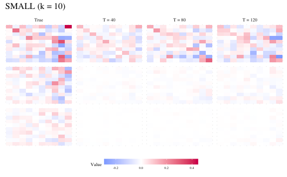
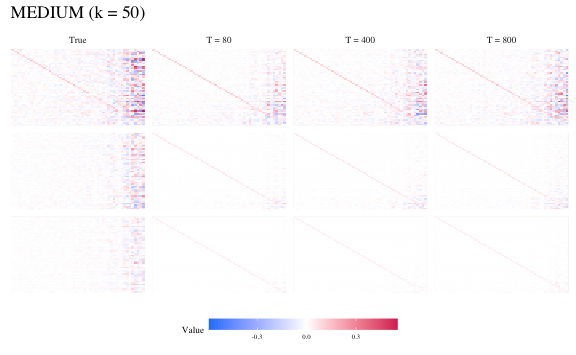

Simulation for Consistency
================
Young Geun Kim
08 Jun, 2022

-   [Fit Models](#fit-models)
    -   [BVHAR-S](#bvhar-s)
        -   [SMALL](#small)
        -   [MEDIUM](#medium)
        -   [LARGE](#large)
    -   [BVHAR-L](#bvhar-l)
        -   [SMALL](#small-1)
        -   [MEDIUM](#medium-1)
        -   [LARGE](#large-1)
-   [Heatmap](#heatmap)
    -   [BVHAR-S](#bvhar-s-1)
        -   [SMALL](#small-2)
        -   [MEDIUM](#medium-2)
        -   [LARGE](#large-2)
    -   [BVHAR-L](#bvhar-l-1)
        -   [SMALL](#small-3)
    -   [Save](#save)
-   [Compare](#compare)
    -   [BVHAR](#bvhar)
    -   [Result](#result)

``` r
sim_data <- "../data/processed/dgp_bvhar_consistency.rds"
```

``` r
# tidyverse----------------------------
library(tidyverse)
# BVHAR custom package-----------------
library(bvhar)
# Set the number of processor cores----
# cl <- parallel::makeCluster(8, type = "FORK")
# foreach to use bind------------------
library(foreach)
# latex table--------------------------
library(knitr)
library(kableExtra)
# set seed for reproducible result-----
set.seed(1)
# width of figure when save------------
fig_width <- 20
```

Simulated data:

``` r
# Simulated data-----------------------
sim_consistency <- readRDS(sim_data)
```

# Fit Models

``` r
y_small <- sim_consistency$y_small_list
y_medium <- sim_consistency$y_medium_list
y_large <- sim_consistency$y_large_list
```

<!-- ## VHAR -->
<!-- ### SMALL -->
<!-- ```{r smallvharfit} -->
<!-- fit_vhar_small <- parallel::mclapply( -->
<!--   1:3, -->
<!--   function(id) { -->
<!--     vhar_lm( -->
<!--       y = y_small[[id]], -->
<!--       har = c(5, 22), -->
<!--       include_mean = FALSE -->
<!--     ) -->
<!--   }, -->
<!--   mc.cores = 3 -->
<!-- ) -->
<!-- ``` -->
<!-- ### MEDIUM -->
<!-- ```{r medvharfit} -->
<!-- fit_vhar_medium <- parallel::mclapply( -->
<!--   1:3, -->
<!--   function(id) { -->
<!--     vhar_lm( -->
<!--       y = y_medium[[id]], -->
<!--       har = c(5, 22), -->
<!--       include_mean = FALSE -->
<!--     ) -->
<!--   }, -->
<!--   mc.cores = 3 -->
<!-- ) -->
<!-- ``` -->
<!-- ### LARGE -->
<!-- ```{r largevharfit} -->
<!-- fit_vhar_large <- parallel::mclapply( -->
<!--   1:3, -->
<!--   function(id) { -->
<!--     vhar_lm( -->
<!--       y = y_large[[id]], -->
<!--       har = c(5, 22), -->
<!--       include_mean = FALSE -->
<!--     ) -->
<!--   }, -->
<!--   mc.cores = 6 -->
<!-- ) -->
<!-- ``` -->

## BVHAR-S

### SMALL

``` r
fit_bvhars_small <- parallel::mclapply(
  1:3,
  function(id) {
    bvhar_minnesota(
      y = y_small[[id]],
      bayes_spec = sim_consistency$small_spec,
      include_mean = FALSE
    )
  },
  mc.cores = 3
)
```

### MEDIUM

``` r
fit_bvhars_medium <- parallel::mclapply(
  1:3,
  function(id) {
    bvhar_minnesota(
      y = y_medium[[id]],
      bayes_spec = sim_consistency$medium_spec,
      include_mean = FALSE
    )
  },
  mc.cores = 3
)
```

### LARGE

``` r
fit_bvhars_large <- parallel::mclapply(
  1:3,
  function(id) {
    bvhar_minnesota(
      y = y_large[[id]],
      bayes_spec = sim_consistency$large_spec,
      include_mean = FALSE
    )
  },
  mc.cores = 6
)
```

## BVHAR-L

``` r
n_small <- ncol(sim_consistency$y_small[[1]])
n_medium <- ncol(sim_consistency$y_medium[[1]])
n_large <- ncol(sim_consistency$y_large[[1]])
```

### SMALL

``` r
bvharl_small_spec <- set_weight_bvhar(
  sigma = sim_consistency$small_spec$sigma,
  lambda = sim_consistency$small_spec$lambda,
  daily = sim_consistency$small_spec$delta,
  weekly = sim_consistency$small_spec$delta,
  monthly = sim_consistency$small_spec$delta
)
```

``` r
fit_bvharl_small <- parallel::mclapply(
  1:3,
  function(id) {
    bvhar_minnesota(
      y = y_small[[id]],
      bayes_spec = bvharl_small_spec,
      include_mean = FALSE
    )
  },
  mc.cores = 3
)
```

### MEDIUM

``` r
bvharl_medium_spec <- set_weight_bvhar(
  sigma = sim_consistency$medium_spec$sigma,
  lambda = sim_consistency$medium_spec$lambda,
  daily = sim_consistency$medium_spec$delta,
  weekly = sim_consistency$medium_spec$delta,
  monthly = sim_consistency$medium_spec$delta
)
```

``` r
fit_bvharl_medium <- parallel::mclapply(
  1:3,
  function(id) {
    bvhar_minnesota(
      y = y_medium[[id]],
      bayes_spec = bvharl_medium_spec,
      include_mean = FALSE
    )
  },
  mc.cores = 3
)
```

### LARGE

``` r
bvharl_large_spec <- set_weight_bvhar(
  sigma = sim_consistency$large_spec$sigma,
  lambda = sim_consistency$large_spec$lambda,
  daily = sim_consistency$large_spec$delta,
  weekly = sim_consistency$large_spec$delta,
  monthly = sim_consistency$large_spec$delta
)
```

``` r
fit_bvharl_large <- parallel::mclapply(
  1:3,
  function(id) {
    bvhar_minnesota(
      y = y_large[[id]],
      bayes_spec = bvharl_large_spec,
      include_mean = FALSE
    )
  },
  mc.cores = 6
)
```

# Heatmap

Bind two coefficients as data frame.

``` r
bind_harcoef <- function(true_coef, mod) {
  true_coef_df <- as.data.frame(true_coef)
  # assign row and column names--------
  rownames(true_coef_df) <- rownames(mod[[1]]$coefficients)
  colnames(true_coef_df) <- colnames(mod[[1]]$coefficients)
  # make true coef as data frame-------
  true_coef_df <- 
    true_coef_df %>% 
    rownames_to_column("var_names") %>% 
    mutate(model = "true")
  # each model coefficient-------------
  mod_coef <- foreach(i = 1:3, .combine = rbind) %do% {
    mod[[i]]$coefficients %>% 
      as.data.frame() %>% 
      rownames_to_column("var_names") %>% 
      mutate(model = paste0("bvhar", i))
  }
  bind_rows(true_coef_df, mod_coef)
}
```

## BVHAR-S

### SMALL

``` r
small_s_heatmap <- 
  bind_harcoef(sim_consistency$small_coef$coefficients, fit_bvhars_small) %>% 
  pivot_longer(-c(var_names, model), names_to = "series_id", values_to = "values") %>% 
  mutate(
    model = case_when(
      model == "bvhar1" ~ "T = 40",
      model == "bvhar2" ~ "T = 80",
      model == "bvhar3" ~ "T = 120",
      model == "true" ~ "True"
    ),
    model = factor(
      model, 
      levels = c("True", "T = 40", "T = 80", "T = 120"),
      ordered = TRUE
    )
  ) %>% 
  ggplot(aes(x = series_id, y = var_names)) +
  geom_tile(aes(fill = values)) +
  scale_fill_gradient2(
    name = "Value",
    low = "#132B43", 
    mid = "#56B1F7", 
    high = "#43132b"
  ) +
  theme_minimal() +
  theme(
    strip.text.x = element_text(size = 20),
    axis.ticks = element_blank(),
    axis.text = element_blank(),
    axis.title = element_blank()
  ) +
  facet_wrap(model ~ .)
small_s_heatmap
```



### MEDIUM

``` r
medium_s_heatmap <- 
  bind_harcoef(sim_consistency$medium_coef$coefficients, fit_bvhars_medium) %>% 
  pivot_longer(-c(var_names, model), names_to = "series_id", values_to = "values") %>% 
  mutate(
    model = case_when(
      model == "bvhar1" ~ "T = 80",
      model == "bvhar2" ~ "T = 400",
      model == "bvhar3" ~ "T = 800",
      model == "true" ~ "True"
    ),
    model = factor(
      model, 
      levels = c("True", "T = 80", "T = 400", "T = 800"),
      ordered = TRUE
    )
  ) %>% 
  ggplot(aes(x = series_id, y = var_names)) +
  geom_tile(aes(fill = values)) +
  scale_fill_gradient2(
    name = "Value",
    low = "#132B43", 
    mid = "#56B1F7", 
    high = "#43132b"
  ) +
  theme_minimal() +
  theme(
    strip.text.x = element_text(size = 20),
    axis.ticks = element_blank(),
    axis.text = element_blank(),
    axis.title = element_blank()
  ) +
  facet_wrap(model ~ .)
medium_s_heatmap
```


### LARGE

``` r
large_s_heatmap <- 
  bind_harcoef(sim_consistency$large_coef$coefficients, fit_bvhars_large) %>% 
  pivot_longer(-c(var_names, model), names_to = "series_id", values_to = "values") %>% 
  mutate(
    model = case_when(
      model == "bvhar1" ~ "T = 120",
      model == "bvhar2" ~ "T = 600",
      model == "bvhar3" ~ "T = 1200",
      model == "true" ~ "True"
    ),
    model = factor(
      model, 
      levels = c("True", "T = 120", "T = 600", "T = 1200"),
      ordered = TRUE
    )
  ) %>% 
  ggplot(aes(x = series_id, y = var_names)) +
  geom_tile(aes(fill = values)) +
  scale_fill_gradient2(
    name = "Value",
    low = "#132B43", 
    mid = "#56B1F7", 
    high = "#43132b"
  ) +
  theme_minimal() +
  theme(
    strip.text.x = element_text(size = 20),
    axis.ticks = element_blank(),
    axis.text = element_blank(),
    axis.title = element_blank()
  ) +
  facet_wrap(model ~ .)
large_s_heatmap
```


## BVHAR-L

### SMALL

``` r
small_l_heatmap <- 
  bind_harcoef(sim_consistency$small_coef$coefficients, fit_bvharl_small) %>% 
  pivot_longer(-c(var_names, model), names_to = "series_id", values_to = "values") %>% 
  mutate(
    model = case_when(
      model == "bvhar1" ~ "T = 40",
      model == "bvhar2" ~ "T = 80",
      model == "bvhar3" ~ "T = 120",
      model == "true" ~ "True"
    ),
    model = factor(
      model, 
      levels = c("True", "T = 40", "T = 80", "T = 120"),
      ordered = TRUE
    )
  ) %>% 
  ggplot(aes(x = series_id, y = var_names)) +
  geom_tile(aes(fill = values)) +
  scale_fill_gradient2(
    name = "Value",
    low = "#132B43", 
    mid = "#56B1F7", 
    high = "#43132b"
  ) +
  theme_minimal() +
  theme(
    strip.text.x = element_text(size = 20),
    axis.ticks = element_blank(),
    axis.text = element_blank(),
    axis.title = element_blank()
  ) +
  facet_wrap(model ~ .)
small_l_heatmap
```


``` r
medium_l_heatmap <- 
  bind_harcoef(sim_consistency$medium_coef$coefficients, fit_bvharl_medium) %>% 
  pivot_longer(-c(var_names, model), names_to = "series_id", values_to = "values") %>% 
  mutate(
    model = case_when(
      model == "bvhar1" ~ "T = 80",
      model == "bvhar2" ~ "T = 400",
      model == "bvhar3" ~ "T = 800",
      model == "true" ~ "True"
    ),
    model = factor(
      model, 
      levels = c("True", "T = 80", "T = 400", "T = 800"),
      ordered = TRUE
    )
  ) %>% 
  ggplot(aes(x = series_id, y = var_names)) +
  geom_tile(aes(fill = values)) +
  scale_fill_gradient2(
    name = "Value",
    low = "#132B43", 
    mid = "#56B1F7", 
    high = "#43132b"
  ) +
  theme_minimal() +
  theme(
    strip.text.x = element_text(size = 20),
    axis.ticks = element_blank(),
    axis.text = element_blank(),
    axis.title = element_blank()
  ) +
  facet_wrap(model ~ .)
medium_l_heatmap
```



``` r
large_l_heatmap <- 
  bind_harcoef(sim_consistency$large_coef$coefficients, fit_bvharl_large) %>% 
  pivot_longer(-c(var_names, model), names_to = "series_id", values_to = "values") %>% 
  mutate(
    model = case_when(
      model == "bvhar1" ~ "T = 120",
      model == "bvhar2" ~ "T = 600",
      model == "bvhar3" ~ "T = 1200",
      model == "true" ~ "True"
    ),
    model = factor(
      model, 
      levels = c("True", "T = 120", "T = 600", "T = 1200"),
      ordered = TRUE
    )
  ) %>% 
  ggplot(aes(x = series_id, y = var_names)) +
  geom_tile(aes(fill = values)) +
  scale_fill_gradient2(
    name = "Value",
    low = "#132B43", 
    mid = "#56B1F7", 
    high = "#43132b"
  ) +
  theme_minimal() +
  theme(
    strip.text.x = element_text(size = 20),
    axis.ticks = element_blank(),
    axis.text = element_blank(),
    axis.title = element_blank()
  ) +
  facet_wrap(model ~ .)
large_l_heatmap
```


## Save

``` r
ggsave(
  filename = "../output/figs/simulation-smallsheatmap.pdf", 
  plot = small_s_heatmap,
  device = "pdf",
  scale = .618,
  width = fig_width, 
  units = "in",
  dpi = 1500,
  limitsize = FALSE
)
#> Saving 12.4 x 2.29 in image
#------------------
ggsave(
  filename = "../output/figs/simulation-medsheatmap.pdf", 
  plot = medium_s_heatmap,
  device = "pdf",
  scale = .618,
  width = fig_width, 
  units = "in",
  dpi = 1500,
  limitsize = FALSE
)
#> Saving 12.4 x 2.29 in image
#------------------
ggsave(
  filename = "../output/figs/simulation-largesheatmap.pdf", 
  plot = large_s_heatmap,
  device = "pdf",
  scale = .618,
  width = fig_width, 
  units = "in",
  dpi = 1500,
  limitsize = FALSE
)
#> Saving 12.4 x 2.29 in image
# BVHAR-L----------
ggsave(
  filename = "../output/figs/simulation-smalllheatmap.pdf", 
  plot = small_l_heatmap,
  device = "pdf",
  scale = .618,
  width = fig_width, 
  units = "in",
  dpi = 1500,
  limitsize = FALSE
)
#> Saving 12.4 x 2.29 in image
#------------------
ggsave(
  filename = "../output/figs/simulation-medlheatmap.pdf", 
  plot = medium_l_heatmap,
  device = "pdf",
  scale = .618,
  width = fig_width, 
  units = "in",
  dpi = 1500,
  limitsize = FALSE
)
#> Saving 12.4 x 2.29 in image
#------------------
ggsave(
  filename = "../output/figs/simulation-largelheatmap.pdf", 
  plot = large_l_heatmap,
  device = "pdf",
  scale = .618,
  width = fig_width, 
  units = "in",
  dpi = 1500,
  limitsize = FALSE
)
#> Saving 12.4 x 2.29 in image
```

# Compare

<!-- ## VHAR -->
<!-- ```{r vharnorm} -->
<!-- small_vhar_norm <- parallel::pvec( -->
<!--   1:3, -->
<!--   function(id) { -->
<!--     norm(sim_consistency$small_coef$coefficients - fit_vhar_small[[id]]$coef, type = "2") / norm(sim_consistency$small_coef$coefficients, type = "2") -->
<!--   }, -->
<!--   mc.cores = 3 -->
<!-- ) -->
<!-- #--------------------------------- -->
<!-- medium_vhar_norm <- parallel::pvec( -->
<!--   1:3, -->
<!--   function(id) { -->
<!--     norm(sim_consistency$medium_coef$coefficients - fit_vhar_medium[[id]]$coef, type = "2") / norm(sim_consistency$medium_coef$coefficients, type = "2") -->
<!--   }, -->
<!--   mc.cores = 3 -->
<!-- ) -->
<!-- #----------------------------------- -->
<!-- large_vhar_norm <- parallel::pvec( -->
<!--   1:3, -->
<!--   function(id) { -->
<!--     norm(sim_consistency$large_coef$coefficients - fit_vhar_large[[id]]$coef, type = "2") / norm(sim_consistency$large_coef$coefficients, type = "2") -->
<!--   }, -->
<!--   mc.cores = 3 -->
<!-- ) -->
<!-- ``` -->

## BVHAR

``` r
small_s_norm <- parallel::pvec(
  1:3,
  function(id) {
    norm(sim_consistency$small_coef$coefficients - fit_bvhars_small[[id]]$coef, type = "2") / norm(sim_consistency$small_coef$coefficients, type = "2")
  },
  mc.cores = 3
)
#----------------------------------
small_l_norm <- parallel::pvec(
  1:3,
  function(id) {
    norm(sim_consistency$small_coef$coefficients - fit_bvharl_small[[id]]$coef, type = "2") / norm(sim_consistency$small_coef$coefficients, type = "2")
  },
  mc.cores = 3
)
#----------------------------------
medium_s_norm <- parallel::pvec(
  1:3,
  function(id) {
    norm(sim_consistency$medium_coef$coefficients - fit_bvhars_medium[[id]]$coef, type = "2") / norm(sim_consistency$medium_coef$coefficients, type = "2")
  },
  mc.cores = 3
)
#----------------------------------
medium_l_norm <- parallel::pvec(
  1:3,
  function(id) {
    norm(sim_consistency$medium_coef$coefficients - fit_bvharl_medium[[id]]$coef, type = "2") / norm(sim_consistency$medium_coef$coefficients, type = "2")
  },
  mc.cores = 3
)
#-----------------------------------
large_s_norm <- parallel::pvec(
  1:3,
  function(id) {
    norm(sim_consistency$large_coef$coefficients - fit_bvhars_large[[id]]$coef, type = "2") / norm(sim_consistency$large_coef$coefficients, type = "2")
  },
  mc.cores = 3
)
#----------------------------------
large_l_norm <- parallel::pvec(
  1:3,
  function(id) {
    norm(sim_consistency$large_coef$coefficients - fit_bvharl_large[[id]]$coef, type = "2") / norm(sim_consistency$large_coef$coefficients, type = "2")
  },
  mc.cores = 3
)
```

## Result

``` r
errtibble <- tibble(
  size = gl(n = 3, k = 3, labels = c("SMALL", "MEDIUM", "LARGE")),
  sample_size = c(
    nrow(y_small[[1]]), nrow(y_small[[2]]), nrow(y_small[[3]]),
    nrow(y_medium[[1]]), nrow(y_medium[[2]]), nrow(y_medium[[3]]),
    nrow(y_large[[1]]), nrow(y_large[[2]]), nrow(y_large[[3]])
  ),
  bvhar_s = c(small_s_norm, medium_s_norm, large_s_norm),
  bvhar_l = c(small_s_norm, medium_s_norm, large_s_norm)
)
```

    \begin{table}

    \caption{\label{tab:simconsistency}Relative Estimation Error}
    \centering
    \begin{tabular}[t]{cccc}
    \toprule
    $k$ & $T = n - 22$ & BVHAR-S & BVHAR-L\\
    \midrule
     & \multicolumn{1}{c|}{40} & \multicolumn{1}{c}{\num{.966}} & \multicolumn{1}{c}{\num{.966}}\\

     & \multicolumn{1}{c|}{80} & \multicolumn{1}{c}{\num{.879}} & \multicolumn{1}{c}{\num{.879}}\\

    \multirow{-3}{*}{\centering\arraybackslash SMALL} & \multicolumn{1}{c|}{120} & \multicolumn{1}{c}{\num{.795}} & \multicolumn{1}{c}{\num{.795}}\\
    \cmidrule{1-4}
     & \multicolumn{1}{c|}{200} & \multicolumn{1}{c}{\num{.869}} & \multicolumn{1}{c}{\num{.869}}\\

     & \multicolumn{1}{c|}{400} & \multicolumn{1}{c}{\num{.852}} & \multicolumn{1}{c}{\num{.852}}\\

    \multirow{-3}{*}{\centering\arraybackslash MEDIUM} & \multicolumn{1}{c|}{600} & \multicolumn{1}{c}{\num{.892}} & \multicolumn{1}{c}{\num{.892}}\\
    \cmidrule{1-4}
     & \multicolumn{1}{c|}{400} & \multicolumn{1}{c}{\num{.981}} & \multicolumn{1}{c}{\num{.981}}\\

     & \multicolumn{1}{c|}{800} & \multicolumn{1}{c}{\num{.975}} & \multicolumn{1}{c}{\num{.975}}\\

    \multirow{-3}{*}{\centering\arraybackslash LARGE} & \multicolumn{1}{c|}{1200} & \multicolumn{1}{c}{\num{.967}} & \multicolumn{1}{c}{\num{.967}}\\
    \bottomrule
    \end{tabular}
    \end{table}
