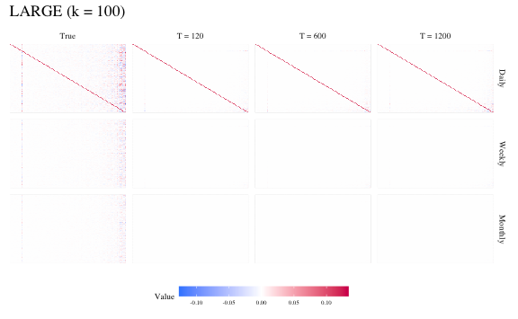
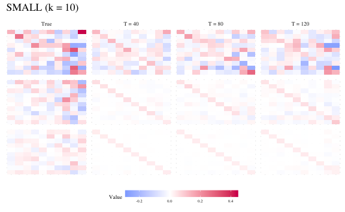
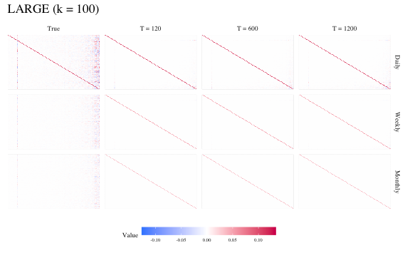
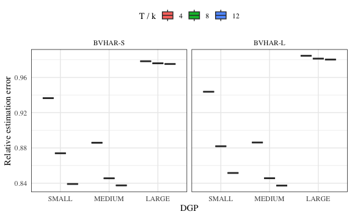

Simulation for Consistency
================
Young Geun Kim
29 Apr, 2023

- [Fit Models](#fit-models)
  - [BVHAR-S](#bvhar-s)
    - [SMALL](#small)
    - [MEDIUM](#medium)
    - [LARGE](#large)
  - [BVHAR-L](#bvhar-l)
    - [SMALL](#small-1)
    - [MEDIUM](#medium-1)
    - [LARGE](#large-1)
- [Heatmap](#heatmap)
  - [BVHAR-S](#bvhar-s-1)
    - [SMALL](#small-2)
    - [MEDIUM](#medium-2)
    - [LARGE](#large-2)
  - [BVHAR-L](#bvhar-l-1)
    - [SMALL](#small-3)
  - [Save](#save)
- [Iterations](#iterations)
  - [SMALL](#small-4)
  - [MEDIUM](#medium-3)
  - [LARGE](#large-3)
  - [Bind](#bind)

``` r
sim_data <- "../data/processed/dgp_bvhar_consistency.rds"
```

``` r
# tidyverse----------------------------
library(tidyverse)
# BVHAR custom package-----------------
library(bvhar)
# ggplot grid--------------------------
library(gridExtra)
# Set the number of processor cores----
# cl <- parallel::makeCluster(8, type = "FORK")
# foreach to use bind------------------
library(foreach)
# latex table--------------------------
library(knitr)
library(kableExtra)
# set seed for reproducible result-----
set.seed(1)
# width of figure when save------------
fig_width <- 21
```

Simulated data:

``` r
# Simulated data-----------------------
sim_consistency <- readRDS(sim_data)
```

# Fit Models

``` r
y_small <- sim_consistency$y_small_list
y_medium <- sim_consistency$y_medium_list
y_large <- sim_consistency$y_large_list
```

## BVHAR-S

### SMALL

``` r
fit_bvhars_small <- parallel::mclapply(
  1:3,
  function(id) {
    bvhar_minnesota(
      y = y_small[[id]],
      bayes_spec = sim_consistency$small_spec,
      include_mean = FALSE
    )
  },
  mc.cores = 3
)
```

### MEDIUM

``` r
fit_bvhars_medium <- parallel::mclapply(
  1:3,
  function(id) {
    bvhar_minnesota(
      y = y_medium[[id]],
      bayes_spec = sim_consistency$medium_spec,
      include_mean = FALSE
    )
  },
  mc.cores = 3
)
```

### LARGE

``` r
fit_bvhars_large <- parallel::mclapply(
  1:3,
  function(id) {
    bvhar_minnesota(
      y = y_large[[id]],
      bayes_spec = sim_consistency$large_spec,
      include_mean = FALSE
    )
  },
  mc.cores = 6
)
```

## BVHAR-L

``` r
# small------------------------------
bvharl_small_spec <- set_weight_bvhar(
  sigma = sim_consistency$small_spec$sigma,
  lambda = sim_consistency$small_spec$lambda,
  daily = sim_consistency$small_spec$delta,
  weekly = sim_consistency$small_spec$delta,
  monthly = sim_consistency$small_spec$delta
)
# medium-----------------------------
bvharl_medium_spec <- set_weight_bvhar(
  sigma = sim_consistency$medium_spec$sigma,
  lambda = sim_consistency$medium_spec$lambda,
  daily = sim_consistency$medium_spec$delta,
  weekly = sim_consistency$medium_spec$delta,
  monthly = sim_consistency$medium_spec$delta
)
# large------------------------------
bvharl_large_spec <- set_weight_bvhar(
  sigma = sim_consistency$large_spec$sigma,
  lambda = sim_consistency$large_spec$lambda,
  daily = sim_consistency$large_spec$delta,
  weekly = sim_consistency$large_spec$delta,
  monthly = sim_consistency$large_spec$delta
)
```

### SMALL

``` r
fit_bvharl_small <- parallel::mclapply(
  1:3,
  function(id) {
    bvhar_minnesota(
      y = y_small[[id]],
      bayes_spec = bvharl_small_spec,
      include_mean = FALSE
    )
  },
  mc.cores = 3
)
```

### MEDIUM

``` r
fit_bvharl_medium <- parallel::mclapply(
  1:3,
  function(id) {
    bvhar_minnesota(
      y = y_medium[[id]],
      bayes_spec = bvharl_medium_spec,
      include_mean = FALSE
    )
  },
  mc.cores = 3
)
```

### LARGE

``` r
fit_bvharl_large <- parallel::mclapply(
  1:3,
  function(id) {
    bvhar_minnesota(
      y = y_large[[id]],
      bayes_spec = bvharl_large_spec,
      include_mean = FALSE
    )
  },
  mc.cores = 6
)
```

# Heatmap

``` r
heatmapfacet_size <- 7
heatmaplegend_width <- 1
heatmaplegend_height <- .3
heatmaplegend_title <- 7
heatmaplegend_text <- 5
legend_position <- "bottom"
```

Bind two coefficients as data frame.

``` r
bind_harcoef <- function(true_coef, mod) {
  true_coef_df <- as.data.frame(true_coef)
  # assign row and column names--------
  rownames(true_coef_df) <- rownames(mod[[1]]$coefficients)
  colnames(true_coef_df) <- colnames(mod[[1]]$coefficients)
  # make true coef as data frame-------
  true_coef_df <- 
    true_coef_df %>% 
    rownames_to_column("var_names") %>% 
    mutate(model = "true")
  # each model coefficient-------------
  mod_coef <- foreach(i = 1:3, .combine = rbind) %do% {
    mod[[i]]$coefficients %>% 
      as.data.frame() %>% 
      rownames_to_column("var_names") %>% 
      mutate(model = paste0("bvhar", i))
  }
  bind_rows(true_coef_df, mod_coef)
}
```

## BVHAR-S

### SMALL

``` r
small_s_heatmap <- 
  bind_harcoef(sim_consistency$small_coef$coefficients, fit_bvhars_small) %>% 
  pivot_longer(-c(var_names, model), names_to = "series_id", values_to = "values") %>% 
  mutate(
    model = case_when(
      model == "bvhar1" ~ "T = 40",
      model == "bvhar2" ~ "T = 80",
      model == "bvhar3" ~ "T = 120",
      model == "true" ~ "True"
    ),
    model = factor(
      model, 
      levels = c("True", "T = 40", "T = 80", "T = 120"),
      ordered = TRUE
    )
  ) %>% 
  ggplot(aes(x = series_id, y = var_names)) +
  geom_tile(aes(fill = values)) +
  scale_fill_gradient2(
    name = "Value",
    low = "#1A85FF", 
    mid = "#FFFFFF", 
    high = "#D41159"
  ) +
  theme_minimal() +
  theme(
    strip.text.x = element_text(size = heatmapfacet_size),
    axis.ticks = element_blank(),
    axis.text = element_blank(),
    axis.title = element_blank(),
    legend.position = legend_position,
    legend.key.width = unit(heatmaplegend_width, "cm"),
    legend.key.height = unit(heatmaplegend_height, "cm"),
    legend.title = element_text(size = heatmaplegend_title),
    legend.text = element_text(size = heatmaplegend_text),
    text = element_text(family = "serif")
  ) +
  facet_wrap(model ~ .) +
  labs(title = "SMALL (k = 10)")
small_s_heatmap
```


### MEDIUM

``` r
medium_s_heatmap <- 
  bind_harcoef(sim_consistency$medium_coef$coefficients, fit_bvhars_medium) %>% 
  pivot_longer(-c(var_names, model), names_to = "series_id", values_to = "values") %>% 
  mutate(
    model = case_when(
      model == "bvhar1" ~ "T = 80",
      model == "bvhar2" ~ "T = 400",
      model == "bvhar3" ~ "T = 800",
      model == "true" ~ "True"
    ),
    model = factor(
      model, 
      levels = c("True", "T = 80", "T = 400", "T = 800"),
      ordered = TRUE
    )
  ) %>% 
  ggplot(aes(x = series_id, y = var_names)) +
  geom_tile(aes(fill = values)) +
  scale_fill_gradient2(
    name = "Value",
    low = "#1A85FF", 
    mid = "#FFFFFF", 
    high = "#D41159"
  ) +
  theme_minimal() +
  theme(
    strip.text.x = element_text(size = heatmapfacet_size),
    axis.ticks = element_blank(),
    axis.text = element_blank(),
    axis.title = element_blank(),
    legend.position = legend_position,
    legend.key.width = unit(heatmaplegend_width, "cm"),
    legend.key.height = unit(heatmaplegend_height, "cm"),
    legend.title = element_text(size = heatmaplegend_title),
    legend.text = element_text(size = heatmaplegend_text),
    text = element_text(family = "serif")
  ) +
  facet_wrap(model ~ .) +
  labs(title = "MEDIUM (k = 50)")
medium_s_heatmap
```


### LARGE

``` r
large_s_heatmap <- 
  bind_harcoef(sim_consistency$large_coef$coefficients, fit_bvhars_large) %>% 
  pivot_longer(-c(var_names, model), names_to = "series_id", values_to = "values") %>% 
  mutate(
    model = case_when(
      model == "bvhar1" ~ "T = 120",
      model == "bvhar2" ~ "T = 600",
      model == "bvhar3" ~ "T = 1200",
      model == "true" ~ "True"
    ),
    model = factor(
      model, 
      levels = c("True", "T = 120", "T = 600", "T = 1200"),
      ordered = TRUE
    )
  ) %>% 
  ggplot(aes(x = series_id, y = var_names)) +
  geom_tile(aes(fill = values)) +
  scale_fill_gradient2(
    name = "Value",
    low = "#1A85FF", 
    mid = "#FFFFFF", 
    high = "#D41159"
  ) +
  theme_minimal() +
  theme(
    strip.text.x = element_text(size = heatmapfacet_size),
    axis.ticks = element_blank(),
    axis.text = element_blank(),
    axis.title = element_blank(),
    legend.position = legend_position,
    legend.key.width = unit(heatmaplegend_width, "cm"),
    legend.key.height = unit(heatmaplegend_height, "cm"),
    legend.title = element_text(size = heatmaplegend_title),
    legend.text = element_text(size = heatmaplegend_text),
    text = element_text(family = "serif")
  ) +
  facet_wrap(model ~ .) +
  labs(title = "LARGE (k = 100)")
large_s_heatmap
```



BVHAR-S grid:

``` r
heatmap_s_grid <- 
  arrangeGrob(
    small_s_heatmap, 
    medium_s_heatmap, 
    large_s_heatmap,
    ncol = 3
  )
```

## BVHAR-L

### SMALL

``` r
small_l_heatmap <- 
  bind_harcoef(sim_consistency$small_coef$coefficients, fit_bvharl_small) %>% 
  pivot_longer(-c(var_names, model), names_to = "series_id", values_to = "values") %>% 
  mutate(
    model = case_when(
      model == "bvhar1" ~ "T = 40",
      model == "bvhar2" ~ "T = 80",
      model == "bvhar3" ~ "T = 120",
      model == "true" ~ "True"
    ),
    model = factor(
      model, 
      levels = c("True", "T = 40", "T = 80", "T = 120"),
      ordered = TRUE
    )
  ) %>% 
  ggplot(aes(x = series_id, y = var_names)) +
  geom_tile(aes(fill = values)) +
  scale_fill_gradient2(
    name = "Value",
    low = "#1A85FF", 
    mid = "#FFFFFF", 
    high = "#D41159"
  ) +
  theme_minimal() +
  theme(
    strip.text.x = element_text(size = heatmapfacet_size),
    axis.ticks = element_blank(),
    axis.text = element_blank(),
    axis.title = element_blank(),
    legend.position = legend_position,
    legend.key.width = unit(heatmaplegend_width, "cm"),
    legend.key.height = unit(heatmaplegend_height, "cm"),
    legend.title = element_text(size = heatmaplegend_title),
    legend.text = element_text(size = heatmaplegend_text),
    text = element_text(family = "serif")
  ) +
  facet_wrap(model ~ .) +
  labs(title = "SMALL (k = 10)")
small_l_heatmap
```



``` r
medium_l_heatmap <- 
  bind_harcoef(sim_consistency$medium_coef$coefficients, fit_bvharl_medium) %>% 
  pivot_longer(-c(var_names, model), names_to = "series_id", values_to = "values") %>% 
  mutate(
    model = case_when(
      model == "bvhar1" ~ "T = 80",
      model == "bvhar2" ~ "T = 400",
      model == "bvhar3" ~ "T = 800",
      model == "true" ~ "True"
    ),
    model = factor(
      model, 
      levels = c("True", "T = 80", "T = 400", "T = 800"),
      ordered = TRUE
    )
  ) %>% 
  ggplot(aes(x = series_id, y = var_names)) +
  geom_tile(aes(fill = values)) +
  scale_fill_gradient2(
    name = "Value",
    low = "#1A85FF", 
    mid = "#FFFFFF", 
    high = "#D41159"
  ) +
  theme_minimal() +
  theme(
    strip.text.x = element_text(size = heatmapfacet_size),
    axis.ticks = element_blank(),
    axis.text = element_blank(),
    axis.title = element_blank(),
    legend.position = legend_position,
    legend.key.width = unit(heatmaplegend_width, "cm"),
    legend.key.height = unit(heatmaplegend_height, "cm"),
    legend.title = element_text(size = heatmaplegend_title),
    legend.text = element_text(size = heatmaplegend_text),
    text = element_text(family = "serif")
  ) +
  facet_wrap(model ~ .) +
  labs(title = "MEDIUM (k = 50)")
medium_l_heatmap
```


``` r
large_l_heatmap <- 
  bind_harcoef(sim_consistency$large_coef$coefficients, fit_bvharl_large) %>% 
  pivot_longer(-c(var_names, model), names_to = "series_id", values_to = "values") %>% 
  mutate(
    model = case_when(
      model == "bvhar1" ~ "T = 120",
      model == "bvhar2" ~ "T = 600",
      model == "bvhar3" ~ "T = 1200",
      model == "true" ~ "True"
    ),
    model = factor(
      model, 
      levels = c("True", "T = 120", "T = 600", "T = 1200"),
      ordered = TRUE
    )
  ) %>% 
  ggplot(aes(x = series_id, y = var_names)) +
  geom_tile(aes(fill = values)) +
  scale_fill_gradient2(
    name = "Value",
    low = "#1A85FF", 
    mid = "#FFFFFF", 
    high = "#D41159"
  ) +
  theme_minimal() +
  theme(
    strip.text.x = element_text(size = heatmapfacet_size),
    axis.ticks = element_blank(),
    axis.text = element_blank(),
    axis.title = element_blank(),
    legend.position = legend_position,
    legend.key.width = unit(heatmaplegend_width, "cm"),
    legend.key.height = unit(heatmaplegend_height, "cm"),
    legend.title = element_text(size = heatmaplegend_title),
    legend.text = element_text(size = heatmaplegend_text),
    text = element_text(family = "serif")
  ) +
  facet_wrap(model ~ .) +
  labs(title = "LARGE (k = 100)")
large_l_heatmap
```



BVHAR-L grid:

``` r
heatmap_l_grid <- 
  arrangeGrob(
    small_l_heatmap, 
    medium_l_heatmap, 
    large_l_heatmap,
    ncol = 3
  )
```

## Save

``` r
ggsave(
  filename = "../output/figs/simulation-sheatmap.pdf", 
  plot = heatmap_s_grid,
  device = "pdf",
  width = fig_width, 
  height = .5 * fig_width,
  units = "cm",
  dpi = 1500,
  limitsize = FALSE
)
#------------------
ggsave(
  filename = "../output/figs/simulation-lheatmap.pdf", 
  plot = heatmap_l_grid,
  device = "pdf",
  width = fig_width, 
  height = .5 * fig_width,
  units = "cm",
  dpi = 1500,
  limitsize = FALSE
)
```

# Iterations

``` r
# small--------------------------
n_small <- ncol(sim_consistency$y_small[[1]])
num_small <- c(40, 80, 120)
num_small_burn <- c(20, 30, 50)
# medium-------------------------
n_medium <- ncol(sim_consistency$y_medium[[1]])
num_medium <- c(200, 400, 600)
num_medium_burn <- c(100, 200, 300)
# large--------------------------
n_large <- ncol(sim_consistency$y_large[[1]])
num_large <- c(400, 800, 1200)
num_large_burn <- c(200, 300, 500)
```

## SMALL

``` r
set.seed(1)
cl <- parallel::makeForkCluster(12)
doParallel::registerDoParallel(cl, cores = 8)
small_err <-
  foreach(id = 1:3, .combine = rbind) %:%
  foreach(i = 1:100, .combine = rbind) %dopar% {
    # generate VHAR----------------------
    y_sim <- sim_vhar(
      num_sim = num_small[id],
      num_burn = num_small_burn[id],
      vhar_coef = sim_consistency$small_coef$coefficients,
      week = 5,
      month = 22,
      sig_error = sim_consistency$small_coef$covmat,
      init = matrix(0L, nrow = 22L, ncol = n_small)
    ) %>%
      as.data.frame() %>%
      setNames(paste("asset", sprintf(1:n_small, fmt = "%02d"), sep = "_"))
    # Fit the model---------------------
    # BVHAR-S---------------------------
    fit_bvhars <- bvhar_minnesota(
      y = y_sim,
      bayes_spec = sim_consistency$small_spec,
      include_mean = FALSE
    )
    # BVHAR-L---------------------------
    fit_bvharl <- bvhar_minnesota(
      y = y_sim,
      bayes_spec = bvharl_small_spec,
      include_mean = FALSE
    )
    # norm------------------------------
    true_norm <- norm(sim_consistency$small_coef$coefficients, type = "2")
    coef_s_norm <- norm(fit_bvhars$coefficients, type = "2")
    coef_l_norm <- norm(fit_bvharl$coefficients, type = "2")
    # Relative estimation error---------
    ree_s <- norm(fit_bvhars$coefficients - sim_consistency$small_coef$coefficients, type = "2") / true_norm
    ree_l <- norm(fit_bvharl$coefficients - sim_consistency$small_coef$coefficients, type = "2") / true_norm
    tibble(
      S = ree_s,
      L = ree_l,
      se_s = coef_s_norm,
      se_l = coef_l_norm,
      size = id
    )
  }
```

## MEDIUM

``` r
set.seed(1)
doParallel::registerDoParallel(cl, cores = 8)
medium_err <-
  foreach(id = 1:3, .combine = rbind) %:%
  foreach(i = 1:100, .combine = rbind) %dopar% {
    # generate VHAR----------------------
    y_sim <- sim_vhar(
      num_sim = num_medium[id],
      num_burn = num_medium_burn[id],
      vhar_coef = sim_consistency$medium_coef$coefficients,
      week = 5,
      month = 22,
      sig_error = sim_consistency$medium_coef$covmat,
      init = matrix(0L, nrow = 22L, ncol = n_medium)
    ) %>%
      as.data.frame() %>%
      setNames(paste("asset", sprintf(1:n_medium, fmt = "%02d"), sep = "_"))
    # Fit the model---------------------
    # BVHAR-S---------------------------
    fit_bvhars <- bvhar_minnesota(
      y = y_sim,
      bayes_spec = sim_consistency$medium_spec,
      include_mean = FALSE
    )
    # BVHAR-L---------------------------
    fit_bvharl <- bvhar_minnesota(
      y = y_sim,
      bayes_spec = bvharl_medium_spec,
      include_mean = FALSE
    )
    # norm------------------------------
    true_norm <- norm(sim_consistency$medium_coef$coefficients, type = "2")
    coef_s_norm <- norm(fit_bvhars$coefficients, type = "2")
    coef_l_norm <- norm(fit_bvharl$coefficients, type = "2")
    # Relative estimation error---------
    ree_s <- norm(fit_bvhars$coefficients - sim_consistency$medium_coef$coefficients, type = "2") / true_norm
    ree_l <- norm(fit_bvharl$coefficients - sim_consistency$medium_coef$coefficients, type = "2") / true_norm
    tibble(
      S = ree_s,
      L = ree_l,
      se_s = coef_s_norm,
      se_l = coef_l_norm,
      size = id
    )
  }
```

## LARGE

``` r
set.seed(1)
doParallel::registerDoParallel(cl, cores = 8)
large_err <-
  foreach(id = 1:3, .combine = rbind) %:%
  foreach(i = 1:100, .combine = rbind) %dopar% {
    # generate VHAR----------------------
    y_sim <- sim_vhar(
      num_sim = num_large[id],
      num_burn = num_large_burn[id],
      vhar_coef = sim_consistency$large_coef$coefficients,
      week = 5,
      month = 22,
      sig_error = sim_consistency$large_coef$covmat,
      init = matrix(0L, nrow = 22L, ncol = n_large)
    ) %>%
      as.data.frame() %>%
      setNames(paste("asset", sprintf(1:n_large, fmt = "%02d"), sep = "_"))
    # Fit the model---------------------
    # BVHAR-S---------------------------
    fit_bvhars <- bvhar_minnesota(
      y = y_sim,
      bayes_spec = sim_consistency$large_spec,
      include_mean = FALSE
    )
    # BVHAR-L---------------------------
    fit_bvharl <- bvhar_minnesota(
      y = y_sim,
      bayes_spec = bvharl_large_spec,
      include_mean = FALSE
    )
    # norm------------------------------
    true_norm <- norm(sim_consistency$large_coef$coefficients, type = "2")
    coef_s_norm <- norm(fit_bvhars$coefficients, type = "2")
    coef_l_norm <- norm(fit_bvharl$coefficients, type = "2")
    # Relative estimation error---------
    ree_s <- norm(fit_bvhars$coefficients - sim_consistency$large_coef$coefficients, type = "2") / true_norm
    ree_l <- norm(fit_bvharl$coefficients - sim_consistency$large_coef$coefficients, type = "2") / true_norm
    tibble(
      S = ree_s,
      L = ree_l,
      se_s = coef_s_norm,
      se_l = coef_l_norm,
      size = id
    )
  }
```

## Bind

``` r
# small----------------
small_ree <- 
  small_err %>% 
  group_by(size) %>%
  summarise(
    error_s = mean(S),
    error_l = mean(L),
    sd_s = sd(se_s),
    sd_l = sd(se_l)
  ) %>% 
  mutate(model = "SMALL")
# medium---------------
medium_ree <- 
  medium_err %>% 
  group_by(size) %>%
  summarise(
    error_s = mean(S),
    error_l = mean(L),
    sd_s = sd(se_s),
    sd_l = sd(se_l)
  ) %>% 
  mutate(model = "MEDIUM")
# large----------------
large_ree <- 
  large_err %>% 
  group_by(size) %>%
  summarise(
    error_s = mean(S),
    error_l = mean(L),
    sd_s = sd(se_s),
    sd_l = sd(se_l)
  ) %>% 
  mutate(model = "LARGE")
# bind------------------
ree_table <- bind_rows(small_ree, medium_ree, large_ree)
```

``` r
ree_table %>% 
  select(model, size, error_s, error_l, sd_s, sd_l) %>% 
  mutate(
    size = case_when(
      model == "SMALL" & size == 1 ~ 40,
      model == "SMALL" & size == 2 ~ 80,
      model == "SMALL" & size == 3 ~ 120,
      model == "MEDIUM" & size == 1 ~ 200,
      model == "MEDIUM" & size == 2 ~ 400,
      model == "MEDIUM" & size == 3 ~ 600,
      model == "LARGE" & size == 1 ~ 400,
      model == "LARGE" & size == 2 ~ 800,
      model == "LARGE" & size == 3 ~ 1200,
    )
  ) %>% 
  mutate_at(
    vars(error_s, error_l),
    ~paste0(
      "\\num{",
      format(., nsmall = 3, scientific = -2) %>% 
        str_remove(pattern = "(?<![1-9])0(?=\\.)"), # .xxx
      "}"
    )
  ) %>% 
  mutate_at(
    vars(sd_s, sd_l),
    ~paste0(
      "(\\num{",
      format(., nsmall = 3, scientific = -2) %>% 
        str_remove(pattern = "(?<![1-9])0(?=\\.)"), # .xxx
      "})"
    )
  ) %>% 
  unite(col = "bvhar_s", c(error_s, sd_s), sep = "\n") %>%
  unite(col = "bvhar_l", c(error_l, sd_l), sep = "\n") %>% 
  mutate(
    size = cell_spec(
      size,
      format = "latex",
      escape = FALSE,
      align = "c|"
    )
  ) %>%
  mutate_at(
    vars(bvhar_s, bvhar_l),
    ~linebreak(., align = "c")
  ) %>% 
  kable(
    format = "latex", 
    booktabs = TRUE,
    escape = FALSE,
    align = "c",
    col.names = c("$k$", "$T = n + 22$", "BVHAR-S", "BVHAR-L"),
    caption = "Relative Estimation Error",
    label = "simconsistency"
  ) %>% 
  collapse_rows(
    columns = 1,
    valign = "top",
    latex_hline = "major"
  ) %>% 
  writeLines()
\begin{table}

\caption{\label{tab:simconsistency}Relative Estimation Error}
\centering
\begin{tabular}[t]{cccc}
\toprule
$k$ & $T = n + 22$ & BVHAR-S & BVHAR-L\\
\midrule
 & \multicolumn{1}{c|}{40} & \makecell[c]{\num{.936}\\(\num{.0705})} & \makecell[c]{\num{.944}\\(\num{.0706})}\\

 & \multicolumn{1}{c|}{80} & \makecell[c]{\num{.874}\\(\num{.0714})} & \makecell[c]{\num{.882}\\(\num{.0705})}\\

\multirow[t]{-3}{*}{\centering\arraybackslash SMALL} & \multicolumn{1}{c|}{120} & \makecell[c]{\num{.839}\\(\num{.0783})} & \makecell[c]{\num{.852}\\(\num{.0782})}\\
\cmidrule{1-4}
 & \multicolumn{1}{c|}{200} & \makecell[c]{\num{.886}\\(\num{.1915})} & \makecell[c]{\num{.886}\\(\num{.1903})}\\

 & \multicolumn{1}{c|}{400} & \makecell[c]{\num{.846}\\(\num{.1467})} & \makecell[c]{\num{.846}\\(\num{.1464})}\\

\multirow[t]{-3}{*}{\centering\arraybackslash MEDIUM} & \multicolumn{1}{c|}{600} & \makecell[c]{\num{.838}\\(\num{.1456})} & \makecell[c]{\num{.837}\\(\num{.1455})}\\
\cmidrule{1-4}
 & \multicolumn{1}{c|}{400} & \makecell[c]{\num{.978}\\(\num{.0126})} & \makecell[c]{\num{.985}\\(\num{.0110})}\\

 & \multicolumn{1}{c|}{800} & \makecell[c]{\num{.976}\\(\num{.0190})} & \makecell[c]{\num{.981}\\(\num{.0168})}\\

\multirow[t]{-3}{*}{\centering\arraybackslash LARGE} & \multicolumn{1}{c|}{1200} & \makecell[c]{\num{.975}\\(\num{.0120})} & \makecell[c]{\num{.980}\\(\num{.0106})}\\
\bottomrule
\end{tabular}
\end{table}
```

``` r
list(
  small = small_err,
  medium = medium_err,
  large = large_err,
  ree = ree_table
) %>% 
  saveRDS("../data/processed/result_consistency.rds")
```

``` r
ree_boxplt <- 
  ree_table %>% 
  pivot_longer(c(error_s, error_l), names_to = "bvhar", values_to = "error") %>% 
  mutate(
    size = case_when(
      size == 1 ~ 4,
      size == 2 ~ 8,
      size == 3 ~ 12
    ),
    model = factor(model, levels = c("SMALL", "MEDIUM", "LARGE")),
    bvhar = ifelse(bvhar == "error_s", "BVHAR-S", "BVHAR-L"),
    bvhar = factor(bvhar, levels = c("BVHAR-S", "BVHAR-L"))
  ) %>% 
  ggplot() +
  geom_boxplot(aes(x = model, y = error, fill = factor(size))) +
  facet_grid(~ bvhar) +
  theme_minimal() +
  theme(
    panel.border = element_rect(fill = NA), 
    legend.position = "top",
    text = element_text(family = "serif")
  ) +
  labs(
    x = "DGP",
    y = "Relative estimation error",
    fill = "T / k"
  )
ree_boxplt
```



``` r
ggsave(
  filename = "../output/figs/simulation-ree.pdf", 
  plot = ree_boxplt,
  device = "pdf",
  width = fig_width, 
  height = .618 * fig_width,
  units = "cm",
  dpi = 1500,
  limitsize = FALSE
)
```
